# 分支预测技术演进：35 篇论文中文教学资料

## 阅读说明

本文按原始 PDF 的顺序逐篇整理 35 份材料。每一篇都是独立章节，覆盖摘要、正文分节论证、关键公式与参数、实验设置、重要图表、讨论、结论和技术附录，并保留该文自己的问题设定、术语、机制、数据与结论；后来的知识不会反向改写早期论文，竞赛论文之间也不合并口径。论文末尾的版权文字、致谢和参考文献目录不逐项翻写，其出处与完整条目保留在本地 PDF 和资料索引中。

35 份材料的作者、出版信息、公开原文地址与本地 PDF 对照见[资料索引](README.md)。本文嵌入的原始页面仅用于教学讲解和数值核对，论文与图表版权仍归原作者或出版方，引用、转载和再发布时应遵守各原始来源的许可条件。

各篇中的“原文整理”是对论文内容的中文转述，不做生硬逐句直译，但不改变作者观点；“从业者评论”是为体系结构学习补充的解释，不属于原文；“技术演进位置”说明该文解决了什么、为后续工作提供了什么、仍留下什么问题。论文作者报告的实验结果不等于独立复现结果，CBP 参赛文尤其应按其公开训练 trace、模拟器接口与计分规则理解。

图表部分采用两种方式：正文逐一说明论文的重要图、表及其结论；每篇另嵌入一张“关键原页”图，便于核对原始坐标、结构图和表格。原页只是阅读入口，精确数值仍以链接的 PDF 为准。

常用指标：预测准确率是正确预测比例；MPKI/BrMisPKI 是每千条指令的分支误预测数；CycWpPKI/WPC/KI 是每千条正确路径指令对应的错误路径周期；IPCcbp、CPIcbp、EPIcbp 与 VFS 是 CBP-NG 对吞吐、长误预测代价、动态能耗和综合效率的定义。不同论文的 benchmark 版本、输入、预热、采样、更新时机和容量计费不同，数值不能横向直接排序。

---

# 1. Smith 1981：分支预测策略研究

**原文：** James E. Smith, *A Study of Branch Prediction Strategies*, ISCA 1981。

**材料：** [本地 PDF](classic/01_1981_smith_study_branch_prediction_strategies.pdf)；[来源页面](https://ctho.org/toread/finished/smith2.pdf)

## 原文整理

论文研究流水处理机遇到条件分支时如何尽早决定下一条取指地址。作者把策略从“永远预测跳转”逐步推进到利用操作码、上一次结果、方向、关联表和饱和计数器，并强调预测不仅可以决定预取，还可以按置信度决定是否更激进地预发射。

实验使用 6 个由 FORTRAN 编写并在 CDC CYBER 170 上编译的程序：ADVAN、SCI2、SINCOS、SORTST、GIBSON 和 TBLLNK。它们覆盖偏微分方程、矩阵求逆、坐标转换、Shell 排序、人工指令混合与链表。作者有意保留难预测程序，因此不能把均值视为现代通用负载的代表。

七类策略的要点如下。

1. 永远预测 taken。对高度偏置程序很好，例如 ADVAN 99.4%、SCI2 96.2%，但 SORTST 只有 57.4%。
2. 按操作码选择固定方向。GIBSON 从 65.4% 提高到 98.5%，说明静态分支类别蕴含偏置信息，但 SINCOS 只有 65.7%。
3. 记录该分支上一次方向，即一位动态状态。它能跟随阶段变化，却会在循环退出与下一次进入时连续错两次。
4. 后向分支预测 taken。它利用循环回边的常见偏置，但 SINCOS 仅 35.2%，说明“后向即循环”不是普遍规律。
5. 关联保存近期未跳转分支，或在指令 Cache 字中附一位历史；两者以不同硬件位置保存每分支状态。
6. 用地址散列索引一个小的一位 RAM，允许多个分支共享状态，成本低但会发生 aliasing（别名冲突）。
7. 把一位状态换成有符号饱和计数器。二位计数器只有连续两次相反结果才翻转预测，形成 hysteresis（滞后）。六个程序分别达到 99.4%、97.9%、98.0%、80.1%、84.7% 和 95.2%。三位计数器惯性更大，却不一定更准，因此二位是更好的普适折中。

论文还把计数器绝对值解释为置信度。极端状态可以允许“预取并预发射”，中间状态只预取，低置信时保守等待。作者的示例模型中，全部只预取约需 3.9 cycle/branch，全部预取并预发射为 3.6，而分层使用置信度可降到 2.85。这里是分析模型，不是芯片测量。

作者结论是：在所测程序上，地址散列的二位饱和计数器兼具准确率、成本和实现灵活性，是最有吸引力的策略。

### 正文展开

论文先把方法分成静态与动态两类，并用“最后一次结果”作为理想化但无法无限保存的参照。原编号中的 Strategy 1 是 always-taken；Strategy 1a 按操作码给固定方向，所用规则是在这六个程序上观察后得到，作者因此明确提醒它的结果略显乐观；Strategy 2 为每条静态分支保存最后一次结果；Strategy 3 只把后向分支预测为 taken。Strategy 4 维护最近 `m` 条 not-taken 分支的全相联表，命中才预测 not-taken，论文比较 1 项和 8 项；Strategy 5 在 64-word、4×16-word、LRU 的指令 Cache 中给每条指令附历史位；Strategy 6 用 4-bit XOR 地址散列访问 16×1-bit RAM；Strategy 7 把该位换成二补码饱和计数器。它们不是同一容量下的严格公平竞赛，而是从概念、可实现性和成本逐步收敛。

完整结果表还给出几个重要反例。Strategy 2 在 ADVAN、GIBSON、SCI2、SINCOS、SORTST、TBLLNK 上依次为 98.9%、97.9%、96.0%、76.2%、81.7%、91.7%；它在 ADVAN/SCI2 反而略输 always-taken，因为一次循环退出会使一位预测器在“退出”和“下次重新进入”各错一次。后向规则在 SINCOS 只有 35.2%，说明方向启发式可能被代码布局彻底击穿。Strategy 4 的 1 项配置在多数程序接近 always-taken，增至 8 项才接近 last-time；I-Cache 历史位和 16 项散列 RAM 大体接近 last-time，表明很少状态也能保住热点分支的偏置。

层次化投机部分不是附带讨论。作者假设错误预取损失 6 cycle，正确但等待解析损失 3 cycle，错误预发射损失 12 cycle；在一半分支只有 50% 可信、另一半有 90% 可信的例子中，统一只预取为 3.9 cycle/branch，统一预发射为 3.6，而按置信度分级为 2.85。三位计数器的极值被当作高置信：SORTST 有 78.5% 预测发生在极值，其中 92.1% 正确；非极值只正确 57.7%。论文由此指出方向、置信度和允许的投机深度应共同设计。

## 关键图表导读

- 各程序的分支方向分布说明固定策略极度依赖负载偏置，不能只报平均值。
- 策略准确率表最重要的不是“二位最高”这一单点，而是一位、二位、三位之间呈现的噪声跟随与惯性折中。
- 置信度分层图第一次把预测状态与前端投机强度联系起来：方向相同不等于风险相同。

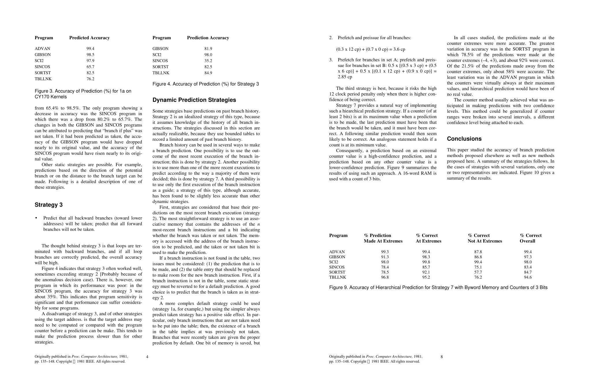

## 从业者评论（补充，不属于原文）

二位计数器解决的是偶发反向结果污染长期偏置的问题。现代实现可用 `prediction_state`、更新使能和错误方向计数验证：循环稳态应保持强 taken，退出时只把状态减弱，下一次进入不应立即翻成 not-taken。它降低的是方向误预测率；若 BTB 没给出目标，前端仍无法及时沿 taken 路径取指。

## 技术演进位置

这篇论文确立了 bimodal predictor（双模态计数器预测器）的基本单元，也提出了置信度分级。它解决了廉价动态方向预测与抗噪声问题；留下了目标地址、跨分支相关性、表冲突、预测延迟与宽取指问题。

---

# 2. Lee 与 Smith 1983：分支预测与 BTB 设计分析

**原文：** Johnny K. F. Lee and Alan Jay Smith, *Analysis of Branch Prediction Strategies and Branch Target Buffer Design*, UCB/CSD-83-121, 1983。

**材料：** [本地 PDF](classic/02_1983_lee_smith_analysis_branch_prediction_btb_design.pdf)；[伯克利官方记录](https://www2.eecs.berkeley.edu/Pubs/TechRpts/1983/6335.html)

## 原文整理

本地文件是 44 页的 1983 年伯克利技术报告，不是题名略有不同、篇幅较短的 1984 年 *IEEE Computer* 版本。扫描件的公开摘要与正文共同表明，研究把“方向是否正确”扩展为完整的 Branch Target Buffer（BTB，分支目标缓冲）设计：前端不仅要猜 taken/not-taken，还要及时拿到目标地址，并决定表项中保存哪些状态。

作者分析 26 条地址 trace，主要来自四类 IBM 370 工作负载——科学计算、商业程序、编译器和 supervisor——另含 CDC 6400 与 DEC PDP-11。论文分别讨论分支类型、过去 taken 行为、工作负载差异、BTB 中是否保存目标、需要多少方向状态，以及 BTB 组织对效果的影响。作者估计，采用 BTB 可使 CPU 性能提高约 5%–20%；这是当时流水线和 trace 模型下的推算范围，不是跨机器恒定收益。

论文的重要认识是：预测命中必须同时回答两个问题。若方向预测 taken 但目标不在 BTB，取指仍会停顿；若 BTB 命中但方向状态错误，则会把取指带到错误路径。表项容量、tag、替换和不同分支类型的优先级因此必须共同设计。

### 正文展开

开篇先枚举当时的分支处理路线：loop buffer、交替/多指令流、预取目标、把目标当作数据提前取、prepare-to-branch 指令、delayed branch、taken/not-taken switch，以及 BTB。作者指出这些办法解决的阶段不同：有些只把目标指令带近，有些要求编译器安排代码，有些仍要等分支地址或条件解析；BTB 的特殊之处是取指阶段以当前指令地址相联匹配，同时返回预测方向和上次目标。论文也讨论用普通 I-Cache、统一相联缓冲或保留近期成功 taken 分支来近似 BTB，但强调若目标供给和方向状态没有一体化，比较很容易失真。

数据部分不是单一 IBM 程序。附录列出 IBM System/370 compiler、business、scientific 与 MVS supervisor 四组 trace，并列出各组程序；另有 PDP-11/70 的 UNIX/编辑器、汇编器、FORTRAN、操作系统等 trace，以及 CDC 6400 的 FORTRAN、控制数据和系统程序。总共 26 条程序地址 trace，来自三种 ISA/机器环境。正文按 opcode 统计静态/动态分支、taken 比例、每条静态分支执行次数、run length 和连续五次方向串；作者专门指出大型工作负载之间差异显著，不能把某个 opcode 的方向偏置跨机器照搬。

方向预测先比较按 opcode、有限过去历史与二者组合。论文把真实分支序列映射成有限状态机，图 5 的状态代表最近历史，图 6 采用更有滞后的状态转移；5 个 workload 上两者都约为 93%–98%，supervisor 因循环回边较少而明显低一些，图 6 在该组更好。把 opcode 概率与过去一至数次方向组合，收益很快饱和；作者据此认为两个状态位足以保存大多数有用的近期信息。目标地址并非永远稳定：正文另统计 target change，因此即使方向正确，也必须在执行后校验 BTB 目标并在改变时重写。

实现部分把四种结果分别计价：无分支、正确预测 taken、错误预测 taken，以及实际 taken 却预测 not-taken。代价由“错误路径已经走多远”和“目标要到哪个阶段才可取得”决定，最优方向阈值因此依赖机器的 penalty，而不一定等同于最高方向准确率。BTB 容量实验采用 LRU stack 模拟并给出 1 项至 4K 项的命中率；不同 workload 的曲线差别很大，但 256 项已在部分负载接近饱和，另一些仍需要更多项。set size 实验说明提高相联度可改善命中，但 tag 比较、替换与 cycle time 也随之增加。

系统问题包括 multiprogramming 与虚拟地址。若 BTB 用虚拟 PC 索引，地址空间切换可能产生错误命中；可以在切换时 flush，也可以加入进程标识，但 flush 自身会损失热状态。写指令流以标记已解析分支可能遇到自修改代码、I-Cache 一致性与旧机器不可接受的问题。作者还介绍 MU5 的 8 项 BTB：它只保存最近 taken 分支及其目标，并测量 ALGOL/FORTRAN 程序中加入 BTB 后的正确后继序列比例。

最后的性能估算使用当时 Amdahl 470V/6 一类机器参数，把 BTB 命中率、约 0.78 的方向正确概率、错误猜测 penalty、taken 比例和基本指令时间代入。结果表分别扫描基本指令执行时间、错误路径 penalty、方向正确率与 BTB 命中率，得出约 5%–20% 的改善范围。附录还逐项解释 System/370、PDP-11/70 和 CDC 6400 的分支 opcode 分类；这些定义是表中“条件分支”和“目标改变”统计口径的一部分。

## 关键图表导读

- 工作负载分类表强调科学、商业、编译器和系统代码的分支行为不同，不能用单一程序定型 BTB。
- BTB 组织图把 PC 匹配、目标字段与动态方向状态放到一条 next-PC 生成链上。
- 性能估算表给出 5%–20% 的范围，意义在于揭示“预测正确率”必须转换成节省的取指停顿，而不是把准确率直接当 IPC。

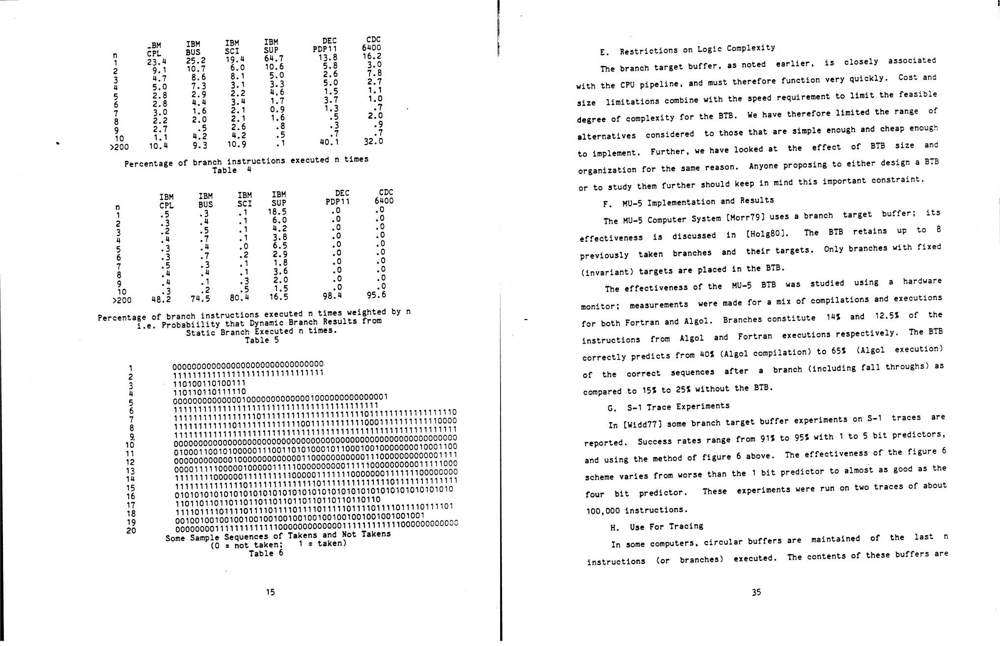

## 从业者评论（补充，不属于原文）

从前端时序看，BTB 是 next-PC 数据通路的一部分：`fetch_pc → tag/index → direction/target → next_pc`。验证时要分别统计方向 miss、BTB miss、错误 target、替换 miss 和由它们造成的 redirect 周期；只看“条件分支准确率”会漏掉目标供给瓶颈。扫描版年代较早，ISA、Cache 与流水线假设和现代宽前端不同，不能用其容量结论直接配置今天的 BTB。

## 技术演进位置

该文把方向预测器推进为完整的分支取指系统，奠定 BTB 研究方法。它解决了预测方向与目标地址割裂的问题；仍留下相关预测、别名、间接目标、返回地址、流水化访问及每周期多分支供给。

---

# 3. Yeh 与 Patt 1991：两级自适应训练

**原文：** Tse-Yu Yeh and Yale N. Patt, *Two-Level Adaptive Training Branch Prediction*, MICRO 1991。

**材料：** [本地 PDF](classic/03_1991_yeh_patt_two_level_adaptive_training.pdf)

## 原文整理

论文提出 two-level adaptive training（两级自适应训练）：第一级为按分支地址选择的 Pattern History Register（PHR，模式历史寄存器），记录最近 `k` 次方向；第二级为含 `2^k` 个有限状态机的 Pattern History Table（PHT），用历史串选择方向计数器。训练在线完成，不依赖离线 profile。

作者比较 Last-Time 与 A1–A4 多种状态机，其中 A2 是二位饱和计数器。第一级表有三种实现：理想、无冲突的 IHRT；带 tag 和 LRU 的 4 路组相联 AHRT；直接散列、允许冲突的 HHRT。实际主配置为 512 项 AHRT、12 位历史与 4096 项 A2 PHT；也评估 256 项版本和不同历史长度。

为避免预测时串行读 HRT 再读 PHT，作者在历史更新时提前访问 PHT，并把下一次预测位缓存在 HRT 项内，使预测路径只查一次第一级表。若同一紧循环的上一次分支尚未解析，默认 taken；这说明更新及时性从一开始就是两级预测器的实现约束。

实验通过 Motorola 88100 trace-driven 模型运行 9 个 SPEC 程序：浮点 doduc、fpppp、matrix300、spice2g6、tomcatv；整数 eqntott、espresso、gcc、li。NASA7 被排除。每个程序最多观察 2000 万个条件分支，gcc 与 fpppp 因完成较早而更短；完整程序动态指令约 5000 万至 18 亿。整数程序动态指令中约 24% 是分支，浮点约 5%；约 80% 的分支指令为条件分支。

512 项 AHRT、12 位历史、4096 项 A2 的平均准确率约 97%，论文把约 3% 的误预测率与此前约 7% 的最好结果对照。Last-Time 大约低 1 个百分点；AHRT 是最好的实用第一级，HHRT 因冲突更差；加长历史一般有效。静态训练换一组数据时准确率下降，li 可下降约 5 点，说明在线适应的重要性。作者给出的比较中，Lee/Smith 式二位预测约 92.5%，last-time 约 89%，BTFN 约 69%，always-taken 约 60%。

### 正文展开

形式化定义中，第一级的 `k` 位历史 `R_{i,c-k}…R_{i,c-1}` 选择 PHT 项，第二级状态 `S_c` 经 Moore 机输出函数 `λ(S_c)` 产生预测，再由真实结果通过转移函数 `δ(S_c,R_{i,c})` 训练。Last-Time 每个历史模式只留上次结果；A1 记录最近两次，只要有一次 taken 就预测 taken；A2 是标准二位饱和计数器；A3/A4 改变弱/强状态的转移惯性。图 5 显示 A2 整体最好，但不是每个程序都绝对占优，这也是论文没有把“二位计数器”与“两级历史”混为同一贡献的原因。

实现章节分别处理第一级容量和预测延迟。AHRT 用 PC 低位选 set、PC 高位作 tag、组内 LRU；HHRT 只散列 PC，不存 tag，省成本但会把不同分支的历史直接混合；IHRT 是每静态分支一项的上界。两级串行查询原本需要先读 HRT 再读 PHT，作者在每次更新 HRT 时用“更新后的历史”预读 PHT，并把下一次预测位缓存在 HRT 项中，从而让取指时只访问一次 HRT；若该分支上一实例尚未解析，紧循环默认 taken。目标侧另区分条件分支、return、PC-relative 无条件分支和寄存器间接跳转：return 可用 return-address stack，PC-relative target 可立即相加，寄存器间接目标仍要等操作数。

trace 章节还给出静态分支数、动态指令类型和动态分支类型分布。模拟不是周期精确 OoO 性能模型，而是 Motorola 88100 指令 trace 驱动的方向正确率比较；所以“约 97%”不能直接换算为某个 IPC。静态训练用一组输入 profile、另一组输入测试，例如 espresso 的 `cps→bca`、li 的 Hanoi→Eight Queens、doduc 的 tiny→完整输入；换输入后损失 1–5 个百分点，证明相同历史模式的最优方向会随数据改变。结论中“比约 93% 方案高 4 点”还被作者解释为误预测次数减少过半，而非性能提高 4%。

## 关键图表导读

- 两级结构图展示“地址选择历史、历史选择状态机”的核心分工。
- HRT 实现图对比理想、组相联与散列组织，首次把相关性收益和第一级别名成本放在一起。
- 历史长度/状态机曲线表明，准确率来自上下文区分与计数器稳定性的共同作用。

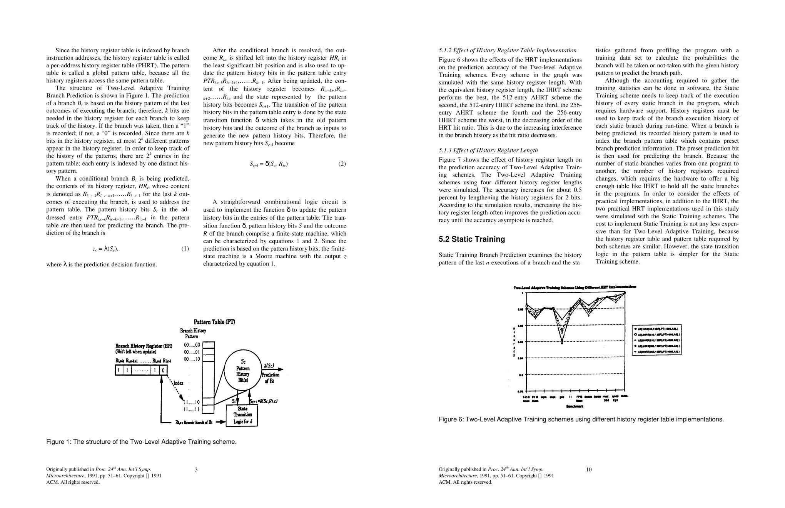

## 从业者评论（补充，不属于原文）

两级预测器解决“同一静态分支在不同控制流上下文中行为不同”的问题。实现验证应区分 HRT 冲突、PHT 冲突、真实无相关和历史尚未更新四种 miss 原因；RTL 中应核对索引生成、历史推测更新、分支解析后的训练、误预测回滚和同周期读写优先级，而不能看到 `bht` 名称就假定其语义。

## 技术演进位置

该文确立了“历史上下文 + 模式表”的相关预测范式，解决了单分支二位计数器看不到跨实例模式的问题；留下了 PHT 随历史指数增长、共享表别名、预测访问延迟和推测历史恢复问题。

---

# 4. Yeh 与 Patt 1992：两级预测器的不同实现

**原文：** Tse-Yu Yeh and Yale N. Patt, *Alternative Implementations of Two-Level Adaptive Branch Prediction*, ISCA 1992。

**材料：** [本地 PDF](classic/04_1992_yeh_patt_alternative_two_level_implementations.pdf)

## 原文整理

论文系统化两级预测器设计空间。第一个字母表示第一级历史的作用域：G 为 global（全局一份），P 为 per-address（每分支）；第二个字母表示第二级 PHT 的作用域：g 为 global，p 为 per-address。因此形成 GAg、PAg、PAp 等组织。

在相同历史长度下，PAp 因每分支拥有独立历史和 PHT，干扰最少、准确率最高；PAg 次之；GAg 最易发生干扰。但固定准确率下结论会反转：达到约 97% 时，GAg 需要约 18 位历史，PAg 约 12 位，PAp 约 6 位；把第一级和第二级总成本计入后，PAg 最经济。这是论文最重要的设计结论：固定一个参数比较，不等于固定硬件预算比较。

实验沿用 9 个 SPEC 程序与 trace 方法，平均准确率约 97%，高于作者汇总的已知方案最高约 94.4%。512 项、4 路 BHT 已接近理想表。论文还模拟上下文切换：或由 trap 触发，或每 50 万条指令切换一次；后者按 50 MHz、1 IPC 对应约 10 ms。切换时清空 BHT、保留 PHT，平均下降不足 1 个百分点，但 gcc 更敏感。

比较结果中，PAg 约 97%，两位 BTB 方案约 93%，profile 约 91%，last-time 约 89%，BTFN 约 68.5%，always-taken 约 62.5%。作者最终推荐 PAg 作为效果与成本的最佳折中。

### 正文展开

论文先给出完整命名规则，而非只列三种常见结构。第一级可以是一份 global history（G）或按地址保存 history（P）；第二级可以是全局共享一张表（g）或按地址分表（p），由此讨论 GAg、GAp、PAg、PAp。`s` 表示第一级可分成若干集合/组的变体。作者用同一组 Moore 状态机定义预测和更新，再把差异限定为“谁共享历史、谁共享计数器”，便于把相关性收益与复制/aliasing 成本分开。

实现章节指出两次表访问对高频流水线不现实，因此可像 1991 方案一样在历史更新时提前查第二级，把预测位缓存在第一级；也可把 target address 与第一级项放在一起，在同一次命中时返回方向和目标。per-address BHT 的现实实现比较直接映射、组相联与 tag；论文的 512 项、4 路配置已经接近 ideal，但第一级 miss、替换和 context switch 仍会破坏历史。对 return、直接跳转和寄存器间接跳转，target 供给方法仍不同，方向正确不代表 next-PC 已准备好。

实验图 6 先在相同配置下比较不同两级组织，图 7 扫 history length，图 8 选择都约达 97% 的代表点，图 9/10 分别测 context switch 与第一级表实现，图 11 再与 BTB、profile、last-time、BTFN、always-taken 比较。固定 `k` 时 PAp 最准，是因为几乎不共享；固定总 bit 或固定目标准确率时，PAp 要复制 `2^k` 个 counter bank，成本反而最大。作者因此选择 PAg，不是声称 PAg 在所有容量和程序上永远最准，而是其 12-bit history、共享 4096-entry PHT 与有限 BHT 在这组 trace 上给出最好的成本/准确率折中。

## 关键图表导读

- GAg/PAg/PAp 结构图是两级预测器命名和资源归属的基础。
- 固定历史长度曲线说明私有化减少干扰；固定准确率成本图却说明私有化会复制状态，两者必须同时阅读。
- 上下文切换图表明历史寄存器比训练后的模式状态更依赖当前执行流。

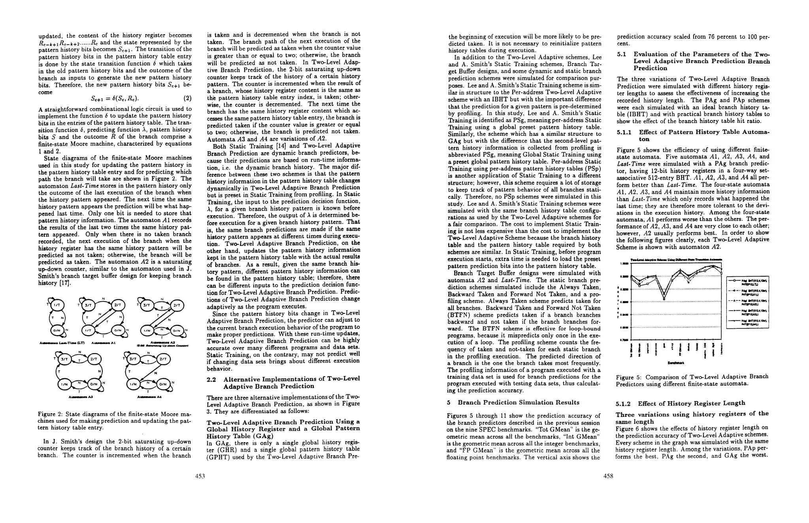

## 从业者评论（补充，不属于原文）

这篇文章给出的不是一个单点电路，而是资源分配方法。工程中应分别预算“上下文状态位”“预测计数器位”“tag/替换位”和读端口；相同 bit 数在不同 SRAM 形状、端口数和访问级数下并不等价。上下文切换实验也提醒，ASID/线程号是否进入索引、切换是否清历史，都属于预测器系统接口。

## 技术演进位置

该文建立 GAg/PAg/PAp 分类并揭示相关性、干扰和复制成本的三角关系。它帮助后续 gselect、gshare、local/global hybrid 形成清晰基线；仍未解决共享表的恶性别名、长历史的指数状态空间和时序问题。

---

# 5. McFarling 1993：组合预测器与 gshare

**原文：** Scott McFarling, *Combining Branch Predictors*, WRL TN-36, 1993。

**材料：** [本地 PDF](classic/05_1993_mcfarling_combining_branch_predictors.pdf)

## 原文整理

论文先比较 bimodal、局部历史、全局历史和 gselect，然后提出两项长期影响最大的机制：gshare 索引与 tournament/combined predictor（竞赛式组合预测器）。

gselect 把 PC 位和全局历史位拼接成 PHT 索引，容易使相关索引集中。gshare 改用 PC 与全局历史按位 XOR，使两个信息源共同影响更多索引位，更均匀地展开上下文。实验表明表容量达到约 256 B 以上时，gshare 通常优于 gselect；极小表中 XOR 也可能增加冲突。

组合器包含两个候选预测器 P1、P2 和一张二位 selector 表。只有 P1、P2 方向不同，且真实结果能判断谁更好时才训练 selector；若两者相同，更新选择器没有信息价值。论文显示 bimodal+gshare 始终好于单独使用其中一个；容量达到 2 KB 以上时，local+gshare 最好，接近 98.1%，而此前比较方案约 97.1%。1 KB 的组合器已接近 16 KB gselect 的效果，体现异质信息源的容量效率。

实验使用 10 个 SPEC89 benchmark，但为限制仿真时间，每个只模拟最初 1000 万条指令；trace 由 DECstation 5000 的 pixie 采集，所有计数器初始化为 taken。论文按容量绘制误预测曲线，同时讨论参数、组相联、方向编码、稀疏历史压缩和编译器 profile 等后续方向。容量数字包含各候选表与 selector，不应只拿其中一张表和其他论文比较，更不能把这里的前 1000 万条结果当作完整程序结果。

### 正文展开

第 3–7 节先建立四条基线。bimodal 是 PC 低位索引二位计数器，容量足够、每分支近乎独占后准确率饱和在约 93.5%；若给 counter 加 tag/组相联，在固定 entry 数下更好，但计入 tag 后未必比简单数组划算。local predictor 先以 PC 选局部历史寄存器，再以局部历史选 counter，最高约 97.1%，代价是两次串行数组访问。global predictor 只用一份全局历史；gselect 再把部分 PC 位与历史位拼接，作者对每个容量挑选最优 PC/history 划分。小于 1 KB 时 gselect 可优于 local，且只有一次数组访问。

gshare 的推导用四种 PC/历史组合说明：拼接只能区分部分组合，XOR 能让所有索引位同时含地址和历史信息。它仍有冲突，只是分布更均匀；256 B 以上 `gshare-best` 小幅超过 `gselect-best`，更小容量时原本就严重拥挤，XOR 反而可能更差。图 11 因而比较的是每个容量调好 history length 的 gshare，而不是固定一个历史长度。

组合器的 selector 也是 PC 索引二位 counter：两候选分歧且第一候选正确时向它移动，第二候选正确时向另一端移动；候选相同则不改变选择状态。图 13/14 分 benchmark 展示 bimodal 与 gshare 的互补，例如 eqntott 主要选择 gshare，而另一些强偏置分支仍选择 bimodal；图 15 把准确率换成两次误预测之间的指令数；图 16 扫总容量，并明确让某些配置的 gshare counter 数是 bimodal 的两倍，以摊薄 selector 成本。1 KB bimodal/gshare 已接近 16 KB gselect-best；2 KB 以上 local/gshare 更好，大容量趋近 98.1%。

未来工作与附录也有实质内容。作者没有穷举数组大小、相联度和 pipeline cost，建议加入前/后向信息、压缩稀疏全局历史，并让编译器用 profile/语义识别相关条件或循环迭代模式。附录把 local counter 索引改成“部分局部历史 + 部分 PC”，以及固定 64、256、1K、4K、16K 个 history register；某些减少 history bit 的配置因第一级更小而改善，但仍未超过单级访问的 bimodal/gshare，并且“history-register 数约等于 counter 数”通常是合理点。

## 关键图表导读

- gselect 与 gshare 索引示意图展示拼接和 XOR 的冲突分布差异。
- 组合预测器框图中，selector 只在候选分歧时学习，这是避免无效训练的关键。
- 容量—准确率曲线说明“两个互补的小预测器”可胜过“一个同类大预测器”。

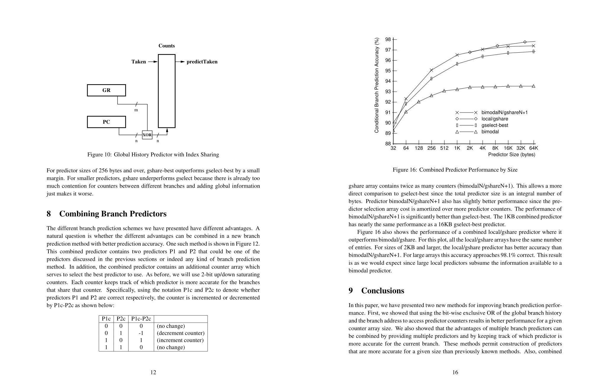

## 从业者评论（补充，不属于原文）

gshare 不是消除 aliasing，而是重新分布 aliasing。验证可对每个 PHT 项记录映射到它的静态 PC/历史组合以及相互训练方向，区分容量冲突和相关性不足。组合器的收益取决于分歧覆盖率与分歧时胜率；若两个候选高度同质，selector 再准也没有收益。

## 技术演进位置

gshare 成为数十年的强基线，tournament 选择则成为 Alpha 21264 等混合预测器的核心思想。论文解决了简单拼接索引和单一预测器覆盖面不足；留下了无 tag 共享表的恶性干扰、chooser 冷启动、预测器并行访问能耗和选择延迟。

---

# 6. Sechrest、Lee 与 Mudge 1996：相关性和别名

**原文：** Stuart Sechrest, Chih-Chieh Lee, and Trevor Mudge, *Correlation and Aliasing in Dynamic Branch Predictors*, ISCA 1996。

**材料：** [本地 PDF](classic/06_1996_sechrest_lee_mudge_correlation_aliasing.pdf)

## 原文整理

论文质疑早期研究过度依赖 SPEC89/92 小程序：程序分支 footprint 小时，预测器表很少遭遇现实程度的冲突，容易高估相关预测收益。作者使用 6 个 SPECint92 用户程序和 8 条 IBS-Ultrix 全系统 trace；后者来自运行 Ultrix 3.1 的 MIPS R2000，包含用户、内核与 X Server。大程序拥有成千上万条静态分支，例如 gcc 约 9531，real_gcc 约 17361。

作者沿两级预测器分类分析 correlation 与 aliasing。对全局历史 GAs/gshare，主要瓶颈可能位于第二级 PHT：不同 PC/历史对相互覆盖，使理论相关性无法兑现。对按地址保存自身历史的 PAs，第一级 history buffer 的冲突更关键；若先丢错了局部历史，后面再大的 PHT 也无法恢复。此前一些研究把两类干扰混为一谈。

结果表明，在有限资源下 aliasing 往往主导准确率；大型应用与系统负载的“实际执行静态分支数”比程序语义标签更能解释压力。大量动态分支仍高度偏置，但庞大代码 footprint 会让少数共享项承受不同方向训练。论文报告条件分支误预测率，并明确警告它不能直接等同于性能，因为分支频率和误预测代价还需另算。

### 正文展开

作者先用地址索引的一行二位 counter 作为“只看当前分支”的基线，再用一列 counter 表示 GAg：固定全局历史模式，观察不同分支共享该列时的冲突。GAs 介于两端，用若干 PC 位选择不同 PHT；gshare 则 XOR PC 与全局历史。图 2–6 逐步增加表资源，区分“更多 history 带来的相关性”和“更多 rows/columns 只是减少冲突”。结果并非所有程序同向：gcc 等大 footprint 对 aliasing 特别敏感，而一些小 benchmark 的相关性收益会把它在平均值中“投票压过”。

gshare 分析还逐项比较实际 predictor 与去掉 aliasing 的理想版本。mpeg_play 的差分图显示某些容量下冲突意外有益，但整体净效应仍是负面；因此 aliasing 必须分成 constructive、neutral 与 destructive，而不能把所有覆盖都视为 miss。对于 per-address history，论文再比较 PAs 的局部历史长度、第二级容量，以及 128–2048 项第一级表：第一级 history 被别的 PC 改写后，会访问完全错误的第二级上下文，故扩大第二级无法补救。

表 3 对三个代表 benchmark 在不同总表容量下列出最佳配置，结论是最佳资源分配随 footprint 改变，没有单一 GAs/gshare/PAs 形状通吃。相关工作部分也解释与 Yeh/Patt 结果的差异主要来自 benchmark、有效静态分支数和是否把一级/二级冲突分开，而不是理论矛盾。

## 关键图表导读

- benchmark 静态/动态分支表显示旧 SPEC 与全系统 trace 的 footprint 数量级差异。
- 不同表容量下的误预测曲线揭示相关性收益何时被 aliasing 吞没。
- 第一级与第二级干扰分解图说明应该把 bit 花在哪个冲突点，而不是笼统“增大预测器”。

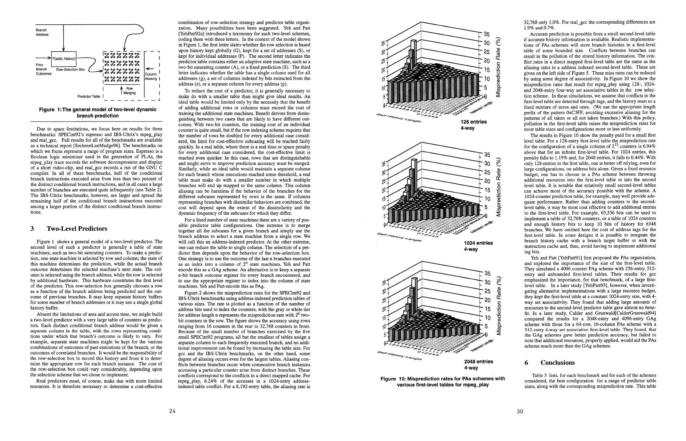

## 从业者评论（补充，不属于原文）

这是方法论论文：预测器在小 trace 上更准，可能只是测试没有装满表。RTL/仿真验证可加入每项所有者签名、覆盖次数、同向/反向覆盖计数，并分别统计第一级历史冲突和第二级方向冲突。系统代码、共享库、JIT 和多进程切换都可能扩大有效 footprint。

## 技术演进位置

该文把“相关性是否存在”与“实现能否无冲突地保存相关性”分开，纠正了 benchmark 方法。它直接推动 Agree、Bi-Mode、YAGS 以及后来 TAGE 的 tag 化；仍留下如何低成本识别和隔离恶性别名的问题。

---

# 7. Agree Predictor 1997：用偏置编码减少负干扰

**原文：** Eric Sprangle et al., *The Agree Predictor: A Mechanism for Reducing Negative Branch History Interference*, ISCA 1997。

**材料：** [本地 PDF](classic/07_1997_sprangle_et_al_agree_predictor.pdf)

## 原文整理

Agree Predictor 为每条分支保存一个 bias bit（偏置位），PHT 不再预测 taken/not-taken，而预测本次结果是否“同意”该偏置。两个真实方向相反、但都高度偏向自身常见方向的分支，映射到同一 PHT 项时都会训练 “agree”，从而把原本的负干扰变成中性或正干扰。

偏置位可放在 BTB 或 I-Cache 元数据中。作者以首次观察到的方向初始化；首次没有记录时可用位移符号推测。PHT 仍可采用 gshare 式索引与二位计数器，预测后再把 agree/disagree 与 bias 解码为最终方向。

实验使用 SoSS 全系统模拟器、Sun4m/SunOS 4.1.4、SPECint95，程序由 gcc `-O3` 编译，每个负载执行 20 亿条指令或运行到结束。gshare 历史长度 10–16 位，PHT 从 1K 到 64K 项，并与理想无干扰预测器比较。以 gcc 为例，Agree 相对 gshare 的误预测减少从 1K 项时 33.3% 降到 64K 项时 8.62%；表越小、分支 footprint 越大，收益越明显。作者还把干扰分为正、中性和负三类，估计从 1K 增大到 64K 所获准确率改善中，超过 71% 来自干扰减少。

Agree 的首次方向偏置接近更昂贵的最优偏置；它还因共享的“同意”状态更快形成而改善冷启动和上下文切换后的训练。

### 正文展开

相关工作把降低 PHT 干扰的办法归成三类：增大表、改变 history/index mapping、把不同分支类别分开。Agree 选择第四条路——不减少冲突次数，而是改变共享 counter 的语义。若两条分支自身偏置相反，传统方向标签会相反训练；改成 `actual == bias` 后，只要它们都走各自常见方向，就共同训练 agree。理论推导还说明偏置越强，负干扰转成中性/正干扰的概率越高；弱偏置分支的收益自然较小。

实验不是只比最终准确率。interference-free 版本为每个 branch/BHR 组合保留独立二位 counter，用作无冲突上界；conventional 与 Agree 都用低 PC 位 XOR BHR 的 gshare 索引。表 1 比较 PHT 从 1K 增至 64K 的准确率增长，表 2 再估计其中多少来自干扰减少、多少来自长 history 的真实相关性。表 3 按“真实 predictor 与无冲突 predictor 谁对谁错”把每次覆盖分为 positive、neutral、negative；结果显示 negative 多于 positive，而 Agree 确实把很大一部分 negative 转成另两类。

冷启动图比较新静态分支前若干次执行。首次执行方向作为 bias 时，相关 PHT 项往往已被其他强偏置分支训练到 agree，所以不必从随机方向重新升温。作者还离线跑两遍 gcc，用整次运行中多数方向设置“最优”bias；表 4 显示它相对 first-time bias 的优势很小。该结果只说明此 workload 上首次方向是廉价近似，不能证明任何新程序的第一样本都可靠。4K 直接映射 BTB 保存 bias，BTB miss/替换后的首次方向与 PHT 状态不同步，也是实现边界的一部分。

## 关键图表导读

- taken/not-taken 与 agree/disagree 编码图是理解机制的核心。
- 正、中性、负干扰表说明表冲突不必然有害，编码可以改变冲突的符号。
- 各容量曲线显示收益随表变大而收窄，证明它主要解决 aliasing 而非创造新相关性。

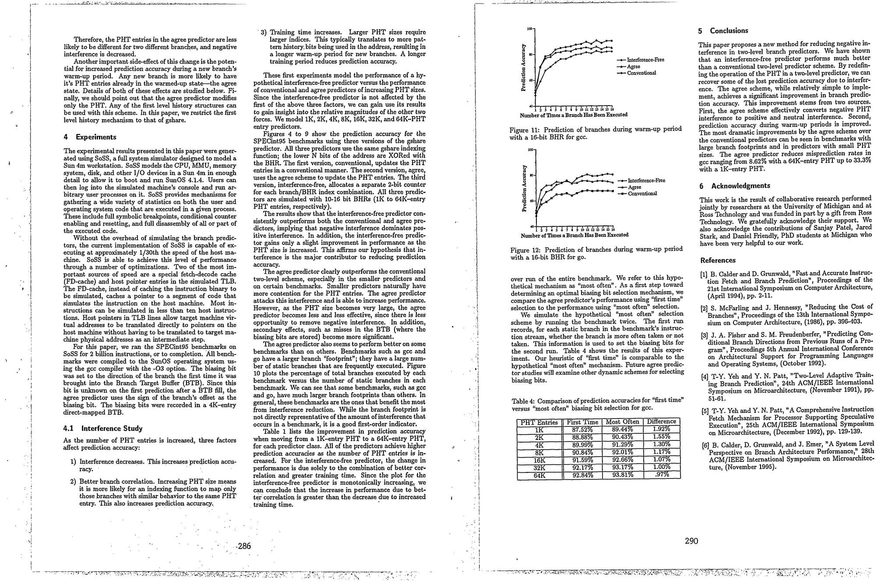

## 从业者评论（补充，不属于原文）

Agree 的精髓是更换学习标签，而不是更换索引。验证时应把 `actual == bias` 作为训练目标，并检查最终 XOR/比较解码；bias 的初始化、迁移和 BTB 替换必须与 PHT 生命周期一致。弱偏置或阶段性翻转分支不会稳定地产生 agree，因此该机制不能替代相关预测。

## 技术演进位置

该文首次系统利用每分支偏置重编码来减少恶性共享，解决无 tag PHT 中相反偏置互相污染；留下偏置位存储、冷启动、弱偏置和复杂上下文模式问题。

---

# 8. Bi-Mode Predictor 1997：按方向偏置分流

**原文：** Chih-Chieh Lee, I-Cheng K. Chen, and Trevor Mudge, *The Bi-Mode Branch Predictor*, MICRO 1997。

**材料：** [本地 PDF](classic/08_1997_lee_chen_mudge_bi_mode_predictor.pdf)

## 原文整理

Bi-Mode 由三部分组成：PC 索引的 choice predictor、taken-direction PHT 和 not-taken-direction PHT。choice 先判断该分支当前属于哪种偏置流；选中的方向表再结合全局历史与 PC 给出最终方向。只有被选中的方向表接受训练，避免另一张表被无关样本污染；choice 在候选信息有判别力时更新，避免错误提供者恰好给出正确方向时产生反向学习。

它要解决的是：全局相关预测器把强 taken、强 not-taken 和弱偏置分支混在同一表中，负干扰会吞掉相关性。Bi-Mode 保留全局历史，但先按动态偏置分区，使两张表中的多数训练更同质。

trace-driven 实验包括 IBS-Ultrix 的 MIPS R2000 全系统 trace，以及用 ATOM 在 DEC 21064/OSF/1 3.0 上采集、采用缩减输入的 SPEC CINT95 用户 trace。论文对 gshare 使用其较强的多 PHT 配置，而非刻意弱化的单表版本。Bi-Mode 在所测容量上平均都优于 gshare；超过 4 KB 后，为达到相同误预测率所需容量不到 gshare 的一半。compress 和 xlisp 等小 footprint/弱偏置程序收益较少，go 的弱偏置也限制效果。

作者把动态分支流分为强 taken、强 not-taken 和 weakly biased，并分析 dominant/non-dominant stream。更长历史可把一些弱模式拆成强模式，却也可能把相反偏置混到同一项；更多 PC 位能减少冲突，却不解决弱流。Bi-Mode 针对这两个问题折中。

### 正文展开

论文首先澄清 gshare 的强基线不是“只有一张固定形状 PHT”。在给定总 counter 数时，PC 位与 global-history 位的多种组合等价于多个逻辑 PHT；作者对每个容量选择平均表现最好的组合，再与 Bi-Mode 比，避免通过弱化基线制造收益。SPEC CINT95 trace 表给出所用缩减输入，IBS 表给出静态和动态条件分支数；用户级与全系统数据来自不同 ISA/OS/采集工具，论文分别画图而未强行合并成一个跨平台绝对值。

机制更新有一个容易漏掉的例外。choice 给出 taken/not-taken 偏置，只有对应 direction PHT 参与方向预测和训练；choice 一般随真实方向更新，但当 choice 的偏置方向与真实结果相反、而被选 direction counter 恰好预测正确时，不应把 choice 朝真实方向推，因为此时全局模式已经作为“例外”被正确识别。这个保护避免 choice 把可预测 exception 错当作偏置改变。

第 4 节用 normalized counter-count 把映射到某项的动态流分成 strongly biased 与 weakly biased，并统计 dominant stream 与 non-dominant stream 的方向翻转。gshare 中相反偏置流经常争夺同一 counter；Bi-Mode 的两张 direction PHT 让 dominant 流落到同一方向域，表 4 显示跨 bias class 的变化显著减少。图 7 将误预测分解到三类流，图 8 单独解释 go：约一半动态分支本身 weakly biased，故仅做方向隔离不够，必须用更长 history 将弱流进一步拆开。这也是 Bi-Mode 在 go 上不是最优的原因，而不是机制失效或实验矛盾。

## 关键图表导读

- choice + 两个方向 PHT 的框图应沿“先分流、后相关预测”阅读。
- 分支偏置分类图说明 Bi-Mode 的优势主要来自隔离 dominant stream。
- 容量曲线显示该方案在大 footprint 下以更少存储达到相同准确率。

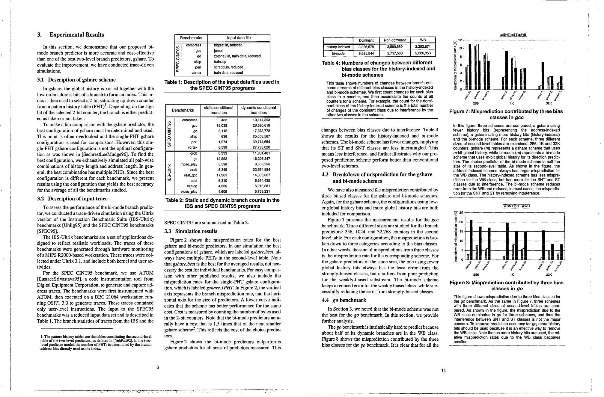

## 从业者评论（补充，不属于原文）

Bi-Mode 是理解 C910 类双模预测器的直接理论入口，但不能仅凭 RTL 中两组表名确认实现。必须核对 choice 索引、方向表索引、哪张表被读写、choice 更新真值表、推测历史及误预测恢复。其吞吐取决于三表能否并行访问，延迟取决于 choice 是否串行选择或候选并行后复用。

## 技术演进位置

该文把偏置隔离实现为可在线选择的双方向预测器，解决 gshare 中相反偏置的破坏性 aliasing，成为许多工业前端的重要方案。它仍受 choice 错误、弱偏置、表端口、长历史表达能力和恢复时序限制。

---

# 9. YAGS 1998：只缓存偏置的例外

**原文：** A. N. Eden and Trevor Mudge, *The YAGS Branch Prediction Scheme*, MICRO 1998。

**材料：** [本地 PDF](classic/09_1998_eden_mudge_yags.pdf)

## 原文整理

YAGS（Yet Another Global Scheme）让一个 PC 索引的 choice/bimodal 表给出默认偏置，只用两个小型带 tag 的 exception cache 保存反例：默认 not-taken 时出现 taken 的分支进入 taken cache；默认 taken 时出现 not-taken 的分支进入 not-taken cache。预测时 tag 命中才使用异常缓存计数器，否则采用默认方向。

与把两类方向都完整复制到大表不同，YAGS 的容量只花在“稀有例外”上。部分 tag 通常为 6–8 位，可选 2 路组相联。tag 防止不同 PC/历史的异常状态被误用；计数器则允许异常本身存在短期噪声。

实验使用 gcc/SunOS 生成并运行到完成的 SPEC95 traces。作者还构造 8 条 trace 每 6 万条指令切换一次的上下文切换实验，并承认频率刻意高于现实。容量计费包括 tag、LRU、历史与方向状态。YAGS 在多数配置下优于或持平于 gshare、Agree、Bi-Mode、skew 和 filter 方案，在 go 与频繁切换时尤其有效。tag 从 6 位增加到 8 位有小幅收益，超过 8 位几乎不再改善；异常缓存占总预算的合适比例随容量变化，小预算约八分之一，大预算可到二分之一。

YAGS 与 Bi-Mode 冷启动较快：异常 tag 尚未命中时，默认 bimodal 仍能工作。作者提出未来可缩小异常缓存，并把节省的位用于更长历史或 tag。

### 正文展开

前置比较覆盖 gshare、Agree、Bi-Mode、Filter 与 skewed predictor。Filter 用强饱和 counter 屏蔽偏置分支，能减少训练污染，却在行为改变时响应慢；skew 用多个不同 hash 模拟相联，减少一部分冲突但需要多表投票；Bi-Mode 完整保存两种方向流。YAGS 的差别是 choice 只保留默认 bias，direction cache 仅保存与 bias 相反的实例，并以部分 PC tag 拒绝无关异常。

预测/更新顺序按默认方向对称。choice 预测 taken 时只检查 not-taken cache，tag miss 就接受 taken 默认，tag hit才用其 counter；choice 预测 not-taken 时只检查 taken cache。命中异常表才更新该异常 counter；choice 负责长期 bias。异常表采用 LRU，但替换还优先清除已经与默认方向重复、因而不再携带 exception 信息的项。二路组相联版本把一位 history/index 让给 LRU/tag 后，相关性减少，收益很小，说明 remaining aliasing 已不是主瓶颈。

结果图 7–9 分别给平均、go 与 gcc。go 在约 0.5 KB 时 gshare 约 69%、Bi-Mode 约 73%、YAGS 约 77%，但这组单点不能外推到所有容量。图 10 比较 6-bit direct-mapped 与 2-way，图 11 是每 60K instruction 强制切换的极端混合 trace，图 12/13 扫 tag width，图 14/15 扫总容量，图 16 改变 exception-cache 占比。平均 SPEC95 在 8-bit tag 后趋于饱和，go 对 6→8 bit 更敏感；继续加到 32 bit 几乎没有收益。未来工作建议用更多 history bit 进入 tag、进一步缩小 exception cache，并把同样的“默认+小型反例缓存”用于其他 predictor。

## 关键图表导读

- 默认预测器加 taken/NT exception cache 的图说明“基线覆盖多数、tagged side table 覆盖少数”。
- tag 位宽曲线说明部分 tag 已能拦截大多数有害别名。
- 上下文切换图应结合其 60K 指令切换假设理解，不能当操作系统实测。

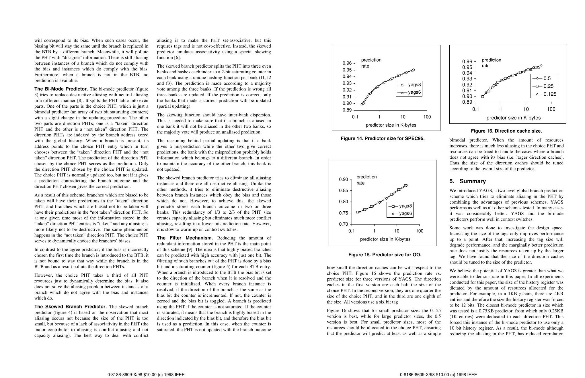

## 从业者评论（补充，不属于原文）

YAGS 把预测器变成“默认值 + 稀疏补丁”，这和 Cache 只存工作集而不存整个地址空间的思路相似。异常项分配、tag 命中、默认/异常更新、替换和恢复必须成套验证；tag miss 时绝不能把未匹配计数器当预测。其 tagged exception 思想直接预示 TAGE 的 provider 表。

## 技术演进位置

该文解决了完整方向表复制的低效率，并用部分 tag 隔离异常状态。它为 tagged predictor 提供了“只保存难例”的关键直觉；留下多种历史长度、provider 选择、替换质量、并行端口和宽取指问题。

---

# 10. Evers 等 1998：两级预测器为什么有效

**原文：** Marius Evers et al., *An Analysis of Correlation and Predictability: What Makes Two-Level Branch Predictors Work*, ISCA 1998。

**材料：** [本地 PDF](classic/10_1998_evers_et_al_correlation_predictability.pdf)

## 原文整理

论文不再只问“哪个预测器更准”，而追问可预测性来自哪里。作者把相关性分为方向相关、路径内相关、多个先前分支共同相关等，并指出循环需要区分动态迭代实例，单纯记录同一静态分支上次结果不够。

实验使用 8 个 SPECint95 程序，按静态分支分类并用理想化组件估计上界。很多分支只依赖前 2–3 个相关分支；若理想地选出最强的单个依赖，gcc 可再提高约 3.7 个准确率百分点，平均约 1.2 点，说明固定位置历史会混入大量无关分支。

按地址历史中的模式被分为 loop-type、固定周期、block pattern 和 non-repeating；约六分之一静态分支属于 loop-type。加入专用 loop 识别后，gcc 约提高 0.8 点，平均约 0.5 点。以简化三类比较，约 55% 静态分支最适合静态偏置、29% 最适合 gshare、16% 最适合 per-address；采用更丰富分类后约为静态 40%、global 38%、per-address 22%。静态最优分支中约 92% 的偏置超过 99%。

作者结论是：不同静态分支真正偏好的信息源差异很大，因此 hybrid predictor 的价值不是平均两个相近结果，而是给分支分配适合的相关域。

### 正文展开

方法部分先定义 correlation：若当前分支在已知一个或多个先前分支结果后，其方向概率显著改变，就存在方向相关；in-path correlation 还要求相关分支确实位于到当前分支的动态路径上。selective-history 上界从最近 16 条中为每条当前分支挑最有用的 1、2 或 3 条，避免把不相关方向塞进固定位置 GHR。只挑 3 条已接近 16-bit interference-free gshare；向前可选范围从 8 扩到 12 明显有效，12→20 缓慢增长，20 后很少再增，说明“重要依赖不多且通常较近”，并不等于任意 workload 只需 20-bit history。

论文用 8 个 SPECint95 程序及列明的输入完整运行，动态条件分支约从 1000 万到 3400 万。作者构造 `gshare w/Corr` 上界：若单一最强 selective correlation 比 gshare 好就选前者。gcc/go 的提升大，平均其余 workload 仍约提高 0.23 point；即便改成 interference-free gshare，仍有约 0.1 point 的未利用相关性，说明位置漂移和训练时间也在限制 gshare，而不只是表冲突。

per-address 部分给三类可执行定义。loop-type 是 `T^nN` 或 `N^nT` 且 `n` 稳定；fixed repeating pattern 在 1–32 周期中选择最佳周期，block pattern 是 `T^nN^m`；non-repeating 则由无冲突 PAS 捕获。loop/block 的计数存于 perfect BTB，`n,m<256`，因此这些分类是可预测性上界，不是等成本硬件。PAS 加专用 loop 在 gcc 约提高 0.8 point、平均约 0.5；即使无冲突 PAS 也会因 history 短于循环长度而错 exit。

最后两组分布回答“混合器为何有效”。只比 gshare/PAS/ideal static 时约 55%/29%/16%；换成 selective global 与多种 per-address 上界后约 40%/38%/22%，且剩余 static-best 中 92% 偏置超过 99%。图 9 排序展示 gcc 的 10% 动态分支上 PAS 可高 7 point，另 10% 上 gshare 可高 10.4 point；因此 chooser 的价值来自分支级巨大差异，而非平均准确率的细小差。

## 关键图表导读

- 单个依赖距离与多分支历史对比图说明“历史长度”不等于“有效相关信息量”。
- 模式分类图揭示循环、周期和块状模式对局部历史的不同需求。
- 最佳预测器分布图说明混合器的潜力来自分支级异质性。

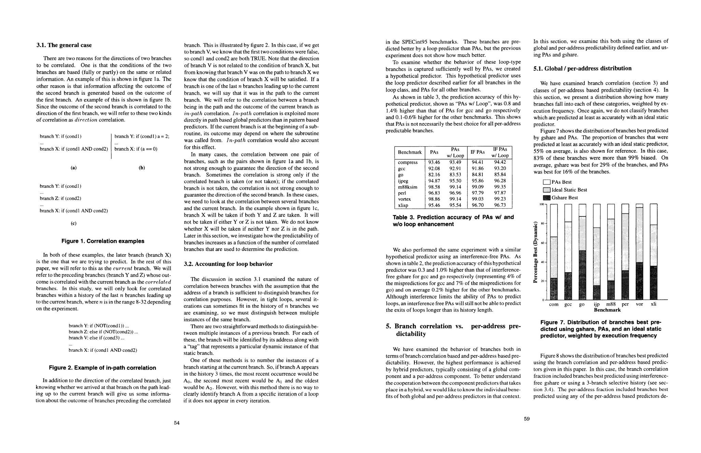

## 从业者评论（补充，不属于原文）

预测器设计应把 feature selection（选择有效特征）与 storage（保存特征对应状态）分开。长 GHR 能覆盖远距离依赖，却可能因位置漂移把同一相关分支放到不同 bit；后来的 IMLI、loop、局部历史、统计修正器和多视角 perceptron 都是在增加特征域。

## 技术演进位置

该文解释了 local/global hybrid 为什么有必要，并为 loop、局部和统计专家提供依据。它识别了无关历史和依赖位置漂移问题；仍未利用数据值、寄存器状态，也未解决复杂特征的延迟与硬件选择成本。

---

# 11. Jiménez、Keckler 与 Lin 2000：预测延迟的影响

**原文：** Daniel A. Jiménez, Stephen W. Keckler, and Calvin Lin, *The Impact of Delay on the Design of Branch Predictors*, MICRO 2000。

**材料：** [本地 PDF](classic/11_2000_jimenez_keckler_lin_impact_of_delay.pdf)

## 原文整理

论文指出，准确率与容量不足以评价预测器；随着时钟加快和线延迟占比上升，大表会跨多个 cycle，晚到的正确预测可能不如及时的稍弱预测。作者用 FO4 延迟与改造的 eCACTI 估算 250–35 nm，比较激进 10 FO4/cycle 与保守 16 FO4/cycle。示例中 180 nm、2 GHz 时，1 KB gshare 已约两周期，32 KB 约三周期；100 nm 时 8 KB 也可达三周期。

模拟器采用 SimpleScalar PISA、类似 Alpha 21264 的 4 发射乱序核，使用推测 GHR、提交时更新 PHT。SPEC2000 整数程序为 gzip、vpr、gcc、mcf、parser、perlbmk、gap、vortex、bzip2、twolf，每个执行 5 亿条指令或到完成。作者还发现 4-wide 推测历史下预测质量明显低于单发射理想序列；约 61% 的预测请求之间至少有一个空闲 cycle，可被分级访问利用。

论文比较三种延迟容忍方案：

- caching：用小 PHT cache 缓存大预测器项，miss 时由备用预测器工作；tag 和替换开销抵消收益。
- cascading lookahead：先根据已预测目标/历史启动未来大表访问，若中间有足够时间就用大表结果。
- overriding：快 PHT1 立即供给方向，慢 PHT2 若不同则稍后重定向；代价是短错误路径。

overriding 整体最好。在激进时钟模型的 35 nm 点，相比普通 gshare 可提高约 10% IPC；传统 hybrid 一旦访问变两周期反而可能最差。结论是复杂预测应移出关键路径，而不是假设表容量增加没有时序代价。

### 正文展开

物理模型用 FO4 把目标 clock 分成 aggressive 10 FO4 与 conservative 16 FO4，再用 eCACTI 扫 250、180、130、100、70、50、35 nm 的 PHT 容量/访问周期。图 3 统计预测请求间隔，超过 60% 的连续请求之间至少空一个 cycle，这给 lookahead 留出时间；图 4/5 则说明随工艺缩小，容量增长没有同步转化成单周期可达容量。论文关注的是片上 wire 与大 SRAM 的相对恶化，不是某个节点数字对现代工艺仍精确。

caching 由小 Address Branch Predictor（ABP）/PHT cache 过滤到大 PHT，miss 或 tag 不命中时用备用方向；cascading 由第一层预测未来 branch address/history，提前启动第二层；overriding 的 PHT1 立即供给，PHT2 若晚到且分歧则 re-fetch。模拟参数表还列出 4-wide fetch/issue/commit、64-entry RUU、32-entry LSQ、分支 penalty、Cache/TLB 等，因而图 8–13 是该 SimpleScalar 核的 IPC，不是只由方向准确率算出的上界。

表 4–6 对每个工艺点搜索 ABP、PHT1/PHT2 和 chooser 尺寸，图 9 统计 secondary structure 实际被使用的比例。caching 的 tag/替换和低 hit usefulness 令它最弱；cascading 在预测间隔够长时能用大表，但 branch-address lookahead 错会浪费访问；overriding 常由快表先走，慢表只在有价值分歧时付短错误路径。准确率曲线和 IPC 曲线排名不一致：hybrid 方向准确率高，却在跨两周期后因每次都等 chooser/大表而损失吞吐。作者还提出 cascading 与 overriding 可以组合，作为未来多级预测路径。

## 关键图表导读

- 工艺节点—表容量—周期数图是全文核心，展示物理延迟如何改变算法排名。
- caching/cascading/overriding 框图对应缓存命中、提前计算和后级纠正三条路线。
- IPC 曲线说明少量短重定向可能优于每次等待高准确结果。

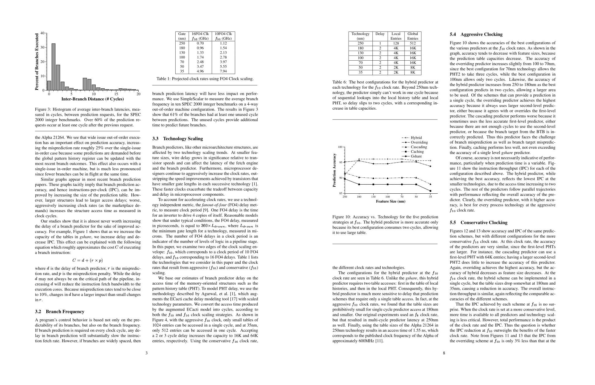

## 从业者评论（补充，不属于原文）

在现代前端里应同时测：首次预测延迟、最终预测延迟、每周期预测分支数、短重定向数、长误预测数和 SRAM/线能耗。overriding 的异常路径是 P1 与 P2 分歧：前端丢弃 P1 之后的年轻取指，但通常不必像执行阶段误预测那样清空整个 OoO 窗口。正确的计数器应把两者分开。

## 技术演进位置

该文把 timing 纳入分支预测的一等设计目标，直接预示 ahead pipelining、分层预测和 CBP-NG。它解决了“更大更准必然更好”的错误假设；留下如何精确提前索引、恢复缺失历史和控制多级能耗的问题。

---

# 12. Jiménez 与 Lin 2001：感知机分支预测

**原文：** Daniel A. Jiménez and Calvin Lin, *Dynamic Branch Prediction with Perceptrons*, HPCA 2001。

**材料：** [本地 PDF](classic/12_2001_jimenez_lin_perceptron.pdf)

## 原文整理

论文把每条分支的预测建模为 perceptron（感知机）分类。PC 索引一组权重，历史方向编码为双极值 `x_i∈{-1,+1}`，另设恒为 1 的偏置输入 `x_0`。计算

`y = w_0 + Σ w_i x_i`

，`y≥0` 预测 taken，否则 not-taken。若预测错误，或虽正确但 `|y|≤θ` 置信不足，则按真实方向 `t` 更新 `w_i ← w_i + t x_i`。输入只有 ±1，因此硬件不需要乘法器，只需条件加减和饱和。

感知机能以与历史长度近似线性增长的权重数表达长相关，而传统 PHT 需要指数状态。其限制是 linear separability（线性可分）：AND 可学习，XOR 不能由单个超平面分开。

SPEC2000 整数实验显示，4 KB 感知机平均误预测率 6.89%，相对 gshare 降低 10.1%；除 crafty、parser 等个别程序外，多数容量点更好。16 KB 时 crafty 仍更适合 gshare。最佳 gshare 历史约 15–18 位，而感知机常用 62 位；8 MB 极大配置中，gshare 约 5.20%，感知机约 4.64%。但若把感知机也限制到 18 位，512 KB 时 gshare 4.83% 反而优于感知机 5.35%，表明感知机优势主要来自廉价使用长历史，而非在短历史上普遍更强。

感知机学习通常比枚举 PHT 模式快，`|y|` 还能自然给出置信度；上下文切换影响更明显，但容量超过 4 KB 时总体优势仍在。作者估计点积可做成 1–2 周期，并建议结合提前/级联技术。

### 正文展开

设计空间不是固定“62 位历史”。对每个 1–512 KB 预算，作者共同搜索 history length、weight width 和 training threshold；最佳感知机 history 从 12 增至 62，权重为 7–9 bit，经验阈值满足 `θ≈1.93h+14`。gshare/bi-mode 对每个预算也穷举 history，hybrid 另计 2 KB Alpha-21264 式 chooser 并搜索两候选容量分配。表容量不含求和逻辑；作者按 die photo 估算长配置逻辑约相当 1 KB SRAM、4 KB 调优点约 256 B，这只是当时 0.25 μm 下的面积近似。

trace 由 gcc 2.95.1 以 `-O3 -fomit-frame-pointer` 编译、在 AMD K6-III/Linux 上通过汇编插桩生成；library/system-call 分支没有被记录。12 个 SPEC2000 integer 使用 `test` 输入，每个最多 1 亿个条件分支，约相当半十亿指令；perlbmk 的多个小输入 trace 串接。调参另用每个 benchmark 前 1000 万分支拼成 composite trace。这些条件解释了为何结果不能与 full reference-input、全系统或现代 CBP trace 直接排序。

图 4/5 给 4 KB、16 KB 的逐程序结果：4 KB 除 crafty、parser 外感知机都胜 gshare，hybrid 因三张表挤在小预算内没有优势；16 KB hybrid 略胜。图 6 只看 gcc 中至少执行 40 次的静态分支前 40 个实例，感知机更快升温。图 7 证明 history 越长，感知机继续改善而 gshare 在约 18 位后恶化；图 8/9 以 10-bit truth function 检测线性可分性，受超指数算法限制，分类本身是近似上界。

附加讨论包括两点。其一，`|y|` 可近似置信，并可决定单路径/双路径投机；其二，权重绝对值可揭示哪些 history position 与当前分支相关，供 profiler 或 variable-length predictor 使用。每 60K branch 在 12 个程序间切换的极端实验中，感知机受污染更明显，但 4 KB 以上仍优于 gshare/bi-mode，hybrid 更稳。实现章节说明 ±1 输入只需并行加减，训练每个权重也可并行；只需先得到总和 sign，其余位可晚到。作者以 54×54 multiplier 类比估计大配置不超过两周期，并建议用 cascading/小 gshare fallback 隐藏延迟。

## 关键图表导读

- 感知机数据通路图展示 PC 选权重、历史控制加减、求和定方向。
- XOR 线性不可分示意图明确指出算法表达边界。
- 容量与历史长度曲线应一起读：长历史效率而非“神经网络”标签才是主要收益来源。

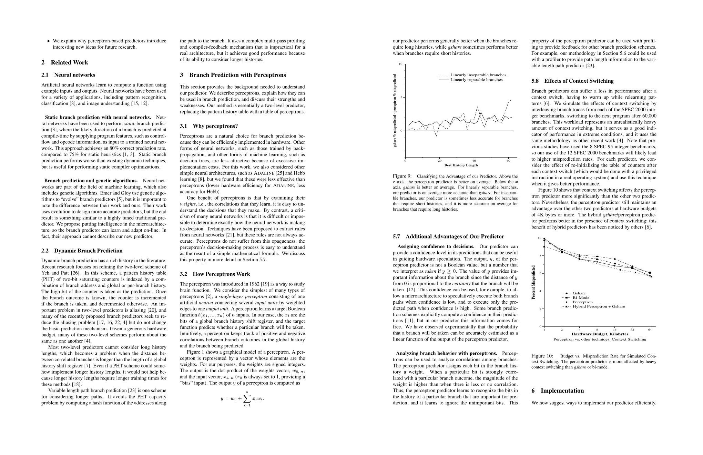

## 从业者评论（补充，不属于原文）

点积延迟、加法树布线和多分支并发访问是实现核心。可从 RTL 检查权重位宽、饱和、训练阈值、索引 aliasing、部分和流水级和误预测恢复。`|y|` 高只表示模型确信，不保证线性不可分模式正确；置信度必须用实际胜率校准。

## 技术演进位置

该文开辟神经分支预测路线，解决传统两级表无法经济容纳长历史的问题，并提供自然置信度。它留下线性不可分、点积延迟/能耗、权重 aliasing、推测更新与宽前端吞吐问题，后续由 piecewise linear、O-GEHL、MPP 等扩展。

---

# 13. Seznec 2005：O-GEHL 分支预测器

**原文：** André Seznec, *Analysis of the O-GEometric History Length Branch Predictor*, ISCA 2005。

**材料：** [本地 PDF](tage/13_2005_seznec_o_gehl.pdf)

## 原文整理

O-GEHL（Optimized GEometric History Length）用多张计数器表同时观察不同长度的历史。第 `i` 张表以 PC 和长度 `L_i` 的全局/路径历史散列索引，`L_i` 近似按几何级数增长；读出的有符号计数器相加，和的符号给出方向，绝对值代表置信度。典型实现使用 4–12 张表，论文重点配置约 8 张；长历史可到 100–200 级别，却不需要一张 `2^L` 的 PHT。

训练在误预测或 `|sum|` 低于阈值时进行，相关计数器按真实方向加减。作者提出 dynamic history length fitting（动态历史长度拟合），在运行时调整最长历史范围；又提出 dynamic threshold fitting（动态训练阈值），使更新率在欠训练与饱和之间自适应。实验显示 4 位计数器最具成本效率，4/5 位混用可进一步折中；在 64 Kbit 附近，最大历史 125–300 的宽范围都较稳健。

评测使用 CBP-1 的 20 条 trace，分 server、multimedia、SPECint、SPECfp 四类，每条约 3000 万条指令，包含系统活动；不同 trace 连接运行且预测器不清空。指标为每千条指令误预测数。历史除条件方向外还把非条件控制转移按 taken 纳入，并混入少量地址/path 信息，最长 path history 为 16。

论文还给出 ahead-pipelined O-GEHL。一个 64 Kbit 参考实现可把索引、表读和求和分成约 3 个 stage。预测器在 X 个 block 之前预计算中间分支组合对应的部分结果，等缺失路径明确后选择；恢复时需 checkpoint 相应预测状态。3-block ahead 相对直接版本的损失从 32 Kbit 时约 0.16 misprediction/KI 降到 1 Mbit 时约 0.06。

### 正文展开

评估框架对初始化有专门说明。20 条 CBP-1 trace 串联运行，表 counter 不在每条 trace 前清零；若逐条清零，64 Kbit 参考配置平均只差约 0.03 misp/KI，但 predictor 越大、counter 越宽，差异会增大。指标是 20 条 trace 总误预测数除总指令数，不是 20 个 per-trace MPKI 的简单算术平均。短历史容易发生 path aliasing，所以 global history 也把无条件控制转移记为 taken，并另保留每分支 1 个地址 bit、最多 16 位的 path history。

动态历史拟合不是连续改一个 `Lmax`。8-table 例子预先构造 11 个几何长度，只让 T2/T4/T6 在短、长两个候选长度间切换；最长表抽样保存 1-bit tag，用 9-bit aliasing counter 观察“误预测且高置信时 tag 是否相符”，饱和后整体切到长或短集合。切换会让三张表冷启动，但其他五张保持温热。动态阈值则用一个饱和 counter 让“错误更新次数”和“低置信正确更新次数”大致平衡；aliasing 高时小幅值增多，算法会降低阈值，减少正确样本反复写表造成的破坏。

设计空间图依次扫描 table 数、history series、path 信息、几何/线性长度、counter width 与 threshold。4–12 张表都可工作，8 张是参考折中；4-bit counter 最省位，部分 5-bit 表可略好；几何长度相对线性更稳健。搜索最佳历史序列用了约 20 台双处理器机器运行数日，作者明确承认其结果对这组 benchmark 有偏，因此更重视 125–300 最大历史范围内的宽平台，而不是唯一最优点。

ahead 部分把 `X`-block 提前访问分成两步：在 `T0-X` 用当时 PC/history 并行算出 `2^m` 种中间路径候选，在 `T0` 得到实际 `m`-bit 路径向量后选择。中断或误预测后的 `X-1` 个 block 若要无额外停顿恢复，需要连同 checkpoint 保存这些候选。候选数要求相邻 SRAM word 多读和复制部分加法逻辑；O-GEHL 的 adder tree 比 2bcgskew 更贵，所以论文认为 `m≈3–4` 才是现实范围。

## 关键图表导读

- 几何历史长度图说明少量表同时覆盖短、中、长相关域。
- 求和数据路图应结合表数和 counter 位宽阅读：表越多不只增加 bit，也增加加法与布线。
- 动态阈值/历史拟合曲线说明稳健性来自在线调参，而非唯一“神奇”参数。
- ahead-pipelining 图展示提前访问、缺失历史选择和 checkpoint 三者必须成套。

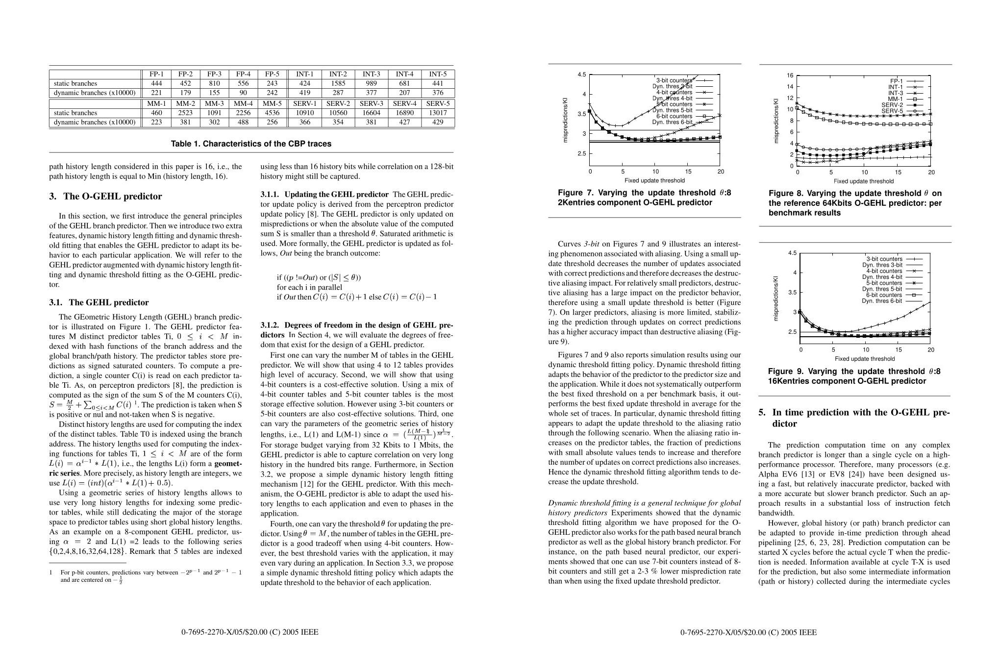

## 从业者评论（补充，不属于原文）

O-GEHL 把多个弱相关证据做线性集成；它比单个感知机更自由地散列不同历史窗口，也比枚举 PHT 更节省长历史状态。实现计数应包括各表读写、加法树切换、阈值训练次数、提前预测选择错误和恢复 checkpoint。只有容量相同而不计加法器、线长和流水寄存器的比较是不完整的。

## 技术演进位置

该文建立“几何历史 + 多分量求和 + 动态阈值”的路线，是 TAGE 历史配置和 Statistical Corrector 的直接先导。它解决了长短历史兼顾与参数稳健性；留下加法树延迟、无 tag 表干扰和 ahead 选择复杂度。

---

# 14. Seznec 与 Michaud 2006：原始 TAGE

**原文：** André Seznec and Pierre Michaud, *A Case for (Partially) TAgged GEometric History Length Branch Prediction*, JILP 2006。

**材料：** [本地 PDF](tage/14_2006_seznec_michaud_original_tage.pdf)

## 原文整理

TAGE 由一张无 tag 的 bimodal base table 和 `M` 张 tagged component 组成。各 tagged 表使用几何增长的历史长度；每项保存部分 tag、3 位有符号方向计数器和 2 位 useful（`u`）计数器。论文示例的 8 个历史长度为 `{0, 2, 4, 8, 16, 32, 64, 128}`。

所有表并行查询。tag 命中且历史最长的表是 provider；次长命中表或 base 是 alternate。provider 通常给最终预测，但刚分配、方向计数器很弱时可由 chooser 决定是否采用 alternate。`u` 只在 provider 与 alternate 分歧时更新：provider 正确则提高 useful，错误则降低，从而把“是否提供独特价值”而不是“是否经常被访问”作为替换依据。

误预测时，先训练 provider，再尝试在更长历史的表中分配至多一个 `u=0` 项；若找不到可替换项，就降低候选项的 `u`，为未来分配创造空间。作者避免相邻表连续分配造成 ping-pong，并提出全表 `u` 的分阶段清零：每 256K 分支交替清一列 bit，而非同周期清空所有项。新分配项被初始化为弱方向，在它证明自己之前 alternate 可继续工作。

评测使用与 O-GEHL 相同的 CBP-1 20 条、每条约 3000 万指令、含系统活动的 trace，预测器跨 trace 保留状态并在分支后立即更新。等容量下 TAGE 优于 O-GEHL；文中 128 Kbit、8 component 的 TAGE 已接近或超过约 512 Kbit O-GEHL。作者认为部分 tag 加 longest-match 选择，比多表求和在存储和组合逻辑上更高效。

论文还把相同思想扩展到间接分支目标，称为 ITTAGE：表项保存 target 和置信度，最长 tag match 提供目标。144.5 Kbit、8 component 的例子少于 3.9 万次间接误预测（约 2%），对照 154 Kbit cascaded 约 6.5 万次（3.4%）。COTTAGE 则尝试让条件方向与间接目标共享表和逻辑。

### 正文展开

实验沿用 CBP-1，但正文明确两个理想化口径：trace 模拟在分支后立即更新，而真实处理器通常到 resolve/commit 才更新；20 条 trace 串联且不清表，64 Kbit TAGE 与逐条 reset 约差 0.03 misp/KI。global/path history 都推测更新，建议用环形缓冲保存数百位历史；误预测恢复只需恢复 head pointer，而不是复制整根 history。表 1 同时列条件分支与间接跳转的静态/动态数，后半 ITTAGE 的 workload 权重由此而来。

5-component 与 8-component 的标准容量公式分别让 base 有 `2^(n-4)` 项，tagged 表有 `2^(n-6)`/`2^(n-7)` 项，tag 为 9/11 bit，每 tagged entry 另有 3-bit `ctr` 和 2-bit `u`。图 2 给出 64 Kbit 时 8-component TAGE 2.61 misp/KI、O-GEHL 2.83；1 Mbit 为 2.05 对 2.27；128 Kbit TAGE 2.36 已接近 512 Kbit O-GEHL 2.34。超过 8 个 component 的额外收益很小。原 PPM-like 方案在 trace chaining 下暴露出 `u` 长期锁死和多项分配污染；smooth `u` aging、每次最多分配一项和非相邻/概率偏向近表，合计解释了大部分差距。

新分配项的 alternate 选择利用编码而非额外 valid 位：`u=0` 且 3-bit counter 为弱态可近似“刚分配”，一个 4-bit 全局 monitor 决定此类命中是否暂用 altpred。history 参数图显示 TAGE 对 `L(1),Lmax` 有较宽容忍；tag 图说明长 tag 减 false match，却减少 entry 数，不能无限增宽。表 3 将 partial tagging 与 O-GEHL adder tree 等容量比较，tagged longest-match 在所测范围约有 0.12–0.20 misp/KI 优势。counter width、`u` width、组相联也分别扫过：2-bit `u` 是稳健点，方向 counter 过宽收益有限，表内相联度带来的命中改善不足以抵消 entry/tag 成本。

实现章节把访问拆成 index/hash、SRAM read、并行 tag compare 与 provider mux。3-block-ahead 的 64 Kbit TAGE 为 2.73、直接版 2.61 misp/KI；1 Mbit 时 2.08 对 2.05，差距随容量变小。commit 更新最坏需要 prediction read、commit read 和写两个 component，但可 checkpoint provider 编号、`ctr/u` 和候选 `u==0` 信息去掉 commit reread；正确且 counter 已饱和的 silent update 也可不写。因此 2/4-bank 单端口或双端口组织比真正多端口表更现实。

按 CBP 64 Kbit+256 bit 规则，base 采用 8K prediction bit+2K、每四项共享的 hysteresis；5-component tag 为 8/8/9/9 bit，8-component 为 9/9/10/10/11/11/12 bit，history 分别 `{5,15,44,130}` 与 `{5,9,15,25,44,76,130}`。两者为 2.678/2.553 misp/KI，对照 CBP O-GEHL 和 Gao-Zhou 都约 2.820；表 4 仍保留逐 trace 差异，有些 FP/INT 项并非 TAGE 最好。

ITTAGE 的 base/side entry 分别存 32-bit target+1-bit confidence，以及 partial tag、target、confidence、2-bit `u`；tagged 表约用 9/11-bit tag。server 5 traces 共有约 130.9 万次间接跳转，频率 8.9/KI，而 64 Kbit TAGE 的条件误预测约 2.15/KI，说明 target 不能忽略。COTTAGE 每一行放一个较大的 indirect-target entry 与多个较小 direction entry，共享 index/tag 计算和表；不同任务的最优几何长度不完全相同，但两类预测器对参数都较稳，5-component 共享结构因此被作者视为比另加 3–6 张独立 ITTAGE 表更划算。

## 关键图表导读

- TAGE 总体图要沿 base、多个 tagged table、provider/alternate 选择阅读。
- 分配与 `u` 更新伪代码是机制正确性的核心，不能只看预测路径。
- 容量曲线显示 tag 位虽然有开销，却通过隔离无效上下文提高状态利用率。
- ITTAGE/COTTAGE 图说明 longest-match 可推广到目标预测，而不只是一位方向。

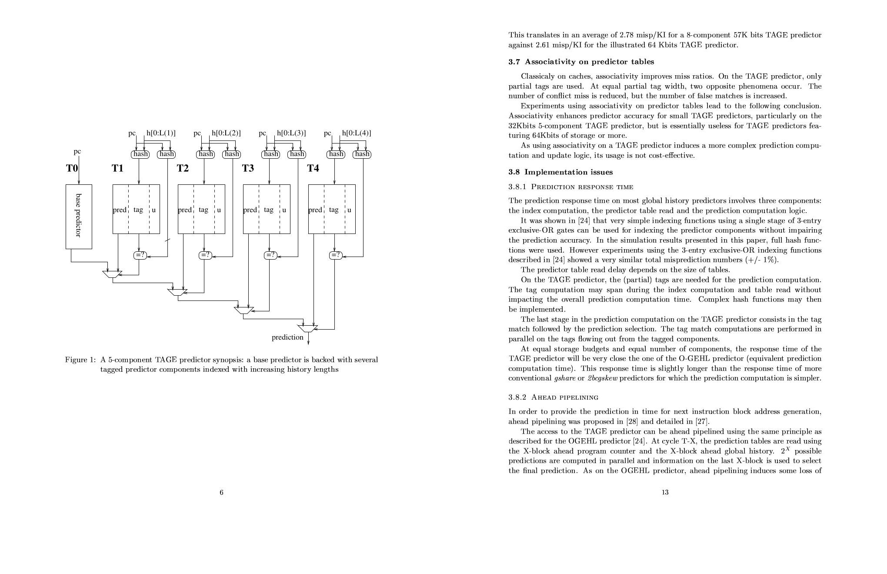

## 从业者评论（补充，不属于原文）

TAGE 的本质是可变阶上下文缓存：长历史项精确但复用少，短历史项泛化强但易混淆。验证不能只比较预测值，应逐次核对 hit vector、provider、alternate、`u` 变化、分配候选、随机/周期衰减和错误路径历史回滚。tag 只降低 false hit，不消除 index 冲突和容量淘汰。

## 技术演进位置

该文把 YAGS 的 tagged exception 直觉与几何历史合并，形成现代 TAGE 主干。它解决了 O-GEHL 无 tag 干扰和求和复杂度；留下本地/循环/统计偏置、表访问时序、多预测端口以及 provider 更新及时性。

---

# 15. Seznec 2011：重新论证 TAGE

**原文：** André Seznec, *A New Case for the TAGE Branch Predictor*, MICRO 2011。

**材料：** [本地 PDF](tage/15_2011_seznec_new_case_for_tage.pdf)

## 原文整理

论文一方面改进 TAGE 准确率，另一方面回答它能否以现实 SRAM 端口和访问次数实现。若每次预测读、退休时再读改写并写回，每条分支会产生大量端口压力。作者观察到，正确预测时很多方向状态无需改写，可进行 silent update；各表按地址交错到单端口 bank，也可让预测和退休访问错开。实验平均只需约 1.13 次表访问/退休分支。

论文使用 CACTI 6.5 估算：4-way interleaving 可让相关结构面积约缩至原先三分之一左右，单次读功耗接近减半。数字依赖当时工艺模型，但结论是表的物理形状和端口数远比“总 bit 数”重要。

准确率部分加入多个侧机制：

- Immediate Update Mimicker（IUM）：若同一表项对应的同一分支已有已执行、未退休实例，就临时使用其结果，减轻延迟训练。
- Loop predictor：捕获固定迭代次数。
- Statistical Corrector（SC）：对 TAGE 的弱或有偏差结论做统计修正。
- Local-history Statistical Corrector（LSC）：用 32 项局部历史表与 5 张、每张 1K 项的 6 位 GEHL 表，历史长度 `{0,4,10,17,31}`；还需管理推测局部历史。

评测用 CBP-3 的 40 条、每条约 5000 万 uop 的 trace，类别包括 client、integer、multimedia、server、workstation，含用户与系统活动，指标为 MPPKI。7 条困难 trace 贡献约四分之三误预测。LSC 在与 TAGE 分歧时有超过 70% 的正确率；TAGE+IUM+LSC 总计约 559 MPPKI。512 Kbit TAGE-LSC 约 562，对照 ISL-TAGE 581、CBP 参考 568；128–512 Kbit 组合可达到大约 4–8 倍容量纯 TAGE 的水平。

作者也提醒，竞赛赢家常含不现实的参数技巧；论文目标之一是说明可实现折中，而非把每个组件原样堆入产品。

### 正文展开

参考 TAGE 本身是 64 KB：13 component，history series `(6,2000)`；base 为 32K prediction bit+8K hysteresis，T1 2K 项、T2–T7 各 4K、T8–T9 各 2K、T10–T12 各 1K，tag 随表号增至约 15 bit。大预算下误预测可在非连续长表最多分配四项以缩短升温；`u` 改成 1 bit，并用一个 8-bit 成功/失败 counter 在分配持续失败时清全部 `u`。这与 2006 小预算“一次只分配一项、2-bit u 平滑老化”不同，是容量/配置差异而非观点冲突。

延迟更新章节用紧循环说明三种策略。若 commit 时 reread SRAM，可把旧 prediction-time 值与其他已退休更新合并；若只用 prediction-time 快照，连续实例会反复从同一旧 counter 更新，误预测更多；若仅在误预测时 reread、正确时省读，损失很小。再去掉已饱和 counter 的 silent write，平均每退休分支只剩约 1 次预测读、0.04 次退休读和少量写，合计约 1.13 次 table access。完全去掉退休 reread 的方案约到 599 MPPKI，不推荐。

4-way bank interleaving 让连续预测映射不同单端口 bank，代价是同一静态分支在不同时间位置可能训练多份 entry、升温变慢。CACTI 6.5 给出的约 3.3×面积缩小和约一半 read power 是模型估算；512 Kbit TAGE-LSC 全部交错后约 569 MPPKI，相对未交错点有数个 MPPKI 损失。把“省正确预测退休读”也用于 local component 会再损约 4 MPPKI，只用于 TAGE 则约 2，说明 local history 对及时复合更新更敏感。

IUM 是每个在途已执行分支的旁路记录：只有 PC、provider table 和 entry 都匹配时，年轻实例才用最近已执行结果；退休或 flush 后记录失效。loop 表每项存 tag、迭代计数、当前迭代、置信、age 和方向。SC 的核心 bias 表按 PC、TAGE 方向和置信学习“在这种 TAGE 输出下是否有统计反向偏置”，而非独立再做一次全局预测。LSC 需为 speculative local history checkpoint/rollback；作者指出它与 IUM 都要相联搜索在途分支，现实设计可共享部分结构。

容量曲线从 128 Kbit 扩到 32 Mbit：纯 TAGE 与 TAGE-LSC 最终都饱和，但 128–512 Kbit 的 LSC 组合相当于约 4–8× 容量纯 TAGE。CLIENT02 在 2–8 Mbit 突然改善，是两条分支有数千个重复 pattern，并非一般 scaling law。与 CBP-3 的 FTL++/OH-SNAP 比较时，TAGE 系在 33 条易 trace 更好，神经方案在 7 条最难 trace 略好；论文据此把未捕获的相关性视为后续研究空间，而没有宣称 TAGE-LSC 全面支配。

## 关键图表导读

- bank interleaving 与访问时序图说明如何用单端口 SRAM 支撑预测/更新。
- IUM 图展示“已解析但未退休”的结果如何旁路到预测器。
- LSC 结构与消融图说明少量局部专家可纠正纯全局 TAGE 的系统性残差。

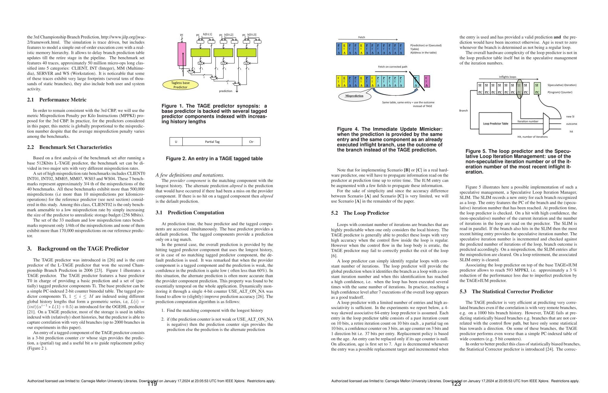

## 从业者评论（补充，不属于原文）

IUM 解决训练延迟而非历史长度：同一热点分支在前一实例尚未提交时再次被取到，正式 SRAM 状态仍旧，旁路最新已知结果可少错一次。RTL 需核查结果有效期、同 PC/同项匹配、flush 后清除和多实例优先级。局部历史的真正成本往往是 checkpoint/rollback，而不只是历史表位数。

## 技术演进位置

该文把 TAGE 从竞赛算法推进到端口、访问与侧专家共同设计，并形成 TAGE-SC-L 的直接基础。它解决了更新端口和局部残差问题；留下多组件时序、能耗、局部历史恢复与复杂 chooser。

---

# 16. Seznec 2014：TAGE-SC-L

**原文：** André Seznec, *TAGE-SC-L Branch Predictors*, CBP-4 2014。

**材料：** [本地 PDF](tage/16a_2014_seznec_tage_sc_l.pdf)

## 原文整理

论文提交三档容量：32 Kbit、256 Kbit 和“quasi-unlimited”但小于 2 Gbit；在 CBP-4 trace 上分别约 3.315、2.365、1.782 MPKI。它确立 TAGE-SC-L 的三层架构：TAGE 负责大多数分支，SC 在统计证据足够时确认或翻转 TAGE，L 专门预测规律循环。

32 Kbit 配置把预算主要给 TAGE，只保留极小 loop predictor 和 Corrector Filter。256 Kbit 配置约有 45 Kbit SC，使用局部、全局和与 return 相关的历史。无容量限制版本加入更多 global、path、local、skeleton 等历史，目标是探索可预测性上界，而非可制造产品。

TAGE 仍采用 provider/alternate、`USE_ALT_ON_NA` 和基于 useful 的分配。Loop predictor 在小、中、无限配置中的相对收益约 1.2%、1% 和 0.4%，说明主预测器越强，独立循环组件的边际收益越低。SC 以类似 GEHL/感知机的多个有符号计数器求和，捕获 TAGE longest-match 未能表示的统计偏置。

256 Kbit 版本的局部相关组件约占 30 Kbit，移除后误预测明显上升；但它需要维护推测局部历史。无限版本一次可累加约 460 个 counter，作者用它展示上界，不表示现实前端能在一个周期完成。

### 正文展开

TAGE 细节随预算变化。有限配置方向 counter 为 3 bit、`u` 为 2 bit；no-limit 方向 counter 为 5 bit、tag 统一 16 bit。弱 provider 可由按 PC 选择的 `USE_ALT_ON_NA` 决定 altpred；正确但低置信时 alternate 也训练。误预测分配在有限配置可为 1–2 项并随当前误预测压力调节，无限配置则多项分配以缩短大表升温；候选不能是相邻 table。32 Kbit 使用 TICK 驱动的概率 `u` 衰减，256 Kbit 用平滑清零，说明替换策略也是容量相关参数。

32 Kbit 提交的 TAGE history 为 `{4,9,13,24,37,53,91,145,226,359}`，entry 数在 64–256 间，tag 7–13 bit；TAGE 含历史约 31,639 bit，loop 624 bit，Corrector Filter 832 bit，总 33,465 bit。Corrector Filter 是 64 项相联表，记录 TAGE 的特定 PC/方向错误，而不是多表求和 SC。256 Kbit 的 15 张 TAGE 表 history 最长 1347，entry 从 2K 到 128、tag 7–15 bit，TAGE 214,376 bit；loop 1,248 bit；MGSC 46,809 bit，总 262,433 bit。

256 Kbit MGSC 除 bias 外，含 global conditional history、return-stack-associated history，以及一张 256-entry 和两张 16-entry local-history 组件。完整 SC 使 TAGE-L 的误预测降低约 6.8%；只保留三个 local 组件约为 2.401 MPKI，只保留 global+return 约 2.452，完整是 2.365；把所有 GEHL 表翻倍只到 2.338，边际收益已很小。源码的 `REALISTIC` 变体用 12 张等大小 TAGE、4 global SC+4 local SC，约 2.430 MPKI，只比提交多 2.7%，用于说明表数可大幅简化。

no-limit 消融逐项界定贡献：只保留 TAGE 比完整多 23.5% 误预测；把 tagged table 减至 20 张，完整系统只多 0.4%，因为 SC 接走了一部分残差；完全移除 TAGE、只留 perceptron-like local/global 结构则多 4.7%。去 loop 多 0.4%；不用 chooser、永远采用 SC 多 3.2%；bias 不把 TAGE output 混入索引多 1.6%，是单张最重要的 SC 表；去 local 多 3.9%，去 global/path 组多 3.7%，单去 skeleton 只多 0.4%，说明多种 global 特征高度重叠。与同届 poTAGE-SC 相比仍多约 5% 误预测，作者也保留了这一负面边界。

## 关键图表导读

- TAGE、SC、L 的分层图说明三者不是简单投票：主预测、修正和高置信特例各有职责。
- 三种容量的组件分配表展示预算改变后结构也改变，不能把结果只归因于“更大”。
- 消融结果说明 local/SC 在大预算下接管 TAGE 的残余错误。

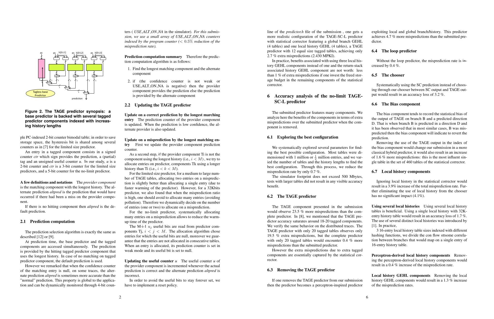

## 从业者评论（补充，不属于原文）

SC 解决“某个最长历史项命中但方向仍存在可累积偏差”的问题。它的异常路径是 override：SC 晚到时可能触发短重定向；若和 TAGE 同周期，则加法树与阈值选择进入关键路径。应分别统计 SC 覆盖率、分歧正确率、净挽救数与新增误预测，不能只报最终 MPKI。

## 技术演进位置

该文正式建立 TAGE 主干、Statistical Corrector 和 Loop 专家的模块化范式，解决单一 longest-match 无法覆盖所有统计域的问题。它留下竞赛上界与可实现硬件之间的巨大表数、端口、加法、checkpoint 和能耗差距。

---

# 17. Seznec 2016：TAGE-SC-L Again

**原文：** André Seznec, *TAGE-SC-L Branch Predictors Again*, CBP-5 2016。

**材料：** [本地 PDF](tage/16b_2016_seznec_tage_sc_l_again.pdf)

## 原文整理

CBP-5 设 8 KB 和 64 KB 两档，论文在训练集分别报告约 4.991 与 3.986 MPKI。8 KB 版总计 67,349 bit：TAGE 58,165 bit，base 为 8K prediction bit 加 2K hysteresis，tagged bank 包括 `9×128×13 bit` 与 `17×128×17 bit` 的交错逻辑组织；global history 1000、path history 27；8 项 loop predictor 约 312 bit；SC 约 8,872 bit，含 10 张 `128×6` counter 表。

64 KB 版共 523,355 bit：TAGE 463,917 bit，tagged 组织约为 `10×1K×12 bit` 与 `20×1K×16 bit`，global history 3000、path 27；loop 32 项、约 1,248 bit；SC 58,190 bit，包含 2 张 1K、8 张 512、9 张 256 和 1 张 128 项表。

SC 首先有多张 bias 表，再使用多种 GEHL 特征：全局条件方向、后向分支历史和局部历史；大配置还加入 IMLI（Inner-Most Loop Iteration，最内层循环迭代）相关与更多局部表。各计数器多为 6 位，训练阈值、分量权重和 TAGE/SC chooser 动态适应。TAGE 采用部分组相联/交错 bank 以更有效共享不同历史长度。

消融中 loop predictor 只改善约 0.3%；SC 对小配置约贡献 6%、大配置约 8% 的误预测下降。作者明确承认冠军配置的表数和 tag 组织不现实，较简单的实现也能处于相近准确率区间，因此不能把竞赛代码直接当产品 RTL。

### 正文展开

2016 版首先改变 history 表示：全局向量对 direct branch 混入 2 bit、indirect branch 混入 3 bit，把方向与部分 path 合并，而不是一条控制转移只记一位。base 仍共享 hysteresis。64 KB 配置把 `u` 缩成 1 bit；全局衰减会让所有 entry 同时失去保护，所以只有 `u=0` 且方向 counter 不够强的项能直接替换，较强项先被减弱。8 KB 配置偶尔把新项 `u` 初始化为 1，借鉴 DIP insertion，减少刚分配即淘汰，但收益只有约 0.2%。

bank interleaving 将短、长 history 分两组物理 bank，使不同 tag width 能共享容量；只给中等 history 做二路 partial associativity，约降低 0.6% 误预测，而全表相联会增加 false tag match。作者把它列为从简单“扩容 2014 配置”到本届结果的主要来源：直接把 CBP-4 32/256 Kbit 版容量翻倍分别约 5.402/4.155 MPKI，仍比最终 4.991/3.986 差 6%/3% 以上。

SC 所有表是 6-bit counter，并有 PC-indexed dynamic threshold。8 KB 含三张 bias 与 global conditional、backward-branch、64-entry local 三类各两表 GEHL；64 KB 再加入 IMLI table、constant-IMLI history，以及 256/16/16-entry 三种 local history。每个 GEHL component 的输出可乘动态因子 1 或 2，由 4/8 组 monitor 学习其近期有用性。最终选择通常取 MGSC，但 TAGE 高/中置信且 SC 极低置信时由两个 chooser 决定，可再降约 0.7%。

成本清单还包括 1000/3000-bit global history、27-bit path、`USEALT`、allocation monitor、threshold table、multiplicative-factor counter 和 chooser；它们不能从 SRAM entry 公式中漏掉。小配置 SC 的 10×128×6 counter 之外还有 64-entry local history 等辅助状态，大配置除多种表外还有 256 条 constant-IMLI history。结论中的“SC 贡献 6%/8%”是相对各自 TAGE 主干的误预测减少，不是 IPC，也不能把两个容量档直接横比。

## 关键图表导读

- 两档 storage accounting 是本文最关键的“配置图”，需把历史寄存器、chooser 和 loop 一并计费。
- SC 特征列表说明 TAGE-SC-L 已是多域专家系统，而非单一预测器。
- 消融图显示 loop 的边际贡献小，但 SC 对残差具有稳定净收益。

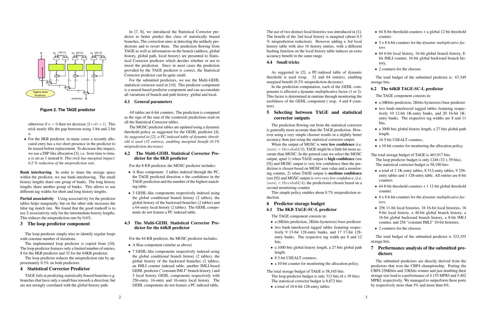

## 从业者评论（补充，不属于原文）

这份论文常被当作“最高准确率参考”，但实现评审必须重算物理 bank 数、每周期读写、SC 求和级数、历史 checkpoint 和多 branch lane。`523,355 bit` 只说明可变状态容量，不说明 SRAM 宏数量、外围逻辑或每次预测能耗。性能计数器应把 TAGE、SC、L 的 provider 与 override 分开。

## 技术演进位置

该文给出经典 TAGE-SC-L 竞赛配方，长期成为高准确率基线。它解决多种历史和统计域的组合问题；留下“准确率冠军如何压缩成低延迟、低能耗、可恢复的工业实现”，这正是 2025/2026 论文的主线。

---

# 18. Lin 与 Tarsa 2019：分支预测远未解决

**原文：** Chit-Kwan Lin and Stephen J. Tarsa, *Branch Prediction Is Not a Solved Problem: Measurements, Opportunities, and Future Directions*, IISWC 2019。

**材料：** [本地 PDF](modern/17_2019_lin_tarsa_branch_prediction_not_solved.pdf)

## 原文整理

论文用现代工作负载重新检验“预测已足够好”的看法。实验采用 SPEC CPU2017 `speed` 单线程整数负载、多个输入；每个输入执行 100 亿条指令并切成 3000 万条指令片段，利用 SimPoint 平均选约 9.5 个 phase，统计覆盖所有选中片段。基线为 8 KB TAGE-SC-L。性能模型使用 ChampSim 的 Skylake-like 核，并把流水线/窗口容量从 1× 放大到 32×。

作者定义 H2P branch：在片段内预测准确率低于 99%、执行至少 1.5 万次且至少产生 1000 次误预测。每个程序平均约 29 条 H2P 在至少 3 个输入中反复出现；最严重 10 条平均贡献 55.3% 的误预测，mcf 可达 96.9%。完美预测在 1× 核上的 IPC 机会约 18.5%，随着其他瓶颈放宽显著增大；单纯把 TAGE-SC-L 从 8 KB 扩到 64 KB 只带来约 2.7% IPC。

H2P 的相关依赖可出现在前 5000 条指令内，最大有效范围多在约 3000 条内，但依赖位置随动态路径漂移。它们平均申请约 13,093 个预测项、涉及约 3,990 个唯一项；普通非 H2P 分支中位数只有 4 次申请和 4 个唯一项。也就是说 TAGE 不断为同一静态 H2P 建立新上下文，却很少复用。

另一类问题是 Large Code Footprint（LCF）。除少数程序外，96% 静态分支在 3000 万指令片段中执行少于 1000 次，85% 少于 100 次。把 TAGE 扩到 1024 KB，收益在 64 KB 后迅速饱和；即使 1024 KB，在 1× 核上也关闭不到一半完美预测机会，在 32× 核上约关闭 34%。执行少于 1000 次的稀有分支贡献约 34.3% 的机会，少于 100 次仍约 27.4%。

作者建议保留 TAGE-SC-L 处理普通分支，再给 H2P 加 branch-specific helper；利用跨运行/跨输入离线训练、phase 信息、寄存器值或低精度 CNN 等额外上下文，并指出数据中心可摊销离线训练成本。

### 正文展开

综述部分把当时方法分为 PPM/TAGE 的最长精确模式匹配、perceptron 的位置加权、loop/IMLI/store-load 等 domain-specific model，以及 SC 这类 ensemble。作者强调 CBP-5 给预测器 IP、类型、target 与真实方向，并限制 8/64 KB 但不限制 latency；ChampSim 用这些提交闭合到 core IPC。这里的“state of the art”特指该接口和 TAGE-SC-L 8 KB 基线，不等于实测某款商业 BPU。

H2P 数据没有只取 SimPoint。每个 workload 的 100 亿条指令被切成 333 个 3000 万片段，SimPoint 用来确认平均约 9.5 个 phase，但表 I 的统计覆盖全部片段。H2P 阈值在每片段独立应用；top 5 heavy hitter 平均贡献 37% 动态误预测，top 10 约 55.3%。依赖分析从动态 read/write 的寄存器与内存链追溯到影响 branch 的先前分支，表 III 列 min/max history position；同一依赖 PC 在不同实例落到大量位置，令固定位置或 exact-pattern 模型产生上下文碎片。

LCF 是另一套数据：603.gcc_s 加一个游戏、RDBMS、NoSQL、实时分析、流媒体服务等 live deployment 的单个 3000 万指令 trace。平均每条 trace 约 14,072 条静态分支、每静态分支仅约 612.8 次动态执行，8 KB TAGE 平均准确率约 85%；85% 静态分支执行不足 100 次，55% 准确率至少 99%，但仍有一批低频且低准分支。它的覆盖面小于 SPEC 多输入数据，因此只用来展示 rare-branch 现象，不应代表所有数据中心 workload。

图 5 将 H2P 与 rare branch 的 IPC 机会分开：SPECint 机会主要集中于 H2P，LCF 则由 non-H2P rare branch 主导。图 7/8 把 TAGE 从 8 KB 扩到 1024 KB并按 1×–32× core 重算，容量在 64 KB 后迅速饱和；再把执行次数超过 100/1000 的分支设为完美，推得 rare 分支分别仍占约 27.4%/34.3% 机会。该“完美化”是 limit study，不是已有 helper 的实测收益。

未来方向包含部署假设而非已证事实：offline 训练可跨 invocation/input 聚合样本，phase 可由硬件 counter 与 recurrence interval 提供，18 个寄存器的低 32 bit 分布显示 branch-specific 结构，2-bit CNN 是伴随工作的例子。作者设想把模型作为 ELF metadata 由 OS 装入 BPU，并在数据中心摊销训练；跨输入泛化、模型装载、上下文隔离、更新安全与在线 inference 代价都仍待解决。

## 关键图表导读

- 完美预测机会随核资源放大的图说明后端越强，前端错误越显眼。
- Top-10 H2P 贡献图揭示误预测高度集中，而不是均匀散布。
- 分配/唯一项分布图把 H2P 的问题定位为上下文碎片化与复用失败。
- LCF 频次和容量曲线说明扩大表无法训练从未重复或极少重复的分支。

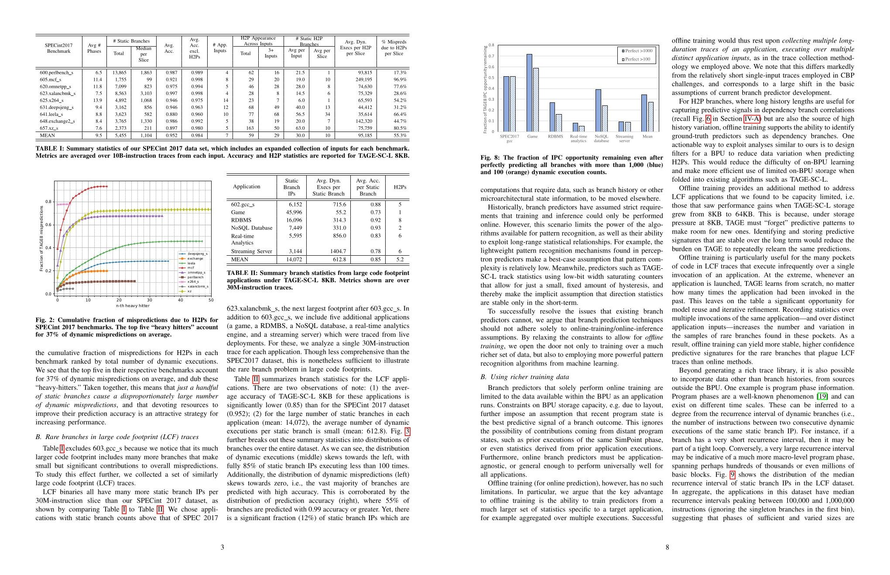

## 从业者评论（补充，不属于原文）

H2P 与 LCF 是两种不同故障：前者频繁执行但上下文不稳定，后者训练样本不足。对 H2P 需要更合适的信息源或专用状态；对 LCF 可能需要静态/离线信息、跨进程共享或代码语义。计数器可按 PC 维护执行数、误预测数、provider 分配数、唯一 tag/历史数和跨 phase 重现率。

## 技术演进位置

该文把研究重心从“继续微调通用 TAGE”转向 H2P、数据值和大代码 footprint，直接激励 CBP2025 的寄存器值、load 值、编程惯用法与 branch-specific 专家。它留下部署元数据、跨运行泛化、安全隔离和额外信息的及时性问题。

---

# 19. Seznec 2025：面向 CBP2025 的 TAGE-SC

**原文：** André Seznec, *TAGE-SC for CBP2025*。

**材料：** [本地 PDF](cbp2025/01_seznec_tage_sc_for_cbp2025.pdf)

## 原文整理

论文把 2016 TAGE-SC-L 与 2024 “engineering cookbook” 扩展到 192 KB。作者明确说该提交为探索准确率而构造，28 个 TAGE 逻辑表、大量局部历史和 SC 表的延迟/checkpoint 代价并不适合直接实现。公开训练集报告 3.363 BrMisPKI、143.935 CycWpPKI。

TAGE 采用更大的 base、带 partial associativity 的 tagged bank、provider/alternate 与动态 `USE_ALT_ON_NA`。关键更新改进包括：弱 provider 时训练 alternate；误预测时可分配多项并优先保护第一个新项；按置信度与概率节流分配；新项 useful 可置为 2；通过重新组织/二路 skew 减少冲突。论文强调大容量下每次只分配一项学得太慢，但无节制多分配会污染。

SC 汇集 TAGE 输出、global、block path、local 和 IMLI 相关上下文。BrIMLI 统计后向循环回边的连续 taken，TaIMLI 以 target/区域口径跟踪循环进度，目标是覆盖多出口与非标准布局循环。论文发现传统 loop predictor 只改善 0.003 MPKI，因为新 IMLI 已吸收大部分循环信息。

消融结果：完整 3.363；只用 TAGE 3.781；加入仅看 TAGE 输出的 SC 为 3.612；去掉 IMLI 与 local 为 3.522；只去掉 local 为 3.472。容量放大 2× 为 3.252，缩到 0.5× 为 3.532、0.25× 为 3.734。2016 64 KB 版为 3.751；直接扩到 192 KB 约 3.438，表明新机制而非容量单独带来剩余收益。

总状态 1,568,807 bit、低于 192 KB：TAGE 1,169,710；SC 中 TAGE-output 29,531、global 141,398、IMLI 49,628、local 177,840，约 74%/26% 分给 TAGE/SC。恢复成本中 local checkpoint 约 5,424 bit，远高于 IMLI 104、global 86 和 TAGE 13-bit 历史指针。

### 正文展开

竞赛的 MPKI 口径是在预热后只统计每条 trace 后 50% 的指令。192 KB TAGE 的 base 共有 32K 项；论文用相邻方向计数器共享低位，将其计为 64 Kbit。tagged 部分由 28 个 2K×19-bit 物理 bank 支撑 28 个逻辑历史表，采用二路 skew/部分相联，tag 为 14 位；全局历史长度从 3 延伸到 1000，并把最多 5 位路径信息混入索引和 tag。预测时仍由最长匹配表充当 provider，次长匹配或 base 提供 alternate，`HCpred` 则在高置信 provider 场景参与选择。

分配策略的细节决定了大表能否及时学习：弱 provider 出错时也训练 alternate；误预测可同时创建多个候选项，第一项从 `u=1` 起步，后续项再按 provider 置信度以约 `1/16`、`1/4`、`1/2` 的概率逐级节流；`u=2` 的已有项受到更强保护。作者把这种 skew 后的多候选插入类比为 ZCache 式的冲突缓解。这里并不存在“分得越多越好”的结论——多分配用于缩短学习时间，置信度门控用于避免同一个事件污染许多历史尺度。

SC 中，除直接学习 TAGE 输出与 PC 组合的表、若干全局历史表之外，还加入以 256-byte 代码块为粒度的 path history、局部历史以及 BrIMLI/TaIMLI。block-path 单项只改善约 0.004 MPKI；local 整体约贡献 3%，却需要最昂贵的推测更新和恢复。SC 各分量带有倍率/权重，动态阈值也不是每次都训练，而是在绝对和已经超过约半个当前阈值时才更新，以减少临界区之外的无效抖动。

论文还给出一个重要的负结果：新版 CBP2025 TAGE 主干单独使用时为 3.781 MPKI，反而差于组织者提供的、按 192 KB 放大的 2016 TAGE 的 3.715；作者认为超大的 bimodal 和更宽的 tag 是主要差异。这也解释了总成绩并非来自更强的 TAGE base：只看 TAGE 输出的 SC 在新版上改善 0.169 MPKI，而旧版只改善 0.056；新 IMLI 的收益约 0.050 对 0.013；local 则接近，约 0.109 对 0.107。传统 loop model 被移除，除 0.003 MPKI 收益过小外，作者也指出竞赛框架模型并未完全覆盖真实实现规则。

成本表的 74%/26% 是本文 TAGE/SC 比例；原文随后写旧版为 91%/9% 时把名称再次写成了 CBP2025，结合上下文应理解为与 CBP2016 版本的对照。另有一处 base 容量不一致：正文明确为 32K 项、低位共享后共 64 Kbit，成本 bullet 却写 32 Kbit；其 TAGE 总数与正文的 64 Kbit 相符。此处保留论文数据，并标明原文内部差异，不把文字笔误扩展成新的架构结论。

## 关键图表导读

- BrIMLI/TaIMLI 图说明循环特征已从独立 trip-count 表转向历史索引维度。
- 消融与容量缩放图把“组件贡献”和“纯容量贡献”分离。
- storage/checkpoint 表揭示 mutable state 与每个在途分支恢复状态不是同一成本。

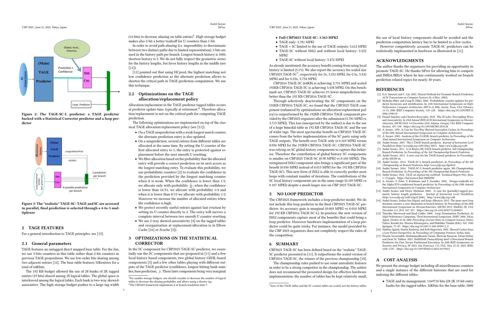

## 从业者评论（补充，不属于原文）

这份提交适合作为准确率上界，不适合作为 RTL 规格。真正落地时应先限制物理 SRAM 数和预测级数，再选择少量最有净挽救率的 SC 特征。局部历史即使只占十几 KB，也可能因每个 fetch/branch checkpoint 数千 bit 而不可接受。

## 技术演进位置

该文把 TAGE-SC-L 推到大预算准确率极限，并用新 IMLI 与分配策略替代收益很小的 loop 表。它解决大 predictor 学习过慢与复杂循环上下文问题；留下可实现的表数、恢复带宽、延迟和能耗约束。

---

# 20. Ros 2025：深入分析 TAGE-SC-L

**原文：** Alberto Ros, *A Deep Dive Into TAGE-SC-L*。

**材料：** [本地 PDF](cbp2025/02_ros_deep_dive_tage_sc_l.pdf)

## 原文整理

作者先构造约 192 KB 基线：TAGE 表容量约翻倍、bimodal 扩大 8 倍，低/高历史逻辑表从 `10+20` 增到 `14+30`，低历史 tag 为 9 位；loop 和多数 SC 也扩大，并设 `NHIST=42`、`BORN=9`、误预测多分配一项 `NNN=2`、延长重置周期。基线为 3.4405 MPKI、146.1 CycWpPKI。

第一项贡献是历史长度序列。作者认为传统几何序列在中段赋予较多 way、两端较少，提出前段二阶算术、后段增长因子线性增大的广义几何序列：示例参数 `h1=2,d=2,k=1,f=0.1,m=1.1,t=15`。各长度只需一 way，免去组相联逻辑，结果降到 3.4276/145.9。

第二项是更细的组件选择。loop 置信度取预测迭代数与连续正确计数乘积的有效位数（0–7），选中且足够强时不再被 SC 随意翻转；32 个 chooser 同时看 loop/TAGE/SC 置信。alternate 在 provider 置信 0 或 1 时均可参与，使用 hit-bank 分组、alternate 置信/是否命中与 provider 置信索引 256 个 chooser。TAGE 与 SC 间用 16 个 chooser，综合 TAGE/alternate 状态与 SC sum 所在阈值区间。选择优化后为 3.4216/145.7。

第三项是分配与替换：若 loop 已高置信正确，不再给 TAGE 分配；若 alternate 正确而 provider 错，则提高 alternate 的 `u`。结果 3.4156/145.5。再调整 loop 初始方向识别、移除小 IMLI SC、改 bias hash、扩局部历史，最终 TASQ-SC-L 为 3.4120 MPKI、145.4 CycWpPKI。

表 1 计得约 191.90 KB：bimodal 10 KB，TAGE 166.08 KB，loop 0.332 KB，SC 15.49 KB。评测为 CBP2025 105 条公开训练 trace；这些逐步优化是在同一训练集上调参，需防止把微小增益视为跨工作负载保证。

### 正文展开

论文以组织者给出的 64 KB TAGE-SC-L（3.7506 MPKI、152.5 CycWpPKI）为起点，再把容量和逻辑表数扩展成 192 KB 基线。其改动是按同一套公开 trace 逐步叠加的：新历史长度序列改善 0.0129 MPKI，组件选择再改善 0.0060，分配/替换再改善 0.0060，最后的 loop、hash、局部历史微调把结果推到 3.4120。因而图中的每个差值都是相对于前一版，而不是独立组件在原始基线上的净收益。

新历史序列的直接意义是让每个历史长度只保留一个 way。原 TAGE 的相邻逻辑表共享一个物理 bank、通过多 way 补偿历史密度；Square-SuperExp 先以二阶差分稠密覆盖短历史，再令增长倍率线性增加，长历史迅速展开。论文既展示序列形状，也报告相同容量下去掉相联搜索后的结果，主张该构造可以迁移到感知机等需要挑选历史 tap 的预测器，但没有给出对其他预测器的实测。

三类 chooser 的状态必须分别理解。loop 共有 32 个 7-bit chooser；置信由已预测迭代数与连续正确次数乘积的有效位数分桶，足够强时 loop 可以压过 TAGE/SC。alternate 的编码名义上寻址 256 个 6-bit chooser，但实现中只有 128 个索引实际可达；预测器还记录第二 alternate，主要用于置信和训练反馈，而不是简单增加一个输出候选。TAGE/SC 之间再用 16 个 7-bit chooser，把 provider/alternate 置信与 SC sum 相对阈值的位置共同纳入。

替换阶段有两条容易遗漏的反例保护：若高置信 loop 已经正确，就不因最终方向与 TAGE 不同而浪费 tagged 项；若 alternate 正确而 provider 错，则提高 alternate 的 `u`，避免真正有用的旧模式先被清除。实际 loop 表若在提交时更新，还要为同一 loop 表项对应的多个在途实例维护计数或版本；论文在讨论中明确把它列为真实处理器所需、竞赛模型未展开的工作。

成本处存在原文内部的轻微差异：表 1 各项相加写 191.90 KB，附录文字写 191.82 KB；且表中包含实际上未被寻址的 chooser 项，所以有效状态略低。本文不擅自把两数合并。作者最后也提醒，随着基线增强，单项改进会变小；在历史表更少、预算更现实的实现中，某些简化反而可能更有价值。

## 关键图表导读

- 几何与 Square-SuperExp 序列图说明历史长度本身也是资源调度。
- 三张 chooser hash 图显示“最终预测”需要融合多个置信域。
- storage 表把 low/high tag 位宽、局部历史与 chooser 全部列入预算。

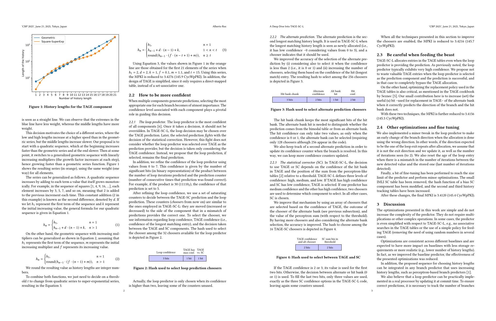

## 从业者评论（补充，不属于原文）

chooser 增多会减少决策混叠，却也增加训练样本稀疏和验证状态。每个 chooser 应统计访问、分歧、正确迁移和饱和分布。loop“不可覆盖”只能在置信校准可靠时成立，否则一次 trip-count 改变会造成高代价错误。

## 技术演进位置

该文不是更换 TAGE 主干，而是精炼历史长度、置信选择和分配反馈，说明成熟预测器仍可从控制策略获得收益。它留下训练集过拟合、chooser 数量和真实端口/恢复实现问题。

---

# 21. Koizumi 等 2025：RUNLTS 寄存器值感知预测器

**原文：** Toru Koizumi et al., *RUNLTS: Register-value-aware Predictor Utilizing Nested Large Tables*。

**材料：** [本地 PDF](cbp2025/03_koizumi_et_al_runlts.pdf)

## 原文整理

RUNLTS 在 TAGE-SC 上加入寄存器值摘要、call-stack、BrIMLI/TaIMLI、改进历史长度和动态分配。作者不采用 loop predictor，理由是复杂度高而贡献低。评测使用 CBP2025 105 条训练 trace，前半预热、后半测量；默认模拟 fetch width 16、frontend depth 10。平均 3.197 BrMisPKI、140.3 CycWpPKI。

主表包含 128K 项、20 KiB bimodal，比 2016 64 KiB 版 8K 项大五倍以上，以应对 JavaScript/JIT 等大代码 footprint。tagged 部分为 9 个 low bank 与 25 个 high bank，每 bank 2K 项。23 个非零历史长度为 `6,14,24,36,50,66,84,104,126,150,178,212,252,300,358,426,506,602,776,1078,1606,2554,4316`，先用二阶算术递增，再转几何加速；不使用 CBP5 的 skewed associativity。

动态分配利用很少出现的“counter 为 0/−1 且 `u=1`”编码标记新项。两个计数器分别统计新项产生正确预测和未被引用就遭淘汰的次数，据二者比例节流分配：大表可积极适应新 phase，但出现 thrashing 时收敛。

寄存器值被压成 12-bit digest：整数包含前导零/一数、尾随零/一数和低 6 位；FP 按 FP16/32/64 选符号、指数高位；条件码 4 位重复三次。预测器以类似 Tomasulo 的 65 项逻辑寄存器表维护 `valid` 与 14-bit ROB tag/12-bit digest：decode 写目的寄存器时标记未就绪，执行完成以 ROB tag 匹配后写 digest。digest 超过 256 条已译码指令即失效。

SC 的寄存器组件分 8 个 bank，每 bank 对应 8/9 个逻辑寄存器；第一级权重选择当前最有用寄存器，第二级以其 digest 预测，单次训练随机选一个可用寄存器，使每表只需一个写口。它在误预测恢复后尤其有效：前一次错误路径被清空时，更多生产者已执行完，下一次预测可看到新值。

表 predictor 1,278,385 bit（156.05 KiB），SC 292,505 bit（35.71 KiB），合计 1,570,890 bit（191.75 KiB）。对照中作者调优的 TAGE-SC-L 为 3.408/145.2；RUNLTS 无 local 也达 3.269/141.5，完整为 3.197/140.3；105 条中仅 7 条未改善，寄存器组件贡献最广。

### 正文展开

作者先用可视化工具观察不同 trace 的代码和命中行为，并依据名称、热点与动态特征推测其中包含 Speedometer、SunSpider、SPEC CPU、SPECjbb 一类工作负载。这只是作者对匿名竞赛 trace 来源的辨认，不是组织者公开的逐条标签；论文据此提出大 base 与大代码 footprint 的关系时，也应视为有证据的解释而非已知元数据。

主干选择 TAGE 而非 BATAGE 的理由来自 entry 生命周期。BATAGE 的置信替换可能让多个相邻表长期保存同一容易模式；TAGE 的 usefulness 只保护对 alternate 有独特增益的项，更适合本文激进的多项分配。对照表依次给出 GEHL 4.088、调优 TAGE 3.674、BATAGE 3.667、BATAGE-GSC 3.590、TAGE-GSC 3.533 MPKI，说明后续选择不是只拿最终 RUNLTS 与弱基线比较。

SC 的特征族在原文中记作 `sG/sP/sC/sI/sL/sS/sT/sR`，分别覆盖全局方向、路径/call、条件模式、IMLI、局部、栈/目标以及寄存器信息等。每组并不是把所有表直接求和：嵌套的大表先以 usefulness/weight table（UT/WT）挑选上下文或寄存器，再读取第二级预测权重，因此可以在固定读写口下覆盖更多候选。阈值训练沿用 FTL++ 风格；call-stack history 和各 IMLI 历史也都参与推测推进及错误恢复，而不只是提交态统计。

寄存器版本表把逻辑寄存器的“当前值摘要”与生产它的 ROB tag 绑定。目的寄存器在 decode 时失效，执行结果只有在 tag 仍相符时才能写回；超龄失效防止一个长时间不更新的 digest 被当成当前依赖。该机制与 Heil 等只利用分支源寄存器差分的做法不同：RUNLTS 允许任意当前可用寄存器成为专家输入，因此覆盖面更大，同时也增加了错误相关和数据暴露面。

所有 105 条 trace 都以前半段预热、后半段计分。除平均值外，论文报告改善量中位数约 0.052 MPKI、第一八分位数约 0.323 MPKI，且只有 7 条没有变好；这说明收益并非完全由一个离群 trace 拉动。不过这些仍是公开训练集内结果，不能替代隐藏集或真实时序实现验证。

## 关键图表导读

- bank viewer 展示热点分支如何在长历史表反复分配。
- 历史长度序列和主表结构图说明大预算下为何重新分配短/长历史密度。
- digest 图是寄存器值进入前端前的压缩接口。
- feature 消融图与成本表同时说明 sR 最大收益及其硬件代价。

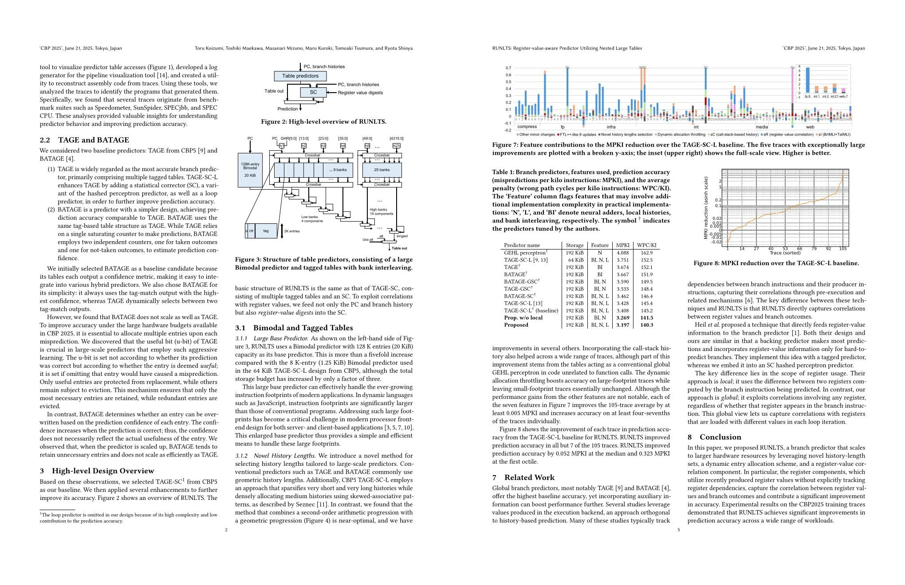

## 从业者评论（补充，不属于原文）

该方案把执行后端信息送回预测前端，关键不是表算法，而是 timeliness 与 recovery。真实核要处理 rename map、物理寄存器、ROB wrap、异常/flush、跨线程安全和长线延迟；“逻辑寄存器值已知”不能直接等同于 fetch 时可用。可用计数器验证 digest ready age、被选寄存器、恢复后净挽救和错误 stale digest。

## 技术演进位置

RUNLTS 回应 2019 H2P 的“控制历史不足”，把任意寄存器值作为全局专家输入，并显著推进 192 KiB 准确率。它留下执行到前端通信、寄存器版本恢复、端口和安全成本。

---

# 22. Man 等 2025：LVCP Load 值相关预测

**原文：** Yang Man et al., *LVCP: A Load Value Correlated Predictor for TAGE-SC-L*。

**材料：** [本地 PDF](cbp2025/04_man_et_al_lvcp.pdf)

## 原文整理

LVCP 针对 load-data-dependent branch：相同分支历史可能对应不同数据上下文，而某个先前 load 值可直接决定循环退出或比较方向。系统由 TAGE、Multiperspective SC、loop 与 LVCP 组成；若分支被判为 H2P 且 load-correlation 项命中并达到饱和置信，LVCP 优先，否则回到 TAGE-SC/L。TAGE-SC-L 在执行解析时更新，LVCP 为保证 load/branch 顺序在 commit 更新。

H2P Branch Table 是带 tag 组相联小表，TAGE-SC-L 误预测时增加计数；饱和后允许 LVCP 分配。每 20,000 个提交分支衰减。训练集平均 131.60 BPKI，据作者换算主要跟踪 MPKI 高于约 0.38 的分支。

Load Tracking Queue 有 16 项，追踪分支前最近 load；load 完成后写值，每个队列位置映射一个 correlation bank。更远 load 被移到由 load PC 低位直接索引的 distant load buffer。Fetch 时没有 opcode，故另用 Load Marking Table 在 decode 填入每 cache line 内 load 位置 bitmap，并以 useful/衰减管理。

相关表以 branch PC、load PC、load value 的 hash 同时生成 set index 与 tag，每项保存方向、5-bit confidence 和 direction-changed invalidation bit。多个近 load 候选时选最年轻的饱和项，远端选最低索引饱和项；近队列优先。只有 H2P 且整体误预测时分配，可多项并行学习；2-bit useful 在“基线错、LVCP 对”时增加。某一相关项饱和正确后清同实例其他候选 useful，促成唯一 provider。方向发生变化则置 marker 使旧项失效。队列与远端共享 correlation storage，实际需双端口或细粒度 banking。

在 105 traces、192 KB 下，现实 local-history 基线 3.444/145.647；“unreal”2048 项 local、预测时更新 IMLI-OH 为 3.421/145.181；作者 173 KB TAGE-SC-L 为 3.428/145.436；加 18.7 KB LVCP 后 3.372/144.076，相对基线 BrMisPKI 降 2.07%。infra、fp、int 分别降 4.57%、3.42%、1.89%，media 未复现大 local table 收益。LVCP 单项约贡献 0.05 MPKI。

作者发现超过 20% 误预测与固定 load 值相关，但值在原预测时尚未就绪；真实处理器可在执行前用 late override/early re-steer 部分兑现，竞赛接口只能预测一次。未来问题是复杂追踪与大 correlation table。

### 正文展开

相关工作部分把 load correlation 分成三种时序取舍：用较早 load 的数据值可获得强相关但到达较晚；用 load address 可以更早索引却丢失值语义；主动更新还可观察后续 store，修正“相同 load 上次值已被覆盖”的陈旧状态。LVCP 选择第一类，并把分支预执行/early re-steer 视为互补方案，而不是宣称一个 fetch-time 表已经解决数据依赖分支。

四个组件在预测时并行读取，优先级有严格限定：只有 HBT 已认定 H2P、相关表命中且 5-bit confidence 饱和时，LVCP 才覆盖；否则饱和 loop 可覆盖 TAGE-SC，剩余情况依照 CBP5 的 TAGE/SC 选择。HBT 不是保存所有分支 MPKI 的精确目录：同 set 有零计数器时才分配，随后按每 20,000 个提交分支衰减。论文以 131.60 BPKI 推得约 0.38 MPKI 的筛选量级，只是平均 trace 下的换算阈值。

MPSC 除三张 bias 表和三类 global table 外，还明确使用 32 项 per-address local、16 项 per-set local、IMLI 过滤的后向路径与普通前向路径；BrIMLI、TaIMLI、forward-target IMLI 推测更新并 checkpoint，而 IMLI outcome-history（IMLI-OH）在执行解析时更新，以节省恢复状态。现实基线与“unreal”基线的差异正来自 48 对 2048 个 local entry，以及 IMLI-OH 在执行时还是预测时更新，不能把后者当作同硬件成本的算法上界。

Figure 5 的消融是在同时禁止相应特征预测和训练后测量，释放出的容量没有转分给其他组件。LVCP 单独约 0.05 MPKI，图中所列全部 LVCP/SC 特征的增量和为 0.156 MPKI（约 4.6%），因此各项并非严格可加的 Shapley 贡献。论文估计有限 local/per-set/IMLI 的 checkpoint 少于每 fetch block 1 Kbit、整核约 10 KB，但 load queue、commit 镜像与 shared correlation bank 仍是另外的状态。

附录给出 191.96 KB 总成本：TAGE low/high 分别 33.75/94.5 KB，base 20 KB；loop 0.445 KB；HBT 约 1.2 KB；16×256 项相关表 13 KB；load marking table 4.375 KB，并另列近/远 load 队列、commit 顺序镜像、replacer 和历史 checkpoint。共享同一相关 SRAM 可省容量，但近队列与远 buffer 同周期访问要求双口或更细 banking，原文明确没有把这一点消解成“免费并行”。

## 关键图表导读

- 总体图显示 LVCP 是高置信最高优先级专家。
- load marking、近队列、远 buffer 图应沿 decode 标记、execute 填值、fetch 查询、commit 训练阅读。
- 类别结果与消融图区分“数据值有效”与“值来得太晚”。

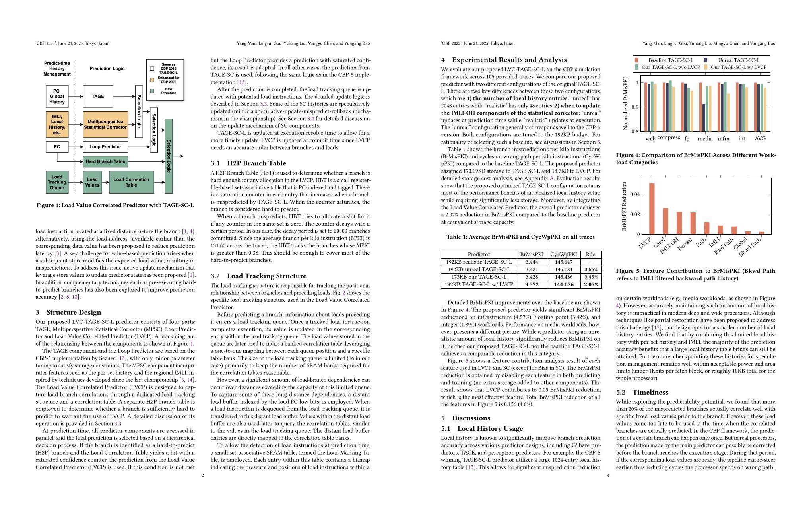

## 从业者评论（补充，不属于原文）

LVCP 的验证必须纳入内存次序：store-to-load forwarding、未决 store alias、回放、异常 load、缓存 miss 和错误路径 load 都可能使值无效。只在 commit 训练保证顺序，却加大训练延迟；late override 的价值应以提前多少 cycle 重定向衡量，而非只看方向 MPKI。

## 技术演进位置

该文把 H2P 专家收缩到 load 值相关并给出较清晰硬件队列，解决控制历史无法区分数据上下文的问题；留下值及时性、内存一致性、表端口和跨流水级通信。

---

# 23. Mose 等 2025：PIP 编程惯用法预测器集合

**原文：** Karl H. Mose et al., *PIP: An Ensemble of Programming-Idiom Predictors*。

**材料：** [本地 PDF](cbp2025/05_mose_et_al_pip.pdf)

## 原文整理

PIP 用专用 idiom tracker 识别数据相关代码形态，未识别时再由调优 TAGE-SC-L、Multiperspective Perceptron（MPP）和 arbiter 工作。两个 tracker 是整数 for-loop `for(i=B; i!=E; i+=S)` 与 null-terminated string（NTS）扫描。

for-loop tracker 观察两操作数算术指令的差值，连续三次按固定 stride 递减后识别循环；预测时用最近差值减去 stride×在途实例数，投影何时到零/越界，方向关系由前三次 branch 学习。因此它能在某些分支第一次遇到退出前就预测 exit。break 会让旧迭代状态混淆，执行结果到达后才纠正。CBP2025 接口不给 opcode，`!=/<` 与 `<=` 难区分，作者用首次 off-by-one 动态切换零/负阈值。

NTS tracker 识别字符宽度递增的 load，记录地址对应字符串长度；其他 NTS 循环可复用已知长度。标准库向量化会绕过这种标量形态。tracker 项有置信、相对基线胜率和结合最近性/有用性的替换；无法可靠预测时回退。

TAGE 主要调整为 16 KiB bimodal、SC 7-bit counter、2048 项 bias、48 个 history table、最长约 4900-bit global history。MPP 使用 MOD-LOCAL、global/path/TAGE prediction 等特征，误预测或低置信训练；若 MPP 对而 TAGE 错，可在两倍阈值内更积极训练。arbiter 在 TAGE 非高置信时，用 MPP magnitude 和按 TAGE 置信选择的阈值表决策。参数用 SMAC3 贝叶斯优化。

192 KiB PIP 在 105 traces 上为 3.47 MPKI、148 CycWpPKI，相对 2016 64 KiB TAGE-SC-L 分别降 7.4% 和 3.0%。tracker 覆盖约 10.1% 分支，但仅约 1.1% 与 TAGE+MPP 分歧；分歧时平均正确 87.6%。后续实验却发现合适大小 MPP 常为零或负收益，最低 MPKI 配置是 160 KiB TAGE-SC-L+tracker；其相对 192 KiB TAGE 只差约 0.5%，加 tracker 再改善 1.8%，相对 64 KiB 总降 9.7%。作者如实指出组合多个强预测器并不自动获益。

### 正文展开

PIP 的总体流程是“专用 tracker 有资格则先用，否则由 TAGE/MPP 组合兜底”，而不是四个预测器等权投票。每个 idiom entry 同时维护自身置信和相对历史预测器的胜负；长期明显占优或落后时锁定启用/禁用，表满则以 recentness 与 usefulness 合成分值淘汰。这样做针对的是假阳性成本：tracker 只应在能够提供基线没有的信息时接管。

for-loop tracker 从执行中的二操作数算术差值识别 `B/E/S` 关系，连续三次观察到固定 stride 才建项；预测使用“最近差值减 stride×在途同 PC 实例数”。它在样例集中对一千多个 for-loop branch 胜过默认组合，并在所有 105 条 trace 都产生预测。NTS tracker 则需从递增字符宽度的 load 识别字符串扫描，并以字符串地址复用已知长度；许多 trace 上几乎无贡献，论文没有把这一较窄 idiom 的结果外推到所有内存循环。

MPP 是 10 张 weight table 的定制版本，权重 6 位并另有 2-bit sign；它只在 TAGE 较弱时作为专家，因此特征和标准独立 MPP 不同。若 MPP 正确而 TAGE 错，只要 magnitude 低于两倍动态阈值仍可训练；错误且一次更新后仍未翻转时，随机追加更新次数还取决于是否与 TAGE 一致。arbiter 由 low/medium-confidence 两组阈值表构成，高置信 TAGE 无条件胜出；其阈值更新直接围绕当次 MPP magnitude 加减小裕量。

Figure 1 比较八个组合：64/128/160/192 KiB TAGE、是否加入 MPP 与 idiom tracker。提交的 PIP 是图中橙色点，但后续调参发现 `160 KiB TAGE+tracker` 才是最低 MPKI；这项负结果是论文结论的一部分。Figure 2 还显示 tracker 总覆盖 10.1%，与基线真正分歧只约占全部预测 0.12%（即 tracker 覆盖内约 1.1%），分歧时正确率 87.6%；`fp_5/int_21/int_0` 被正确翻转的全部预测比例分别约 2.3%/0.68%/0.55%。

附录计 1,572,106 bit、约 191.9 KiB，其中 tracker ensemble 约 63 Kbit，MPP 310,110 bit，TAGE-SC-L 1,048,813 bit，arbiter 272 bit，竞赛接口所需的 uop tracker 149,889 bit。作者认为真实流水线通常已有操作数和在途实例信息，uop tracker 可能部分复用；相反，MPP/arbiter 为恢复预测时历史所需的 index/checkpoint 没有计入，且 10 张 MPP 表的索引保存可能并不小。因此 191.9 KiB 不能直接等同于完整 RTL 面积。

## 关键图表导读

- 两类 idiom 数据流说明它们预测的是程序语义近似，而非方向历史。
- 配置柱状图揭示 PIP 提交版并非后续最低 MPKI 点。
- disagreement/error 图显示高覆盖率不等于高净收益，真正重要的是与基线分歧的少数样本。

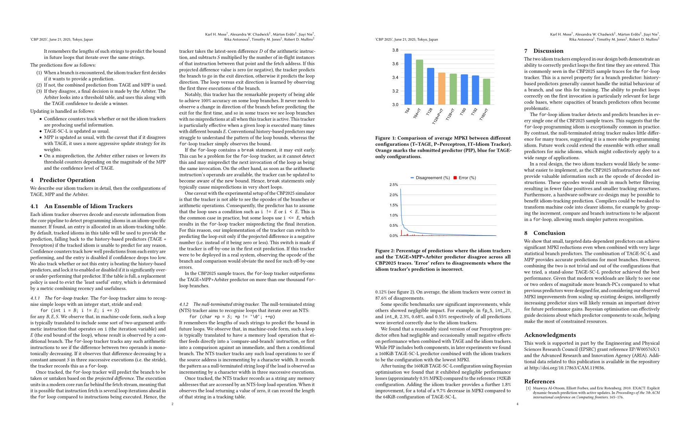

## 从业者评论（补充，不属于原文）

专用 tracker 的优势是可解释、能冷启动预测边界；风险是假阳性。真实 decode opcode 可大幅降低误识别，也可让编译器标注 idiom。计数时应报告覆盖、与基线分歧、分歧正确率、首次迭代退出 miss 和识别错误，而不是只报 tracker 自身准确率。

## 技术演进位置

PIP 把 2019 提议的 branch-specific helper 做成可解释代码惯用法专家，解决部分动态 loop bound 和字符串扫描；留下可扩展 idiom 集、识别硬件、编译器协同与多专家仲裁。

---

# 24. Cai 等 2025：Code Structure Correlator

**原文：** Lingzhe Cai et al., *TAGE-SC-L with a Code Structure Correlator*。

**材料：** [本地 PDF](cbp2025/06_cai_et_al_code_structure_correlator.pdf)

## 原文整理

Code Structure Correlator（CSC）试图让容易预测但代码 footprint 大的分支不占 TAGE 项。它是不直接使用当前 branch PC 的 O-GEHL 风格预测器，输入包括 call depth、全局 3-bit 方向偏置、最近 100/1000 条指令内的远距离分支数与间接分支数；每个特征索引一张 9-bit 饱和权重表，求和正则 taken。JIT 入口连续的类型 guard 是动机：它们来自不同 PC/代码副本，却共享“深调用、连续同向检查”的结构。

CSC、TAGE-SC-L 和 bloom filter 并行查。Bloom 初始为空，所有分支先由 CSC 预测；CSC 第一次错时把 PC 插入 bloom，后续改由 TAGE。CSC 始终训练，TAGE 只训练 bloom 命中的分支，因此 easy/cold 分支不污染 TAGE。现实实现可把选择位放 BTB，并周期性或上下文切换时清理。

作者用 evolutionary fuzzer 调 TAGE 参数，并通过 repair 保证 `NHIST/BORN`、bank 数、相联边界和 192 KB 容量合法；配置必须处在目标容量 5% 内。启用 CSC 后，调优结果只给 low-history TAGE 约 7.5 KB，把 144 KB 给 high-history。完整 storage：TAGE low 7.5、high 144、base 5、aux 0.38、SC 11.95、loop 0.15、CSC 1.69、bloom 21.33 KB，总 192 KB。

64 KB TAGE-SC-L 基线约 3.75 MPKI；调优大 TAGE 约 3.468，CSC 再降低约 0.04。特征消融的 MPKI 增量：call depth 0.0918、global bias 0.0248、100/1000 指令内 indirect 0.0056/0.0043、far branch 0.0033/0.0021。理想 selector 仅比实际 bloom 再好 0.002 MPKI。额外恢复状态约每 branch 42 bit（6 个 7-bit 特征）；1000-bit 窗口若精确 rollback 仍有成本。

### 正文展开

CSC 的目标样本不仅是 JIT guard，还包括代码复制、动态重定位、cold/infrequent branch 与异常检查。所有这些场景的共同点是 branch PC 不稳定或样本不足，而 call depth、阶段性的全局偏置和周围控制流密度可能重复。六项特征各自寻址 256 个 9-bit counter，经加法树求和；taken 时相关权重全加一，not-taken 时全减一。即使最终选择 TAGE，CSC 仍训练，以便它随后有机会接管。

作者没有把 CSC 直接塞入已有 SC：一是 SC 的索引普遍混入当前 PC，会破坏跨 PC 泛化；二是其他 SC 权重可能在 cold branch 上用噪声淹没 CSC。独立组件和 Bloom selector 允许专门的 admission 语义。Bloom 初始空意味着每个分支先给 CSC 一次机会；CSC 首错后插入 PC，之后 TAGE 才预测并训练。Bloom 假阳性会保守地提前转入 TAGE；由于普通 Bloom 不会产生对已插入项的假阴性，真正的“重新试用 CSC”发生在周期清空或上下文切换之后。

TAGE 的 evolutionary fuzzer 把 bank 数、低/高历史分界、相联边界、counter/tag 宽度和 SC 精度编码为个体；repair 先保证 `NHIST/BORN` 一致、最少 bank 和边界对齐，再以带权随机缩减把超预算个体拉回 192 KB 的 5% 范围。启用 CSC 后还在 `HitBank<18` 的分配中多建一个长历史候选，以加快 branch 向长历史迁移。该搜索方法产生配置，并不构成每个参数对性能的因果证明。

结果表还按 workload 类别报告：web 3.3030/110.6938、media 0.8564/28.5441、compress 2.7342/84.1648、int 4.2518/164.0265、fp 4.1011/164.9199、infra 2.3921/208.3353（依次为 BrMisPKI/CycWpPKI）。总改善主要来自扩大 high-history TAGE；CSC 的额外约 0.04 MPKI 应在这一已经调优的大主干上理解。oracle selector 只再改善 0.002，说明在该数据集上 Bloom 选择已接近作者定义的上界。

附录说明 SC 还把 `PERCWIDTH/LOGBIAS/LOGLNB` 从 6/8/10 调到 8/9/11。CSC 六张表仅 1.69 KB，Bloom 却用剩余的 21.33 KB；真实 BTB 若有可复用选择位，后者或可缩减。对 100/1000 指令窗口，原模型用两条 1000-bit vector；恢复既可为每分支保存特征，也可把窗口延长到覆盖最大在途指令数后回退。论文列出的 42 bit/branch 只是六个 7-bit 输入 checkpoint，不包含基线 TAGE-SC-L 自身恢复状态。

## 关键图表导读

- JIT guard 例子解释为什么跨 PC 共享结构特征可能有用。
- CSC 结构图与 bloom 流程图说明它既是预测器也是 TAGE admission filter。
- 特征消融和 storage 表显示主要信息来自 call depth，bloom 本身占比不小。

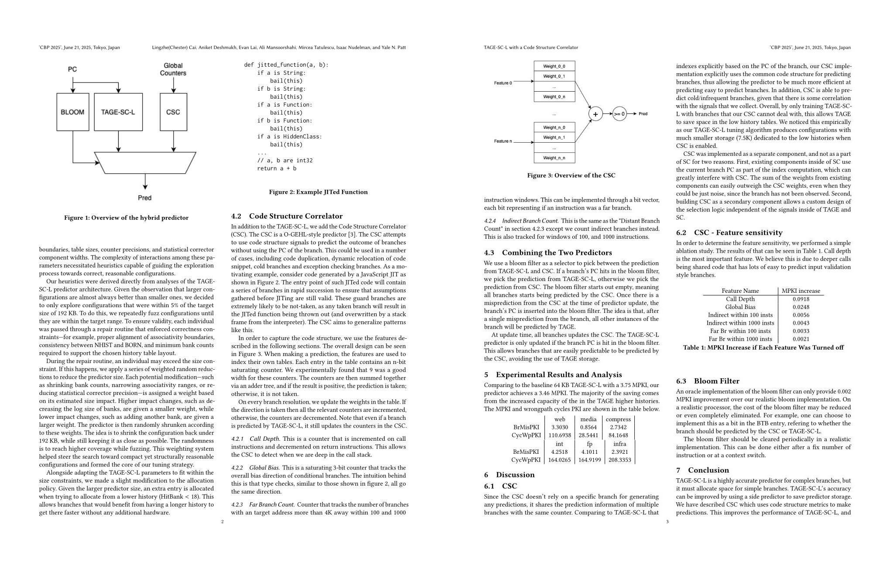

## 从业者评论（补充，不属于原文）

“不用 branch PC”增强跨代码副本泛化，也增大不同分支互相污染。Bloom false positive 只会过早回到 TAGE，false negative/清表后则让 CSC 再承担一次试错。系统实现还需处理线程/权限域，避免 call-depth 与代码结构状态跨上下文泄漏。

## 技术演进位置

该文将侧预测器用作 TAGE 容量过滤器，解决大 footprint 的 easy branch 占位问题；留下结构特征特异性、恢复窗口、Bloom 生命周期和安全隔离。

---

# 25. Jiménez 2025：Multiperspective Perceptron Predictor

**原文：** Daniel A. Jiménez, *Multiperspective Perceptron Predictor*。

**材料：** [本地 PDF](cbp2025/07_jimenez_multiperspective_perceptron.pdf)

## 原文整理

MPP 是 hashed perceptron：多种历史特征各自散列索引 6-bit 权重表，读出权重经 transfer function 后相加，`yout≥0` 预测 taken。误预测或 `|yout|≤θ` 时按真实方向饱和加减，动态阈值使错误更新与低置信更新平衡。它与 64 KB TAGE-SC-L 组合，总预算 192 KB，公开结果 3.3895 MPKI、144.699 wrong-path cycles/KI。

传统特征包括 global direction、16-bit 截断 path PC 序列、per-address local、global+path、bias。新特征包括 forward IMLI、MODHIST/MODPATH（只记录 PC 对某模数同余的分支以减少无关历史和 branch misalignment）、GHISTMODPATH、最近分支 LRU stack/其中位置、按代码 region 记录的 BLURRYPATH、按 PC 模位置保留最近结果的 ACYCLIC、只含后向分支的 BACKPATH，以及 TAGE 预测/置信。

作者强调各新特征单独并不强，互补组合才有效。特征先由遗传算法搜索，再随机 hill-climb；搜索目标是 MPP+TAGE 的最终 MPKI，因此选择了比 stand-alone MPP 更多正交特征。总是 taken/总是 not-taken 分支用 Bloom/filter 旁路，避免破坏权重。transfer function 近似 `3.2x/(1-x²/1600)` 的查表非线性，也用于 TAGE SC；24 类组合状态按 TAGE-SC、MPP、TAGE-only 方向与 TAGE 置信调 slope/bias。

预测器用预测结果推测更新部分权重与 `θ`，解析错误时撤销；低置信在途太多则暂退回非推测更新。消融中，移除 trivial-branch filter 增加 0.141 MPKI，去非线性增加 0.059，简化组合器增加 0.042，推测训练也有可见收益。

成本：TAGE-SC-L 524,288 bit；33 张权重表共 798,720 bit；两个 Bloom 共 196,608 bit；1280×34-bit local history 为 43,520 bit；其他历史 3,323 bit；组合 miss counter 4,608 bit；每预测保存约 850 bit 状态；总计 1,572,849 bit。作者指出查表非线性、加法和 TAGE→MPP 串行依赖可用 ahead pipeline/更宽权重更新缓解，但 local history rollback 仍难。

### 正文展开

论文先从普通 hashed perceptron 说明每个 feature 只产生一个 hash，hash 再与 branch address 混合选择权重；本文最终配置没有使用最朴素的 `GHIST` feature，而由更有选择性的 global/path/modulo 组合覆盖。`MODHIST/MODPATH` 只把满足 PC 模条件的分支推进子历史，用来抵抗不同控制路径插入/删除 branch 后的对齐漂移；`RECENCY` 的输出是目标 PC 在 LRU stack 中的位置；`BLURRYPATH` 以较粗代码 region 聚合路径；`ACYCLIC` 对 PC 模槽只保留最近一次方向或地址；`BACKPATH` 则隔离后向 branch。各 feature 单独弱、组合互补，是作者明确给出的解释。

特征选择先在去掉整机模拟开销的专用 trace 格式上评估数十万组合，再回到 CBP2025 模拟器验证；遗传搜索之后还做随机 hill climbing。目标函数直接是 `TAGE-SC-L+MPP` 的组合 MPKI，因此最终 33 个视角不是 stand-alone MPP 的最优集合。论文只在公开的 CBP2025 traces 上搜索，这一流程可能把组合器常量、feature mask 和 workload 特性一起拟合。

trivial filter 由 taken/not-taken 两套 Bloom 构成：只有一个 PC 在两边都出现、证明至少见过两种方向后，MPP 才训练；否则直接使用已观察方向。首次出现时则按最近 5 位 global history 是否全为 taken 决定默认方向。作者指出 24 KB Bloom 是竞赛接口没有 BTB 的替代品：真实 8K-entry BTB 若提供 `observed-not-taken` 位，可能只需每项加一位。不过该说法依赖 BTB 分配策略，不能无条件把 24 KB 从实现预算中删掉。

combiner 对 `TAGE-SC 方向×MPP 方向×TAGE-only 方向×三级 TAGE 置信` 的 24 类状态分别调 slope/bias；另为每类维护 64 个候选 bias 的 3-bit recent-miss counter，任一饱和后整体衰减。结果相对组织者 baseline 平均少 0.36 MPKI，类别算术平均约 3.39，几何平均 speedup 1.017，论文正文报告 wrong-path cycles 为 144.82，而摘要/模拟器精确值写 144.699；两种呈现均保留，不能假装只存在一个精度口径。

Figure 4 是逐项移除、其余优化保留，并把空出的硬件转给权重表：去 trivial filter、非线性、smart combiner 分别增加 0.141/0.059/0.042 MPKI；禁止推测表更新增加 0.033；把线性组合统一成 slope=1、bias=0 增加 0.027。因各次实验重分配容量且组件互相作用，这些柱不能直接相加。

附录只计 mutable state，transfer lookup 和 feature 定义视为只读逻辑；850 bit prediction record 也只按一个副本计，竞赛框架实际允许任意多个 map entry。记录中含 33 个 16-bit weight-table index、PC、`yout`、combiner sum 和更新标记；真实在途分支数会把这部分放大。TAGE feature 又必须先得到 TAGE 输出，加上 weight SRAM→transfer→加法树→combiner 的串行链，ahead pipeline 是设计方向而非本文已经实现的时序结果。

## 关键图表导读

- 特征说明是本文主体，应把它看作 33 个“视角”而非一根长 GHR。
- transfer function 图展示高幅值权重的非线性重标定。
- 每 trace 改善图与消融图说明组合器、filter、推测训练的贡献并不小于单个新特征。

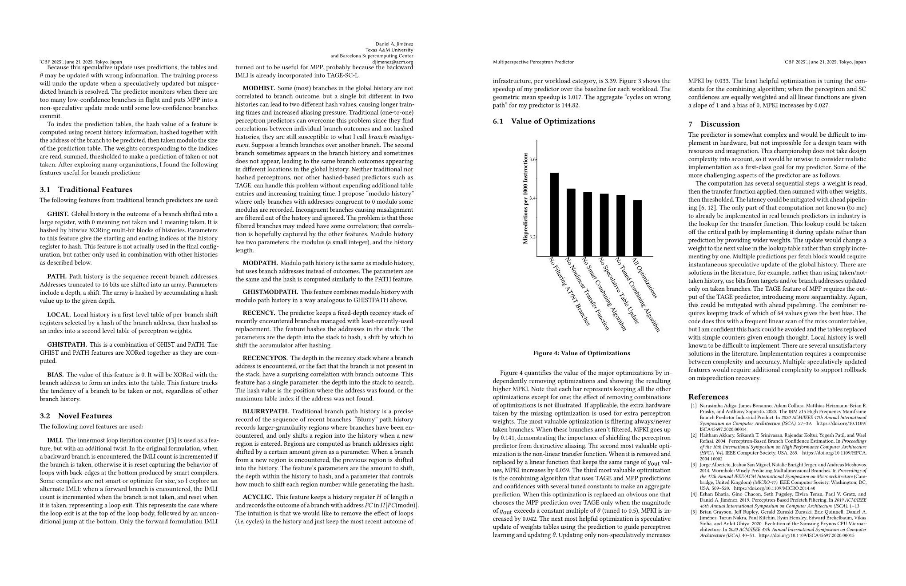

## 从业者评论（补充，不属于原文）

MPP 的主要工程风险是 33 表读、transfer lookup、加法树和大 prediction record，而非“乘法”。MODHIST 解决路径插入/删除导致的历史对齐漂移，但过滤掉的分支也可能是真相关，因此必须由其他视角补回。验证应按特征统计净贡献与 aliasing，而不是只看总和。

## 技术演进位置

该文把 2001 感知机扩展成多特征 hashed ensemble，并与 TAGE 深度融合，解决单一全局/局部历史视角不足；留下巨大的表并发、组合延迟、训练回滚和特征搜索过拟合。

---

# 26. Behrendt 等 2025：Bullseye H2P 专家

**原文：** Emet Behrendt, Shing Wai Pun, and Prashant J. Nair, *Taming Wild Branches: Overcoming Hard-to-Predict Branches Using the Bullseye Predictor*。

**材料：** [本地 PDF](cbp2025/08_behrendt_et_al_bullseye.pdf)

## 原文整理

Bullseye 在 159.34 kB TAGE-SC-L 旁加 H2P Identification Table（HIT）与两种 branch-specific perceptron，总计 187.28 kB。HIT 每静态 PC 维护执行、TAGE 误预测和准确率。若执行 `≥2048+16N_H2P`、误预测 `≥256`，且准确率低于随活跃 H2P 数收紧的阈值，就进入候选；实际常不超过 8–10 条。

候选在 local/global H2P cache 中经历 512 次 warm-up trial。相对 TAGE 胜负计数饱和后，再由一个“线性慢增、反向时减半”的 confidence 识别持续优势。若 TAGE 胜到饱和或 2^16 个动态分支未引用则淘汰，但只有候选等待时才腾位。连续 128 次 perceptron 正确且 TAGE 没赢后，可停止该 PC 的 TAGE/SC 更新，减少污染；置信下降则恢复。

local perceptron 把该分支局部方向历史切成随年龄增大的窗口，对每窗做 parity，再用 PC/窗口双重 hash 选权重；global perceptron 将 `H_g` 全局方向 fold 到固定宽度。两者按 O-GEHL 动态阈值训练。仲裁同时考虑 perceptron 相对胜率、`|output|>θ` 和 TAGE/SC 置信，只在专家持续占优时覆盖。

公开结果为 3.4045 MPKI、145.09 CycWpPKI。对照 192 kB TAGE-SC-L 为 3.4277，159 kB TAGE 为 3.4513。额外状态约 2.375 kB HIT、4.05 kB global perceptron、21.52 kB local perceptron。作者承认未利用数据相关性，且“并行、单周期 arbiter”仍需物理实现验证。

### 正文展开

HIT 是 26 set×8 way；每项以部分 tag 保存 PC，并有 16-bit correct/execution 类计数与 12-bit incorrect/mispredict 计数。准入函数在 `N_H2P<32` 时从接近 100% 准确率门槛缓慢收紧，32–71 时从 95% 每新增一项再降 1%，超过 71 后封底 60%；同时至少执行 `2048+16N_H2P` 次且发生 256 次基线错误。作者实测活跃 PC 通常只有 8–10，但这不是表的硬上限。

trial 内新 branch 至少训练 512 个动态实例，不允许被赶走。相对胜负 counter 饱和之后，另一个 confidence 才评估这种优势是否持续：同方向线性增加，一旦相对赢家反转就减半。淘汰也不是 background aging——只有 HIT 中已有新候选等待时，才删除“明显输给 TAGE”或 2^16 个动态 branch 未被引用的项。这避免空闲时无谓抖动，但 phase 已结束的 entry 可能继续占位到有竞争者出现。

local 模型把最多 124 位该 PC 的方向历史切成随年龄增大的 parity window，以两个独立 XOR-shift hash 读权重，减少单次冲突；global 模型把最近 128 位 global outcome fold 后读取较小的 branch-specific 权重集。二者都按错误或 `|output|≤θ` 训练。global 单独的准确率收益小于 1% BPC，但作为不同上下文在少数长程模式上补 local/TAGE。

arbiter 文字存在一处应显式保留的歧义：小节的第 iii 条说“perceptron 强且 TAGE 不强时才选专家”，紧接的第 iv 条又写成“只要至少一个 perceptron 强就选专家”，两条不能同时作为唯一规则；公开材料未给 RTL 来消歧。其余 gate 定义较清楚：专家需要历史 win-rate 至少约 55% 且当前 magnitude 超过 `θ`；TAGE 强置信来自 provider usefulness=3 或 SC override magnitude>0。本文不凭常识替作者选择其中一个版本。

Selective TAGE Filtering 连续观察 128 次“专家正确且 TAGE 未赢”后停止该 PC 对 TAGE 与 SC 的写更新，论文报告收益小于 0.3% BPC；专家 confidence 降低便恢复。恢复只恢复未来训练，并不能重建暂停期间本可形成的 TAGE 状态，因此 phase 突变时仍可能短暂退化。

成本表把 global/local H2P 容量分别按 16/32 个 PC 计，总状态 187.28 kB；其中 local 权重为 163,840 bit，global 权重为 24,576 bit，另有 PC FIFO、bias、threshold 和管理 counter。附录要求从预测到更新保存对应 local/global histories，但未把每个在途实例的副本数折入表中总计。因此“28 kB 额外状态、并行单周期”是算法预算陈述，不是 SRAM 端口、布线和 checkpoint 都完成后的物理结论。

## 关键图表导读

- HIT→trial→resident→evict 流程是 Bullseye 的真正控制核心。
- 两种 perceptron 分别提供局部窗口与长全局相关，避免只增加同质 TAGE 项。
- MPKI 表显示收益相对 192 kB TAGE 很小但为正，应结合专家成本理解。

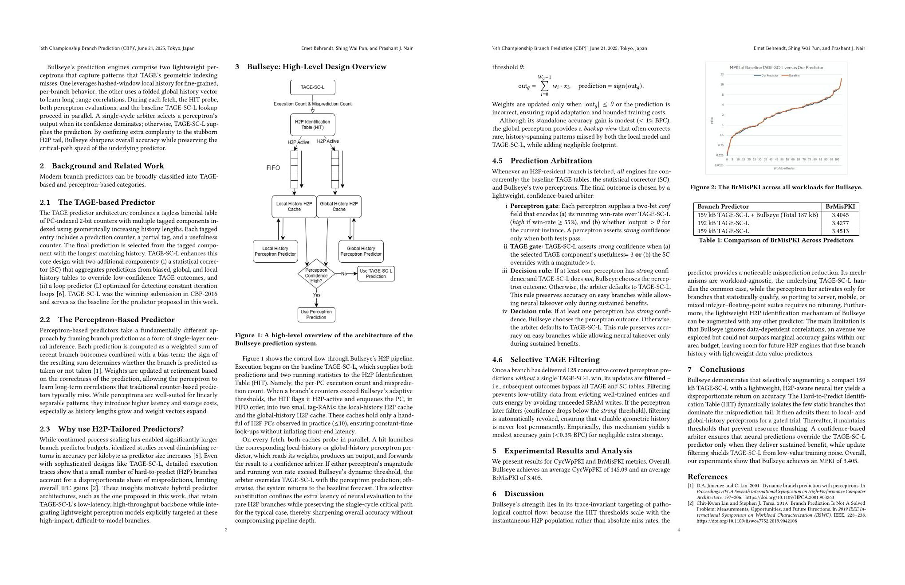

## 从业者评论（补充，不属于原文）

H2P 识别本身需足够长观察期；阈值太低会把暂时冷启动当 H2P，太高则错过 phase。停止 TAGE 训练能减污染，却使专家失效后的回退状态变陈旧。实现计数器应覆盖候选等待时间、trial 胜率、resident 数、过滤写次数和撤销后恢复代价。

## 技术演进位置

Bullseye 把 2019 “少数 PC 主导错误”落成在线 admission 与 branch-specific neural tier，解决通用表为 H2P 反复分配的问题；留下数据相关、阈值泛化和双预测器并行成本。

---

# 27. Fan 2025：BALL Load 值预计算

**原文：** Jun Fan, *Branch Prediction via Load Value Prediction: A Case of BALL (Branch-ALU-Load-Load) Predictor*。

**材料：** [本地 PDF](cbp2025/09_fan_ball_predictor.pdf)

## 原文整理

BALL 在 TAGE-SC-L 误预测后，从 commit trace 构造最多一条 branch、一个 ALU、四个 load 的依赖链，叶子必须是 load。它先预测 load 地址，再查询 BP Data Cache 得值，重演比较产生 flag，最后以已训练的 flag→方向关系预测 branch。load 地址模式包括固定/恒 stride、两界 wrap、pointer chasing 的 base+offset，以及由 E-VTAGE 用 branch path history 预测地址。

为补足 CBP2025 接口，方案镜像 32×64-bit 整数、32×128-bit FP/SIMD 和 flag 寄存器；96 项 commit queue 记录能写目的寄存器的指令；128 set×11 way、LRU 的 BP Data Cache 保存 load/store 值，每 64B line 有 16 个 4B granule valid；8 项 Store Resolve Queue 让有未提交同地址 store 的 load miss，避免明显陈旧值。E-VTAGE 只预测 48-bit load 地址。

256 项 direct-mapped CondBR Chain Table 每项含 branch、一个 ALU 和四个 load node；512 项 ALU Pattern Table 学整数两值比较、整数/FP 与零比较；512 项 Load Pattern Table 学 mem size、stride/wrap/offset 和在途实例数。地址预测优先级为 path-history、wrap、fixed/increment、pointer chasing。只有所有必要 load 命中 BP Data Cache、store queue 无冲突、ALU/flag 置信饱和时 BALL 才给方向；`ball_tage_sel` 决定覆盖 TAGE。

在 105 条训练 trace 上，64 KB TAGE-SC-L+128 KB BALL 为 3.542 MPKI、148.828 CycWPPKI，相对 64 KB TAGE 的 3.751/152.541 改善 5.57%/2.43%，但比同面积 192 KB TAGE 的 3.428/145.411 差 3.32%/2.35%。按类别，BALL 相对 192 KB TAGE 在 FP 上仍好 9.85% MPKI、3.20% cycles；int 则仍差 2.21%。仅 9 条 trace 优于 64 KB TAGE，6 条优于 192 KB。

典型 trace 中覆盖 1.22%–35.02%，命中预测准确率 96.30%–99.80%。最大收益来自 fixed/increment 地址（贡献约 4.45% MPKI 降幅）与两整数比较（约 3.20%）。BP Data Cache 占 97.45 KB；若真实 L1 D-cache 可安全提供端口，BALL 自身约 25.16 KB。作者承认 pointer chasing 需要两次数据访问，延迟可能只适合 lookahead 或 early flush。

### 正文展开

相关工作表把 BALL 与 branch precomputation、value prediction、load-driven prediction、register correlation、address-branch correlation 和 E-VTAGE 逐项区分。BALL 的 slice 被刻意限制为一个 branch、至多一个 ALU 和四个 load，且所有叶节点必须是 load；它不会执行一般算术图，也不直接预测 load value，而是预测地址后访问数据副本。CBP2025 又只能在 fetch 时覆盖一次，不能像 TEA/LDBP 一样在中途产生 early flush，这些都是作者列出的能力边界。

commit queue 反向搜索 RAW 关系来形成八种合法 chain shape；若 branch 源由 load 直接产生，则 ALU node 为空，若 ALU 只有一个源则第二 load 子树为空。chain 新建时同时给 ALU/Load Pattern Table 分配，并把 `ball_tage_sel` 初始化为 128。训练时 pattern 值只在对应 confidence 为零时改写，避免一个偶发新 stride 覆盖已稳定模式；选择 counter 在 BALL 修正 TAGE 时增加，BALL 错时减少，最终只有 128–255 区间允许覆盖。

地址字段也有具体截断：stride 为有符号 13 位（−4095..4095），pointer offset 为 6 位（−31..31），wrap 只存两个边界的低 12 位并用最近 48-bit 地址补高位。Load Pattern Table 的特殊 index/tag 位重排是为避免 `fp_8` 中两个具体 PC 以及同一 load 不同 piece 冲突，属于训练集驱动的实现选择，不应泛化成通用最佳 hash。

Table 6 完整类别结果揭示集中性：相对 64 KB TAGE，FP/int 的 MPKI 分别改善 12.82%/8.21%，compress/web 几乎持平，infra/media 还略差；相对同面积 192 KB TAGE，只有 FP 好 9.85%，int/compress/infra/media/web 均更差。Table 7 的九个受益 trace 中，`int_21/fp_13/fp_8` 改善最大；覆盖率的定义是 `(TAGE错而BALL对−TAGE对而BALL错)/TAGE错`，是净挽救率，不是 BALL 发出预测的普通 coverage。准确率才是 `BALL对/(BALL对+BALL错)`。

Table 8 逐项禁止后的 MPKI 为：fixed/increment 3.709、整数双值比较 3.662、pointer chasing 3.626、整数与零比较 3.595、E-VTAGE 3.576、FP 与零比较 3.576、wrap 3.544；完整为 3.542。这里 fixed/increment 的净贡献最大，wrap 几乎没有平均贡献，但各机制共享 chain gating，差值不能简单相加。

附录实际合计 1,528,698 bit（186.609 KB），低于名义 192 KB；64 KB TAGE 之外，BP Data Cache 798,336 bit，E-VTAGE 54,130 bit，chain/load/ALU tables 分别 47,104/90,624/2,560 bit。`BALL Prediction Time History` 与 `Load Prediction Time History` 被列为“不计入 cost”，而它们仍需跨预测—解析/commit 保存命中、预测值和索引。若复用 L1 data cache，也必须给低优先级借口或专用 read port，并处理一致性和权限；论文只把它列作后续研究。

## 关键图表导读

- 四个真实例子的依赖表说明 BALL 只处理受限且明确的 slice。
- chain 形态图与三个 pattern table 展示训练如何从提交序列还原语义。
- workload/trace 表最重要的结论是收益高度集中，平均仍输给同面积 TAGE。

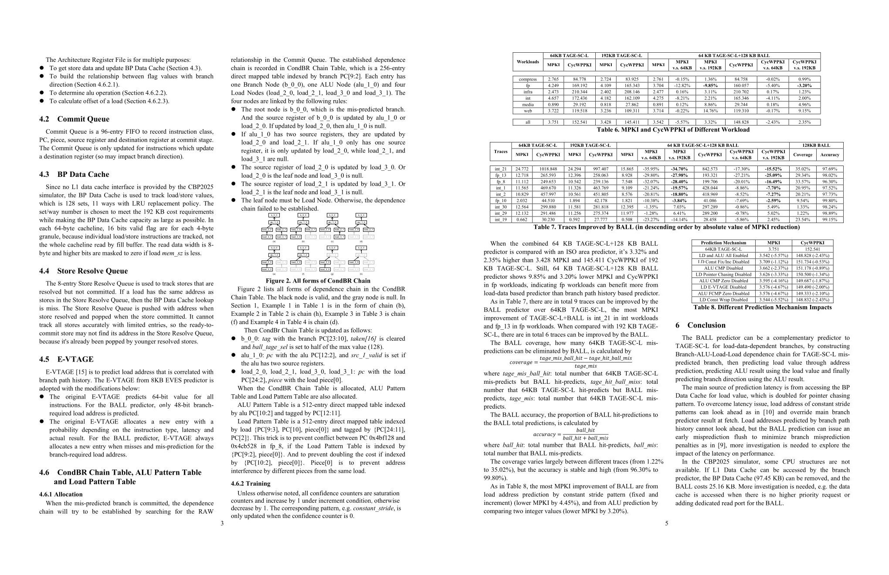

## 从业者评论（补充，不属于原文）

BALL 更像小型 branch pre-execution engine。地址预测错、Cache miss、store 覆盖、指针链延迟任一失败都应禁止覆盖；高条件准确率是经过多层 gating 后的 precision，覆盖率才决定总收益。调用 L1 D-cache 还会与正常 load 争端口并引入侧信道，不能把已有 Cache 视为免费。

## 技术演进位置

该文把 load-dependent H2P 推到显式受限依赖链和数据 Cache 访问，解决少数 FP/int 数据分支的历史不可预测性；留下极高结构/延迟成本、低覆盖和同面积平均不占优问题。

---

# 28. Michaud 2026：CBP-NG 的 VFS 计分方法

**原文：** Pierre Michaud, *A Scoring Metric for the CBP-NG Championship*, 2026-03-31。

**材料：** [本地 PDF](cbp_ng_2026/00_michaud_vfs_scoring_metric.pdf)

## 原文整理

传统 CBP 在固定存储预算下主要比较准确率；CBP-NG 不设简单存储上限，而要求用 HARCOM 建模电路时序、SRAM、布线和动态能耗。模拟器输出三项 Figure of Merit（FoM）：`IPCcbp` 为正确路径预测吞吐（instruction/cycle），`CPIcbp` 为执行阶段长误预测造成的平均丢失 cycle/正确路径 instruction，`EPIcbp` 为预测器动态能耗/正确路径 instruction。VFS（voltage-frequency-scaled speedup）再把三者归一化组合，高者更好。

trace 只含顺序正确路径指令。对每条指令，预测器可给 first prediction 和 second/final prediction，用于 fast+override 结构；P1/P2 不同是 short misprediction，P2 与真实方向不同是 long misprediction。预测时只给 PC，不给 instruction type；无条件跳转假定完美，BTB 不显式建模。分支实际结果和 next PC 在预测后立即反馈，论文明确承认这种及时更新不现实、会高估准确率，但不违反模拟因果。

一个 block 中的指令同周期预测；遇到 taken jump、long misprediction 或预测器主动结束时收束。HARCOM 值带 picosecond timing，P1/P2 最大到达差分别换算 `L1/L2`。单端口 RAM 写可要求额外 cycle。若 `L1<L2`，正确路径预测周期为

`Tcp=(Nblock-Ncoincide)×max(1,L1)+Nshort×L2+Textra`；

否则为 `Nblock×max(1,L2)+Textra`，`IPCcbp=Ncp/Tcp`。长误预测 wrong-path cycle 为

`Twp=Nlong×(L2+Lpipe-max(1,min(L1,L2)))`，`CPIcbp=Twp/Ncp`；能耗为 `EPIcbp=Ecbp/Ncp`。

核心 IPC 模型为 `IPC=1/(1/IPCcbp+CPIcbp)`，并以 `WPI=IPCcbp×CPIcbp` 估计错误路径工作。VFS 假设核心性能受预测器限制、总功率固定；若预测器/核心功耗高，就降压降频，低则可升频。参数 `α=1.625`、`β=16.64`、`γ=3.2`。作者明确说这些假设未必准确，计分公式是比赛工具，“不用于学术研究结论”。

跨 trace 聚合必须先取 `IPCcbp` 调和平均、`CPIcbp/EPIcbp` 算术平均，再计算一次 VFS；不得平均逐 trace VFS，也不得用截断 trace 的 VFS 排名。公开集合是 `Tp`，秘密集合为 `T−Tp`，参考 FoM 由组织者按全集校准。

### 正文展开

模拟主循环逐条处理正确路径指令，但“block”表示同周期预测的一组指令；同 block 的 PC 输入时刻 `t_i` 相同，预测到达时刻 `t'_i` 来自 HARCOM 的皮秒级组合路径。`L1/L2=ceil(max(0,max_i(t'_i−t_i))/τ)`，因此一个 block 中最慢的 lane 决定该级延迟。P1、P2 相同的单预测器也合法，此时进入 `L1≥L2` 的吞吐公式。HARCOM RAM 每周期只准一次访问；预测器主动要求的写周期进入 `T_extra`，不是隐藏在 EPI 中。

`N_coincide` 只计 block 结束与特定 short miss 重合、已经由 taken block 边界吸收的情况；原文脚注把它具体说明为 P1 not-taken、P2 taken。long miss 的 `L2` 被计入处罚，是因为模型假设 decoupled frontend：下一 block 要等 final prediction 已知才开始 fetch；再减去 `max(1,min(L1,L2))`，避免把已在正确路径吞吐中付过的周期重复计算。

VFS 推导先由 `IPC=1/(1/IPCcbp+CPIcbp)` 合并吞吐与错误处罚，再用 `WPI=IPCcbp×CPIcbp` 估计错误路径指令。能量模型假设错误路径单条指令平均只耗正确路径的一半能量，忽略静态功耗，动态能量与电压平方成正比，并近似假设 IPC 不随频率变化。`μ` 与 `λ` 分别代表参考核中预测器和其余正确路径核心能量占比；`γ=3.2` 来自作者构造的 VFS-optimal curve，不是测得的普适工艺定律。

参考 `IPC*` 被设在自然 block-throughput 上限以下但仍很难达到；`CPI*` 取 CBP2025 第二名 TAGE-SC 的准确性并不现实地令 `L2=0`；`EPI*` 约取 CBP-NG 示例 TAGE。组织者用这些值把目标点定在“困难但接近现实”的区域。论文强调 `vfs.py` 可做同规则下的 what-if，但单条或截断 trace 只能观察三项 FoM，不能计算可排名 VFS。

第 5 节还解释为何没有采用固定预测器能耗上限或普通 `E×D^n`：预测器多耗能可能因少走错误路径而降低整核能量，且固定预算难随核心复杂度缩放；常数边际成本近似只适于小范围电压/延迟变化。最终公式是竞赛选择的代理目标，数学上的参考点最优性质并不证明真实芯片也遵守同一曲线。

## 关键图表导读

- 模拟事件与 P1/P2 时序定义决定 short/long miss 的不同代价。
- 符号表和三个 FoM 方程是后续所有 CBP-NG 论文可比性的基础。
- iso-VFS 等高线说明吞吐较低时先提 IPC 更划算；接近参考点后，降 CPI 才更重要；更高 EPI 会压低整体边界。

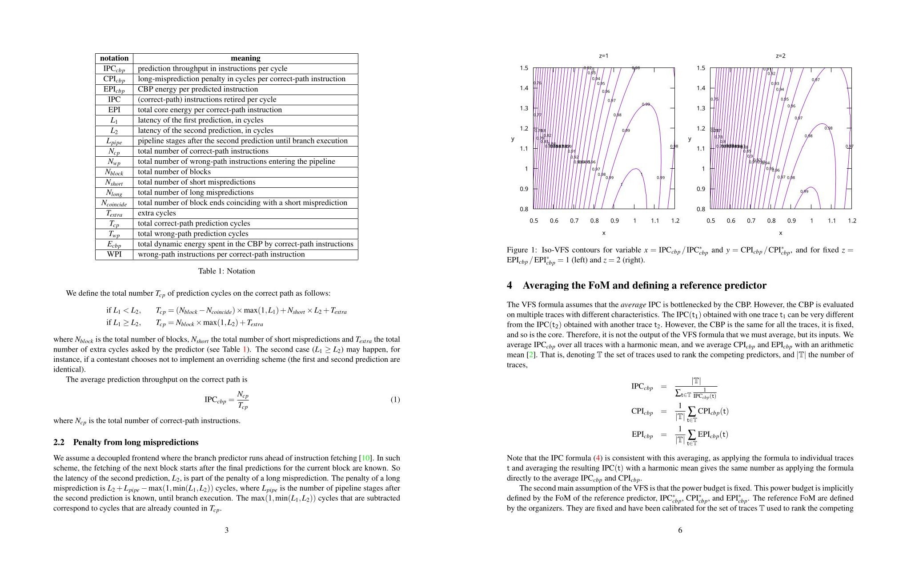

## 从业者评论（补充，不属于原文）

VFS 把物理代价带回研究，但它仍是代理模型：不含真实 BTB、I-cache、backend 瓶颈、静态功耗和精确错误路径能耗。它适合在同一 HARCOM 规则内排设计，不适合声称某方案在所有 CPU 上快多少。后文 VFS 数字必须与相同 simulator 版本、trace 聚合和参考参数绑定。

## 技术演进位置

该文不是新预测算法，而是改变研究目标：从固定 bit 数下最低 MPKI，转向吞吐、最终错误、短覆盖、能耗和物理延迟共同优化。它解决传统竞赛忽略实现代价的问题；留下模型抽象与真实 SoC 的外部效度。

---

# 29. Dang 与 Rotenberg 2026：节能 Ahead-Pipelined TAGE

**原文：** Nhat Dang and Eric Rotenberg, *An Energy-Efficient Ahead-Pipelined TAGE Branch Predictor for CBP-NG*。

**材料：** [本地 PDF](cbp_ng_2026/01_dang_rotenberg_ahead_pipelined_tage.pdf)

## 原文整理

方案只给一套最终方向而非 fast/slow 两个独立预测器，以避免 short misprediction；每 cycle 最多预测 4 条分支，一个 block 在 taken、误预测、256 条指令区域边界或第 4 条分支处结束。10 张 tagged table 的最大历史 100，每个历史长度只用一表以压能耗。

base 与 TAGE 都提前一个 block 发起 SRAM 读，当前 cycle 使用上个 cycle 保存的数据。每 tagged entry 含 11-bit main tag（2-bit branch rank+9-bit hash）、6-bit secondary tag、1-bit prediction、2-bit hysteresis、1-bit useful。secondary tag 用当前 bundle 最后分支预测 target 的低位生成，弥补提前访问时缺失的路径；同配置相对非 ahead 版只差约 0.08 MPKI。作者报告该简化 tag 比对所有 skipped target 做 hash 还降低 0.14 MPKI、约 1% EPI。

base 有 8 bank、每 bank 4 lane，从 missing path 选择结果。tagged 表并行匹配 main/secondary/rank，最长命中为 provider、次长为 alternate。更新采用 split prediction/hysteresis；误预测最多分配两项，无候选时清较长表 useful。预测 bit、hysteresis、useful 和 tag 分开 SRAM，主 tag 读为关键路径；通过 SRAM 邻近放置、复制高 fanout 控制和寄存器切分缩短布线。

作者尝试：连续 512 block 无误预测，且 `mispred×1024 < retired branches` 时关闭第 6–10 张长历史表。约一半 workload 超过 50% bundle 可不读上表，compress_44 可省 25% 能耗且不损准确率；但整体计数/控制能耗与新增误预测使 VFS 几乎不变，最终提交注释掉 gating。

168 条 suite 上：本方案 `IPCcbp=8.6173,CPIcbp=0.051773,EPIcbp=1068.39 fJ,VFS=0.974177`；gshareN-ahead 为 9.172/0.066203/243.92/0.967410；提供的 TAGE 为 5.769/0.054894/1265.45/0.872846。ahead+placement 把延迟 1.7 降到 0.9767 cycle、IPC 4.47→8.5835、VFS 0.7813→0.9718；最终 0.86 cycle，但低于一周期后不再提高 IPC。

总 storage 58.34 KB：base 262,144 bit，10×1024×21-bit tagged 为 215,040 bit，历史/流水寄存器和 gating 状态很小。

### 正文展开

每个 block 在 taken、long miss、256-instruction region 尾或第 4 条条件分支处结束。base 的 8 bank×4 lane 同时读出八种 missing-path 候选，当前 block 的实际 predecessor path 再选一组；tagged table 不枚举所有 path，只靠 6-bit secondary tag 拒绝提前读错的上下文。主 tag 的 2-bit rank 和 9-bit hash、secondary tag、方向/hysteresis/usefulness 必须全部匹配，才可进入每 lane 独立的 longest/second-longest 选择。

更新采用拆分计数：正确会增强 hysteresis；错误先减弱，只有已经弱时才翻 prediction bit。`u` 只在 provider 与 alternate 分歧时按谁正确更新。误预测分配两项比只分一项少约 0.5% misprediction；候选必须位于 provider 之后、`u=0` 且 hysteresis 可替换，无候选才清后续表的 `u`。新项写入实际方向、rank、两类 tag 和初始化状态，随后用 block PC、末分支 rank/方向及 next-block PC 推进 folded history。

物理数据路每张 tagged table 实际拆成 main-tag、secondary-tag、prediction、hysteresis、useful 五个 SRAM；main tag read 是关键路径。prediction 周期消费上一周期寄存结果，同时启动下一次读。错误恢复后若 offending branch 位于 block 中部且本来错预测为 taken，错误 bundle 已发出的后续访问必须被 gate；作者通过复制该高扇出恢复逻辑同时驱动表访问与 folded-history 更新，减少布线延迟。

energy gating 的真实条件是连续 `N1=512` 个 block 无误预测，且 `mispredictions×N2 < retired branches`、`N2=1024`，满足时停读表 6–10。Figure 2 说明接近一半 workload 有超过 50% bundle 原本就不访问这些上表；但完整启用后 VFS 仅 0.9741，略低于最终 0.974177，故提交代码将它注释。`compress_44` 的 25% 节能只是受益个例，不能代表平均。

Table II 还保留一个反直觉时序点：单独 ahead 化把 1.7 cycle 降到 1.1，却因仍跨一周期门槛，IPC 保持 4.47，VFS 反从 0.7813 降到 0.7731；加入邻近 placement 到 0.9767 才跳到 8.5835/0.9718。简化 secondary tag 达 0.926/0.9742，fanout 优化再到 0.86 但分数不变。58.34 KB 中 base 的 32 KB 是最大项；tagged 约 26.25 KB，其余 100-bit GHR、每表 folded/index/tag 流水寄存器和 50-bit gating counter 也逐项计入。

## 关键图表导读

- ahead 数据路图应沿“本周期消费、同时发下周期读”阅读。
- 延迟消融表证明 floorplan/布线优化贡献大于算法微调。
- IPC/CPI/EPI 对比显示本方案 VFS 胜 gshareN 的原因是准确率抵消能耗，而非最低能耗。

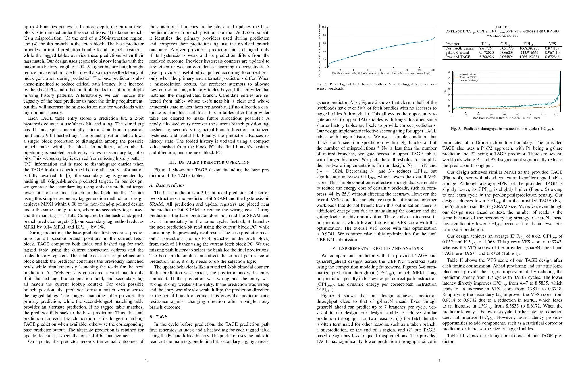

## 从业者评论（补充，不属于原文）

ahead 的核心风险是 context mismatch：发读时未知的 successor/history 必须靠 secondary tag 拒绝，不是“猜中地址即可”。恢复还要禁止错误 bundle 中途发出的下一轮读。低于一 cycle 的剩余时序余量可以换准确率组件，但加一条串行 SC 路径可能立刻跨周期。

## 技术演进位置

该文把 2000 年延迟论点和 TAGE 结合到 floorplan-aware 实现，在接近 TAGE 准确率下获得 gshare-ahead 级吞吐。它解决大表 SRAM 不应处于最终选择关键路径；留下长表能耗和更聪明的 access gating/SC 集成。

---

# 30. Fan 2026：N-Branch GShare 加两张 Tagged Table

**原文：** Jun Fan, *Enhance Ahead-Pipelined N-Branch GShare with Tagged Tables*。

**材料：** [本地 PDF](cbp_ng_2026/02_fan_ahead_pipelined_n_branch_gshare.pdf)

## 原文整理

方案从 `gshareN_ahead` 出发，把一半 GShare RAM 换成两张 ahead tagged table。每 cycle 最多预测 `N=4` 条分支，block 最大 256 instructions；T0 GShare 历史 18，T1/T2 历史 20/80。T0 有 8192 项，每项为 8 条可能 predecessor path×4 branch 的 counter；T1/T2 各 16384 项，tag 9/11 位，每项给 4 条 branch 方向。总 prediction/hysteresis/tag RAM 为 176 KB。

BP0 用前一 block PC 与历史发起读，BP1 根据前一 block 的条件分支数、最后方向和地址生成 path，选择 T0 的 4 个预测；T1/T2 不枚举 predecessor path，而在 BP1 用当前 block PC/history 比 tag。最长命中表一次给整个 4-branch vector。T0/T1 counter 是方向+2-bit hysteresis，T2 为方向+1-bit hysteresis。

误预测时，弱 hysteresis 才翻方向；TAGE 式分配简化为 T0 provider 错则分配 T1，T0/T1 provider 错均可分配 T2。正确时不读 hysteresis，直接写强状态；错误才读减弱，从而与 prediction/tag RAM 访问错开。

三项准确率优化：两项 recent-PC training-direction bias 在 T0 错且旧方向强时用旧偏置训练，MPKI 5.401→5.376；把 predecessor path 混入 tag-table index，5.376→5.365；T0/T1 hysteresis 从 1 增 2 位，5.365→5.228，但 EPI 279.2→312.6、RAM 130→176 KB。RAM floorplan 紧凑排列把延迟 1.17 降到 0.96 cycle；重用同 index 读、把 index 寄存器放近 T1、移除非关键路径重 buffer 继续降能耗。

168 公开 traces 上最终 `VFS=0.9921,IPC=8.893,CPI=0.04705,EPI=312.6,MPKI=5.228,P1/P2=0.96/0.96 cycle`。gshareN-ahead 为 0.9736/6.930 MPKI/243.1 EPI，提供 TAGE 为 0.8728/5.489/1265.5。加 T1/T2 的累积 VFS 分别升到 0.9833/0.9909，是主要收益；bias 与 path hash 只再加约 0.0003 VFS。相对 2025 TAGE-only 的 4.430 MPKI，本方案仍高 18.01%，且 RAM 多 23.25%，说明只有两种 tagged history 的面积效率并不高。

### 正文展开

原始示例 `gshareN_ahead` 是 7 branch、1024-instruction block；提交版缩成 4 branch、256-instruction block，并假定另有 BTB 提供 block 内条件分支 rank。T0 在 BP0 用前一 block 的 PC/18-bit history 一次读 `8 paths×4 lanes`；BP1 用前一 block 地址、条件分支数及最后方向构造 5 种真实 successor path，但为 SRAM 寻址取 8 个幂次候选。T1/T2 的当前 block PC/history 到 BP1 才可用于 tag 比较，所以无需 secondary tag，也不做 path mux。

每个 tagged entry 只有一个 tag，却打包 4 个方向，故一个最长历史表同时成为四 lane provider。prediction/tag 与 hysteresis 分 SRAM；hysteresis 又按 lane 分 4 bank，仅误预测 lane 需要读。错误且 hysteresis 已弱时才写 prediction/tag；T0 provider 错建 T1，T0 或 T1 provider 错建 T2。正确时不读旧 hysteresis，而直接把 T0/T1/T2 写成 `11/10/1` 强状态，使当前块的 read 与训练 write 可重叠；错误需额外周期完成 read-modify-write。

两项 recent-PC bias 实际是极小的 direct-mapped 表：以 skew 后 PC 最低位选项，其余位作 tag，3-bit counter 保存方向和 hysteresis。当 T0 最长匹配预测错、该 PC 命中且 bias 极强时，训练 T0 使用记录方向而非本次真实方向。它意在避免一个异常样本翻动强模式，但也意味着训练目标可暂时故意不等于 outcome；论文只报告公开 trace 上 5.401→5.376 的净结果。

Table I 的累积对照从 half-size T0（64 KB、7.198 MPKI、0.9675 VFS）开始：T1 后 6.118/0.9833，T2 后 5.401/0.9909；bias/path hash 后 5.376/0.9911、5.365/0.9912；2-bit hysteresis 后 5.228/0.9921。相对完整示例 GShare-Ahead，前两 tagged 表加 bias/hash 已使 MPKI 低 22.58%，但 EPI 高 14.85%；2-bit hysteresis再降 2.55% MPKI，却让 EPI 增 11.96%、RAM 增 35.38%，VFS 仅增 0.09%。

三项能耗优化有独立实测：相邻 block index 未变且内容未写时复用流水寄存结果，EPI 320.7→315.5；把 T1 index register 放到 T1 RAM 旁，315.5→313.7；去掉非关键路径过度 buffer，313.7→312.6。floorplan 将分散的 prediction RAM 纵向紧凑排列，才把 1.17-cycle route 降到 0.96。论文对 2025 TAGE 的比较只涉及 MPKI/RAM，没有 CBP-NG 时序能耗模型，不能把它与 Table I 的 VFS 行直接排名。

## 关键图表导读

- T0/T1/T2 图展示“枚举前驱 path 的宽 GShare”与“tag 拒绝错误上下文”的混合。
- 累积表同时列 VFS、IPC、CPI、EPI、MPKI 和 RAM，是正确解读每项优化的依据。
- floorplan 图显示同一逻辑网表因 RAM 相对位置可跨过一周期门槛。

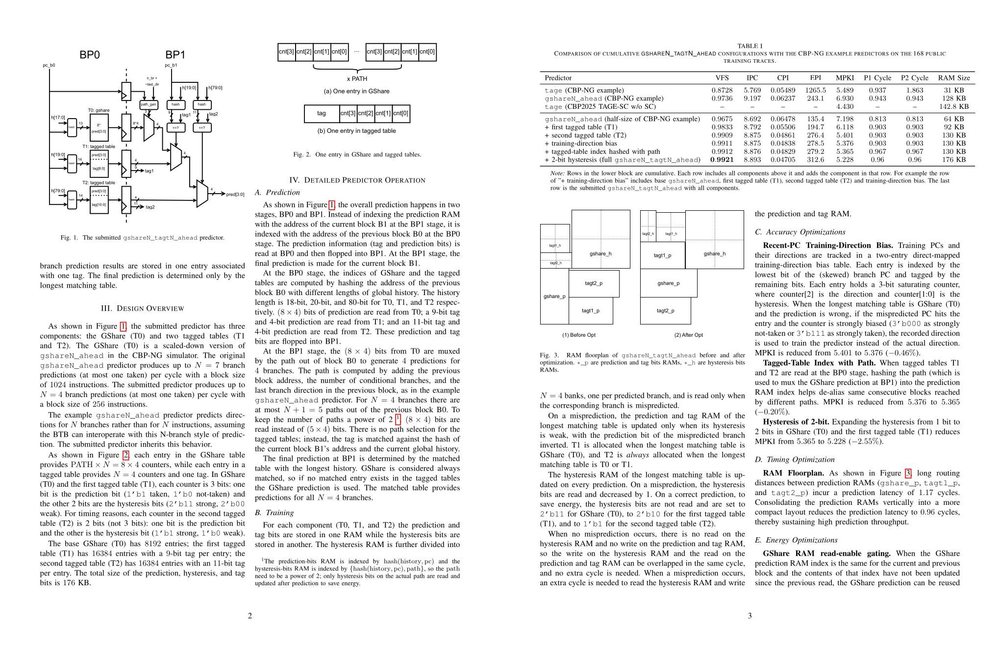

## 从业者评论（补充，不属于原文）

一次表读生成四个 branch 方向能摊薄能耗，但这些 lane 共享同一 provider/history，表达力弱于每 branch 独立 longest match。2-bit hysteresis 的 MPKI 很值钱，VFS 只微升，正说明准确率收益被新增读宽抵消。

## 技术演进位置

该文从高吞吐 GShare 一侧向 TAGE 靠拢，用仅两张 tagged 表获得接近/超过示例 TAGE 的准确率和极高 VFS。它解决纯 GShare 的上下文混淆；留下表面积效率、有限历史层级和 bundle 内共享 provider。

---

# 31. Sethumadhavan 2026：Distilled Branch Predictors

**原文：** Simha Sethumadhavan, *Distilled Branch Predictors*。

**材料：** [本地 PDF](cbp_ng_2026/03_sethumadhavan_distilled_branch_predictors.pdf)

## 原文整理

论文把一周期小预测器 P1 视为 student，把两/三周期大预测器 P2 视为 teacher。与普通 override 不同，P1 不训练真实 outcome，而训练 P2 的方向；P2 仍训练真实结果。目标是让 P1 在线近似 P2 的决策，P1/P2 同意时提前获得 teacher 质量，分歧时 P2 再纠正。

TAGE 实验的 student 为 32 Kib：64B block 内 16 个 4B slot 各一 bank，每 bank 1024 direction+1024 hysteresis，index 为 block address fold 最近 6-bit global history。P1/P2 同意则增强 hysteresis，分歧先减弱，弱时改成 P2 label。P2 每 cycle 可流水发新请求。

可选 one-sided filter 是 PC-tagged 方向表；长期单向时直接给结果并跳过 P2 访问。若错，则恢复访问/训练 P2 并清该项。作者只在 3-cycle CBP2025 teacher 使用，因为 2-cycle 下节省有限。

评测每 trace 预热 1M branch、测 1M branch；hard32 为困难 32 条，full168 为全部 168 条。TAGE teacher 从 1× 到 16×，表数 8–12、每表 512–2048、最大历史 64–192；4× 为 8×2048 tagged、4096 base、11-bit tag、history 100。所有容量上 student 都优于同大小、直接训练 outcome 的 bimodal P1；4× 时 VFS 提高 hard32 0.0132、full168 0.0138。8×/16× 虽 MPKI 更低，却因能耗/三周期延迟 VFS 下降；hashed perceptron 也因能耗重不胜。

CBP2025 teacher 单独在 hard32/full168 为 0.5474/0.6573；bimodal P1+teacher 为 0.7812/0.9646；student+teacher+one-sided 为 0.7818/0.9547。即 hard32 student 略好，full168 反而普通 outcome P1 更好。论文摘要所说相对 teacher 提高 42.8%/45.2% 是加入一周期层级的总效应，不能全部归因于 distillation。

### 正文展开

P1 固定为 64-byte line 的 16 个 4-byte slot bank；每 bank 有 1024 direction bit 与 1024 hysteresis bit，line address 与最近 6 位 global direction fold 后索引。每个请求仍访问流水化 P2，除非 one-sided filter 旁路；P2 可每周期接收新 lookup，只是结果两或三周期后到达。论文明确不评估 non-pipelined multi-cycle teacher，因为请求会在一周期 frontend 后持续积压。

TAGE sweep 的 1×/2×/4×/8×/16× 分别用 8/8/8/10/12 张 tagged table、每表 512/1024/2048/2048/2048 项、最大历史 64/80/100/128/192，tag 10/10/11/11/12 位；4× 是 32 KiB teacher 的主提交点。Table III 给出完整对照：hard32 的 student VFS 从 0.6645 升到 4× 的 0.6768 后回落；full168 从 0.8514 升到 0.8630 后也回落。16× 和 hashed perceptron 虽 MPKI 更低，却分别被第三周期或约 1.8–2.0 pJ EPI 压低 VFS。

student 的训练 label 始终是 P2 direction，而非最终 outcome：一致时强化，分歧先减 hysteresis，下一次仍分歧且已弱才改 direction。P2 自身继续按 outcome 训练，因此 student 只压缩 teacher 当前决策。one-sided 表则例外地依据已解析 outcome 学单向 phase；它命中后既给 final direction 又省 P2 read，若错则在 recovery 重新访问/训练 P2，并清该 PC 的旁路状态。

“teacher 越强越值得蒸馏”存在 break-even：4×→16× 在 hard32/full168 只各降 0.147/0.129 MPKI，抵不过能耗和第三周期；把同一 4× 结果人为改成 P1/P2=1/3，VFS 由 0.6768/0.8630 降为 0.6434/0.8369。CBP2025 teacher 足够强才重新跨过门槛，但 Table V 同时显示 ordinary bimodal P1+CBP2025 在 full168 为 0.9646，高于 student+skip 的 0.9547；后者只在 hard32 以 0.7818 略胜 0.7812。

相关工作还实现了最接近的 Apple 专利式“阻止 alternating branch 训练 student”策略；在本文 TAGE-4× 环境中 IPC/VFS 更差。作者没有由此否定该专利在其他前端或其他预测目标上的作用，而只将它作为不公平风险明确的补充对照。论文结尾提出多 student 互相或向 leader 蒸馏，但未给实验，属于未来方向。

## 关键图表导读

- teacher/student 与独立 P1/P2 图的唯一区别是 P1 训练标签，这正是论文贡献。
- 容量 sweep 说明更准 teacher 不一定有更高 VFS。
- CBP2025 表暴露 full168 上普通 P1 超过 student 的边界案例，应与摘要同时阅读。

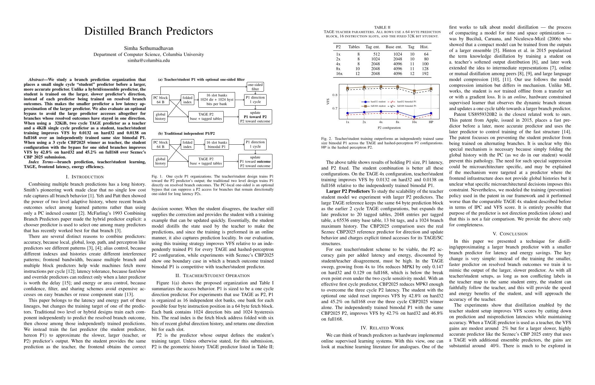

## 从业者评论（补充，不属于原文）

P1 学 P2 会复制 P2 的系统性错误，但目标是降低 P1/P2 分歧和短重定向，不是单独提高 P1 对 outcome 的准确率。应同时统计 P1 对 P2 一致率、P1 对真实准确率、P2 纠正次数、one-sided 错误和被省掉的 P2 能耗。

## 技术演进位置

该文把知识蒸馏引入在线硬件 fast/slow 预测，解决独立 P1 与强 P2 经常不必要分歧的问题；留下 teacher 错误复制、表 aliasing、旁路安全和 distillation 相对普通 override 的有限增益。

---

# 32. Gupta 等 2026：RABT Run-Ahead Block TAGE

**原文：** Prakhar Gupta et al., *RABT: Run-Ahead Block TAGE*。

**材料：** [本地 PDF](cbp_ng_2026/04_gupta_et_al_rabt.pdf)

## 原文整理

RABT 是 75 KB block-level TAGE，每 cycle 为 256-instruction block 最多预测 7 条条件分支。prefetch stage 提前一 cycle 读 15 张表并比较 primary tag；predict stage 校验 5-bit successor-PC secondary tag、选择 provider/alternate。每个 block 有最多 `N+1` successor，方案只发一次读，secondary tag 拒绝错误 successor 上下文，因此不同 successor 会竞争同 index。

每 lane 独立 longest-match，比一个 entry 打包 7 个方向平均降 2.0% MPKI、降 7.2% EPI，但在强 intra-block 相关负载可严重倒退。表历史 `{8,10,12,15,20,25,31,40,50,63,79,100,126,158,200}`；长历史 5 表各 1024、短历史 10 表各 2048；统一 11-bit main tag、5-bit secondary、1-bit pred、2-bit hyst、2-bit useful。8-way banking 处理 ahead read 与 update write 冲突，若第二个写在 buffer 排空前到达，较老写会丢失。

误预测只分配一项；main tag 命中但 secondary/rank 不同的候选跳过，避免覆盖 sibling context。分配压力高时概率跳过近表，无 `u=0` 则放弃。`u` 用 8-bit LFSR 约 3.1% 概率衰减。fallback 为 8192 项、PC≫2 的 7-wide bimodal，另有半大小 hysteresis；4-bit×2048 meta 在 provider 弱且与 alternate 分歧时选择。

168 traces 上 `VFS=0.897,MPKI=8.96,IPC=9.01,EPI=2837 fJ`，预测延迟低于一 cycle。比示例两周期 TAGE 多 3.47 MPKI。大 block 本身只解释约 1.1%；fallback 比传统 bimodal 差 1.376 MPKI，且承担约 65% 预测；最短历史 8 而非 2，改为 2 可降 0.923，二者解释约 52% 差距。其 EPI 是示例 TAGE 的 2.23×，其中 wiring 1961 vs 526 fJ、增长 3.73×，超过 90% 能耗差来自 wiring；8-way bank 和 secondary arrays 令 wire bundle 1.91×、总线长 3.04×。

短历史 bank write loss 为 30%–64%，因 fold 每 cycle 只变少量位，连续 index 常落同 bank。论文保留这些负面结果，结论是 one-cycle latency 能部分抵消准确率/能耗，但仍需更好 fallback、短历史覆盖和 ahead-compatible SC。

### 正文展开

prefetch stage 以 `PC≫2 XOR folded GHR` 读 15 表，并提前完成 8-bit hashed primary tag 比较；另有 3-bit group/rank 信息组成统一 11-bit main tag。predict stage 才用真实 successor block PC 产生 5-bit secondary tag、逐 lane 选 provider/alternate。训练通常与 predict 同周期，误预测则额外占一周期，暂停其他 block 的 prefetch/predict，以避免单端口 tag/secondary RAM 写冲突。

表数与组织来自明确的负实验：第 16 张表使 P2 latency 增 27% 而 MPKI 不降；多项概率分配令 VFS 下降 3.3%；fallback 扩到 16K 又因 EPI 下降分数。分配时若 main tag 相同但 secondary/group 不同，会跳过该 sibling entry，不用当前 successor 覆盖它；高 allocation pressure 时再概率跳过最近候选，把学习推向更长历史。统一 8-bit LFSR 阈值约 3.1% 衰减比 epoch reset、分级 LFSR 或每表阈值稳定。

fallback 以 `PC≫2` 而非 block 对齐 `PC≫5` 索引，后者损失 entry-point 信息并多 0.8 MPKI；独立半容量 hysteresis 采取“连续错两次才翻”，使 fallback 自身 MPKI 降 9.1%、VFS 升 1.9%。尽管如此，fallback 仍负责约 65% 预测并解释估算 0.894 MPKI 差距。4-bit×2048 meta 只在弱 provider 与 alternate 分歧时介入，所有 SRAM write 先做 value-change check。

Table I 的物理分解为 RAM+logic 850 fJ、fanout 26、wiring 1961，总 2837；示例 TAGE 对应 716/29/526、总 1271。RABT 有 603 Kbit、4.26M transistor、0.0265 mm² SRAM，分别约为示例 TAGE 的 2.14×/2.12×/2.01×，但动态功耗达 3.36×。与同表数/相近容量、没有 secondary arrays 的 scaled TAGE 相比，RABT wire bundle 407 对 213、总 Manhattan 长 51.90 对 17.10 mm，说明问题不只是容量。

appendix 还记录多项失败：counter bank rotation 令 write loss 达 78%、MPKI 近翻倍；PC-XOR bank select 对 self-loop 无效；独立 lane 平均较 packed 好，却在 `dcapo-kafka/sampleflow` 分别退化 63.9%/35.9%。估算的 64 KB TAGE-SC-L VFS 使用 3.50 MPKI、示例 TAGE 吞吐以及额外 1800–3000 fJ SC 能耗，且比较 P2=2/3 两种假设；它不是同一实现跑出的精确实测点。

## 关键图表导读

- 两级 ahead pipeline 与跨 cycle 图说明读、预测、训练冲突。
- RAM floorplan/线分布是能耗结论的直接证据。
- MPKI gap 分解与 power 表说明算法容量不是主要解释，fallback 和 wiring 才是。

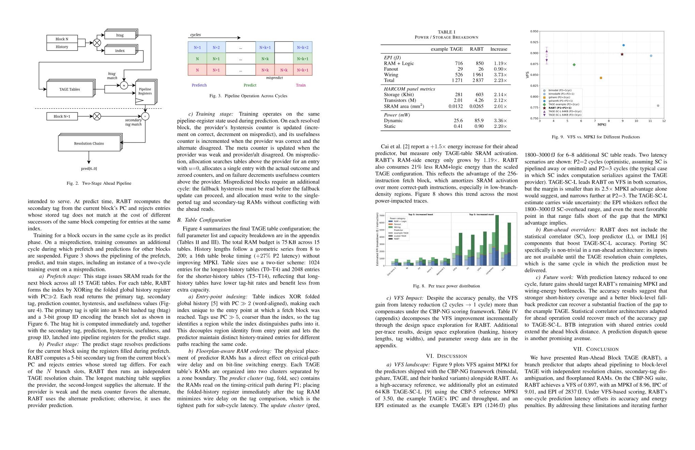

## 从业者评论（补充，不属于原文）

RABT 最有价值的是失败分析：bank 数可减少端口冲突，却增加物理实例与线；提前读可降延迟，却需要 secondary tag 与更多寄存器。HARCOM 中允许丢 update 必须统计，真实 RTL 通常要 backpressure、队列或确定优先级，否则功能结果依赖资源冲突。

## 技术演进位置

该文探索超大 block、7 branch ahead TAGE，并量化 wiring 反噬。它解决 SRAM 访问延迟，却暴露 block fallback、短历史、写冲突和物理线能耗是下一代预测器的主要瓶颈。

---

# 33. Koizumi 等 2026：MORSL

**原文：** Toru Koizumi et al., *MORSL: Minimal-Overhead Rank-Based Predictor with Summation-Free Correction and Lazy Access*。

**材料：** [本地 PDF](cbp_ng_2026/05_koizumi_et_al_morsl.pdf)

## 原文整理

MORSL 是 37.5 KiB rank-based ahead TAGE，每 block 到首个 taken、4 条条件分支或 32 instructions，可跨 128B 边界。base 按 block-start PC 一次给 4 rank；8 个历史长度 `{5,7,11,17,33,65,126,334}`，8 个 2048-entry physical bank 做 2:2 interleaving。每 entry 只有一个 12-bit tag（高 2 位编码 lane）、3-bit counter、1-bit useful，以窄 word 降能耗。path history 每 block 混入 taken branch 自身低地址 6 位。

index/bank mapping 提前一 block，tag 则用目标 block PC 和目标 block 起点历史非提前生成；这样只提前耗时索引/读，不用枚举缺失历史候选。最终在 longest match 与 high-confidence longest match 之间由 meta 选择。

MORSL 用 Tagged Corrector（TC）替代 SC 加法树。TC-bias 是 128 项、2 bank，按 block PC 查，含 7-bit tag、四 rank 的 3-bit direction 与 confidence；TAGE 错时分配，高置信强方向才覆盖。TC-history 是 128 set、2-way、2 bank，使用 BrIMLI+path history，8-bit context tag、rank、3-bit direction、4-bit confidence；TAGE+TC-bias 错时分配，高 confidence 覆盖。它们串行 override，但不做多表求和。

allocation-guided access filter 用两张 2048×1-bit 表记录过去是否为该 PC/context 分配过长历史项。两 bit 都为 1 才读全 TAGE，否则 mini-TAGE 只读两个短历史 bank。全 1 时只退化为 full TAGE，不损准确率；为恢复节能机会，mini-TAGE 全对时以极低概率清 bit，这会引入少量 false negative。

168 traces 上 `MPKI=4.803,EPI=524 fJ,IPC=8.647,VFS=0.9935`，关键路径 286 ps。无 ahead TAGE 4.954/491 fJ/495 ps；ahead TAGE 5.006/510/277、VFS 0.9914；加 interleave、filter、随机 reset、TC-bias、TC-history 后依次 0.9920/0.9929/0.9931/0.9932/0.9935。filter 平均抑制 35.9% tagged-bank 访问，省 87 fJ，只增 0.021 MPKI；无 reset 时抑制 29.7% 且几乎不损 MPKI。TC-bias/TC-history 分别降 0.059/0.081 MPKI，增 47/44 fJ，但 VFS 只增 0.0002/0.0003。

实现共 51 个单端口 SRAM；base 4 KiB、tagged 32 KiB、TC 各不足 0.5 KiB。TC 因读改写可能 stall，2-bank 缓解但 IPC 各约降 0.1。

### 正文展开

论文先比较 offset-based 与 rank-based block prediction，认为 HARCOM 下 rank 组织减少无效 SRAM word 和选择逻辑。MORSL block 不是固定 cache line：遇到首个 taken、第四条条件分支或 32 instructions 结束，可跨 128-byte 边界。8 个逻辑历史通过 8 个物理 bank 做 2:2 interleaving；短历史 fold 每 block 移 3 位、长历史移 1 位。12-bit tag 的高 2 位编码 lane，因此每个 entry 只存一套预测，不形成四 lane 宽 word。

ahead 的边界是选择性的：tagged index/bank 和 access filter 早一 block 生成，读结果进一级寄存器；tag 必须使用目标 block PC 与目标起点历史，仍在目标上下文比较。base 不 ahead，2 KiB 读 166 ps；TC-bias 同样不 ahead。TC-history 虽有 BrIMLI 长路径约 350 ps，却可提前。路径信息取 taken branch 自身低 6 位而非只取 target，因为 target-only 会让同 block、同 target 的不同 branch 无法区分。

TC-bias 只在 TAGE 错时分配，7-bit tag 命中后每 rank 3-bit direction 和 confidence 都可训练；强方向且 confidence 足够才覆盖。TC-history 在 `TAGE+TC-bias` 错时分配，2-way entry 含 8-bit context tag、rank、3-bit direction、4-bit confidence，confidence 2–7 即覆盖。两级是顺序 override，不是把三个输出加起来；这节省 adder，却仍引入 mux 和更新端口。

Table II 同时给 non-ahead 与 ahead 累积点。non-ahead TAGE 4.954 MPKI/491 fJ/495 ps，经 interleave/filter/reset/两 TC 到 4.763/484/580；因超过一周期，论文不为中间项报告 VFS。ahead 基线 5.006/510/277/0.9914，最终 4.803/524/286/0.9935。ahead 带来约 1% 准确率损失，但把 filter/interleave 增加的组合延迟隐藏在上一 block；并不表示逻辑本身变快。

access filter 两张 2048×1-bit 表分别由 block PC 与 `PC XOR shortest-history` 索引；只有两位都为 1 才全读，否则只读 h6/h7 两个短 bank。1 是保守“曾分配过长历史”的证据，最终会饱和而失去节能，故 mini-TAGE 整 block 正确时极低概率清位。短 trace 中 reset 把过滤率 29.7% 提至 35.9%，代价 0.021 MPKI；作者明确把长期饱和留作实际部署问题。

51 SRAM 的端口处理也是结果的一部分：base 为 1 个 prediction+4 个 lane hysteresis SRAM；tagged 的 tag+direction 合并成 8 个 SRAM，hysteresis/useful 因需写拆成 32 个；filter 2 个；TC 共 4 个。HARCOM full reset 限制让 tagged reset 同时清 hysteresis，作者称现实实现不应照搬。TC 正确时也要 read-modify-write，采用 entry forwarding、保证写入和 2-bank；冲突时申请额外 cycle，而不是丢写。

论文还试过约 8-entry sampler，让 TC-history 在三种 history type 中按 PC 动态选择。它确实少错，但 selector/sampler 成本使 VFS 不升，故未采用；这项负结果与未来“低成本多历史 TC”建议应一起保留。

## 关键图表导读

- MORSL block/timing 图展示哪些信息 ahead、哪些留到目标 block。
- mini/full TAGE gating 图说明用“历史分配事实”预测未来表访问价值。
- ablation 表显示 TC 大幅降 MPKI却只微升 VFS，filter 才是综合收益大项。

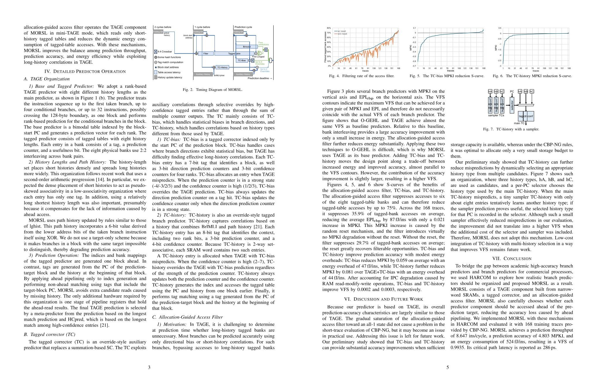

## 从业者评论（补充，不属于原文）

MORSL 展示了实用方向：用 tag 命中做稀疏 override，避免几十路求和；用过去 allocation 作为长表存在性的保守代理。filter 长期饱和会失去节能，所以 reset 策略需在更长运行、上下文切换和多线程下验证。

## 技术演进位置

该文在 TAGE 准确率与 GShare-ahead 效率之间取得很强 VFS 点，解决 wide word、SC adder 和无效长表访问三类成本。它留下 filter 老化、TC 读改写 stall 与真实物理验证。

---

# 34. Pallan 2026：用 Coding Agents 搜索 TAGE 参数

**原文：** Matthew Pallan, *Coding Agents as Design Searchers: An Autonomous TAGE Tuning Campaign for CBP-NG*。

**材料：** [本地 PDF](cbp_ng_2026/06_pallan_coding_agents_tage_tuning.pdf)

## 原文整理

本文主要贡献是搜索流程而非新预测机制。作者报告 Claude Code 主导参数/源码修改、编译、仿真、记录和论文草稿，OpenAI Codex 生成图并做独立对抗式搜索；三周约 237 sessions、2300 多配置，约 10 次长时间无人值守，最长单次 11.2 小时，连续三轮约 30 小时。每次实验写入 12,700 行 journal 和 machine-readable ledger，作为跨上下文记忆。

候选经三档 gate：少数 traces 的 10K warmup/100K sim；168 traces 的 100K/500K；官方 168 traces 的 1M/40M。只有结构上有理由的候选进 full length。31 个配置跑到 full，6 个机制进入最终设计。日志发现 15 个 structural change 中 14 个能迁移，而 16 个 training-dynamics change 中 13 个在 full length 崩塌，31 个分类对 27 个；原因是 500K 时“加速训练”看似提高，40M 稳态后消失。该 heuristic 估计省约 80% full runs。

最终是纯 TAGE：7×2048 tagged、12-bit tag、3-bit hysteresis、1-bit direction/useful，16K×2-bit bimodal，8K×2-bit P1 gshare，global history 160、path 11、128B/32-instruction block。总约 293 Kbit。指标 `VFS=0.9345,IPCcbp=6.844,CPIcbp=0.0517,EPI=1244 fJ,MPI=0.517%,L1/L2=1/2`。

从 stock 0.836 到最终 0.9345，`LOGLB 6→7` 将 IPC 5.6→6.8，约贡献总增益 65%；准确率和能耗合计约 35%，其中纯准确机制约 4%。幸存微调包括 PATHIDX `+0.0024 VFS`、bimodal hysteresis 污染修复 `+0.0010`、4-way skew `+0.0003` 与 write filtering。

SC 未进入方案：P2 约 600 ps 只余 18 ps，SC override mux 增 25–77 ps、四个 RAM floorplan 增 28–44 ps，都会变 3 cycle；把表缩至 32–128 项又使 MPI 约 2.4×。722 个 RAM 声明中 520 个是废 scaffolding，HARCOM 仍按面积计 wire；编译移除后收回 18 ps，这是成本模型效应，不是预测机制。

作者坦陈：反复相信 `<0.0001` 噪声；同一公开集自适应搜索 2300 次会造成 false discovery；搜索是局部/逐参数，没发明新架构；依赖人工重启和模型版本。建议专用 harness 使用 holdout、显著性检验、Hyperband/ASHA/BOHB、联合优化和独立验证。

### 正文展开

两种 agent 的角色并不对称。Claude Code 是主循环，负责提出假设、修改约 57 参数的模板或源码、编译、分档仿真和写日志；Codex 只用于生成图，以及在主搜索停在约 0.934 后接收一份自包含 briefing 做独立、对抗式架构搜索与微小结果复测。人提供固定目标、物理约束和搜索边界，并在长 session 结束时手工重启；所以“autonomous”指区间内不逐步指挥，不表示没有人类设定问题或运维。

三档 gate 的单位在原文是 warmup/simulated instructions：少数 trace 的 10K/100K，全部 168 条的 100K/500K，最后 1M/40M。中档差异按“structural”或“training-dynamics”预先分类后再看 full 结果；前者改变容量/索引/路径上下文，后者主要改变收敛/更新速度。31 个双档配置中 14/15 structural 保持或放大正收益，13/16 training change 崩塌，分类正确 27/31；由此后跳过 16 次 full run，作者估计省约 80% full compute，但漏掉一个 true positive。

最终配置的 293 Kbit 是 persistent predictor state 量级：16K×2-bit bimodal、7×2048 tagged、12-bit tag、独立 direction/3-bit hysteresis/1-bit useful、8K×2-bit P1 gshare，GHR 160、path 11，128-byte/32-instruction block。表 I 的 MPI 0.517% 是 misprediction rate 百分比，不是 MPKI；与前文各竞赛论文的 MPKI 不能同列换算而不先知道 branch/instruction 密度。

Figure 5 的 0.946“ceiling”不是理论上所有预测器的上限，而是保持最终 MPI/EPI、把 `p2_lat=2` 反事实改成 1 得到的本设计时序上界。`LOGLB 6→7` 一项使 IPC 5.6→6.8，解释轨迹约 65%；论文给的局部敏感度是 IPC/MPI/EPI 各改善 1% 时，VFS 约改善 2.4%/1.4%/0.2%。因此“吞吐主导”只针对此操作点和这套 VFS 参数。

SC 的三道障碍也限定在当前 HARCOM 模型和两周期 P2 约束：现有关键路径约 600 ps、余量 18 ps；override mux 加 25–77 ps，四个 read/write RAM declaration 的 floorplan 加 28–44 ps，压成 32–128 项又让 MPI 约 2.4×。722 个声明中 520 个未访问的 scaffolding 仍被 HARCOM 计入布线面积，删后才收回 18 ps。这证明该模型/代码点不能容纳所试 SC，不是证明所有真实处理器永远不能实现 SC。

日志的价值与统计局限并存：12,700 行 journal/CSV ledger 让重启后可恢复假设与结果，却没有保护未触碰 holdout；2300 次对同一 public set 的自适应选择会放大偶然优势。作者明确承认 agent 擅长穷尽局部机械修改、未发明新架构，结果还依赖当时模型版本；方法性结论应复现于固定代码、ledger、simulator 和独立 traces，而不能只引用最终 VFS。

## 关键图表导读

- 三档 promotion 流程与 session 时间图是方法贡献。
- medium/full delta 图用结构/训练动态分类展示“短跑增益幻觉”。
- VFS 轨迹与 SC barrier 表说明最终结果受吞吐/两周期物理边界主导。

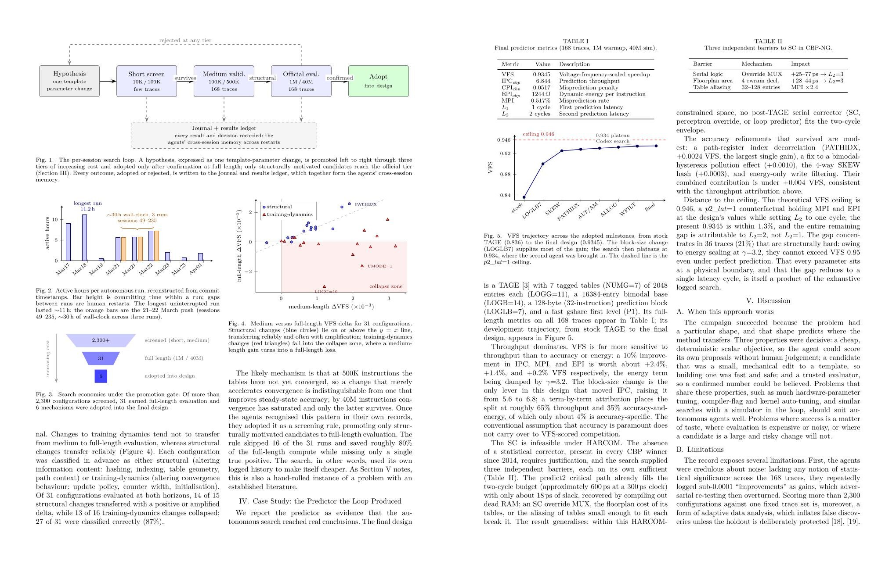

## 从业者评论（补充，不属于原文）

这篇材料的结果应视为作者/工具链自述，不能据此断言某一模型能普遍自主做体系结构创新。最可复用的是实验账本、分级 fidelity 和对抗复验。固定公开 traces 上的上千次适应性试验必须有未触碰 holdout，否则排行榜提升可能只是搜索过拟合。

## 技术演进位置

该文把分支预测设计空间搜索本身变成研究对象，证明自动代理可完成大量可复现实验，也展示其局部搜索、噪声和泛化局限。它解决搜索吞吐与跨 session 记忆；留下统计有效性、架构创新能力和工具版本复现。

---

# 35. Balivada 与 Susarla 2026：Offset-Free TAGE-SC

**原文：** Yashwant Kumar Balivada and Sairam Viswanathan Susarla, *Offset-Free TAGE-SC: Conditional-Branch-Level Prediction for Wide Fetch Frontends*。

**材料：** [本地 PDF](cbp_ng_2026/07_balivada_susarla_offset_free_tage_sc.pdf)

## 原文整理

OF-TAGE-SC 不按 fetch block 内每个字节/指令 offset 保存预测，而按“这是 block 内第几条条件分支”组织 lane。fast P1 是 banked GShare，slow P2 是 branch-rank TAGE-SC；`N` 控制每 block 最多跟踪多少条件分支。这样只为实际条件分支序号供容量，减少对空 offset 的读、tag 比较和选择逻辑。

P2 仍用几何历史 tagged table 和 longest provider/alternate/useful/hysteresis；区别是候选 identity 为第 `i` 条条件分支。轻量 SC 使用三类低延迟上下文：branch-PC bias、taken conditional-branch history、global path history。作者试过 TAGE-confidence 等额外特征，但因串行依赖增加时序而弃用；只有高 confidence 才 override。

公开 168 traces 上按规则先聚合 FoM 后计算 VFS，不报逐 trace/class VFS。提交配置 `N=4,MAXINST=24`，状态 36.5 KiB：`MPKI=5.97,VFS=0.9374,L1/L2=1/2,IPCcbp=7.31,CPIcbp=0.0597,EPI=901.2 fJ`。对照：GShare-Ahead 128 KiB 为 6.93/0.9736/9.20/0.0624/243.1；TAGE 35 KiB 为 5.49/0.8728/5.77/0.0549/1265.5；OF-TAGE（无 SC）38 KiB 为 7.20/0.9287/7.85/0.0720/672.2。故 OF-TAGE-SC 相对 TAGE VFS 提高 7.4%、IPC 提高 26.7%、EPI 降 28.8%，代价是 MPKI 5.49→5.97；它不是全局 VFS 冠军。

后续 `MAXINST=64` sweep：N=3/4 的 VFS 0.9384/0.9490，N=8 最佳 0.9525，此时 `IPC=7.81,CPI=0.0585,MPKI=5.85,EPI=942.0`；N=9/10/11 回落到 0.9424/0.9436/0.9430。说明 lane 覆盖存在 branch-density 最优点，不是越多越好。

### 正文展开

两级结构的职责分开：banked GShare P1 以 global history/PC hash 快速给 rank vector；P2 的 OF-TAGE 仍逐 rank 做几何历史 tag 匹配、provider/alternate 和 usefulness/hysteresis 训练。offset-free 并没有取消 branch identity，而是把 identity 从“第几个 byte/instruction slot”换成“当前 block 的第 i 条条件分支”。因此 `N` 同时决定可覆盖的条件分支密度、并行 lane 数、读能量和 block 提前结束概率。

SC 只保留 branch-PC bias、taken-conditional-branch history 和 global path history，且只有高 confidence 才反转 P2。作者试过 TAGE confidence 等上下文，单看 MPKI 有改善，却因需要先得到 TAGE 状态再形成 SC 索引/选择而拉长串行路径，最终 VFS 更差。原文没有给三类 SC 的精确表深、counter 位宽或训练阈值，因而这些部分只能按架构行为说明，不能补造成可直接 RTL 化的参数表。

Table I 还列出未在摘要展开的基线：hashed perceptron 为 `5.64 MPKI/0.8551 VFS/28.9 KiB`，普通 perceptron 为 `7.16/0.8482/28.9`，GShare 为 `7.43/0.8430/8.0`。对应 Table II，hashed perceptron 的 `EPI=1891.6 fJ` 抵消其准确率；普通 perceptron/GShare 的 EPI 约 621.9/665.2，却有较高 CPI 0.0716/0.0743。由此得到的是同 HARCOM 规则下的多轴位置，而非“神经预测一定低效”。

MPKI 只数 final/long misprediction，P1/P2 分歧产生的 short miss 体现在 `IPCcbp`，不进入 MPKI。作者根据 trace 名称把样本诊断性分成 SPEC-like、JVM/Java/DaCapo/Renaissance/SPECjbb、Web/JS/Node、compression、server、solver/geometry、graph、database、FP/media；Figure 6/7 只画类别 EPI/IPC，不计算类别 VFS。所有分数仍对完整 168 条先聚合三项 FoM。

提交版 36.5 KiB 只比 35 KiB 示例 TAGE 多 1.5 KiB、约为 128 KiB GShare-Ahead 的 1/3.5；然而 OF-TAGE 无 SC 的表中状态写 38 KiB，说明容量不是简单“加 SC 必增”。原文没有进一步分解为何两个实现预算反向，不能据此推断 SC 本身为负容量；应把 36.5/38 KiB 当各自最终 modeled persistent state。

`MAXINST=64` sweep 与提交的 `MAXINST=24` 同时改变 block window，故 N=4 的 0.9490 不能解释成“只把同一个 N=4 实现重跑”；window 增大也是差异。N=3→8 同时提高 branch coverage、IPC 并略降长误预测，超过 8 后额外 table activity/EPI 反噬。该 sweep 是公开训练集 observed optimum，不是隐藏集或不同 BTB/branch-density 下的固定最优 N。

## 关键图表导读

- offset-based 与 rank-based 对比图说明“预测身份”改变如何节省无效 lane。
- 表 I/II 必须联读：TAGE MPKI 最低，GShare-Ahead VFS 最高，OF-TAGE-SC 是更平衡且小存储的 TAGE 点。
- N sweep 把 coverage、IPC、EPI 和最终错误的非单调关系展示得最清楚。

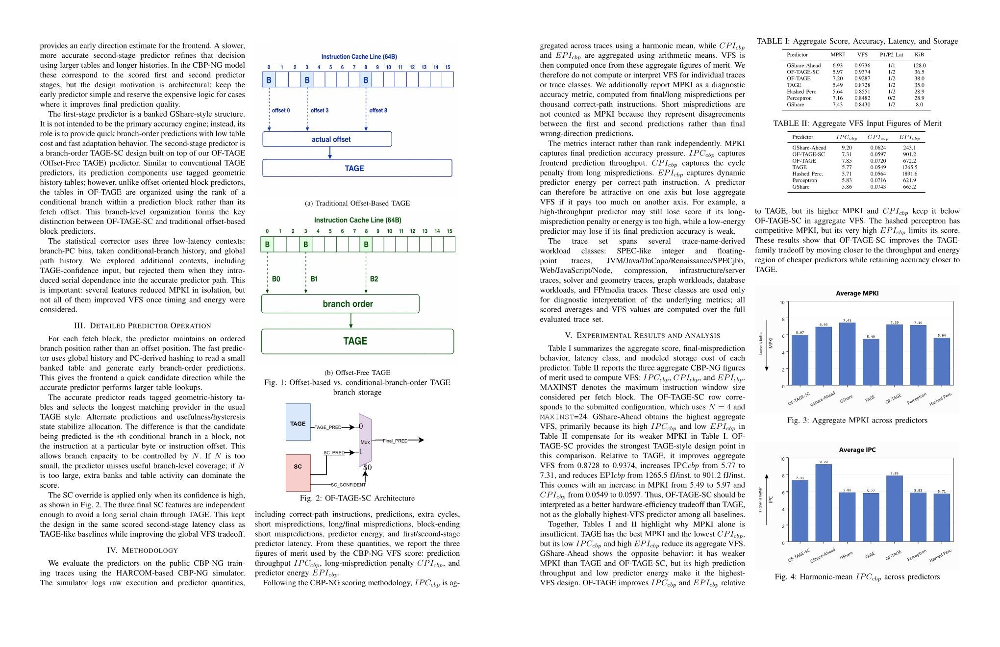

## 从业者评论（补充，不属于原文）

rank-based 方向预测假定 BTB 能在同一 block 给出条件分支顺序和位置，论文的方向模型没有把 BTB 能耗/漏识别计入。真实前端需把 rank vector 与 branch metadata 对齐，taken 后屏蔽更年轻 lane，并在 BTB 更新或 instruction boundary 变化时恢复一致性。

## 技术演进位置

该文把 wide-fetch 预测从 offset 空间重映射到条件分支序号，解决大量无效 lane 的吞吐/能耗浪费，并以小容量 TAGE-SC 获得较平衡 VFS。它留下 BTB 协同、lane 对齐、block 边界和真实取指集成。

---

## 文档边界

35 份材料已经逐篇独立整理。早期论文的准确率来自各自老 ISA、编译器与 trace；CBP2025 数字来自 105 条公开训练 trace 和 192 KiB 规则；CBP-NG 数字来自 168 条公开 trace、HARCOM 时序/能耗模型和 VFS 聚合。三者回答的问题不同，不能按单列 MPKI 或准确率跨时代排名。

本文没有可核对的 RTL 输入，因此所有“实现”均指论文作者描述或参赛模型，不是某款处理器 RTL 已确认事实。涉及真实处理器的建议均放在“从业者评论”中，并应在具体工程里通过索引/tag/provider、队列/端口、训练/分配、推测更新/回滚、短/长重定向和能耗计数器重新验证。
