# AMD Ryzen 9 7950X3D：Zen 4 的 V-Cache 容量、延迟与调度取舍

> **文章来源**
>
> - 文章：*AMD’s 7950X3D: Zen 4 Gets VCache*
> - 撰文：Chester Lam
> - 首发：Chips and Cheese
> - 发布：2023 年 4 月 23 日
> - 链接：https://chipsandcheese.com/p/amds-7950x3d-zen-4-gets-vcache

DRAM 延迟与带宽长期落后于核心计算能力，处理器因此从三级缓存发展到堆叠 SRAM。AMD 在 5800X3D 上把 64 MB Cache Die 叠到 CCD 上，7950X3D 又把方案带到 16 核：两颗 CCD 中只有一颗带 V-Cache，L3 为 96 MB；另一颗仍为 32 MB。这种不对称看似麻烦，却恰好能隔离容量、延迟和频率各自的影响。

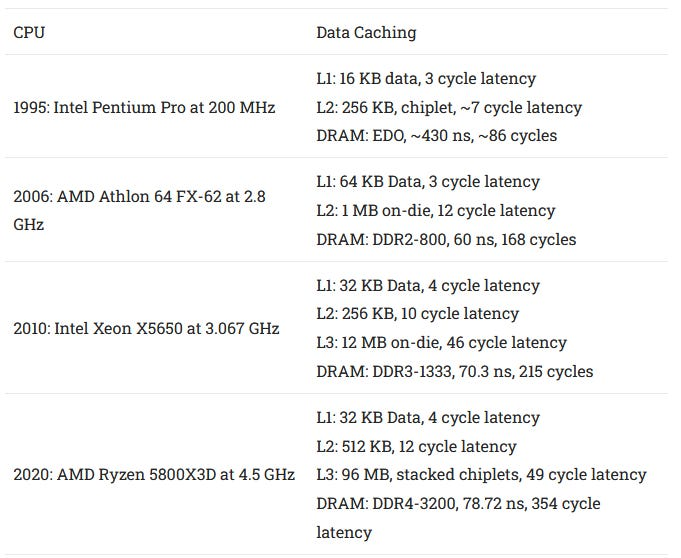

*图 1：周期延迟来自本地微基准，片外延迟随内存配置变化；数据由多位测试者提供，适合作量级背景而非统一平台排名。*

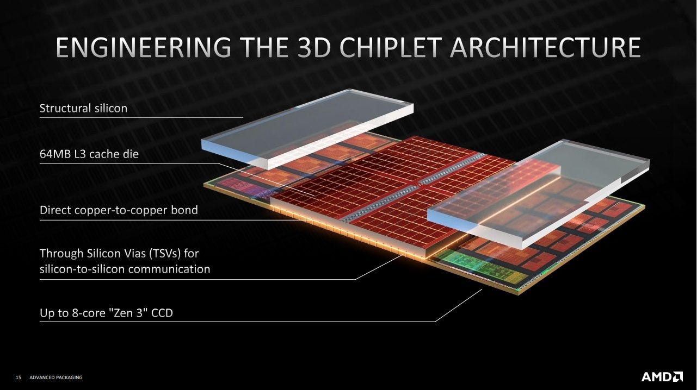

*图 2：AMD Hot Chips 32 幻灯片。64 MB SRAM Die 通过硅通孔（TSV）叠在基础 CCD 上。*

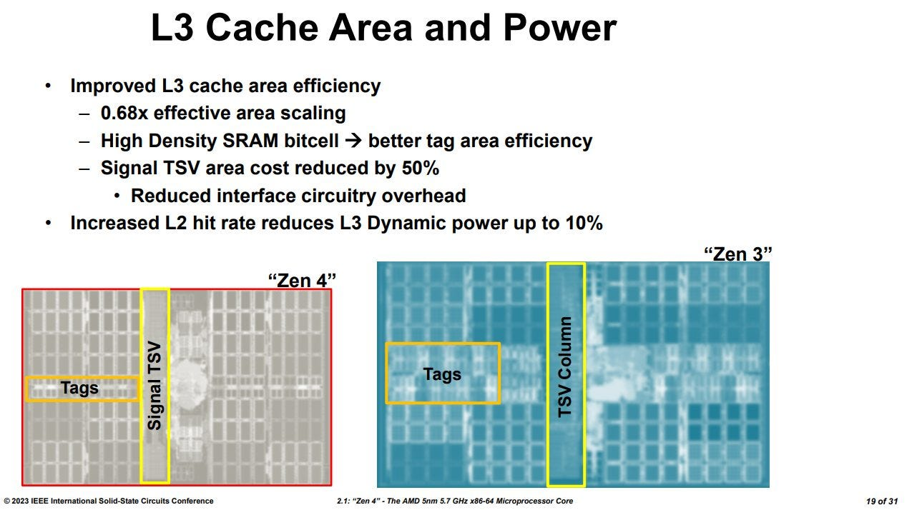

*图 3：AMD ISSCC 2023 幻灯片。5 nm 让基础 L3 与 TSV 列明显缩小，尽管 I/O 的制程缩放通常弱于逻辑。*

*图 4：一颗 CCD 为 96 MB L3，另一颗为 32 MB；只有半数核心得到额外容量。*

## 高频 CCD 与大 Cache CCD，谁更快没有固定答案

堆叠 Cache 对高电压的容忍度较低，V-Cache CCD 的 Boost 因而受限。依赖整数加法测得，V-Cache 核心多在 5.2 GHz，普通 CCD 可到 5.5 GHz以上，最佳核心接近标称 5.7 GHz；普通 CCD 平均约高 7%。

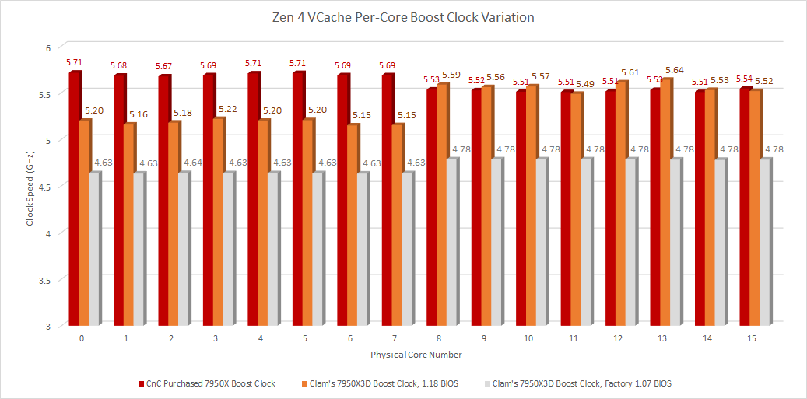

*图 5：以一周期整数加法延迟估频。普通 CCD 约快 7%，比普通 7950X 两 CCD 约 3% 的差距更大。*

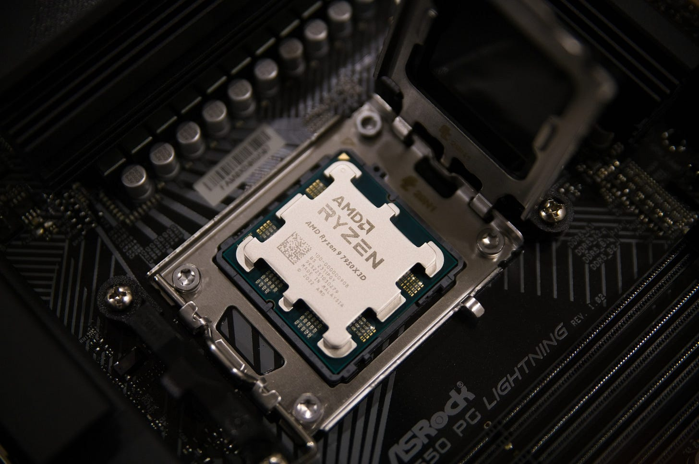

*图 6：测试板为 ASRock B650 PG Lightning。Zen 4 V-Cache 所有核心都能明显超过 5 GHz；5800X3D 为 4.5 GHz，而 5950X 最高约 5.05 GHz，代际上的频率折损从约 10% 缩小。*

旧 BIOS 虽能启动 7950X3D，却把两颗 CCD 分别限制在约 4.63/4.78 GHz；更新到标称支持 V-Cache 的 BIOS 1.18 是必要步骤。这一现象也说明 Boost 结果包含 AGESA/固件政策，不能只看硅片。

## 延迟只多四周期，实际时间多约 1.61 ns

关闭 Boost、固定 4.2 GHz，用 Pointer Chasing 隔离周期差异。V-Cache CCD 的 L3 约多四周期；再把较低 Boost 计入，真实延迟差约 1.61 ns，换来三倍 L3 容量。

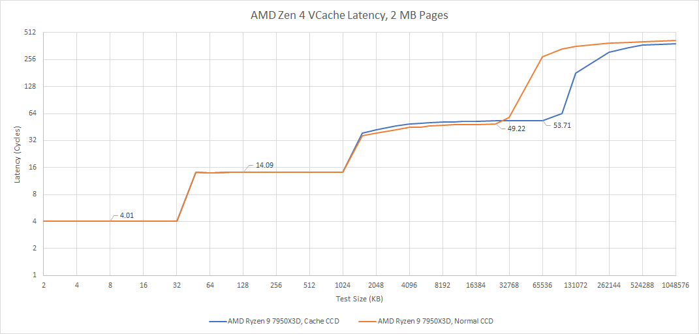

*图 7：亲和性固定到各 CCD 最快核心；容量拐点与约四周期差来自实测，不是 AMD 标称延迟。*

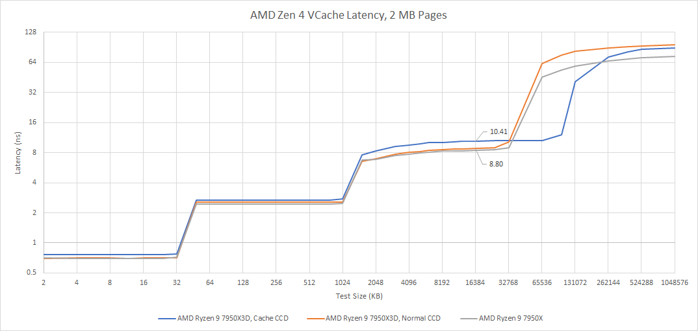

*图 8：频率差放大了周期惩罚，但 1.61 ns 相对容量增益仍小。*

### 体系结构视角：容量、命中率与命中延迟要一起算

额外 Cache 是否有利，取决于“新增命中省下多少次 DRAM/L3 miss”能否覆盖每次 L3 hit 多出的延迟与频率损失。更大的 1 MB L2 会先截住更多访问，让 Zen 4 对 V-Cache 的 L3 惩罚更不敏感。验证时应同时测 L3 MPKI、命中率、IPC、核心频率和端到端时间，不能只比较容量。

## 带宽：环形互连不变，主要差异来自频率

V-Cache 是给每个 L3 Slice 增容，CCD 内连接核心与 Slice 的双向环仍基本不变。单核读取时普通 CCD 的 L3 GB/s 高 11%，大致对应频率优势；关闭 Boost 后按 4.2 GHz 换算，二者 B/cycle 几乎相同。

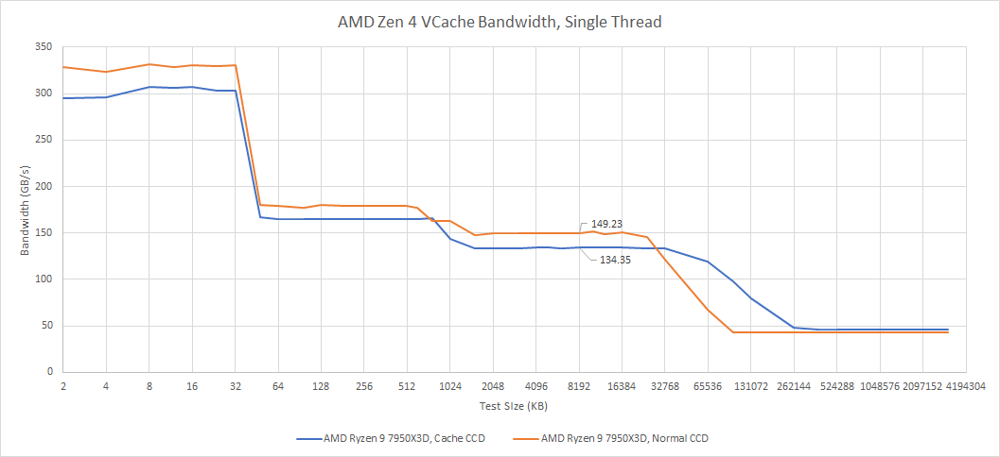

*图 9：手写汇编读取循环；普通 CCD 的绝对带宽领先约 11%。*

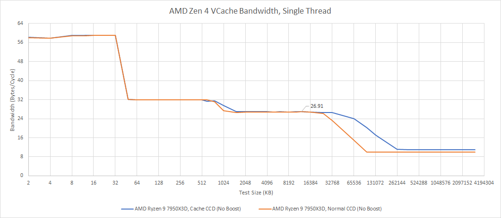

*图 10：消除频率后，两颗 CCD 的接口吞吐近似一致。*

全 CCD 读取 L3 工作集时，V-Cache CCD 约 4.8 GHz，普通 CCD 约 5.15 GHz。

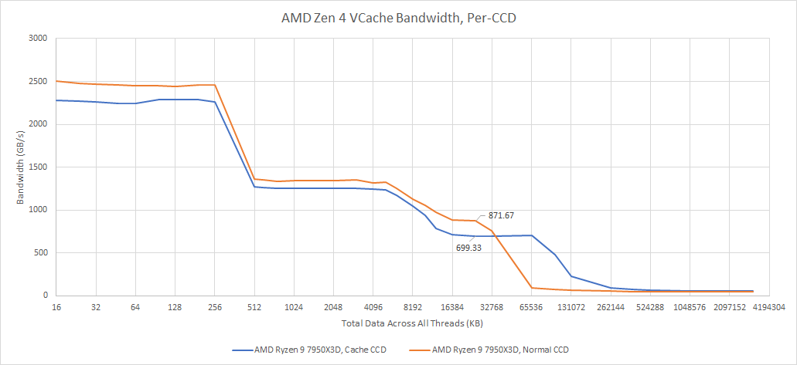

*图 11：高负载下 V-Cache 仍有频率折损。*

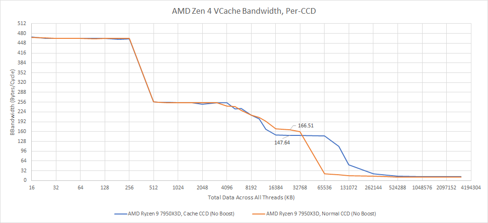

*图 12：V-Cache 每核平均 18.45 B/cycle，普通 CCD 为 20.8 B/cycle。L3 命中数×64 B 与软件带宽相符，但为何仍有差距尚不清楚。*

## 用 L3 计数器看哪些负载真正需要容量

计数器从 L3 视角统计，会包括投机访问和预取，不能等同于退休 Load 命中率。所有测试关闭 Boost、固定 4.2 GHz；游戏使用 RX 6900 XT 固定 2 GHz，关注 IPC 而非绝对帧率。

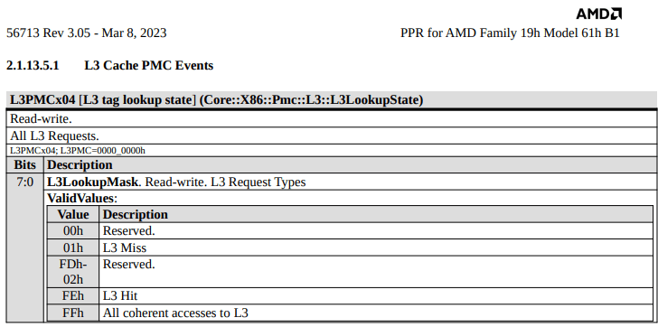

*图 13：事件口径是 L3 侧请求，结果需保留投机和预取边界。*

GHPC 只用少量核心，适合锁定单 CCD。

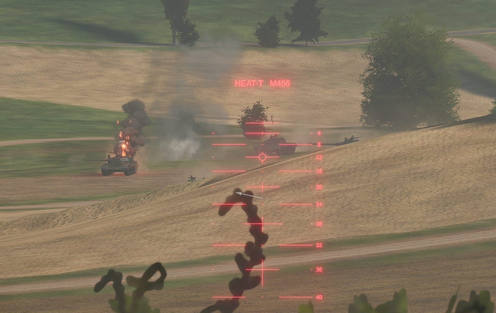

*图 14：场景同时可能受 CPU 与 GPU 影响，因此用 IPC 隔离 CPU 侧趋势。*

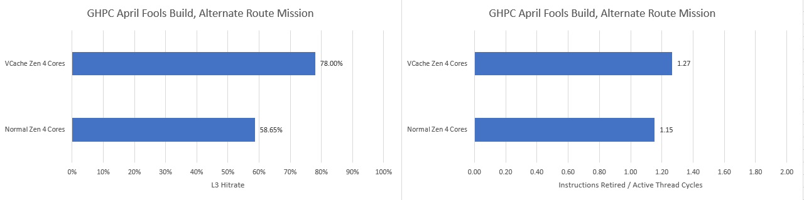

*图 15：命中率提高 33%，到约 78%；IPC 提高 9.67%，足以抵消普通 CCD 的频率优势。*

Cyberpunk 2077 使用内置 Benchmark、光追 Ultra，整体偏 GPU Bound，实际只多 0.5 FPS；但 CPU IPC 从 1.26 到 1.43，提高 13.4%，V-Cache 命中率为 63.74%。

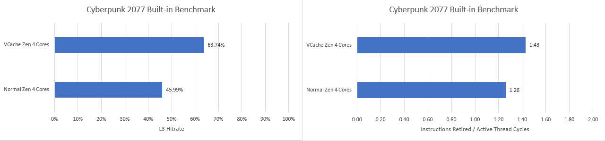

*图 16：这里只能证明同一受限场景的 CPU 每周期工作量改善，不能把 13.4% 直接写成整机帧率增益。*

DCS 用大量飞机、舰船与导弹的固定地图视角，开启 Open Beta 多线程版并加速仿真，但实际只加载两三核。

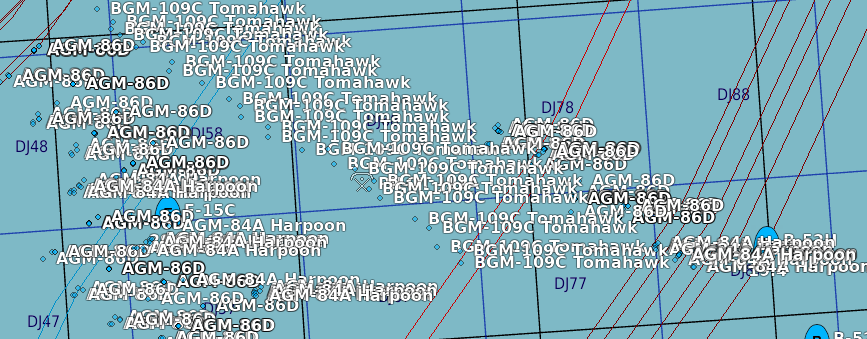

*图 17：场景用于尽量提高 CPU 负载，并非完整游戏代表。*

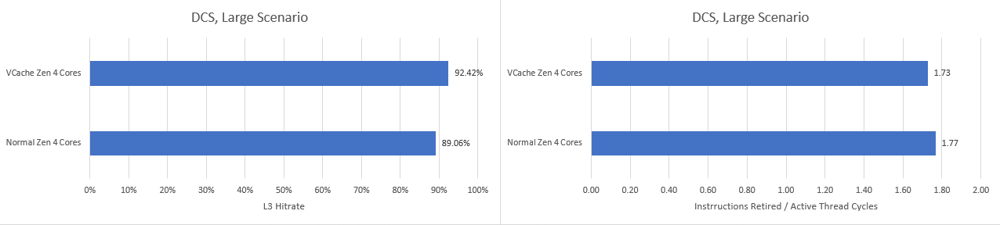

*图 18：普通 CCD 已只有 0.35 L3 MPKI，V-Cache 降至 0.28；容量几乎无空间发挥，IPC 反而略降，可能是 L3 延迟所致。*

COD Black Ops Cold War 用 Zombies 的 Outbreak Collapse，多人过程不完全可重复。

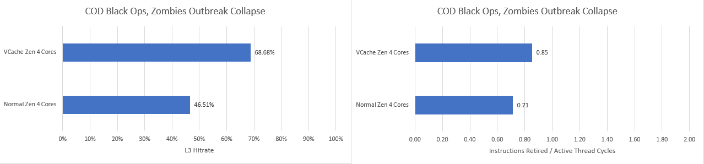

*图 19：32 MB L3 低于 50% 命中率、8.66 MPKI；V-Cache 使命中率提高 47%，IPC 提高超过 19%。*

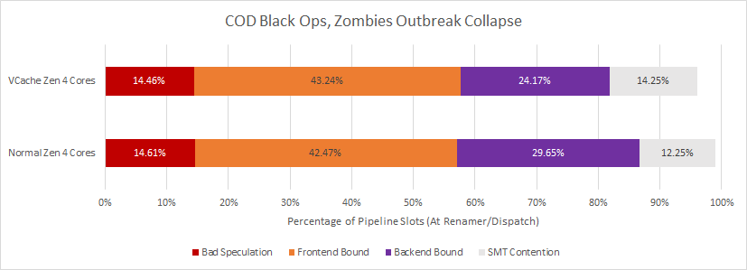

*图 20：V-Cache 减少 Backend Bound，说明执行端得到更稳定的数据；Frontend 瓶颈几乎不变，支持新增命中主要来自数据侧。SMT Contention 只是该线程未获 Dispatch 选择的周期，严格说不属于同一种停顿。*

libx264 用 `veryslow` 转码 Overwatch 片段。

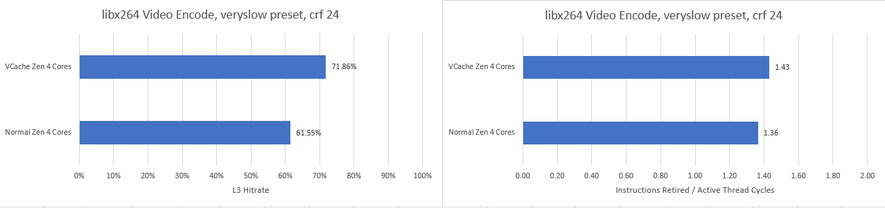

*图 21：命中率从 61.5% 到 72.8%，提高 16.75%；普通 CCD 仅 1.48 MPKI，IPC 只增 4.9%，低于约 7% 的频率差，普通 CCD 很可能更快。*

7-Zip 不用内置混合 Benchmark，而压缩一个 2.67 GB 文件，只看更耗时的压缩。

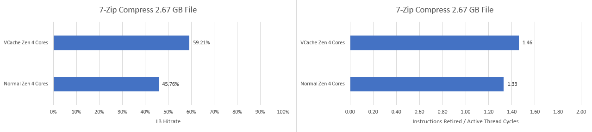

*图 22：命中率提高 29.37%，IPC 提高 9.75%，说明大 Cache 并非只利好游戏。默认策略却会把普通应用放到高频 CCD，受益程序可能需要亲和性或更好的调度提示。*

## 与 Intel eDRAM L4 比较：封装互连决定 Cache 能放在哪一层

Haswell/Broadwell/Skylake 曾用 128 MB eDRAM Die 作 L4。容量惊人，但延迟超过 30 ns。

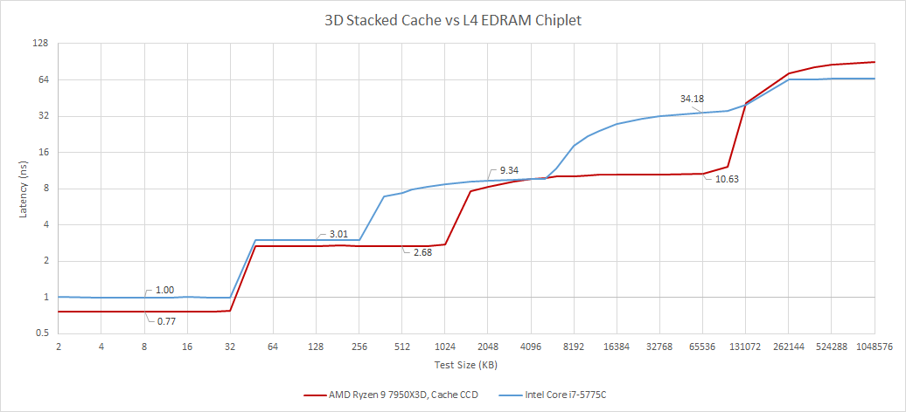

*图 23：eDRAM 需要绕 Ring 到控制器再跨 Die，因此不可能像 V-Cache 那样成为紧耦合 L3 扩展。*

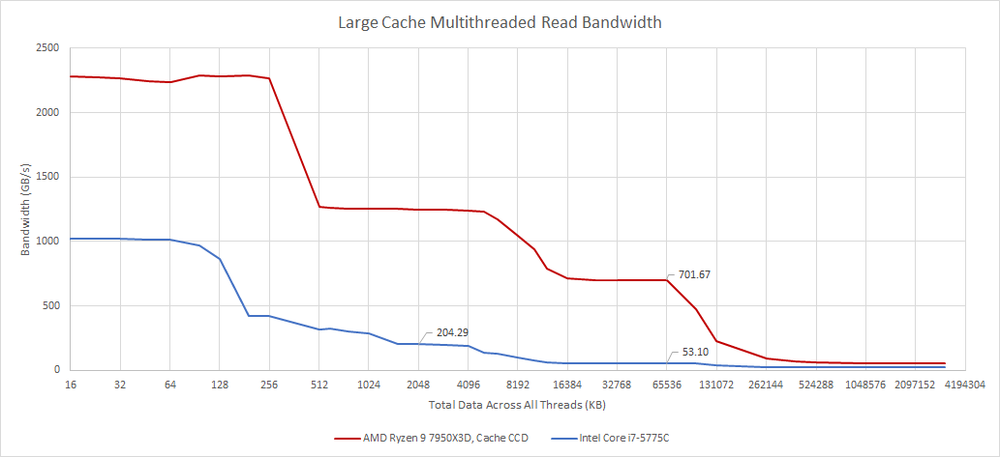

*图 24：约 50 GB/s，虽高于双通道 DDR3，却只有 Broadwell L3 的约四分之一。*

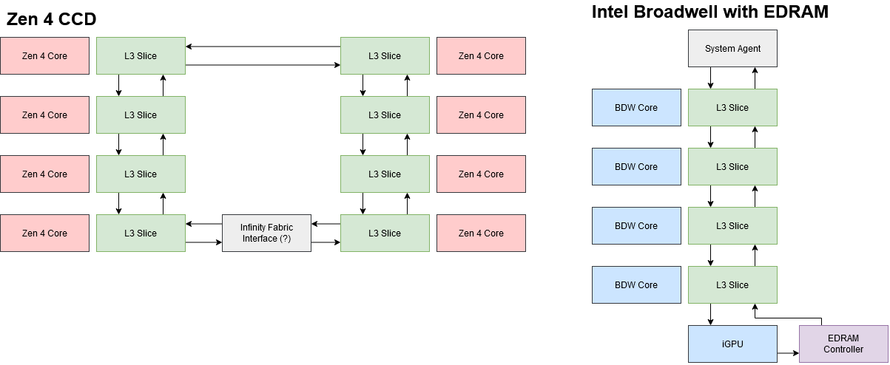

*图 25：Haswell OPIO 为全双工 64-bit、6.4 GT/s，每方向 51.2 GB/s。Zen 4 每 CCD 跨 Die Infinity Fabric 读约 64 GB/s、写约一半，也说明普通封装走线难以承载 L3 内部带宽。*

TSV 与 Hybrid Bonding 把引脚数量提高多个数量级；每个名义 4 MB L3 Slice 对接一个带 Tag 与 LRU 的 8 MB扩展。文章推测控制器按部分地址位决定访问基础 Die 或 Cache Die，再比较 16 个 Tag；这是依据组织作出的推断，不是 RTL 确认。

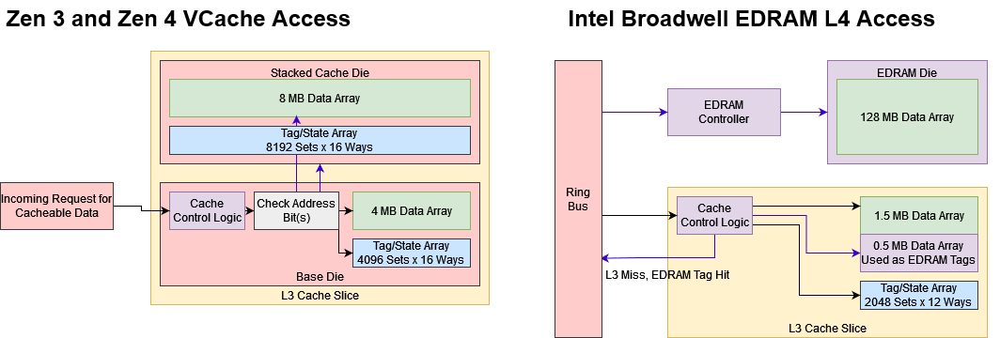

*图 26：高密度垂直互连让堆叠 SRAM 可频繁服务 L3 请求，而非只作慢速末级备份。*

Broadwell 为降低 L4 Tag 查询代价，借用部分 L3 Data Array 保存 eDRAM Tag；Skylake 则把带专用 Tag 的控制器放到 System Agent，但延迟更差、带宽相近。eDRAM 还需要刷新，本体性能也低于 SRAM。

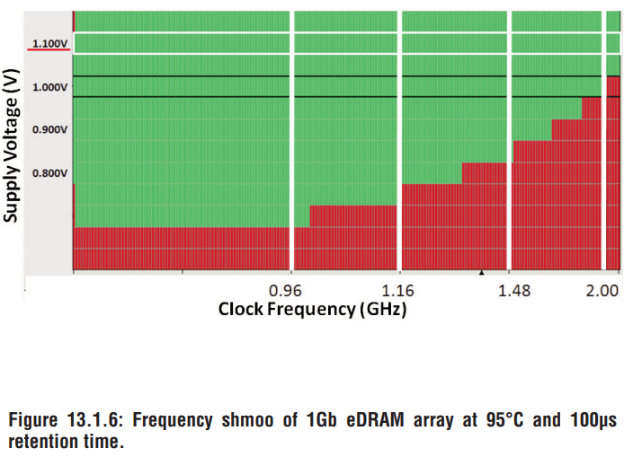

*图 27：来自 ISSCC 2014。eDRAM 本体和跨 Die 接口共同限制它只能成为 L4；V-Cache Die 使用可跟上 L3 的 SRAM。*

当时 Linux 补丁暗示 Meteor Lake 可能有 L4。先进封装或许提高带宽，但若仍是独立层级，CPU 延迟潜力大概率不如紧耦合 V-Cache；它可能更偏向对延迟不那么敏感、却需要容量和带宽的核显。这是文章当时的预测，不是本文对后续产品的事实更新。

## 结语：7950X3D 没有单一“最快 CCD”

V-Cache 用约四周期、1.61 ns 的 L3 代价换三倍容量，在 GHPC、Cyberpunk、COD 和 7-Zip 中产生显著 IPC 收益；DCS 已几乎不 miss，libx264 的收益又不足以覆盖频率差。测试场景虽少，却清楚说明 7950X3D 的两类 CCD 各有优势。

异构化因此把新任务交给操作系统：识别工作集、选择高频或大 Cache 核心，并在程序阶段变化时迁移。放错位置通常不会造成灾难性损失，却不存在仅凭 SKU 名称就能确定的绝对顶配。Intel 的 P/E Core 与 AMD 的非对称 V-Cache 都在表明，未来“同一封装内核心性能不完全相同”会越来越常见。

## 参考资料

- Chester Lam, *AMD’s 7950X3D: Zen 4 Gets VCache*, Chips and Cheese, 2023-04-23
- AMD Hot Chips 32、ISSCC 2023 V-Cache 资料
- *A 1Gb 2 GHz Embedded DRAM in 22nm Tri-Gate CMOS Technology*, ISSCC 2014
