# Bergamo：AMD 如何用 Zen 4c 把服务器堆到 128 核

> **文章来源**
>
> - 文章：*Testing AMD’s Bergamo: Zen 4c Spam*
> - 撰文：Chester Lam
> - 首发：Chips and Cheese
> - 发布：2024 年 6 月 22 日
> - 链接：https://chipsandcheese.com/p/testing-amds-bergamo-zen-4c-spam

Server CPU 长期追逐高 Core Count，只是方法不断变化。Bergamo 不再单纯扩大 Interconnect，而是用 Density-focused Zen 4c 在近似 Silicon Area 内塞入更多核心。Cloud Provider 按 Core 出租算力，Core 越多，同一 Physical Server 能服务的 Customer 越多；高度并行应用也更容易从“加核心”获得收益，因为提高单核性能很快遇到边际递减。

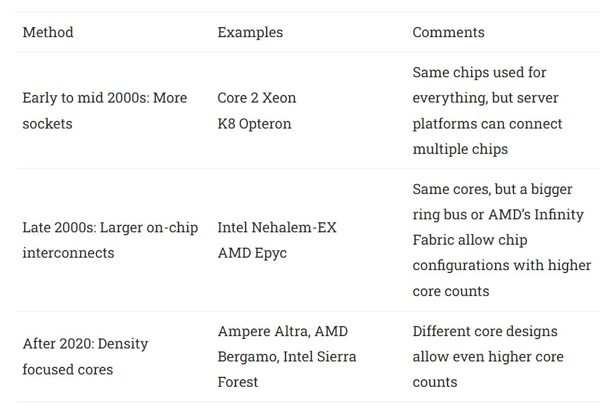

*图 1：Bergamo 把 128 核 Zen 4c 放入复用 Genoa Platform 的服务器产品。它与 Intel Sierra Forest、Ampere Server CPU 都瞄准 Core Density。*

Zen 4c 没改 Zen 4 Architecture，而用另一套 Physical Implementation：牺牲高 Clock，换更小 Area 和低频区间更高 Power Efficiency；同面积装入更多 Core。

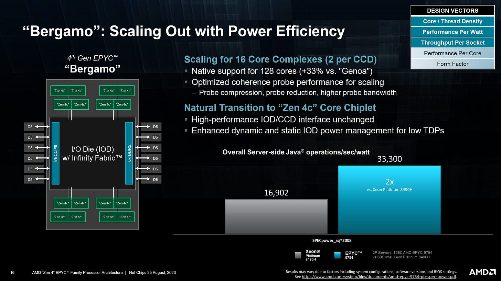

*图 2：多个 Zen 4c Core Complex Die（CCD）围绕中央 I/O Die，沿用 Genoa 的 Hub-and-spoke Platform。差别是 Compute Chiplet 换成高密度版本。*

测试系统由 Hot Aisle 提供两周。网页没有完整给出所有 Benchmark Version、Compiler/Flags、Firmware、功耗模式、重复次数与误差；部分对照来自 Cloud、NPS Mode 不同，客户端 7950X3D 即使限频也拥有更低 Memory Latency。下文保留这些边界，不把结果写成纯 Core IPC。

## Zen 4c CCD：相同架构，两倍 Core、一半每 CCX L3

标准 Zen 4 Core Complex（CCX）含八核、共享 32 MB L3。Zen 4c Core 更小，把每 CCX L3 减到 16 MB，像移动设计；同一 CCD 可以放两组 CCX，也就是 16 核。

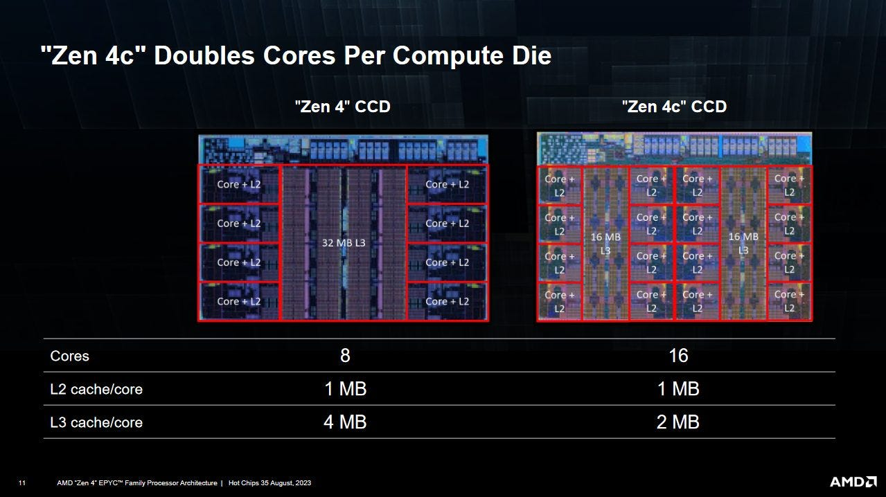

*图 3：一颗 CCD 放两组 8-core CCX，每组共享 16 MB L3；两组共用到 I/O Die 的 Interface。*

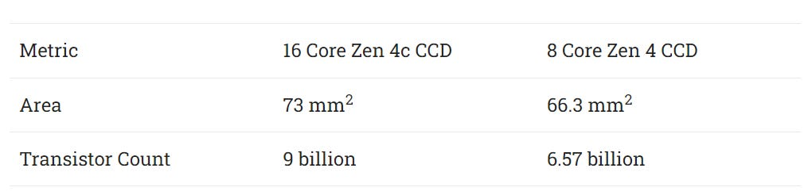

*图 4：Zen 4c 在近似 CCD Area 把 Core Count 从 8 增至 16。物理密度提升来自 Core Layout 与 Cache 容量共同收缩，不是 ISA/Frontend 被换成另一套“小核架构”。*

### L3 Latency 与容量

16 MB Zen 4c L3 的延迟意外接近 3D V-Cache 的 96 MB L3。V-Cache 因堆叠多 64 MB Die 增加几周期，Zen 4c 小 Cache 却出现类似额外周期。

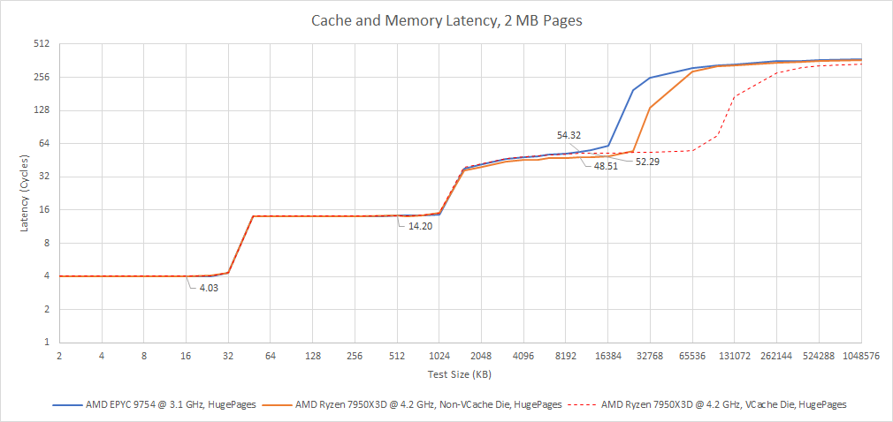

*图 5：Zen 4c 16 MB 与 V-Cache 96 MB 都比普通 32 MB L3 多几周期。测试展示结果，无法仅凭容量解释 Zen 4c 的具体 Layout/Timing。*

小 L3 降低 Hit Rate、增加 Memory Traffic。Server 本就比 Client 拥有更低“每 Core Memory Bandwidth”，Bergamo Core 更多，仍使用与 Genoa 相同的 768-bit DDR5 内存接口。它最适合 16 MB L3 下 Miss 不多的程序；低 Clock 也会降低每核 Compute 与带宽需求，部分抵消压力。

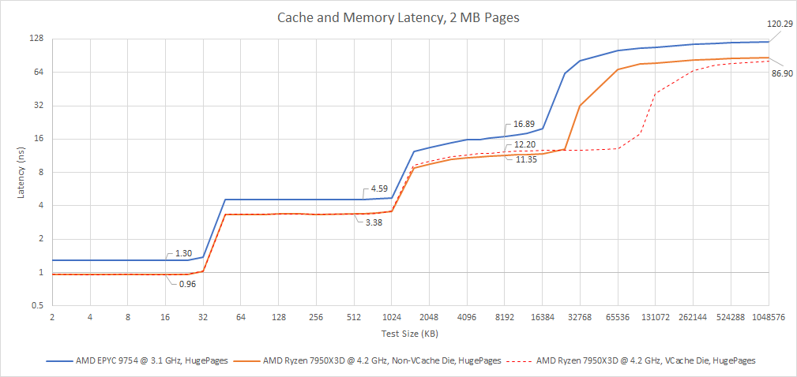

*图 6：即便 Ryzen 7950X3D 锁到 4.2 GHz Base，普通 Zen 4 L3 约 13.35 ns，Zen 4c 约 16.89 ns；Client DRAM 约 86.9 ns，Server 约 120 ns。平台差异从 L3 后显著展开。*

### 体系结构视角：Zen 4c 的“c”首先是物理实现选择

ISA、Core Pipeline 与 Optimization Knowledge 可复用，Area/Clock/Voltage Curve、Layout、L3 Ratio 和 Chiplet Packing 改变。它不像 Intel E-Core 那样另造 Architecture，而是在同一微架构下选择不同的 PPA 实现点。

评价不应只问“同频 IPC 是否相同”，还要看每 mm²、每瓦和每 CCD Throughput。Zen 4c 牺牲 Per-core Cache/Clock，目标是让总 Compute Density 增长更快。

## CCD 到 I/O Die：两组 CCX 共享一条 Interface

同一 Zen 4c CCD 的两个 CCX 共用 I/O Die Link。逐个加载 CCX 时，相邻两组若在同一 Die，第二组增长较小，形成阶梯；先在每颗 CCD 各加载一组，Memory Bandwidth 扩展更好，甚至接近峰值。

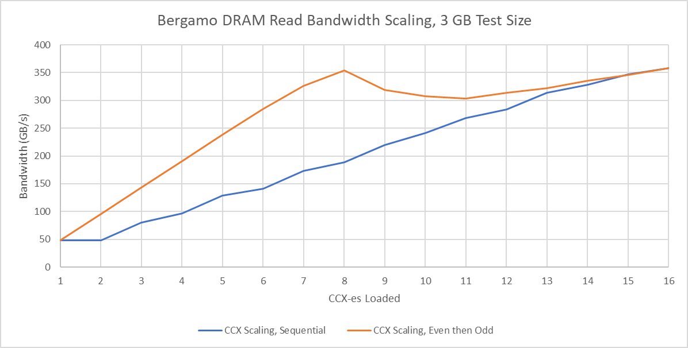

*图 7：CCX Pair 共享 CCD Interface，顺序启用出现阶梯；跨 CCD 分散线程能更早利用多条 Link。Topology-aware Placement 对高 Core Count 不再是可选优化。*

全核 Read 略低于 360 GB/s，理论 768-bit DDR5-4800 为 460 GB/s。Read-modify-write 同时制造等量读写，Aggregate 达 378 GB/s，超过理论单向的 82%，结果很不错。作为参照，John D. McCalpin 在 TACC 测得 Sapphire Rapids DDR5 Read 约 237 GB/s；平台与内存配置不同，只作量级比较。

### 体系结构视角：芯粒接口让“相邻核心”拥有不同带宽成本

同 CCX 共享 L3，同 CCD 两 CCX 共享 I/O Link，跨 CCD 才获得新 Link。线程数相同，Placement 不同就会改变每线程 Memory Bandwidth。

应按 CCX/CCD/Socket 层次绑核，并观察 Link Utilization、DRAM Channel 和 L3 Miss。图 7 证明的是 Interface Sharing，不是某个 CCX 算力变弱。

## Dual Socket：256 核与 NUMA 代价

双路 Bergamo 可达 256 核。Infinity Fabric 允许一颗 Socket 访问另一颗的 DRAM，Bandwidth 很高，Remote Memory Latency 仍明显大于 Local。

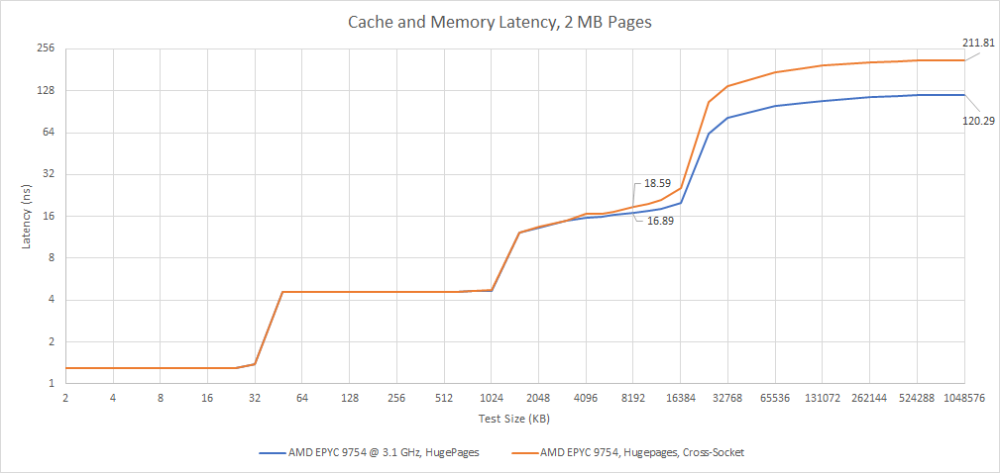

*图 8：Working Set 落到 DRAM 后，Remote 曲线明显抬升。Bergamo 使用 NPS1，每 Socket 作为一个 NUMA Node；Milan-X/Genoa-X Cloud 对照使用 NPS2，较小差异不宜过度解释。*

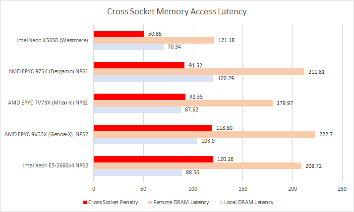

*图 9：Broadwell E5-2660v4 的 DDR4、更少 Core、小 Monolithic Die 让 Local/Remote 都优于 Bergamo；Westmere 每 Socket 仅六核、DDR3 和简单 Interconnect，Remote 甚至接近 Zen 3/4 Server 的 Local。新平台扩展容量/核心，未必降低单次访问时间。*

Cross-socket Read 超过 120 GB/s，Genoa-X 略胜，可能受 NPS2 降低 I/O Die Infinity Fabric 争用。Zen 4 Server 的 Remote Bandwidth 仍不到 Local 一半，不做 NUMA Placement 会浪费大量带宽。

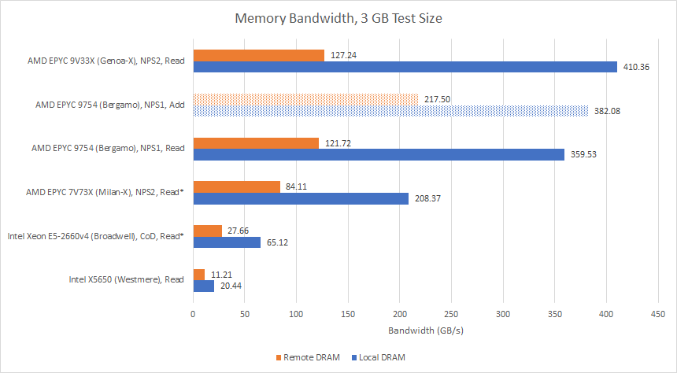

*图 10：带星号的值通过两颗 Socket 内多个 Node 同时从对应 Remote Node 读取后相加近似。Broadwell 绝对带宽较低，Remote/Local Ratio 更好；假想 Non-NUMA Bergamo 约损失 32.2%，Broadwell Cluster-on-die 到 Non-NUMA 约损失 21%。网页正式图注明确近似方法。*

Read-modify-write 可把 Cross-socket Aggregate 几乎翻倍，说明 Link 两方向独立，双向超过 200 GB/s，接近低端 RX 6600 VRAM Bandwidth。

### 体系结构视角：NUMA 是带宽拓扑，不只是延迟标签

Remote Access 同时消耗源 Socket Fabric、跨 Socket Link 和目标 Memory Controller。双向 Link 可让读写 Aggregate 很高，单方向 Read 仍只有 Local 的一部分。

软件应让 Allocation First-touch、Thread Affinity 与 Data Ownership 对齐。只报告“256 核”却不报告 NPS/NUMA Policy，会让 Benchmark 可比性失真。

## Core-to-core Latency：两级 Coherency 承受 256 核

测试让两个 Core 轮流 Increment 同一 Value。逐 Pair 串行测试 256 核耗时过长，因此改为并行检查多个不共享 Physical Core 的 Pair；相较单 Pair 运行，结果可能略高。

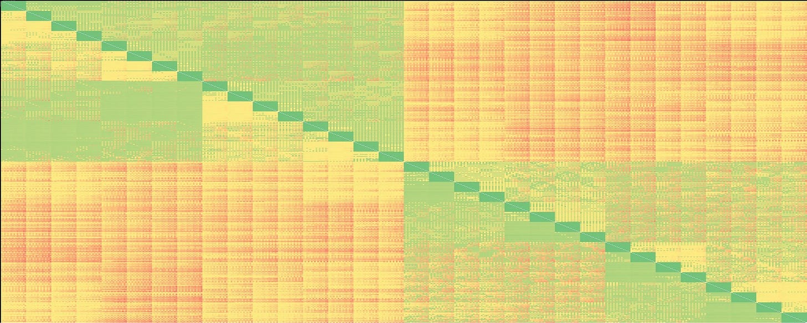

*图 11：WordPress 只能放 Thumbnail，网页正文给出量级：同 CCX 约 30～40 ns，同 Socket 跨 CCX 多为 100～120 ns，跨 Socket 多约 200 ns，最坏略高于 212 ns。网页正式图注说明原图限制。*

AMD 自 Zen 起分两级 Coherency：每 CCX 保存 L2 Shadow Tag；L2 Inclusive 于 L1，覆盖 L2 Tag 即覆盖 L1 Copy。同 CCX 命中 Shadow Tag 后低延迟转移。跨 CCX 由 Infinity Fabric Probe Filter 追踪各 Cluster Cache，跨 Socket 最远。

*图 12：Intel 同 Socket 低于 100 ns、跨 Socket 约 120～150 ns，优于 Bergamo，但最大 Core Count 低得多。网页正式图注说明平台。*

### 体系结构视角：高 Core Count 的代价表现为层级化距离

同 CCX Shadow Tag、同 Socket Probe Filter、跨 Socket Link 形成 30→110→200 ns 台阶。Directory 避免 Broadcast，却需要更多 Lookup/Route。

并行测多 Pair 会制造额外 Fabric Load，因此要把方法写入结果。生产负载还应区分 Read Sharing、Write Ping-pong 与 Lock；本图只代表交替写同一 Value。

## 三种 Zen 4 CCD：同架构，不同资源曲线

标准 CCD：8 Core/32 MB L3；V-Cache CCD：8 Core/96 MB；Zen 4c CCD：16 Core，由两组 8 Core/16 MB CCX 构成。三者使用相同 I/O Die Interface。

对照使用 Ryzen 7950X3D 的标准/V-Cache CCD，并把 Clock 限到 3.1 GHz，匹配 Bergamo。仍不完全公平：一颗 Client CCD Read 53.05 GB/s，Bergamo CCD 48 GB/s，可能来自 Infinity Fabric Clock；Client DRAM Latency 也更低。

### libx264

测试 Transcode 一段 4K Gameplay Clip，网页未给出 Version、Preset、Command 和 Input 详情。同频单 CCX，普通 Zen 4 比 Zen 4c 快 4.2%，V-Cache 快 13.8%。

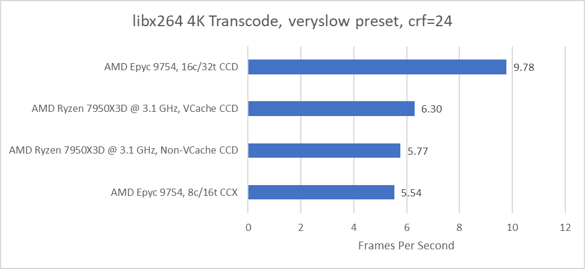

*图 13：比较相同 8-core CCX 的实现差异，Zen 4c 的 16 MB L3 与 Server Memory Path 处于劣势。*

按整颗 CCD，16-core Zen 4c 领先标准 8-core CCD 69.4%。没有达到 2×，因为 Performance 不随 Core Count 线性扩展，libx264 在 7950X3D 上也未充分使用 32 Thread；但每 Compute Die Throughput 已明显提升。

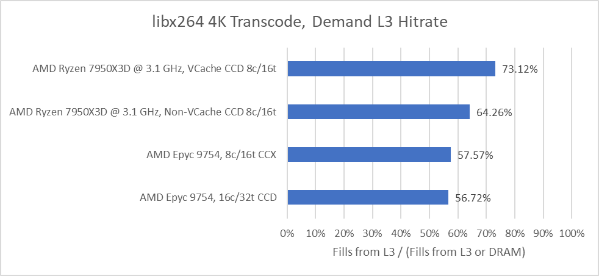

*图 14：Density 目标应按每 Die Throughput 评价。L3 从 32 降到 16 MB 后 Hit Rate 从 64.3% 降到 57.6%，解释部分非线性。*

### 7-Zip Compression

测试压缩 2.67 GB File，不是可吃满任意 Core 且同时测试 Compress/Decompress 的内置 Benchmark。真实 Compression 无法利用无限 Thread。

单 CCX 普通 Zen 4 快 36.9%；允许 Zen 4c CCD 跨两 CCX 使用线程后，16 Core 反过来领先标准 Zen 4 CCD 34.7%。

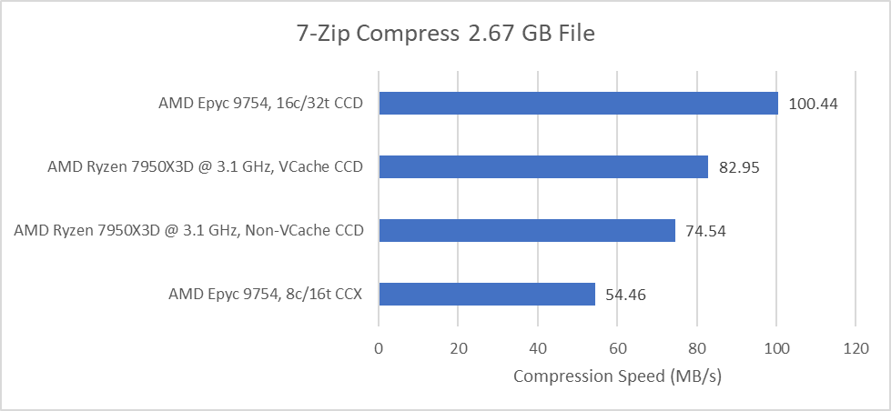

*图 15：单 CCX 暴露 Per-core/Memory 劣势，整 Die 才体现 Density。两种比较回答不同问题，不能只选对 Zen 4c 有利的一组。*

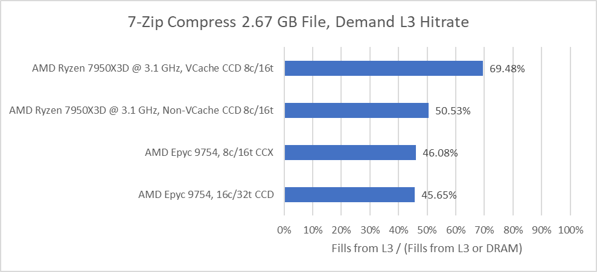

*图 16：L3 Hit Rate 差异小于 libx264，普通 Zen 4 的主要优势更可能来自 Client 平台低 Memory Latency。V-Cache 比普通 CCX 快 11% 以上、比 Zen 4c CCX 快 52%，同频同架构仍可因 Cache 实现差异巨大。*

### 体系结构视角：Density Core 要按三个分母评价

Per-core：Zen 4c 通常较慢；Per-CCX：小 L3/Server Memory 会放大差距；Per-CCD：两倍 Core 带来 34.7%～69.4% Throughput Gain。三种结论可以同时正确。

还要补充每 Watt、每 mm² 与 License/VM Revenue。Cloud Provider 关心可出售 Core，HPC 关心全 Node Throughput，Latency-sensitive Application 则可能更适合标准/V-Cache。

## 最后的评价：以复用换上市速度，以物理实现换密度

Bergamo 在 Sierra Forest 前进入 Density Server Market。复用 Zen 4 Architecture 带来相同 ISA Extension，Validation/Optimization 可继承；复用 Genoa I/O Die 与 Platform 又降低时间和成本，Zen 4c CCD 能替换普通/V-Cache CCD。

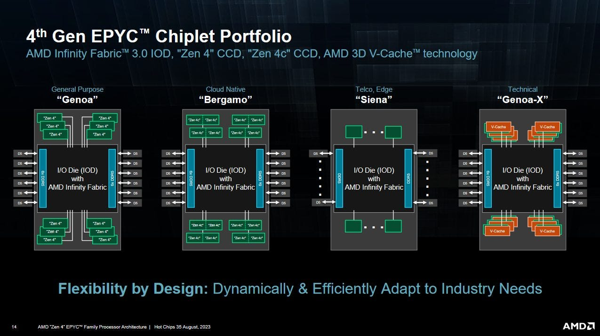

*图 17：AMD Slide 强调 Architecture Compatibility 与 Density Physical Design。网页正式图注说明发布场合。*

Genoa 最多 12 CCD，Bergamo 只用八颗；物理空间看，12 颗 Zen 4c 可达 192 Core。但“装得下”不等于系统支持，某些 Logic 可能只有 7-bit Core ID，把上限卡在 128——这只是示例性猜想，不是确认限制。Zen 4c 也可能像 V-Cache 一样作为 Client Drop-in，增加 Multithread。

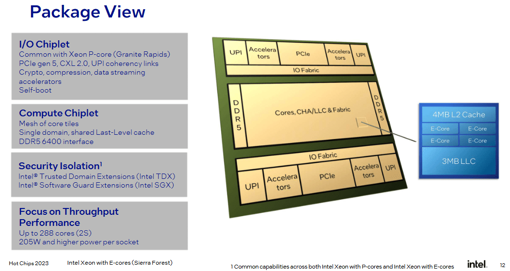

*图 18：Sierra Forest 也复用 Platform/I/O Chiplet，但 E-Core Architecture 与 Granite Rapids P-Core 不同，ISA Extension 可能不一致；交换条件是 Architecture 与 Physical Level 都可为 Density 优化，Core 更小，最高 144。AmpereOne 以自研 Siryn 达 192 Core。*

AMD 与 Intel 在做同一件事——用更高密度 Core 增加 Multithread——只是 AMD 复用同 Architecture，Intel 另做 E-Core。前者省设计/验证和软件适配，后者拥有更大的微架构密度自由度。

### 体系结构视角：从 Bergamo 可以归纳出的六点认识

第一，Architecture Reuse 是上市时间与软件一致性的资产。Zen 4c 不需重新建立 ISA、Compiler 和性能模型，研发主要集中在 PPA/Chiplet。

第二，Density 的真正单位是每 Die/每 Watt Throughput，而非单核 IPC。Zen 4c 单 CCX 落后，整 CCD 仍领先 34.7%～69.4%。

第三，减 Cache 会把压力转移给 Fabric 与 DRAM。16 MB L3 Hit Rate 下降，又有两倍 Core；低 Clock 只能部分降低每核 Demand。

第四，Chiplet 拓扑使线程放置直接影响带宽。同 CCD 两 CCX 共享 Link，先跨 CCD 分布可更快接近 360 GB/s。

第五，现代双路必须 NUMA-aware。Remote Read 超 120 GB/s 很强，仍不到 Local 一半；忽略 Placement 会损失约三成潜在带宽。

第六，高 Core Count 不是免费扩展。Coherency 从同 CCX 30～40 ns 走到跨 Socket 约 200 ns，Directory/Probe Filter 只是把复杂度组织成层级，没有消除距离。

## 参考资料

- Chips and Cheese：[*Testing AMD’s Bergamo: Zen 4c Spam*](https://chipsandcheese.com/p/testing-amds-bergamo-zen-4c-spam)
- AMD：Hot Chips 2023 Zen 4c/Bergamo Slides（正文图中援引）
- John D. McCalpin/TACC：Sapphire Rapids Memory Bandwidth 测量（正文援引）
