# Bulldozer：AMD 的激进现代化（上）——前端与执行引擎

> **文章来源**
>
> - 文章：*Bulldozer, AMD’s Crash Modernization: Frontend and Execution Engine*
> - 撰文：Chester Lam
> - 首发：Chips and Cheese
> - 发布：2023 年 1 月 22 日
> - 链接：https://chipsandcheese.com/p/bulldozer-amds-crash-modernization-frontend-and-execution-engine

K7 Athlon 奠定了 AMD 约十年的 CPU 基础。K8 加入 64 bit 与集成内存控制器，仍能对抗 NetBurst；K10/Phenom 继续演进。可到了 Nehalem 时代，Intel 也拿回内存控制器、重做核间互连，AMD 的传统优势被逐步侵蚀，老 Athlon 框架又越来越难扩展。

Bulldozer 因此不再小修 K10，而是从头打造更宽、更深、更灵活的现代核心，部分机制甚至比主要对手 Sandy Bridge 更激进。

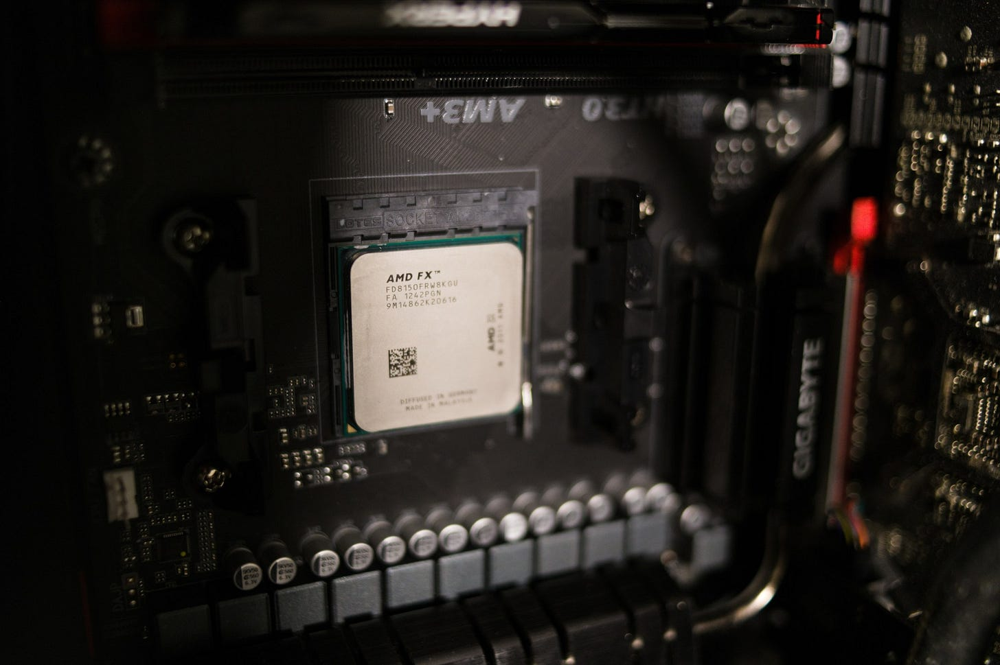

*图 1：网页正式图注称“准备接受测试的 Bulldozer 芯片”。最终产品以低单线程性能、高功耗和高温著称，但这些结果不是设计起点。*

AMD 最初希望得到“共享前端和 FPU 的 K10”：同时提升 Single-thread，并大幅提高 Multithread，再迁移到 32 nm。目标过于激进，32 nm 上又难以维持 Clock，随后削减不断累积。FX-8150 比 Phenom II X6 1100T 多两个“Core”，单核更慢、多核近似，满载功耗还更高；对 Sandy Bridge 更无优势。

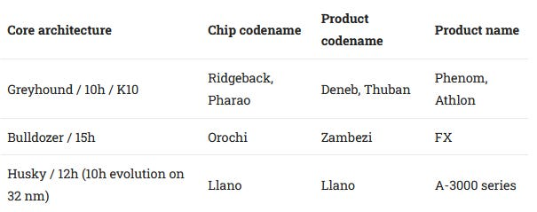

*图 2：表格梳理 K10/Greyhound、Bulldozer 与后续代号，避免产品名、Family 与 Core Codename 混淆。*

## Module：两线程共享昂贵结构

每个 Bulldozer Module 运行两条 Thread。Frontend、FPU 和 L2 为共享，Integer Core 与 LSU 每线程私有。前端对单线程通常过剩，FPU 只在部分应用高占用，共享可提高面积效率。

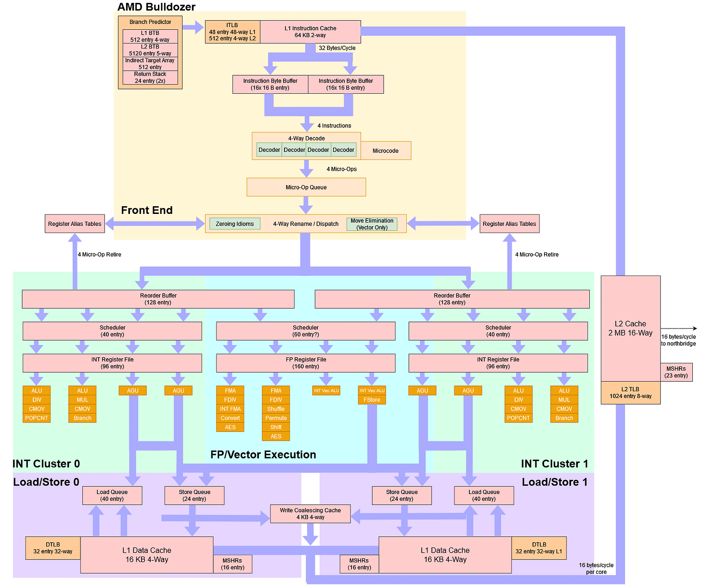

*图 3：两套 Integer/LSU 夹在共享 Fetch/Decode、FPU 与 L2 之间。Optimization Manual 写 FP Scheduler 64 项，ISSCC Paper 写 60，微基准也更接近 60；材料不强行统一。网页正式图注保留了这处差异。*

物理布局仍像横向展开的 K10：Fetch、Decode、Integer Execute、Load/Store、FPU 依次跨过核心。

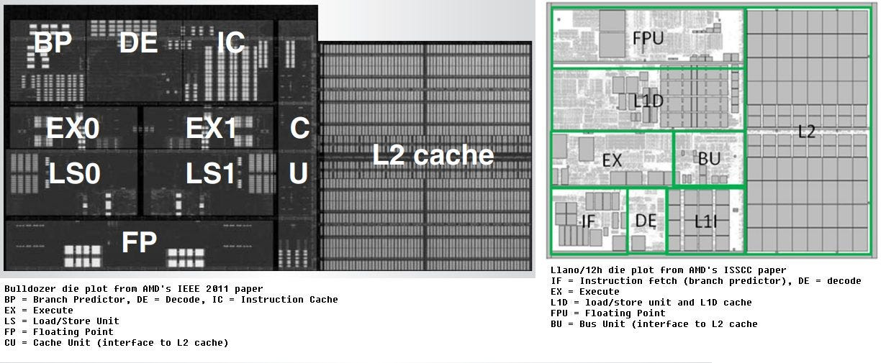

*图 4：示意不按比例。一个 Module 连 L2 为 30.9 mm²、2.13 亿 Transistor；同制程 Llano/K10 Core 不含 L2 为 9.69 mm²，口径不同，不能直接算面积倍数。*

### 体系结构视角：CMT 不是简单的“双核”或 SMT

Clustered Multithreading（CMT）为每线程复制 Integer/LSU，却共享大 Frontend/FPU/L2；SMT 通常让两线程竞争同一整套 Core。CMT 的 Single-thread Resource 比 SMT 更独立，多线程面积又低于复制两颗完整 Core。

实际性能取决于负载：Integer-heavy 双线程少争 FPU，FP-heavy 会竞争；两线程都依赖同一 Frontend/L2 时仍可能互相挤压。应按单线程、同 Module 双线程、跨 Module 双线程分组测试。

## 分支预测：相对 K10 大改，仍追不上 Sandy Bridge

K8 Predictor 到 Core 2 时代已经落后，Bulldozer 因而全面升级。

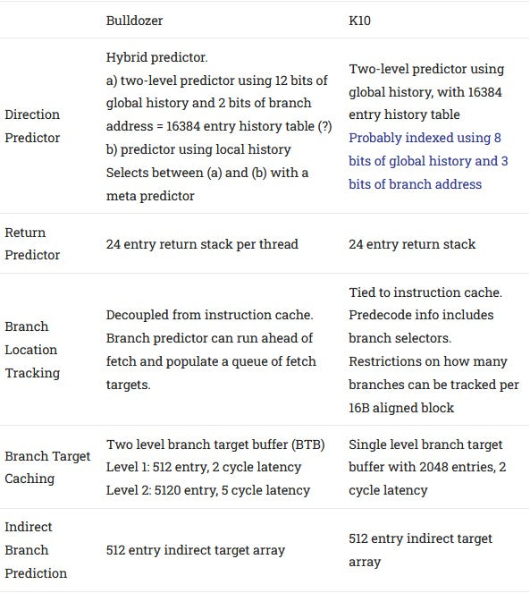

*图 5：公开资料汇总 Direction、两级 BTB、Return Stack 与每线程 Prediction Queue；它是架构示意，不是 RTL。*

几乎每项都比 K10 强，但 Intel 同样快速迭代。Sandy Bridge 能识别更长 Pattern，也能在 512 个活跃 Branch 下维持中等 History；Bulldozer 此时明显退化，可能因为 Branch Address 只以 2-bit Hash 参与 History Table Index，Aliasing 增加。这是基于资料与曲面的解释。

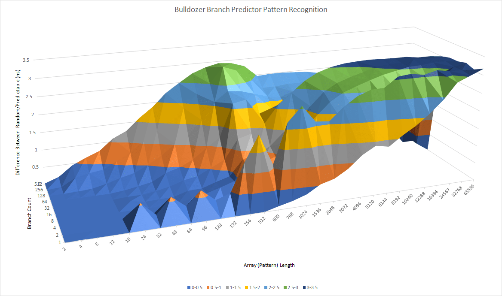

*图 6：较短 Pattern/较少 Branch 时稳定，规模增加后低延迟平台快速破裂。*

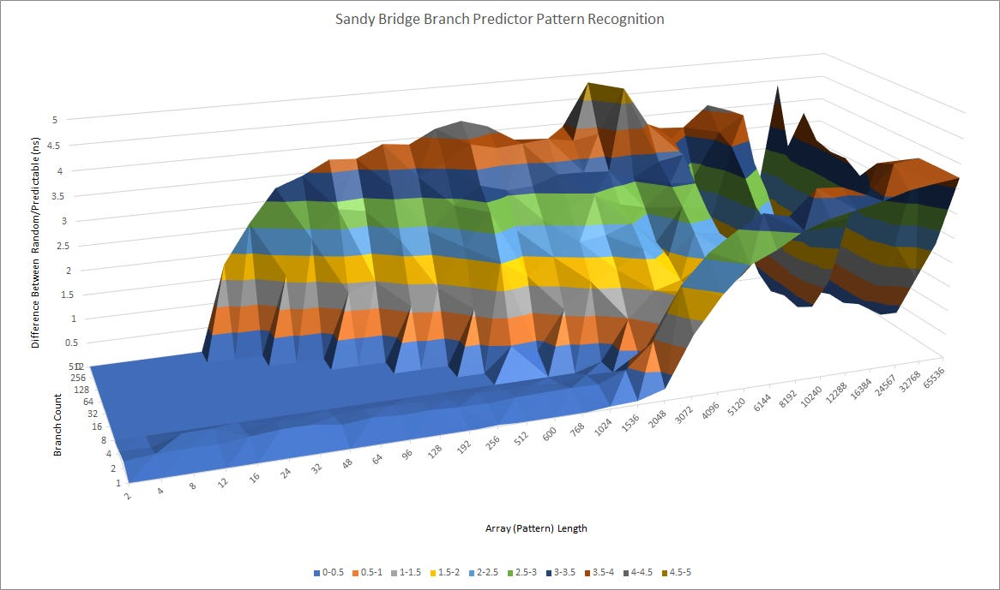

*图 7：Intel 覆盖更长 History 和更大 Branch Footprint。两图平均周期还受 Mispredict Penalty 影响，不能只当准确率表。*

### Branch Target Tracking

Bulldozer 优先扩大 Target Capacity，而非降低延迟。Predictor 与 L1I Fetch 解耦，提前运行并为每线程填充 Fetch Target Queue，理论上可在 Cache Miss 时继续排队，且消除了 K7/K8/K10 因 Predictor 与 Cache Line 绑定导致的 Branch Placement 限制；Compiler 无需再用 Padding/长 Encoding 换可预测性。

实测却显示 Loop 超过 64 KB L1I 后 Taken Latency 增加，说明 Prediction Queue 或 L1I Miss Queue 不足以隐藏 L2。AMD 又称 L1I Miss 只做 Next-line Prefetch；若不利用 Target Queue 连续产生 Miss Request，就能解释这种行为。

两级 BTB 提高覆盖，但 L2 BTB Hit 要五周期。L1 BTB 比 K10 小，也没更快，仍无法 Back-to-back Taken；Loop Unrolling 依然重要。

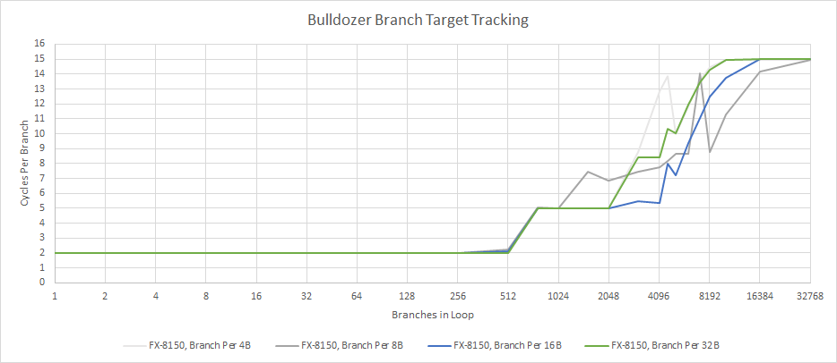

*图 8：约 512-entry L1 BTB 后进入慢层。Sandy Bridge 的 4096-entry L1 BTB 与 Bulldozer 512 项同样快，还能零 Bubble 处理最多八个 Taken Branch。*

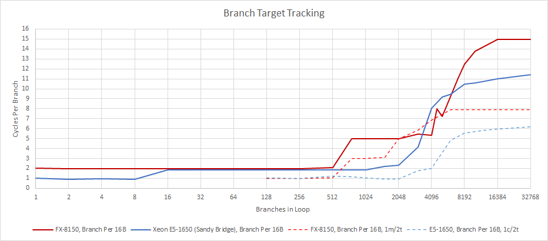

*图 9：两条独立 Target Chain 可让两颗 CPU 的 L1 BTB 每拍提供一个 Target，隐藏部分单线程 Bubble；Bulldozer L2 BTB 每三周期才出一个 Target，Intel 仍占优。*

Return Stack 每线程各 24 项；同期 Intel 为每线程 16 项，因此 Bulldozer 更深。

### 体系结构视角：解耦只有在队列足够深时才产生 Lookahead

Predictor 提前于 Fetch 能把 Target Discovery 移出关键路径，但 Ahead Distance 由 Target Queue、I-cache MSHR 与 Prefetch Policy 的最小值决定。任何一环只有几项，L2 Latency 仍会把队列抽空。

验证需同时量 L1/L2 BTB Hit、Prediction Queue Occupancy、I-cache Outstanding Miss 与 Fetch Starvation；图 8 的五周期是 Hit Latency，图 6 是 Direction 能力，两者不可混为一项“预测差”。

## Fetch/Decode：64 KB 大 L1I，双线程才能吃满 32 B/cycle

Bulldozer 沿用 64 KB、两路 L1I，物理上由 `8×2` 个 4 KB、8T SRAM Bank Macro 组成。Predecode 放在两个独立 Array，约占 8 KB。L1I 可出 32 B/cycle；单线程运行 8-byte NOP 只有 22～23 B/cycle，两线程同 Module 才接近 32。

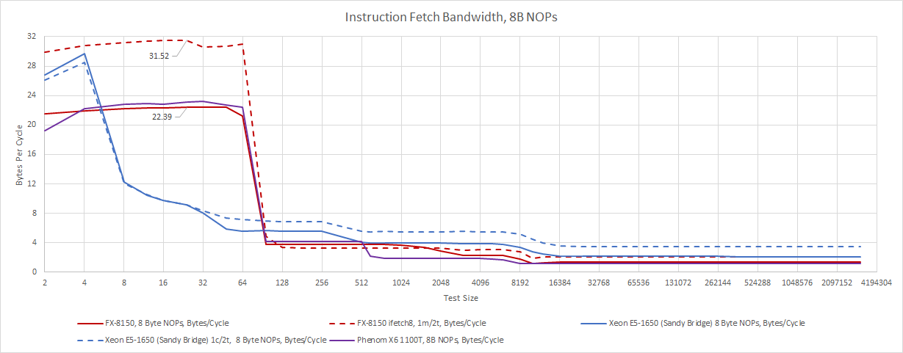

*图 10：Bulldozer 大 L1I 内双线程可吃满接口；Sandy Bridge 的 1536-entry Micro-op Cache 单线程即可等效 32 B/cycle，后备 32 KB L1I 为 16 B/cycle。Micro-op Cache 小，落回 L1I 时 AMD 可能占优。*

两者从 L2/L3 取代码都弱，Bulldozer 更差：L2 平均略高于 4 B/cycle，两线程不改善，L3 区间略有帮助。它以更大 L1I 降 Miss，Sandy Bridge 则在极小（Op Cache）和极大 Footprint 上更好。

4-byte NOP 更接近 Scalar Integer 的平均长度，两者在 L1I 内都能四 Instruction/cycle；越过 L1I，Bulldozer 约一 IPC。

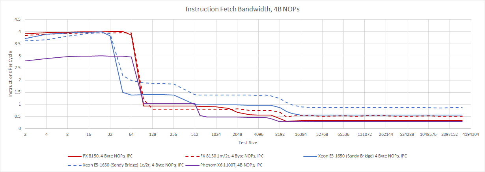

*图 11：Sandy Bridge 改用 `66 66 66 90`，因 Decoder 对另一种 `0F 1F 4 00` NOP Encoding 表现异常。网页正式图注明确这一测试差异。*

### 体系结构视角：共享 32 B 接口和单线程四宽是两种规格

Module Aggregate 可达 32 B/cycle，不代表单线程能取 32 B。典型 4-byte Instruction 下 16 B 已足够四宽，只有长 Encoding 或双线程才暴露 Byte Interface。

应同时报告 B/cycle 与 Instruction/cycle，并按 Code Footprint 分区。否则“32 B/cycle”会掩盖 L2 只有约一 IPC的现实。

## Rename/Allocate：PRF、Checkpoint 与 Vector Move Elimination

Bulldozer 可识别 `xor reg,reg`/`sub reg,reg` 的 Zeroing Idiom 并打断依赖，但不像 Sandy Bridge 那样直接消除执行。

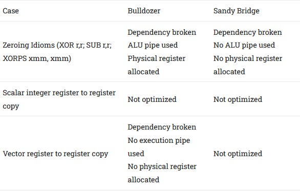

*图 12：依赖被打断可暴露 ILP，是否还占执行端口则是另一层能力。*

ROB 保存 Physical Register Pointer，使 Vector Register Copy 可让两个 Architectural Register 指向同一 Physical Entry，在 Rename 内完成。x87 Stack 长期需要 FP Renamer，扩展到 SSE MOV 并不远；Scalar Integer 没有 Move Elimination。同期 Sandy Bridge 反而完全没有 Move Elimination。

Bulldozer 抛弃 Athlon/Phenom 的 Integer ROB+RRF、FP PRF 混合方案，全后端转为现代 PRF；Sandy Bridge 也从 Nehalem/P6 的 ROB+RRF 转向 PRF。PRF 只为真正写结果的指令分配 Register，Retire 复制 Pointer 而非 Data，Vector 数据搬运尤其减少，也使 ROB 可扩展。Bulldozer ROB 比 K10 增加 77%。

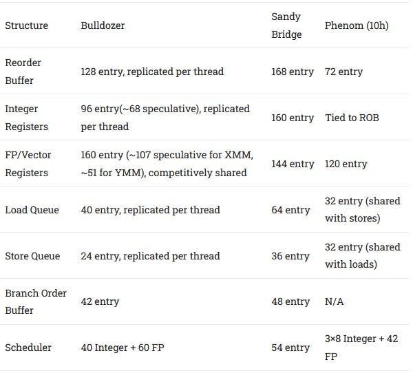

*图 13：图表还标出双线程时的 Partition/Watermark。Sandy Bridge 多数资源会静态分割或设上限；Bulldozer 私有 Integer Window 与竞争式共享 FPU 行为不同。网页正式图注说明口径。*

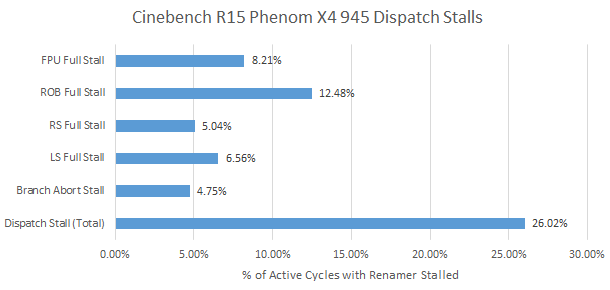

*图 14：K10 经常撞 ROB 等容量限制；各 Stall 可重叠，柱项不能相加为 100%。*

K10 只有 Retired RAT 与最新 Speculative RAT。Mispredict 后必须等 Branch Retire，再把已提交 Map 复制回来；此前 Backend 不能接收新指令，形成 Branch Abort Stall。Bulldozer 的 Mapper Checkpoint Array 保存 RAT Snapshot，可在 Mispredict 后立即恢复并继续 Allocate，即使该 Branch 仍在途；有时错误预测延迟甚至能被另一条长延迟指令掩盖。

### 体系结构视角：Checkpoint 改变的是恢复后的再启动时刻

方向确认、Frontend Redirect 和 Rename Map Recovery 是三个时间点。K10 前两项完成后仍等 Retirement；Bulldozer 用 Snapshot 把第三项前移，使后端更早接纳正确路径。

验证可观察 Mispredict Resolve→Rename Valid、Checkpoint Allocate/Release 与 ROB Head。只有 Redirect 已发生而 Rename 仍空转，才是类似 K10 的恢复瓶颈。

## Integer Execution：大统一 Scheduler，只配两条通用 ALU

K10 的小型分布式 Integer Scheduler 经常 Full。Bulldozer 改为 40-entry、四 Port Unified Scheduler，覆盖约 31% ROB，比例接近 Sandy Bridge；Intel 同一 Scheduler 还要容纳 FP/Vector。

Oldest-first 有助于先执行阻塞更多年轻依赖的指令，但维护所有 Entry Age 很贵。P6 用会移动/压缩的 Priority Queue；Bulldozer 用 Ancestry Table 追踪最老指令、优先它。若最老项未 Ready，其余选择更多依赖物理位置而非年龄，以低功耗近似 Oldest-first。

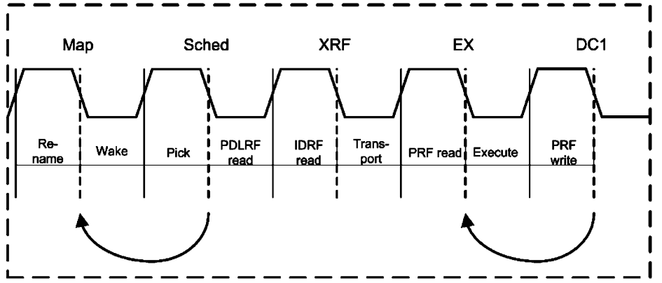

*图 15：大 Unified Scheduler 并未要求极深 Pipeline，Rename 到 Execute 约四阶段。网页正式图注说明范围。*

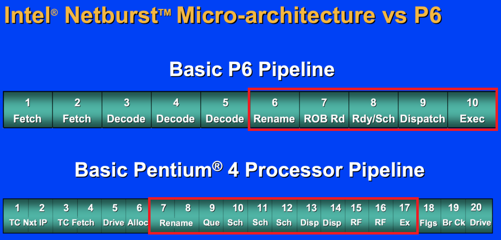

*图 16：红框标出 Rename→Execute；NetBurst 阶段数超过两倍。Ancestry Approximation、PRF 与布局优化共同帮助 Bulldozer 守住频率。*

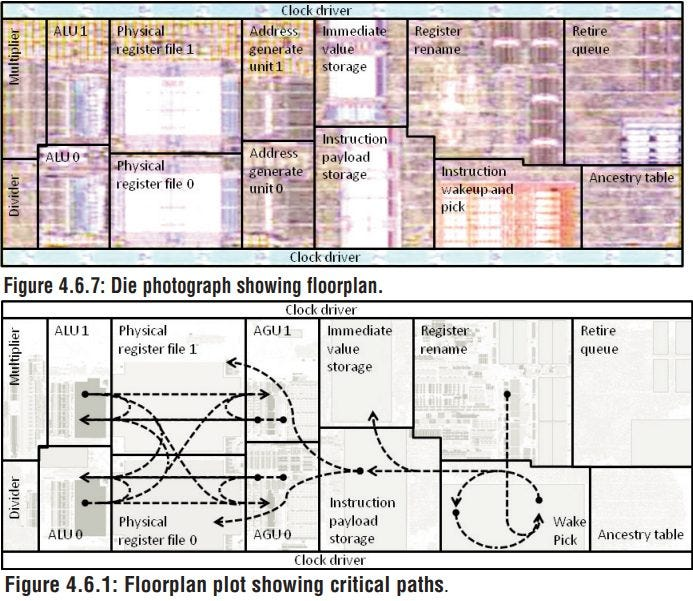

*图 17：AMD ISSCC 2011 图。Retire Queue 追踪该线程所有 Pending Operation，包括送往共享 FPU 的操作。网页正式图注说明来源。*

Integer Register File 复制两份缩短 Wire/Critical Path；每份四读四写，按执行 Pipe 从任一副本读取，所有 Write 同时写两份，等效八读四写。大部分 Scheduling Structure 有 Parity。

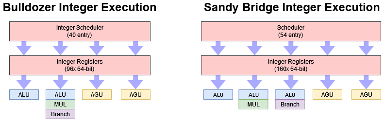

*图 18：复制 RF 增加写广播能耗与存储，却减少八读端口集中阵列的复杂度。*

执行端相对 Sandy Bridge、甚至 K10 偏轻，只有两条能做 Add/Compare 的通用 ALU。K10 为规则三 Lane 过度配置，AMD 可能向节省面积走得过头：单线程前端可四宽，而多数四宽 CPU 至少三 ALU。

### 体系结构视角：Scheduler 现代化并不能补出不存在的执行端口

40 项统一窗口能找到更多 Ready Work，两条 Common ALU 仍限制常见 Integer Mix。窗口解决“有没有工作”，端口决定“一拍做多少”；两者必须匹配。

可用独立 Add、混合 Branch/AGU 与真实 IPC 对照 `ready-but-not-issued`。Scheduler 非空且 Ready 指令长期等待 ALU，才说明执行端口成为瓶颈。

## 共享 FPU：资源竞争，而非固定对半

FPU 每拍接四 Operation，同一拍必须来自同一 Thread；双线程时可逐拍轮换。为服务两线程，单线程看来资源极大：Unified Scheduler 约 60 项，大于 Sandy Bridge 全类型 54 项和 K10 FPU 42 项；FP Register 160 项，K10 为 120、Sandy Bridge 144。

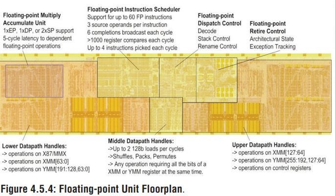

*图 19：AMD ISSCC 图。RF 分成左右两个 10-bank Array，其中一侧更宽以支持 80-bit x87；跨完整 Vector Lane 的单元置于两阵列之间。*

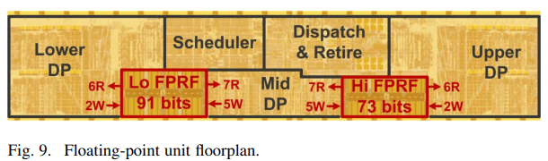

*图 20：AMD 2012 IEEE 图。资料写 RF 每拍 10 Read/6 Write，连接执行单元则有 13 Read/7 Write Bus，足以供四 Pipe。网页正式图注说明来源。*

双线程时 FPU Register/Scheduler 不严格 Partition 或 Watermark。Sibling 只跑 Integer，另一线程的 FPU 与单线程无异；两边都跑 FP 时竞争共享资源。

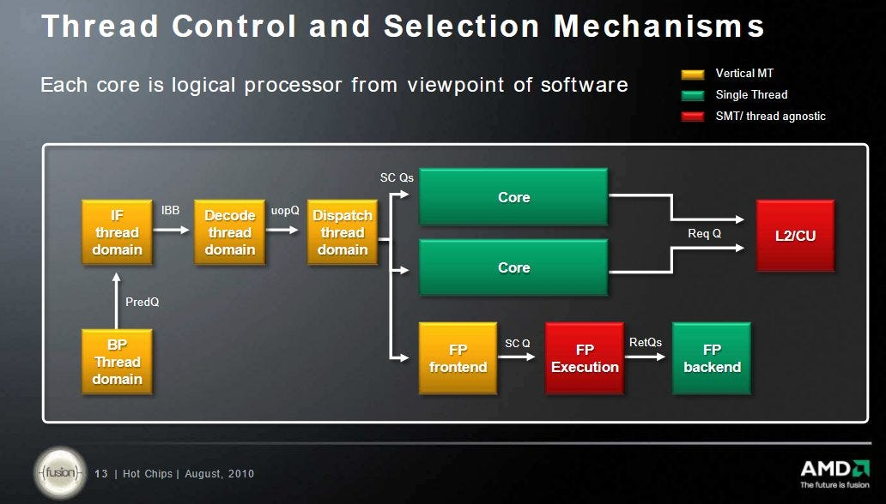

*图 21：没有突然“容量减半”的台阶，符合 Thread-agnostic、竞争共享。*

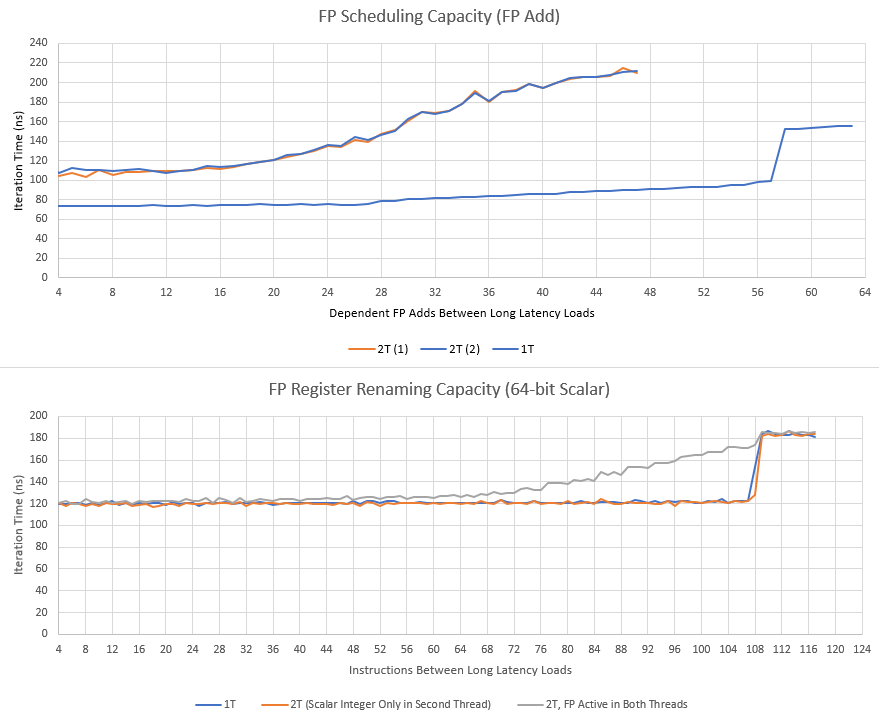

*图 22：接近 Scheduler/RF 极限时，每线程同时覆盖两次长 Load 的概率缓慢下降，而非固定边界。*

Sandy Bridge 则在 Sibling 启动后固定平分 FP Register，即使另一线程只做 Dummy Load、完全没有 FP。

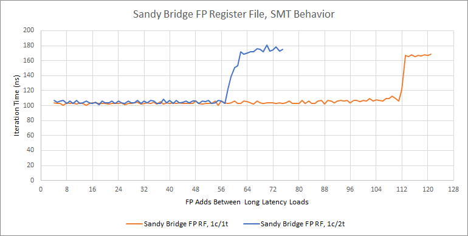

*图 23：网页正式图注明确 Dummy Thread 不使用 FP，FP RF 仍减半。*

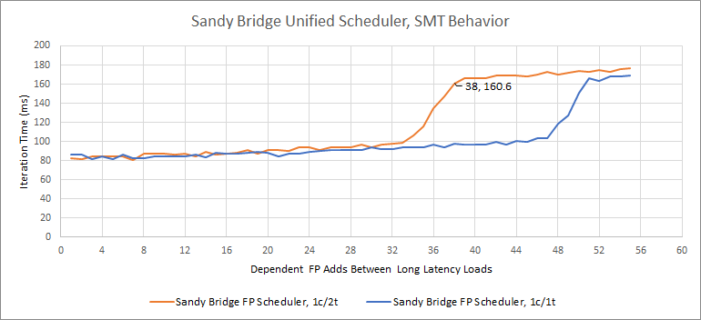

*图 24：Sibling 活跃时单线程约不能超过 40 Scheduler Entry。固定 QoS 更可预测，闲置资源却不能完全借用。*

Bulldozer 的简单策略可能只需 Frontend 在两线程间仲裁，并在必要时 Throttle 保证 Fairness；具体算法没有公开。

### AVX 与 FMA

Bulldozer 把 256-bit AVX 拆成两条 128-bit Micro-op，并在 Pipeline 全程分别追踪，主要收益是 Code Density。Sandy Bridge 有 256-bit Physical Register/Execution Unit，AVX Reordering 与吞吐强得多。

Bulldozer 首发 FMA4，`d=a*b+c` 一条指令完成乘加；若算法可融合，一 Module 的 FP Throughput 可匹配一 Sandy Bridge Core。

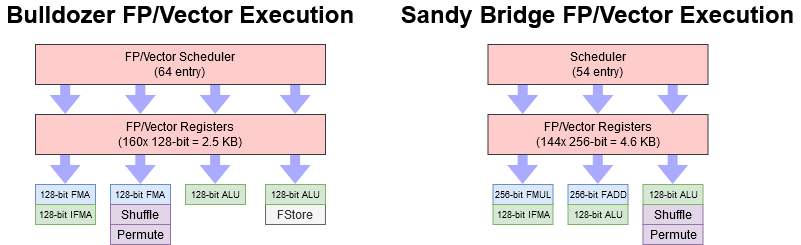

*图 25：Intel Vector Logic 可走 0/1/5，Vector Integer Add 只能 1/5；比较需区分 Instruction Class。网页正式图注说明。*

FMA 只帮助结果确实相连的 Multiply+Add，两个独立操作无法融合。FMA4 又未被 Intel 支持；Haswell 采用覆盖一个 Source 的 FMA3，市场地位使软件最终统一 FMA3，AMD 到 Piledriver 才加入。

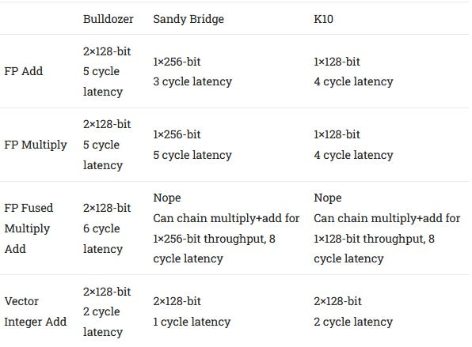

*图 26：Bulldozer FMA Latency 六周期，可能受首代实现、高频目标和 32 nm 限制；Haswell 22 nm 也只快一周期，为五周期。*

首发时 AVX 软件很少。对既有 Scalar/128-bit Code，Bulldozer 两条 Pipe 都能 Add/Multiply，比 Sandy Bridge 一 Add Port、一 Multiply Port 更不易因比例失衡堵塞。FPU 最大弱点是 Latency，但 60-entry Scheduler 能吸收部分依赖，双线程的显式并行也可缓解。

### 体系结构视角：竞争共享提高利用率，固定分区提供确定性

Bulldozer 允许 Integer-only Sibling 把全部 FPU 留给另一线程，平均效率高；两个 FP-heavy Thread 的容量随竞争渐变，尾延迟和 Fairness 更难预测。Sandy Bridge 浪费闲置半区，却隔离干扰。

验证要分别组合 INT+FP、FP+FP，并观察每线程 Throughput、Scheduler Occupancy 和 Starvation。不能只用单线程大 FPU 容量断言双线程同样可得。

## Load/Store：覆盖 Case 更多，失败代价也更大

每线程两条强 AGU，Indexed Addressing 无额外 Penalty。Load Queue 40、Store Queue 24，改用独立队列；Sandy Bridge 同类但更大。K10 Unified Queue 对更常见、Metadata 较少的 Load 与需保存 Data 的 Store 使用同样 Entry，不够高效。

Bulldozer 消除了 K10 在同一 4 B Aligned Region、实际不重叠时的部分 False Dependency；Scalar Exact Address Match 可 Fast Forward，K10 跨 16 B 就失败。但 Bulldozer Happy Path 八周期，K10 四～五；Misaligned Load 即使成功也 13～14，失败 35～39，跨 64 B 可 42～43。K10 最坏只有 12～13。

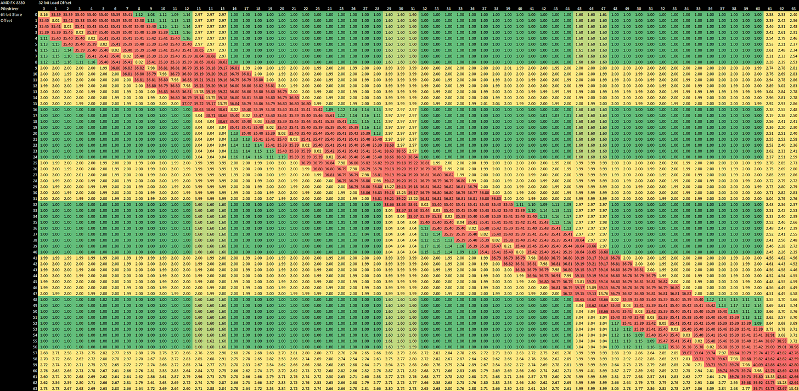

*图 27：覆盖范围比 K10 广，成功/失败区域的周期都更高。网页正式图注说明矩阵对象。*

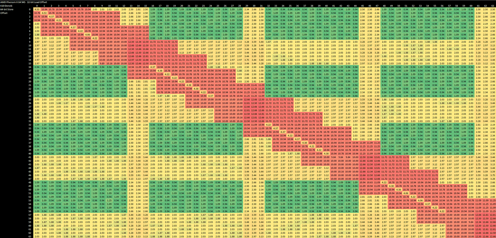

*图 28：Fast Path 简单、常走 Slow Path，却凭短 Pipeline 快速恢复。网页正式图注说明这是 Phenom。*

Sandy Bridge 可在 Load 完全包含于 Store 时 Fast Forward，包括 Misaligned；成功约六周期，失败 17～25，全面优于 Bulldozer。

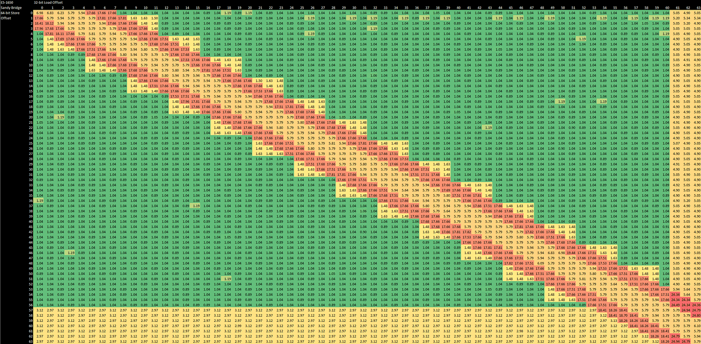

*图 29：Intel L1D 仅跨 64 B Cache Line 才需额外访问；Bulldozer/K10 通常按 16 B Chunk，Misalignment 更常受罚。*

Bulldozer 的跨 4 KB Load 无额外 Penalty，Sandy Bridge 多 35 cycle；Store 则反转：Intel 多 25，Bulldozer 37～38，K10 几乎没有明显 Page-cross Penalty。TLB 可能支持同拍读两项只是猜测，Write-through L1D 也可能让 Store 更复杂。

### 4K Aliasing

两颗 CPU 初始只比较低 12 Address Bit，因为 TLB 完成前还没有更高 Physical Bit。相隔 4096 B 的 Load/Store 虽不重叠，低位相同会产生 False Dependency。

*图 30：Henry Wong 方法的“无真实依赖”变体，Load Offset 额外加 4096。Bulldozer 通常用 16 cycle 才确认无依赖，Misaligned 时最高约 27。网页正式图注交代了这一 Troll Test。*

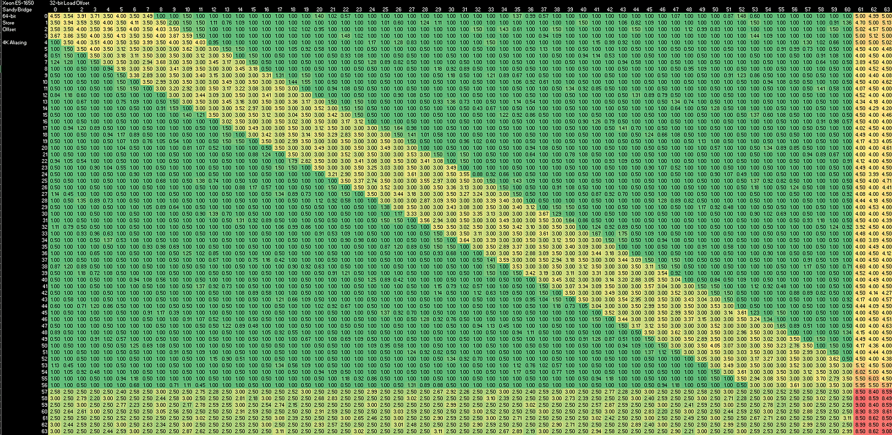

*图 31：Intel 多为三～四周期识别 False Alias；两边 Misaligned 时八～九周期，仍明显低于 Bulldozer。网页正式图注保留了这一判断。*

### 体系结构视角：检查更强，不代表流水线更快

Bulldozer 能处理更多 Alignment/Overlap Case，Full Address Comparison 与 Recovery 却发生得较晚。K10 更常猜不中，十几周期内结束；现代化提高覆盖率，同时把少数失败变成 35～43 周期灾难。

应报告每类 Case 的出现频率、Fast/Slow Forward、4K Alias Clear、Replay 与 Consumer Wakeup。单张绿色覆盖图无法评价真实程序收益。

## 上篇小结：现代基础已经建立，平衡却没有跟上

Bulldozer 建立了现代 PRF、Mapper Checkpoint、大统一 Scheduler、分离 LQ/SQ 与灵活共享 FPU，修复 Athlon 的低 Integer Scheduling Capacity 和 K10 Branch Abort Stall；它在结构“现代感”上更接近今天的 CPU。

但不少进步被 Latency 抵消：Direction Predictor 更强，Taken Target 仍慢；LSU 覆盖更多 Case，Failure 却更重；单线程四宽 Frontend 后只有两条 Common ALU。Multithread 目标又压缩每线程资源。

64 KB Predecode L1I 等 Athlon 优点被保留。乱序引擎最终要面对怎样的 Cache/Memory Latency，将在下篇继续。

### 体系结构视角：从 Bulldozer 前后端可以归纳出的六点认识

第一，现代化不等于平衡。PRF、Checkpoint、统一 Scheduler 都很先进，两 ALU、慢 BTB 与高 LSU Penalty 仍可决定 IPC。

第二，共享结构的好坏取决于 Workload Pair。INT+FP 能互补，FP+FP 会竞争；CMT 既不是两颗完整 Core，也不是传统 SMT。

第三，恢复机制可能比预测准确率更关键。K10 要等 Branch Retire，Bulldozer Checkpoint 可立即恢复 Rename，正确路径更早进入 Backend。

第四，近似 Oldest-first 展示了功耗感知调度。Ancestry Table 保存最重要的年龄信息，放弃全局精确排序，以较浅 Pipeline 支撑 40-entry Scheduler。

第五，ISA 峰值要看物理实现。256-bit AVX 拆成两条 128-bit Micro-op，主要收益是 Code Density；FMA4 峰值又受软件生态限制。

第六，Slow Path 是 Bulldozer 的反复主题。Target、Forwarding、4K Alias 都能工作，却需要更多周期；“支持某机制”远不如“最坏多久恢复”有解释力。

## 参考资料

- Chips and Cheese：[*Bulldozer, AMD’s Crash Modernization: Frontend and Execution Engine*](https://chipsandcheese.com/p/bulldozer-amds-crash-modernization-frontend-and-execution-engine)
- AMD：ISSCC 2011 Bulldozer Presentation、2012 IEEE Article 与 Optimization Manual（正文图中援引）
- Henry Wong：*A Superscalar Out-of-Order x86 Soft Processor for FPGA* 与 Store Forwarding 方法（正文援引）
