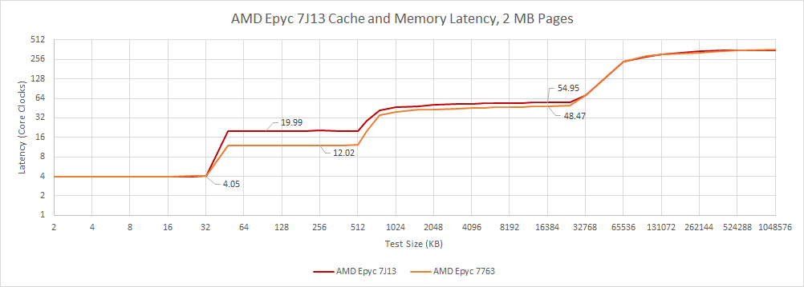
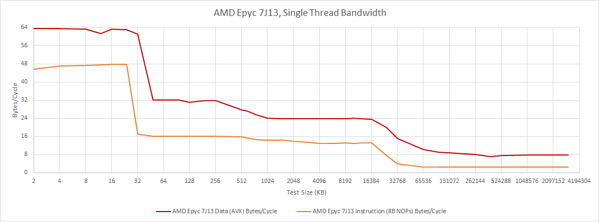
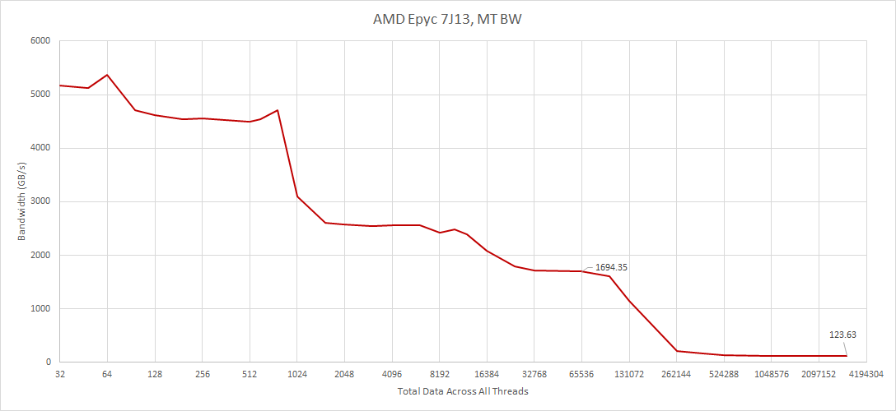

# AMD EPYC 7J13：为 GPU 云实例定制的 Zen 3

> 英文标题：AMD’s EPYC 7J13: Zen 3 Customized 
> 撰文：Chester Lam 
> 首发：Chips and Cheese，2023 年 6 月 28 日 
> 原始链接：https://chipsandcheese.com/p/amds-epyc-7j13-zen-3-customized

在 Lambda Cloud 的 A100 实例上，可以看到一颗名为“AMD EPYC 7J13 64-Core Processor”的处理器。AMD 官网与 Wikipedia 的 EPYC 列表都没有这款 SKU。`lscpu` 报告 2.45 GHz，这更像基础频率；从整数加法延迟反推，核心会加速到约 3.24 GHz。

CPUID 将它识别为 family `0x19`、model `0x1`、stepping `0x1`，核心应属于 Zen 3。不过，它并不是完全照搬常规 EPYC：最突出的变化是 L2 命中延迟达到 20 个周期，而普通 Zen 3 通常约为 12 个周期。

更慢的 L2 可能是面向功耗的定制取舍。在 GPU 云实例中，成本与功耗预算主要留给 A100，CPU 更多承担管理任务，以及少量不适合 GPU 的计算。若放宽 L2 时序能降低功耗，只付出有限的 CPU 性能代价，这种交换就可能合理。但这里没有 AMD 的公开说明，因此“为节能而放宽 L2”只是依据使用场景作出的解释。

L3 延迟也略高，不过很可能只是访问路径先多花时间检查 L2。其余核心表现基本符合 Zen 3：L2 带宽没有下降，基础整数与浮点指令的吞吐和延迟也与常规 Zen 3 相近。

虚拟机暴露了 30 个线程，也就是 15 个物理核心。多线程测试中，L3 总带宽达到约 1.7 TB/s，内存带宽约 123 GB/s，作为 GPU 实例的主机端配置并不差。

### 体系结构视角：同一 ISA 与核心世代，也可以有不同的物理实现点

处理器“采用 Zen 3”并不意味着每一级缓存都必须与零售 EPYC 保持相同周期数。缓存容量、阵列组织、电压频率目标、时序裕量和预取策略都可以为产品场景重新取舍。L2 延迟从 12 增到 20 周期，主要伤害的是依赖链上无法被乱序窗口或预取隐藏的访问；只要带宽不变，大量并行访问的吞吐损失可能小得多。

验证这类定制还需要同频、同 NUMA 布局、裸机功耗和硬件计数器。本文运行在云虚拟机中，只能确认可见的延迟与带宽特征，不能从性能曲线直接确认内部电路改动，也不能量化其节能幅度。

AMD 过去也多次按场景调整同一架构：PlayStation 5 的 Zen 2 缩减了浮点单元，Bergamo 又把 Zen 4 重新实现为更节省面积的版本。EPYC 7J13 展示了另一种幅度更小的定制：保留 Zen 3 的大部分执行能力，同时调整缓存时序，以适应 CPU 不是主要算力来源的系统。

这说明在一个成熟核心架构上仍有很大的产品化空间。针对不同功耗、面积和任务角色调整实现，未必需要另起一套完全不同的核心架构。
