# AMD Magny-Cours 与 HyperTransport：2010 年如何把 12 核塞进一个封装

> **文章来源**
>
> - 文章：*AMD’s Magny Cours and HyperTransport Interconnect: A High Core Count Blast from the Past*
> - 撰文：Chester Lam
> - 首发：Chips and Cheese
> - 发布：2025 年 7 月 11 日
> - 链接：https://chipsandcheese.com/p/amds-magny-cours-and-hypertransport

Opteron 6000“Magny-Cours”把两颗 Phenom II X6 Die 并排封装，复用已验证小 Die 来改善良率、降低成本。两 Die 通过原本用于 Socket 间连接的 HyperTransport（HT）相连，各自带内存控制器，因此单颗封装内部就已经是非一致内存访问（NUMA）。感谢 cha0shacker 提供双路 Opteron 6180 SE。

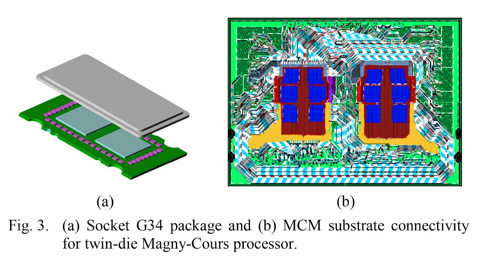

*图 1：可对地址做 Node Interleave 来照顾非 NUMA 软件，但本地/远端延迟仍客观存在。*

每 Die 有四个 16-bit HT Port，可 Unganged 成两个 8-bit Sublink。封装内实际启用一条 16-bit Ganged Link，另有一条 8-bit 物理连接却未获支持。Gen3 最高 6.4 GT/s，因此启用链路为 12.8 GB/s；若 8-bit 也启用可到 19.2 GB/s，但不等宽链路的流量分配复杂。

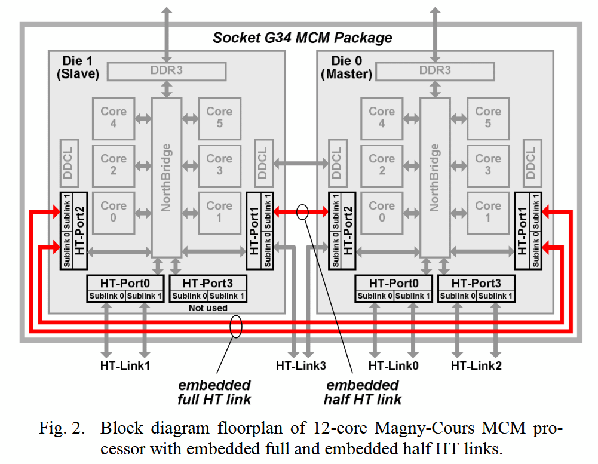

*图 2：一又二分之一 Port 被占后，每 Die 余 2.5 Port 对外，整个 G34 封装提供四条外部 HT。*

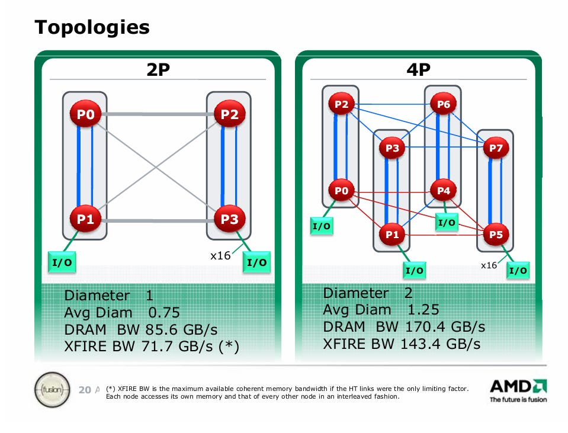

*图 3：四 Socket 可在 I/O 带宽和 Socket 间带宽间取舍；图只是 AMD 的基本示例。*

## 双路全连接：边为 16-bit，对角线为 8-bit

测试系统中，两条 Ganged Port 连接两 Socket 上对应 Die，第三条 Unganged 后交叉连接，形成四 Node 全连接方形；边宽、对角窄。

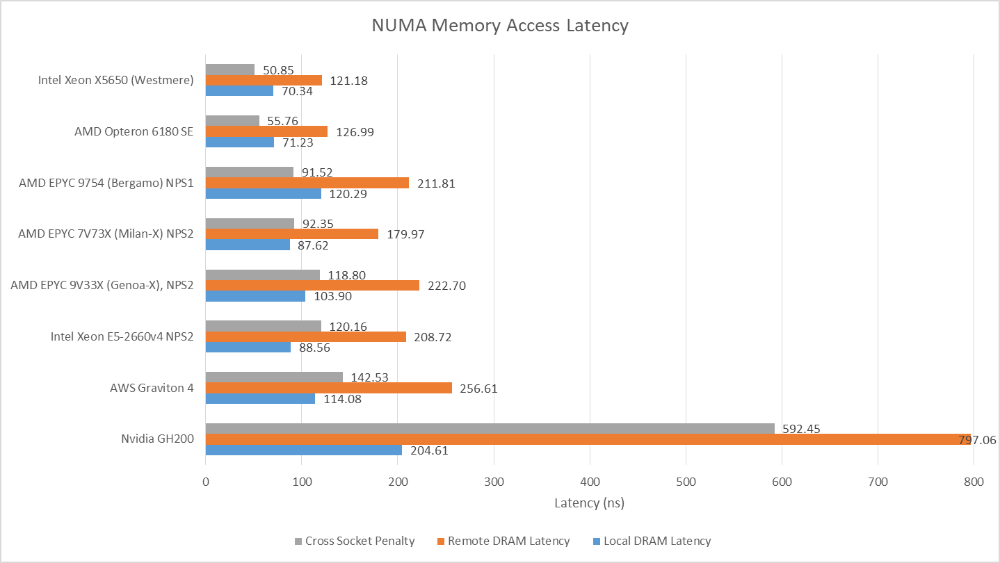

*图 4：拓扑决定同为“远端访问”也有不同带宽。*

远端 DRAM 约 120～130 ns，比本地多 50～60 ns，与同期 Westmere 双路相近。二者本地与远端都比现代大型服务器低延迟，远端惩罚也更小，反映旧内存控制器和较简单链路的低基线，而不是综合性能更强。

## Coherence：MCT Home Node 可能让同 Die 核心绕远路

Memory Controller（MCT）可广播 Probe，简单但流量大、DRAM Return 还要等响应。HT Assist 从每 Die L3 划出 1 MB 作 Probe Filter，记录本地地址空间的 Cache 状态。

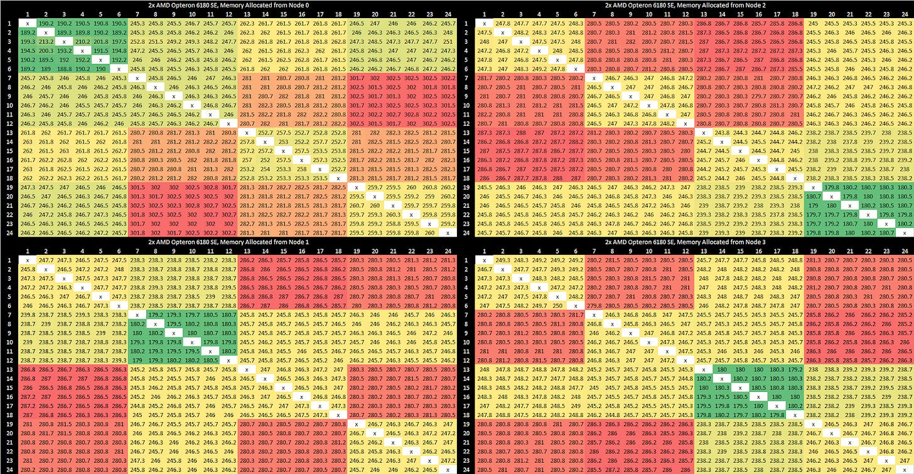

*图 5：用容量换目录，降低 Broadcast；每 Die 可用 L3 因而从 6 MB 减到 5 MB。*

MCT 始终是 Home Agent。即使两个核在同 Die，若 Cache Line Home 在另一 Die，传输也要由远端 MCT 协调。同 Die Core-to-core 约 180 ns；同 Socket 跨 Die 再多约 50 ns；两个核跨 Die、Home 又在第三 Die 的最坏情形超过 300 ns。

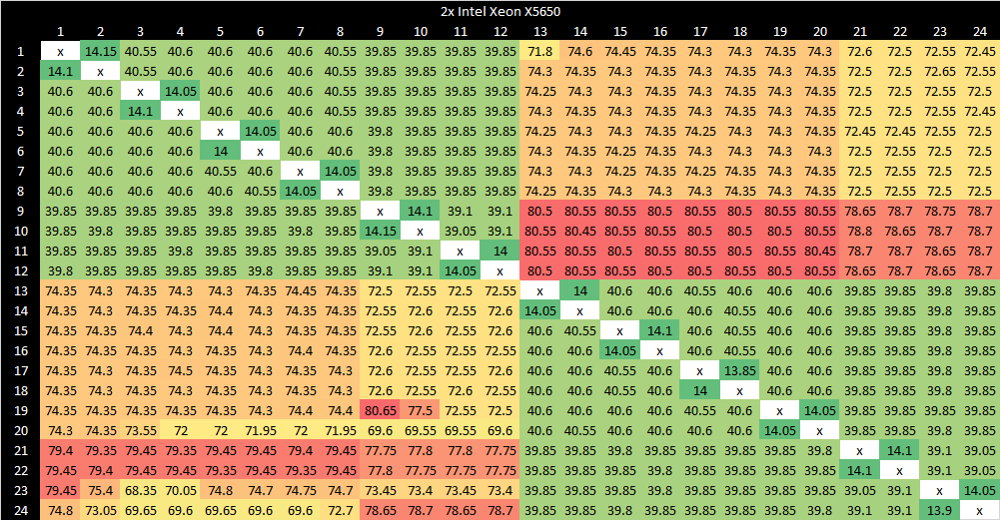

*图 6：延迟取决于 Source、Destination 和 Home 三者，不是简单的“同 Socket/跨 Socket”。Westmere 用 L3 Core Valid Bit 作 Probe Filter，即使地址 Home 在别处，也可在同 Die 内完成转移，整体更低。*

### 体系结构视角：NUMA 优化首先是放对内存，其次才是放对线程

线程与数据同 Node 可避开 HT；共享 Cache Line 还要考虑 Home 位置与写入者，错误放置会引入 Coherence Round-trip。验证时应分别测本地/远端 DRAM、单向/双向带宽和三方 Home 的 Cacheline Ping-pong，并使用 NUMA Pinning；只写“跨 Socket 延迟”会丢掉关键拓扑。

## 带宽：理论链路宽，软件只看到约 4.4～5 GB/s

16-bit Node 间实测约 5 GB/s，封装内略高于跨 Socket；8-bit 对角线约 4.4 GB/s。

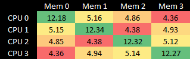

*图 7：单位 GB/s，矩阵直接呈现宽边/窄对角。*

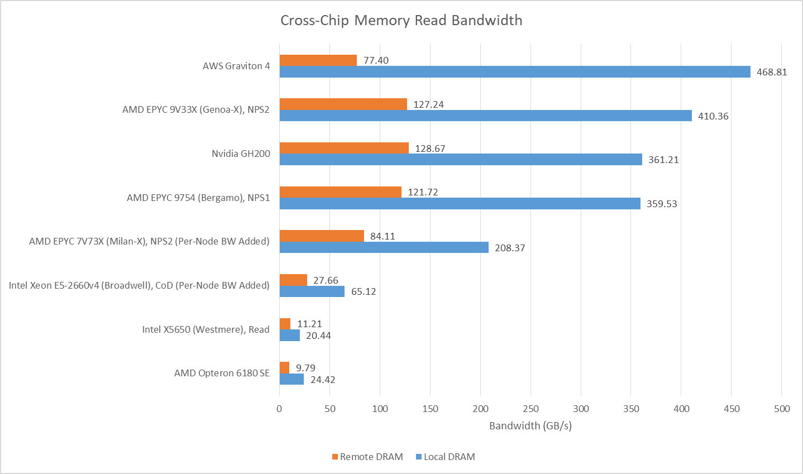

*图 8：总量与 Xeon X5650 大致同一量级；现代平台因 DDR、总线和 Socket Link 进步远高于此。*

双向让两 Socket 同时读对方内存，若确保走 16-bit Link 可略超 17 GB/s；只走 8-bit 对角为 12.33 GB/s。精心安排四个 Node 分别从另一个、且都走 16-bit 的 Node 读，可达 19.3 GB/s。

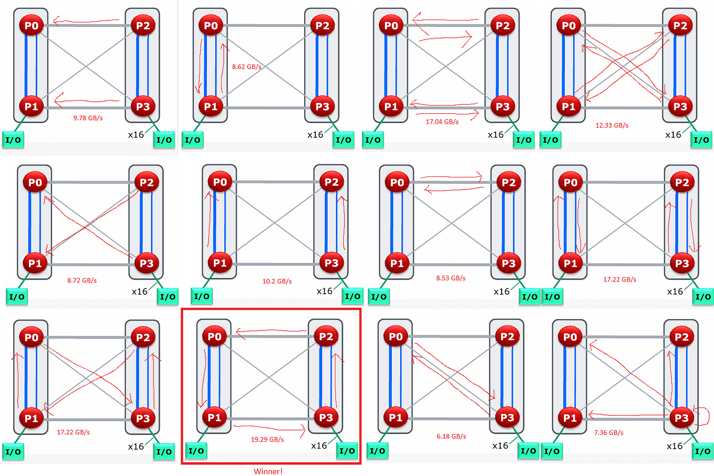

*图 9：结果高度依赖亲和性，不能只报一个“跨 Socket 带宽”。*

所有核心读取本地内存，总 DRAM 略超 48 GB/s，约等于较现代的 Ryzen 3950X 平台；后者 Cache 带宽高得多且桌面侧无这种 NUMA。

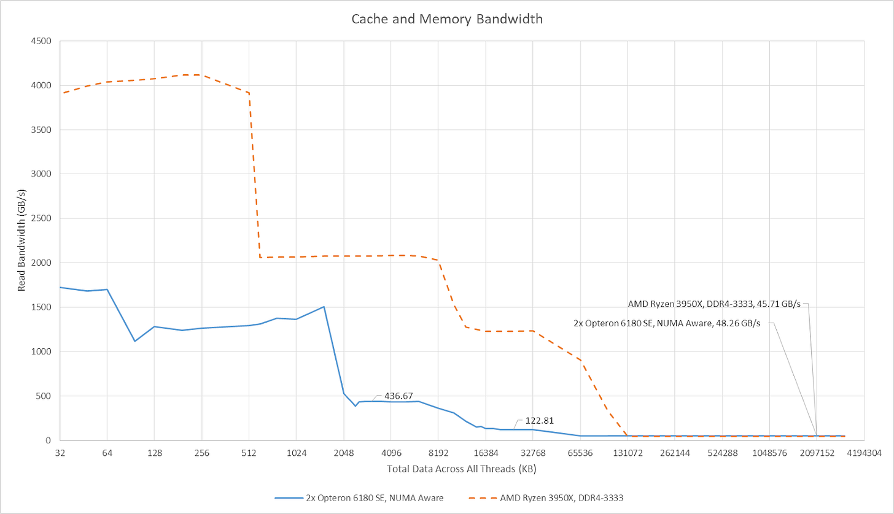

*图 10：聚合值不代表单线程或任一 Node 可获得相同带宽。*

## Die 内 Northbridge：低空载延迟，公平性差且 DDR3 利用率低

六核心经 SRI→XBAR 两级 Crossbar 到本地 MCT/HT。Family 10h 的 System Request Queue 为 32 项，早期 K8 Opteron 为 24；XBAR Scheduler（XCS）56 项，跟踪 SRI、MCT 与 HT Command。

Crossbar 适合节点数少、线数可控的低延迟有序网络。空载 Pointer Chasing 约 72.2 ns，比不少现代复杂服务器的 100 ns 以上更低。

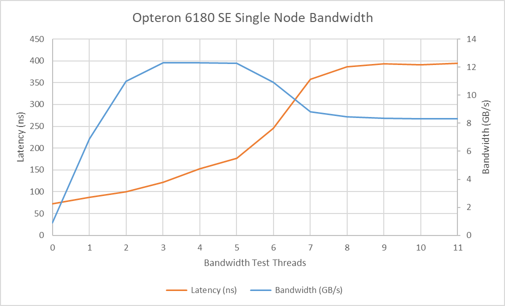

*图 11：同 Die 其余五核制造带宽后，延迟升至 177 ns，超过两倍。*

若另一 Die 的核心也访问同一 MCT，本地带宽降到 8.3 GB/s、延迟接近 400 ns，多级 Crossbar/HT/MCT 争用明显。

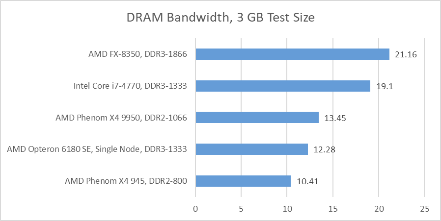

*图 12：三个核已达到约 10.4 GB/s 上限；每 Node 双通道 DDR3-1333 理论 21.3 GB/s，全系统 85.3 GB/s，实测远低于理论。可能原因包括 1.8 GHz Northbridge、到 MCT 的窄接口或不足的队列项，无法仅凭曲线确定。Bulldozer 2.2 GHz Northbridge 已可超过 20 GB/s。*

## SPEC CPU2017：高核心数产品的单线程代价

该段报告单线程 SPEC CPU2017 与子项趋势，但网页没有给出完整编译器、Flag、输入规模与重复次数。不同 CPU 的频率、内存和年代也不统一，因此只能解释 Cache/频率取舍，不能视为标准化产品排名。

6180 SE 核心仅 2.5 GHz、Northbridge 1.8 GHz，以控制双 Die 功耗；单线程分数略低于最高 2.7 GHz 的 Goldmont Plus。

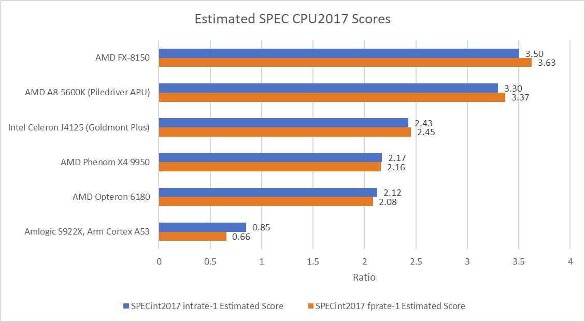

*图 13：这是特定编译和平台下的套件对照，不应把服务器多核目标简化为单线程排名。*

更老的 Phenom X4 9950 因频率更高，在整数/浮点平均略胜；超频到 2.8 GHz 更有利。6180 SE 即使拿 1 MB L3 作 Probe Filter，剩余 5 MB 仍有明显命中率优势。

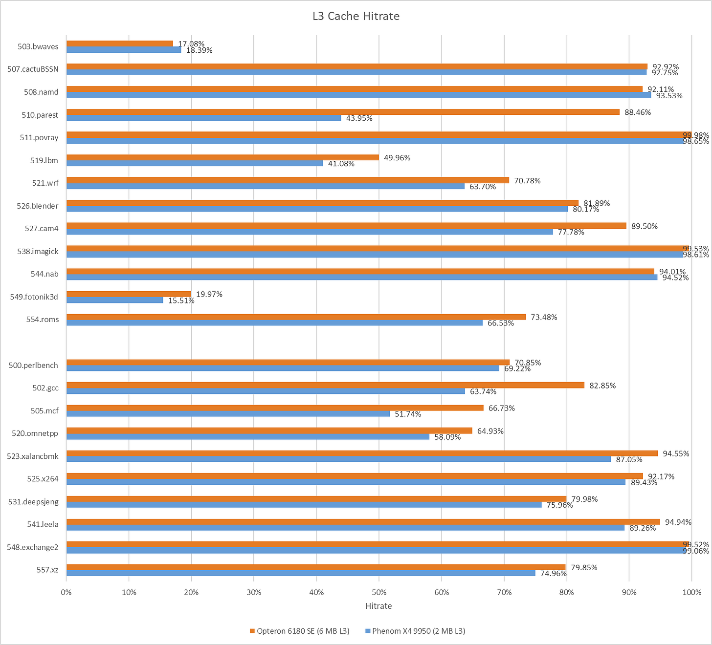

*图 14：510.parest 的大 Cache 让 6180 SE 领先 9.4%；548.exchange2 数据足迹小、高 IPC，Phenom 的 12% 频率优势转化为约 11% 性能领先。*

## 结语：现代 Chiplet 路线的早期影子

Magny-Cours 用小 Die 复用、L3 划分 Probe Filter、多 Die 封装和 HyperTransport，在 2010 年技术条件下低成本扩到 12 核。代价是四 Node NUMA、对角线窄链路、低 DDR3 利用率和 Loaded Latency 公平性差，软件调优明显比现代统一 24 核芯片复杂。

这套策略仍确定了 AMD 后续路线：Bulldozer Opteron 延续每 Socket 两 Die，Zen 1 把它推到每 Socket 四 Die，并用 Infinity Fabric 替代 Northbridge+HT；今天又以独立 I/O Die 和 CCD 提供更统一的内存访问。技术实现已经不同，复用小型计算 Die 扩规模的经济逻辑却延续至今。

## 参考资料

- Chester Lam, *AMD’s Magny Cours and HyperTransport Interconnect*, Chips and Cheese, 2025-07-11
- AMD Family 10h/Opteron 6000 Northbridge 与 HyperTransport 资料
- Arm AMBA 5 CHI Architecture Specification（Crossbar/Ring/Mesh 取舍）
