# AMD Phoenix：把 Zen 4、RDNA 3 与 XDNA 装进移动 SoC

> 英文标题：Hot Chips 2023: AMD’s Phoenix SoC
> 撰文：Chester Lam
> 首发：Chips and Cheese，2023 年 9 月 16 日
> 链接：https://chipsandcheese.com/p/hot-chips-2023-amds-phoenix-soc

AMD 移动芯片曾长期落后：Bulldozer 能效不敌 Intel，Zen 初期 Idle Power 仍偏高，iGPU 又常落后独显架构几代。Van Gogh、Rembrandt 终于带来 RDNA 2；Phoenix 则把当代 Zen 4、RDNA 3、XDNA AI、Audio DSP 和新 Video Engine 放在同一颗 Mobile SoC 中。

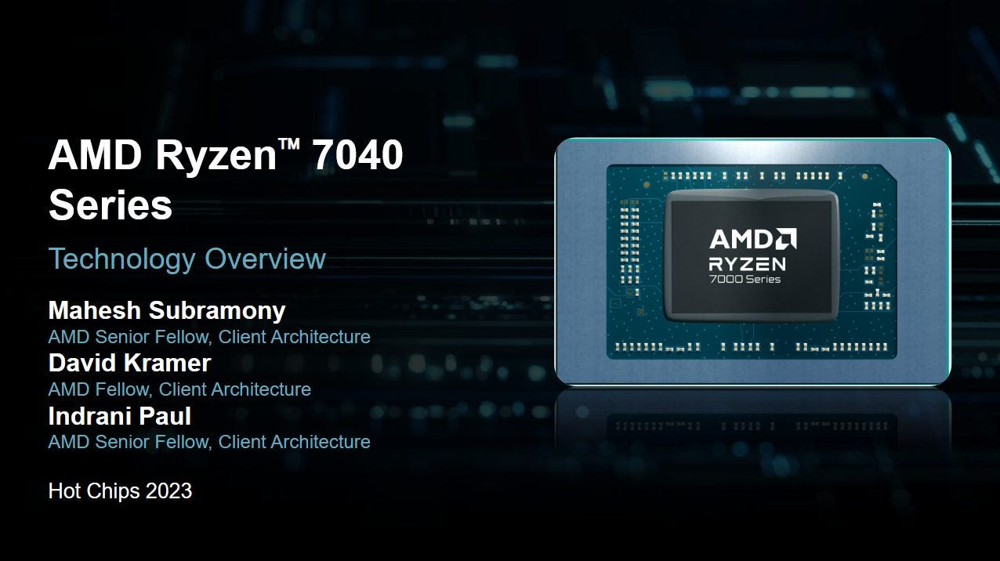

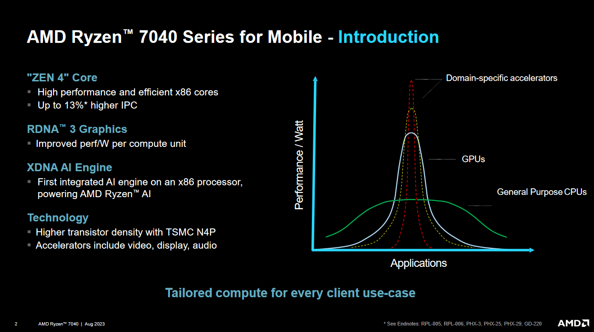

专用 Accelerator 的意义，是在 AI Inference、Audio Signal 和 Video Codec 上避免唤醒高功耗 CPU/GPU。

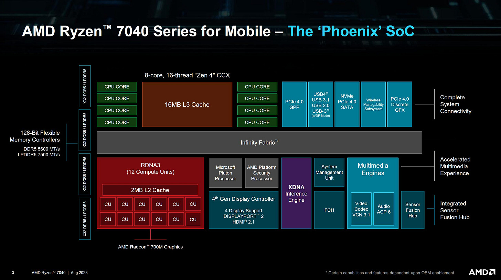

除 AMD 演讲外，文章实测 Ryzen 7 7840HS 笔记本：DDR5-5600 46-45-45-90，HP 把 Boost 限到 4.5 GHz，而 SKU 标称 5.1 GHz；另有 ASUS ROG Ally 的 Ryzen Z1 Extreme/LPDDR5 数据，后者可到 5.1 GHz。这两套平台不可直接归成同一内存/频率条件。

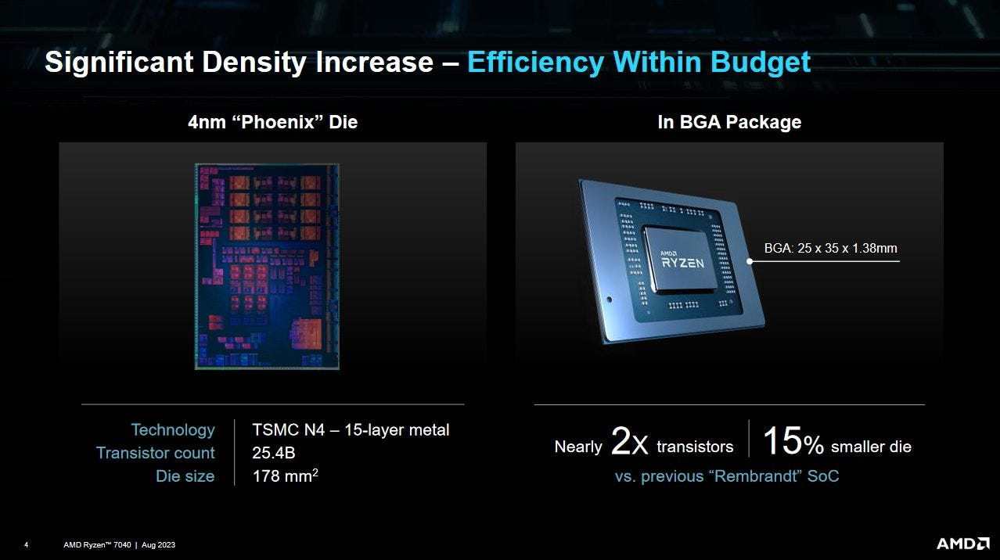

Phoenix 比 Rembrandt 更小，仍用 25×35 mm BGA。

## CPU：八个 Zen 4 与缩半 L3

八核同一 Cluster，L3 只有 16 MB，可能是每核 Slice 从桌面 4 MB 缩至 2 MB 以省面积。

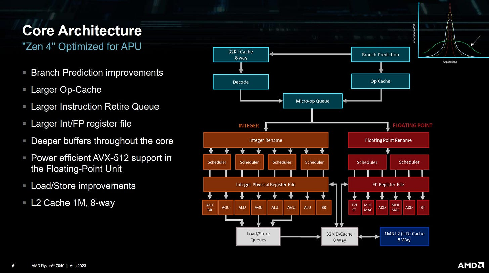

按 Cycle 测得的 L3 Latency 与桌面 Zen 4 相同；按 ns 则因频率低而较差。7950X3D 非 V-Cache CCD 在 16 MB 工作集约 8.85 ns，4.5 GHz 7840HS 在 10 MB 约 10.92 ns。

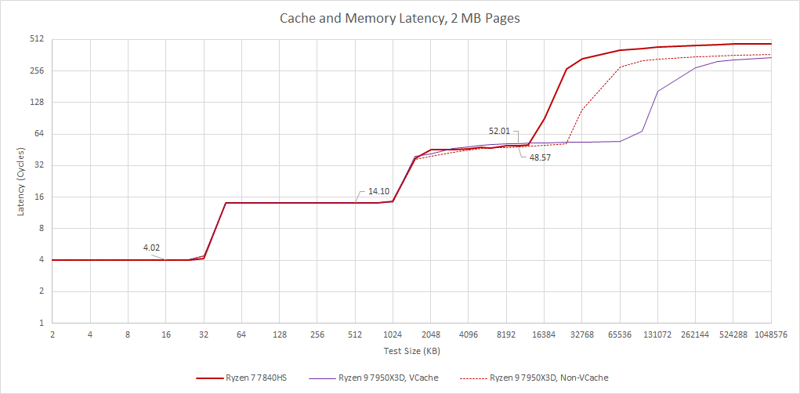

1 GB 工作集下 HP 为 103.26 ns，7950X3D 为 87.68 ns；后者 DDR5-5600 36-36-36-88，前者 CL46，内存时序与笔记本平台共同进入差距。

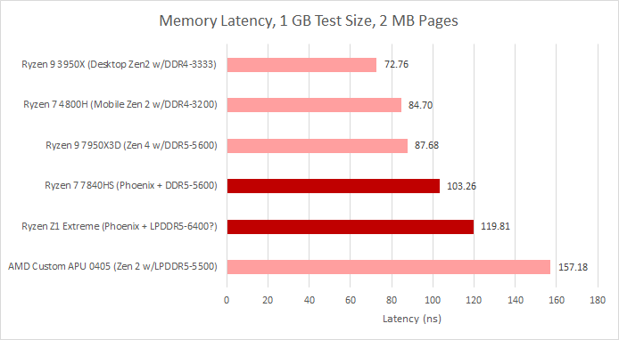

ROG Ally LPDDR5 约 119.81 ns，更高，却比 Van Gogh 的超高延迟明显改善。

CPU Cluster 通过双向 32 B/cycle Infinity Fabric 接系统。桌面 CCD Write Path 常只有一半宽，而 Phoenix Write 同样 32 B/cycle；单核实际很少需超过 30 GB/s Write，多线程又可分散。

CLZERO 等识别的 Cacheline Zeroing 可减少 Fabric Traffic，7950X3D 单 CCD 有效写带宽可超过 68 GB/s。初始化新内存很常见，因此 Generic Write Benchmark 不一定反映真实清零路径。

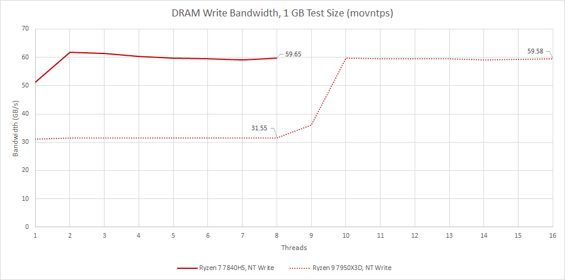

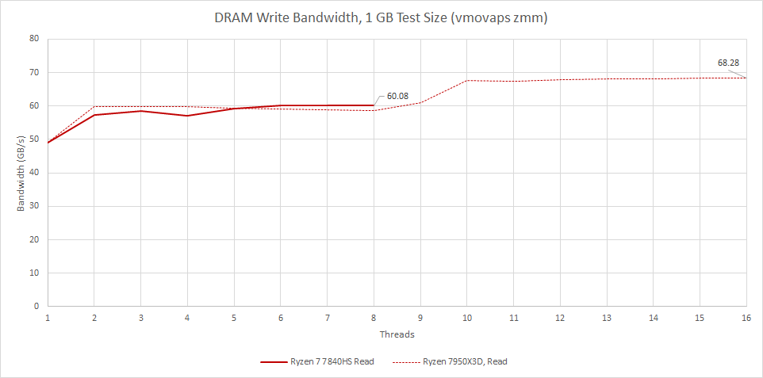

单 Cluster 32 B/cycle 无法把内存控制器 Read 全部吃满，但约 60 GB/s 对八 Client Core 已充足；科学计算/ML 可能仍需要更多，却不是 Mobile SoC 的主要目标。

### 体系结构视角：同一 DRAM 要同时服务 CPU、GPU 与 Accelerator

统一内存省去复制，却让各 Agent 争用 Controller。CPU 偏好低 Latency、GPU 偏好高 Bandwidth、媒体模块偏好短 Burst。Fabric Clock、QoS、Cache 和专用 DMA 的任务，是在同一物理通道上隔离这些不同流量，而不只是把峰值 GB/s 做高。

## Infinity Fabric 的动态能效

Interconnect 在轻负载时也可能占显著功耗。Phoenix 按 Compute-bound、I/O-bound、Video Conference 等 Profile 切换 Fabric Mode。

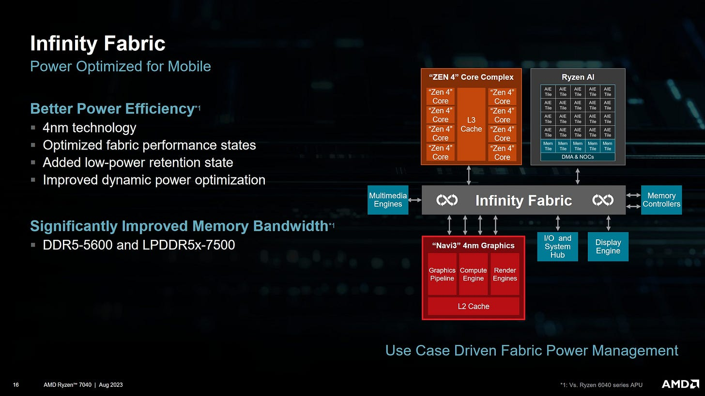

这避免 Van Gogh 为极低功耗 Gaming 优化后、CPU 侧只约 25 GB/s 的问题。实测 Fabric Clock 会随 CPU/GPU 流量变化。

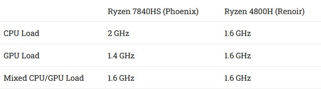

一种解释是 GPU 有四个 32 B/cycle Port，低 Fabric Clock 仍有带宽；CPU Client Code 更怕 Latency，因此给更高 Clock。Renoir 则不论发起者均拉到 1.6 GHz。

新 Z8 Sleep State 可在按键间隙等短 Idle 中 Clock/Power Gate，并以不可感知时间恢复。Video Playback 中 Z8 Residency 很高，说明 Media Engine Buffer/Cache 可把内存访问聚成 Burst。

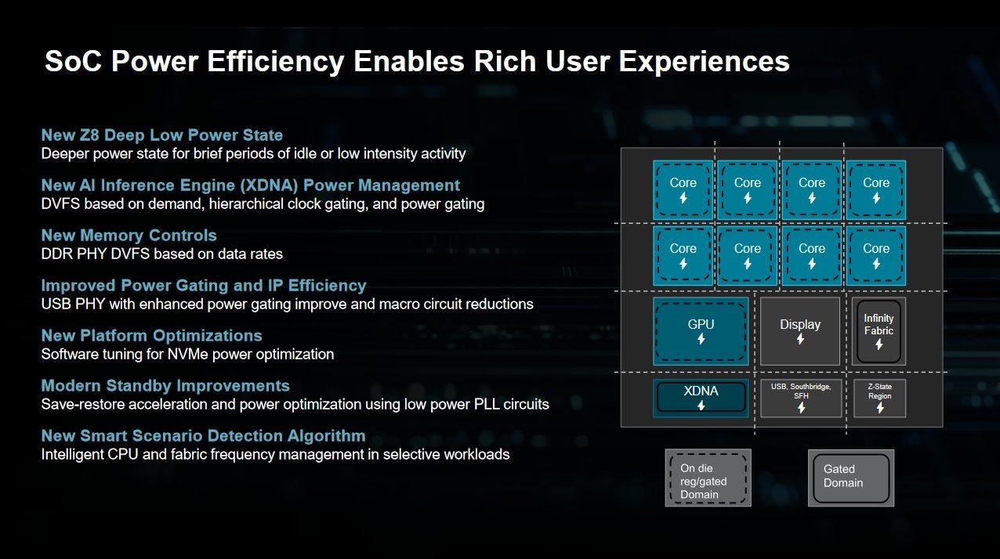

Memory Controller 也动态改 Clock/Voltage；AMD 甚至重新优化沿用多年的 USB 2.0 PHY。

## RDNA 3 iGPU：小 GPU 配大 L2

Radeon 780M 有六个 WGP、768 个 SIMD Lane、每拍 1536 次 FP32 Operation。两个 Shader Array 各有 256 KB Mid-level Cache，另有 2 MB L2。相对 Van Gogh，L2 翻倍、SIMD 多 50%、DRAM 稍宽。

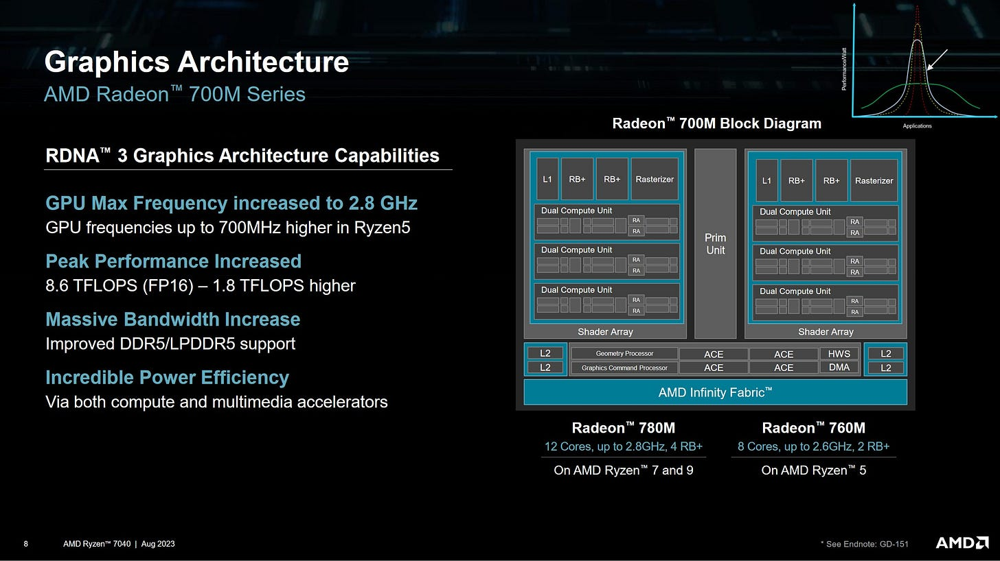

2 MB L2 与 RX 7600、旧 RTX 3050 相同，对这样的小 iGPU 比例很大。L0/L1/L2 Cycle Latency 接近 RX 7600，独显靠更高 Clock 在 ns 上略快。

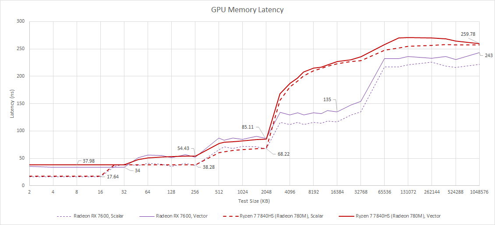

L2 之后因无 Infinity Cache，Phoenix Latency 很高；但 LPDDR5 每 SIMD 的 Bandwidth 比桌面 GPU 更充足，额外 Cache 不一定值得面积。

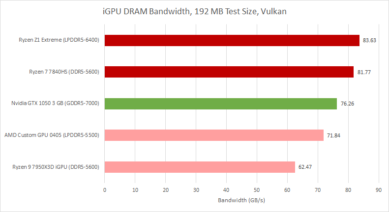

DDR5/LPDDR5-5600 的 GPU DRAM Bandwidth 已高于 GDDR5 GTX 1050 3 GB；5.6 Gb/s per pin 甚至超过早期 GDDR5。命中 L2 时 Phoenix 比 Van Gogh 高数倍。

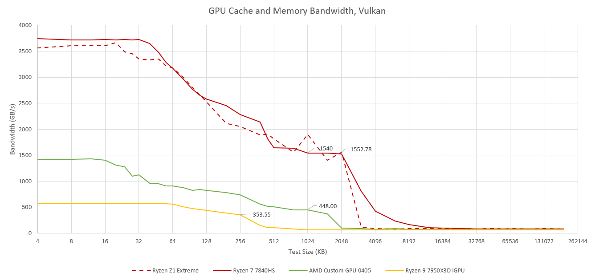

同测试中 GTX 980 Ti L2 约 686.9 GB/s，Phoenix 的小 Shader Array 不会被 L2 带宽限制。它的 Frontend 与 Shader 同频；小 GPU 的 Bottleneck 多在 Shader，单独加速 Work Distributor 收益小。

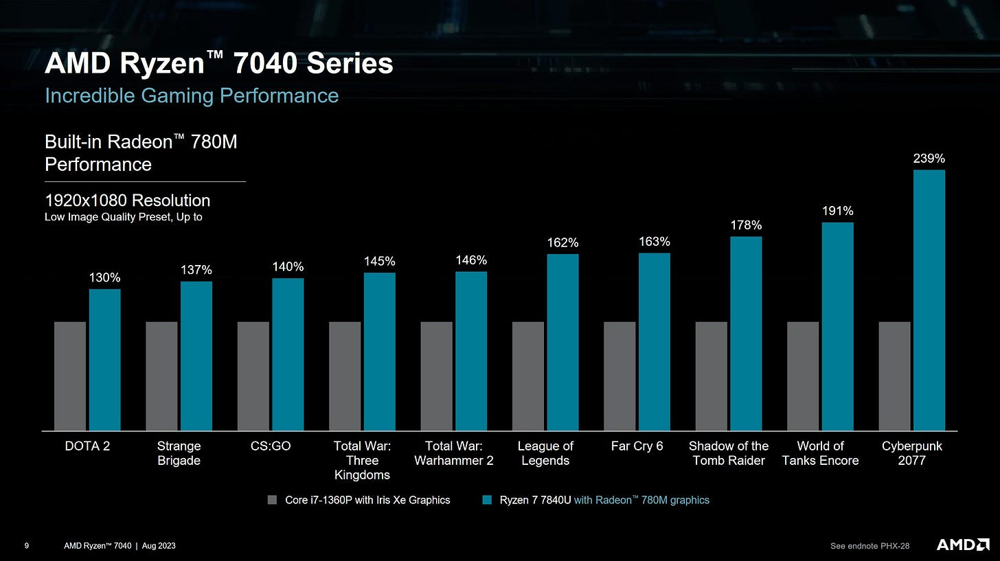

文章没有给 FPS，只依据 Steam Deck 与更宽、更快、更高带宽的 Phoenix 推测：降低设置后 720p/1080p 应可玩。这不是正式游戏 Benchmark 结论。

Video Engine 支持 AV1，以 Race-to-idle 完成后快速休眠，并能处理多路 Video Conference Stream。

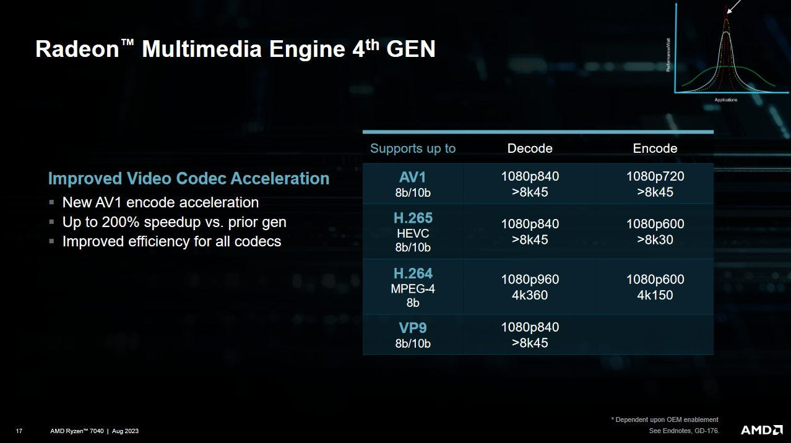

## XDNA：16 个 AIE-ML Tile

XDNA 源自 Xilinx，16 个 Tile 可 Spatial Partition 给多个应用。

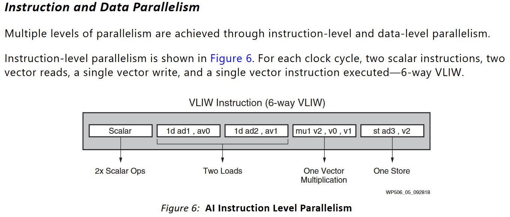

它以低频、超宽 Vector 追求小型 Inference 能效。文档写约 1 GHz；Phoenix 宣称 BF16 5 TFLOP/s，可能约 1.25 GHz。两组 Vector Register File 分工：6 KB 提供 Multiplier Input，8 KB 保存 Accumulator，均支持 256/512/1024 bit 组合访问。

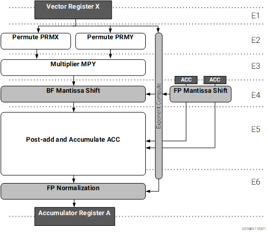

FMA 因 FP Normalization 为约六周期，Integer FMA 五周期；512 bit Add/Shuffle 约三周期。宽 Permute 能力是长 Latency 的部分交换。

每 Tile 有 64 KB Software-managed Data Memory，而非 Cache，省 Tag Check。20 bit Address 由三 AGU 和独立 Pointer/Modifier Register 生成，避免给主 Scalar RF 增加六个端口。

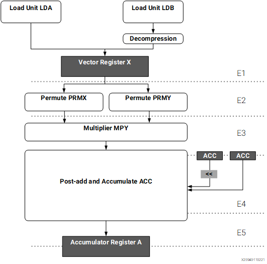

Data Memory 每拍 2×256 bit Read、1×256 bit Write；可同带宽访问邻近 Tile，总计高带宽触达 256 KB。50% Sparsity 可由 Memory System Decompress，再用 Mask 跳过无效计算，但模型必须按 Sparsity 训练/整理。

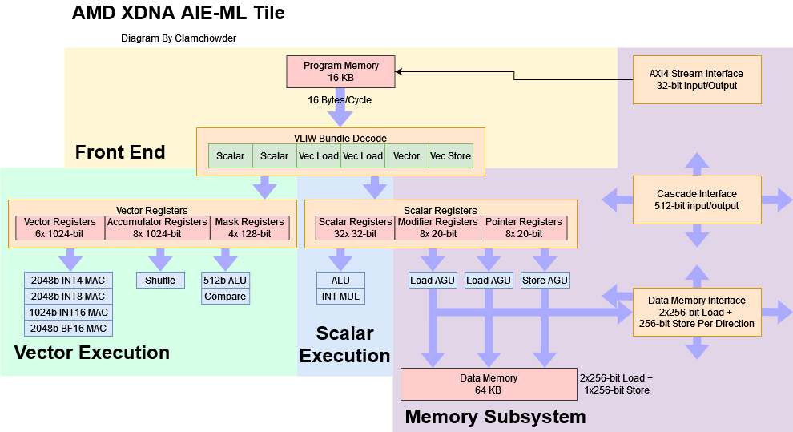

Frontend 有 16 KB Program Memory，也无 Tag；VLIW 最多一拍六条、满 Bundle 16 B，不满时可更短。

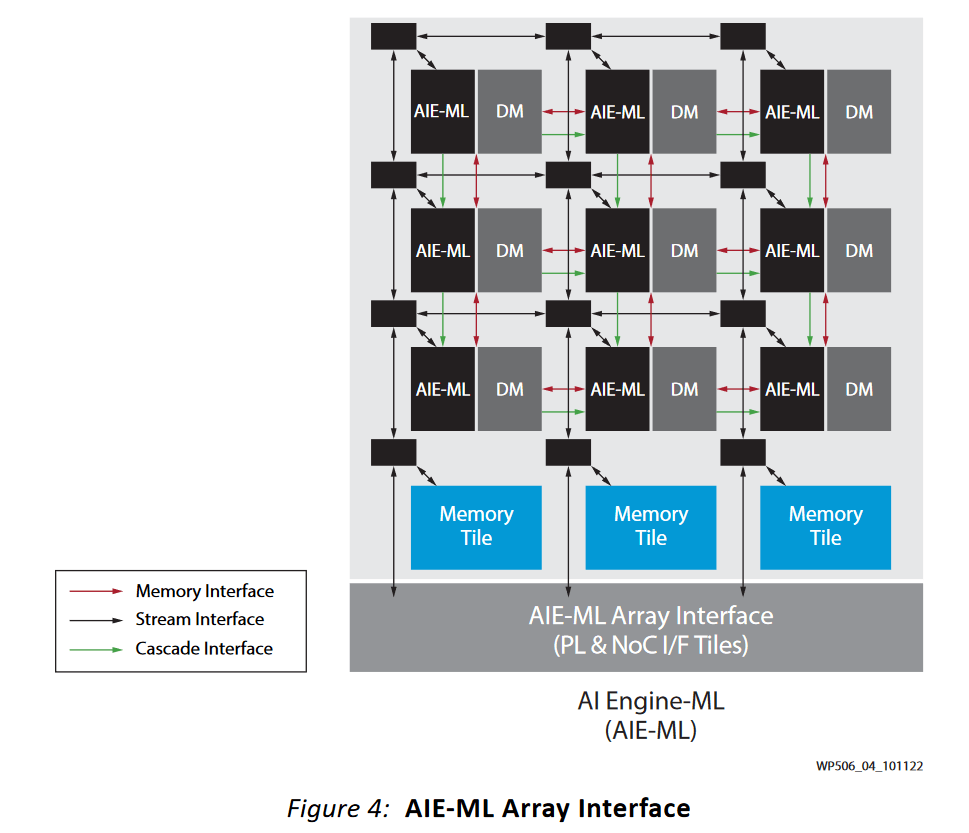

邻 Tile 还有专用 512 bit Accumulator Forward，通用 AXI4 跨 Tile 两周期。整个 Engine 有共享 L2 SRAM 作 Staging；容量未披露。文章推测可能是四个 512 KB Memory Tile、总 2 MB，但不能作为规格。

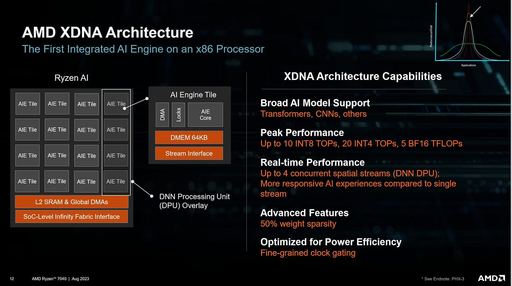

系统内存由 DMA 通过 32 B/cycle Fabric Port 流入。RDNA 3 用 WMMA 的 BF16 峰值可能更高，但 XDNA 功耗更低；目标应用多为 INT8，更适合专用 Engine。

### 体系结构视角：专用加速器的瓶颈常在数据编排

5 TFLOP/s 只有数据能按 Tile 拆分、在 64 KB Local Memory/邻居间复用时才成立。DMA、Layout Transform、Partition 与 CPU Synchronization 会进入端到端延迟。验证 NPU 不能只跑核心 Kernel，还要报告模型版本、Precision、Batch、搬运时间和整机能耗。

## Always-on Audio DSP

Audio Coprocessor 有两个 DSP，可做 Noise Reduction；作为 Wake Source 时低频运行。

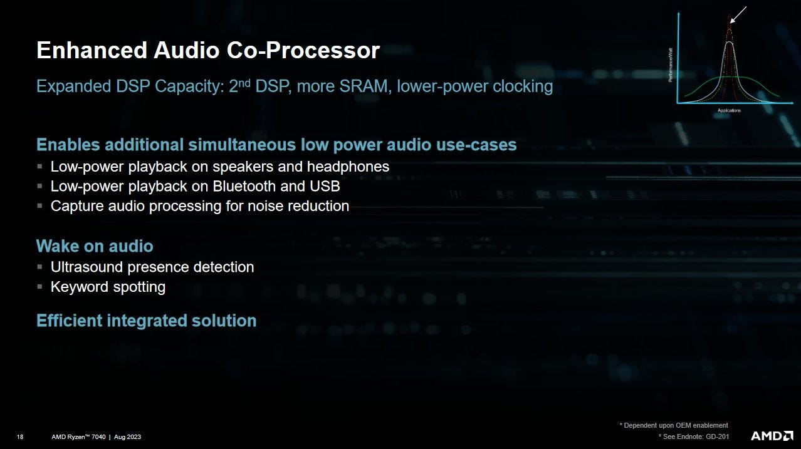

它还能发 20～35 kHz Ultrasound，经 Speaker/Microphone Bandpass 后用 Doppler 区分人类移动与静态物体，类似 Look-down Radar 去除 Ground Clutter。

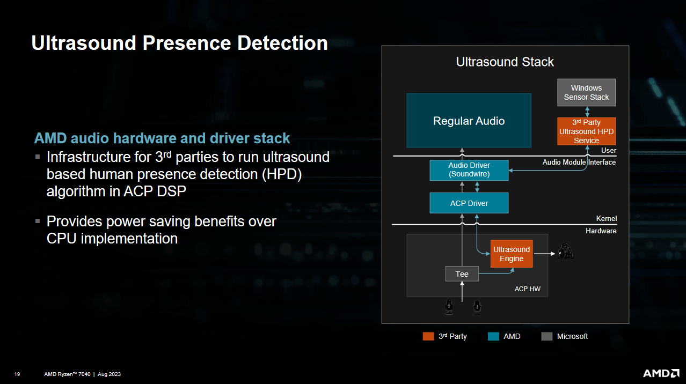

AMD 向第三方开放该 Engine。狗可听见该频段，可能因被声音惊动而从“静态”变为可检测目标，这是文中的幽默提醒。

## 结语

Phoenix 的价值不只在 CPU/GPU 更新，而在整个 SoC 为移动能效重做：Fabric 动态模式、Z8、Media Race-to-idle、XDNA 和 Audio DSP 让专用任务无需持续唤醒大单元。

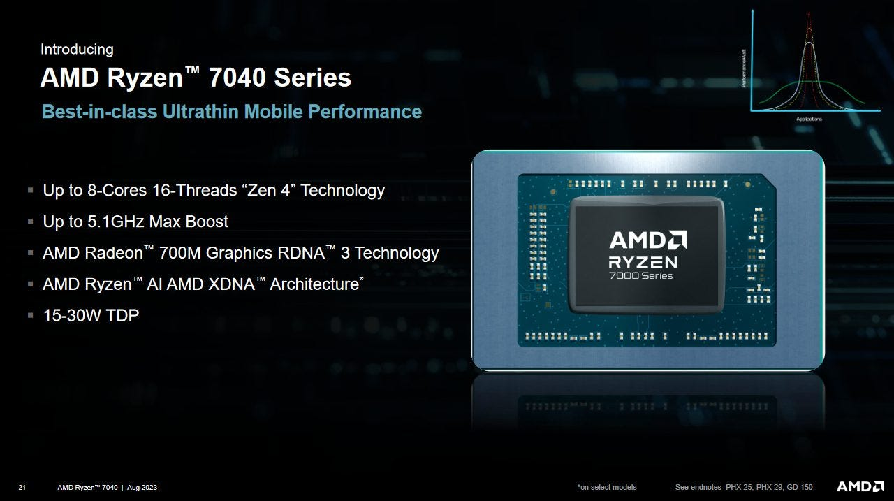

实测也揭示平台影响：HP 的 4.5 GHz 限制、CL46 DDR5 与 ROG Ally LPDDR5 会改变 ns Latency；Fabric Clock 推断和 XDNA L2 容量仍非官方确认。Phoenix 已是一颗强移动 APU，但任何 CPU/GPU/NPU 排名都应在具体功耗、内存与软件条件下进行。

## 参考资料

- AMD Hot Chips 2023 Phoenix 演讲
- AMD/Xilinx AIE-ML 公开文档
- Chips and Cheese：Hot Chips 2023: AMD’s Phoenix SoC
