# Ryzen 9 9950X：Zen 5 来到桌面端之后，究竟强在哪里

> **文章来源**
>
> - 文章：*AMD’s Ryzen 9950X: Zen 5 on Desktop*
> - 撰文：Chester Lam
> - 首发：Chips and Cheese
> - 发布：2024 年 8 月 14 日
> - 链接：https://chipsandcheese.com/p/amds-ryzen-9950x-zen-5-on-desktop

AMD 代号 Granite Ridge 的桌面 Zen 5 延续了熟悉的 Chiplet 形式。与 Strix Point 移动版相比，桌面端有更宽裕的功耗和面积预算，也不用为 NPU 留出空间，因此获得更大的 Cache、更强的浮点/向量单元和更高频率。本文以 Ryzen 9 9950X 为对象，重点不是重复 Zen 5 的所有结构，而是看同一代核心到了桌面平台后，资源配比发生了什么变化。

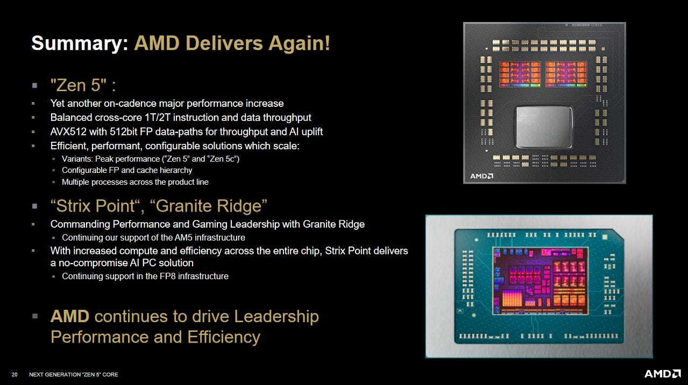

*图 1：Ryzen 9 9950X 是 16 核桌面 Zen 5 产品。后文把核心、CCD、I/O Die 和内存平台分开分析，避免把整机结果都归因于核心本身。*

测试样片由 AMD 提供，平台为 Gigabyte X670E Aorus Master，内存是 G.SKILL F5-6400J3239F48G DDR5，按 AMD Review Guide 建议设为 6000 MT/s。对照机的内存并未严格匹配：Zen 4 使用 DDR5-5600，两个平台也由不同地点的测试者持有。XMP/EXPO 均已开启，而这在定义上属于 Overclocking。因此，绝对性能差异只能作为平台结果，核心结构变化才是主要阅读对象。网页也没有完整披露全部微基准源码、Compiler/Flags、OS、Firmware、预热、重复次数与误差。

## 系统层次：两个 CCD 继续围绕 Zen 4 I/O Die

9950X 由两个 Core Complex Die（CCD）和一个 I/O Die 组成。每颗 CCD 含八个 Zen 5 Core 和 32 MB Shared L3；I/O Die 沿用 Zen 4，提供 DDR5、PCIe 和小型 iGPU。Infinity Fabric（IF）把这些模块连起来。

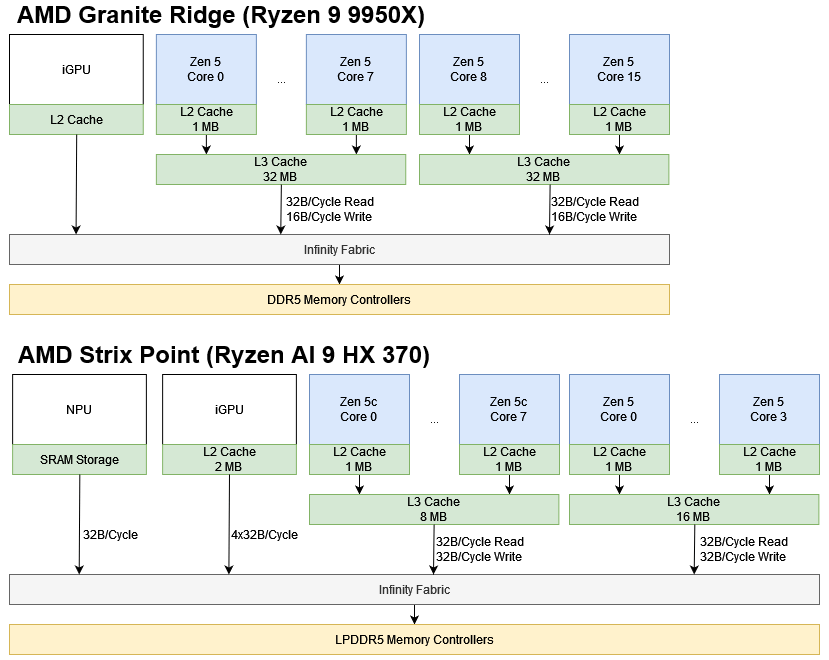

*图 2：两颗 8-core CCD 连接到中央 I/O Die。每颗 CCD 都有自己的 32 MB L3 与 Fabric Link，所以同 CCD、跨 CCD 和访问 DRAM 的代价并不相同。*

桌面端每条 CCD→I/O Die Link 的读方向为 32 B/cycle、写方向为 16 B/cycle；移动 Zen 5 的 Cluster Link 则是双向 32 B/cycle。IF 在两类平台上都运行于 2 GHz，因此每颗桌面 CCD 对外理论读/写带宽分别为 64/32 GB/s，与桌面 Zen 4 完全相同。

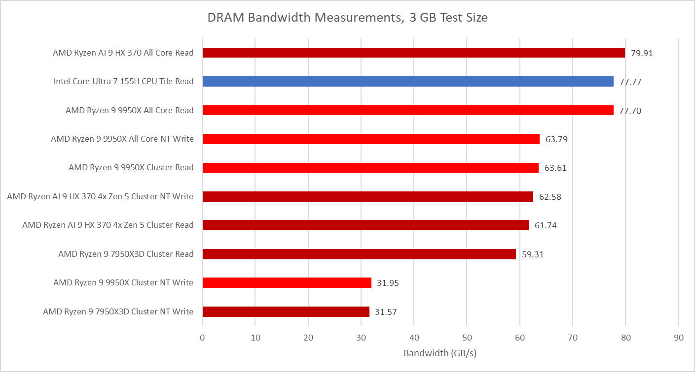

*图 3：9950X 更接近接口理论上限，但接口本身没有比桌面 Zen 4 加宽；更快 DRAM 配置可能帮助它减少了下游限制。*

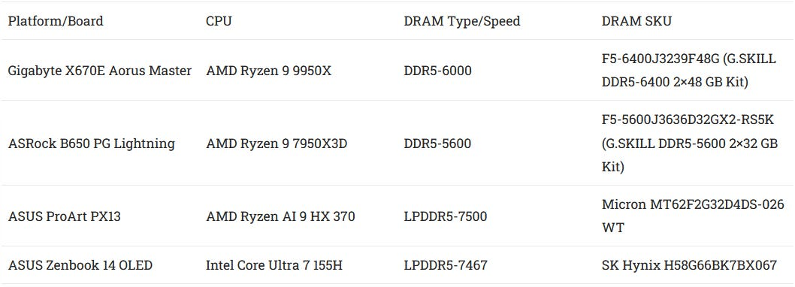

*图 4：9950X 的实测带宽接近 Core Ultra 7 155H。后者 LPDDR5-7467 理论值为 119.47 GB/s，而 9950X 的 DDR5-6000 为 96 GB/s；Strix Point 略高于 9950X，但优势很小。不同控制器、时序和测试平台使这不是纯 DRAM 规格比较。*

标准 DDR5 的优势更偏向延迟。9950X 配 DDR5-6000 略高于 70 ns，优于 DDR5-5600 的 7950X3D，也明显优于移动 LPDDR5。这个数字甚至只大致追平 DDR3-1333 的 Core i7-4770，但 Zen 5 有更强 Cache 和更大乱序窗口，更能容忍同样的绝对延迟。

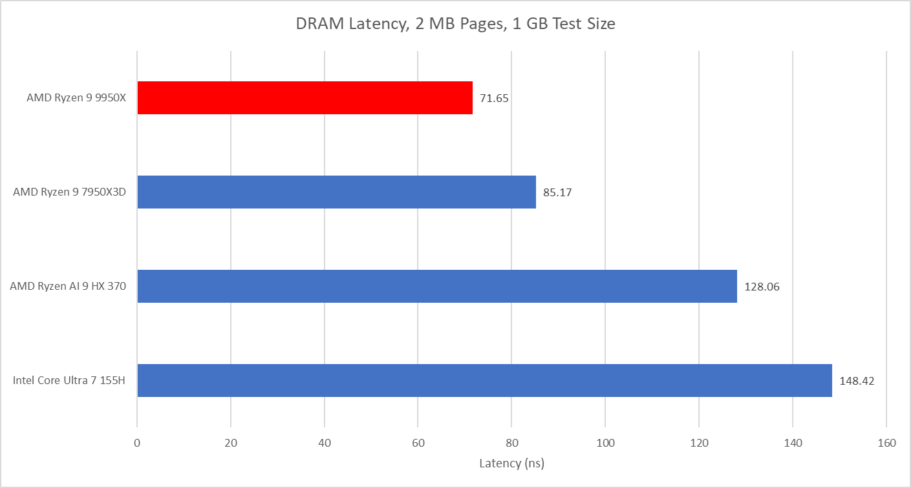

*图 5：新内存代际通常先增加带宽，单次访问延迟未必同步下降。这里的差别同时包含 DRAM 类型、频率、时序、I/O Die 与平台设置。*

### 体系结构视角：Chiplet 的带宽与延迟是两个问题

CCD Link 决定稳态流量上限，跨 Die Route 和 DRAM Timing 决定一次 Miss 要等多久。增加乱序容量、Prefetch 和 Cache Hit Rate 可以把多个 Miss 重叠起来，却不能消除 Pointer Chasing 一类串行依赖的 70 ns。评价 Memory Subsystem 应同时观察带宽饱和曲线、Load-to-use 延迟、Outstanding Miss 数和 CCD Placement。

## 核间延迟：同 CCD 很快，跨 CCD 接近 200 ns

多核系统必须让私有 Cache 维持一致视图。测试在 Core Pair 之间来回传递同一 Cache Line，用来观察 Cache-to-cache Transfer。

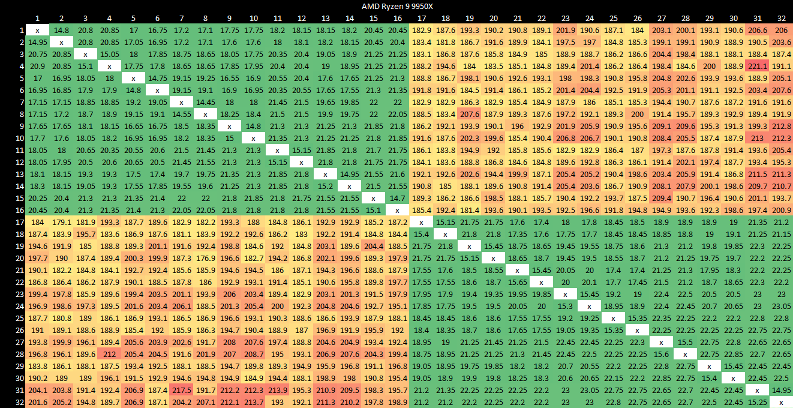

*图 6：同 CCD 内传输依然很快；跨 CCD 延迟接近 200 ns，已接近部分服务器跨 Socket 的量级。矩阵反映完整 Platform 的一致性与 Fabric 路径，不是 Zen 5 Core Pipeline 的单一属性。*

这相较前代是回退。7950X3D 的跨 CCD Cache Transfer 通常低于 80 ns，最坏情况也更接近 Monolithic Mesh 的核间延迟。

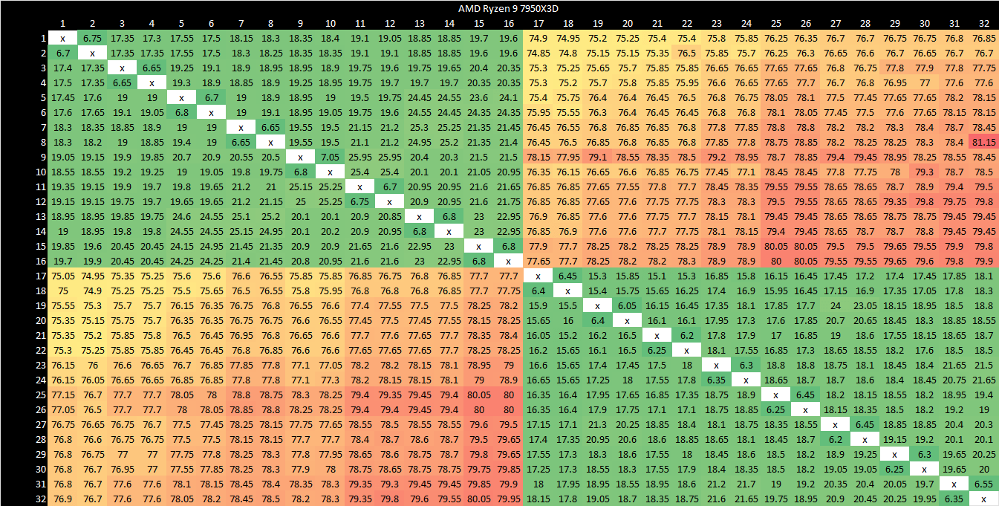

*图 7：Zen 4 对照清楚展示跨 CCD 路径差距。网页没有把近 200 ns 拆成 Probe、Fabric、Clock Domain 或其他内部阶段，因此只能确认端到端回退。*

### 体系结构视角：一致性距离会影响锁和共享队列

普通私有数据不会频繁跨核来回迁移，但 Lock、Atomic Counter、Producer-consumer Queue 和错误共享会把这一代价放到关键路径。调度器若把强通信线程放到同 CCD，可避开最昂贵的路径。要定位原因，需要把同 CCD/跨 CCD 的 HITM、Snoop、Fabric Queue 与 Cache-line Migration 事件结合起来；单张延迟矩阵不足以确定具体一致性协议阶段。

## 频率：两颗 CCD 仍有差异，但核心更均匀

两颗 CCD 的最高频率分别为 5.72 GHz 和 5.49 GHz。相比以往，同一 CCD 内不再出现明显 Preferred Core，说明可见的 Silicon Quality Variation 更小，也能减轻 OS Thread Scheduling 的负担。

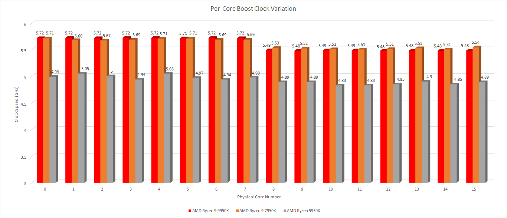

*图 8：主要差异位于 CCD 之间，而非一颗 CCD 内的 Core 之间。频率属于具体样片、功耗和 Firmware 行为，不能外推为所有 9950X。*

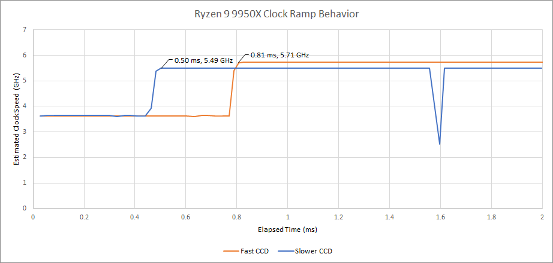

*图 9：两颗 CCD 的 Core 都能在不足 1 ms 内到达最高 Boost。最大频率相比 7950X 变化很小，Zen 5 的提升不能主要归功于频率。*

## 两组四宽译码器：关掉 SMT 也不能合并给单线程

Zen 5 采用 8-wide Decoder，但组织成两个 4-wide Cluster。这是 AMD 第一代 Clustered Decode。与 Intel E-Core 不同，一个线程似乎无法同时使用两组 Decoder。

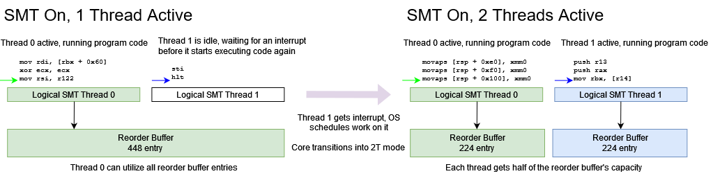

*图 10：1T/2T 转换需要重新分配大量资源。图中 ROB 在双线程时静态分区；例如第二线程启动前，第一线程的 ROB 占用需要降到 224 项或更低。图示来自公开资料与测试整理，并不意味着所有结构都以同一方式分区。*

AMD 对 Zen 1 的 Optimization Guide 已提醒，1T 与 2T 互换代价较高，软件应减少这种转换。操作系统又不能为了等待资源释放而长时间不调度第二线程。由此产生一个问题：若 BIOS 从未初始化第二个 SMT Thread，Decoder Cluster 能否合并给单线程？实测答案仍是否定的。

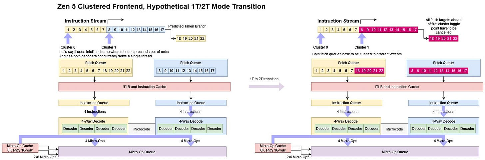

*图 11：结构上是两套四宽 Decoder，而不是单一八宽阵列。Cluster 与 SMT Thread 的绑定是测试观察支持的解释，具体 Transition/Tagging 逻辑没有 RTL 或 AMD 说明确认。*

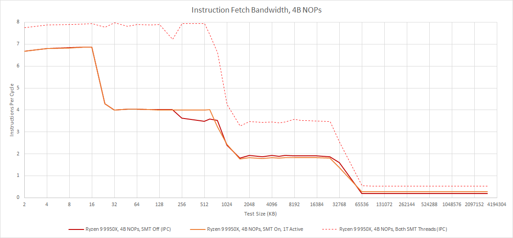

*图 12：关闭 SMT 与开启 SMT 但只运行一个线程时，前端带宽相同；代码溢出 Micro-op Cache 后，单线程为每周期 4 条 4-byte NOP。*

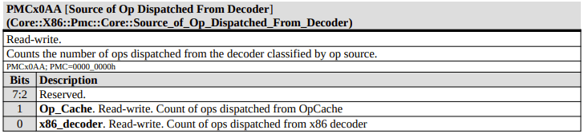

*图 13：两个 SMT Thread 同时运行后，总吞吐可达每周期 8 条 4-byte NOP，说明两组 Decoder 可以分别服务两个线程，却没有在单线程模式合并。*

性能计数器可区分送入 Backend 的 Micro-op 来自 Op Cache 还是 x86 Decoder。参考测试确认事件行为符合预期；多种应用里，单线程多数时间由较大的 Op Cache 供给，且很少逼近 4 IPC。

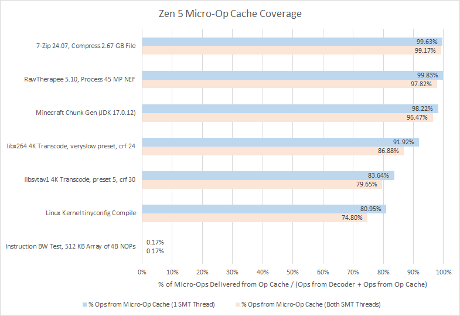

*图 14：英文正式图注说明，这组 Instruction-bandwidth Test 用来确认 PMU Event 统计的是预期来源。*

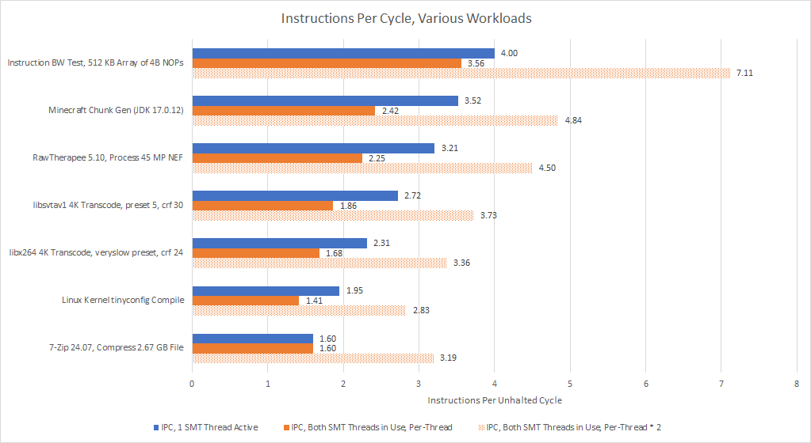

*图 15：单线程很少撞上 4 IPC；不少低 IPC 工作负载更受依赖或存储延迟限制。两个 SMT Thread 则更常让每 Core 合计 IPC 超过 4，但 Zen 5 缺少“任一线程活跃周期”事件，只能由每线程 IPC 加倍作上界估计。*

较合理的解释有三点：双线程竞争会降低 Op Cache Hit Rate，此时更需要 Decoder；双线程也更容易增加可执行并行度；把每个线程锁定到一个 Decode Cluster，可能简化 1T/2T 切换，并免去 Cluster Queue 的 Thread ID Tag。但这些都是根据行为提出的假说，只有 AMD 能确认设计原因。

Intel E-Core 无 SMT、也无 Op Cache，Clustered Decoder 是单线程主要供给路径；Zen 5 则把 Op Cache 作为主路径，两组 Decoder 主要提升 SMT 时的供给。结构外形相似，所解决的问题并不相同。

### 体系结构视角：前端“八宽”不能脱离供给路径谈

Decoder Width、Op Cache Width、Rename Width 与单线程可用宽度不是同一个数。若 Op Cache Hit 高，四宽 Legacy Decode 未必限制 IPC；一旦两个线程互相挤压 Op Cache，两组 Decoder 的总吞吐才更有价值。验证时应同时看 Op-cache/Decoder Delivery、Frontend Empty Cycles、每线程 Active Cycles 和 Retired IPC，而不能只以“8-wide”推导单线程性能。

## Cache：48 KB L1D 与极高带宽

桌面 Zen 5 大体继承 Zen 4 Cache Hierarchy，但 L1D 增大 50%，移动版缩减的 L3 在桌面恢复为每 CCD 32 MB。更低 DRAM 延迟叠加低延迟 L3，让 Granite Ridge 的 Memory Subsystem 明显强于 Strix Point。

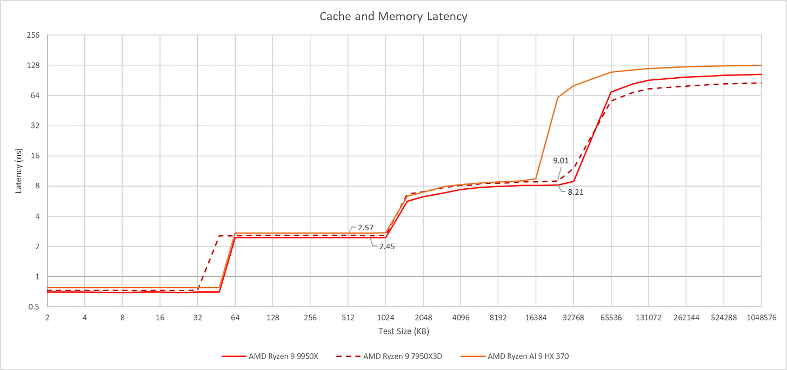

*图 16：核心侧主要变化是更大的 L1D；共享 L3 仍保留桌面 Zen 的 32 MB/CCD。图中容量、位宽与延迟来自资料和微基准汇总，并非 RTL 图。*

桌面 Zen 5 每周期可做两次 512-bit Vector Load，Zen 4 与移动 Zen 5 只有一次。Golden Cove 曾达到 2×512 bit；后续 Intel 桌面产品关闭 AVX-512，Redwood Cove 仍凭三次 256-bit Load 保持高带宽，而桌面 Zen 5 在这里继续向前。

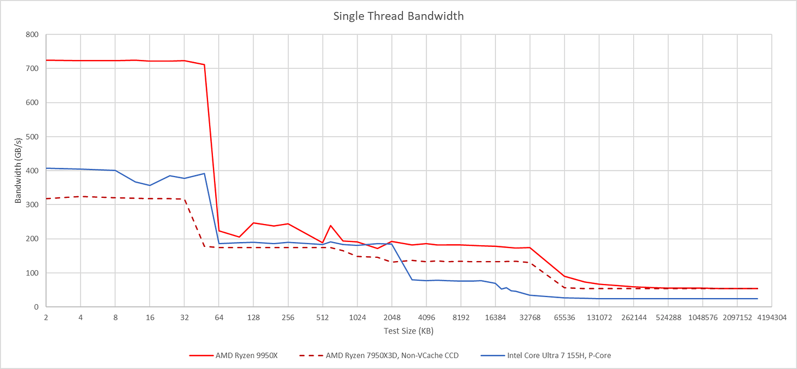

*图 17：两条 512-bit Load Path 让单核 L1D Read Bandwidth 大幅上升。该峰值是特定 Vector Microbenchmark 的稳态吞吐，不等于应用持续获得同样带宽。*

*图 18：单 Core 已接近饱和 32 B/cycle 的 L3 Interface，说明 Core-to-L3 Path 与共享阵列带宽都足以支撑较强单线程访问流。*

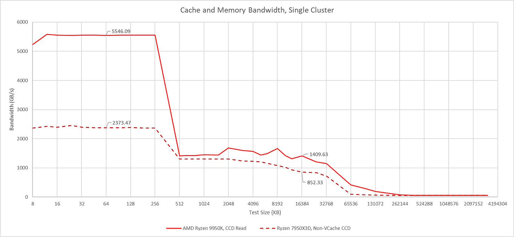

*图 19：八核加载时，Zen 5 L3 达约 1.4 TB/s，明显高于 Zen 4 的 852.3 GB/s。这里测的是片上 Shared Cache Traffic，不是 DRAM 带宽。*

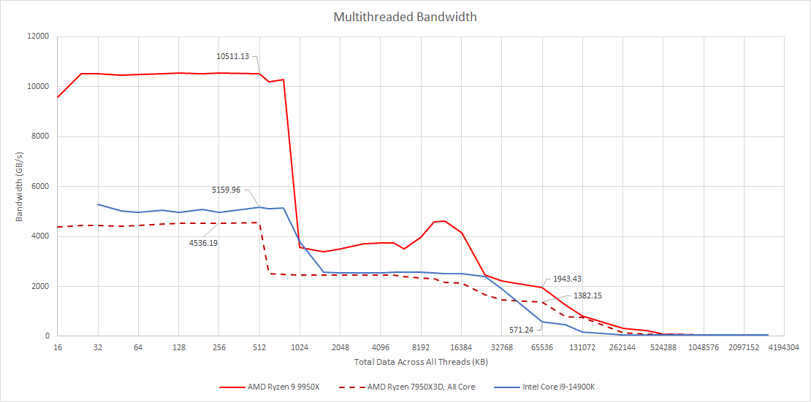

*图 20：16 核同时加载时，L1D Aggregate 超过 10 TB/s，远高于 Core i9-14900K；后者虽有 24 核，其中 16 核是 Cache Bandwidth 较低的 Gracemont E-Core。*

### 体系结构视角：带宽是端口、Bank 和并发共同给出的

L1 峰值主要验证 Load Pipe/Port；L3 峰值还依赖 Miss 并发、Fill Path、Bank Interleave 和共享仲裁。单核饱和 Interface 不代表八核能线性放大，八核 1.4 TB/s 也不能换算成 DRAM 能力。应用是否受益取决于 Vectorization、Working Set、Bank Conflict 与依赖链。

## AVX-512：桌面版采用更完整的 512-bit 实现

AMD 过去对新 Vector Extension 较保守：Athlon 长期把 128-bit SSE 拆成两个 64-bit Micro-op，Zen 2 到 2019 年才采用原生 256 bit。Zen 4 已把多数 512-bit Operation 做成一个 Micro-op，Store 是重要例外。

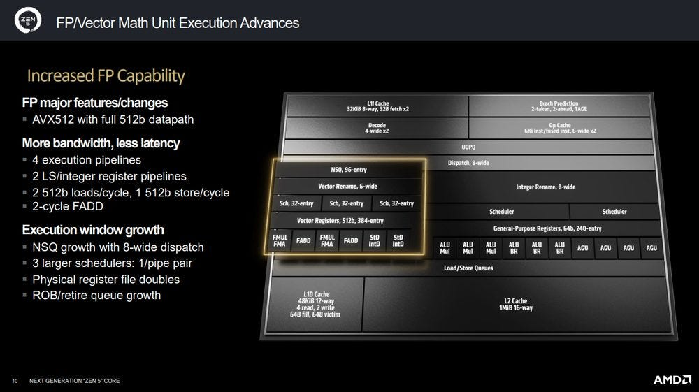

*图 21：从拆分执行到原生宽度，向量宽度同时牵动 Register File、Scheduler、Bypass、Execution Unit、Load/Store Path 和功耗，不只是增加 ISA Decoder。*

Zen 5 进一步分成 Desktop 与 Mobile 两套物理取舍。桌面版所有 Vector Register File Entry 都是 512 bit，FP Unit 为完整 512-bit，FP Add Latency 从 Zen 4/移动 Zen 5 的 3 cycle 降到 2 cycle，L1D 支持 2×512-bit Load/cycle；Mask Register File 也可能多几项，但这一点仍是推测。

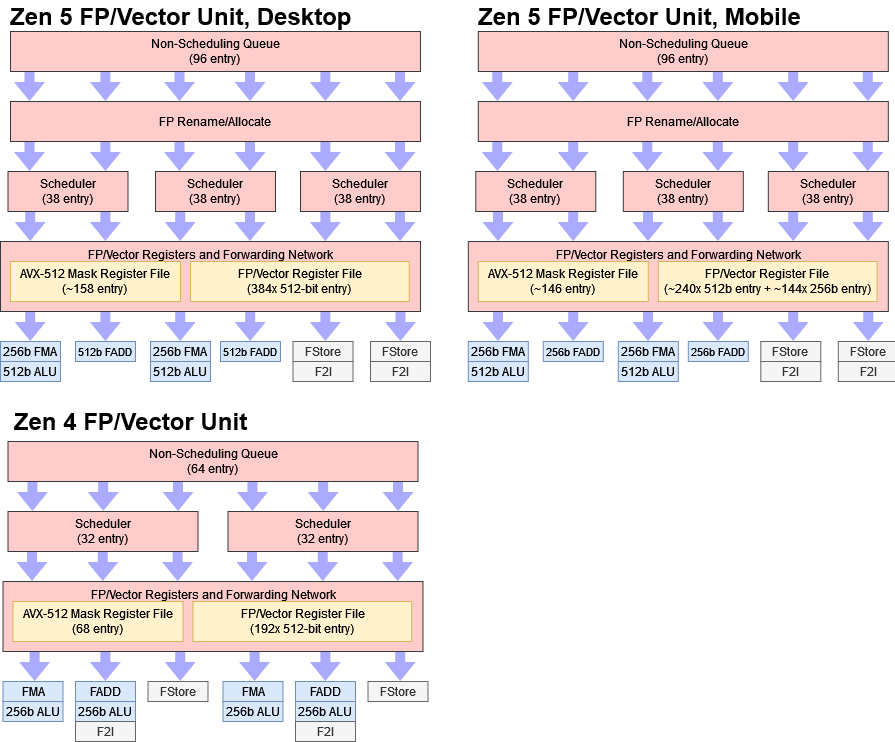

*图 22：Desktop 追求吞吐，Mobile 控制面积和功耗。不能把 9950X 的完整 512-bit 资源直接套到 Strix Point。*

另一个关键优化是把 Vector Rename 放到 Non-scheduling Queue（NSQ）之后。NSQ 中的操作尚不能参与调度，也无需提前占用 Vector Physical Register；依赖它们的操作同样不能执行。配合翻倍的 Vector Register File，Backend 可容纳 96 个尚未分配 Vector Register 的 FP/Vector Operation，几乎消除了 Zen 4 常见的 FP Register Capacity Dispatch Stall。

Store Queue 改进更有限：Entry 仍为 256 bit，512-bit Store 占两项，也会 Decode 成两个 Micro-op。AMD 在此前 Hot Chips 表示改成 512-bit Entry 成本太高。Zen 5 的补偿方式是把 Store Queue 从 64 增至 104 项，并让同一 Cache Line 上连续 Store 可共用一个 Entry；这能节约普通写入占用，为 512-bit Store 留出容量。

Daniel Lemire 的 Integer-to-string 测试同时提供 AVX-512 与 Table Lookup 版本，可用于检查 ISA 扩展收益。

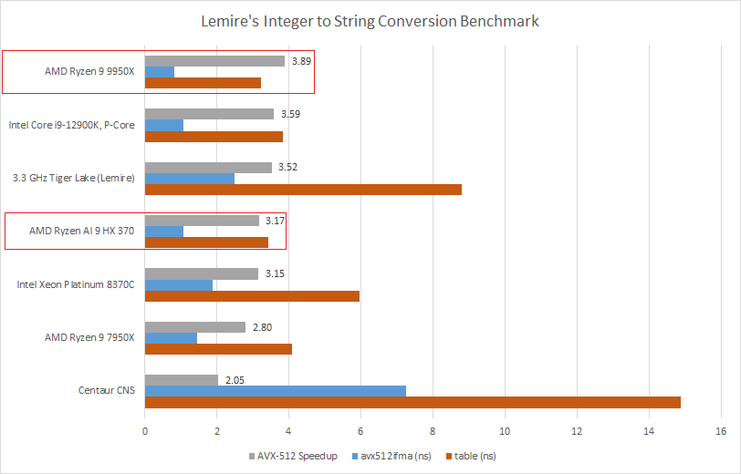

*图 23：桌面 Zen 5 的加速比与 Absolute Performance 都优于移动版，甚至优于启用 AVX-512 的 Golden Cove；移动版大致接近当年实现很强的 Ice Lake，说明较保守方案仍合理。*

### 体系结构视角：晚分配把稀缺物理资源留给“已接近执行”的指令

Rename 通常尽早为目的寄存器分配 Physical Register，便于建立依赖，但会让等待很久的指令占住昂贵阵列。把 Vector Rename 推迟到 NSQ 之后，相当于用便宜 Queue Capacity 换昂贵 RF Capacity。资源满时，前者只让后续 Vector Operation 等待；若直接耗尽 PRF，则会从 Rename/Dispatch 处反压整个前端。代价是控制、异常恢复与依赖映射更复杂，需要跟踪 Micro-op 何时获得最终物理目的寄存器。

## 两个实际负载：不要只看“核心利用率百分比”

测试只加载一颗 CCD，每 Core 一个 SMT Thread；9950X 选较高频 CCD，7950X3D 同时检查普通和 V-Cache CCD。频率没有锁定，两颗 CPU 均为 Stock Boost。结果包含 Frequency、Memory、Cache 和 Core Architecture 的共同影响。

### libx264

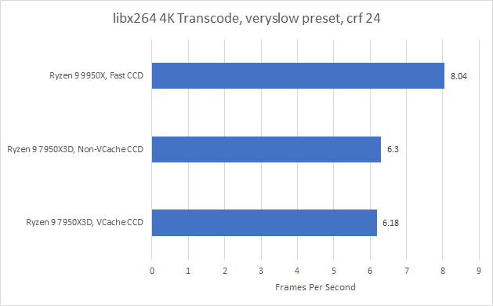

*图 24：Zen 5 相对普通 Zen 4 提升 27.6%。libx264 使用 AVX-512、Vector Instruction 较多，因此不能把这个数字当成所有应用平均值。*

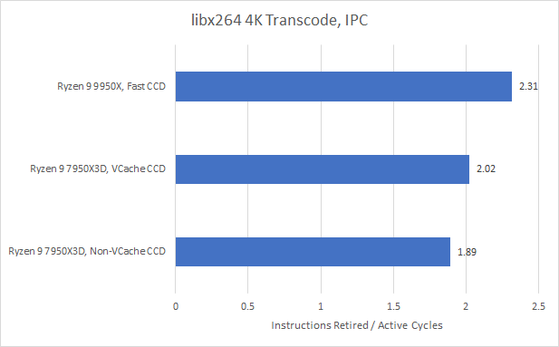

*图 25：相对普通 Zen 4，IPC 提升 22.2%，高于 AMD 宣称的 16% Average；相对 V-Cache CCD 只高 14.4%。V-Cache 用更高 Hit Rate 换得更高 IPC，却因 Clock 更低而输掉总性能。*

Zen 4/5 的 PMU 可从 Rename Stage 统计 Pipeline Slot：Retiring 是最终退休指令使用的 Slot；Backend Memory Bound 表示未完成 Load 阻塞退休；Backend Core Bound 表示其他未完成 Operation；Frontend Bandwidth/Latency 分别表示部分/全部 Rename Slot 没收到 Micro-op；Bad Speculation 是曾进入 Rename、最后被取消的 Micro-op。

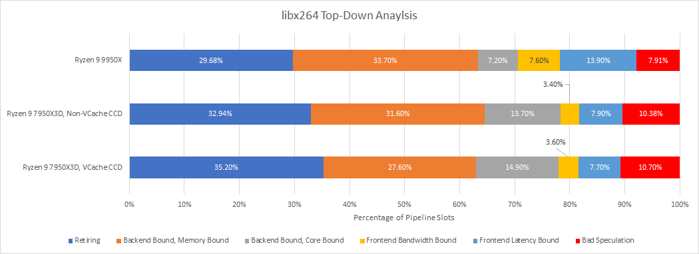

*图 26：libx264 主要受 Backend，尤其 Cache/Memory Latency 限制。按总宽度归一化后，较窄的 Zen 4 看似利用率更高，但更宽结构本来就更难填满。*

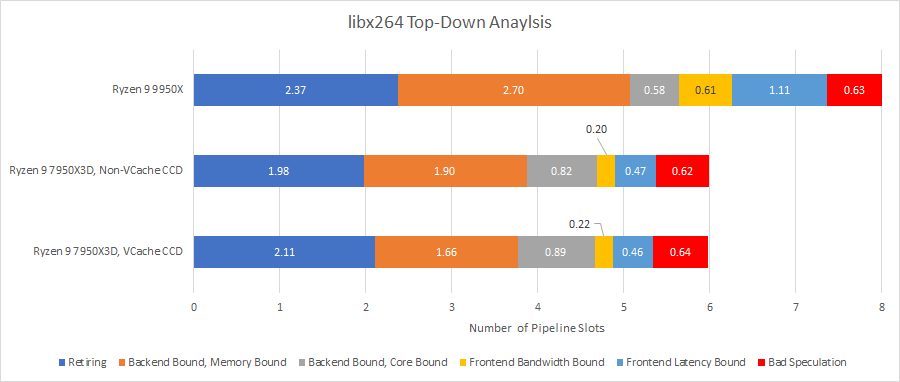

*图 27：改看每周期实际 Slot，Zen 5 退休的工作更多。每 Instruction Micro-op 数也从 Zen 4 的 1.047 降至 1.028；两代绝大多数指令都只对应一个 Micro-op。*

### Backend：ROB 满并非坏消息，整数 RF 才是新短板

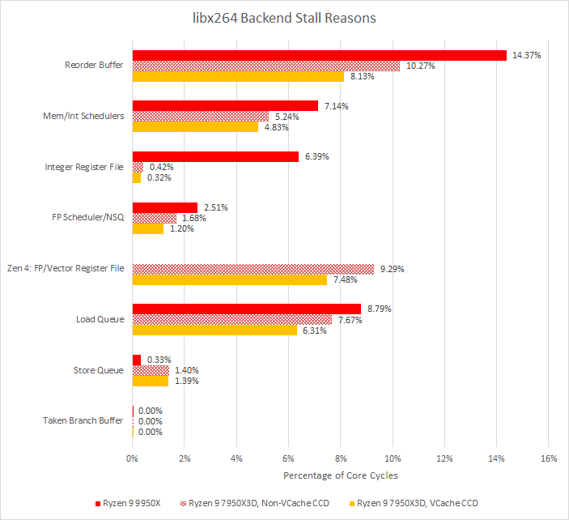

*图 28：Zen 5 最大资源 Stall 是 ROB Full，这通常说明其他 Queue 没有更早卡住全局乱序容量。NSQ 与 Vector RF 改造几乎消除了 FP/Vector Register Shortage；Integer RF 只小幅增大，反而经常先满。*

L1D 容量增加 50% 后，Demand L1D Miss/Instruction 比 Zen 4 降低 12.8%。绝大多数 L1D Miss 能从低层 Cache 满足，但每次 DRAM Access 仍需数百 Cycle。

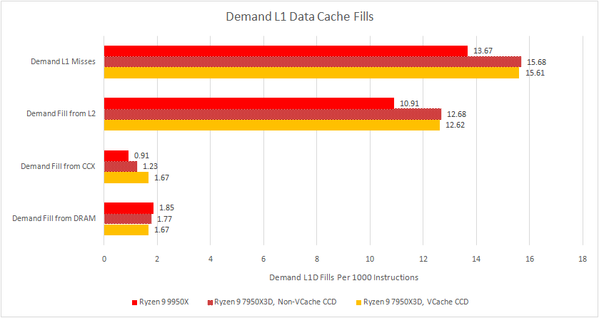

*图 29：英文正式图注说明，Demand 表示由指令发起的访问，而不是 Prefetch。容量增长降低 Miss，却不能让 DRAM 从性能模型中消失。*

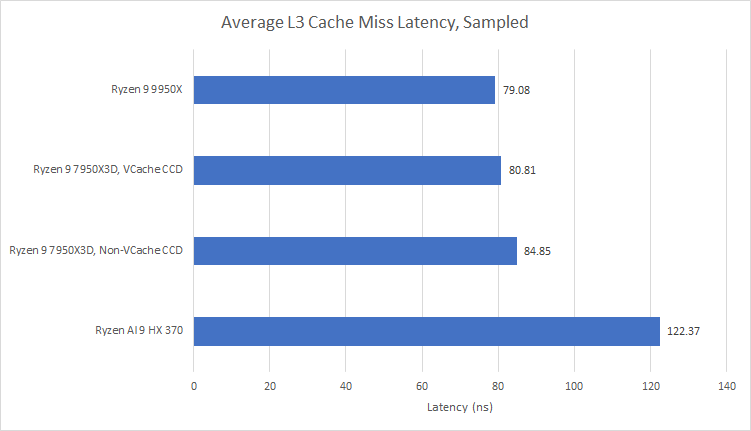

*图 30：PMU 从 L3 Miss 点开始计时，不含检查上层 Cache 的时间；给结果加上 L3 Hit Latency 后，才较接近软件看到的端到端延迟。平均值明显低于 100 ns，说明没有逼近带宽饱和区。*

此时 Strix Point 的 32 B/cycle Write Link 和更高 LPDDR5 Bandwidth 没有发挥优势，LPDDR5 更高的基础延迟反而更重要。Zen 5 测试机更快的 DDR5-6000 也帮助了结果；V-Cache Zen 4 略落后，可能因为更高 Hit Rate 降低了带宽压力。

### Frontend：主要损失来自延迟，而非纯带宽

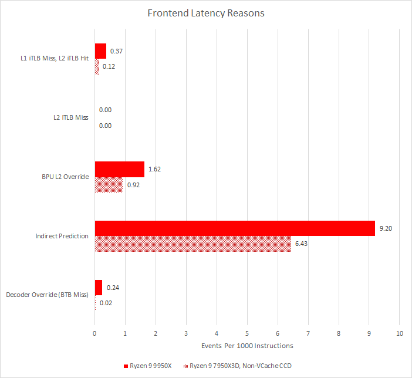

*图 31：L1I/iTLB Miss 较少，Frontend Latency 是主要损失，Branch Predictor 的多级响应很可能贡献大量 Bubble。这里只能从计数器分类推测来源。*

巨大 BTB 几乎消除了 Decoder 发现 Branch 后才 Redirect 的情况，但第二级 Branch Predictor 或 Indirect Predictor Override 仍多。以往 Zen 的 Indirect Prediction 具有 L2 BTB Latency；Zen 5 的确切时序未知，若保持类似路径，就能解释一部分 Frontend Bubble。

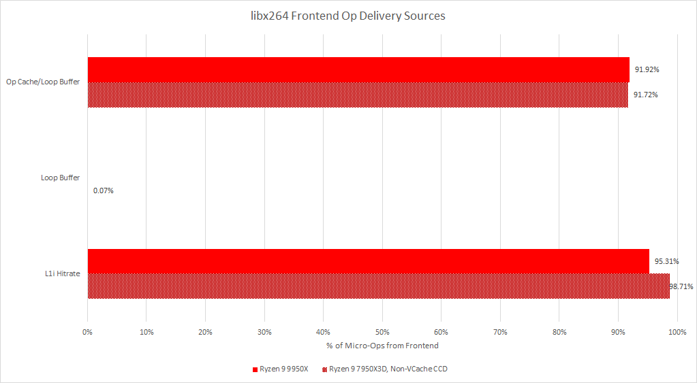

*图 32：Zen 5 将 Op Cache 从 6.75K 缩至 6K Entry、Associativity 从 8-way 增至 16-way，Hit Rate 基本不变；144-entry Loop Buffer 被删除，因为 Op Cache 已有足够带宽，而 Loop Buffer 覆盖范围有限。*

### Linux tinyconfig 编译

使用最小化 tinyconfig 构建 Linux Kernel，以减少 System-specific Option；与 libx264 不同，它不重度使用 Vector Unit。网页没有给出 Kernel Version、Compiler/Flags、Job Count 和重复统计。

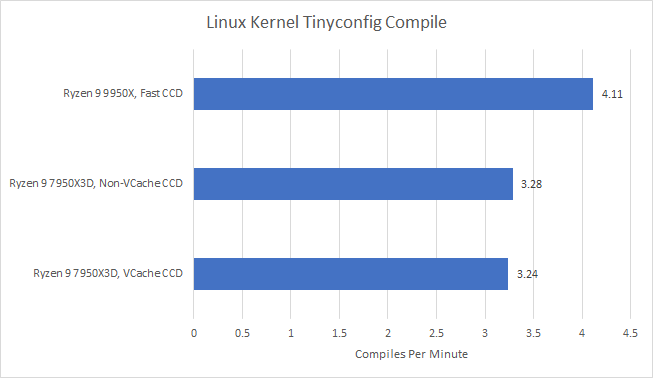

*图 33：Zen 5 比两类 Zen 4 CCD 快 25%～27%。这是整颗 CCD、Stock Boost 和未匹配内存下的工作负载结果。*

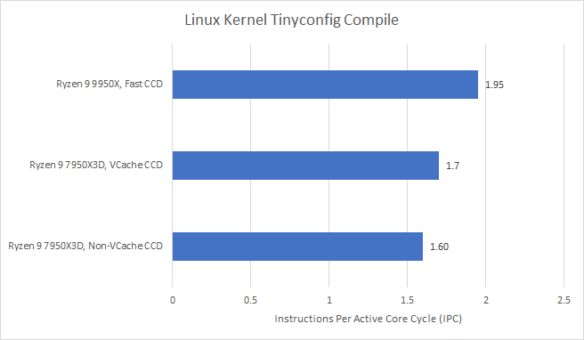

*图 34：相对 V-Cache/普通 Zen 4，IPC 分别高 14.7%/21.8%。V-Cache 的 IPC 较高仍不足以抵消低 Clock，再次说明 IPC 不是最终性能。*

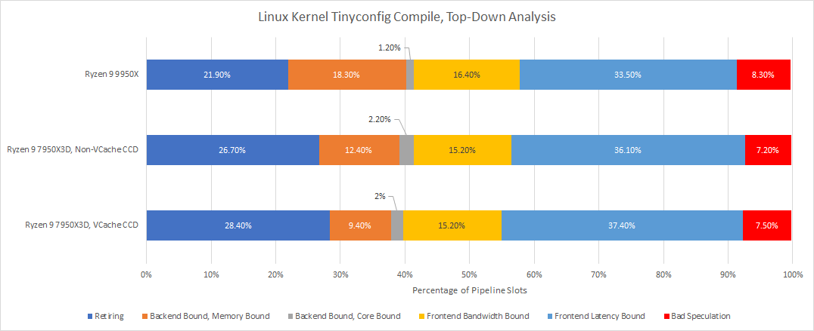

*图 35：最大损失来自 Frontend Latency，其次还有 Frontend Bandwidth 与 Backend Memory Latency。*

*图 36：不按 Width 归一化后，Zen 5 仍能每周期使用更多 Slot；“占宽度百分比更低”不等于完成工作更少。*

Zen 5 Branch Predictor 略更准，却因可以沿预测路径走得更远，损失到 Bad Speculation 的 Slot 反而更多。预测准确率必须与 Speculation Depth、Recovery Latency 和每次错误浪费的工作共同理解。

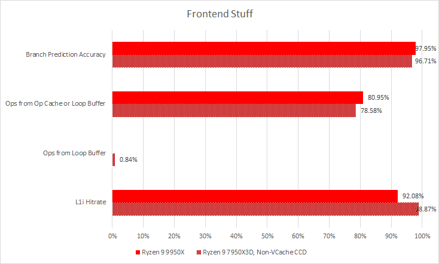

*图 37：16K-entry L1 BTB 使 Zen 5 遭遇 L2 BTB Latency 的频率约为 Zen 4 的四分之一；L2 BTB 额外 8K Entry 又让 Decoder Override 减半以上。巨大容量看似过度，却切实减少晚 Redirect。*

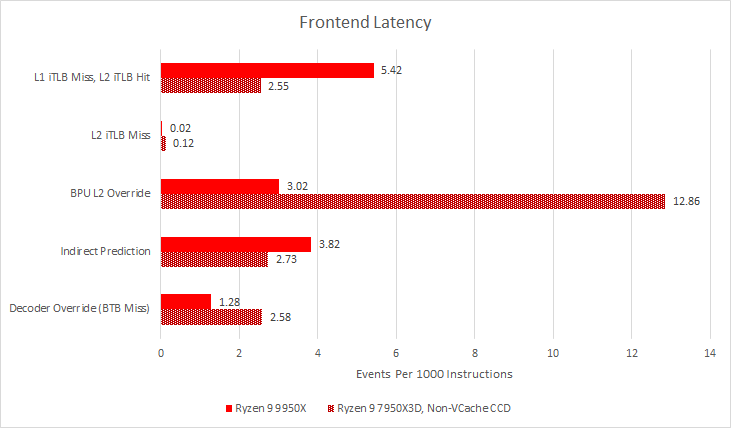

*图 38：Hit Rate 低于 libx264，但 Op Cache 仍是主要供给来源，并略优于 Zen 4。更高 Associativity 抵消了容量缩减。*

更大的 L2 iTLB 也减少昂贵 Page Walk。Backend 方面，Integer RF 又在 ROB 之前更常满；统一程度更高的 Integer/Memory Scheduler 也稍易满。

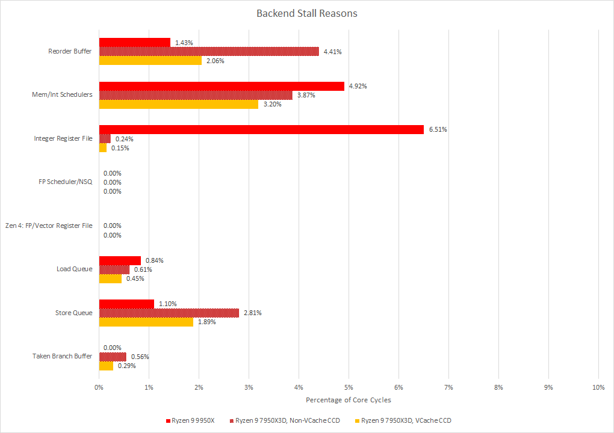

*图 39：Integer Scheduler Full 占 3.6%，AGU Scheduler 为 1.3%。Zen 4 最多可让 ALU 使用 96 个 Scheduler Entry，Zen 5 Integer Scheduler 只有 88 项，这个工作负载下前者的配比可能更合适。Taken Branch Buffer 从 62 增至 96 项后，基本不再形成 Stall。*

### 体系结构视角：Top-down 必须同时看比例和绝对 Slot

更宽核心若退休相同工作，利用率百分比必然下降；若只看百分比，会把新增宽度误判成倒退。Absolute Slot 回答“每周期完成多少工作”，百分比回答“投入的宽度有多少空置”。ROB Full 也不是自动的坏消息：当它是最早满的资源，通常说明 RF、Scheduler、LSQ 配比没有更早截断全局 Window；当某个局部阵列频繁先满，才说明资源不均衡。

## 对 Zen 5 核心的评价：资源升级有效，延迟仍是主问题

两个负载说明 AMD 对 Zen 4 的限制判断大体准确：FP RF、Store Queue、BTB 和 L2 iTLB 都得到针对性增强。资源瓶颈不会消失，只会转移；在 Zen 5 上，Integer RF 成为常见的下一处限制。

从 Top-down 看，最大的图景仍与 Zen 4 类似：Frontend 和 Backend Memory Latency 比纯 Core Throughput 更关键。Zen 5 更少 Core Bound、Frontend Bandwidth 更高，但两者原本就不是最大问题。性能增长很可能更多来自较低内存延迟与更大乱序容量，而不只是 Pipeline 变宽。

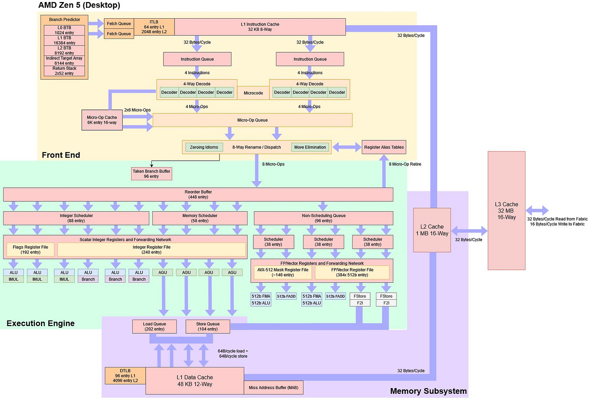

*图 40：AMD 在快速迭代中同时维护 Performance-optimized 实现，并显著增强 AVX-512、Cache 和 Window。*

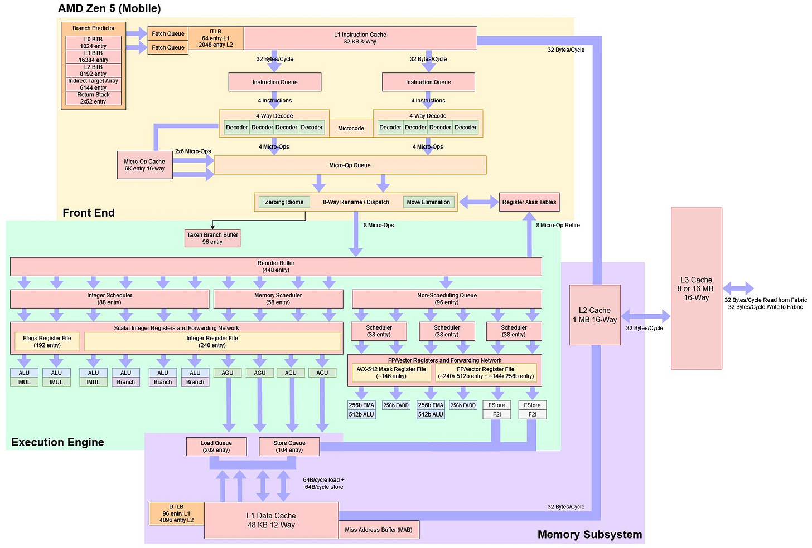

*图 41：同一核心还具有 Density-optimized 实现。再加桌面/移动两套 FP/Vector 配置，Physical Design、验证和 PPA 调优工作量很大。*

AMD 自 Golden Cove 于 2021 年发布后已经推出 Zen 4 和 Zen 5，二者都有显著结构变化。Intel 的 Raptor Cove 主要在 Golden Cove 上增频、加 Cache；Redwood Cove 有更积极 Prefetch、更大 Micro-op Queue 和翻倍 L1I，但主要结构变化较少。Zen 5 则在曾由 Intel 占优的 AVX-512 等方面表现突出。

代价也很清楚：Integer RF 还不够大；Clock 提升有限；第一代 Clustered Decode 无法让两组 Decoder 合力服务单线程；更宽 Pipeline 的很多潜力仍被 Memory 与 Frontend Latency 吃掉。File Compression 同样高度 Latency-bound，Branch Predictor 也面对更棘手的控制流。

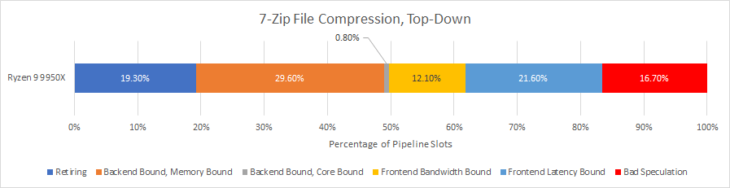

*图 42：英文正式图注指出，File Compression 也严重受延迟限制，同时给 Branch Predictor 带来困难。它强化了文章的中心判断：更宽不是自动兑现的性能。*

部分妥协在现实中影响有限。高 Op Cache Hit Rate 和其他先出现的瓶颈，使单线程四宽 Decode 多数时候不成为首要限制；频率提升小，但功耗下降；搭配更快内存时，9950X 可在生产力负载中明显超过 7950X3D。Zen 5 是坚实基础，后续若 V-Cache 版本能从 32 MB 增至 96 MB 又不明显降频，减少 Memory-latency Slot Loss 的收益可能很大。

### 体系结构视角：从桌面 Zen 5 可以看到的七件事

第一，核心宽度只提供上限，延迟决定兑现率。Zen 5 增加 Slot，却仍被 Branch Response 与 Memory Access 拉出大量空洞。

第二，桌面与移动核心可以共享 Architecture、采用不同 Physical Resource。完整 512-bit Unit 与较保守的移动实现都可能是各自功耗区间的正确答案。

第三，晚分配是一种资源虚拟化。把 Vector Rename 放到 NSQ 后，用 Queue Entry 承接等待，避免昂贵 Vector RF 被尚不能执行的操作占满。

第四，SMT 影响的不只是 Backend Sharing。两个 Thread 同时降低 Op Cache Hit Rate，也让两组 Decoder 的总带宽更有价值；前端必须作为多条供给路径分析。

第五，BTB 更大既改善 Coverage，也可能让每次错误更昂贵。Zen 5 Predictor 略准却浪费更多 Bad-speculation Slot，说明 Accuracy、Lookahead 与 Recovery 必须一起评价。

第六，资源平衡比单项做大更难。FP RF 问题缓解后，Integer RF 和 Scheduler 成为新瓶颈；优化永远是在功耗、面积和下一个限制之间移动边界。

第七，Chiplet 的局部性已经进入桌面调度问题。同 CCD Cache Transfer 很快，跨 CCD 近 200 ns；通信线程放置、Memory Allocation 与 Working Set Partition 会直接改变表现。

## 参考资料

- Chips and Cheese：[*AMD’s Ryzen 9950X: Zen 5 on Desktop*](https://chipsandcheese.com/p/amds-ryzen-9950x-zen-5-on-desktop)
- AMD：Software Optimization Guide for AMD Family 17h Processors（正文援引 1T/2T 转换建议）
- Daniel Lemire：Integer-to-string AVX-512 Implementation（正文 Benchmark 来源）

感谢 Chips and Cheese 的 Patreon、PayPal 支持者与 Discord 社区。网页末尾也感谢 AMD 在发布前提供 Zen 5 Sample。
