# Ryzen Z1：AMD 的温和混合核心策略

> 英文标题：AMD’s Mild Hybrid Strategy: Ryzen Z1 in ASUS’s ROG Ally
> 撰文：Chester Lam
> 首发：Chips and Cheese，2024 年 2 月 12 日
> 链接：https://chipsandcheese.com/p/amds-mild-hybrid-strategy-ryzen-z1-in-asuss-rog-ally

> 测试样机由 ASUS 提供。这是 Chips and Cheese 收到的第一台厂商 Review Sample。

Arm big.LITTLE 和 Intel Hybrid 使用不同架构核心；AMD 更谨慎。7950X3D 混合不同 L3 配置，Ryzen Z1 则把两个高频 Zen 4 与四个密度优化 Zen 4c 放在一起。Zen 4c 在架构功能上与 Zen 4 相同，只用不同 Physical Design 牺牲最高频率换小面积。

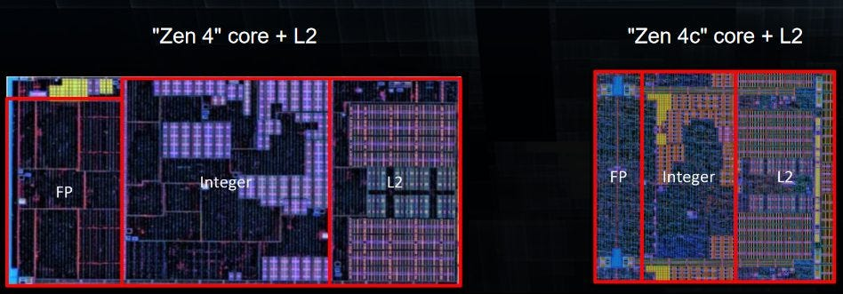

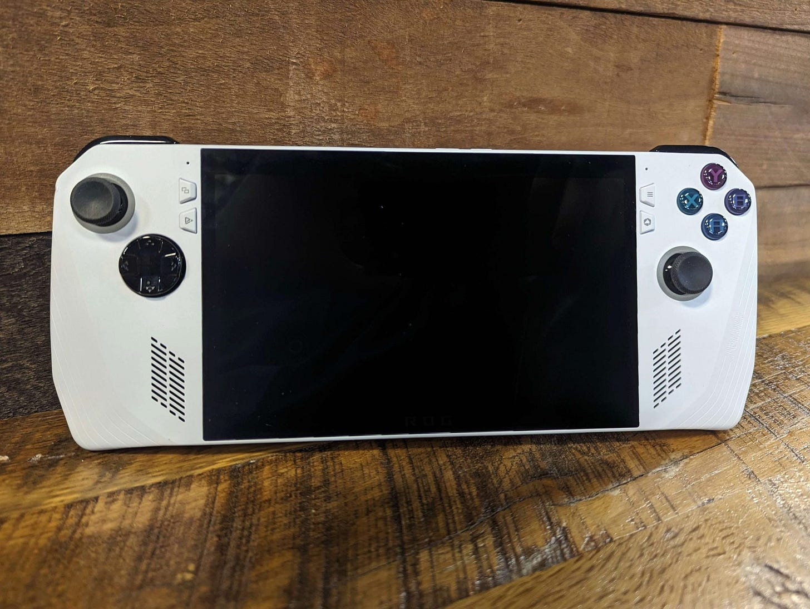

## Clock：1.5 ms 内到顶

Zen 4 最高 5 GHz，Zen 4c 最高 3.55 GHz。ASUS 策略很积极，两类 Core 均在略超 1.5 ms 内达到 Max Clock。

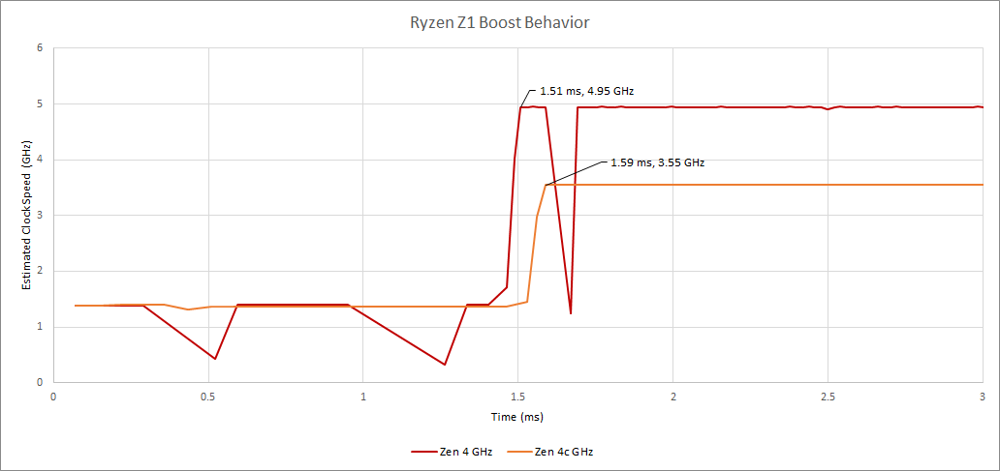

## 相同 Cycle Latency，不同真实时间

两类 Core 的 L1D 都四周期、L2 都 14 周期，支持它们共享同一微架构。

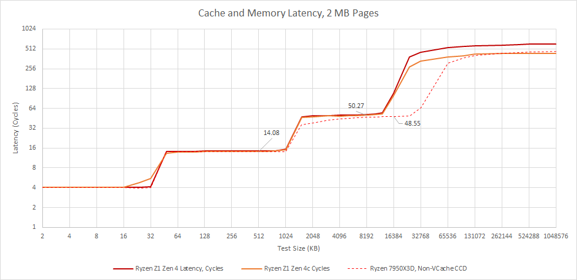

16 MB L3 从两类核看都略高于 50 Cycle，比 32 MB Desktop Zen 4 多 1～2 Cycle。换成 ns，低频 Zen 4c 约 14.16 ns，Zen 4 约 10.46 ns；Desktop 还能更高频。

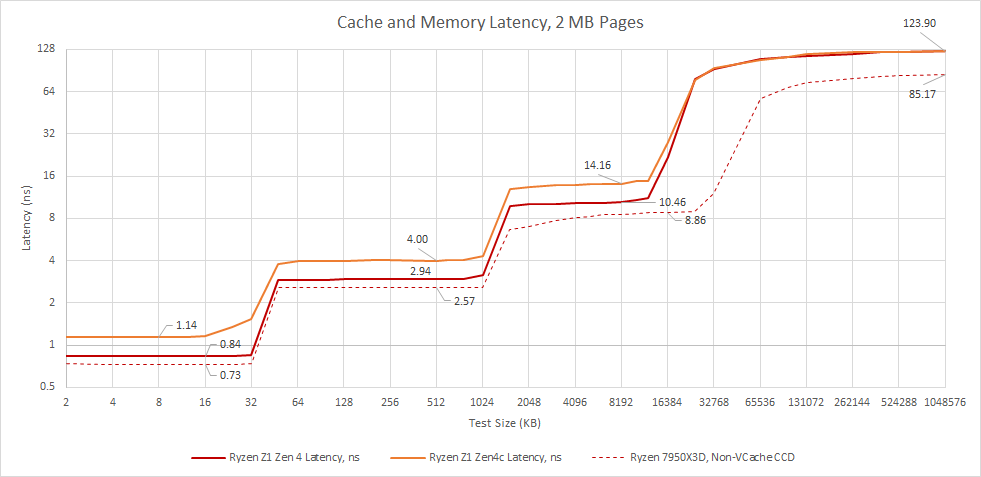

LPDDR5 DRAM 约 123.9 ns，远高于 Desktop DDR5；但比 Van Gogh 155 ns 好。16 MB L3 也显著优于 Van Gogh 4 MB，能更多隔离慢内存。

## 同 Cluster 异频对 L3 的影响

Zen L3 跟最快 Core 同频，各 Core 用 Divider 独立降频。Divider 以 1/8 为步进，且因四周期 Data Heads-up FIFO，Core Frequency 必须至少约为 L3 的三分之一；Core/L3 低于 400 MHz 也不支持。过去同 Cluster 核心差距小，Z1 却可能同时有 5 与 3.55 GHz。

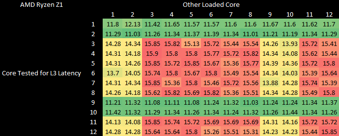

Logical 1/2、9/10 是两个 Zen 4 的 SMT Thread，其余为 Zen 4c。Zen 4 不因 Zen 4c 活跃而增加 L3 延迟；Zen 4c 在 Zen 4 活跃时反而略快，支持 L3 跟最快核频率运行。

Clock 由 Register-to-register Integer Add Latency 推断，Dummy Thread 在观察结束 Flag 的同时统计 Add 数。

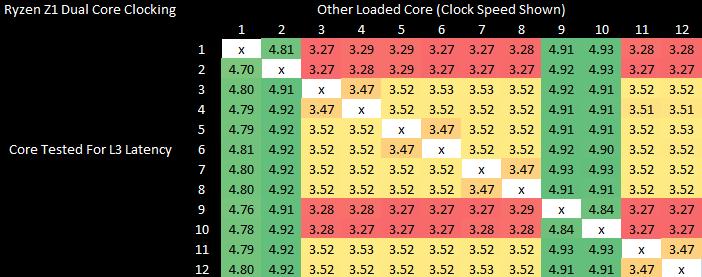

Zen 4 始终到 Max；两颗 Zen 4c 搭配时可到 3.55 GHz，但与 Zen 4 同时活跃时只有 3.3 GHz，可能是 Divider/共享 Clock 约束。

7950X3D 的两个不同 CCD 各有独立 L3，可独立 Clock；同 Die 内近似 Homogeneous，因此 Core Pair 变化很小。

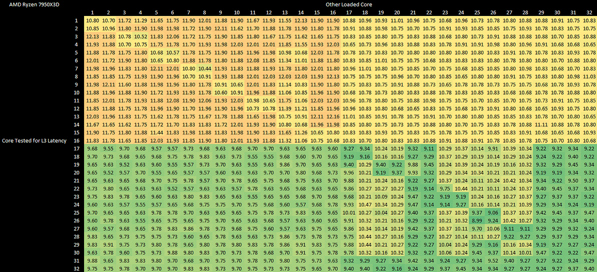

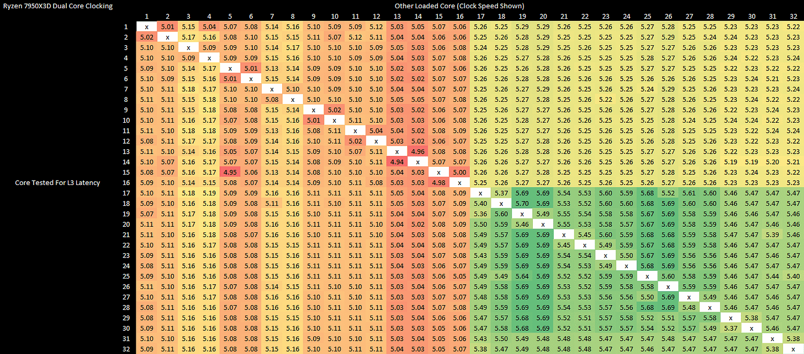

### 体系结构视角：同架构不代表没有调度差异

ISA、Cache Cycle 与优化模型一致，能避免“某类 Core 不支持某扩展”；但绝对 Latency、Single-thread Performance 和 Thermal Headroom 仍不同。Scheduler 把关键线程放 Zen 4，后台吞吐放 Zen 4c，尾部阶段还要重新平衡，才能兑现 Hybrid 收益。

## Cache 与 DRAM Bandwidth

Zen 4c 每拍带宽与 Zen 4 接近：L1 略低于 64 B/cycle，L2 32 B/cycle，L3 26～27 B/cycle。

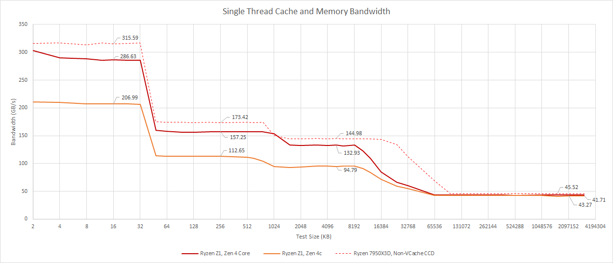

单 Zen 4c 从 DRAM 略超 41 GB/s；Zen 4 稍高，可能仍是 Clock 影响。

两个 Zen 4 单核更强，四个 Zen 4c 总 Cache Bandwidth 更大。

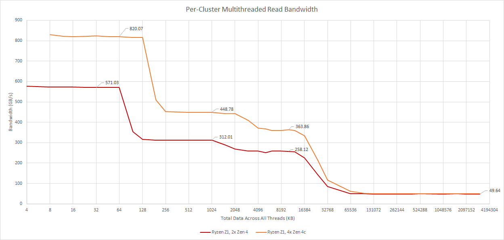

离开 Cache 后两组都约 49 GB/s，已饱和 Memory Controller。

Hybrid Benchmark 容易出现 Long Tail：Big Core Thread 先完成，后半程硬件闲置。测试固定 Thread Affinity，并调整每线程 Iteration，让最快/最慢 Runtime 相差不超过 10%。

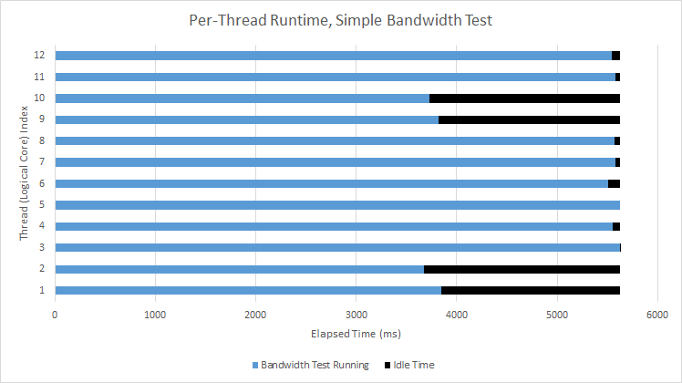

12 KB（每线程 1 KB）时，均分 Iteration 在 5.5 s 内为 1172.6 GB/s，按能力配比为 1329.21 GB/s。

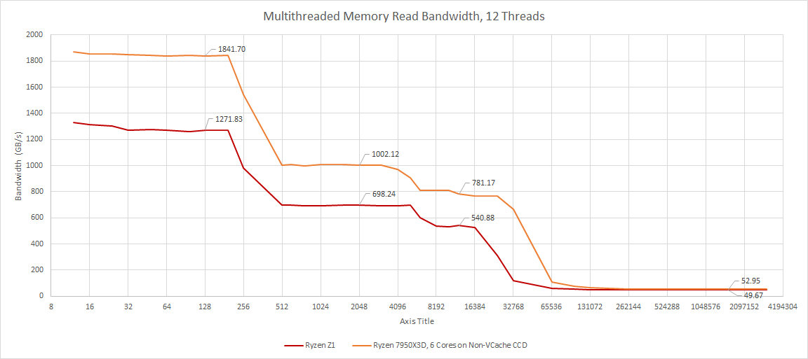

Z1 L1 峰值 1.329 TB/s，随后热降频到略超 1.27 TB/s。按 64 B/cycle 估算，测试末 Zen 4 超 4.3 GHz、Zen 4c 约 2.9 GHz。L2 约 700 GB/s、L3 约 540 GB/s。Desktop 六核靠功耗/散热，L1 高 44.8%，L2/L3 类似；DRAM Bottleneck 后只领先 6.6%。Desktop 为双通道 DDR5-5600，Ally 为 LPDDR5-6400。

## Core-to-Core 与一致性

Atomic Compare-and-swap 测试一个 Core 写 Private Cache、另一个 Core 读最新值的往返。两类核同属一个 L3 Cluster，地址 Home 的 L3 Slice 处理一致性，因此 Core Type 不影响 Atomic Latency。

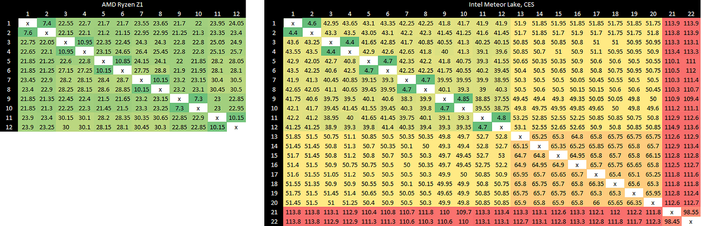

Intel Alder/Meteor Lake 的 E-Core 有额外 Shared Cache 层，Meteor Lake 还有不在 L3 上的另一类 E-Core，多个一致性层级使延迟变化更大。这里比较的是拓扑，不代表所有 Atomic 工作负载排名。

## Vector Throughput

测试同样按线程能力调 Iteration（Qualcomm Mobile OS 噪声大，允许 20% Tail）。Z1 的 FP32 超 1 TFLOP/s，高于 Nintendo Switch Maxwell iGPU；Zen 4/4c 都有四条 Vector Math Pipe。

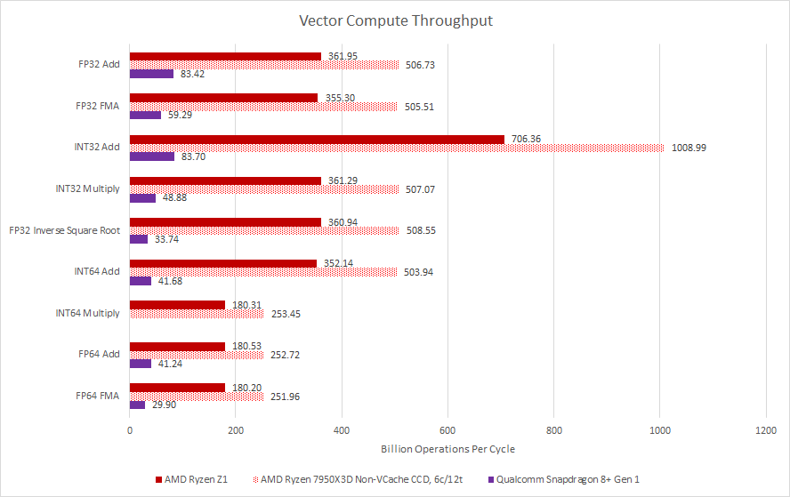

Desktop 高频六核明显更快。Snapdragon 8+ Gen 1 为 1×X2+3×A710+4×A510，A510 成对共享 Vector Unit，A710 Vector 较弱，又受手机被动散热，因而远落后。文章未实现 NEON Packed 64-bit Integer Multiply，因此该项目缺数据。

巨大 Vector 并非掌机必需：Video Encode、Photo Editing、N-body 更受益，Game 通常需求中等。牺牲面积给 Vector 是否合理，要看目标负载。

## 结语：用 Physical Design 做温和 Hybrid

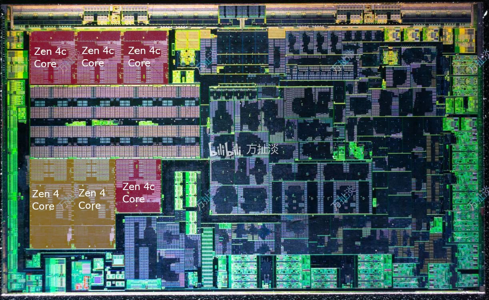

AMD 没有维护两套架构，而是重做 Zen 4 Physical Design。优点是开发/验证投入小，Compiler Optimization 共享，所有 Core 都支持 AVX-512；Intel Hybrid 则因 ISA 不一致关闭 AVX-512。缺点是 Zen 4c 仍沿用四周期 L1D，没利用低频像 Gracemont 那样做三周期路径，优化空间受共同架构约束。

7950X3D 混合 Cache，Z1 混合相同架构的高频/高密度物理实现，其他 Consumer Product 仍大多 Homogeneous。这比 Intel 全线 Hybrid 温和，符合 AMD 工程资源规模。未来 AMD 会否回到 Bobcat/Jaguar 与 Bulldozer 那种双架构路线，仍是开放问题。

## 参考资料

- Chips and Cheese：AMD’s Mild Hybrid Strategy: Ryzen Z1 in ASUS’s ROG Ally
- AMD Zen 4 Processor Programming Reference
- ASUS 提供的 ROG Ally Review Sample
