# 实测 Strix Halo 的 Infinity Cache：32 MB 能替代多少内存带宽

> **文章来源**
>
> - 文章：*Evaluating the Infinity Cache in AMD Strix Halo*
> - 撰文：Chester Lam
> - 首发：Chips and Cheese
> - 发布：2025 年 10 月 22 日
> - 链接：https://chipsandcheese.com/p/evaluating-the-infinity-cache-in

Strix Halo 把 16 颗 Zen 5、20 个 RDNA 3.5 WGP、256-bit LPDDR5X-8000 与 32 MB 内存侧 Cache 放进同一颗移动 SoC。大型 iGPU 天生需要带宽；Infinity Cache（AMD 文档中也称 MALL，Memory Attached Last Level）要做的，是在请求抵达 DRAM 前截住足够多的流量。

这篇测试的难点是 AMD 工具没有直接提供 Infinity Cache 命中率。Chester Lam 通过 Infinity Fabric 的 Coherent Station（CS）与 Unified Memory Controller（UMC）计数器，构造了一个近似观察窗口。测试设备是 ASUS 提供的 32 GB ROG Flow Z13；下文所有“命中率”都应理解为流量代理，而不是硬件直接报告。

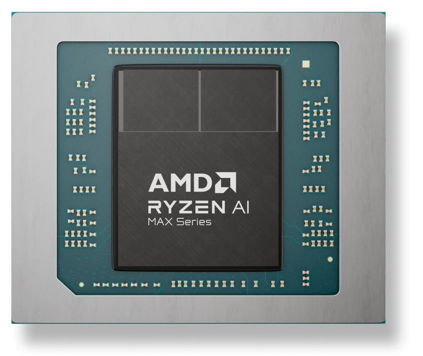

*图 1：32 MB Infinity Cache 与 256 GB/s 理论 LPDDR5X 带宽共同服务大型 iGPU。它既消耗 Die 面积，也降低外部总线和 DRAM 动态能量。*

## 一、怎样从 Fabric 流量估算命中

Infinity Fabric 用统一接口连接 GPU、CPU、NPU、媒体与内存控制器。AMD 的 `DATA_BW` 事件按 8-bit Instance ID 统计 Endpoint 的读写 Data Beat，但没有公布 Strix Halo 的 ID 映射；测试通过逐个制造流量和枚举 ID 建立对应关系。

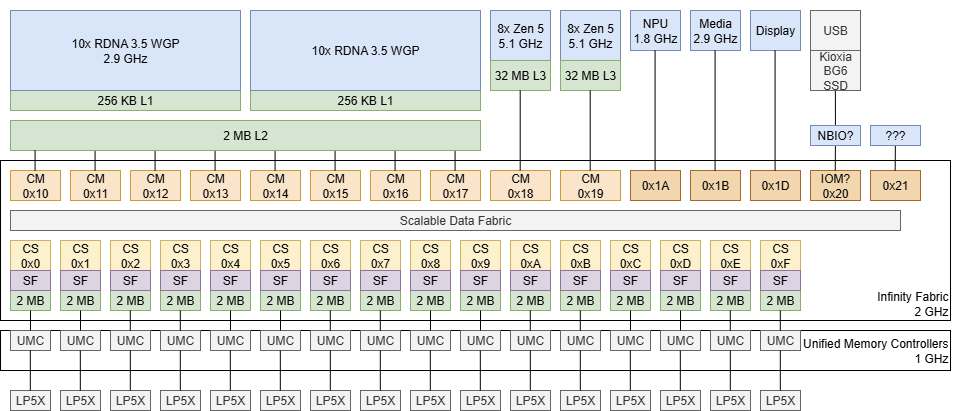

*图 2：16 个 CS/UMC 位于前部，之后是八个 GPU Endpoint、两颗 Zen 5 CCX，再往后是 NPU、媒体、显示与尚未识别的模块。图是基于 PMU 反推，不是 AMD 官方互连平面图。*

CS 位于控制器之前，负责在内存请求可能命中其他 Cache 的修改副本时发起 Probe；若没有，就把请求送到 UMC。Infinity Cache 也放在这一层：CS 有流量而 UMC 没有对应流量，可作为被内存侧 Cache 截住的近似。

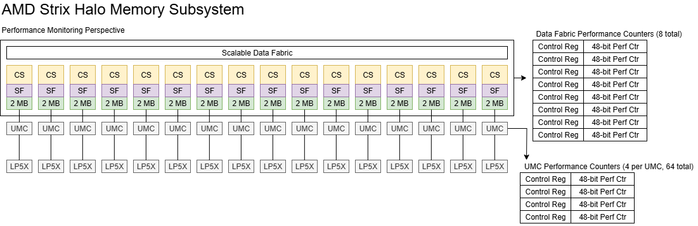

*图 3：用 `CS traffic - UMC traffic` 推算命中直观，却会混入 Snoop 命中、计数粒度和 CPU 请求，因此只能作为 Proxy。*

Strix Halo 只有八个 Fabric 计数器，读写各占一个，所以一次只能监控四个 CS。内存按通道交织，测试把四个 CS 的总量乘四；交织不完全均匀会带来几个百分点误差。UMC 各有四个计数器，可同时覆盖 16 个控制器，这里用 CAS 命令估算 DRAM 数据量。

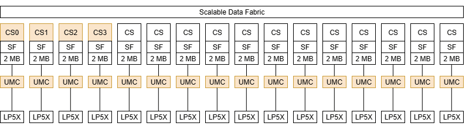

*图 4：除 CAS 外还可观察控制器频率、总线利用率、ACTIVATE 与 PRECHARGE。本文只取足以回答 Cache 是否减轻 DRAM 压力的事件。*

跨 CCX Snoop 命中也会造成“CS 有、UMC 无”，但图形工作负载大多由 GPU 产生，Windows 还经常停放第二颗 CCD，误差预计较小。更显著的是 CPU 请求：Strix Halo 的 Infinity Cache 主要面向 GPU，CPU 访问不会填入，因此若把全部 CS 流量作分母，会低估 GPU 有效命中。

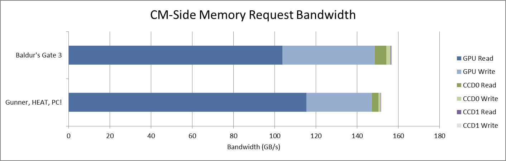

*图 5：GPU 流量占主导，CPU 仍形成不可忽略的误差边界。图中只采两个 GPU Endpoint再乘四，也依赖八个 Endpoint 近似均匀。*

最后，采样工具每秒更新一次。毫秒级尖峰可能被平均，峰值带宽会被低估。作者选择复用已有监控程序，是业余项目时间预算下的现实折中。

### 体系结构视角：用差分计数器推 Cache 命中要满足什么

理想情况下，入口和出口计数必须对同一种事务、同一字节粒度、同一时间窗口计数；中间还不能有压缩、合并、重试或其他 Cache 来源。这里只能近似满足。更严谨的验证应先用可控工作集校准 Data Beat/CAS 换算，再对四组 CS 轮换采样，报告通道方差，并把 CPU、Snoop 和预取流量单独扣除。

## 二、32 MB 是否挡住了 DRAM 瓶颈

测试选择若干图形工作负载，取 DRAM 带宽最高的一秒。总体结论是 32 MB Cache 完成了任务：所有已测负载都没有撞上 LPDDR5X-8000 的 256 GB/s 理论上限。

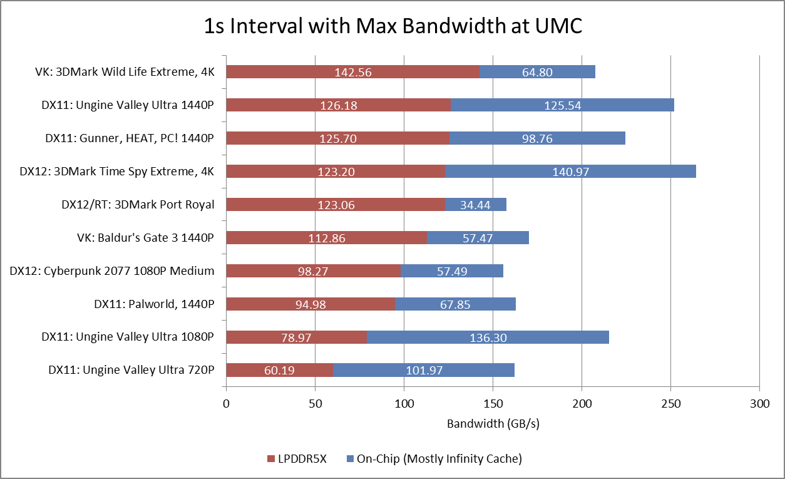

*图 6：红色为 LPDDR5X/UMC，蓝色为片上命中代理。Unigine、3DMark、游戏和计算负载差异很大，不能用一项平均命中率概括。*

从 CS 侧看，有些负载若没有 Cache 会逼近甚至超过 256 GB/s。GHPC 和 Unigine Valley 已进入令人不安的区间；3DMark Time Spy Extreme 则很可能直接受 DRAM 带宽限制。

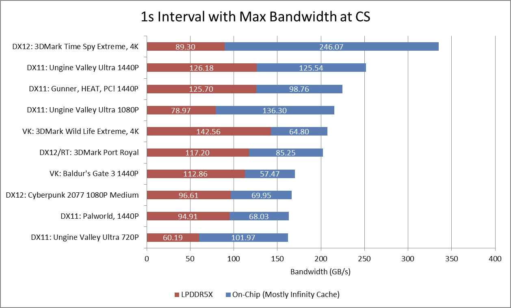

*图 7：Time Spy Extreme 的总需求超过 335 GB/s，说明 GPU 的 2 MB L2 不足以独自保护内存。横条中的片上部分就是 Infinity Cache 的“带宽放大”。*

PS5 使用 256-bit 14 GT/s GDDR6，理论 448 GB/s，没有类似内存侧 Cache。若 Strix Halo 不受移动功耗与大容量 LPDDR 约束，也可考虑 GDDR6；但在 Time Spy Extreme 的峰值区间，Infinity Cache 约截住 73% Fabric 流量，效果相当可观。

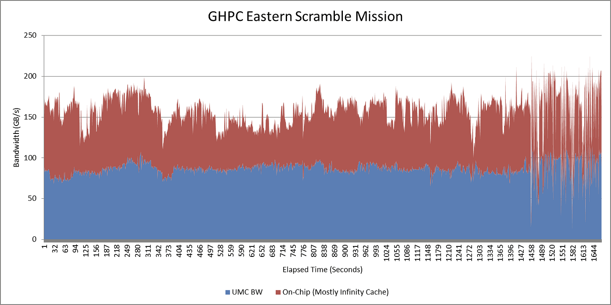

*图 8：命中贡献不是常数，随帧和阶段变化。单个“73%”只能描述特定一秒，不能代表整段运行。*

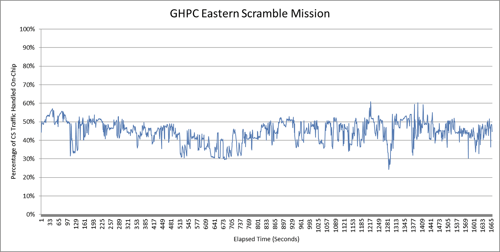

*图 9：命中率在一个工作负载内部也明显波动。Cache 价值更应看它是否把外部带宽压在安全线以下，而不是追求漂亮的平均百分比。*

## 三、分辨率升高以后，Cache 会怎样

Unigine Valley 的数据表明，分辨率升高通常会降低 32 MB Cache 的有效性。

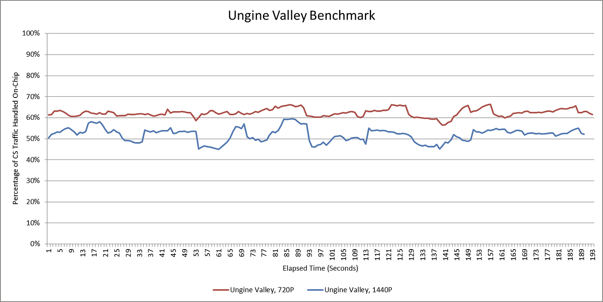

*图 10：720p 到 1440p 的曲线逐步下移。分辨率会放大 Render Target、深度缓冲和纹理工作集，使固定容量更难覆盖。*

AMD 在 Hot Chips 2021 曾展示不同分辨率与 Cache 容量的关系，但实机无法切换物理容量，只能沿分辨率轴观察。

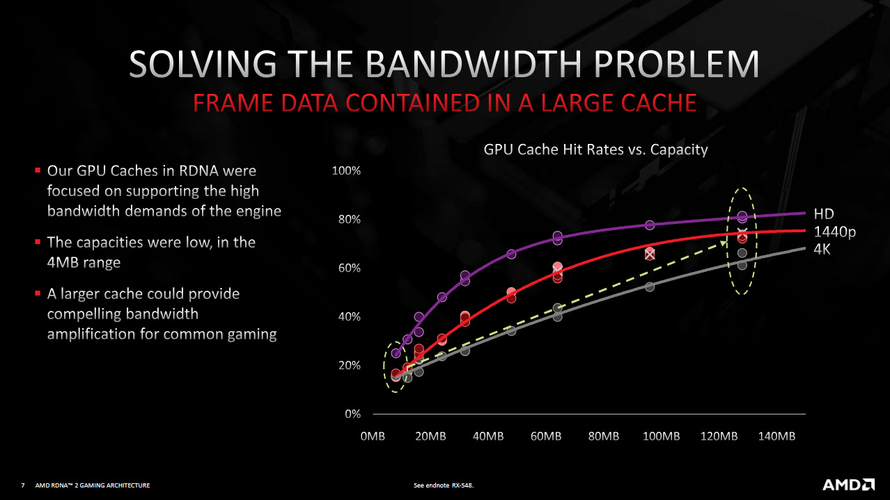

*图 11：更高分辨率需要更大 Cache 才能保持命中。它是厂商通用趋势图，不是 Strix Halo 32 MB 的实测曲线。*

Unigine Superposition 可强制从 720p 一直到 8K。合理分辨率下，32 MB 仍提供良好带宽放大；极端分辨率下虽然还能拦截流量，效率已显著下降。

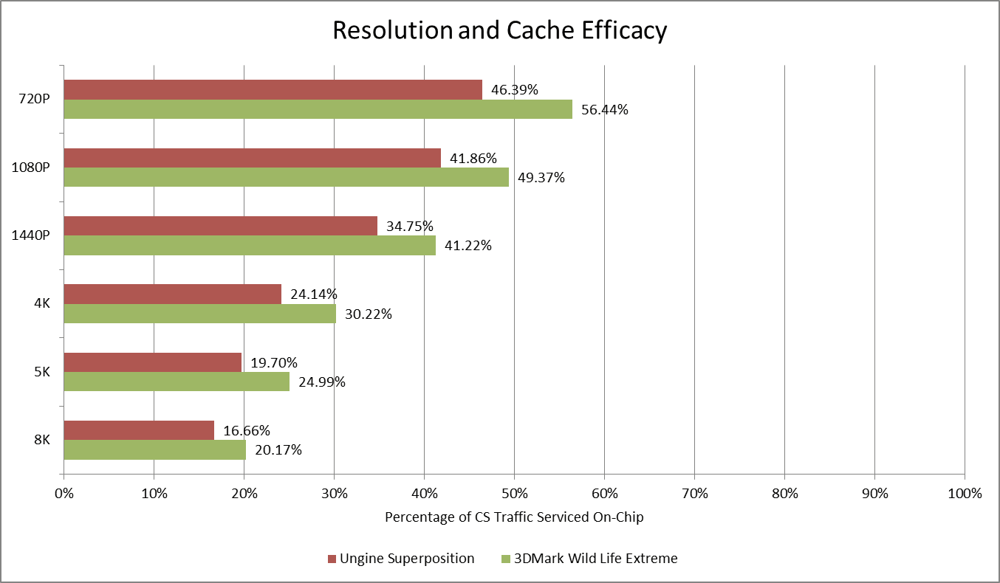

*图 12：图中把片上截获比例与外部需求并列。高分辨率不是简单按像素数线性缩放，帧率下降也会降低每秒带宽。*

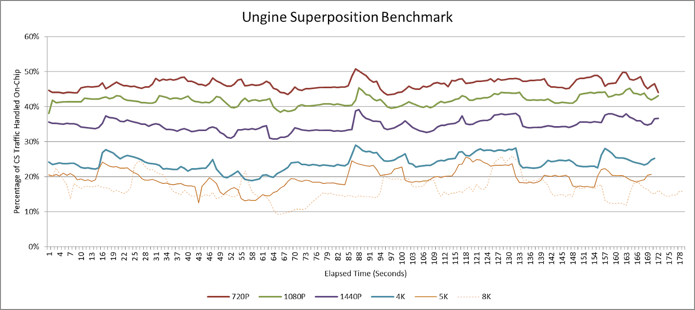

*图 13：各分辨率的峰谷出现在相近阶段；8K 因平均只有约 10 FPS，时间轴看起来被拉长。相同场景阶段而非随机噪声主导变化。*

若假设 8K 的 GPU 能从约 10 FPS 提升到 30 FPS，并简单把最大带宽乘三，需求会略高于 525 GB/s；那时必须更大 Cache、更宽 DRAM，或两者兼有。但 Strix Halo 本来就不是为这种情形设计，已测各分辨率仍在可控范围内。值得注意的是，8K 产生最多 DRAM 流量，1080p 却可能产生最高 Fabric 层需求，因为更高帧率放大每秒访问次数。

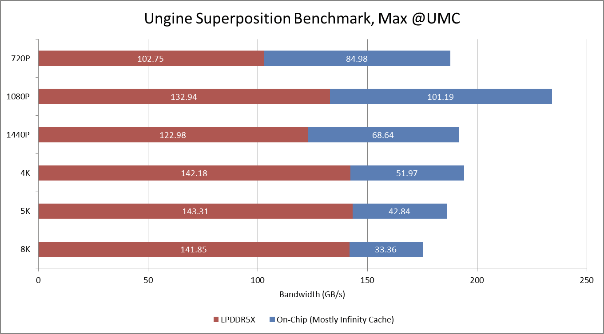

*图 14：8K 外部带宽最高，1080p 的片上总需求却可更高。分辨率、帧率、工作集与命中率必须一起解释。*

3DMark Wild Life Extreme 面向移动设备，Strix Halo 即使 8K 也能超过 30 FPS。分辨率升高时 DRAM 需求增加、Cache 有效性下降，但仍远离 256 GB/s 上限。

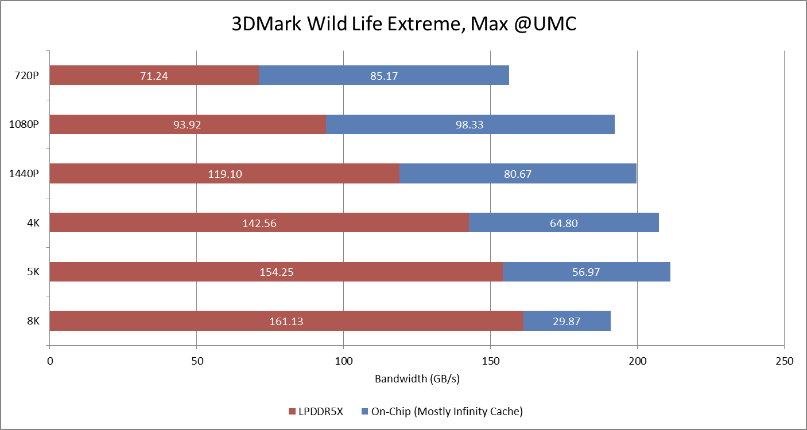

*图 15：从 720p 到 8K，外部流量增加，片上截获部分仍足以避免总线饱和。这比极端 Superposition 更贴近移动 GPU 的设计目标。*

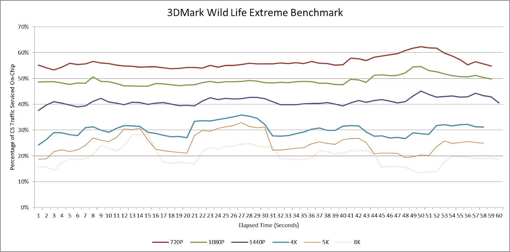

*图 16：16～19 秒和 45～52 秒附近，高分辨率出现更深命中率下跌，1440p 及以下不明显。固定 32 MB 在高分辨率下不仅平均更差，波动也更大。*

### 体系结构视角：为什么“带宽是否越线”比平均命中率重要

Cache 命中率从 70% 降到 60% 是否影响性能，取决于剩余流量离 DRAM 饱和点多远。若 UMC 仍有大量余量，下降只增加功耗；若队列已接近满载，几个百分点就可能让延迟陡升。评价内存侧 Cache 应同时看带宽放大、外部峰值、受载延迟和帧时间尾部。

## 四、32 MB 是怎样的产品平衡

芯片设计必须覆盖大量工作负载。Strix Halo 选择 32 MB Cache＋256 GB/s DRAM，在已测图形负载中“足够好”：高分辨率确实降低命中，但没有把外部带宽推到失控。

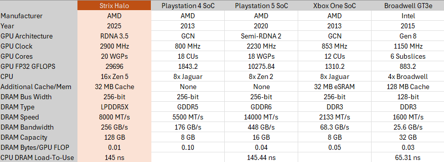

*图 17：Intel 曾用 128 MB eDRAM 搭配普通 128-bit 内存总线；PS5 依靠 448 GB/s GDDR6；Strix Halo 同时使用中等 Cache 与较宽 LPDDR5X，处于两条路线之间。*

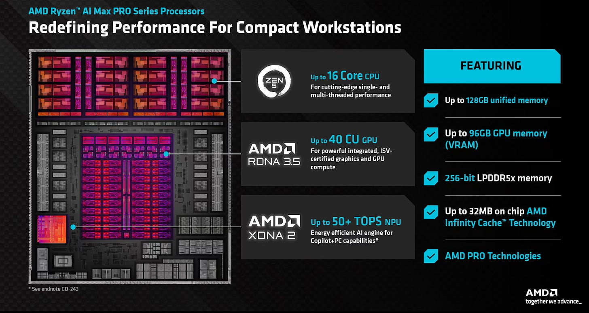

*图 18：Strix Halo 还要服务 16 核 CPU、NPU、媒体和大容量统一内存，不能按纯游戏主机或独显的带宽预算设计。*

这组实验留下五点认识：

1. Infinity Cache 的第一任务不是追求固定高命中率，而是把 UMC 流量压在延迟急剧上升之前。
2. 32 MB 对目标 GPU 与常见分辨率足够，不代表 GPU 或分辨率继续放大后仍能线性扩展。
3. 一秒采样、四 CS 乘四和 CPU/Snoop 混入都构成误差；数字适合看趋势，不是官方命中率。
4. 更大 Cache 可降低 DRAM 带宽与能耗，却消耗可观 Die 面积；更宽 DRAM 则增加封装、主板和功耗成本。
5. 开发者若能直接看到 Infinity Cache Hitrate，会更容易理解分辨率、资源布局和渲染阶段的影响。AMD 现有工具只到 GPU L2，仍留下明显观测空白。

网页视频口述中还更正了两个用词：Core Coherent Master 的 32 B/64 B 是每个 Data Beat，而非每 cycle；末尾应是读流量多于写流量。保留这一更正很重要，因为把 Beat 与 cycle 混用会直接导致端口带宽误判。

最终来看，Infinity Cache 没有消除大 iGPU 的带宽问题，却把一个可能需要 335 GB/s 甚至更高外部带宽的负载，压回了移动 LPDDR5X 可承受的范围。这正是 32 MB 在 Strix Halo 上存在的理由。

## 参考资料

- Chester Lam，*Evaluating the Infinity Cache in AMD Strix Halo*：https://chipsandcheese.com/p/evaluating-the-infinity-cache-in
- AMD，Hot Chips 2021 Infinity Cache 资料
- AMD，Ryzen AI MAX / Strix Halo 公开资料
