# Strix Halo 的内存系统：一颗大 iGPU 如何兼顾 CPU、GPU 与移动功耗

> **文章来源**
>
> - 文章：*Strix Halo’s Memory Subsystem: Tackling iGPU Challenges*
> - 撰文：Chester Lam
> - 首发：Chips and Cheese
> - 发布：2025 年 10 月 31 日
> - 链接：https://chipsandcheese.com/p/strix-halos-memory-subsystem-tackling

Strix Halo 想在移动设备里同时提供 16 核 Zen 5 与大型 RDNA 3.5 iGPU。CPU 通常低带宽、怕延迟；GPU 容忍延迟、吞吐需求巨大；统一内存还要兼顾容量、功耗、封装和价格。AMD 没有用单一技巧解决这些矛盾，而是把 256-bit LPDDR5X、32 MB Infinity Cache、两颗 CCD 和先进封装组合起来。

测试设备是 ASUS 提供的 32 GB ROG Flow Z13；RX 7600 数据由 Chips and Cheese Discord 的 Azralee 提供。网页在 2025 年 11 月 2 日补回了最初搬运时漏掉的 Cyberpunk 2077 数据，下面采用修订后的完整版本。

*图 1：平板形态限制了散热、主板面积和内存功耗，正是 Strix Halo 选择统一 LPDDR5X 而非独显＋独立显存的背景。*

## 一、GPU Cache：2 MB L2 后接 32 MB Infinity Cache

GPU 分成两个 Shader Array，每个拥有 256 KB L1 Mid-Level Cache，整颗 GPU 共用 2 MB L2。容量与较小的 Strix Point/Hawk Point 接近，因为 32 MB Memory Attached Last Level Cache（MALL，也称 Infinity Cache）承担了末级过滤任务。

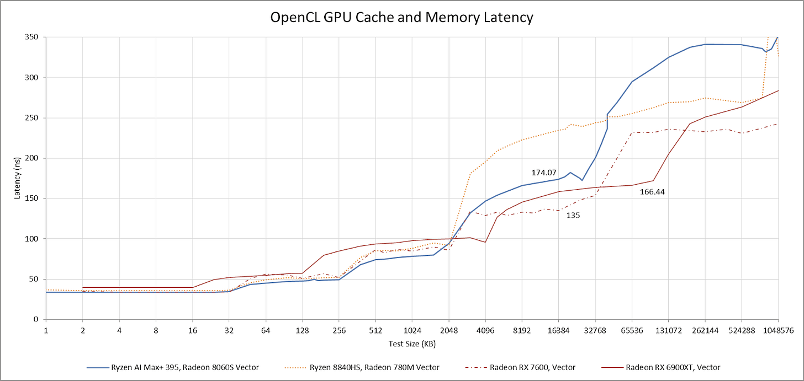

*图 2：RDNA 3.5 私有层次与 RDNA 3/其他移动实现接近，32 MB 处出现 Infinity Cache 台阶。它让大型 iGPU 的 DRAM 工作集不必全部落到 LPDDR5X。*

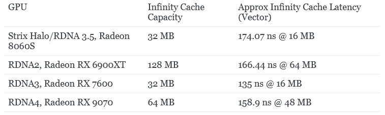

*图 3：Strix Halo 约 174～207 ns/16 MB 区间，高于多款独显；离散卡的更大 Cache 和独立显存路径不能与移动统一内存直接等同。*

Nemes 的 Vulkan 测试从 Infinity Cache 获得接近 1 TB/s。结合 2 GHz FCLK，结果支持 GPU 到 Fabric 约 512 B/cycle 的总通路；若八个 Endpoint 对称，则每个约 64 B/cycle。这是按性能曲线反推，不是 AMD 公布的端口位宽。

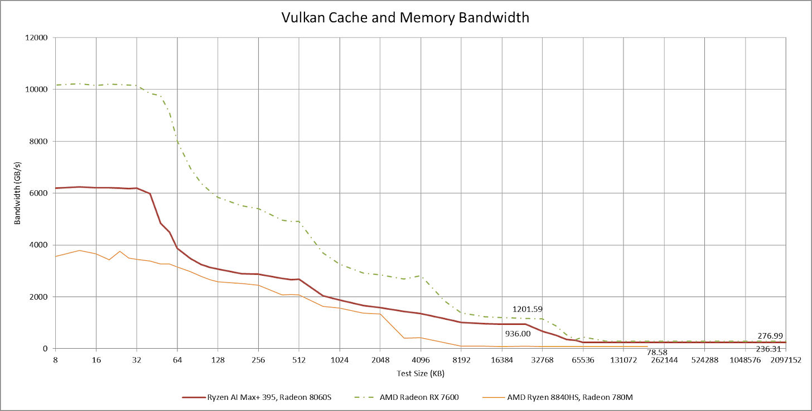

*图 4：小工作集接近 1 TB/s，越过 32 MB 后逐步落向 LPDDR5X 区间。绿色虚线与 PMU 推算共同帮助判断 Fabric 接口规模。*

## 二、Infinity Cache 策略会被软件动态改变

Infinity Cache 位于内存侧，理论上能观察所有 DRAM-backed 地址；现实策略却更窄。Hot Chips 2025 刚结束时，OpenCL 微基准能看到 Cache，而游戏退到后台后，PMU 显示它不再使用。硬件本身不知道前台/后台，说明操作系统或驱动把进程状态传给了策略控制。

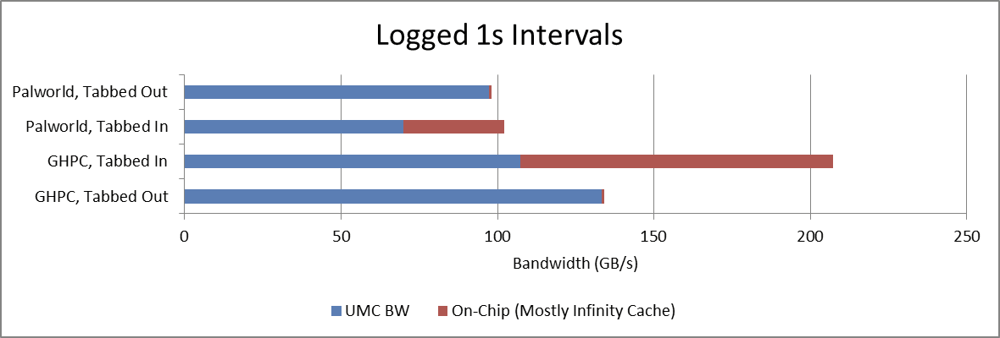

*图 5：2025 年 9 月 1 日采集的旧数据中，后台游戏的片上命中部分发生变化。这是历史行为，不应当作当前驱动的固定规则。*

当时 Vulkan 微基准也看不到 Infinity Cache，CS 与 UMC 流量几乎一致；Windows 更新后，前后台差别消失，Vulkan 也能观察到 Cache。

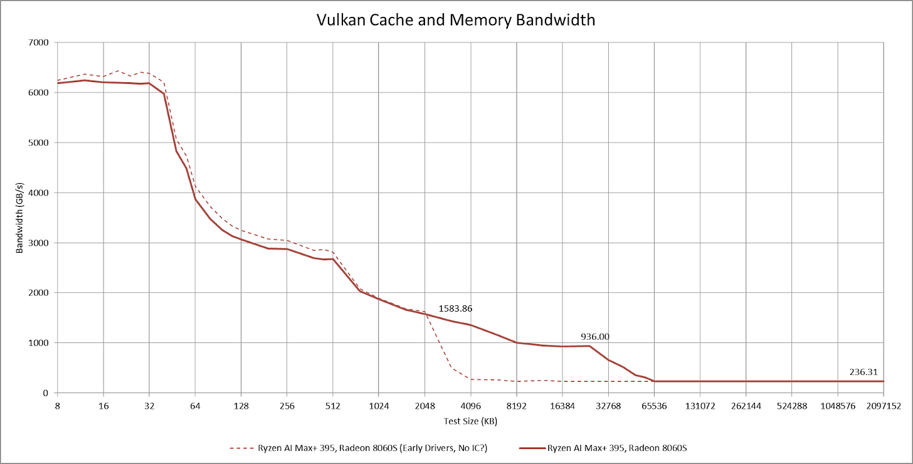

*图 6：相同类别测试随软件更新改变，证明 Cache 是否分配不只由请求来源决定。未来固件和驱动仍可能继续调整策略。*

一个行为始终存在：用 `CL_MEM_ALLOC_HOST_PTR` 创建、通过 zero-copy map/unmap 管理的 Host-visible Buffer 不会填入 Infinity Cache。

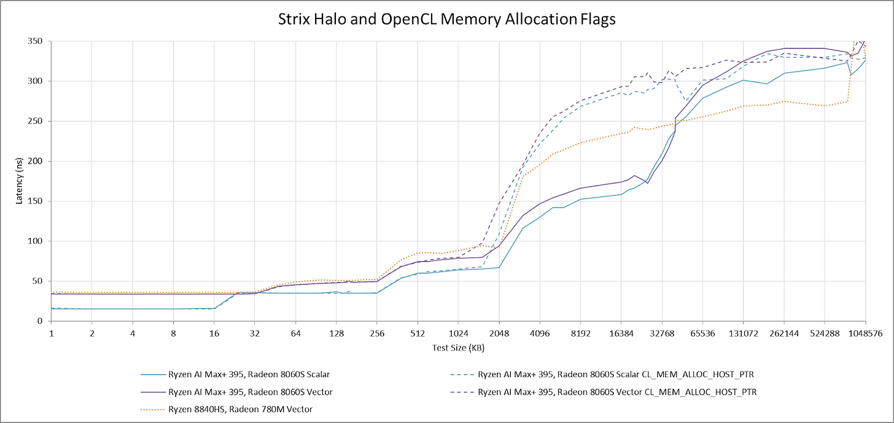

*图 7：普通 Device Buffer 出现 Cache 台阶，Host Pointer 类分配直接呈现 DRAM 路径。统一内存并不意味着所有虚拟内存类型共享相同 Cache 属性。*

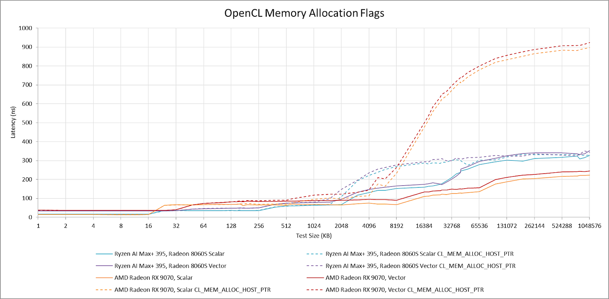

*图 8：离散 RX 9070 也不把 Host-side Memory 放入 Infinity Cache，但跨 PCIe 后延迟接近 1 μs；Strix Halo 的统一物理内存让 zero-copy 延迟基本不变。*

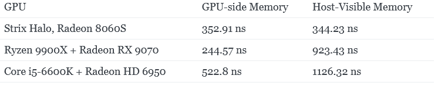

*图 9：Strix Halo 约 352.91/344.23 ns，两种内存接近；RX 9070 为约 944.67/976.43 ns，Core i5-6600K＋HD 6950 更高。不同软件栈与平台使绝对值只适合说明数量级。*

256 MB Shared Virtual Memory 测试只修改一个 32-bit 值，用来确认细粒度共享是否暗中拷贝。Strix Halo 延迟很低，与真正 zero-copy 一致；并非所有 iGPU 都能做到。

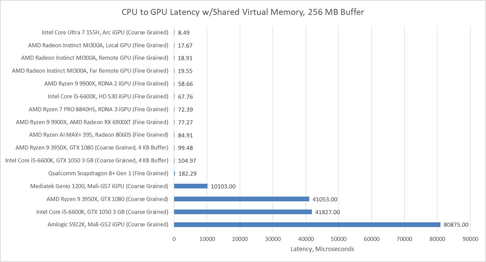

*图 10：Strix Halo 位于低延迟组。测试只触碰极少数据，回答的是同步/共享路径，不代表大块复制带宽。*

### 体系结构视角：统一地址、统一物理内存、统一 Cache 策略并非同义词

CPU 和 GPU 可以看到同一虚拟地址，也可以共享同一 LPDDR5X，但 Cache Fill、Coherency Scope 和迁移策略仍由页属性、驱动与硬件 Agent 决定。验证统一内存时要分别测可见性、是否复制、第一次触碰代价、Cache 命中和双向同步，而不是只看 API 名称中的 “shared”。

## 三、Copy Engine 的双向不对称

传统 OpenCL Copy API 常由 DMA/Copy Queue 完成，不占用通用 Compute Unit。Strix Halo 的 CPU→GPU 方向带宽很高，反向则明显较低。

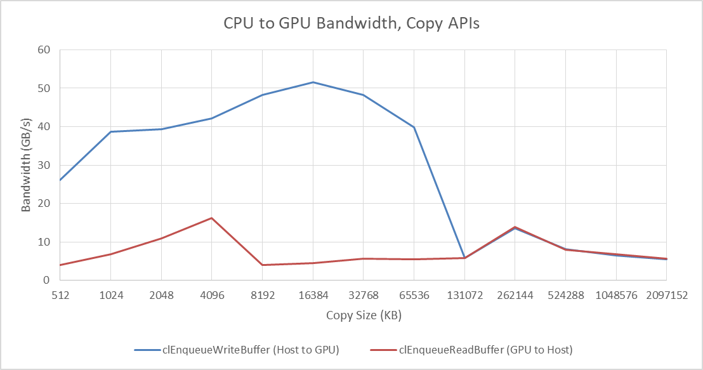

*图 11：`clEnqueueWriteBuffer`（CPU→GPU）峰值约 50 GB/s，`ReadBuffer` 远低于此。统一内存仍保留方向相关的数据移动引擎和队列。*

PMU 显示写向 GPU 时，请求似乎不走 Infinity Cache。若控制器必须同时从 CPU 区读、向 GPU 区写，理论流量应接近软件字节数的两倍；实测开销远低于 100%，说明数据路径比简单 DRAM 往返更复杂。

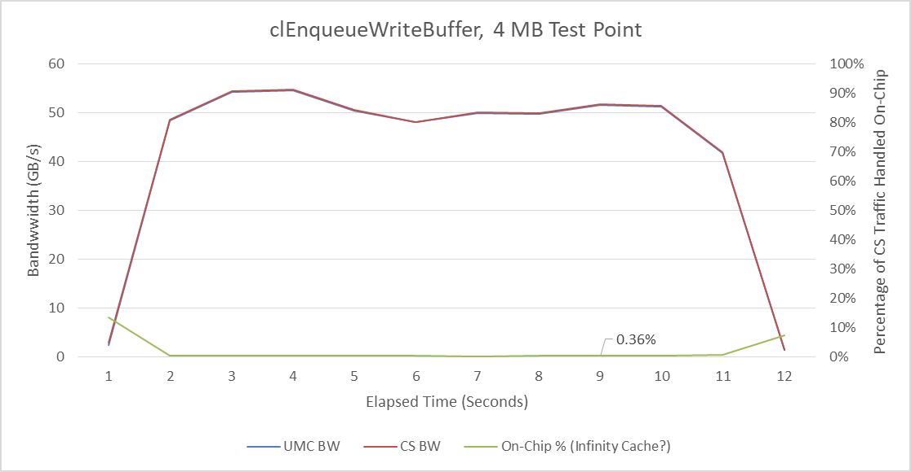

*图 12：4 MB 测试点中软件带宽与 CS/UMC 计数并非简单 1:2。计数位置、Beat 定义、片上旁路和写合并都可能影响差异。*

反向复制软件带宽更低，但 CS 流量相近、UMC 流量更少，说明一部分请求可能由 Infinity Cache 在片上满足；PMU 与软件值之间又出现超过 100% 的差额。

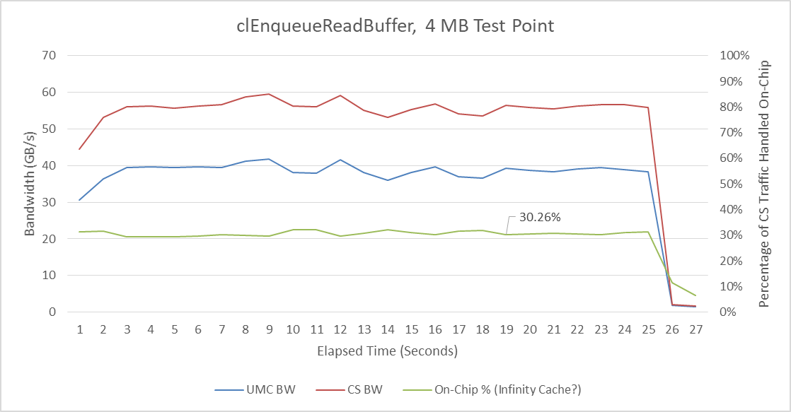

*图 13：这组结果支持方向不对称，却不足以唯一还原 DMA 读写事务。PMU Beat 统计不能直接当作 API 有效负载。*

## 四、CPU CCD：封装更先进，读带宽仍受限制

CPU 侧是两颗八核 Zen 5 CCD。它们不再通过 PCB 走线连接 IOD，而使用 TSMC InFO_oS；每颗 CCD 到系统的读、写方向各约 32 B/cycle。

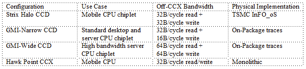

*图 14：Strix Halo 读写各 32 B/cycle，桌面 GMI-Narrow 约读 32、写 16，GMI-Wide 与 Meteor Lake 更宽。先进封装主要改善物理实现，并未让 Strix Halo 获得 GMI-Wide 级总宽度。*

多数 CPU 工作负载读多写少，因此写方向翻倍对应用帮助有限。

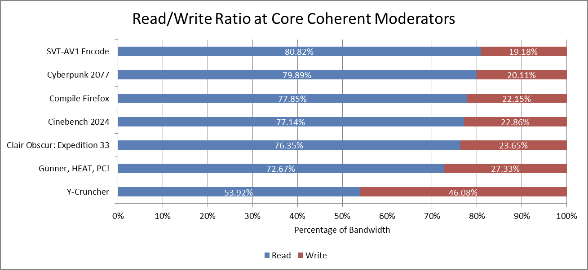

*图 15：SPEC、编译、视频和游戏中的读流量普遍占大头。链路设计若只增加写带宽，很难缓解主要瓶颈。*

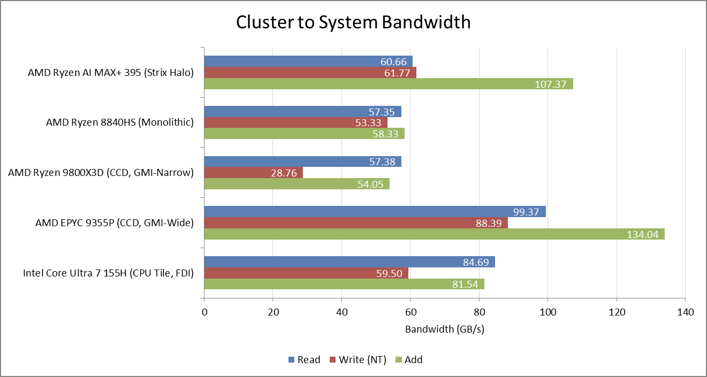

*图 16：Strix Halo 高于普通桌面 CCD 的写方向，却明显低于 EPYC GMI-Wide；Meteor Lake Compute Tile 也有更高跨 Tile 能力。Add 是等量读写，NT Write 绕过 Cache 并避免完整覆盖行的 RFO。*

单 CCD 纯读受载时，Strix Halo 在 45～55 GB/s 以前因 LPDDR5X 高基线延迟落后；更高负载下，宽内存总线的余量才开始体现。Meteor Lake 的跨 Die 接口更宽，GMI-Wide 则在低延迟下提供最高带宽。

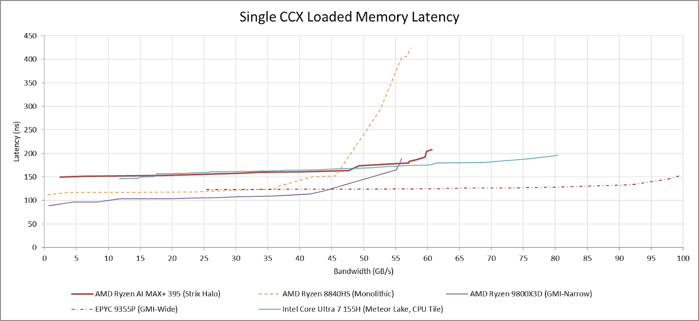

*图 17：曲线把基线延迟、CCD 边界和 DRAM 带宽共同叠加。不同平台使用不同内存，不能把差值全归因于封装。*

两颗 CCD 一起工作时，先让 CCD1 制造带宽、CCD0 运行延迟线程，可在 60 GB/s 以下减少同接口竞争；继续扩展后，延迟超过 200 ns，纯读仍远低于 LPDDR5X 理论 256 GB/s。

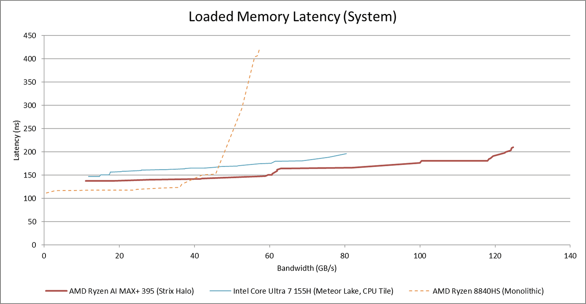

*图 18：Strix Halo 总带宽超过 Meteor Lake，但 CCD→IOD 仍是纯读上限之一。物理 DRAM 总线远比 CPU 入口宽，主要为 GPU 服务。*

InFO_oS 不需要桌面 IFOP 那样的 SerDes。Zen 2 IFOP 曾用 32 条发送、40 条接收 Lane，高速并行传输还需转发时钟和 CRC 处理走线偏斜与错误，这些都会增加功耗和延迟。

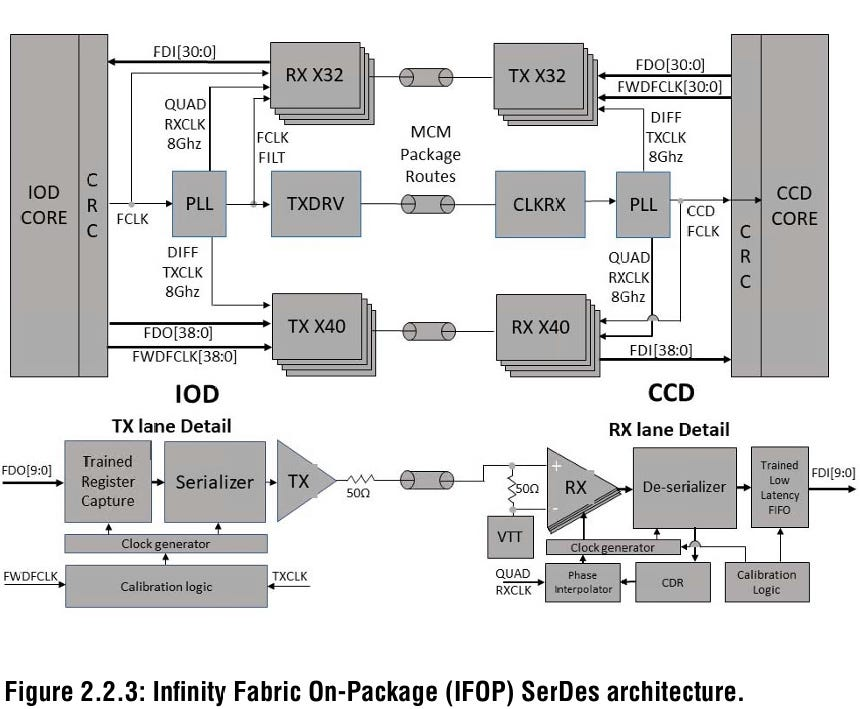

*图 19：它是旧一代设计参照，不是 Strix Halo 模块图。先进封装可以移除 SerDes，却不保证软件端延迟一定更低，因为后续 Fabric、Home 和 DRAM 仍可能更慢。*

## 五、跨 CCX 一致性：封装优势被后续路径吞没

核间测试反复在核心间传递同一 Cache Line。Strix Halo 的 Coherent Station 位于内存控制器前，物理地址会选择不同 L3 Slice、控制器和 CS；测试改变 4 KB 页内 Cache Line Offset，以覆盖不同 Home 组合。

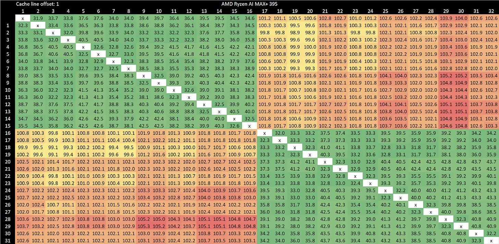

*图 20：同 CCX 绿色区域较快，跨 CCX 约 100 ns 起。矩阵中的差异不只代表核心距离，还包含地址归属的 L3 Slice 与 CS。*

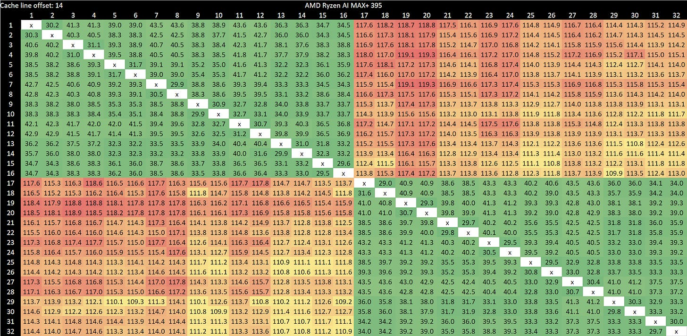

*图 21：跨 CCX 区域可到 120 ns，可能是负责该地址的 CS 离 CPU Endpoint 更远。文章用“likely”描述这一归因，没有公开 Fabric 布局可直接确认。*

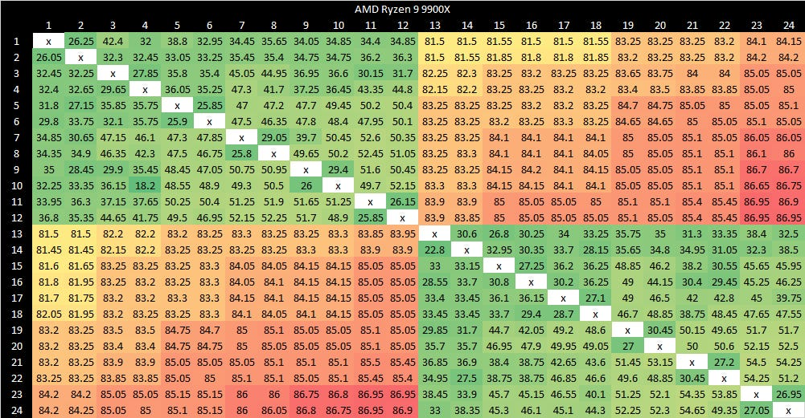

*图 22：桌面 Ryzen 9 9900X 常见 80～90 ns，约比 Strix Halo 快 20 ns。InFO_oS 的 Die 边界可能更快，但边界之后的组织更慢，使优势无法在端到端测量中显现。*

### 体系结构视角：封装只优化链条中的一段

一次跨 CCX 传输可能经历源 L2、源 L3、Fabric Endpoint、Home/CS、Snoop、目标 Cache 与响应返回。移除 SerDes 只能缩短其中一段；若 Home 更远、队列更多或时钟域更慢，总延迟仍可能上升。归因必须沿整条一致性路径，而不是用封装名称替代测量。

## 六、CPU 与 GPU 同时争用内存

从 Zen 4 起，L3 PMU 可报告 CCX 外请求的平均纳秒延迟。它从 L3 miss 之后开始计时，通常略低于软件端 Load-to-use，却适合以一秒间隔观察游戏。

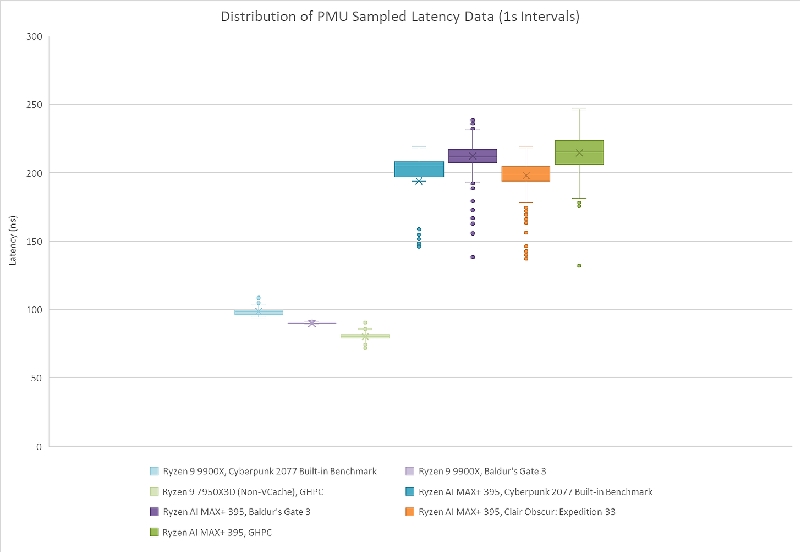

*图 23：使用独显时，CPU 带宽需求普遍很低，延迟只比基线略高。PMU 值与软件微基准口径不同，不能直接混成一条曲线。*

使用 Strix Halo iGPU 后，CPU 外部请求基线约 140 ns，许多一秒区间升到约 200 ns。

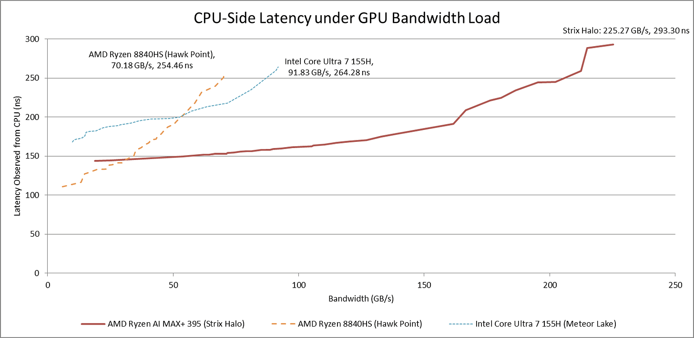

*图 24：随着 GPU 带宽增加，CPU 延迟显著上升。其他近期 iGPU 也有同类趋势，说明它是共享控制器的一般问题。*

为控制负载，OpenCL 内核在 GPU 上执行 `C=A+B`，通过增加每次写回前的数学运算改变带宽需求；CPU 一侧同时跑延迟线程。

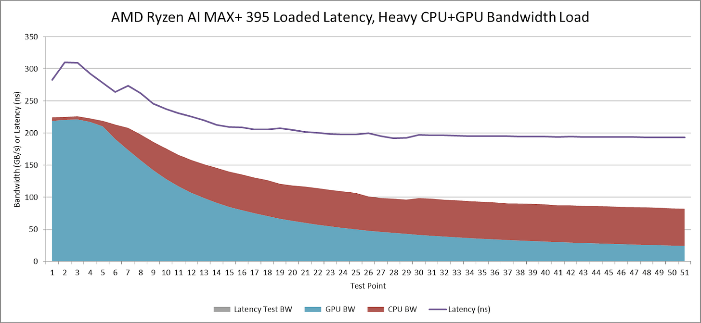

*图 25：GPU 越接近带宽型，CPU 延迟越高。面积图还区分 CPU、GPU 可见带宽，避免只用一个总值描述竞争。*

再加入两个 CPU 读带宽线程后，极端区间延迟超过 300 ns，显示 GPU 可以挤压 CPU。

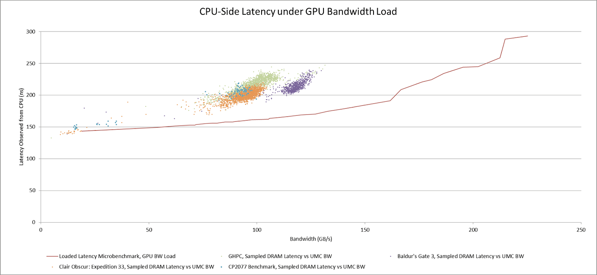

*图 26：真实游戏的一秒采样点与单延迟线程微基准并不重合，可能因为游戏本身也有 CPU 带宽、CCD 接口和 DRAM 的双重竞争，或一秒窗口把突发峰值叠在一起。*

Cyberpunk 2077 内置 Benchmark 使用 1080p Medium、关闭 Upscaling，主要受 CPU 限制。桌面平台使用计算能力大致接近的 Arc B580。

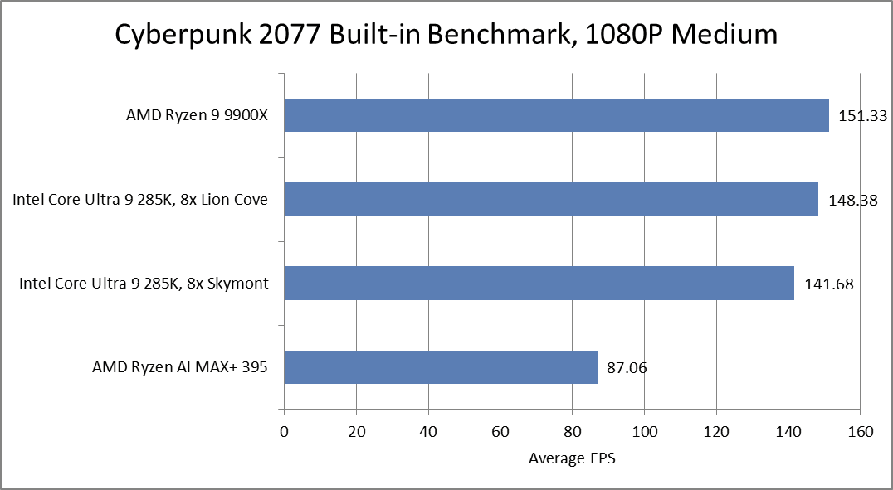

*图 27：Ryzen 9 9900X 约 151.33 FPS，Lion Cove 148.38，Skymont 141.68，Strix Halo 约 87.06。平台、功耗和 GPU 路径不同，差距不应全归因于 Zen 5 核心。*

CPU-only 应用通常远未用满双通道 DDR5；Cinebench、编译和 AV1 编码的 PMU 点基本贴近低带宽区。Y-Cruncher 是例外，带宽需求数倍更高，Strix Halo 的宽内存更合适。

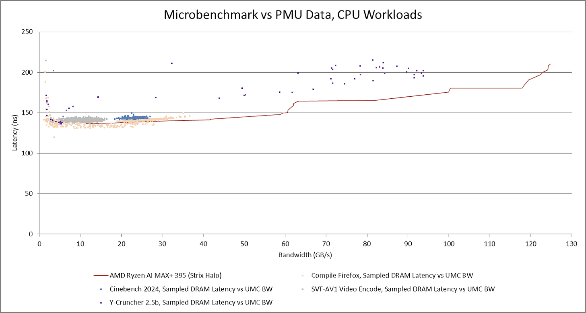

*图 28：大多数 CPU 应用落在低带宽、接近基线延迟区域，解释了为何 CPU 入口没有做成 GPU 那样宽。Y-Cruncher 不代表常见客户端负载。*

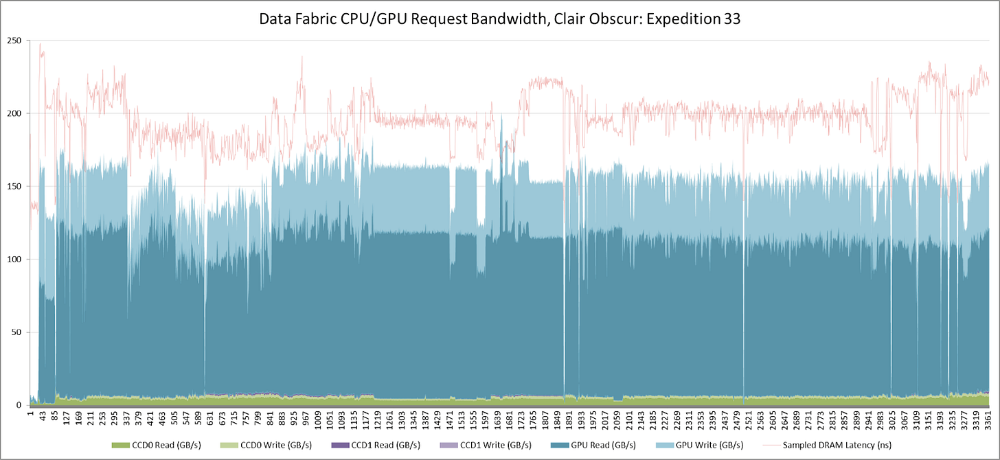

*图 29：Strix Halo 能在移动功耗内搬运数百 GB/s，技术上很出色；代价是 CPU 侧平均延迟高，并随 GPU 负载波动。*

## 七、这更像“集成了 CPU 的 GPU”吗

Strix Halo 的系统优先级明显偏向 GPU：八个 GPU Fabric Endpoint、256-bit LPDDR5X 和 Infinity Cache 提供高吞吐；CPU 请求不填入 Infinity Cache，却很可能仍要查它以维持与 GPU 的一致性，产生功耗，甚至可能增加延迟。CPU CCD 也没有 GMI-Wide 级读带宽。

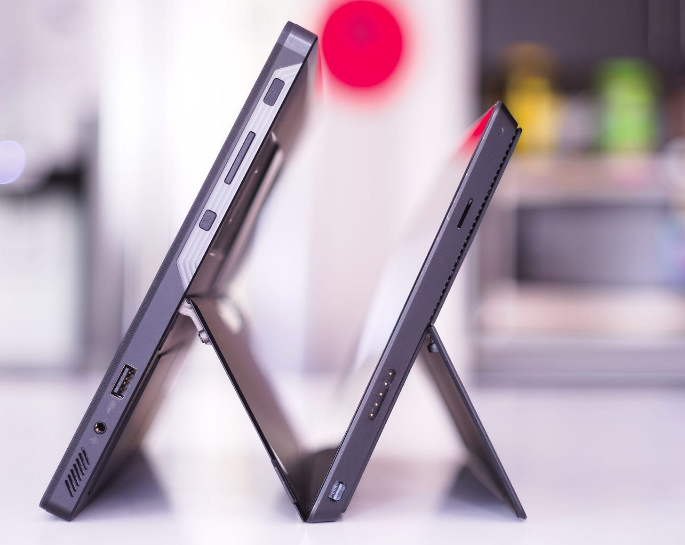

*图 30：大 iGPU 的价值在于把可观图形性能与大共享内存塞进轻薄形态。继续放大 GPU 会遇到散热、成本和与独显竞争的问题。*

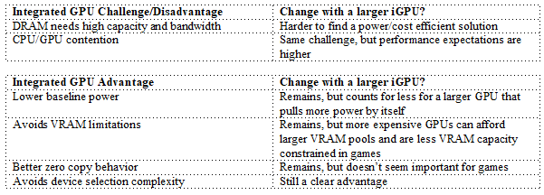

*图 31：统一内存带来低复制开销、容量弹性和简单系统；更大 GPU 会要求更宽 DRAM、更大 Cache、更复杂 QoS，也会进一步挤压 CPU。*

从整篇测试可以归纳六点：

1. Infinity Cache 不是固定透明硬件，驱动可以按用途和页面属性改变分配策略。
2. 统一内存最大的优势是共享与 zero-copy，不是所有请求都得到同样的 Cache 命中。
3. Strix Halo 的 CPU 跨 Die 写带宽得到改善，读带宽却仍是更常见的限制。
4. 先进封装降低边界成本，但不会自动修复 Home、CS 和控制器造成的端到端延迟。
5. 大多数 CPU 负载不需要 256 GB/s；大型 GPU 需要。资源倾斜因此合理，但 CPU/GPU 同时高负载时会暴露 QoS 问题。
6. 32 MB Cache＋宽 LPDDR5X 是针对便携性能档位的平衡，不应外推为更大 iGPU 仍可按比例扩展。

Chester Lam 的结论是，Strix Halo 在目标市场达成了不错平衡：iGPU 足够大，统一内存优势明显，又没有大到让带宽和争用代价完全失控。它不是没有取舍，而是把取舍放在多数客户端 CPU 工作负载较少触及、游戏 GPU 更需要资源的一侧。

## 参考资料

- Chester Lam，*Strix Halo’s Memory Subsystem: Tackling iGPU Challenges*：https://chipsandcheese.com/p/strix-halos-memory-subsystem-tackling
- AMD，Strix Halo / Ryzen AI MAX 与 Infinity Fabric 公开资料
- ASUS，ROG Flow Z13 产品资料
