# Strix Point：Zen 5 首次从移动端登场

> **文章来源**
>
> - 文章：*AMD’s Strix Point: Zen 5 Hits Mobile*
> - 撰文：Chester Lam
> - 首发：Chips and Cheese
> - 发布：2024 年 8 月 10 日
> - 链接：https://chipsandcheese.com/p/amds-strix-point-zen-5-hits-mobile

Zen 让 AMD 从低谷重回高性能 CPU 竞争。Zen 5 则第一次先在移动端亮相：Ryzen AI 9 HX 370 所属的 Strix Point APU 把 Zen 5、RDNA 3.5 iGPU 与 NPU 放进同一芯片。本文围绕这颗移动实现，观察 Zen 5 几乎遍及整条流水线的变化，以及 AMD 与 Intel 在 Hybrid、SMT 和资源组织上的不同选择。

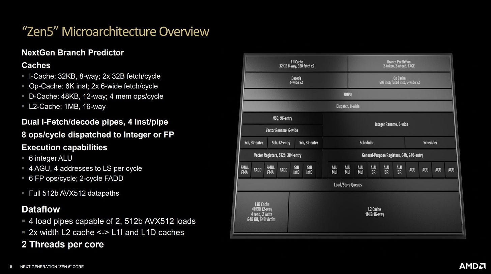

*图 1：Strix Point 是 Zen 5 Architecture 的首发载体；移动功耗和面积约束决定了它与桌面 Granite Ridge 不会采用完全相同的物理资源。*

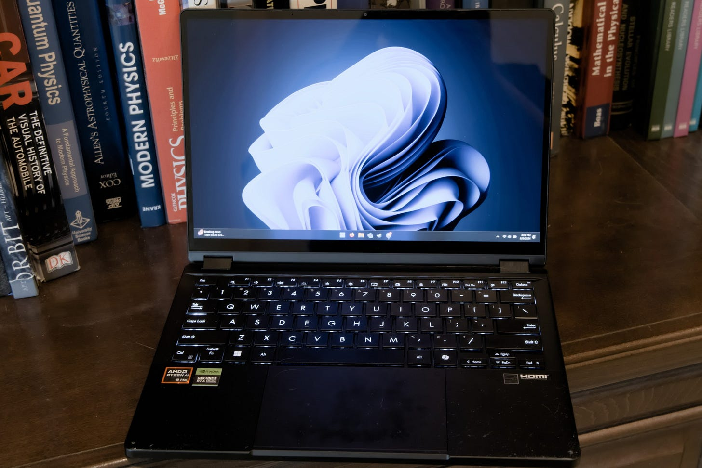

*图 2：英文正式图注为“测试系统”。ASUS 提供了 Review Laptop。网页没有完整披露 BIOS、OS Build、功耗模式、Compiler/Flags、微基准源码、重复次数与误差。*

## 系统层次：4 个 Zen 5 加 8 个 Zen 5c

Strix Point 有两组 CPU Cluster。高性能 Cluster 是 4 个普通 Zen 5、16 MB L3、最高 5.15 GHz；密度优化 Cluster 是 8 个 Zen 5c、8 MB L3、最高 3.3 GHz。这延续 AMD 的 Mild Hybrid：两类核心使用同一 Architecture，以 Cache 容量与 Physical Implementation 区分功耗、频率和密度；Intel 则用不同 P-Core/E-Core Architecture。

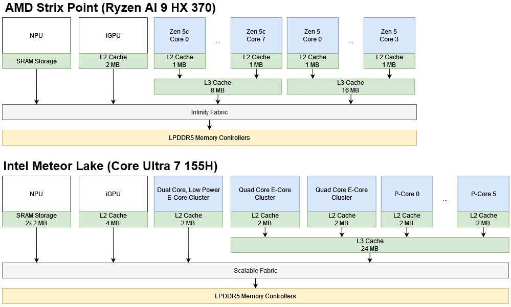

*图 3：4 个高频 Zen 5 与 8 个高密度 Zen 5c 各自共享一块 L3。两组 L3 不是统一 24 MB，因此单 Core 可触达容量与 Meteor Lake 不同。*

同一 Cluster 内所有 Core 最高频率相同，操作系统不用再在高性能核心中寻找 Preferred Core。

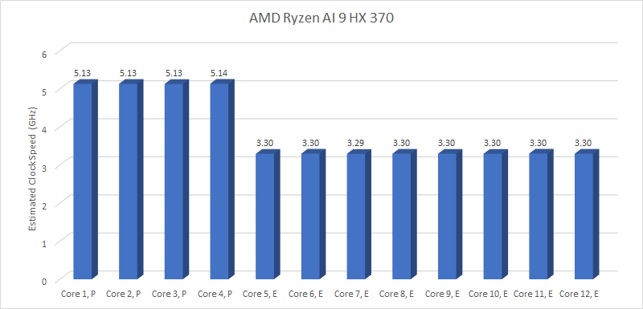

*图 4：图中为简洁把两组称作 P/E；Clock 由 Dependent Integer Addition Latency 估算。这里的 P/E 只代表物理实现与频率，不表示两套 ISA 或核心 Architecture。*

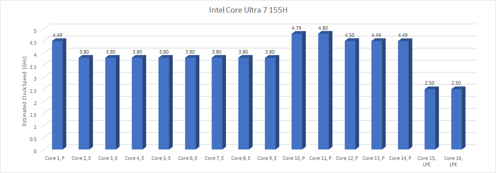

*图 5：Meteor Lake 两颗 Redwood Cove 可到 4.8 GHz，其余为 4.5 GHz，更需要 Scheduler Awareness；同一 Crestmont Cluster 内频率一致。*

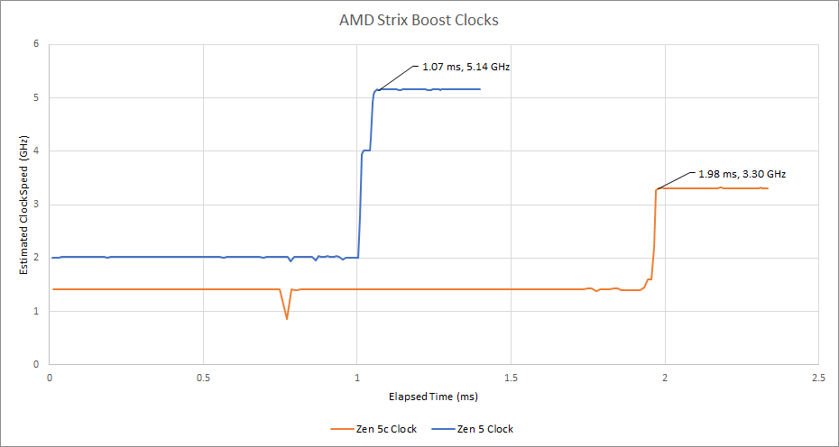

*图 6：两组核心都很快到达峰值，Zen 5c 也能在 2 ms 内升至 3.3 GHz。响应速度与峰值频率是不同维度。*

ASUS 采用 128-bit LPDDR5-7500，理论带宽接近同为 128-bit LPDDR5-7467 的 Meteor Lake。每个 CPU Cluster 以 32 B/cycle Port 连接 Infinity Fabric，Fabric 最高约 2 GHz；单 Cluster Read 略低于 62 GB/s，必须同时加载两个 Cluster 才能继续利用 Memory Controller。

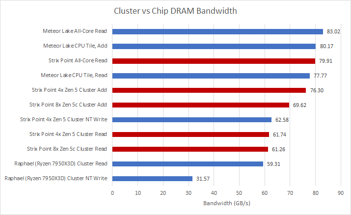

*图 7：Strix Point 的每 Cluster Write Link 也是 32 B/cycle，理论约 64 GB/s，而桌面 Zen 4 Write 只有 16 B/cycle。Meteor Lake CPU Tile 更接近饱和控制器；读写混合后差距缩小。*

低线程应用通常不需要峰值 DRAM Bandwidth，因此 Cluster Link 未必形成常见瓶颈。Meteor Lake 的 CPU 性能集中在 CPU Tile，也更依赖 Cross-die Link。

跨 Cluster 的 `lock cmpxchg` 等 Coherency Operation 延迟却高于预期。移动单 Die 理应比跨 Chiplet 更简单，这个结果值得注意。

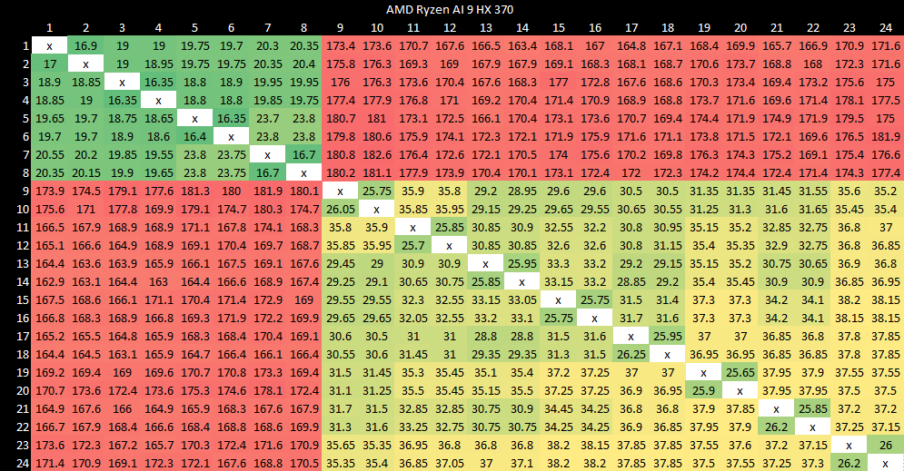

*图 8：同 Cluster 很快，跨 Cluster 明显抬升；它是 APU Fabric 与 Coherency 的端到端结果，不能归成 Zen 5 Pipeline Latency。*

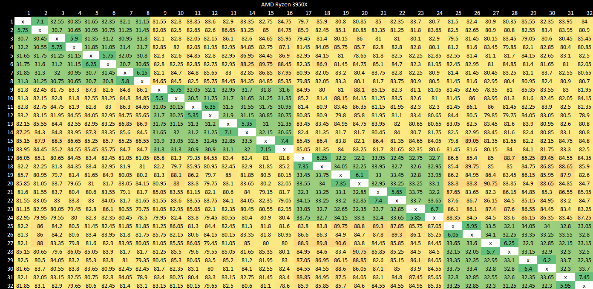

*图 9：作为对照，3950X 跨 Cluster 约 80～90 ns，同 Cluster 同样优秀。不同平台只能说明 Strix 的跨 Cluster 结果意外偏高，无法直接定位原因。*

### 体系结构视角：AMD 的“混合”首先是 PPA 分工

Zen 5c 与 Zen 5 保持 ISA、Pipeline 基础和优化模型一致，靠 Layout、Clock Target 与 Cache 配比实现密度；Intel 则允许 E-Core 在 Decoder、Scheduler、Vector ISA 等处独立选择。前者降低软件异构性并保留全线 AVX-512，后者给高密度核心更大设计自由度。没有单一正确答案，关键是每瓦、多线程和单线程目标如何排序。

## Zen 5 总览：Family 1Ah，几乎整条流水线都改了

CPUID 把 Zen 5 标为 Hexadecimal 1Ah；Zen 3/4 是 19h，Zen 1/2 是 17h。Family ID 本身不总有微架构意义——Intel 从 Pentium Pro 到 Golden Cove 都用 6h——但 Zen 5 相比 Zen 4 的变化足够大，新 Family 很合理。

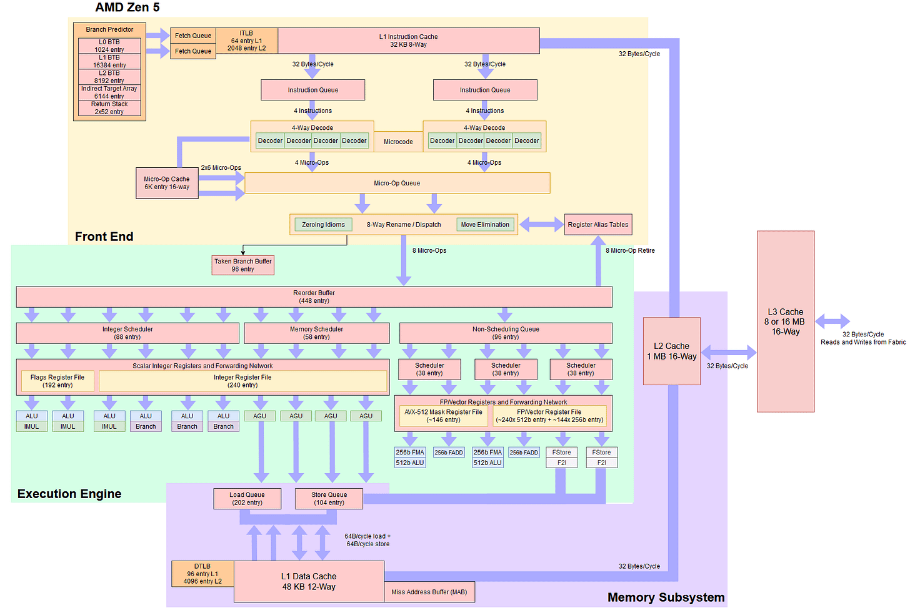

*图 10：Branch Predictor 增强并采用 Victim-cache BTB；Fetch/Decode 分成两 Cluster；Integer Scheduler 更统一、FP Scheduler 更分散；TLB/L1D 增大，核心变宽且乱序容量增加。图为资料与测试整理，不是 RTL。*

## Branch Prediction：16K L1 BTB 加 Victim L2 BTB

AMD 自 Zen 2 起就有很强 Predictor。Zen 5 在 Zen 4 基础上进一步提升，能识别极长 Pattern；更宽、更深的核心也更依赖准确预测，因为一次错误会浪费更多在途工作。

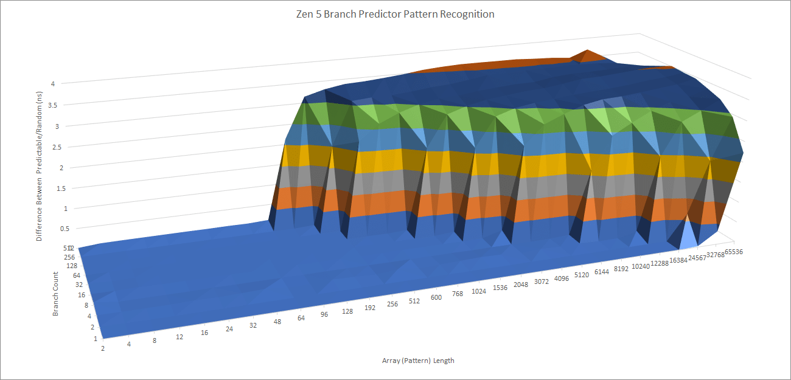

*图 11：Zen 5 的 Pattern Coverage 明显高于 Zen 4，Zen 4 又领先当时 Intel P-Core。曲线说明可预测历史范围，不足以识别具体 Predictor Algorithm。*

预测既要准也要快。Branch Target Buffer（BTB）缓存常用目标，避免每遇到 Taken Branch 都等待 Decode 或更慢 Cache。Zen 5 的配置很特别：快速层容量反而大于最后一级，像 Data Victim Cache 一样保存从 16K-entry L1 BTB Evict 的 Target。L1+L2 合计至少能跟踪 24K Target。

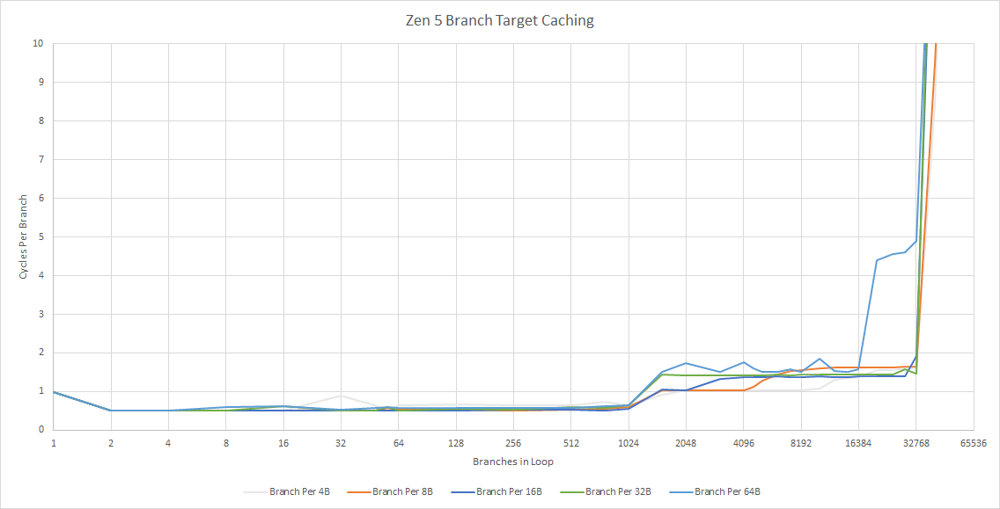

*图 12：容量拐点支持巨型快速 BTB 与较小 Victim Level 的解释。旧 AMD Optimization Guide 还指出，同一 64-byte Aligned Cache Line 内若第一条是 Conditional Branch，一个 Entry 最多可容纳两个 Branch；Zen 5 可能更广泛利用这一能力，因此实际可跟踪数有时超过 24K。*

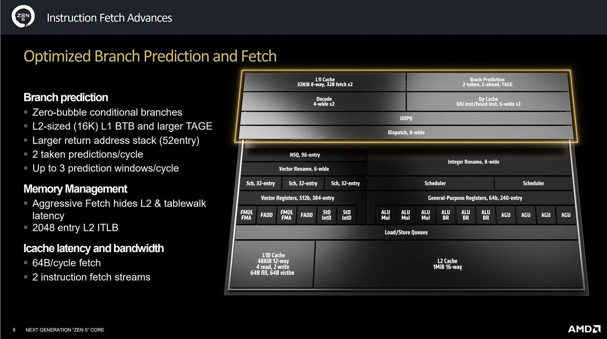

*图 13：被 L1 BTB 替换的 Target 进入 L2 BTB，近期再次使用时可避免从更晚阶段重发现。具体 Replacement、Tag 和 Recovery 未公开。*

在约 1024 个 Branch 的 Footprint 下，第一层仍能达到每周期两个 Taken Branch。Rocket Lake、Cortex-X2 已实现同类吞吐，但 Zen 5 在比 Neoverse V2、Golden Cove 更大的 Branch Footprint 下保持速度，且移动平台频率超过 5 GHz。

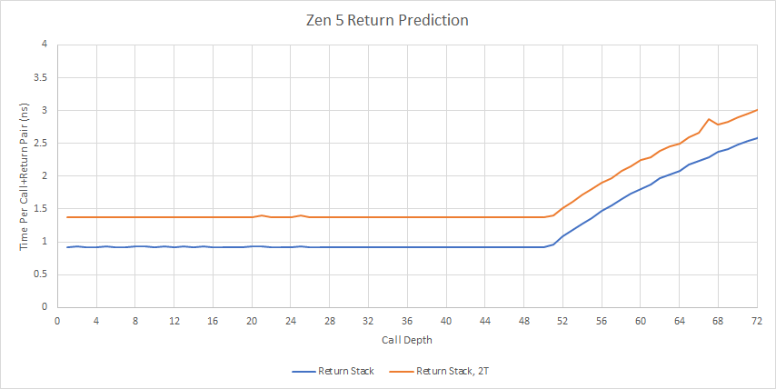

*图 14：0.5 cycle/branch 等价于稳态每周期两个 Taken Branch，并不是单个 Branch 的物理延迟为半周期。Return 由约 52-entry Return Stack 预测，两条 SMT Thread 似乎各有一份；前代约 32 项。*

### 体系结构视角：Victim BTB 在交换 Coverage 与关键路径

把最大容量放在 L1 BTB，可减少多数 Branch 的 Predictor Override；较小 Victim Level 接住被冲突替换但仍有时间局部性的目标。Hit 时让 Fetch 尽早定向，Miss 时可能等待慢层或由 Decode Redirect。验证需要区分 Direction Mispredict、Target Miss、Indirect Override 与 Decoder-discovered Branch；只统计总 Mispredict 会把几种不同 Bubble 混在一起。

## Clustered Fetch/Decode：单线程四宽，双线程合计八宽

每个 Cluster 每周期从 32 KB L1I Fetch 32 B、Decode 四条，两组合计八条。但每组只服务一条 SMT Thread；一个线程不能像 Intel E-Core 那样让多个 Decoder Cluster 并行处理其不同指令区段。加入 Taken Branch 也没像 Tremont 那样实现 Cluster 间 Load Balance。

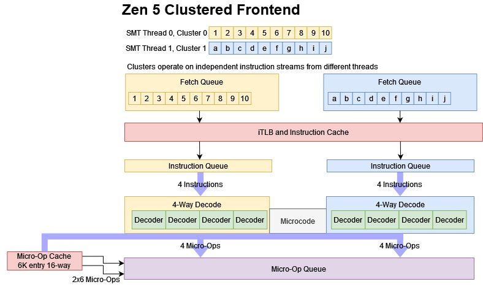

*图 15：表面上类似 Intel E-Core，线程映射方式却不同。最大 Decoder 吞吐要两条 SMT Thread 同时活跃。*

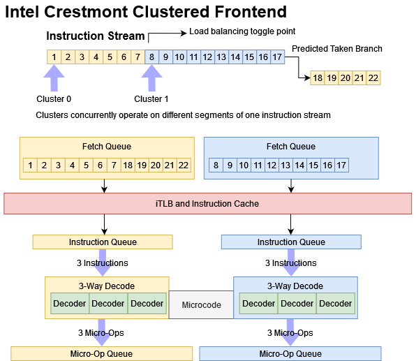

*图 16：单 SMT Thread 在 Op Cache 外只能使用一组四宽 Decoder；插入 Taken Branch 没有提高吞吐。*

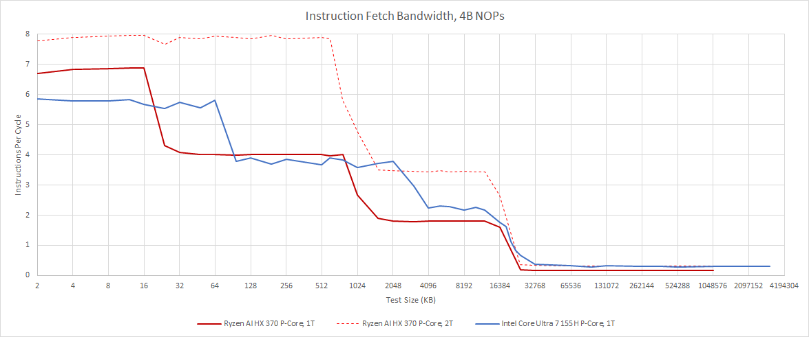

*图 17：两线程各用一组，合计达到八宽。它说明 Zen 5 明显围绕 SMT 优化，而不是证明单线程拥有八宽 Decode。*

6K-entry、16-way Micro-op Cache 可在每周期提供两次 6-wide Fetch，而且两条 Pipe 显然都能服务一个线程。小 Instruction Footprint 或双 SMT Thread 下，Zen 5 指令吞吐高于 Meteor Lake Redwood Cove；单线程溢出 Op Cache 后，Intel 64 KB L1I 和传统 6-wide Decoder 可能反超。

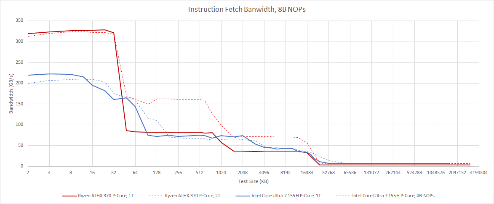

*图 18：x86 Variable-length 使 Byte Supply 可能先于 Decoder 成为限制。AMD Slide 暗示 L1I 可给 64 B/cycle，但实测即便双 SMT 也只有一半；从 L2 取指仍有不错吞吐，双线程更高，可能意味着单线程可排队的 L1I Fill Request 有上限。*

### 体系结构视角：Op Cache 把“译码宽度”变成备用路径宽度

命中 Op Cache 时，Variable-length Decode 与 Instruction Alignment 被绕过；Miss 后才回到 L1I/Decoder。单线程性能要看 Op Cache Coverage 与延迟型瓶颈，双线程则因 Capacity Competition 更常走 Decoder。Front-end Width 应分别报告每条 Source Path，而不是把 4、8、12 任选其一叫“核心宽度”。

## Rename：八宽核心，但部分消除优化仍偏双线程

Renamer 从 Zen 4 的 6-wide 增至 8-wide，其后各 Stage 至少同宽，因此 Zen 5 可称 8-wide Core。Move Elimination 与 Zeroing Idiom Recognition 能解除假依赖，甚至避免消耗 Physical Register。

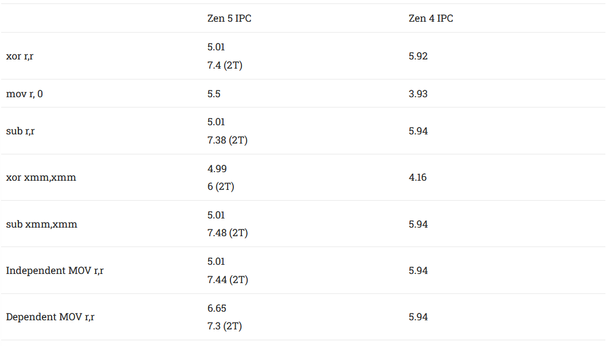

*图 19：这些优化总体可达每周期八条，但单线程未必独享全部吞吐。实际代码很少连续产生八个 Move/Zero，因此限制可能换来更简单电路；双线程的独立指令仍可合计利用能力。*

## 巨型 Backend：Integer 统一，FP 更分散

过去 Zen 的乱序资源常小于同时代 Intel，以低延迟 Cache 补偿 Lookahead。Zen 5 显著增大 ROB、FP RF 和 Load Queue，接近 Golden Cove；Integer RF 增幅较小，可能因为要同时喂 6 个 ALU 和 4 个 AGU 时，继续增加 Entry/Port 的成本很高。Store Queue 虽扩大，Entry 仍为 256 bit，512-bit Store 仍占两项。

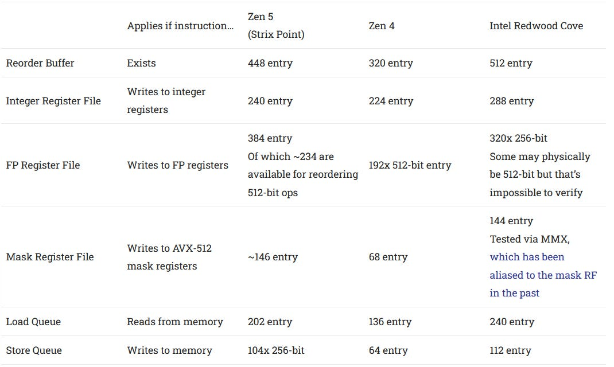

*图 20：容量数字由公开资料与测试反推汇总。真实可见 Window 还受指令类型、SMT 分区、Checkpoint、Physical Register 和 Queue 先满顺序影响。*

移动 Zen 5 的 Vector RF 是不对称混合。测试约有 234 个可供在途 ZMM Write 使用的 Entry；单个 ZMM Write 会让可用 YMM Reordering Capacity 精确少一项，说明 ZMM 不是简单占一对 256-bit Entry。AMD Slide 给出 384 Entry，而若 234 全按两片计算应为 468 个 256-bit Physical Register；这些数字不能用单一均匀阵列解释。Mystical 的测试则显示桌面 Zen 5 所有 Vector RF Entry 都是 512 bit。

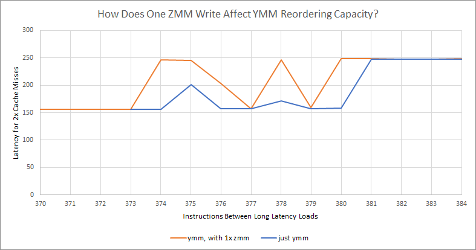

*图 21：英文正式图注给出：一个 ZMM Write 在途时有 379 个 YMM Write，无 ZMM 时为 380；前面的 Spike 可能说明混合 YMM/ZMM 时 Register Reclaim 不够完美。交替写 ZMM/YMM 只到 288 个（各 144），低于理论可分配容量，也显示 Allocate Policy 仍有损失。*

Zen 4 的全 512-bit RF 面积代价尚可，因为 Port 数/宽度更贵；但把容量翻倍后仍全部 512 bit，可能不适合 Mobile。混合两种 Entry 是合理折中，而且 Zen 5 的 512-bit Entry 数仍多于 Zen 4 全部 Vector RF Entry。

### FP/Vector Execution

AMD 历代逐渐增加 FP Scheduler 数量、减少每 Queue 可达 Port，但总 Entry 变化不大。若 Scheduler 满，Rename/Allocate 可先把 FP/Vector Op 放入 Non-scheduling Queue（NSQ），而不是立即 Stall；Zen 5 把 NSQ 从 64 增至 96 项。更大的 RF 使它不再像 Zen 2 那样常在填满 Scheduler+NSQ 前先耗尽 Register。

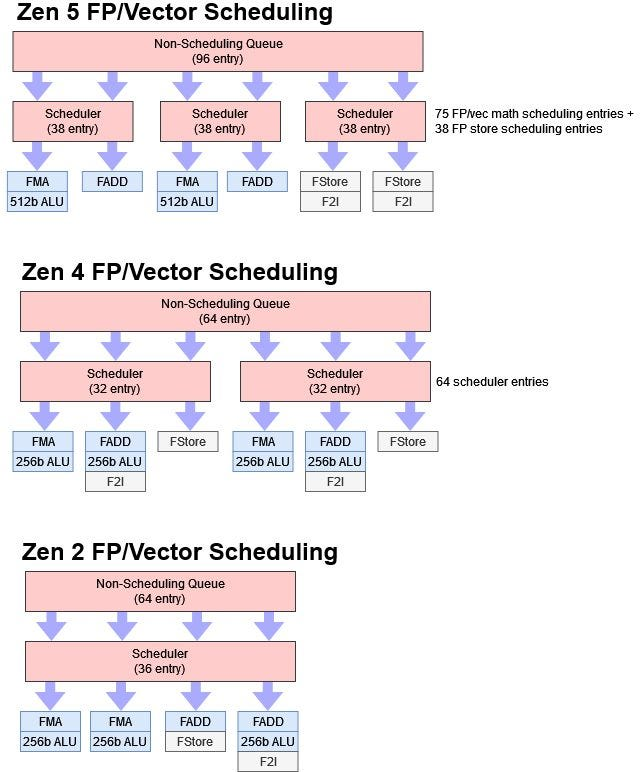

*图 22：四个 FP Math Port 中两条做 Multiply/FMA、两条做 Add；Add/Multiply 3-cycle，FMA 4-cycle。移动版 Math Unit 都是 256 bit，重点是喂饱既有 Unit，而非扩大物理宽度。*

Vector Integer Add Latency 从 Zen 4 的 1 增至 2 cycle；128-bit SSE/256-bit AVX2 Packed Integer Add 从每周期四条降至两条。总 Bit Throughput 仍可达 1024 bit/cycle，但需要 AVX-512 才能触及。更少、更宽的 Integer Vector Port 能减少 Scheduler Dispatch 和 RF Read，节省功耗，却不如前代处理窄向量灵活。

### Integer Execution

Scalar Integer 走向相反：一个统一 88-entry Scheduler，每周期选择六个 Operation，送往六个 Integer Port。它接近 Intel Core 的大统一 Scheduler；Redwood Cove 为 96 Entry、六 Port。

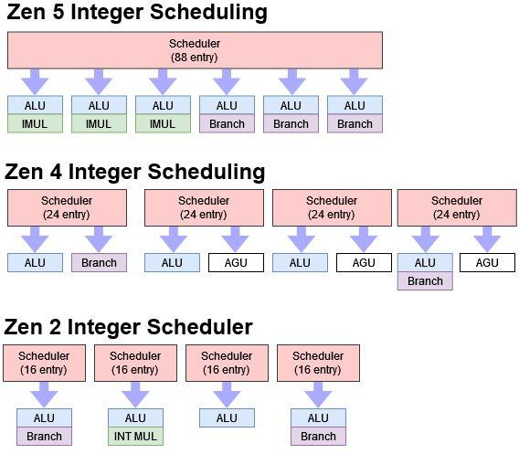

*图 23：统一 Queue 让 Entry 可在不同 Operation 间共享，降低某一分区先满而其他分区空闲的风险。*

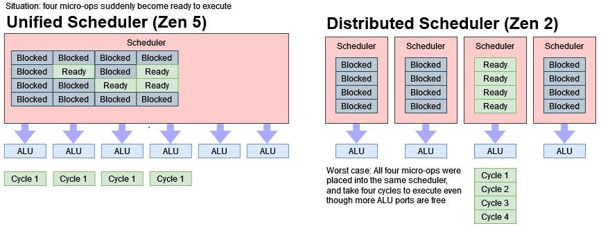

*图 24：分布式 Queue 每个选择器更简单、功耗可能更低，却让 Operation 与 Port 可达性更固定。统一 Scheduler 还可能推迟到 Issue 前才选 Port；AMD 访谈谈到类似方式，但图表不足以独立确认所有细节。*

### AGU 与 Memory Dependency

四个 Address Generation Unit（AGU）由统一 58-entry Scheduler 供给。Zen 4 理论上可给 Memory Op 更多 Scheduler Entry，但必须与 Integer Math 共享。Zen 5 像回到放大版 Zen 2：AGU Queue 与 Integer 分离，容量约翻倍，Port 从三条增至四条；每周期可做四次 Scalar Memory Access，四条都能 Load，最多两条 Store。

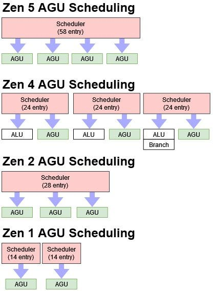

*图 25：AGU 吞吐描述 Address Generation/发射能力，不等于四次访问都能在同周期穿过 Cache、TLB、Bank 与 Data Port。*

若 Load 读取刚被 Store 写入的地址，需要从在途 Store Forward。Load 完全包含在 Store 内时可快速转发；最常见的精确地址匹配可 Zero-latency Forward，这是 Zen 3 引入的能力。四 AGU 让 Zen 5 可同时处理两对 Dependent Load-store，Zen 3/4 只有一对。Golden Cove 类似，但 Load/Store 同时跨 64 B Boundary 时无法 Zero-latency。

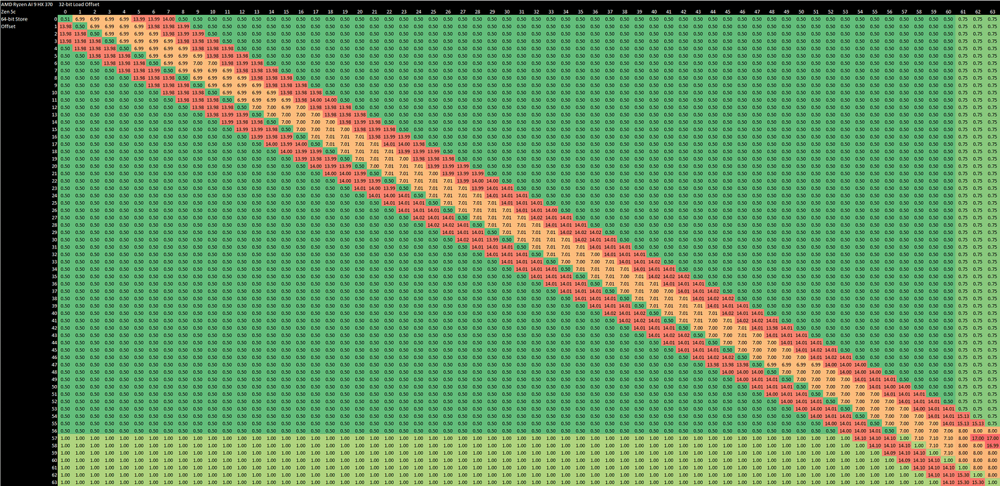

*图 26：英文正式图注说明采用 Henry Wong 的方法。完全包含但非精确匹配为 7 cycle；Partial Overlap 导致快转发失败时约 14 cycle。*

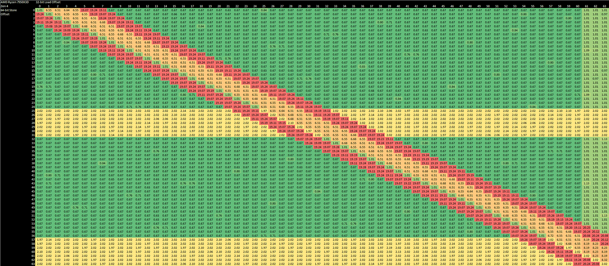

*图 27：Zen 4 偶尔可在 6 cycle 完成包含关系，但失败惩罚约 18 cycle；Golden Cove 快路约 5 cycle，Partial-overlap 失败约 19～20 cycle。Zen 5 的慢路明显缩短。*

独立 Load/Store 显示 L1D 两者都按 64 B 对齐。Zen 2～4 的 Store Alignment 为 32 B、Zen 1 为 16 B，而各代 Load 都是 64 B。Zen 5 每周期可处理一次 Misaligned Store；可能有两个 Write Port，但这仍是由吞吐提出的解释，不是确认结构。

### Address Translation

Zen 5 继续分开 Instruction/Data TLB Hierarchy。Instruction L2 TLB 扩大四倍；Data 两级 TLB 各增加 33%。

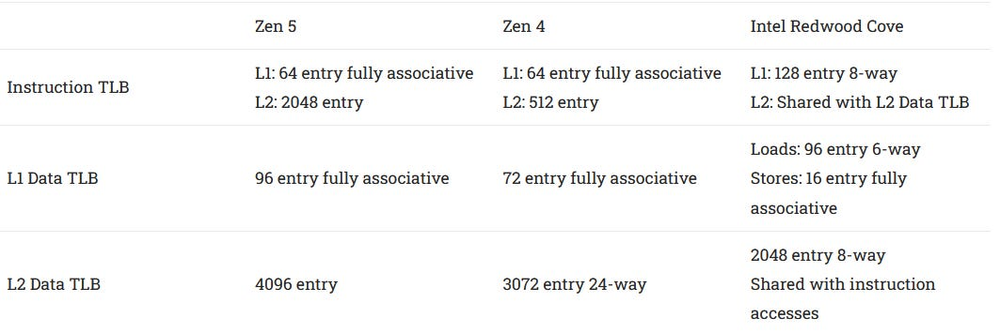

*图 28：L2 DTLB Hit 额外 7 cycle，与 Zen 4 相同，说明容量扩大没有增加可见 Hit Latency。Redwood Cove 的统一 L2 TLB 更小、同为 7 cycle；Reach 不足会增加 Page Walk。*

### 体系结构视角：统一与分布式是选择器复杂度和资源利用率的交换

统一 Scheduler 让任意 Entry 服务更多 Operation，避免局部队列失衡；代价是更多 Wakeup Compare、更宽 Select 和更复杂 Port Arbitration。分布式结构把关键路径切小，却可能在“某 Queue 满、其他 Queue 空”时提前反压 Rename。Zen 5 对 Integer 选择统一、对 FP 继续分散，说明同一核心也会依据 Operation Mix、RF Port 和功耗分别取舍。

## Cache 与 Memory：48 KB L1D，不增加 Hit Latency

L1D 从 32 增至 48 KB，仍是 4-cycle。Strix Point Load Bandwidth 与 Zen 4 相同，为 64 B/cycle；Store 提升到 64 B/cycle，可处理一条 512-bit Store/cycle。这是 Zen 2 后首次增加每周期 L1D Aggregate 能力。

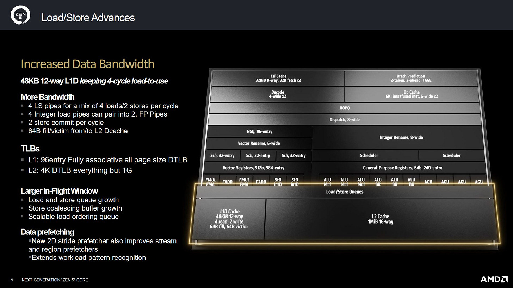

*图 29：L1D 容量、Store Path、L2 双向 Path 和 TLB 都增强；桌面 Zen 5 的 Load 侧还会更宽，不能与 Strix 混写。*

L2 有 64 B/cycle Read 和 Write Path，Read-modify-write 对 L2-sized Array 达约 85 B/cycle；虽未到理论 128 B/cycle，仍明显超过 Zen 4 的 64 B/cycle 上限。

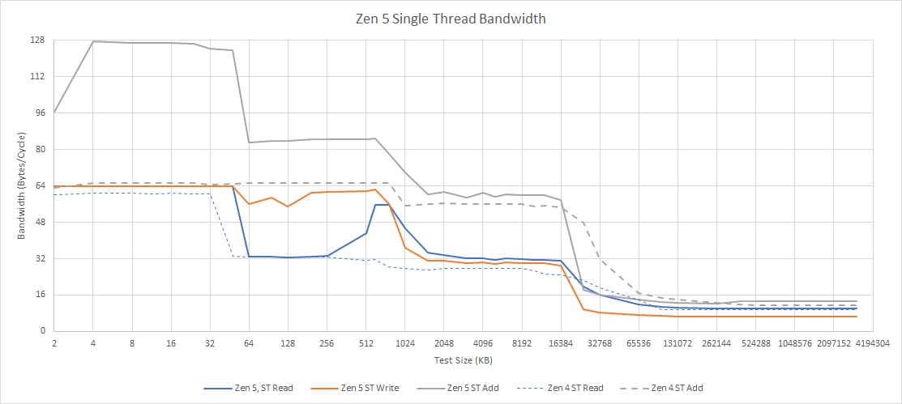

*图 30：混合读写利用两条方向路径，但 Array/Loop、Bank 与内部仲裁使实测低于简单相加。*

单 Core 从 L3 纯读或纯写可达 32 B/cycle，均匀双向混合为 64 B/cycle，受 Core 到 Intra-CCX Interconnect 的 32 B/cycle Interface 限制。它略优于单 Core 无法完全到 32 B/cycle 的 Zen 4。

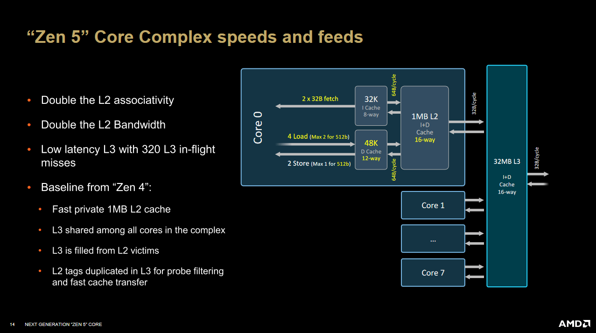

*图 31：双向 Aggregate 不应误写成单向接口翻倍；它说明读写 Path 可并行利用。*

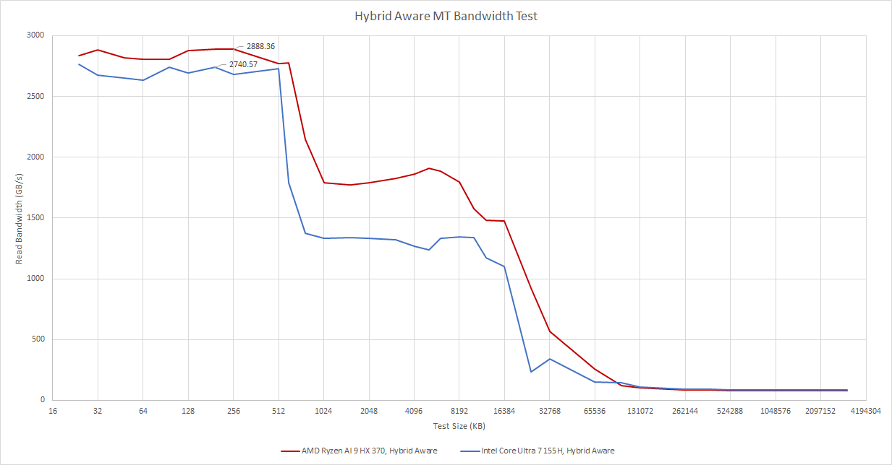

*图 32：Strix 12 核在片上 Cache Bandwidth 上胜过 16 核 Meteor Lake。八个 Zen 5c 与四个高频核同 Architecture，都有 64 B/cycle L1 Load；Meteor Lake Crestmont 只有 32 B/cycle，且四 E-Core 共享 64 B/cycle L2。DRAM 则接近：Core Ultra 155H 83 GB/s，Strix 79.9 GB/s。*

Latency 方面，Zen 5 延续 Zen 4 优势。高性能 Cluster 的 16 MB L3 比前代多 2～3 cycle，换来更大容量；L2 Associativity 从 8-way 增到 16-way，仍保持 14-cycle。

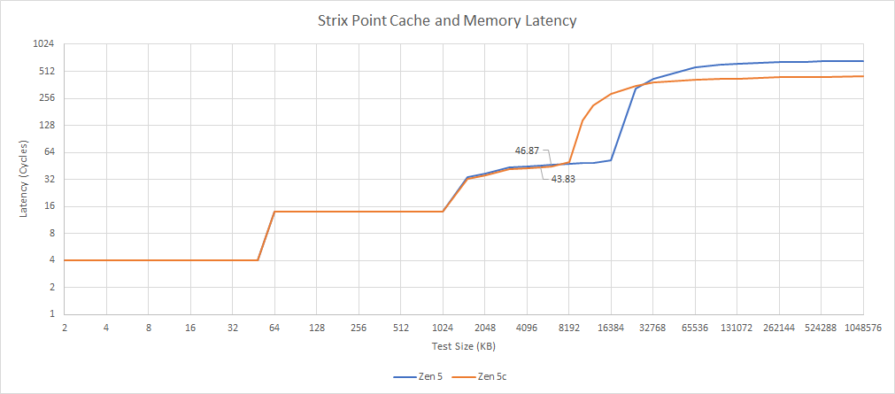

*图 33：高频 Zen 5 在各 Cache Level 的 Absolute Latency 优于 Redwood Cove。Meteor Lake 单 P-Core 可访问 24 MB L3，Strix 的 24 MB 分成 16+8 MB，容量覆盖仍可能让 Intel 在特定 Working Set 获益。*

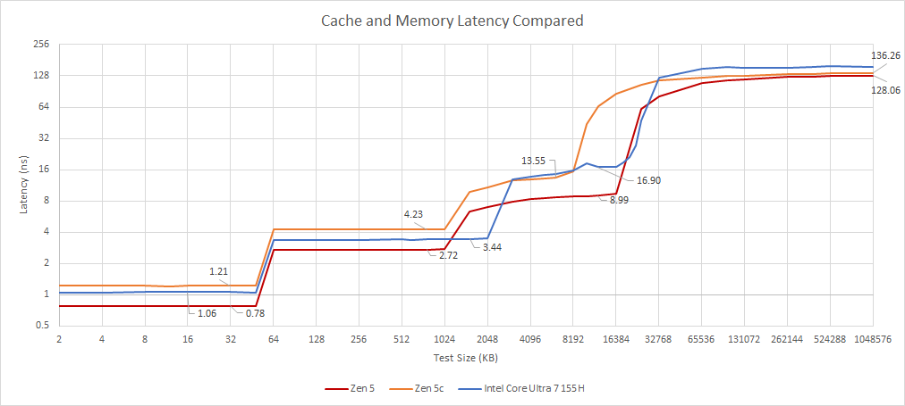

*图 34：Cycle 与 ns 回答不同问题；Frequency 提高会让相同 Cycle 数对应更短时间。Strix DRAM 约 128 ns，优于 Core Ultra 155H 的 148 ns，但明显慢于 DDR5-5600 的 7950X3D（低于 100 ns）。*

### 体系结构视角：Cache 容量、延迟、带宽与可达范围不可合并成一个“更强”

48 KB/4-cycle 说明 L1D 在不增加 Hit Cycle 的前提下扩容；16 MB L3 多 2～3 cycle，则是容量换延迟；两组分离 L3 又限制单线程可触达容量。Bandwidth Microbenchmark 验证 Port/Path，Pointer Chase 验证串行 Hit Latency，真实应用还受 Hit Rate 与 Memory-level Parallelism 影响。

## 轻量性能测试：Memory Subsystem 能压过核心代际

性能测试主要交给更完整的评测媒体，这里只做少量对照。Meteor Lake 平台为 ASUS Zenbook 14 OLED；Video Encoding 还加入 7950X3D，固定到非 V-Cache CCD，最高频率限制为 5.15 GHz。移动平台 Affinity 固定到四个最高性能 Core。

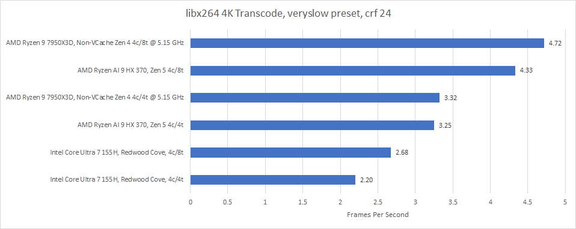

*图 35：同 Core Count、同最高频率下，桌面 Zen 4 仍明显快于移动 Zen 5，因为拥有两倍 L3 和更低延迟 DDR5。Strix 则大幅领先 Meteor Lake。软件 Version/Input/Encoder Option 未完整披露，不宜当成统一产品排名。*

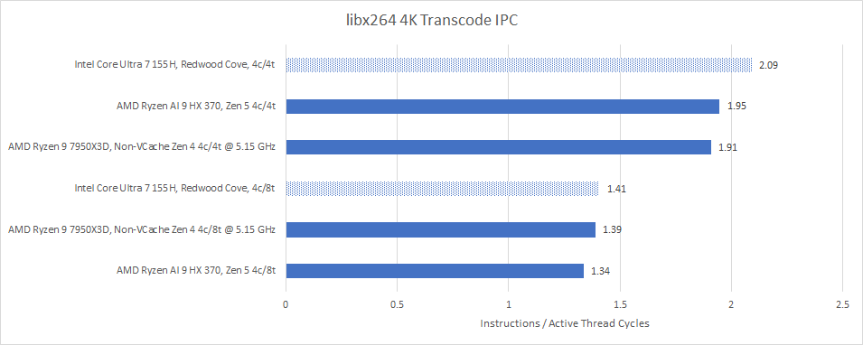

*图 36：AVX-512 是重要因素。Intel 不支持后需要多执行约 10% Instruction，Clock 也较低，因此 Redwood Cove 即便平均 IPC 更高仍落后。AMD 的 AVX-512 物理实现相对保守，却在这项负载产生实际优势。*

AMD 自 Zen 2 起投入大量面积做 Predictor。Zen 5 继续增强，但这项负载里准确率差异小到处在误差范围，显示强 Predictor 已进入 Diminishing Return。

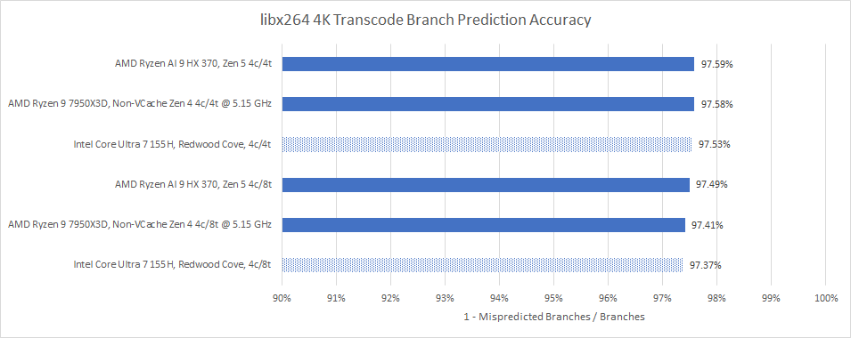

*图 37：不能由这一项“差异不显著”推出 Predictor 升级无效；它只说明此 Workload 的剩余 Mispredict 很少或对新增 Capacity 不敏感。*

## 最后的评价：Zen 5 是一次大改，也是一组有意识的折中

Zen 5 变宽、扩大乱序窗口，并在不增加延迟的情况下扩充 L1D/TLB/BTB 等缓存资源。第一 BTB Level 可在大约 1024 Branch Footprint 下达到两个 Taken/cycle，是很突出的组合。Store Forwarding 失败惩罚降低，也可能意味着 Address Generation 到 Store Retirement 之间的 Pipeline 更短，因为回退重做是处理失败的一条直接路径；这个解释仍需内部时序确认。

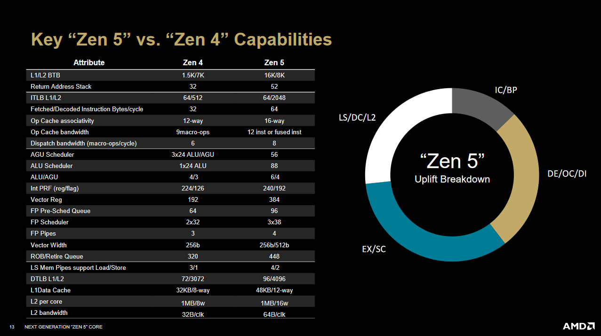

*图 38：Clustered Frontend、新 Scheduler、更多 Execution Unit、Cache/TLB/BTB 和带宽改造共同说明工程量很大，和 Meteor Lake 的小步 Core 更新形成对照。*

Intel 在 Lunar Lake 等 Mobile 产品上转离 SMT，借不同 E-Core/P-Core 获取 Multithread Performance。SMT 本身未必耗很多面积，真正成本在于为两个 Thread 增大 ROB、RF、Queue 等资源，避免每线程容量过少。

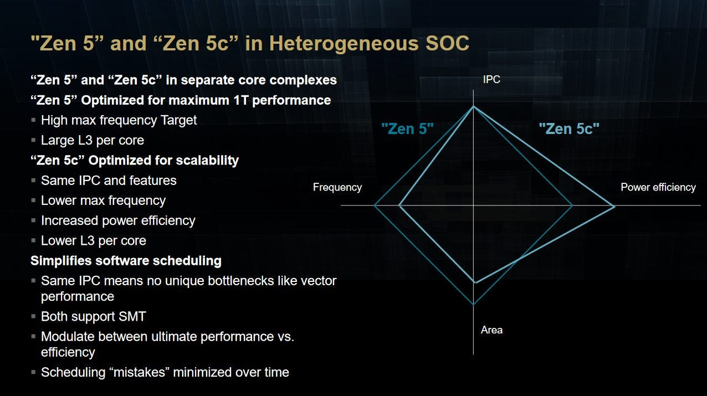

*图 39：Zen 5 采取相反路线：Renamer 与 Decoder 的全部潜力更依赖两线程活跃，再配合 Zen 5c Density Implementation，而不是另造 E-Core Architecture。这也让 AVX-512 可以跨产品线保留。*

统一/分布 Scheduler、是否强调 SMT、如何构成 Hybrid、Vector RF 用 256/512-bit 混合还是统一宽度、IPC 与 Clock 如何平衡，都没有永久正确答案。同一公司也会随代际改变选择。Strix Point 频率只比 Phoenix 略高，因此即使 Headline IPC Gain 与前代换代接近，总性能增幅仍不如那些同时大幅增频的世代。

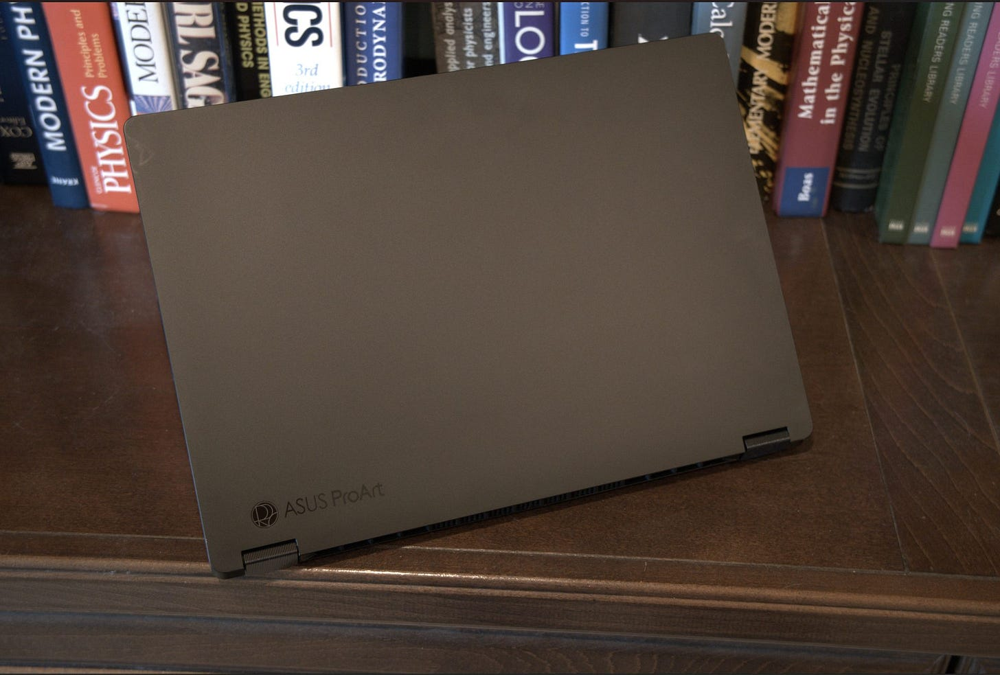

*图 40：单 Die 同时容纳两类 Zen 5 Physical Implementation、RDNA 3.5、NPU、Fabric 与 Memory Controller；Core Microarchitecture 只是 APU 系统预算的一部分。*

### 体系结构视角：从 Strix Point 可以归纳出的七点认识

第一，同一 Architecture 也能组成 Hybrid。Zen 5/Zen 5c 用 Clock、Layout 与 L3 比例分工，换来统一 ISA 与较低调度复杂度。

第二，Branch Predictor 的收益要同时看准确率和及时性。16K L1 BTB、Victim L2 BTB 与双 Taken/cycle 主要减少 Target Supply Delay，不只降低 Direction MPKI。

第三，Clustered Decode 在 Zen 5 上首先服务 SMT。单线程四宽并不矛盾，因为 Op Cache 是主供给路径；双线程才更常需要八宽 Decode Aggregate。

第四，统一 Scheduler 提高 Entry Fungibility，分布式 Scheduler 降低选择器复杂度。Zen 5 在 Integer 与 FP 上分别选择，证明“统一最好”也不是普遍规律。

第五，移动 AVX-512 的重点是能效。保持 1024 bit/cycle 峰值，却让窄向量吞吐下降，是用更少 Port/RF Read 把软件推向宽 Vector。

第六，内存系统能盖过核心代际。同频四核 Zen 4 因更大 L3、更低 DDR5 Latency 胜过 Zen 5 Mobile，说明 IPC 不能脱离 Platform。

第七，资源扩容要防止瓶颈搬家。ROB、Load Queue、FP RF 和 NSQ 变大后，Integer RF、Frontend Latency 或跨 Cluster Coherency 可能成为下一道边界。

## 参考资料

- Chips and Cheese：[*AMD’s Strix Point: Zen 5 Hits Mobile*](https://chipsandcheese.com/p/amds-strix-point-zen-5-hits-mobile)
- AMD：Software Optimization Guide for AMD Family 17h Models 30h and Greater Processors（正文 BTB 条目能力来源）
- Henry Wong：Store-to-load Forwarding Methodology（正文测试方法来源）

感谢 ASUS 提供 ProArt PX13，也感谢 Chips and Cheese 的 Patreon、PayPal 支持者与 Discord 社区。
