# Infinity Fabric 之前：AMD Trinity 的 Northbridge、“Garlic”与“Onion”

> **文章来源**
>
> - 文章：*AMD’s Pre-Zen Interconnect: Testing Trinity’s Northbridge*
> - 撰文：Chester Lam
> - 首发：Chips and Cheese
> - 发布：2025 年 6 月 14 日
> - 链接：https://chipsandcheese.com/p/amds-pre-zen-interconnect-testing

今天的 Infinity Fabric 用统一接口把 CPU、GPU 和内存请求汇聚到 Coherent Slave（CS），借助 Probe Filter 寻找最新副本。2012 年的 Trinity 也想做强核显，却继承了为少量 CPU 核心设计的 Northbridge，只能用两条性质不同的 GPU 链路打补丁。

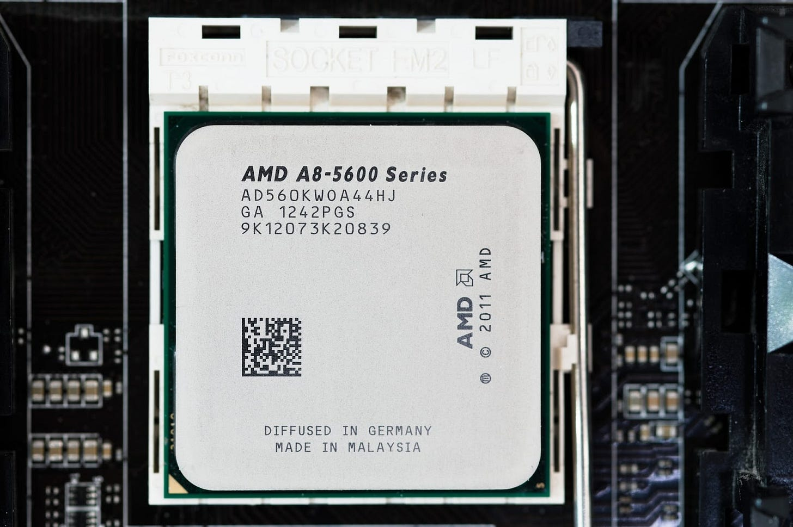

*图 1：AMD 把传统芯片组 Northbridge 移入 CPU 后，原网络主要服务核心与内存；收购 ATI 后才需要紧耦合 GPU。*

测试对象 A8-5600K：Trinity 的精简型号，两个双线程 Piledriver Module、只启用四个 Terascale 3 SIMD，CPU Boost 从完整型号 4.2 降到 3.9 GHz。主板为 MSI FM2-A75MA-E35，内存 16 GB DDR3-1866 10-10-9-26。

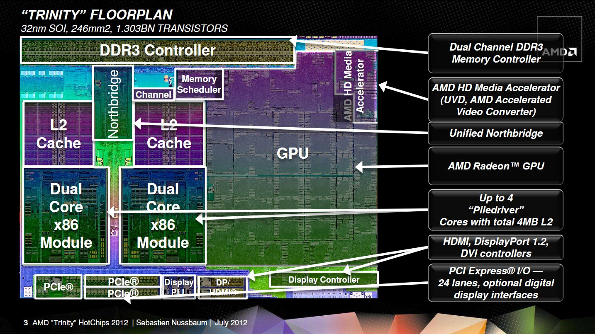

*图 2：平台规格决定所有延迟和带宽数字的可比边界。*

Northbridge 位于独立电压/频率域，在该芯片上为 1.8 GHz。一级 Crossbar 是 System Request Interface（SRI）：接收核心请求，普通内存请求进 System Request Queue（SRQ），Probe 走独立队列；二级 XBAR 再把请求送到 I/O 或内存。

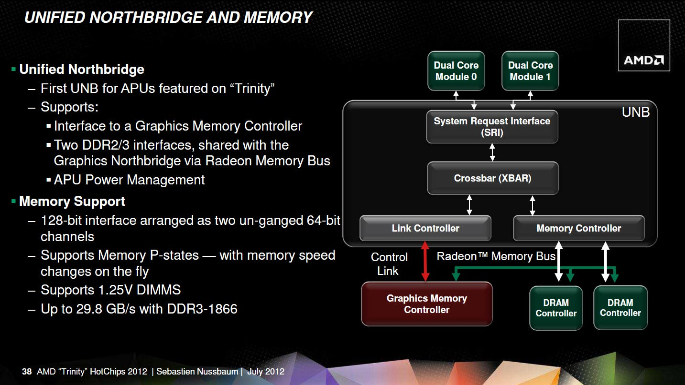

*图 3：两级 Crossbar 降低单个交换矩阵的端口数。*

XBAR Scheduler（XCS）40 项，小于桌面/服务器 Piledriver 的 64 项；默认在 SRI、Memory Controller（MCT）与 Upstream Channel 间分成 22+10+8，BIOS 可调整。MCT 按类型与年龄调度请求、含 Stride Prefetcher，也负责 Coherence Probe 和把物理地址归一化到 DRAM 空间。

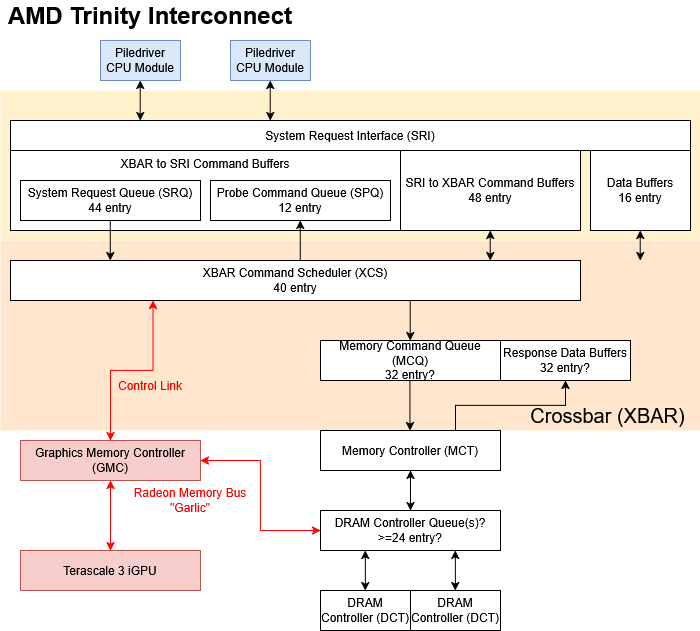

*图 4：40 与 22+10+8 来自 AMD 文档，是公开实现参数。*

GPU 侧有自己的 Graphics Memory Controller（GMC）调度 DRAM。GMC 可绕过 MCT，直接通过 Radeon Memory Bus 到 DRAM Controller，这条高带宽、非一致性链路常被称为“Garlic”；另一条像 I/O 设备一样接入 XBAR 的 Control Link 旧称 Fusion Control Link，即“Onion”。

## Garlic：高带宽，但故意不做 CPU Cache 一致性

GPU 与 CPU 通常各处理自己的数据，若每个 GPU 请求都 Snoop CPU Cache，会制造大量必然 miss 的 Probe。Garlic 绕过 MCT，避免这笔能耗与流量，并可吃满 DDR3。

MCT 与 GMC 仍需防止彼此饿死：限制各自在 DRAM Controller Queue（DCQ）的 Outstanding Request；DCQ 可交替接收两边，或优先 Outstanding 较少者，Trinity 默认前者；延迟敏感的 CPU Read 还可优先。BKDG 提到 GMC→DCT Sideband FIFO 有 4-bit Read Pointer，因此可能最多 16 项，但这是据字段反推。

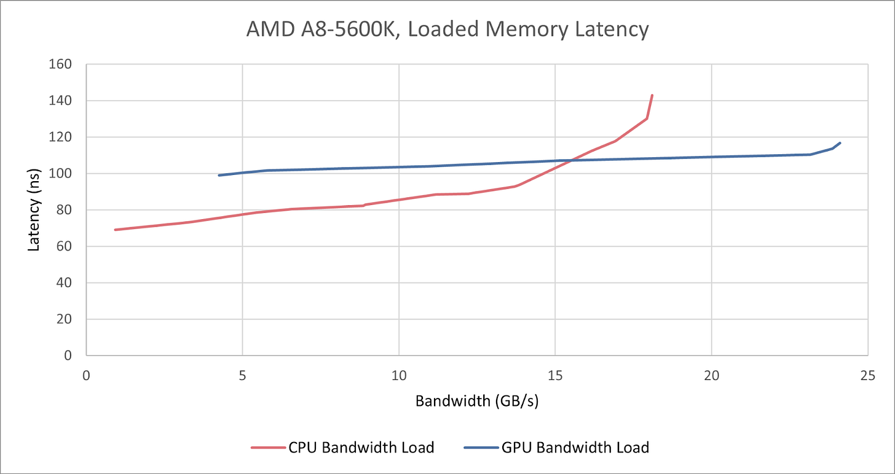

*图 5：独立队列与优先级让高带宽 GPU 不至于完全淹没 CPU。*

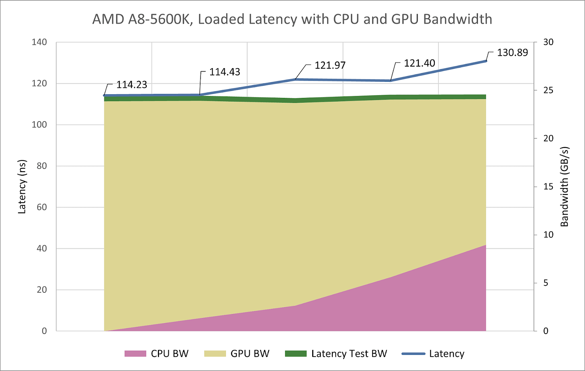

*图 6：GPU 读写超过 24 GB/s 时 CPU 延迟仍低于 120 ns；反而 CPU-only 带宽竞争更差。保留一个线程做延迟测试时 CPU 带宽略超 17 GB/s，四个逻辑线程全做带宽可约 20.1 GB/s。混合负载中延迟主要随 CPU 侧流量升高，支持 SRI/XBAR 比 DRAM 更易争用。*

### 体系结构视角：一致性不是免费的“共享内存开关”

GPU 流量若不需要与 CPU Cache 共享，绕过 Snoop 可节省带宽和功耗；一旦需要 Zero-copy，就必须选择一致性慢路或把 CPU 映射设为不可缓存。现代统一互连的进步，不只是链路更宽，而是 Probe Filter、Home Agent 与目录让“一致”不再等于“广播所有人”。

## Onion：可一致，但只有不到 10 GB/s

OpenCL 可分配 Cacheable Host Memory，再交给 GPU。Onion 请求经 XBAR→MCT，后者可 Probe CPU Cache，因此能读到最新数据。

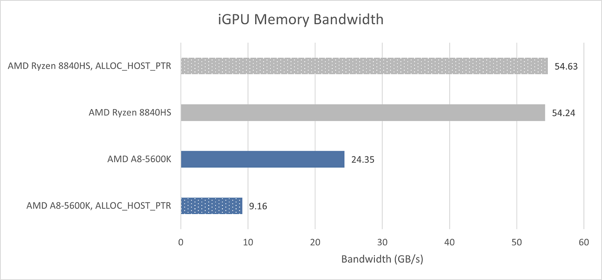

*图 7：同一物理 DDR 背后存在两条逻辑访问路径。*

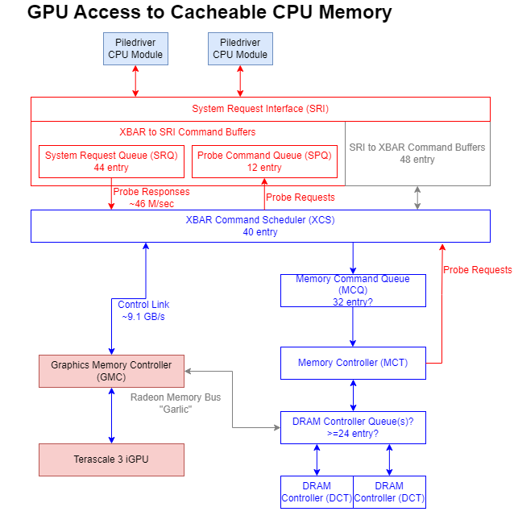

*图 8：Onion 不到 10 GB/s，Probe Response 超过 4500 万次/秒；Trinity 没有 Probe Filter。数量又低于“每 64 B 一次”，表明内部可能有合并或其他过滤，本文无法确认。*

XBAR PMU 把 Onion 统计为 I/O→Memory，Garlic 不过 XBAR、只能在 DRAM Controller 观察。一个很大的 GPU Buffer 即使未加 `ALLOC_HOST_PTR`，超出 Garlic-backed 地址空间后也出现 Onion 流量；若判断成立，额外延迟约 320 ns。

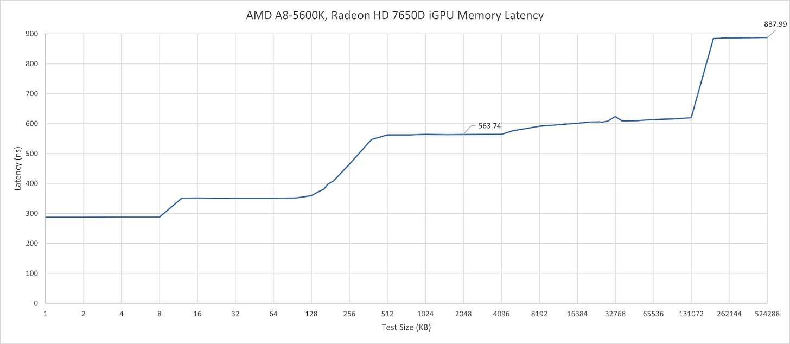

*图 9：计数器相关性支持路径切换，但驱动内部映射没有公开，因此仍是推断。*

## CPU 访问 GPU 内存：Write Combining 与单 Pending Read

另一种 Zero-copy 是用 AMD 的 `CL_MEM_USE_PERSISTENT_MEM_AMD` 把 GPU 内存映射进 CPU。GPU 可继续走 Garlic；Northbridge 不知道 GPU 的最新写入，因而把 CPU 映射设为 Uncacheable，严格说是 Write Combining。

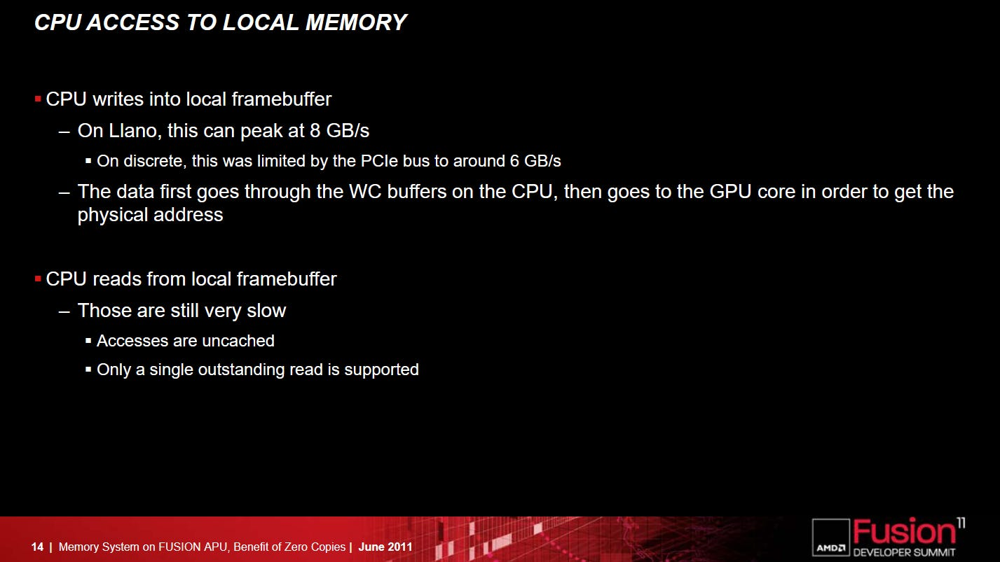

*图 10：CPU 失去 Cache Hit 的容量、带宽和低延迟。*

同 Cache Line 的多个 CPU Read 也不能合并为一次 Fill。SRI 发 Sized Read 而非 Cache Block；Llano 文档称该路径只支持一个 Pending Read，Trinity 实测也符合。

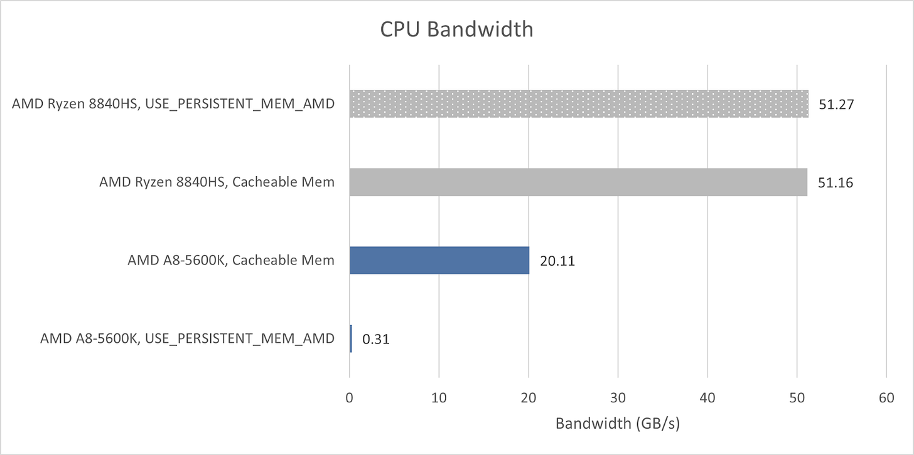

*图 11：缺少 Memory-Level Parallelism 后带宽骤降；仅 8 KB Pointer Chain 就约 93.11 ns，而 2 MB页的普通 Cacheable 内存在 1 GB 工作集仍低于 70 ns。驱动页大小未披露，8 KB 用于尽量排除 TLB miss。Ryzen 8840HS 上 GPU 映射仍可 Cache，访问两边延迟无明显差别，但绝对主存延迟超过 100 ns。*

## 实际工作负载中的两条链路

Unigine Valley 是 2013 年 DX11 Benchmark，GPU 流量主要不经过 XBAR，CPU 常低于 3 GB/s，总 DRAM 峰值 17.7 GB/s（1 s 采样）。

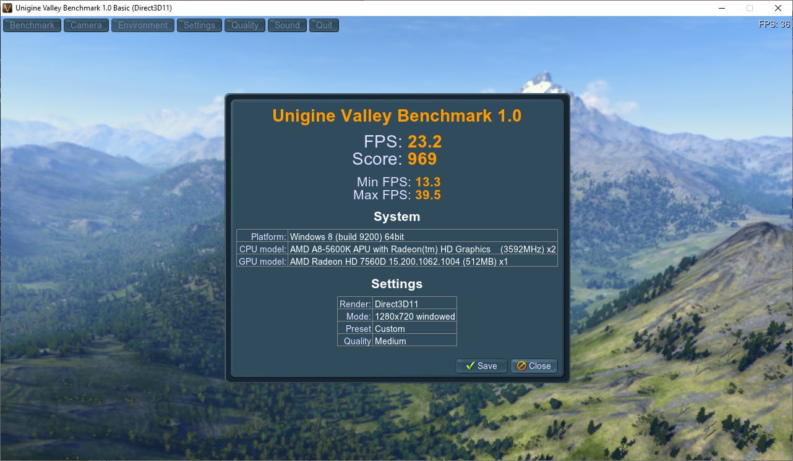

*图 12：作为 Trinity 同时代图形负载。*

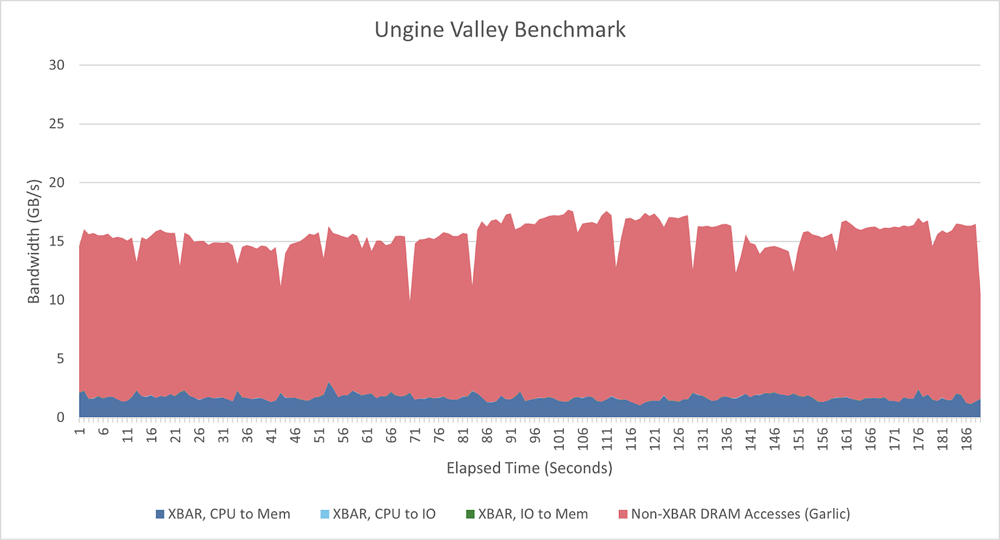

*图 13：总流量减去 XBAR 可见部分，可近似观察 Garlic。*

FF14 Heavensward 用 1280×720、Standard (Laptop)，平均 25.6 FPS；DRAM 峰值 22.7 GB/s，CPU 多在 3～4 GB/s、偶尔 5 GB/s，大头仍是 Garlic。

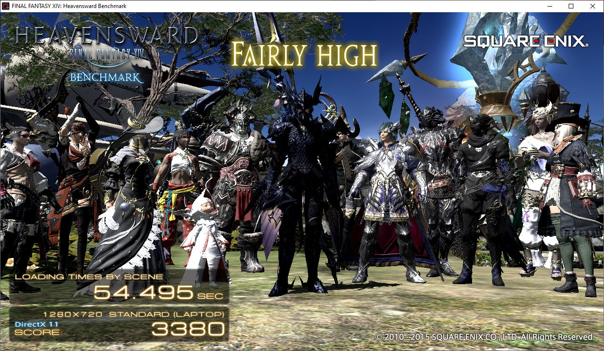

*图 14：游戏把“Fairly High”作为评级，帧率只是场景背景。*

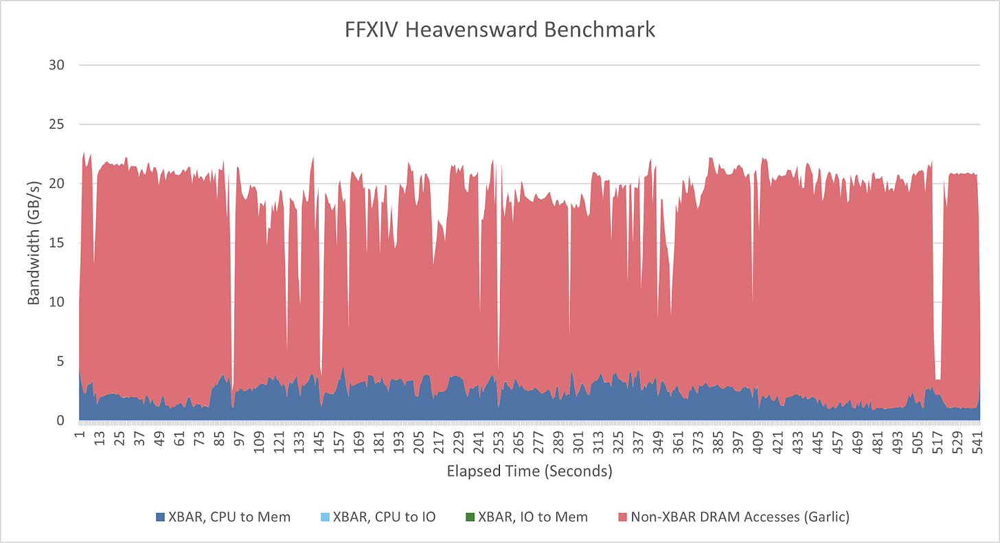

*图 15：DDR3-1866 已承受较高流量，但仍有余量。*

ESO 使用 1920×1080 Low、FSR Quality，常低于 20 FPS；CPU 在多人区域可到高 4 GB/s，总流量低于 16 GB/s。

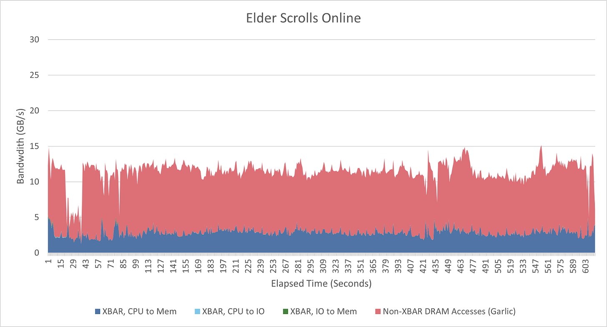

*图 16：不同游戏对 CPU/GPU 带宽比例差异很大。*

RawTherapee 处理 Nikon D850 45 MP RAW，只用 CPU；多数流量经 XBAR，核显只承担双 1080p60 显示与少量 UI。

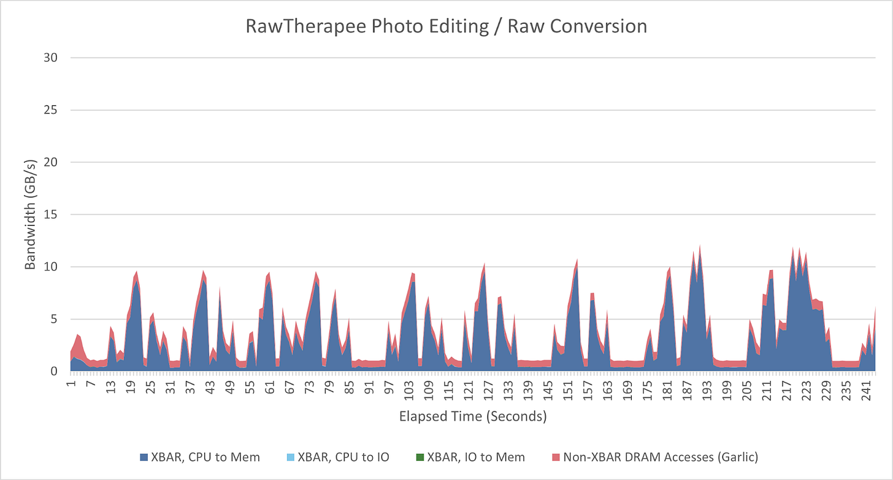

*图 17：验证 XBAR 计数与工作负载性质一致。*

Darktable 可把部分处理卸载到 GPU，CPU/GPU 混合，I/O→Memory 的 Onion 也不再只是误差；SSD 流量也可能计入，但此负载中应很小。

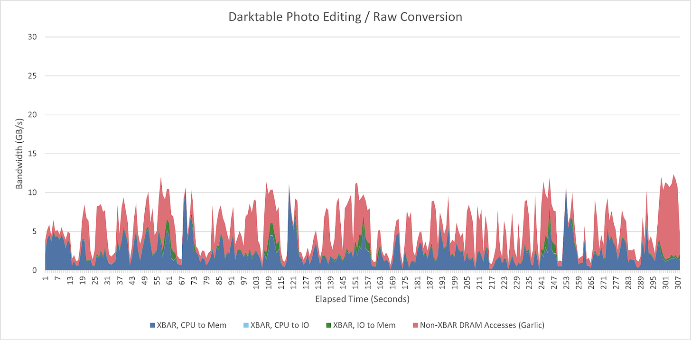

*图 18：它最接近 AMD 当年设想的 APU Compute 用法。*

## 结语：不优雅，但足以让强核显起步

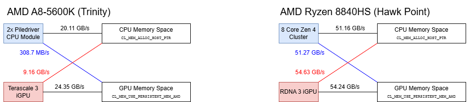

*图 19：现代 CS+Probe Filter 可让 CPU/GPU 走统一一致性路径；Trinity 则在高带宽非一致与低带宽一致之间二选一。*

Intel Sandy/Ivy Bridge 已把 GPU 放到与 CPU 核心、L3 相同的 Ring 上，天然成为 L3 Client；AMD 当时核显更强，却要承受跨地址空间性能惩罚。好在纯图形负载走 Garlic 时并不会破坏 CPU 延迟。Trinity 的 GPU 只有 512 KB 只读 L2 Texture Cache，CPU 又无 L3，因此 DDR3 流量很高，但实际游戏仍未完全耗尽带宽。它不是理想统一系统，却完成了 2010 年代初期 AMD APU 的工程目标。

## 参考资料

- Chester Lam, *AMD’s Pre-Zen Interconnect: Testing Trinity’s Northbridge*, Chips and Cheese, 2025-06-14
- AMD Trinity BIOS and Kernel Developer’s Guide（BKDG）
- AMD OpenCL 扩展 `CL_MEM_USE_PERSISTENT_MEM_AMD`
