# Van Gogh：Steam Deck 的 Zen 2 + RDNA 2 定制 APU

> 英文标题：Van Gogh, AMD’s Steam Deck APU
> 撰文：Chester Lam
> 首发：Chips and Cheese，2023 年 3 月 5 日
> 链接：https://chipsandcheese.com/p/van-gogh-amds-steam-deck-apu

Zen 2 不只让 AMD 桌面重回竞争，也能缩到低功耗 Monolithic Die。Lucienne、Mendocino 延续 Zen 2，Van Gogh 则在 TSMC 7 nm 上把四个 Zen 2 与 RDNA 2 组合，专供 Steam Deck，系统只报告 “AMD Custom APU 0405”。它不是普通笔记本芯片，而是一颗围绕掌机游戏重新分配 CPU、GPU、内存与功耗的迷你 Console SoC。

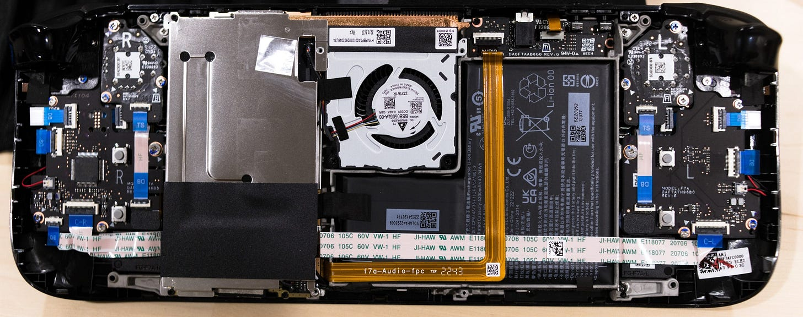

## Board、Memory 与 16 W Power Budget

16 GB LPDDR5 由两颗 8 GB Samsung Package 构成，四个 32 bit Channel、5500 MT/s，理论 88 GB/s。Valve Jupiter 主板提供 M.2 x4，并各用 PCIe x1 连接 Micro-SD Controller 与 Realtek 8822CE Wi-Fi。

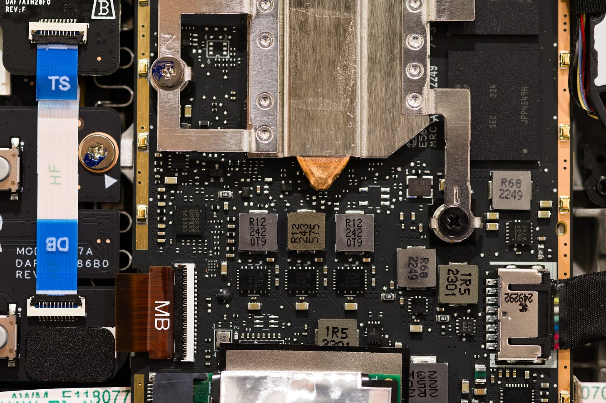

MP2845 控制三相供电，可能分成两相与一相 Rail。APU 约限制 16 W，因此规模不大的 VRM 足够。功耗在 CPU/GPU 间动态分：GPU-bound 游戏可让 GPU 超 10 W、1.6 GHz，而 CPU 被压到 Base 以下只得 2～3 W；CPU-only 则相反。

这适合主要卡一侧的游戏，却不适合 CPU/GPU 同时满载的 Renderer 或 Photo Compute。Steam Deck 并不以这类负载为目标。

## CPU：四核单 CCX，Cache 后面问题很大

四个 Zen 2 在单 CCX，Base 2.8、Boost 3.5 GHz，没有 PS5 那种削弱 FPU。Core-to-core Test 也确认四核八线程单 Cluster。

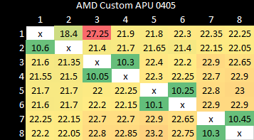

L3 仅 4 MB，与 Renoir 相似，远小于 Desktop/Server Zen 2 每 CCX 16 MB。SteamOS 默认 `schedutil` 下 Latency Test 几乎看不到 L3；改 `performance` Governor 后才显现，但仍很差。Windows 下合理，说明不是 APU 硬件缺陷，而与 OS Power Policy 有关。

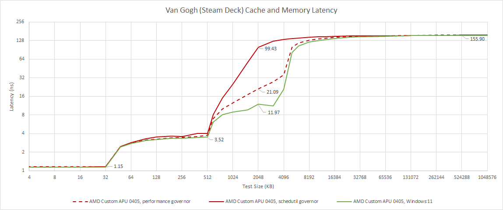

L1D 四周期、L2 十二周期，与普通 Zen 2 一致。

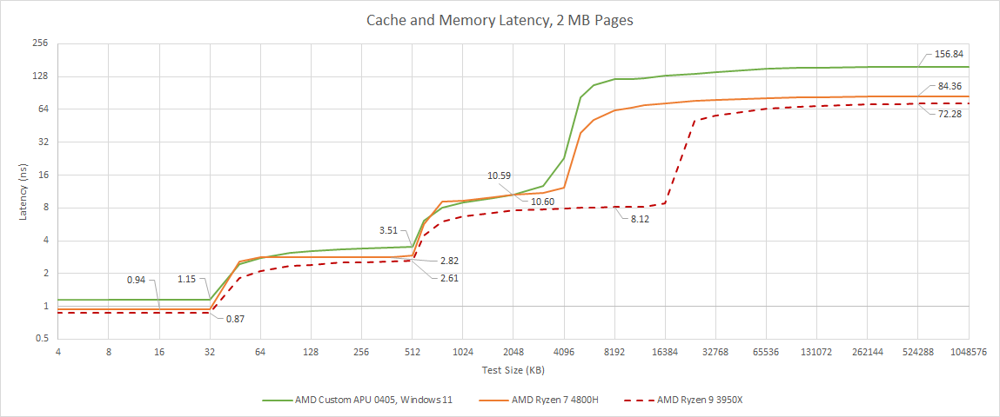

真正严重的是 LPDDR5：DRAM 接近 150 ns，Windows 11 也同样差，更像 Memory Controller 问题而非节能策略。

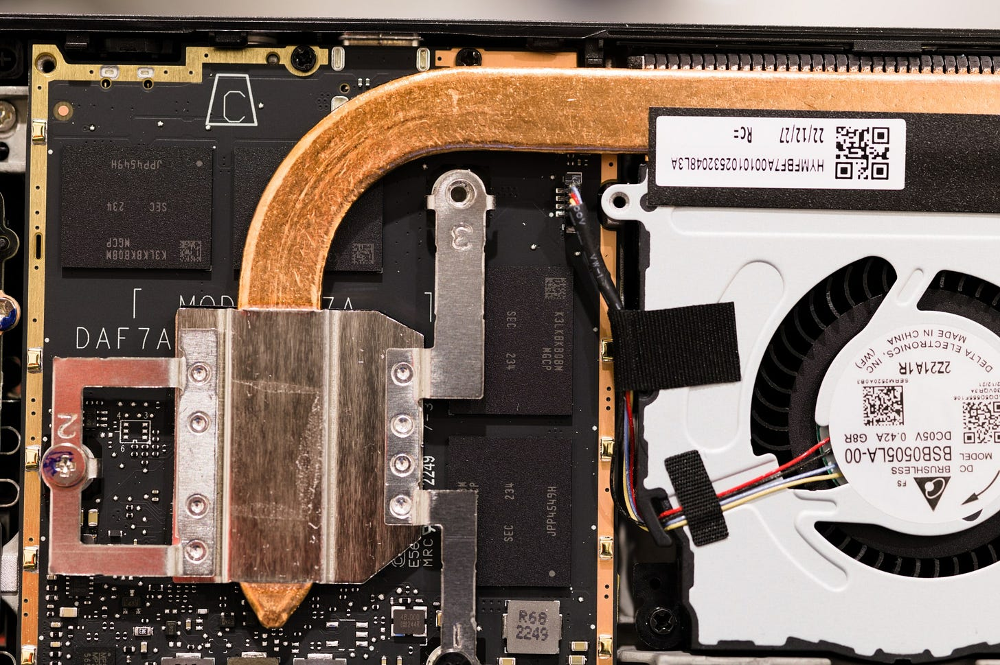

对照 4800H 为 DDR4-3200 22-22-22-52，虽是宽松 JEDEC Timing，Latency 仍远好于 Van Gogh。

## CPU Bandwidth：理论 88 GB/s，实得约 25

All-thread L3 超 200 GB/s，Windows/Linux 一致；频率较低使其略低于其他 Zen 2，但结构无明显带宽故障。

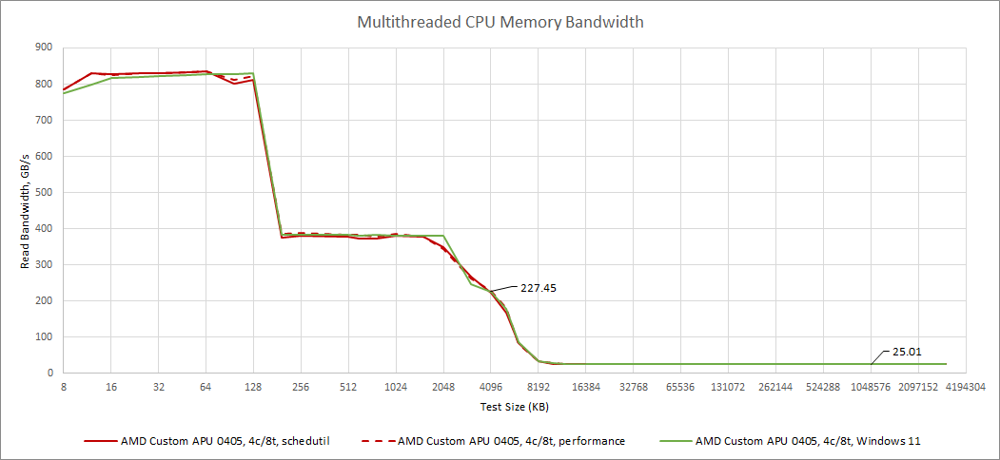

DRAM 却只有约 25 GB/s。Read/Write Turnaround、Page Miss 等都会损失理论值，但四通道 LPDDR5-5500 得到这个数字明显不合理；芯片本身标称甚至可到 6400 MT/s。

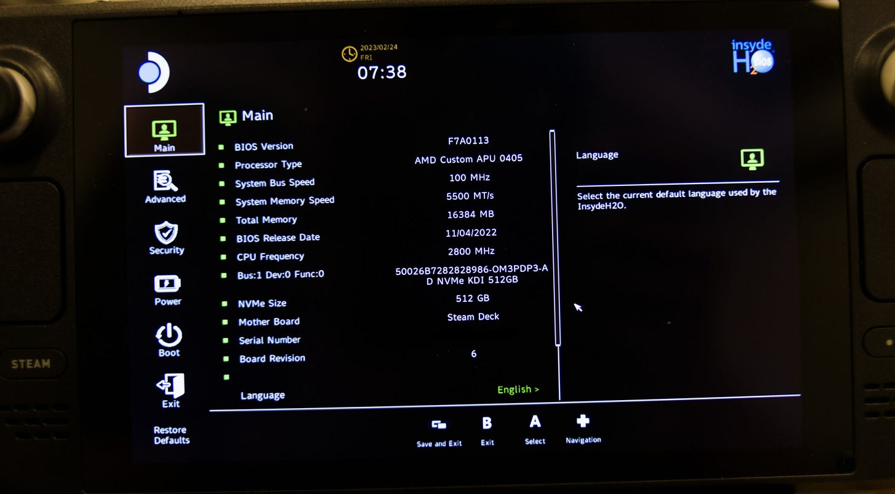

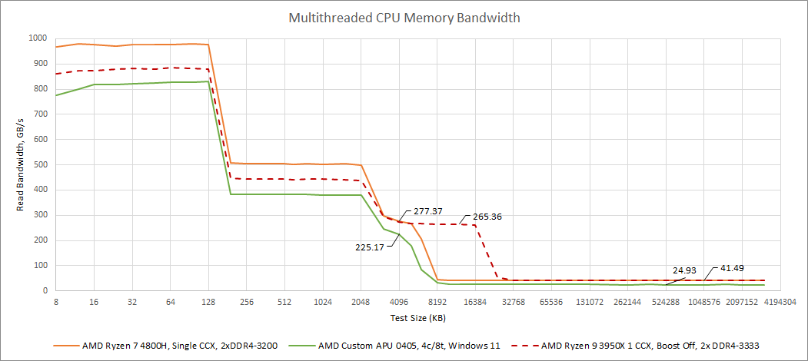

即使把 Renoir 限在单 CCX，仍大幅领先；i5-6600K 双通道 DDR4-2133 都约 27 GB/s。小 L3 又让 CPU 更频繁落到这条慢路径。

Cyberpunk 2077 关闭 Ray Tracing、约 100 FPS 时，使用经过已知流量校准的 Undocumented Counter 测 DRAM Demand。

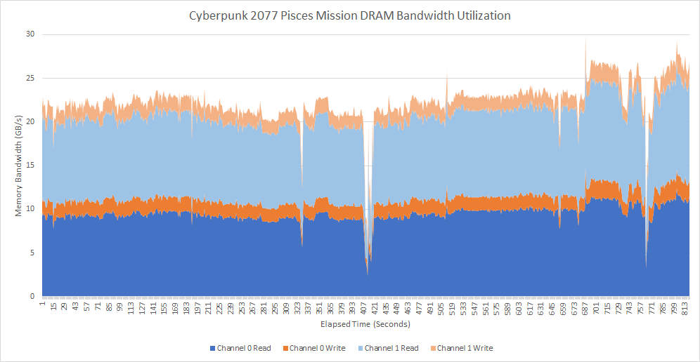

连 16 MB L3 的 Desktop Zen 2 都会需要超过 25 GB/s，4 MB Van Gogh 压力更大。Counter 未公开，因此数字应作为趋势证据。

### 体系结构视角：统一内存带宽不是对所有 Agent 对称

同一 LPDDR5 在 GPU 侧能超过 70 GB/s，CPU 侧却只有约 25 GB/s，说明瓶颈可能在 Fabric Port、Controller Policy、Read Pattern 或功耗配置，而非 DRAM Pin 本身。验证 Unified Memory 必须从 CPU、GPU、Copy Engine 分别发流量，不能拿理论总线带宽替代每个 Agent 的可达带宽。

## Clock Ramp：近一秒才到最高频

负载开始后从 1.4 GHz 到 1.7 GHz 只需 0.27 ms，说明硬件可快速改频；随后却停数百 ms，再缓慢上升，接近一秒才到 Max。

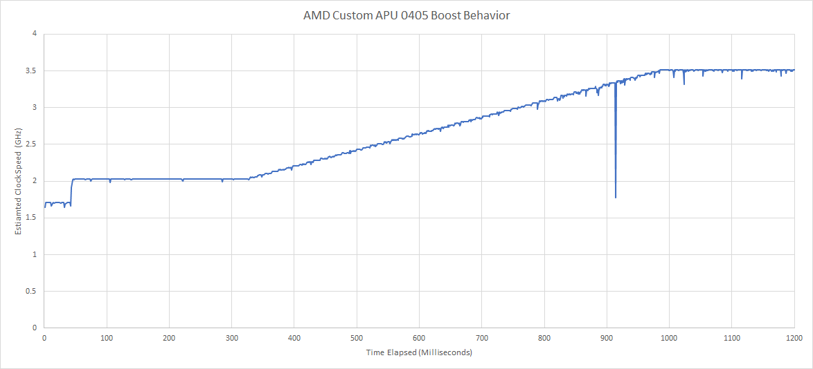

Renoir 约 9.35 ms，Piledriver/Haswell 也低于 100 ms。Windows/SteamOS 都如此，像是 Valve 为续航刻意牺牲短交互响应；Steam Deck 主要跑持续游戏，不以 Web Burst 为核心场景。

## GPU：RDNA 2 的层级与 LPDDR5 带宽

Custom GPU 0405 为四 WGP、512 FP32 Lane，最高 1.6 GHz。相对 RX 6900 XT 在 0.8 V 也可约 1.7 GHz，它明显优先低功耗。没有 OpenCL Driver，测试使用 Nemes Vulkan Suite。

每 WGP 前有 16 KB Vector/Scalar L0，后接 128 KB L1，再到偏大的 1 MB L2；按 RX 6900 XT 的 L2/Compute 比例，四 WGP 应不到 512 KB，因此 1 MB 用于隔离共享 DRAM。

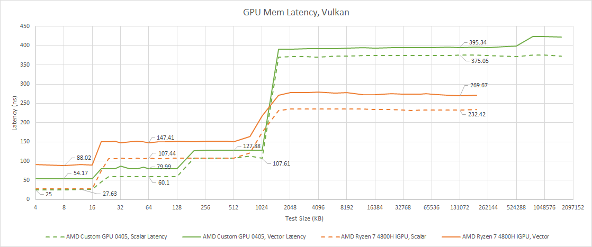

RDNA Vector Memory Latency 明显优于 Renoir Vega；Scalar Cache 两者接近。128 KB L1 给 RDNA 优势，L2 Latency 仍相似。

DRAM Latency 依旧糟糕，但 GPU Bandwidth 终于超过 70 GB/s，远胜 Renoir。

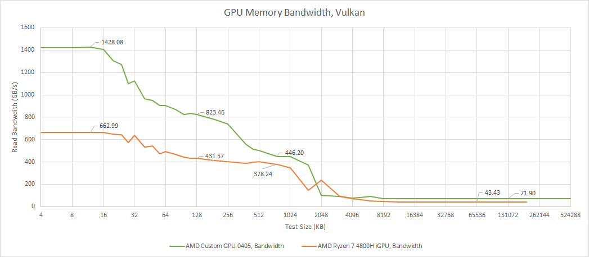

Integrated GPU 工作集大、Cache 难覆盖，还要与 CPU 争 DRAM；这使高 LPDDR5 带宽非常关键。

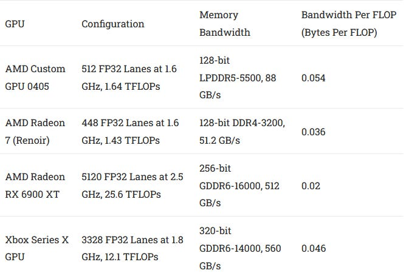

其比例接近 Console，无需 Infinity Cache；小 GPU 可直接靠 DRAM Bandwidth，避免大 Cache 面积。

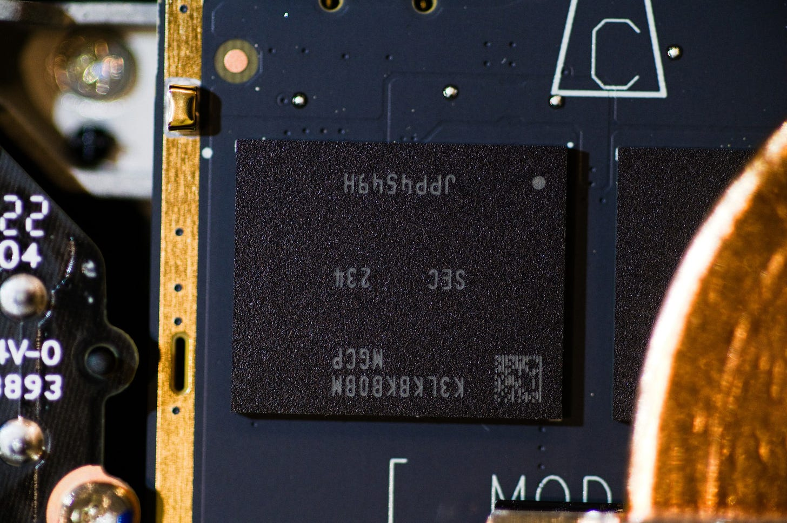

把 Desktop RDNA 2 锁到同频后，Van Gogh 到 L2 前行为相近，较小 L2 甚至更低延迟；Client 少、阵列小更易优化。

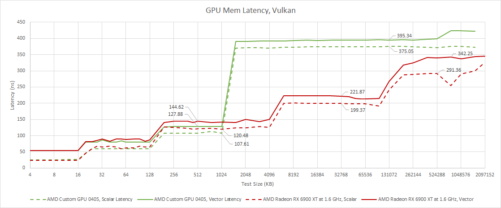

越过 L2 后 Desktop 的 Infinity Cache 出现，Van Gogh 缺失，但用高 DRAM Bandwidth 补偿。

## Math Throughput 与 CPU-GPU Transfer

Custom GPU 与 Renoir iGPU 规模接近，差距部分来自 4800H 只启用 7/8 Vega CU。

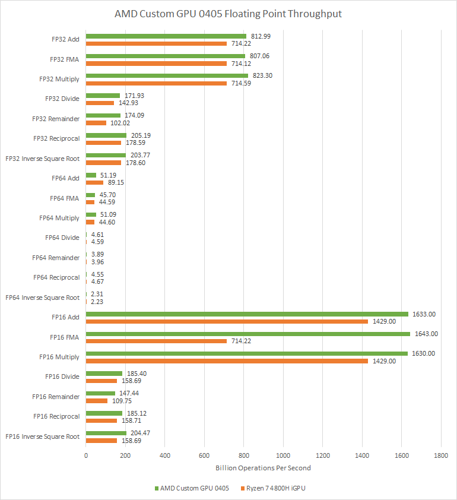

常用 FP32 Full-rate，Divide/Reciprocal/RSQ 等约 Quarter-rate；FP64 都不重视，Vega FP64 Add 约 1:8，Mul/FMA 接近 1:16。FP16 打包通常 Double-rate，但 Renoir FMA 未测到；Special Operation 也无明显 FP16 加速。

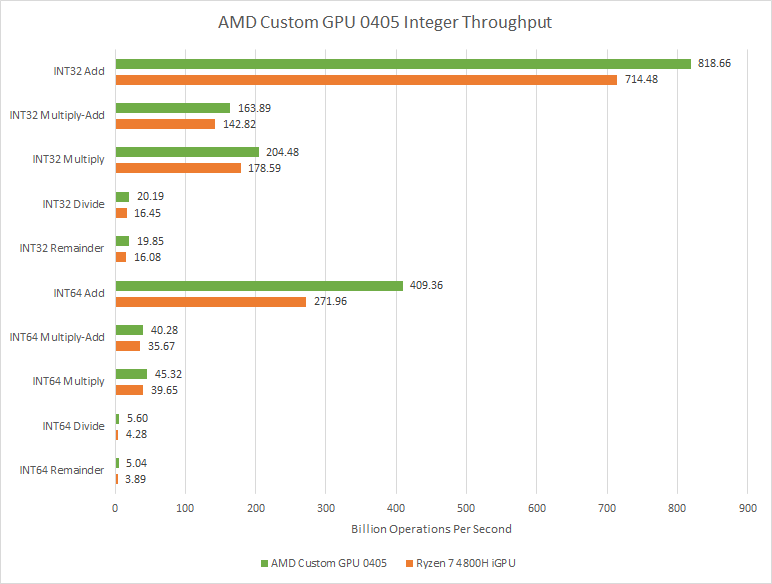

Integer Add Full-rate，Multiply Quarter-rate，Divide/Remainder 很低。Van Gogh 的 64 bit Vector Integer 明显领先，原因不明确；两架构通常都用两次 32 bit Add-with-carry 与 VCC 处理。

Integrated Memory 还让 CPU↔GPU Copy 不受 PCIe 限制。

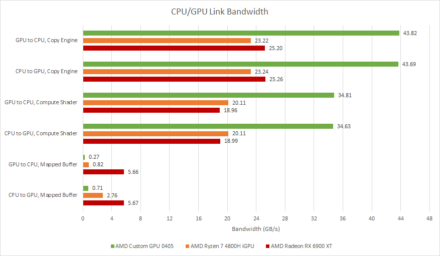

Van Gogh 高于 Renoir，也高于受 PCIe 4.0 限制的 RX 6900 XT。Gaming 通常不敏感，但 CPU/GPU 迭代 Compute 有用。

## 结语：CPU 让步，GPU 优先

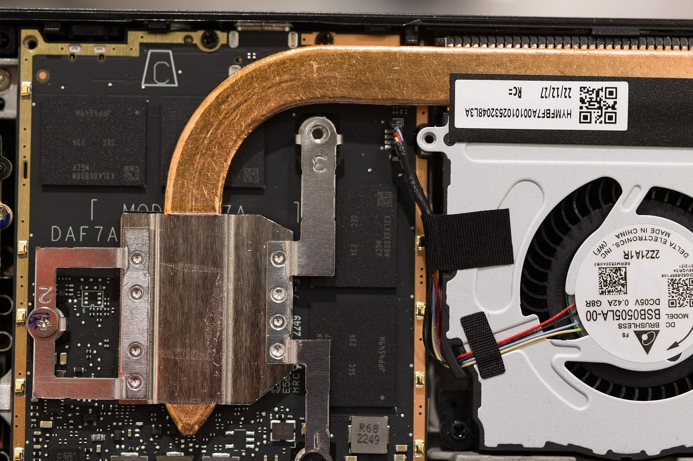

单 CCX、3.5 GHz、慢 Ramp、小 L3、高 CPU DRAM Latency/低 Bandwidth 都牺牲了 CPU；GPU 也低频、规模不大、无 Infinity Cache，却保留 RDNA 2 的优秀层级，并得到足够 LPDDR5 Bandwidth。

这是一颗小 Console APU，而不是 Renoir/Cezanne 替代品。Zen 2 CPU 即使被限制，仍远强于 Switch 的低频 Cortex-A57；AMD 同时掌握强 CPU/GPU IP，才能围绕 Steam Deck、PS5、Xbox 做这种定制平衡。

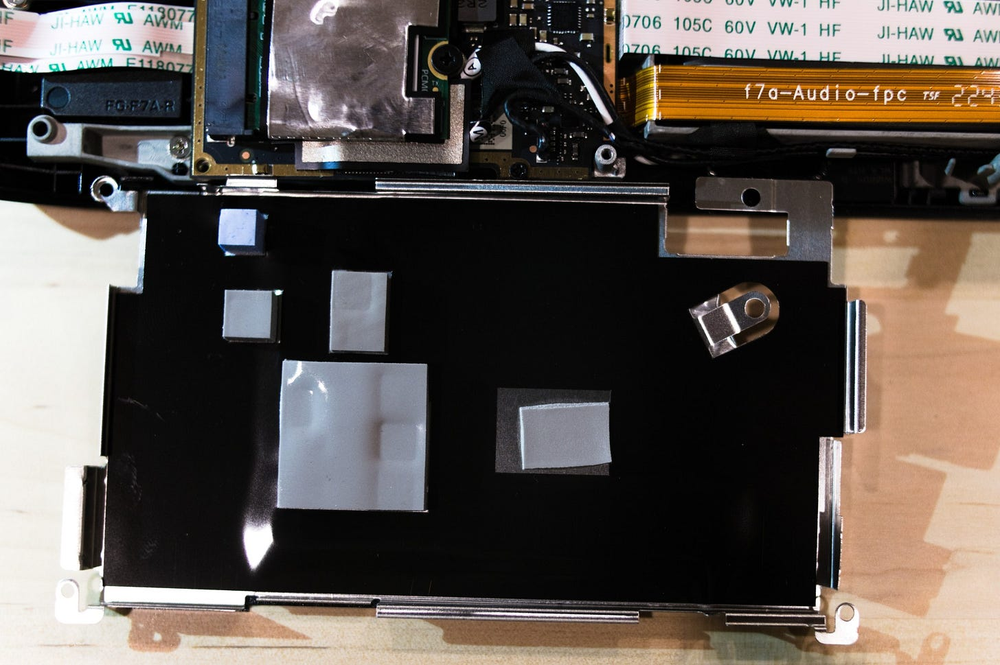

文章的“CPU Memory Controller 问题”和政策解释建立在实测现象上，没有 RTL 证实；OS、Firmware 版本和 Undocumented Counter 也构成边界。结论应限定在被测 Steam Deck，而不是全部 LPDDR5 或 Zen 2。

## 参考资料

- Chips and Cheese：Van Gogh, AMD’s Steam Deck APU
- Valve Steam Deck / AMD Custom APU 0405 实测
