# Zen 2 为什么能在 Cinebench R15 单线程领先 Skylake

> **文章来源**
>
> - 文章：*Analyzing Zen 2’s Cinebench R15 Lead*
> - 撰文：Chester Lam
> - 首发：Chips and Cheese
> - 发布：2021 年 2 月 22 日
> - 链接：https://chipsandcheese.com/p/analyzing-zen-2s-cinebench-r15-lead

Cinebench R15（CBR15）基于 Cinema4D 渲染引擎，通常用于多线程跑分；这里专门分析单线程。Zen 2 的领先并不是“执行单元更宽”这么简单，而来自更准的分支预测、更大的中层 Cache，以及能容纳更多待执行 FP 微操作的后端。

页面按 Zen 2 与 Skylake 架构给出计数器结果，没有在正文完整列出具体 SKU、内存配置、操作系统和重复次数。分析依赖每个 Tile 的 1 s PMU 采样，适合解释这次 CBR15 运行中的相关机制，不应外推为两代处理器的全面排名。

## 工作负载：SSE 多，但向量算力不重

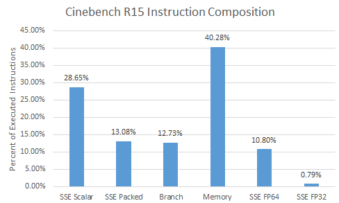

*图 1：用 Intel SDE 收集，类别不完整且部分重叠。SSE 占 41.7%，几乎不用 AVX，多数 SSE 为 Scalar；FP64 Multiply 6.51%、Add 3.73%，超过 40% 指令访问内存，Load 约为 Store 三倍。*

每个渲染 Tile 行为不同。计数器以 1 s 采样，因而可把阶段 IPC 与 Branch Accuracy、Cache Hit Rate 作相关图；相关性只能帮助定位，不自动证明因果。

## 分支预测：96% 对 94.9%，转成每千条就是明显损失

错误预测会取错路径，解析后 Squash 并从正确 Target 重填流水线。

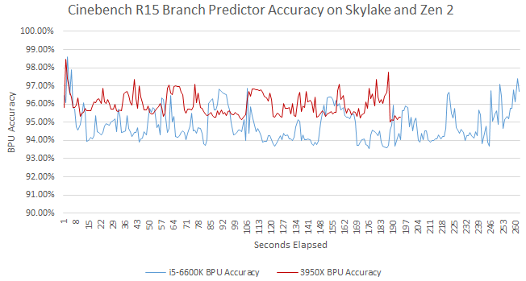

*图 2：Zen 2 平均 96%，Skylake 94.9%。*

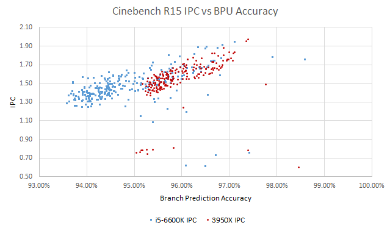

*图 3：两者都呈明显正相关。*

按指令归一化，Zen 2 为 5.15 Branch MPKI，Skylake 6.45，后者多 25%。Zen 2 前端每退休一条指令供给 1.39 个 Op，Skylake 1.63，浪费的前端带宽高约 17%；两者本负载退休 Uop/Instruction 约 1:1，不能用译码展开差异解释。

AMD 手册称 Zen 2 Mispredict 常见约 16 周期、范围 12～18；Agner Fog 测 Skylake 15～20。按保守惩罚估算，每千条 Skylake 至少损失 96.75 周期，Zen 2 约 82.4，后者少 17.4%。该算术估算不是逐次测得的真实恢复分布。

### 体系结构视角：预测准确率要转换成 MPKI 与恢复代价

95% 与 96% 看似只差一个百分点，但 Branch 密度固定时，误预测数可差 20%以上；再乘 15～20 周期，便是可见 IPC。验证应同时统计退休 Branch、Mispredict、前端错误路径 Uop 与重定向周期。仅看 Accuracy 会被不同程序的 Branch 密度误导。

## 36+64：不参与唤醒选择的 FP Queue 如何扩展窗口

Skylake 用统一 97 项 Scheduler；Zen 2 分布式：每 ALU Port 16 项、三 AGU 共 28 项、FP Scheduler 36 项，总 128。相同总项数下统一 Scheduler 通常更灵活，可能利于 Intel；Zen 2 另有 64 项 FP Non-Scheduling Queue（NSQ）。它不必每周期参与 Wakeup/Select，面积与功耗更低，却让 FPU 在阻塞前容纳 36+64=100 个微操作，整个后端可有约 192 个等待执行的微操作。

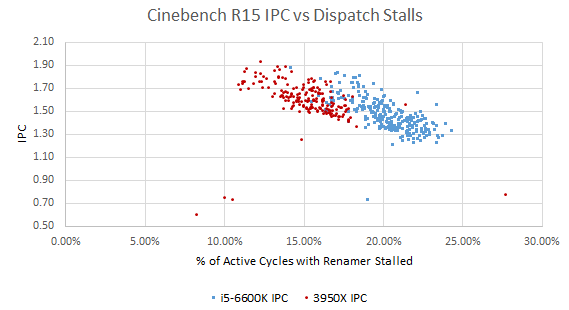

*图 4：Stall 少时 IPC 通常更高。NSQ 不能像 Scheduler 那样从全部 100 项中随意选 Ready Uop，但 Older-first 往往已接近合理策略。*

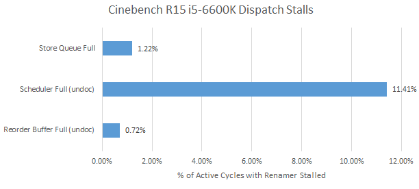

*图 5：Skylake Backend Bound 20.1%；RS/ROB Unit Mask 在 Haswell 后未文档化，是否仍准确存疑。*

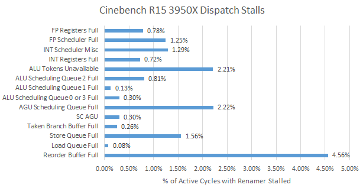

*图 6：Zen 2 为 15.1%，Scheduler 造成的 Renamer Stall 少于三分之一；事件可重叠，部分结构含义也未完全公开。Intel 较大的 Store Queue 更少满，但本负载两边 Store Full 都很少。*

*图 7：K10 同样有 36 项 FP Scheduler，却缺少大 NSQ，FPU Resource Stall 明显更多，且小 ROB 还会先满。Tremont 的 FP/Memory Overflow Buffer 也从侧面说明廉价缓冲的价值。Zen 2 偶有 AGU Queue/ROB 满，0.5% Divide 的长延迟也可能参与。*

## 数据侧：512 KB L2 把更多 miss 留在 12 周期处

两边 PMU 口径并不一致：Skylake 在退休时归类 Load Source；Zen 2 在 LSU 统计投机访问。Zen 2 每条 64 B Line 只记一次 L1D Refill，Skylake 还能识别 Fill Buffer Hit。本文只粗略比较 Refill。

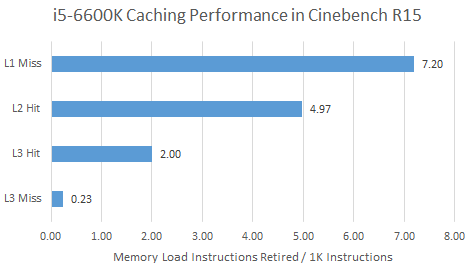

*图 8：退休口径。*

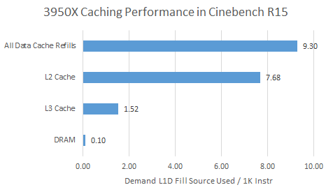

*图 9：LSU 投机口径，不能与图 8逐项等同。Zen 2 的 512 KB L2 与 Skylake 256 KB L2 同为约 12 周期，却有更高命中率；大 L3 让 DRAM 请求不到 Skylake 一半，但两者 DRAM miss 本来都很少。*

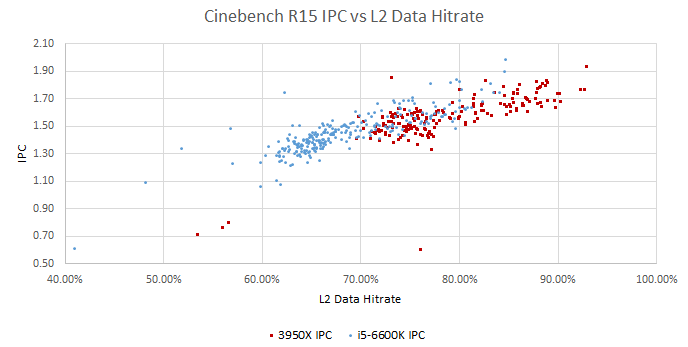

*图 10：两边 L2 事件较可比，均为投机访问；命中率与 IPC 正相关。*

## 指令侧：大 L2 也在保护顺序前端

L2 同时容纳代码与数据。Frontend 是顺序供给，通常比乱序 Backend 更难隐藏 I-Cache miss。

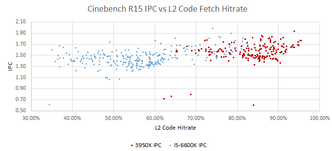

*图 11：两者都受益于 L2 接住 L1I miss。*

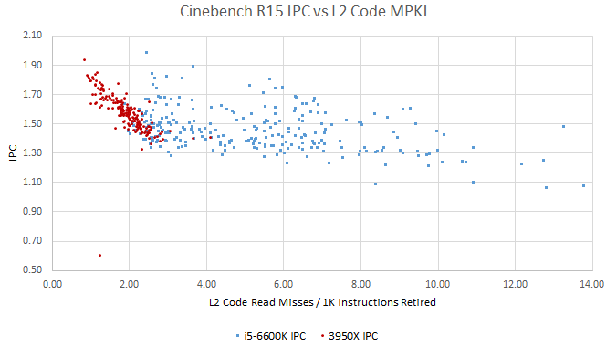

*图 12：按指令归一化后 Zen 2 关系更清楚；Skylake 点分散，可能是更多后端 Stall 稀释前端影响，仍无法确认。*

## 为什么 Op Cache、L1I 与执行端不是主因

Skylake 的 1536 项 Op Cache 命中率反而是 69.1%，高于 Zen 2 4096 项的 62.7%。

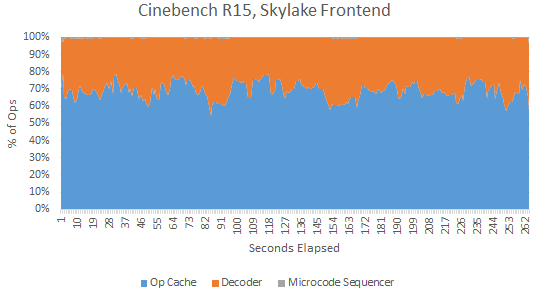

*图 13：Microcode Sequencer 输出不进 DSB，只缓存 Pointer，因此单列。*

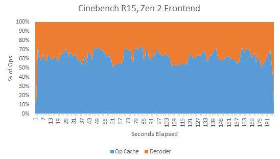

*图 14：Zen 2 可缓存微码输出，PMU 又无独立 Sequencer 事件。Skylake 更高 Hit Rate 可能来自更好的 Replacement，也可能包含更多错误路径访问；Zen 2 Loop 超容量后命中率近乎断崖，Skylake 更平缓。*

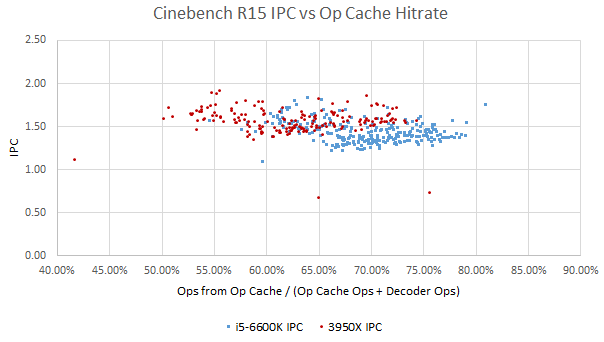

*图 15：相关性很弱，CBR15 IPC 不高，前端吞吐不是主要限制。*

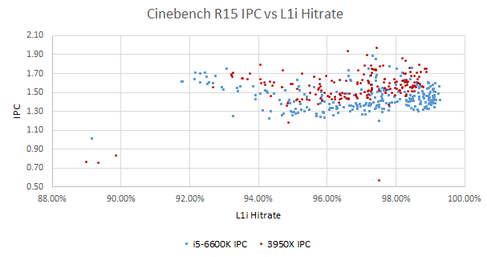

*图 16：关系同样弱。*

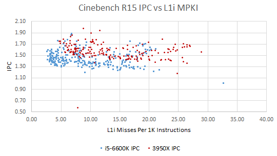

*图 17：甚至出现 V 形；只有进一步 miss L2 时才清楚伤害 IPC，说明 Frontend Queue 可能足以隐藏 L2 hit。*

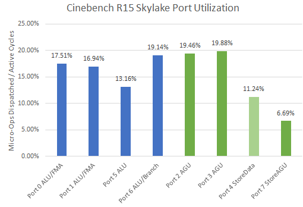

*图 18：所有 Port 很低，FP Port 甚至低于 Memory/Branch Port，执行吞吐不是瓶颈。*

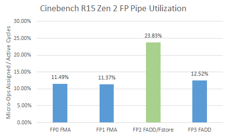

*图 19：Zen 1 的 FP Assignment 事件在 Zen 2 上经微基准验证仍似乎可用。FP2 独占 FP/SIMD Store，因此更忙，但仍远未饱和；AMD 无整数 Pipe 事件，只能结合相似执行集群与 Per-port Queue 不满作间接判断。*

## 结论与边界

在 CBR15 单线程中，Zen 2 以更准预测减少错误路径，以 512 KB L2/大 L3降低中长延迟访问，再用 FP NSQ 扩展可吸收延迟的窗口，最终领先 Skylake。CBR15 不重压 DRAM Controller，因而没有展示 Intel 单片设计的较低内存延迟；Skylake 也有更大 Store Buffer、更高 Op Cache/L1I Hit Rate。文章写作时桌面 Rocket Lake 尚未取代 Skylake，预计其 512 KB L2、更多 Scheduler 项和可能改进的预测会缩小差距——这是当时的前瞻，不是后验结论。

## 参考资料

- Chester Lam, *Analyzing Zen 2’s Cinebench R15 Lead*, Chips and Cheese, 2021-02-22
- AMD Zen 2 Optimization Guide/PPR；Intel PMU 文档
- Henry Wong，Scheduler 组织研究；Agner Fog 指令/分支延迟测试
