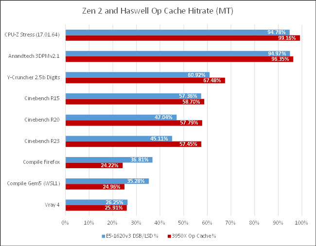
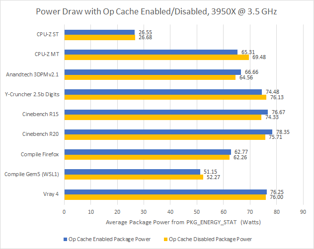
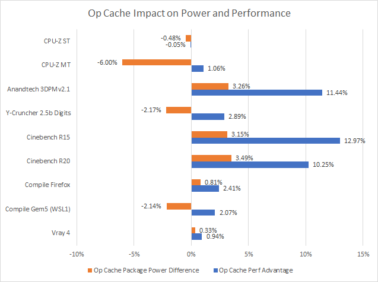
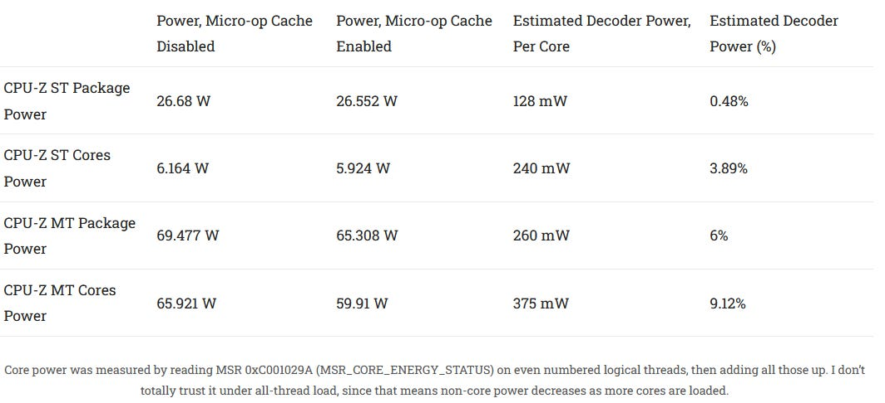
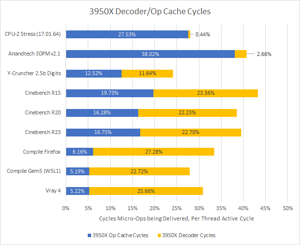
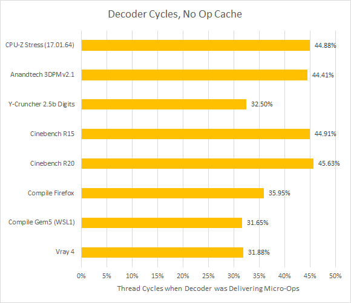
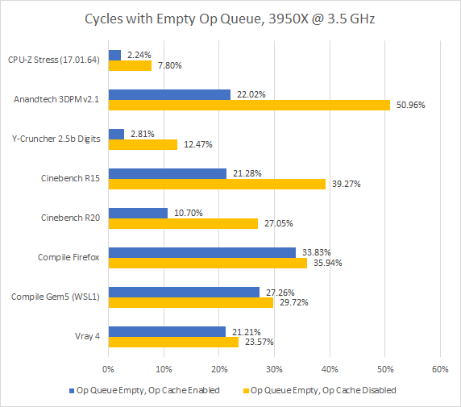
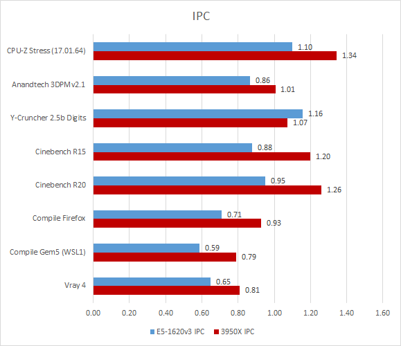

# Zen 2 的 Op Cache 到底带来多少性能与能效

> **文章来源**
>
> - 文章：*How Zen 2’s Op Cache Affects Performance*
> - 撰文：Chester Lam
> - 首发：Chips and Cheese
> - 发布：2021 年 7 月 3 日
> - 链接：https://chipsandcheese.com/p/how-zen-2s-op-cache-affects-performance

现代 AMD/Intel 大核心都用 Op Cache 保存译码后的微操作，它像 L0 Instruction Cache：命中后绕过 L1I→Decoder，提高带宽、让 Decoder 休眠；分支误预测恢复若命中，也省掉重新译码的延迟。Zen 2 还可通过 MSR 关闭 Op Cache，为观察因果提供了少见机会。题图 Die Photo 来自 Fritzchens Fritz。

## Hit Rate 远非固定的“80%～85%”

*图 1：用 PMU 统计，并加入 Intel CPU 对照。Intel 在 Sandy Bridge 发布时称多数应用约 80%，Arm 为 Cortex-A77 1.5K 项 Op Cache 设定约 85% 目标；实测随程序变化极大。*

3DPM v2.1 和 CPU-Z 内置测试即使两个 SMT Thread 竞争同一 Cache，也超过 90%；Cinebench 代码足迹更大，约 50%～60%，部分 Fetch 还 miss L2。编译和 V-Ray 的 Op Cache、L1I、L2 Code Hit Rate 更低，但它们又被 L1D miss 限制，单纯增强前端并不会解决主要问题。

## 关闭后的性能与功耗

*图 2：来自 `MSR 0xC001029B` Package Energy Status。计数器/模型功耗不是外部仪表测量。*

*图 3：Cinebench 与 3DPM 得分提高超过 10%；总功耗仍可能上升，因为后端得到更多指令、执行单元做了更多工作，但单位性能能效更好。*

Y-Cruncher 命中率近 70%，收益却有限，因为核心经常等数据；V-Ray 4 和编译前端影响只有几个百分点。CPU-Z 很特殊：工作集在 L1 内，线程 IPC 仅 1.34，主要 Dispatch Stall 是 FP Register 用尽 7%、ROB 满 4%、FP Scheduler 1.31%、其他整数 Scheduler 1.31%，更像 FP 延迟约束。

CPU-Z 单线程在 Op Cache 开关下得分相同、正常时命中率超过 99%，因此可尽量隔离“用 Decoder”与“用 Op Cache”的功耗差。

*图 4：Core Power Counter 推算 Decoder 约 0.24 W、不到核心功耗 4%；单线程 3.5 GHz 时 Package 中非核心占比较高，整包差不足 1%。全线程下关闭多约 0.375 W/核，但因开启时成绩约高 1%，这是 Decoder 功耗上界而非纯净值。*

### 体系结构视角：节能结构为什么可能提高总功耗

Op Cache 让 Decoder 少工作，却也减少气泡，使 Scheduler、Execution Unit、Load/Store 与 Cache 更忙。总功耗增加而完成时间下降，仍可能降低每项工作的能量。正确比较是相同任务的 Joule 或 Performance/Watt，并固定频率、线程数与后端利用率；不能把 Package Power 差直接当作前端阵列功耗。

## 活跃周期、Op Queue 与误预测恢复

“Hit Rate”只描述请求命中；“前端从哪条路径供给的线程周期比例”还包含 Decoder 带宽和两条路径都空闲的时间。全线程负载下，若每线程占比总和接近 50%（每核两 SMT Thread），更可能碰到前端吞吐极限；编译部分阶段没有用满线程，需谨慎解释。

*图 5：前端不忙的时间可能来自 I-Cache miss，也可能是后端满导致反压。*

*图 6：CPU-Z、3DPM、Cinebench 的 Decoder 变得很忙；其他负载仍留有空闲。*

两条供给路径先进入后端前的 Op Queue。Queue Empty 不必然证明前端瓶颈，但可作为气泡证据。

*图 7：3DPM 只有 88.5% Branch Accuracy、13.24 MPKI；Op Cache 既缩短正确路径恢复，又用高带宽追回错误路径损失，解释其 11.4% 得分提升。Cinebench R15 约 96%、5.15 MPKI，仍受益但程度较轻。*

*图 8：AMD 用 IrPerfCount/APERF，Intel 用相似 Fixed Counter。IPC 与前端活跃度一起看，才可区分“供不上”与“后端不要”。*

## 测试设置与事件口径

除特别注明外使用 Ryzen 9 3950X。事件 `0xAA Uops Dispatched from Decoder` 的 Unit Mask `0x1/0x2` 分别统计 Decoder/Op Cache；Count Mask=1 统计活跃周期。设置 `MSR 0xC0011021` bit 5 关闭 Op Cache，并由 PMU 确认其供给归零。为避免多线程 Boost/功耗相互影响，设置 `MSR 0xC0010015` bit 25 关闭 Core Performance Boost，固定 3.5 GHz。

Intel 还有 MITE（Decoder）、DSB（Op Cache）、MS（Microcode Sequencer）与 LSD（Loop Buffer）；为了与 AMD 接近，图中把 LSD 计作 Op Cache Hit。Intel DSB 只存 Microcode Pointer，不缓存 MS 输出，所以 MS 单列；AMD 则可把微码输出放入 Op Cache，且无独立 MS 事件。性能差来自 Benchmark Score，编译负载用 IPC；Cinebench R23 因与 R20 相似，未做同等深度测试。

结论是：Zen 2 Op Cache 可在合适负载中提高超过 10%，所有测试都改善能效；但收益取决于 Branch、代码足迹、IPC 与后端等待。Arm、Intel 采用同类机制并不意外，而更小容量是否少一些收益只是合理猜测，本文没有直接验证。

## 参考资料

- Chester Lam, *How Zen 2’s Op Cache Affects Performance*, Chips and Cheese, 2021-07-03
- AMD Family 17h PPR 与相关 PMU/MSR
- Intel Sandy Bridge Hot Chips 23；Arm Cortex-A77 公开资料
