# AMD 为何悄悄关闭了 Zen 4 的 Loop Buffer

> **文章来源**
>
> - 文章：*AMD Disables Zen 4's Loop Buffer*
> - 撰文：Chester Lam
> - 首发：Chips and Cheese
> - 发布：2024 年 11 月 30 日
> - 链接：https://chipsandcheese.com/p/amd-disables-zen-4s-loop-buffer

Loop Buffer 位于 CPU 前端，保存少量刚取过的微操作。小循环完全落入其中后，取指、译码乃至微操作 Cache 的部分逻辑可以休眠，降低功耗，有时也能绕过上游带宽限制。Intel、Arm 和 AMD 都用过这种老而有效的办法。

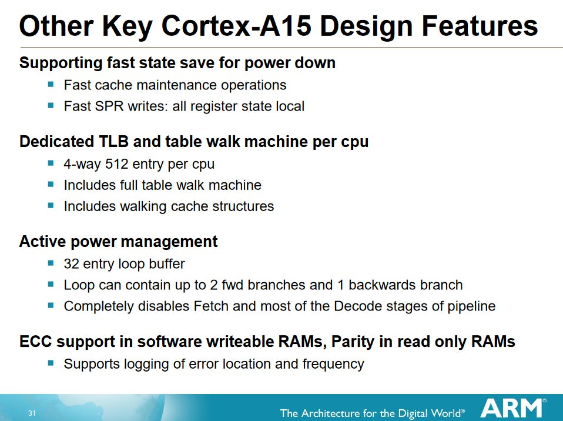

*图 1：Arm 公开框图给出的典型实现。不同架构的条目语义、捕获条件并不相同。*

Zen 4 似乎是 AMD 高性能核心中唯一明确出现 Loop Buffer 的一代。PPR 把它与 Op Cache、Decoder 并列为微操作 Dispatch Source；性能计数器反推单线程容量约 144 项，SMT 开启时静态平分为每线程 72 项。循环中有 `CALL/RET` 会阻止捕获。AMD 优化手册没有教开发者利用它，只建议让热点代码落在 Op Cache 内。

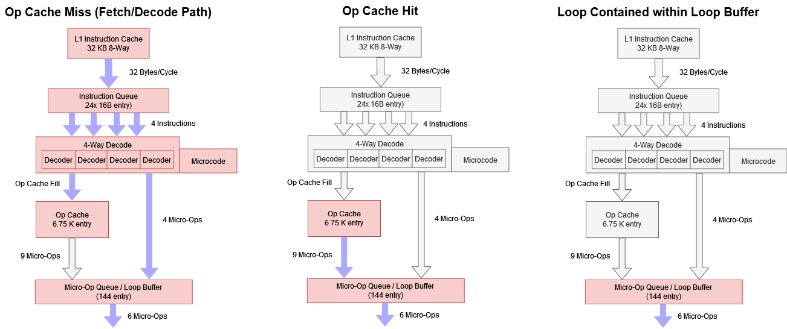

*图 2：Loop Buffer、Op Cache 与 Decoder 都可供给后端。144/72 项来自计数器实验，不是 AMD 公布容量。*

Hot Chips 2024 的非正式交流表明，它主要是功耗优化。更新 ASRock B650 PG Lightning 到 BIOS 3.10 后，计数器不再记录任何 Loop Buffer 微操作；退回 BIOS 1.21 又恢复。由此可把关闭范围定位在 AGESA 1.0.0.6 到 1.2.0.2a 之间，但关闭原因没有公告。

## SPEC CPU2017：总分基本不动

页面给出了 BIOS/AGESA 与各子项成绩、IPC 和 PMU 覆盖，但没有完整披露编译器版本、优化参数、SPEC 输入规模与重复次数。因此这里只比较同一平台前后 BIOS 的相对变化，不把分数拿去与外部 SPEC 提交横比。

整数、浮点总分差异都小于 1%，SMT 收益也未改变。Op Cache 的带宽本就高于后续 Rename/Allocate 所能消费的宽度，而且 Loop Buffer 只覆盖少数微操作。

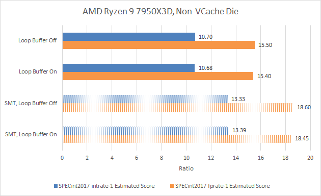

*图 3：总分差异落在约 1% 内，不支持显著性能影响。*

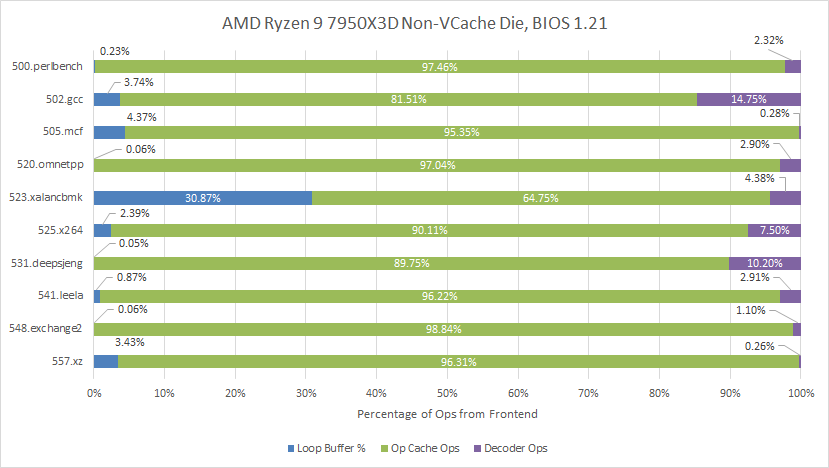

*图 4：即使开启，Zen 4 主要依赖 Op Cache。*

523.xalanbmk 有显著比例来自 Loop Buffer，但成绩从 9.44 到 9.48，仍在误差范围。544.nab 约四分之一微操作曾由 Loop Buffer 提供，关闭后反而从 11.5 到 11.7（+1.7%），更像运行波动而非收益。

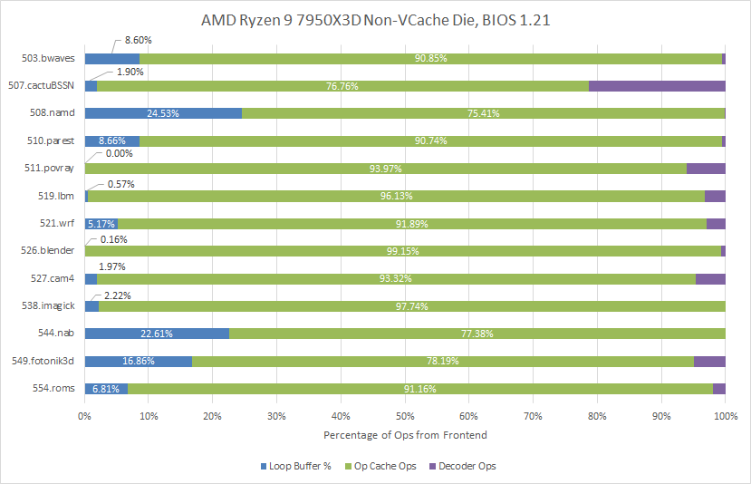

*图 5：覆盖率高并不自动意味着性能重要。*

关闭后，Op Cache 接手绝大多数供给。

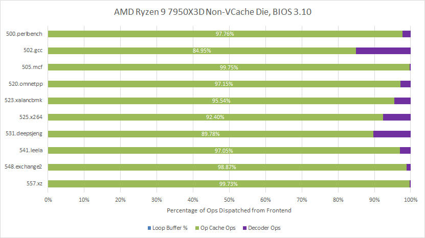

*图 6：从“多数来自 Op Cache”变成“压倒性多数来自 Op Cache”。*

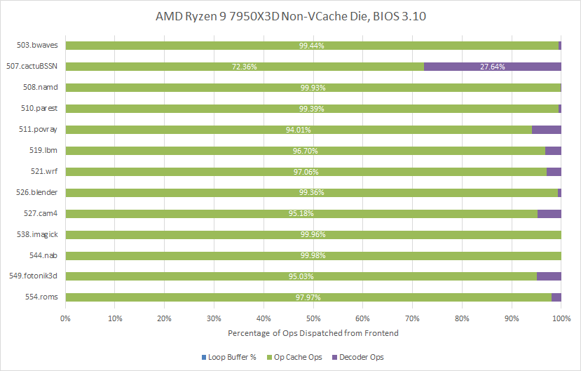

*图 7：507.cactuBSSN 的 Decoder 比例接近四分之一，原因不明。该事件统计投机供给，会包含误预测后的错误路径，计数器也不应视作百分之百准确。*

## Count Mask：它究竟让上游休眠了多少周期

性能计数器的 Count Mask 可让事件只在每周期计数超过阈值时加一。阈值设为 1，就能估算每种来源有多少周期真正供给微操作。

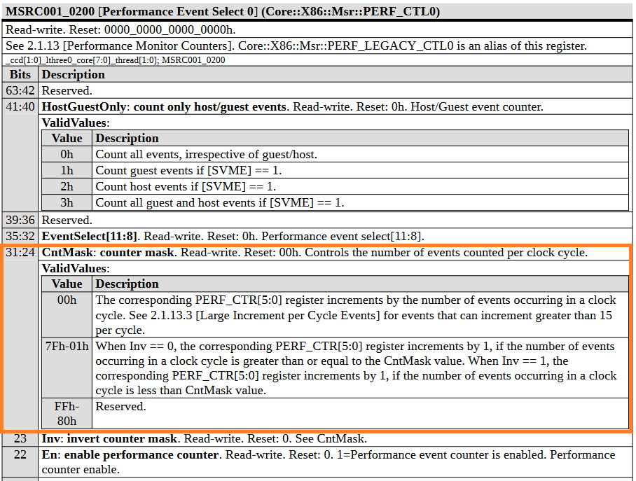

*图 8：这是官方事件配置字段；后续“活跃周期”则是据此得到的测试结果。*

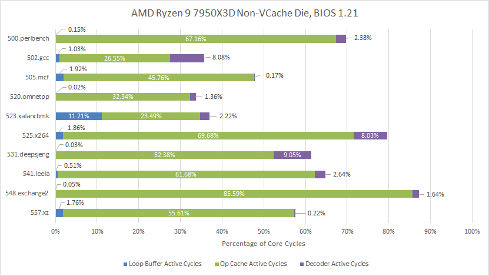

*图 9：来源活跃时间大体跟供给比例一致；502.gcc、520.omnetpp 常受后端内存延迟限制，乱序窗口满后前端也只能空闲。*

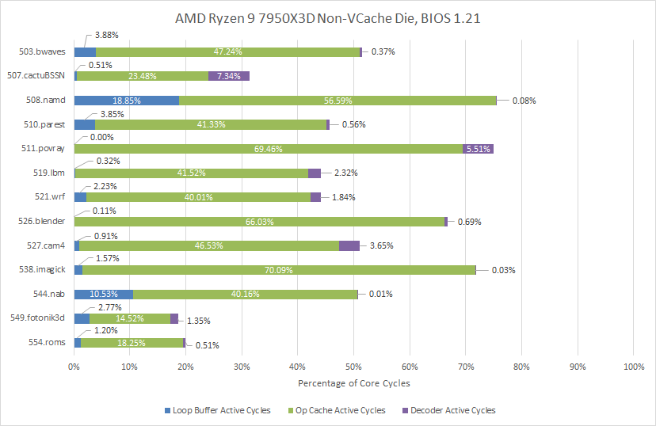

*图 10：544.nab、508.namd 给 Loop Buffer 较多机会。508.namd 平均 3.64 IPC，既需要持续前端吞吐，又恰好常在小循环中。*

关闭后，523.xalanbmk 的 Op Cache 需要额外活跃约 12% 的核心周期；多数项目差异小。

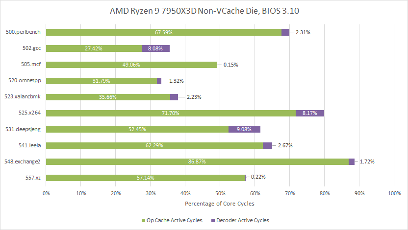

*图 11：关闭 Loop Buffer 后由另外两条路径补位。*

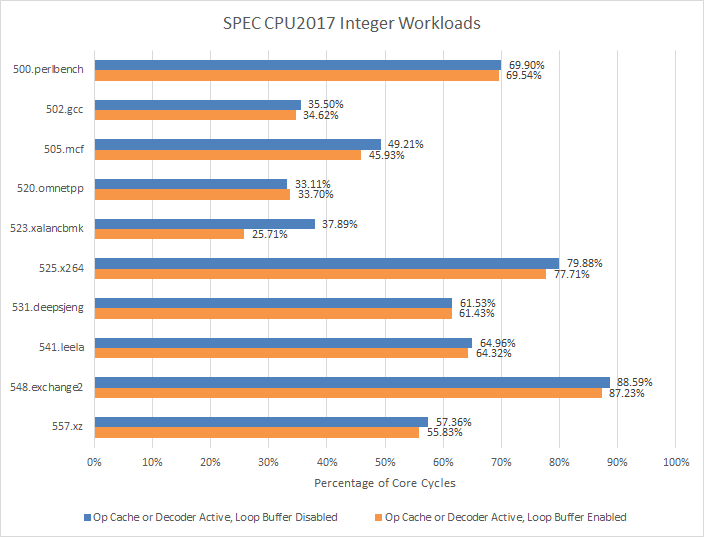

*图 12：548.exchange2 平均 4.31 IPC，但并不常进极小循环；即使 Loop Buffer 开启，Op Cache 也活跃超过 85%。*

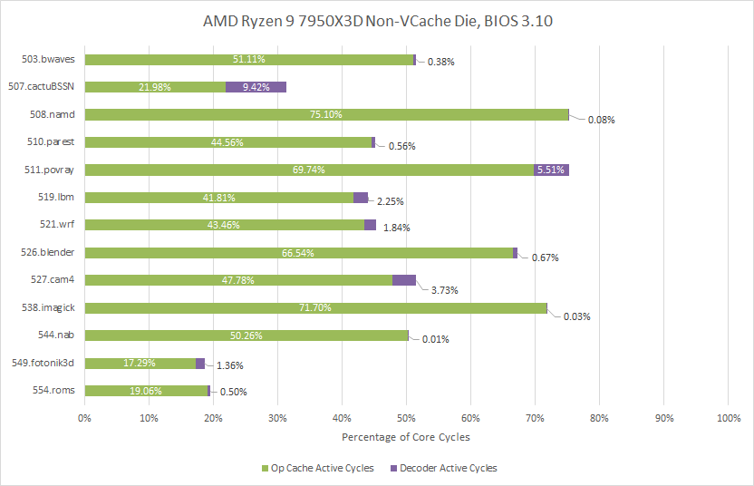

*图 13：Op Cache 活跃周期从 56.67% 增至 75.1%，是较突出的功耗候选。*

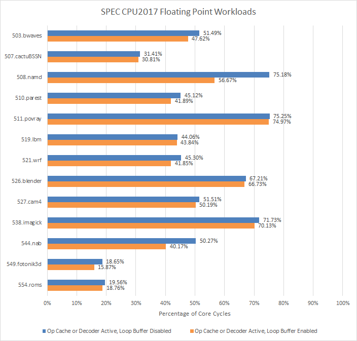

*图 14：144 项容量、不能含调用/返回、还要求后端不构成主瓶颈，三项条件共同把有效覆盖限制在少数负载。*

### 体系结构视角：Loop Buffer 的价值不是“再造一个更快前端”

Zen 4 Op Cache 每周期供给能力已经高于 Rename/Allocate，Loop Buffer 很难再提高峰值 IPC。它的主要价值是让大阵列、Tag 与 Decoder 少翻转。要验证节能，需比较相同退休工作量、相同频率和后端利用率下的核心能量，而不能仅看整包功耗；只要更好的供给让执行单元多做了工作，功耗反而可能升高。

## Cyberpunk 2077：V-Cache CCD 不变，普通 CCD 却掉 5%

测试关闭 Ryzen 9 7950X3D 的 Core Performance Boost（`MSR 0xC0010015` bit 25），固定 4.2 GHz；RX 6900 XT 固定 2 GHz；游戏为 1080p Medium、无 Upscaling。

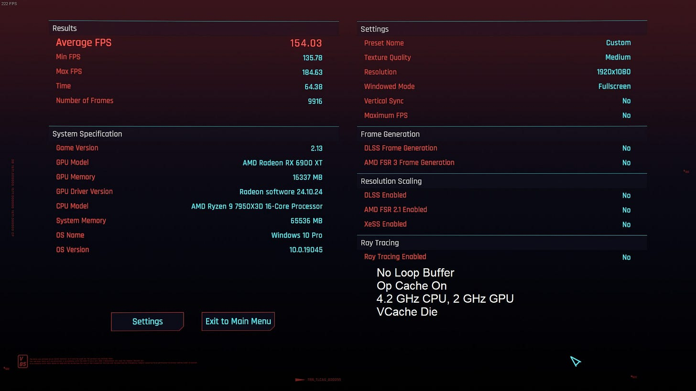

*图 15：内置 Benchmark 提高可重复性，图中也确认 Op Cache 保持开启。*

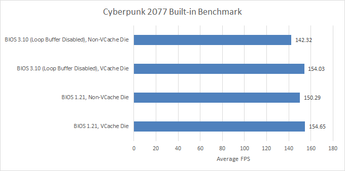

*图 16：V-Cache CCD 基本不受影响；普通 CCD 关闭后约慢 5%。作者重复约六次仍复现，但没有解释。*

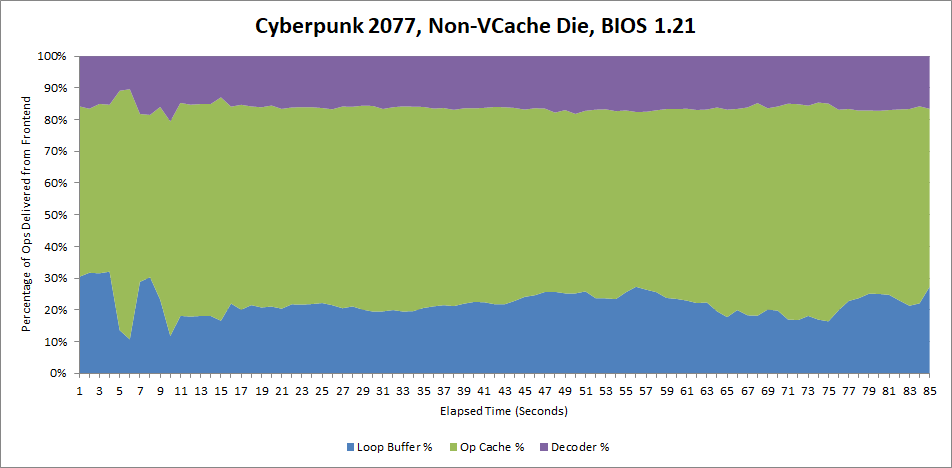

*图 17：Loop Buffer 平均覆盖约 22%，关闭后 Op Cache 从约 62% 升到 82%。*

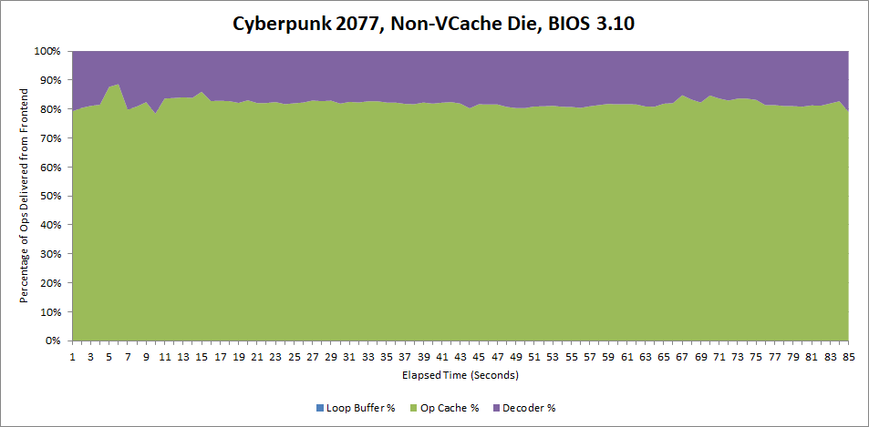

*图 18：游戏大部分停顿并不发生在前端。*

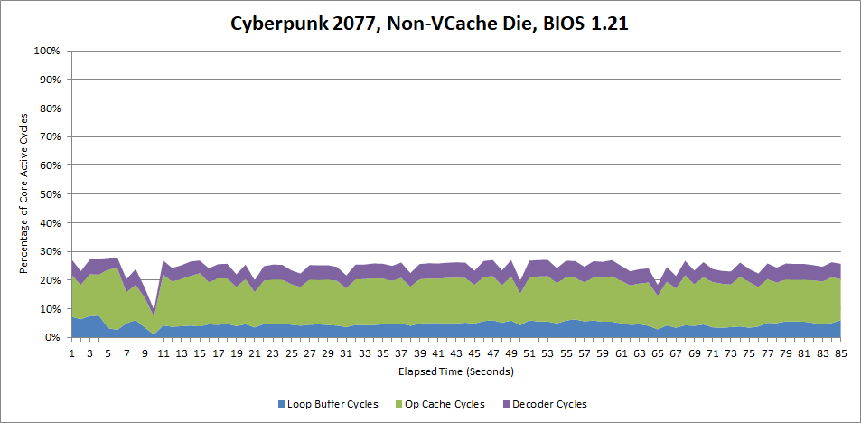

*图 19：低 IPC 更像后端延迟或分支重定向所限。*

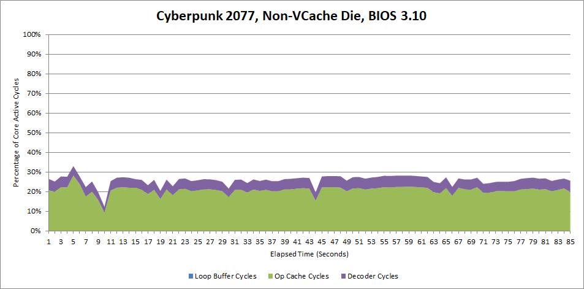

*图 20：关闭并未把前端变成清晰主瓶颈。*

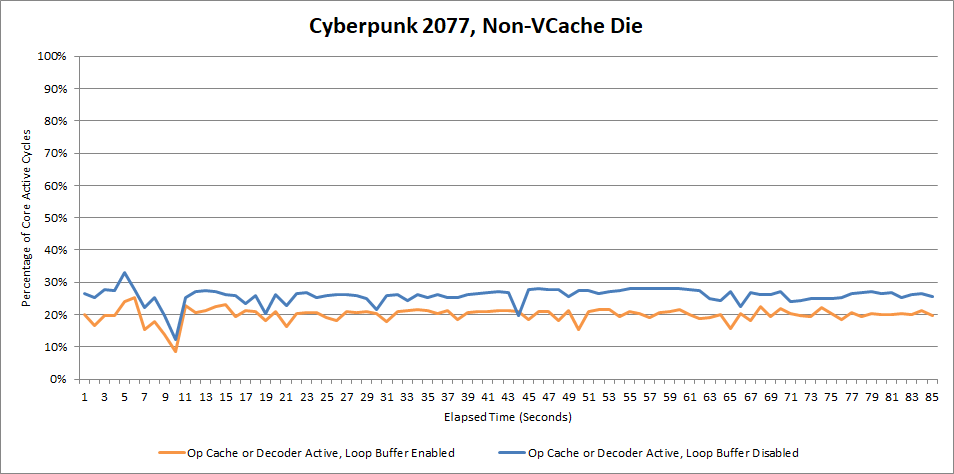

*图 21：普通 CCD 平均 IPC 从约 1.02 到 0.89；V-Cache CCD 的计数器也从约 1.25 到 1.07，但帧率几乎不变，可能已接近约 155 FPS 的 GPU 瓶颈。未知项必须保留。*

## 功耗计数器给出了自相矛盾的答案

为避免 `CALL/RET` 破坏 Loop 捕获，指令带宽微基准被改为直接跳入测试数组，并固定单核、关闭 Boost，前后读取 Core Energy Status MSR。

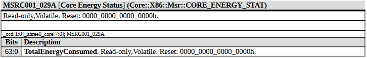

*图 22：目的是尽量隔离核心前端，而非整包功耗。*

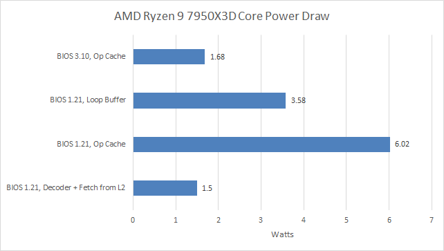

*图 23：指令融合使 Op Cache/Loop Buffer 下约 11～12 IPC，Decoder 下约 4 IPC。旧 BIOS 报告 Op Cache 约 6 W、Loop Buffer 很低；测试数组扩大到 128 KB、主要走 L2+Decoder 后却只有 1.5 W。新 BIOS 又给 Op Cache 1.68 W、Decoder 近似值。结果不自洽。*

AMD 功耗设施可能是模型估算而非直接测量，BIOS 还可能改变模型。缺少 EPS 12V 外部测量，无法从这些数字确认节能幅度。

## 为什么关闭：Bug 是合理猜测，但没有证据确认

一种可能是硬件缺陷。Intel Skylake 的 Loop Stream Detector 就曾因 SMT 下短循环与 Partial Register 的 Bug 被关闭；Zen 4 又是 AMD 第一次在高性能核心中尝试该机制，后期出于保守策略停用并非不可想象。但 AMD 没有说明，不能把猜测写成事实。

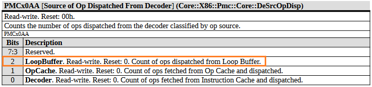

*图 24：PPR 只把它列为供给来源，未给优化建议。*

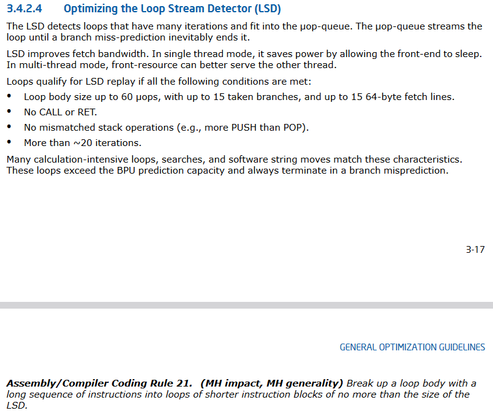

*图 25：Intel 明确鼓励利用 Loop Buffer，并列出同样不容许 `CALL/RET` 等限制；这与 AMD 的低调形成对照。*

如果还在旧 BIOS，理论上可把循环控制在 144 微操作内，SMT 时每线程低于 72，并内联循环内调用；实际性能回报大概率为零。`CALL/RET` 限制也可能意味着 Loop 模式会关掉部分分支预测结构，从而增加节能，但仍是推测。

结论很克制：关闭对性能大体无关紧要，功耗影响未知且可能很小；Cyberpunk 普通 CCD 的 5% 异常值得更多平台复测。Zen 4 的这次尝试更像一项低风险工程探索，不能因后续关闭就否定机制本身。

## 参考资料

- Chester Lam, *AMD Disables Zen 4's Loop Buffer*, Chips and Cheese, 2024-11-30
- AMD Zen 4 PPR；AMD Zen 4 Optimization Guide
- Robert Schöne et al., *Energy Efficiency Aspects of the AMD Zen 2 Architecture*
- Intel Software Optimization Guide（Ice Lake LSD）
