# 关闭 Zen 4 的 Op Cache：六宽前端退回四宽后会怎样

> **文章来源**
>
> - 文章：*Turning off Zen 4's Op Cache for Curiosity and Giggles*
> - 撰文：Chester Lam
> - 首发：Chips and Cheese
> - 发布：2024 年 12 月 11 日
> - 链接：https://chipsandcheese.com/p/turning-off-zen-4s-op-cache-for-curiosity

处理器先从内存取指，再把 x86 指令译成内部微操作（Micro-op）。Op Cache 缓存译码结果，既降低取指/译码延迟与能耗，也提供更高供给带宽。Zen 4 的 Op Cache 可容纳约 6.75K 微操作，是近几代大核心中容量尤其突出的一个。

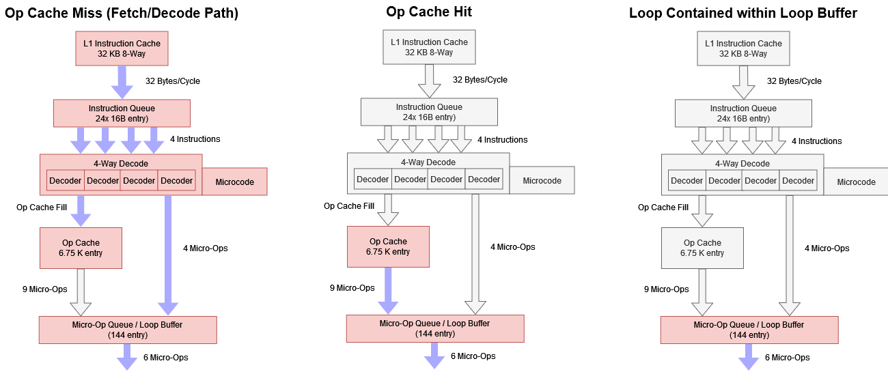

*图 1：144 项 Loop Buffer 主要服务小循环节能，Decoder 最多每周期处理 4 条指令，Op Cache 可每周期提供 9 个微操作；下游 Rename/Allocate 为六宽。*

新版 AGESA 已关闭 Loop Buffer，再设置 Instruction Cache Control MSR `0xC0011021` bit 5，就能关闭 Op Cache。此时 Ryzen 9 7950X3D 只能依赖四宽 Fetch/Decode，从有效六宽核心退成四宽。SPEC CPU2017 固定在非 V-Cache CCD，游戏固定在 V-Cache CCD；这是一项人为禁用关键结构的机制实验，不代表正常产品状态。

## SPEC CPU2017：整数 -11.4%，浮点 -6.6%

页面没有列出完整编译器版本、优化参数、输入规模和重复次数；实验价值来自同一 7950X3D 上只切换前端供给机制的相对对照，不能与其他机构的 SPEC 分数直接拼表。

单线程总分分别下降 11.4% 和 6.6%；同一物理核上运行两个 SMT Copy，下降扩大到 16% 和 10.3%。

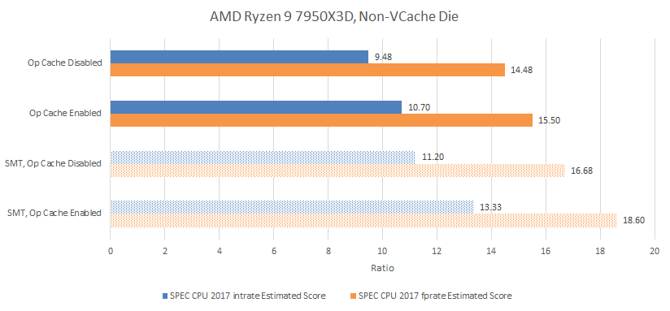

*图 2：整数套件更依赖前端，SMT 又把每核 IPC 推高，因此损失更大。*

整数子项差异很大：548.exchange2 下降约 32%，520.omnetpp 几乎不变。

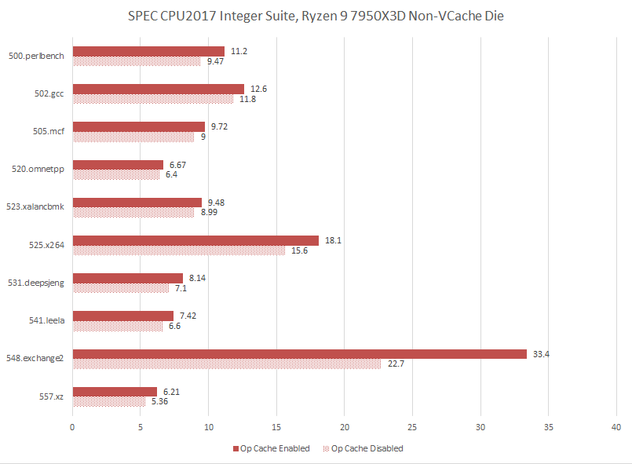

*图 3：总分会掩盖高 IPC 与内存延迟型负载的两极行为。*

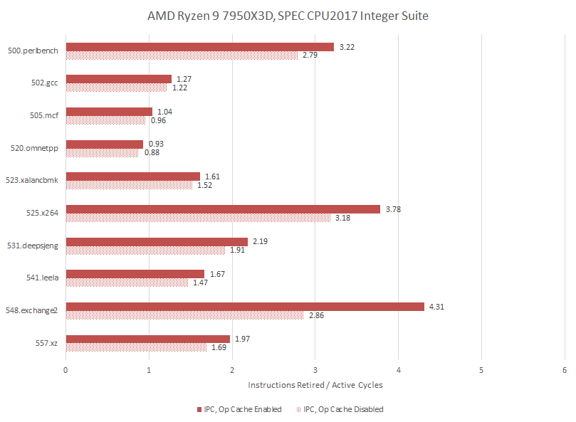

*图 4：omnetpp 的 L2 miss/指令最高，主要等待后端存储层次，本来就达不到 4 IPC；exchange2 正常可超过 4 IPC，四宽 Decoder 无法维持。*

事件 `0xAA` 分别选择 Op Cache 与 Decoder Unit Mask，Count Mask=1 统计每周期是否供给任何微操作。

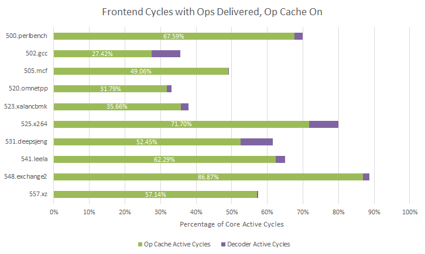

*图 5：统计的是投机供给活跃周期，不等同于退休指令带宽。*

即使 Op Cache 开启，部分高 IPC 负载的前端活跃度也很高。它虽能给 9 uops/cycle、下游只收 6，但多余宽度并非无用：548.exchange2 约 16% 指令是 Branch，525.x264 只有 7.27%。Taken Branch 后同一 Fetch Block 的槽位可能作废，9 宽让后续直线代码追回供给；四宽 Decoder 则需要每个槽位都有效。

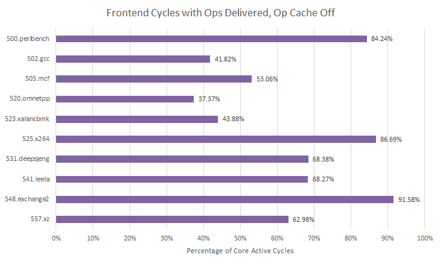

*图 6：exchange2 的 Branch 密度使四宽路径尤其吃紧；是否为 Taken Branch 主导仍缺少对应计数器数据。*

浮点套件整体较轻，但 508.namd、538.imagick 是高 IPC 异常项；507.cactuBSSN、554.roms 几乎不受影响，549.fotonik3d、518.lbm 的下降也低于 1%。

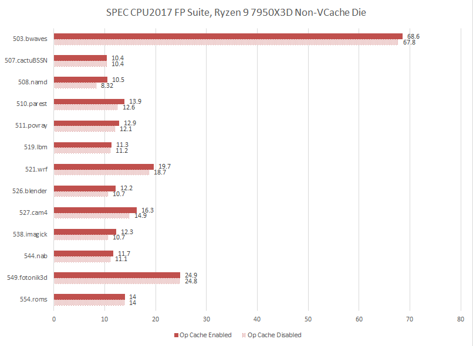

*图 7：高 IPC 项损失更大。*

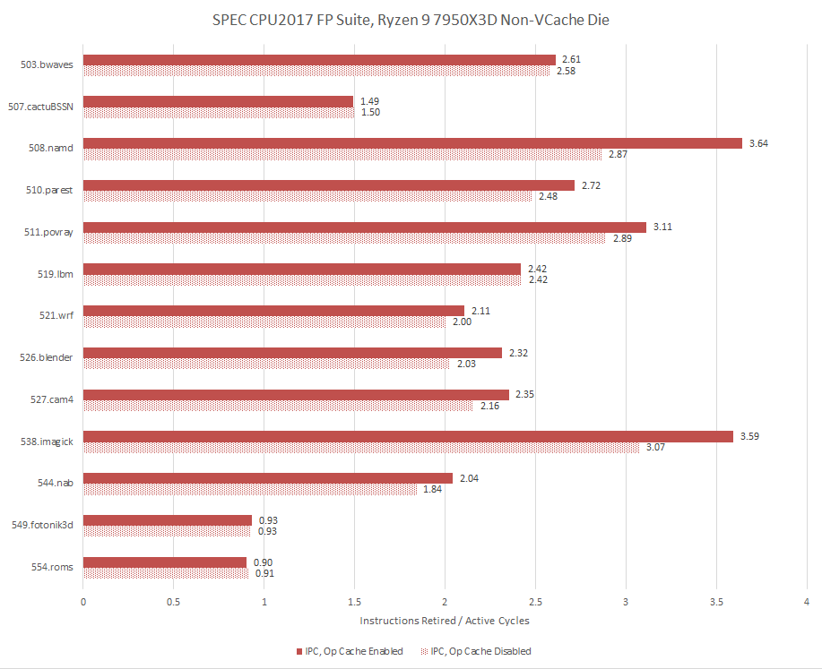

*图 8：不少工作负载强调后端计算与内存，四宽已经够用。*

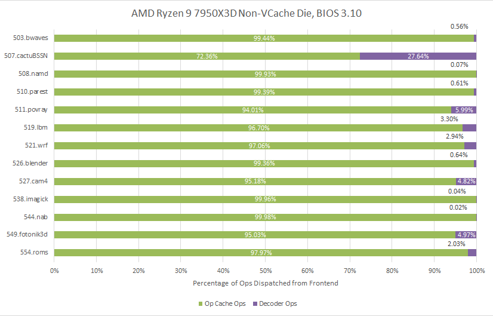

*图 9：覆盖率普遍很高，但高 Hit Rate 并不等于禁用后必然大幅降速。*

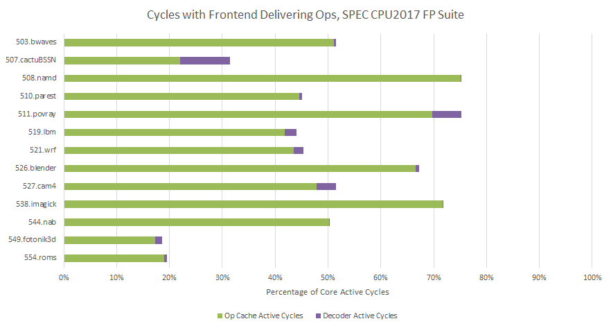

*图 10：多数项目仍有余量。*

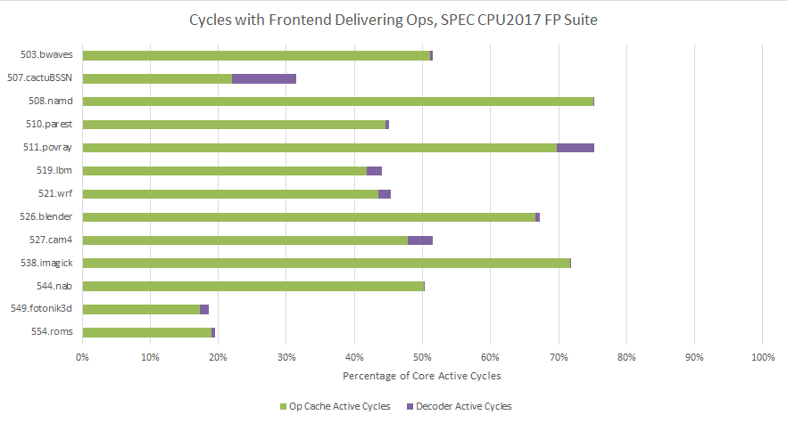

*图 11：508.namd 从“忙”转为接近饱和，554.roms 仍有空闲。*

### 体系结构视角：峰值宽度与有效宽度不是同一个数

前端每周期能吐出 9 个微操作，不代表程序长期能退休 9 条。Branch Block 尾部浪费、Cache miss、错误路径、后端反压都会制造气泡。超配的瞬时带宽用于快速填平这些气泡，让六宽 Rename 更常收到完整批次。验证应看供给源活跃周期、每活跃周期微操作数、Branch MPKI、前端空槽和后端 Bound，而不是只拿“9 对 4”预测性能。

## SMT：独立指令更多，四宽瓶颈更明显

两个线程的指令通常互不依赖，SMT 可隐藏后端延迟、提高每核 IPC，也把压力转移到共享前端。

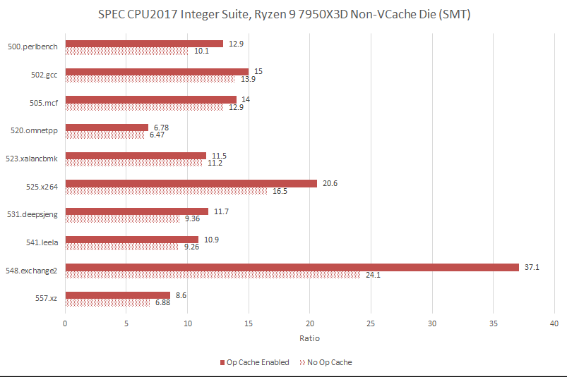

*图 12：运行两个 Rate Copy 并固定到同一物理核。exchange2 损失 35.04%，单线程为 32%；其单线程已高度利用核心，正常 SMT 收益本就只有约 11%。*

525.x264 从单线程下降 13.81%，扩大为 SMT 下降 19.9%。

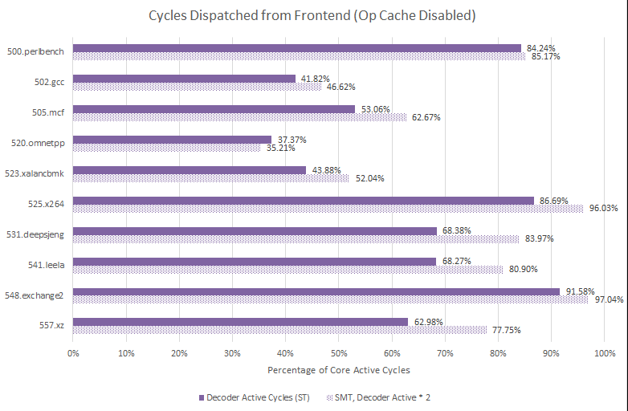

*图 13：第二线程提高后端可利用并行度，同时把四宽 Decoder 推到上限。*

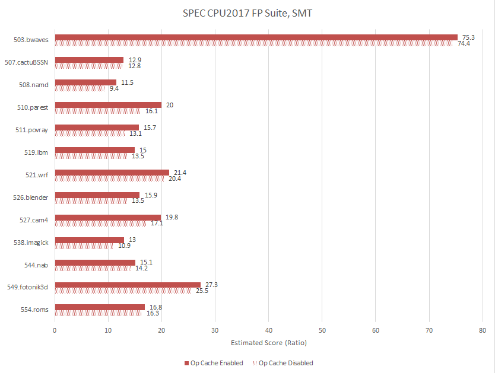

*图 14：所有子项的 Decoder 压力都增加。*

浮点侧的 519.lbm 在单线程禁用时无损失，SMT 下能到 3.28 IPC，随后损失约 10%；它开启 Op Cache 时 SMT 吞吐增益超过 30%。

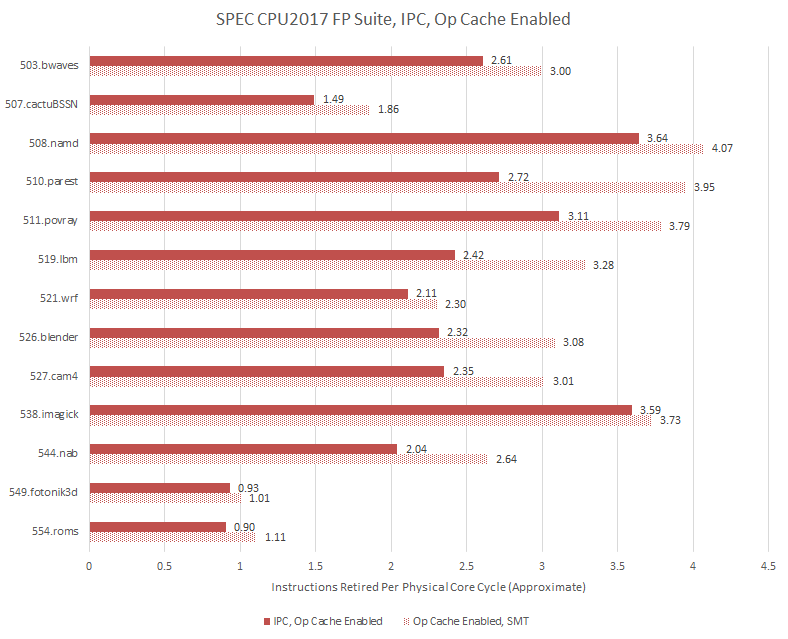

*图 15：中高 IPC 负载在两线程下变成高 IPC 负载。*

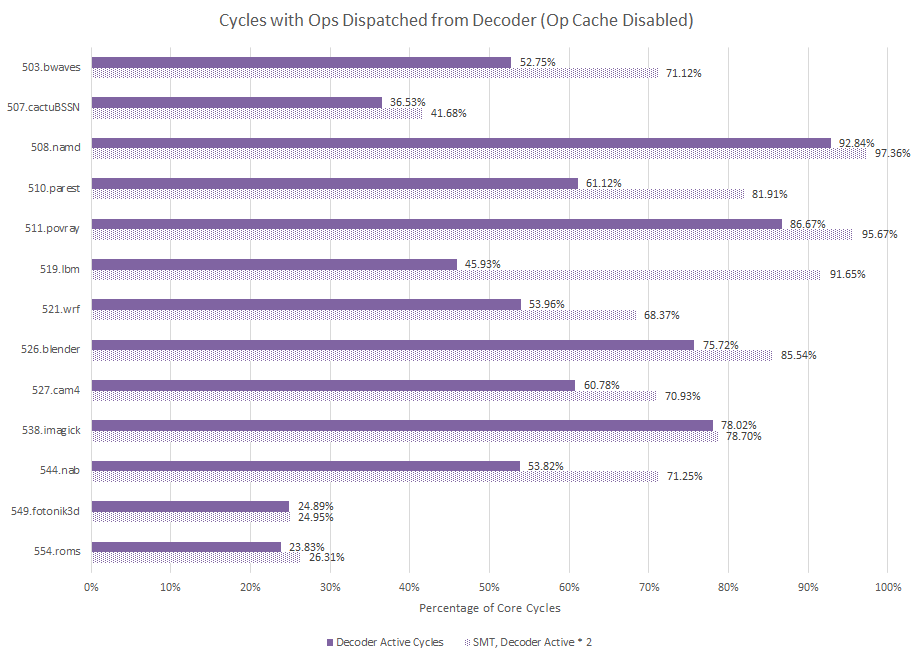

*图 16：lbm 是明显异常项，也提醒结果与 SMT 可隐藏多少后端等待密切相关。*

## Cyberpunk 2077：不到 1 FPS

游戏测试关闭 Core Performance Boost，把 7950X3D 固定 4.2 GHz，RX 6900 XT 固定 2 GHz，使用内置 Benchmark。

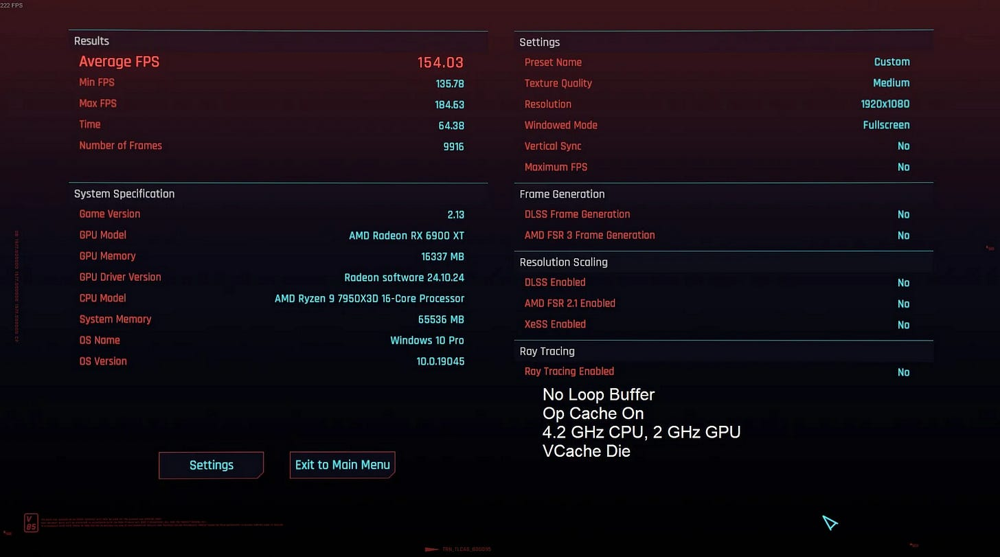

*图 17：与 SPEC 不同，游戏固定在 V-Cache CCD。*

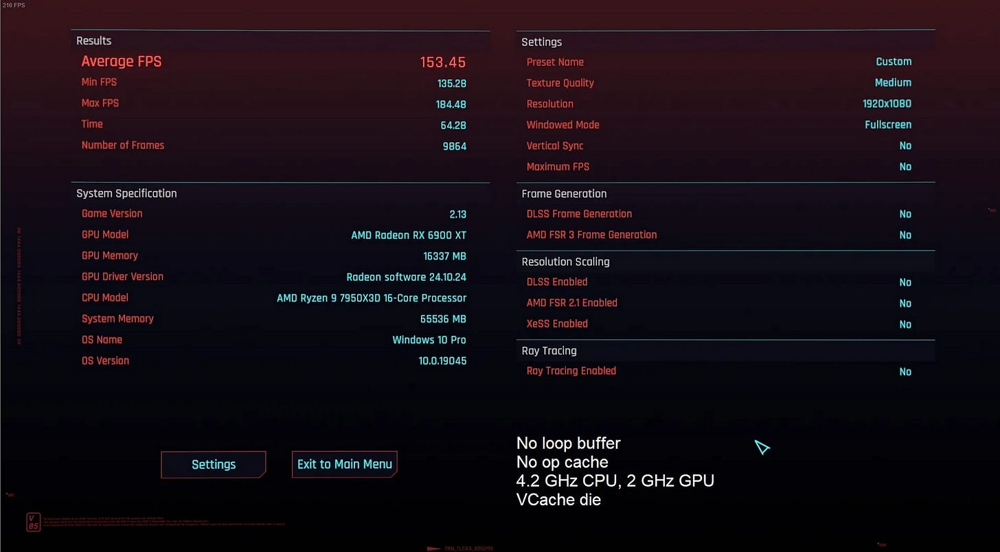

*图 18：下降不足 1 FPS、低于 1%，不能视为显著。*

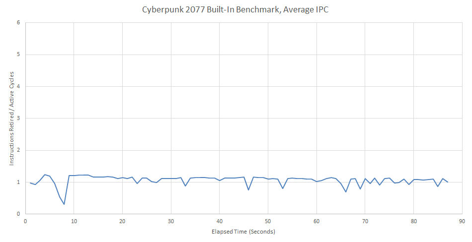

*图 19：它不是高 IPC 负载。*

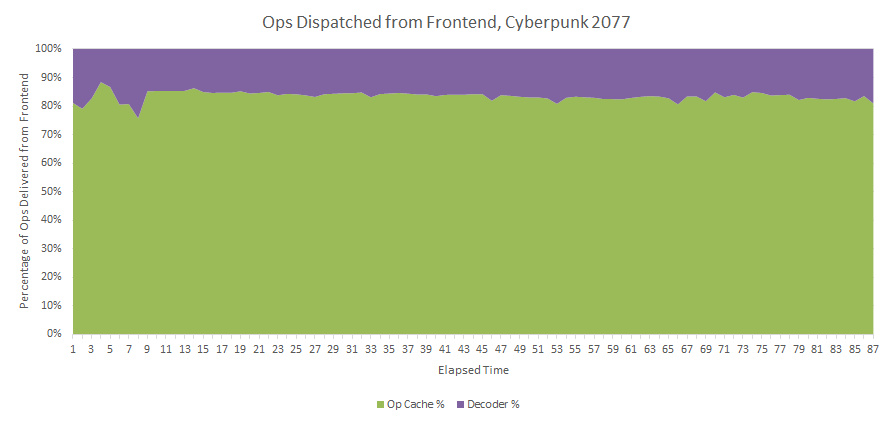

*图 20：正常时多数微操作来自 Op Cache，但把它们全部交给 Decoder 仍有充足余量；游戏中的“忙”主要不在前端。*

## 结语：Zen 4 依赖 Op Cache，但并非离开它就瘫痪

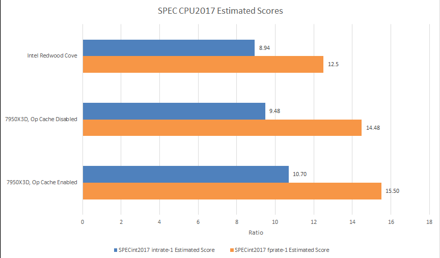

*图 21：近代 Zen 的 Op Cache 更大，传统译码路径投入相对保守；图示为结构比较，不代表禁用后的产品配置。*

Op Cache 对高 IPC、Branch 密集以及 SMT 负载很关键，却不能改变 omnetpp 等内存延迟型程序的主瓶颈。即使只剩四宽 Decoder，Zen 4 仍是高性能核心，某些测试甚至继续领先 Core Ultra 7 155H 的 Redwood Cove；这一对比只针对文中负载，不能扩展成全面产品排名。

最重要的认识是：核心宽度只是处理器性能的一部分。前端、乱序窗口、执行端、Cache 和 DRAM 任一环节先饱和，其他宽度就不会变成退休 IPC。Op Cache 的价值恰在于以较低能耗让前端不再经常成为先到的瓶颈。

## 参考资料

- Chester Lam, *Turning off Zen 4's Op Cache for Curiosity and Giggles*, Chips and Cheese, 2024-12-11
- AMD Zen 4 PPR 与相关 MSR/PMU 定义
- SPEC CPU2017；Cyberpunk 2077 内置 Benchmark
