# AMD Zen 4 上篇：前端、乱序执行与 AVX-512

> **文章来源**
>
> - 文章：*AMD’s Zen 4 Part 1: Frontend and Execution Engine*
> - 撰文：Chester Lam
> - 首发：Chips and Cheese
> - 发布：2022 年 11 月 5 日
> - 链接：https://chipsandcheese.com/p/amds-zen-4-part-1-frontend-and-execution-engine

Zen 4 发布前，性能传闻铺天盖地。Chips and Cheese 曾在 2021 年 2 月刊出“Zen 4 IPC 提升 29%”的文章；这篇正式撤回那篇内容，并明确表示其中说法全部无效。比数字本身更重要的是，这次错误促使网站从传闻资讯转向 Real World Tech、AnandTech 式的技术深挖。

Zen 4 的分析因此被拆成两篇。上篇关注前端、重命名、乱序资源、调度执行和 AVX-512；Load/Store 与数据侧存储层次放到下篇。

## 测试对象与阅读边界

主要对象是 Ryzen 9 7950X 的 Zen 4，前代对照包括 Ryzen 9 5950X/Zen 3、Zen 2，Intel 对照包括 Golden Cove 与 Ice Lake。图中平台、频率、内存与测试权限不完全相同；微基准用于识别容量和行为台阶，不等于统一平台应用性能。

Zen 4 的框图综合 AMD 资料与软件测试。执行单元图在 2022 年 11 月 7 日更新，删除了误画的 Permute Unit；正文仍保留最初图注对 FP1/FP2 Permute Lane 位置的纠正。没有 RTL，因此“可能”“推测”“假设”仍是证据边界。

## 总览：像 Zen 3，但到处都加了一点

从高处看，Zen 4 很像 Zen 3：六宽重命名、熟悉的调度执行布局和 256-bit 数据通路仍在。变化分布于预测器、微操作 Cache、乱序容量、寄存器宽度和 Cache。它与 Zen 2 的处境相似——在迁移新制程时，继续演进一套已成熟的架构。

Zen 1 于 2017 年初采用 14 nm，Zen 2 在 2019 年中转向 7 nm；Zen 3 于 2020 年末发布，Zen 4 在 2022 年末转向 5 nm。AMD 大约两年迁移一次节点，与 Intel 早期 Tick-Tock 不同，文章戏称其节奏为“Tick—Nothing—TickTock”：架构升级与节点迁移往往在同一代叠加，风险也因此需要用相对克制的核心改造来控制。

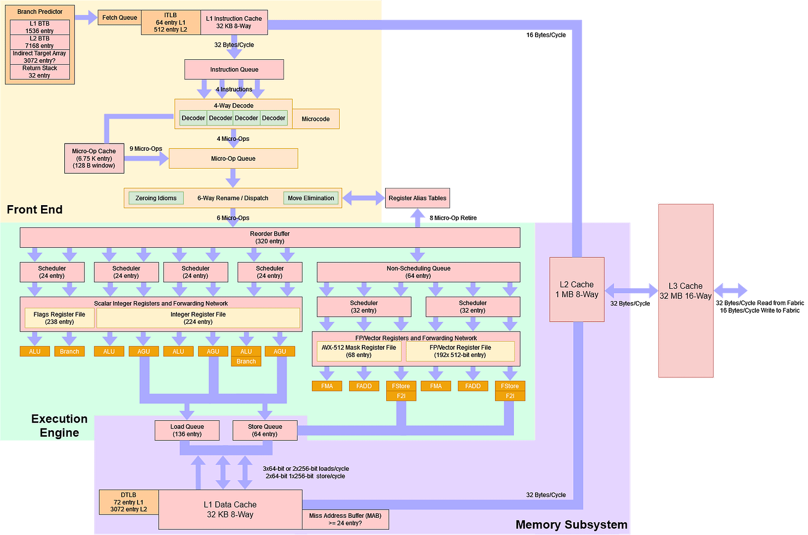

*图 1：Zen 4 保持六宽重命名与 Zen 3 类似的调度/执行组织，同时扩大微操作 Cache、ROB、物理寄存器、TLB 和 L2，并把向量寄存器扩到 512 bit。框图是公开资料与微基准复原，不是 RTL。*

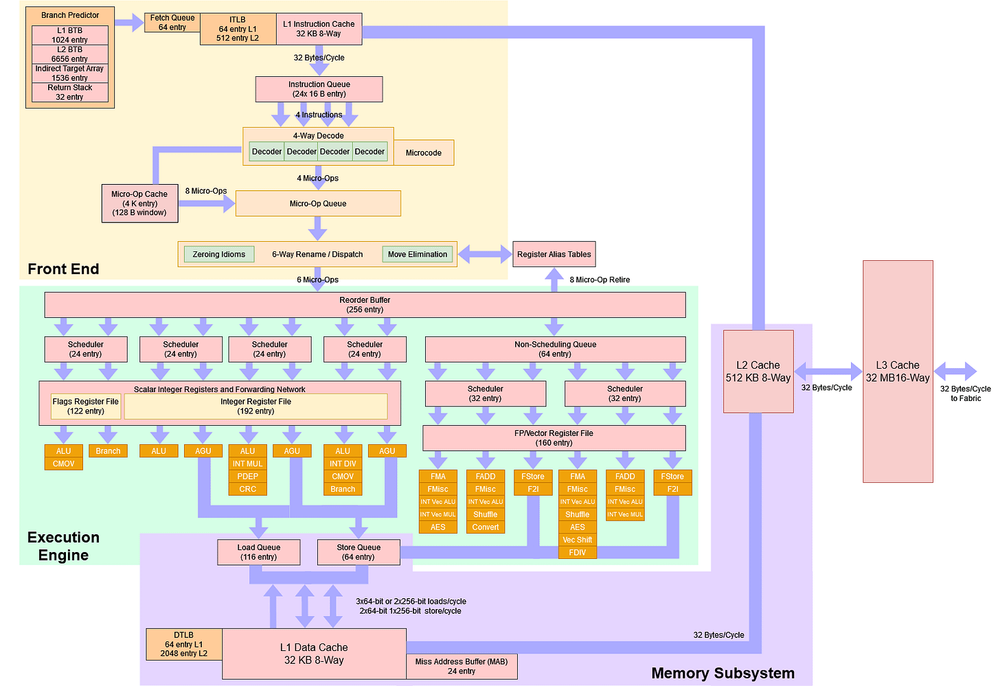

*图 2：网页正式图注说明，Zen 3 图画出更多执行单元，是因为公开数据更完整；对 Zen 4 逐项测试同样细会耗费过多时间。两图不能因方块数量不同就断言 Zen 4 删除了对应能力。*

### 体系结构视角：成熟架构的升级不一定表现为“全面加宽”

一颗核心如果已有足够 ALU/FMA，继续增加单元未必提高应用 IPC。预测器减少错误工作、扩大窗口吸收突发阻塞、提高频率和降低平均访存延迟，常比再加一条执行管线更有效。Zen 4 的主线正是提高既有资源利用率。

制程迁移还会放大时序风险。调度器、重命名映射和旁路网络都在高频关键路径上；AMD 保留 Zen 3 的调度布局，把晶体管更多投向容量与频率，是一种工程取舍，而不是“没有改所以没有价值”。

## 两级方向预测：快速 L1，强大的 L2 覆盖

准确预测可减少错误路径取指、译码与执行，同时提升性能和能效；窗口越大，误预测后被丢弃的工作越多。Zen 系列用两级 Override 结构解决“快”和“准”的冲突：L1 优先给出低延迟结果，L2 更重视准确率；两者不一致时，由 L2 覆盖。

Zen 4 与 Zen 3 的 L1 能力接近，真正大幅增强的是 L2。它能学习极长模式，也有足够存储在大量静态分支同时出现时维持准确率。

*图 3：Zen 4 的长模式区域仍保持低惩罚平台，随后才因历史、容量或 aliasing 退化。三维曲面反映整套预测器有效能力，不能单独读出 GHR 位数。*

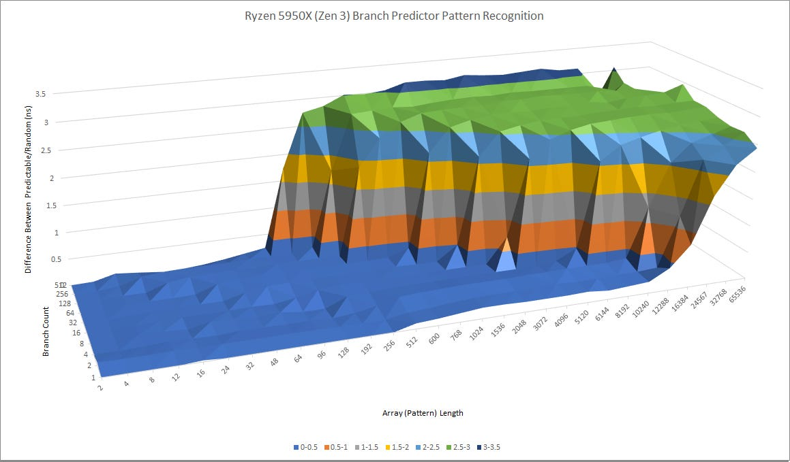

*图 4：图 3、4 的网页正式图注为“Zen 4 在上、Zen 3 在下”。两代快速 L1 接近，Zen 4 的长模式 L2 覆盖明显更强。*

Golden Cove 采用不同路线：单级方向预测器的模式能力介于 Zen 4 L1 与 L2 之间。中等难度分支若超出 AMD L1、却仍能被 Intel 主预测器处理，Golden Cove 不必等待 Override；当困难分支很多时，Zen 4 的强 L2 更占优势，Golden Cove 则会承受真正 mispredict 的高代价。后者依赖大窗口掩盖高 Cache 延迟，误预测清空窗口尤其昂贵。

*图 5：静态分支数最多扩到 512。Zen 4 在高分支压力下仍能维持较长模式，体现 L2 预测表的容量与抗混叠能力。*

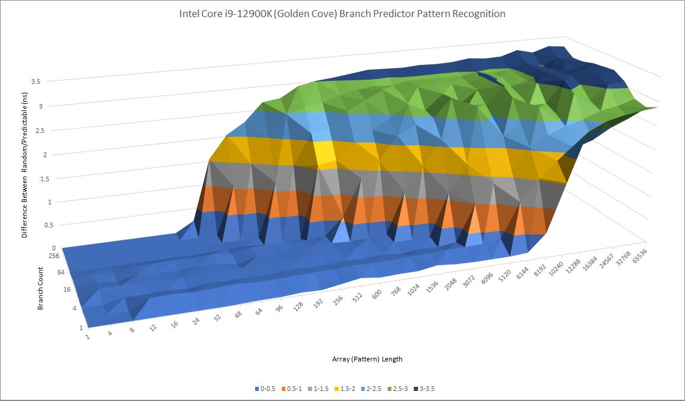

*图 6：图 5、6 的正式图注说明 Zen 4 在上、Golden Cove 在下；Excel 没有标出横轴每个分支点。Golden Cove 的中等难度响应可能更快，Zen 4 在最困难区域更准。*

### 体系结构视角：Override 预测器把“错误”和“迟到”分成两种损失

若 L1 猜错而 L2 及时纠正，流水线丢失的是覆盖延迟；若两级都错，才支付完整清空与重定向。因而同样的最终准确率，也可能因为 Override 次数不同而表现不同。

验证时应区分 L1 prediction、late override 与最终 mispredict，并观察每类恢复周期、错误路径微操作数和前端缺货。只用 retired mispredict 无法看出一个程序是否频繁被 L2 纠正。

## BTB：最多 3072 个快速目标，8K 二级容量

Zen 3 的 L1 BTB 可追踪 1024 个目标，1 周期命中意味着 Taken 分支后前端无需插入空泡。Zen 4 保留 1 周期延迟，却提高容量：视分支密度而定，最多可见约 3072 个目标，实际常见范围可能是 1024～2048。

网上曾流传“1.5K-entry L1 BTB”。旧 Zen 优化手册说明，同一条 64 B 对齐 Cache line 中，若第一条是条件分支，一个 BTB entry 最多可保存两个分支。早期测试只用无条件分支，没有触发共享；Zen 4 可能放宽了条件，从而在 8 B 间隔时看到 3072 个目标。这仍是解释，不是对物理 entry 数的确认。

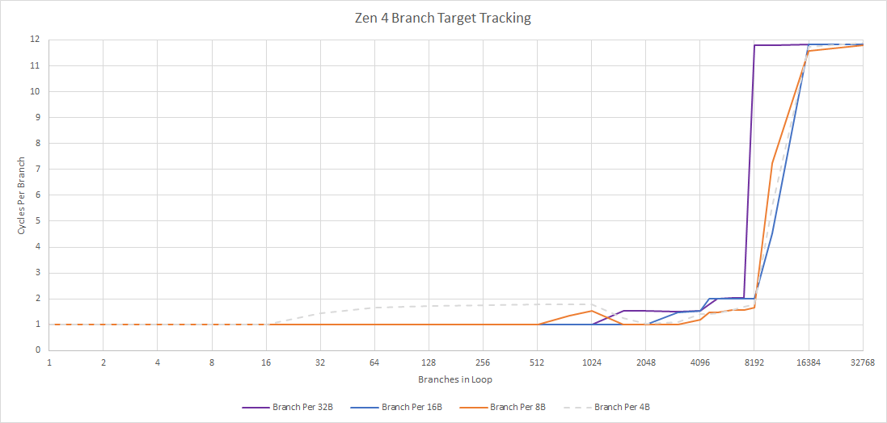

*图 7：曲线在快速层保持接近 1 cycle，越过有效 L1 后进入第二平台，超过末级容量再显著上升。分支间距会改变同一 Cache line 可共享多少目标，因此“目标数”不等于物理表项数。*

L2 BTB 从 Zen 3 的 6656 项增至 Zen 4 的 8192 项；更重要的是，L2 hit 惩罚从 3 周期降到 1 周期。

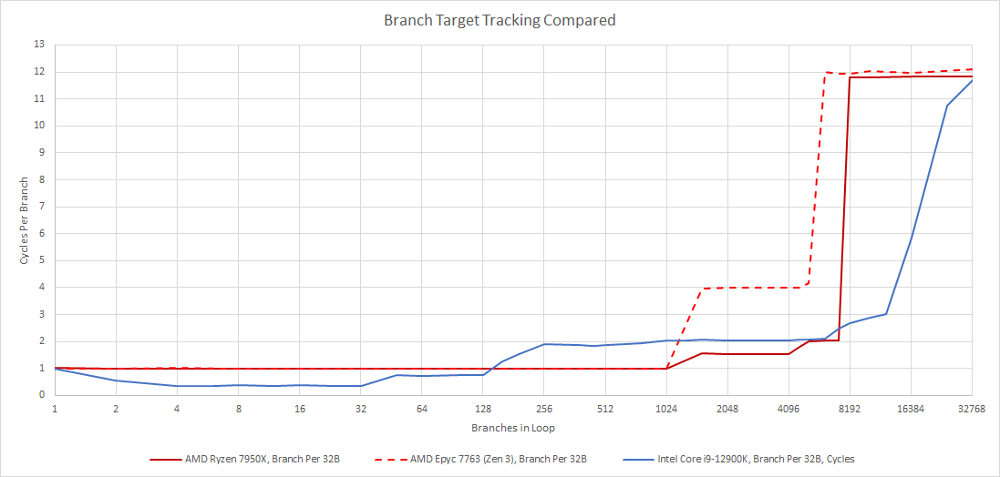

*图 8：Golden Cove 使用更复杂的三级组织，若把微操作队列的两 Taken/cycle 也算入甚至可称四级。128 个以内 Golden Cove 更快；更大脚印直到 Zen 4 的 8K L2 BTB 之前，AMD 更有优势；再往后 Intel 更大的末级 BTB 重新占优。*

## 间接分支与 Return：目标不止一个时怎么办

间接分支的同一 PC 可以跳向多个目标，常用于 `switch-case`、虚函数与解释器分派。AMD 另有 Indirect Target Array。Zen 4 在大量间接分支下可追踪约 3072 个目标而没有明显惩罚；单分支目标超过 32 后，代价逐步上升，却没有清晰的 mispredict 断崖。

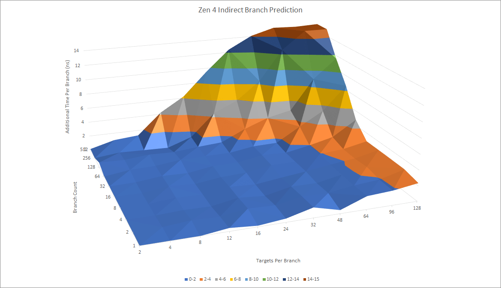

*图 9：同时改变目标数量与重复模式，观察间接目标阵列的有效历史与容量。目标越多，选择代价逐渐增加，但预测并未在 32 后立即失效。*

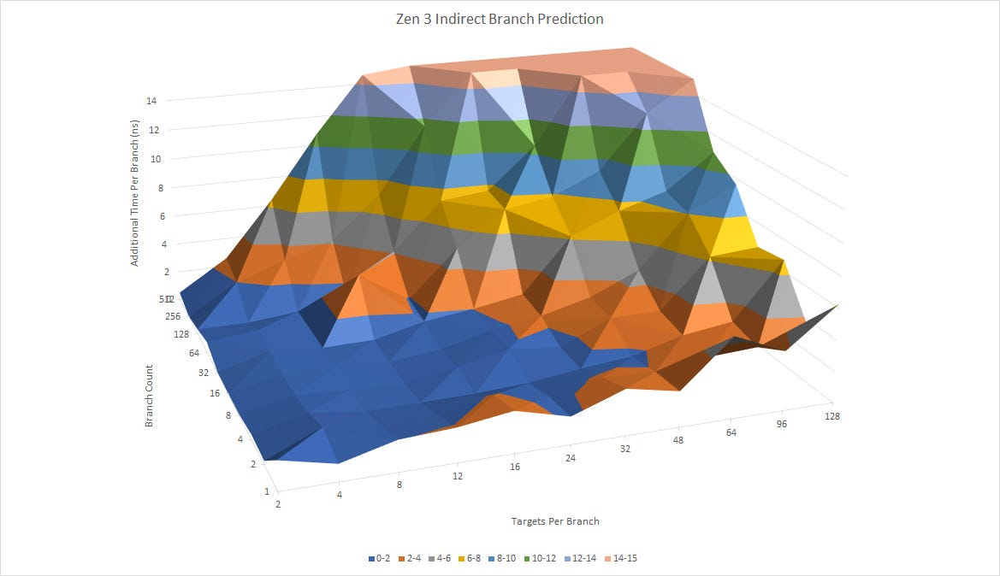

*图 10：图 9、10 正式图注说明 Zen 4 在上、Zen 3 在下。Zen 4 能追踪更多间接目标，从阵列取出结果的惩罚也更低。*

当许多间接分支同时存在时，Zen 4 优于 Golden Cove；少数分支各自拥有大量目标时，Golden Cove 更从容。旧 Zen 手册暗示 Indirect Target Array 也是 Override：若目标与上一次相同，快速主 BTB 可直接给出；目标越多，越常等待慢阵列。Golden Cove 的延迟随目标数增长较小，可能采用不同机制。

*图 11：Zen 4 在大量分支参与时保持更大的目标跟踪范围，体现阵列总容量优势。*

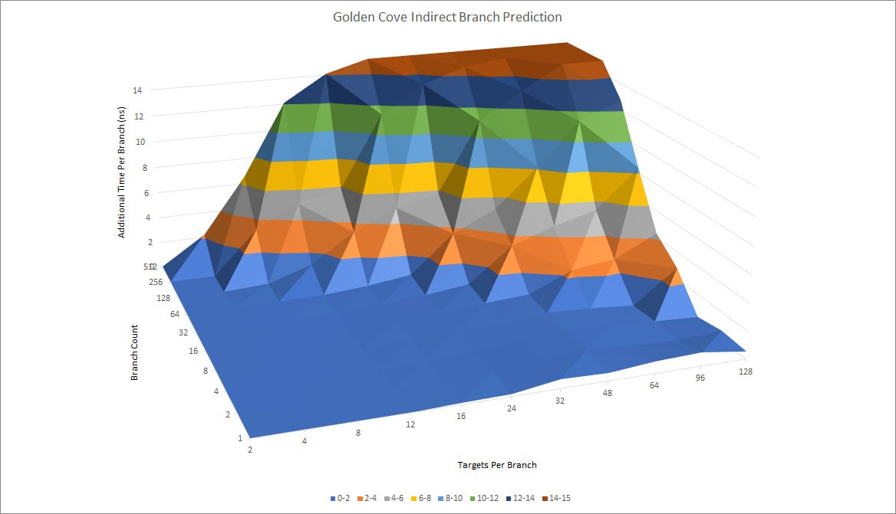

*图 12：图 11、12 正式图注说明 Zen 4 在上、Golden Cove 在下。Intel 在少分支多目标时更稳，AMD 在多分支压力下更强，两种组织优化了不同场景。*

Return 是特殊间接分支。Call 把下一条顺序地址压入 Return Address Stack（RAS），Return 再弹出；匹配调用通常可以极准确预测，极深调用才会溢出。Zen 4 与前代一样为 32 项，但单线程现在似乎可用全部 32 项。Golden Cove 在调用深度不超过 2 时非常快，之后变慢且没有明显容量断崖，可能在 RAS 溢出后平滑转向间接预测器。

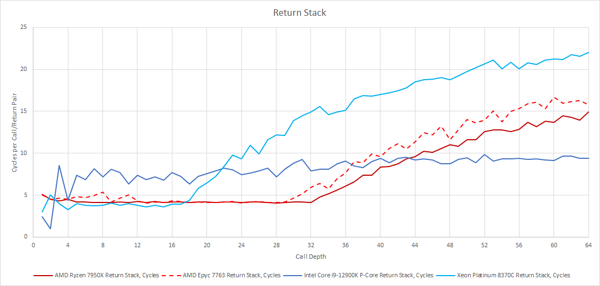

*图 13：Zen 4 的拐点支持单线程可用约 32 项 RAS；Golden Cove 的曲线形态不同，不能由此给出确定深度。SMT 分配方式、Call/Return 吞吐和溢出恢复都影响结果。*

## 微操作 Cache：6.75K 名义容量，四宽译码仍是后备窄口

Zen 4 把微操作 Cache 从 Zen 3 的 4K 扩到 6.75K。八字节 NOP 测试却在 32 KB 后就掉速，没有显出相应容量增长；一种解释是 L1I 包含或约束微操作 Cache 的有效覆盖。

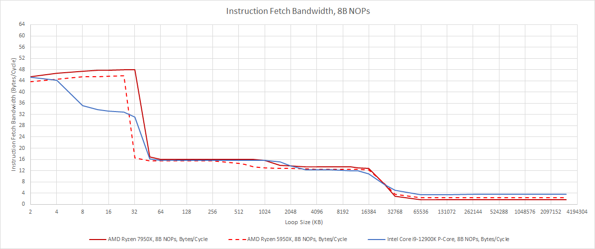

*图 14：Zen 4/Zen 3 在热点区接近 48 B/cycle，Golden Cove 也在相近峰值；越过 32 KB 后进入约 16 B/cycle L2 平台，L3 略高于 10 B/cycle。八字节 NOP 夸大了字节带宽需求。*

Zen 4 会成对处理 NOP，类似 Graviton 3，微操作 Cache 中甚至可见 12 NOP/cycle。AMD 给出的输出是 9 ops/cycle，而下游重命名仍为六宽；更合理的解释是每个 rename slot 每拍处理两条 NOP。

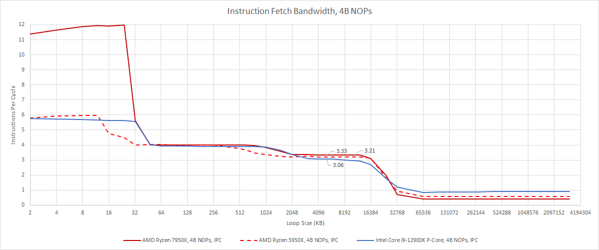

*图 15：热点区 Zen 4 接近 12 NOP/cycle，因此正式图注感叹“You cannot be serious”。这不是通用 12-wide 前端，而是 NOP 特殊压缩或融合行为。*

为绕开特殊处理，测试改用两字节 `XOR r,r`。它在进入重命名前表现得像普通指令，并可在那里消除。微操作 Cache miss 后，吞吐落到四宽主译码器；L2 仍约 16 B/cycle，L3 略高于 10 B/cycle。

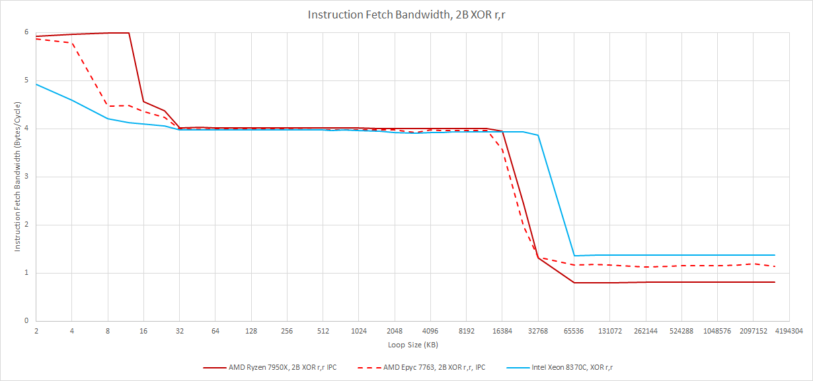

*图 16：Zen 4 微操作 Cache 区接近六宽，L1I 区降到四宽译码上限。网页图注提醒纵轴误写为 Bytes per Cycle，实际应为 IPC；同时因已无法访问 Golden Cove，图中改用 Ice Lake 对照。*

### 体系结构视角：特殊指令会欺骗“宽度”微基准

NOP 融合、零惯用法、MOV elimination 都可能让一条 ROB 或 rename slot 表示多条 ISA 指令。用它们直接测 IPC，会得到超过名义宽度的数字。可靠做法是准备多种指令序列，并同时检查 decoded/retired uops、端口占用和资源拐点。

6.75K 微操作 Cache 的价值仍在于覆盖高 IPC 热点。若代码脚印大到溢出这一级，又大量使用长指令，通常也更可能给 L1I 带来压力；此时四宽译码和 L2 的 16 B/cycle 会共同限制供给。

## 重命名：Zen 4 像 Zen 3，Golden Cove 仍多几招

重命名连接按序前端与乱序后端，为在途操作分配 ROB、寄存器和队列，并消除伪依赖。Zen 4 可打破清零惯用法与寄存器 MOV 的依赖，整体行为接近 Zen 3。

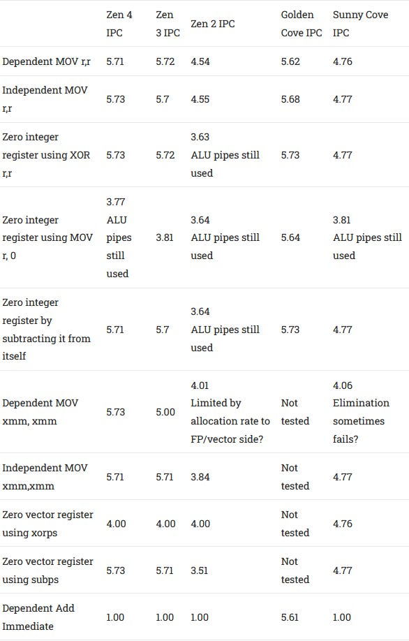

*图 17：Zen 4/Zen 3 的依赖 MOV 为 5.71/5.72 IPC，独立 MOV 5.73/5.70；XOR 清零 5.73/5.72，SUB 清零 5.71/5.70。`MOV r,0` 仍用 ALU，约 3.77/3.81；Golden Cove 可消除这一情形并达到 5.64，还能以约 5.61 IPC 处理依赖小立即数 Add，Zen 4 只有 1.00。*

消除 MOV 可让多个架构寄存器指向同一物理寄存器，不必额外分配；已知为零的寄存器也可只在 Register Alias Table 中记录一个零标志。Zen 4 继承了 Zen 3 的这类节省。

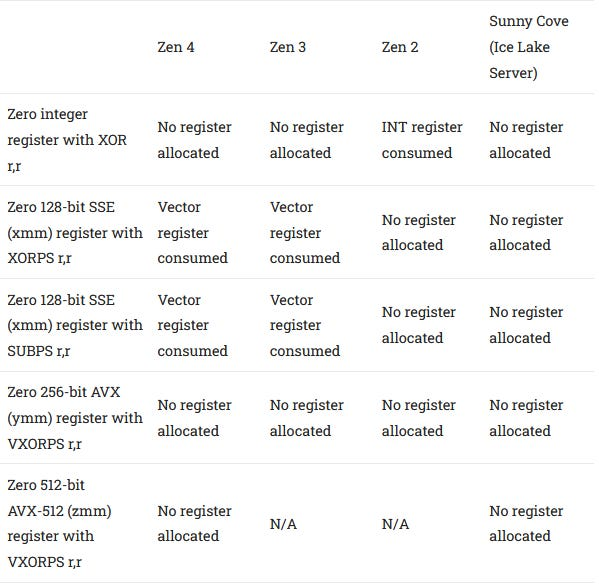

*图 18：整数 XOR、256-bit VXORPS 和 512-bit VXORPS 在 Zen 4 上都不分配新寄存器；128-bit XMM 的 XORPS/SUBPS 却会消耗一个向量寄存器，Zen 3 相同，Zen 2 与 Sunny Cove 不会。`VZEROUPPER` 不能改变结果，可能说明 Zen 3/4 以 256-bit 粒度跟踪向量寄存器。*

Intel 在测试的所有清零情形中都能避免分配，而且至少可追溯到 Skylake。这里的差异很小，却说明 rename optimization 既要看吞吐，也要看是否真的省下后端条目。

## 乱序资源：320 项 ROB，比例往往比绝对值更重要

Zen 4 的结构增长从 Store Queue 的 0% 到 ROB 的 25% 不等；发生变化的结构多为 10%～20%，整体略大于 Zen 1 到 Zen 2。与 Intel 相比，Zen 4 仍是一颗相对小的核心，许多关键容量甚至低于 Sunny Cove，更不用说 Golden Cove；但 AMD 的 Cache 延迟更低，对窗口深度的需求也不同。

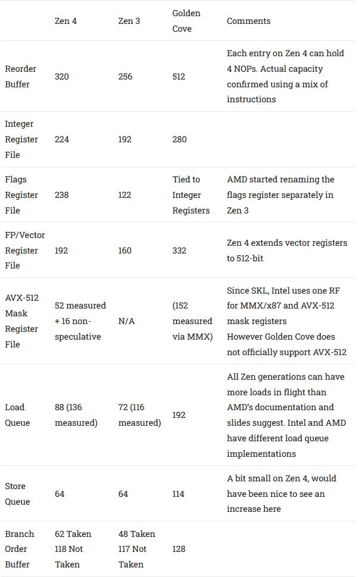

*图 19：Zen 4/Zen 3/Golden Cove 的 ROB 为 320/256/512，整数寄存器 224/192/280，Flags 238/122/与整数绑定，FP/向量 192/160/332，Store Queue 64/64/114；Zen 4 Mask RF 测得 52 个 speculative rename 加约 16 个非投机状态。Load Queue 文档值为 88/72，但测试可见 136/116；两家实现口径不同。*

Zen 4 的 224 个整数物理寄存器中，测试可用约 202 个保存 speculative result，占 320 项 ROB 的 63%；Golden Cove 测得约 242，占 512 的 47.2%。Zen 4 只有约 22 个被非投机状态占用，若假设 Intel 没缩减整数 RF，Golden Cove 则约 38 个不可用于投机结果。Golden Cove 更容易先被整数寄存器限制。

Zen 4 的 ROB 还有特殊行为：每项最多容纳 4 条 NOP，测试甚至测到 1265 条 NOP。更可能的路径是译码器先把 NOP 两两融合，重命名再把两组融合结果合并。实际代码收益有限，因此文章另用最多 128 条整数 Add、128 条 FP Add、40 条 Store 和 55 条分支的混合序列，确认公开的 320 项 ROB。

### 体系结构视角：微操作融合会改变所有“条目数”的口径

ROB 究竟按 ISA 指令、宏操作还是微操作记账，会随指令类型变化。1265 条 NOP 不表示 Zen 4 有 1265 项通用 ROB；只有混合真实操作并找到共同阻塞点，才能接近通用容量。

资源是否够用还取决于工作负载比例。Store Queue 没有扩容，对普通整数代码可能够用；512-bit Store 每条占两项时，64 项却会很快成为限制。应通过 resource-stall 事件、free-list 与队列 full 周期验证，而不是把 25% ROB 增长平均套到所有程序。

## 调度与执行：布局不变，把时序预算留给频率

Zen 4 的调度器和执行管线布局基本沿用 Zen 3。整数侧共享 ALU/AGU 调度容量，灵活性来自每个队列连接多类端口；FP/向量侧保留大型非调度队列，把原先统一四端口调度改成两个三端口调度器，因为两边连接能力相近，行为接近统一调度。

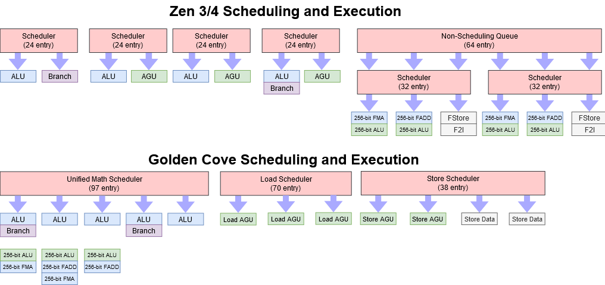

*图 20：Zen 4 继承 Zen 3 的调度执行组织；Golden Cove 用更大的统一数学调度与独立 Load/Store 调度。分区队列更易高频实现，但分配不均时不能自由借用空位。*

调度器面积与功耗昂贵：潜在上每项每拍都要检查源是否 ready，并在结果广播同拍完成 wakeup/select。哪怕延迟一个周期，也可能单独造成约 10% IPC 下降。队列越大，比较、广播和选择网络越难在高频收敛。

AMD 很可能把预算投向频率而非继续扩容。调度条目存在边际收益递减，只要 Cache 足以避免 DRAM 瓶颈，性能通常能较线性地随频率提高。这个解释符合结果，但仍是文章根据设计取舍作出的判断。

## AVX-512：512-bit 在窗口里是一条，在执行端再 Double Pump

Zen 4 是 AMD 第一代 AVX-512 核心，特性覆盖大致接近 Ice Lake。实现目标位于极简的 Centaur CNS 与 Intel 服务器核心之间，在面积、功耗和性能间取平衡。

AMD 过去常把长向量尽早拆成两条微操作：Bulldozer 把 256-bit AVX 拆成两个 128-bit，K8 把 128-bit SSE 拆成两个 64-bit。这样容易支持新 ISA，却无法让一项队列资源代表更多工作。Intel 则从 Sandy Bridge 起采用全宽 AVX，Server Skylake 也对 AVX-512 如此。

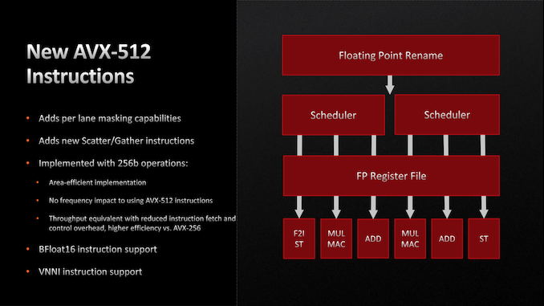

*图 21：AMD 强调增加新 AVX-512 指令、Mask、512-bit 寄存器和 Double Pump 执行，并保持软件兼容。公开图表达功能目标，不等于逐级实现细节。*

Zen 4 在大部分流水线里把一条 512-bit 指令保持为一个微操作，只占一个 ROB、调度器和相关缓冲条目；进入 256-bit 执行管线后才可能拆为两半。文章把这理解为 Double Pump 的含义。代价是物理向量寄存器扩到 512 bit，面积和读写能耗上升。

512-bit Store 是例外：它仍译成两条微操作，占两个宝贵的 Store Queue 项。Store 必须留到退休后才能把确定正确的数据提交到 Cache；AMD 的 64 项队列又比 Intel 小，因此这是 Zen 4 AVX-512 最明显的结构短板。

L1D 仍只能每周期两次 256-bit Load 和一次 256-bit Store，向量访存带宽与 Zen 2 相同。泄露资料所谓“对齐改到 512 bit”至少不适用于 Store。执行吞吐也大致未变：Zen 2/3/4 都有两条 256-bit FMA 和四条 256-bit ALU。

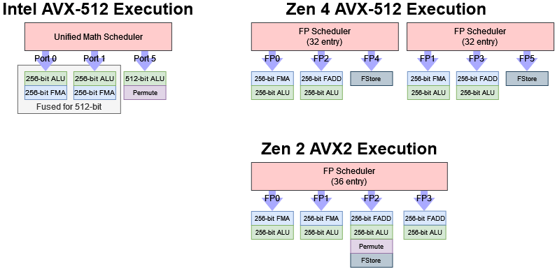

*图 22：Zen 4 用 256-bit 管线 Double Pump 512-bit；Intel 客户端把 Port 0/1 的两个 256-bit 单元合并执行 512-bit；Zen 2 只支持 256-bit。原图曾把 Zen 4 Permute Lane 位置画错，更新说明其位于 FP1/FP2。*

Intel 客户端 512-bit 操作会把 Port 0/1 两个 256-bit 单元结合起来。混合 256-bit 与 512-bit FMA 时，执行模式似乎只能在 `1×512` 或 `2×256` 中选择，不能同拍混用，结果卡在每周期一个向量操作。

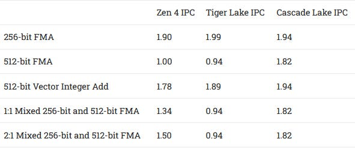

*图 23：Zen 4/Tiger Lake/Cascade Lake 的 256-bit FMA 为 1.90/1.99/1.94 IPC，512-bit FMA 为 1.00/0.94/1.82，512-bit 向量整数 Add 为 1.78/1.89/1.94；混合 256/512-bit FMA 的 1:1 比例为 1.34/0.94/1.82，2:1 为 1.50/0.94/1.82。*

AVX-512 的 K Mask 需要新寄存器文件。Zen 4 约有 52 个可重命名 Mask 状态，再加约 16 个非投机状态，明显小于 Skylake-X 或 Ice Lake；考虑 Zen 4 总窗口更接近 Ice Lake，AMD 没有把面积重点放在这里。

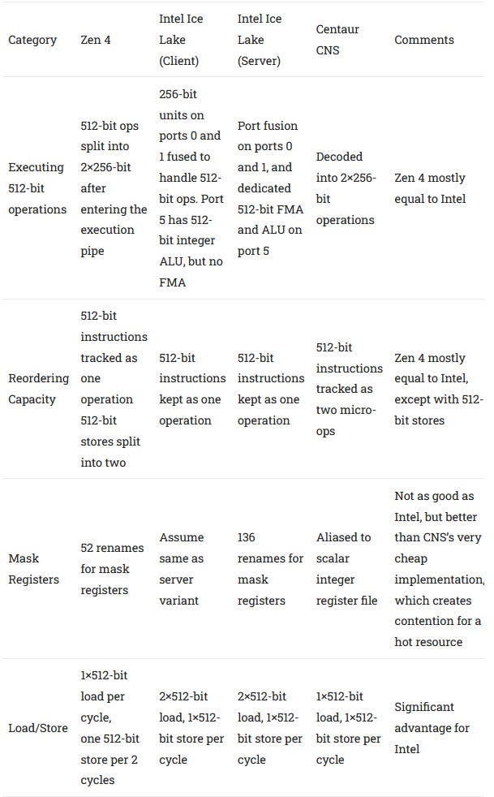

*图 24：表格比较 Centaur CNS、Zen 4、Intel Client 与 Server 在 512-bit 微操作、寄存器、Mask、执行宽度与访存上的选择。Zen 4 比极简 Centaur 获益更大，却不如 Intel 服务器全宽；它避免增加昂贵 FMA 单元，也没有扩宽 L1D/L2。*

Daniel Lemire 的整数转字符串测试会利用 AVX-512 新指令。Golden Cove 若启用 AVX-512，在缩放和绝对性能上都超过 Zen 4；但这一代 Intel 混合客户端产品无法正式启用该功能，实际软件竞争中 AMD 反而拥有 ISA 可用性优势。

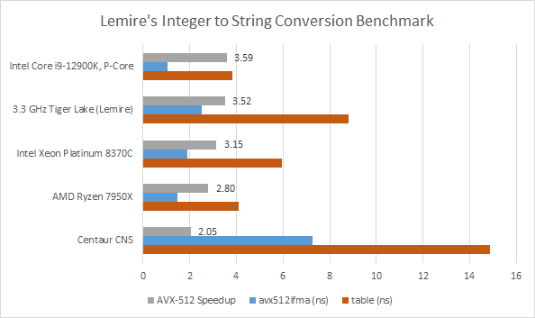

*图 25：柱状图同时展示 AVX-512 speedup、AVX-512 吞吐与表格法。12900K P-Core 启用后约 3.59，Tiger Lake 约 3.52，Xeon Platinum 8370C 约 3.15，Ryzen 7950X 约 2.80，Centaur CNS 约 2.05；平台与频率不同，重点是各实现相对自身基线的收益。*

### 体系结构视角：有效向量宽度不只由执行管线位宽决定

Zen 4 的 FMA 仍是 256-bit 物理管线，但一条 512-bit 指令在 ROB 和调度器里只占一项，因此相同条目可跟踪两倍数据工作。新 AVX-512 指令还可能用更少指令完成任务，即使 retired IPC 下降，performance per clock 也可能提高。

另一方面，Load/Store 带宽和 Store Queue 没有同比扩张。计算密集内核可受益，流式 512-bit Store 却会同时撞上双微操作与两项队列成本。验证应同时观察向量指令数、执行端口、L1D 带宽、Store Queue full、降频和整段完成时间，不能只看 IPC。

## 上篇结论：提高利用率，而不是把每一处都做大

Zen 4 的前端和乱序引擎有实质提升：强大的 L2 方向预测、更多快速 BTB 目标、更大的微操作 Cache 与更深的窗口，能让已有执行资源获得更稳定供给。调度器与执行单元却几乎不变；Zen 3 的布局本就灵活充足，AMD 更看重高频。整数 IPC 仍会提高，但这一代总体性能更依赖频率增长。

Load/Store 带宽是明显保守处：L1D 每拍 512-bit Load、256-bit Store，与 Zen 2/3 以及 Haswell/客户端 Skylake 同级。对 256-bit 或更窄向量仍很强，却不及 Golden Cove 的私有 Cache 供给。

AVX-512 是 AMD 的王牌。它不是全宽、全带宽实现，却足以在存在优化路径而对手无法启用 AVX-512 时形成巨大优势；当然，若多线程向量程序先被 Cache 与内存卡住，执行端的 ISA 优势也无法完全兑现，这正是下篇要处理的问题。

文章最后列出 Patreon、PayPal 与 Discord；更新记录则说明 2022 年 11 月 7 日从 Zen 4 执行图中删除了 Permute Unit。

## 体系结构视角：从 Zen 4 上篇得到的六点认识

第一，**预测器可以不更宽，却让宽度更常被利用**。更大 L1 BTB、低惩罚 L2 BTB 和强 Override 减少前端空泡与错误路径。

第二，**名义容量必须通过真实指令组合确认**。6.75K 微操作 Cache 没在 NOP 中完全显现，320 项 ROB 却能用整数、FP、Store 和分支混合序列复核。

第三，**资源比例比单一 headline 更重要**。Zen 4 的整数寄存器覆盖约 63% ROB，Golden Cove 约 47.2%；较小核心未必更早耗尽有效窗口。

第四，**高频会限制调度器和重命名的野心**。这些结构需要同拍读写、比较与广播，增加 5% 容量未必比提高 5% 频率划算。

第五，**AVX-512 的价值包含“每条队列项承载更多工作”**。即使执行管线 Double Pump，一项 ROB/调度资源仍能代表 512-bit 数据；但 512-bit Store 例外地消耗两项。

第六，**执行能力最终要由存储系统喂饱**。Zen 4 没增加稳态 ALU/FMA 吞吐，却通过预测、窗口与频率改善利用率；下一步必须看 L1D、L2/L3、TLB 与 DDR5 是否跟得上。

## 参考资料

- Chester Lam, *AMD’s Zen 4 Part 1: Frontend and Execution Engine*, Chips and Cheese, 2022-11-05：https://chipsandcheese.com/p/amds-zen-4-part-1-frontend-and-execution-engine
- AMD, *Software Optimization Guide for AMD Family 17h Processors*
- AMD Zen 4 / AVX-512 公开演示材料（原文章所引）
- Daniel Lemire, Integer to String Conversion Benchmark
