# Hot Chips 2024 的 Zen 5：宽前端、512-bit 后端与真正的设计取舍

> **文章来源**
>
> - 文章：*Discussing AMD’s Zen 5 at Hot Chips 2024*
> - 撰文：Chester Lam
> - 首发：Chips and Cheese
> - 发布：2024 年 9 月 15 日
> - 链接：https://chipsandcheese.com/p/discussing-amds-zen-5-at-hot-chips-2024

Hot Chips 的价值不只在幻灯片，也在会场交流。本文把 AMD 的正式演讲、Zen 5 优化指南、会场问答与此前微基准放在一起，重点回答几个“规格表看不出来”的问题：双译码集群为什么不能合并给单线程？6K 项 Op Cache 为什么可能比 Zen 4 的 6.75K 项更有效？512-bit 执行扩宽以后，调度器、Store Queue 和 Cache 怎样控制成本？

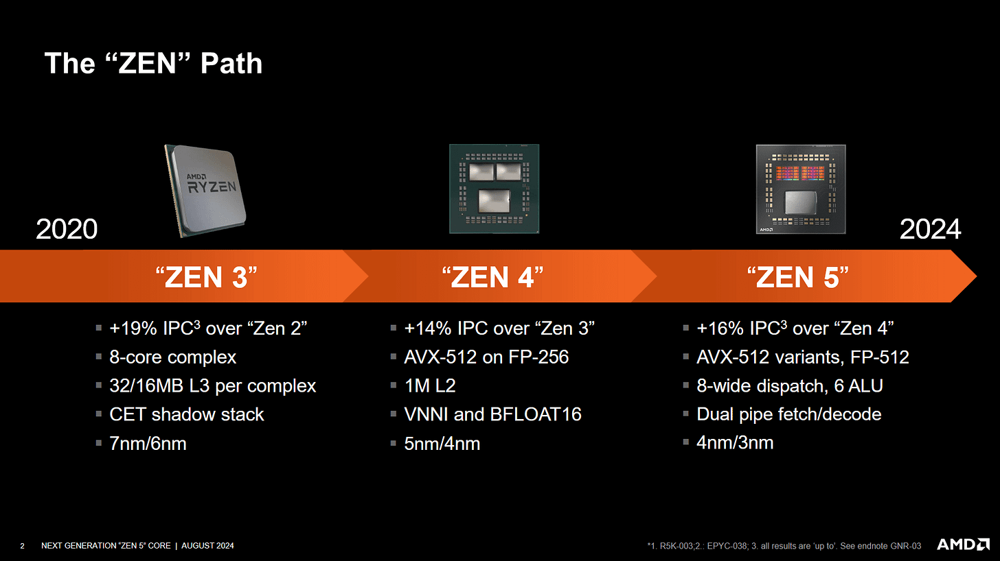

*图 1：Zen 5 继续同时追求单线程和 SMT 吞吐。AMD 的内部评估认为，保留 SMT 能维持最大单线程性能，并在多线程负载中提高吞吐和能效；这是厂商对自身设计的判断，不是跨平台统一实测。*

## 一、前端：两条译码路径，仍以 Op Cache 为主

Zen 5 后端更宽，前端相应复制了多项资源。分支预测器更快、更准确，Branch Target Cache 也更大。两套 Fetch/Decode Cluster 分别服务两个 SMT 线程：单线程即使关闭 SMT，也只使用其中一套 4-wide Decoder。

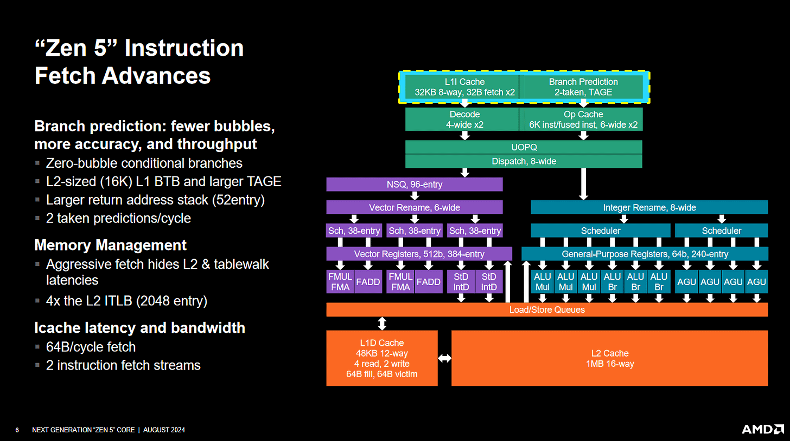

*图 2：Branch Prediction、Fetch/Decode 与 Op Cache 最终汇入有序微操作队列。图中的并行通道不等于单线程 8-wide Decode。*

会场交流给出的难点是顺序合并。两条独立取指/译码流若服务同一线程，必须在进入有序微操作队列前恢复严格程序顺序；重命名又需要按序维护寄存器映射。AMD 承认某些代码会受益于单线程 8-wide Decode，但 Zen 5 的主要目标是让热点代码从 Op Cache 运行。与 3.8 GHz 左右的 Crestmont 相比，在 5.7 GHz 上实现跨集群合并也更难收敛时序。

Zen 5 的 Op Cache 名义容量从 Zen 4 的 6.75K 项变成约 6K 项，却能在一个 Entry 中容纳一条指令产生的多个微操作；Zen 4 更接近“一微操作一项”。融合后的相邻指令也可共用一项。微码指令仍受每行最多四条微操作等限制。更高相联度和更小 Line 进一步提高有效密度，因此实际命中率常高于 Zen 4。

Zen 4 可把微操作队列当作 Loop Buffer，Zen 5 没有这一路径。会场解释不是“删除旧功能”，而是全新前端没有把这项以节能为主的功能重新加入；工程时间被投入到收益更高的模块。

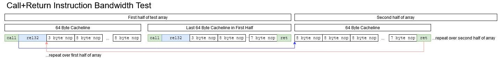

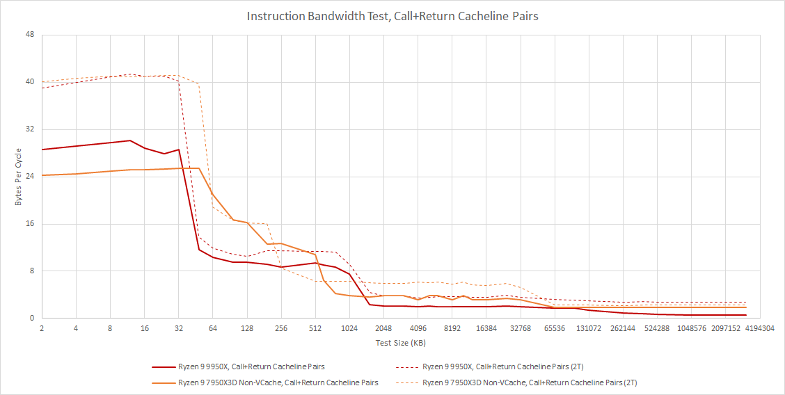

*图 3、4：代码位于 Op Cache 时，Zen 5 对跳转基本块有优势；工作集进入 L3 后，Zen 4 的 1T、2T 指令带宽反而更高。微基准未能证明 Zen 5 两条取指管线会共同服务单线程，原因仍未确定。*

Calls、Returns 和目标变化的间接分支仍会出现前端气泡。直接分支已能较好做到零气泡，但 RAS 取回目标和间接目标选择更复杂，仍是下一代前端可以继续改善的地方。

### 体系结构视角：前端宽度要看“路径覆盖”，不是把数字相加

Decode、Op Cache 与 Loop Buffer 是不同供给路径。峰值宽度只有在对应路径命中、分支位置合适且下游队列有空间时成立。Zen 5 选择用高密度 Op Cache 支撑单线程，用双 Decode 支撑 SMT；这是用覆盖率和频率目标换取实现可行性，而不是简单少做四个槽位。

## 二、整数执行：统一调度与分布式调度各有代价

Zen 5 把 ALU 与 AGU 放在统一调度器中。执行端口更对称，调度器可以做 Age-order Pick，优先选择等待最久的 Ready 微操作，以更快解除后续依赖。

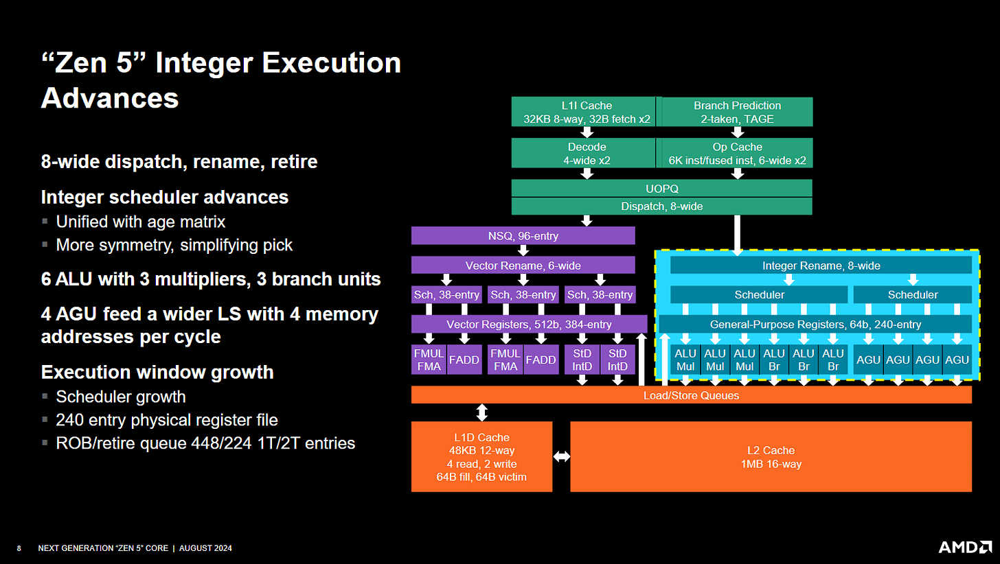

Qualcomm Oryon 则采用分布式队列，认为小队列更容易接近 Oldest-first。AMD 的观点是，分布式队列可能让某条队列前积压，而其他具备同类功能的端口空闲；统一队列能减少这种“假阻塞”。两种说法都成立：统一结构利用率更高但选择逻辑更复杂，分布式结构更易做高速选择却可能产生队列失衡。

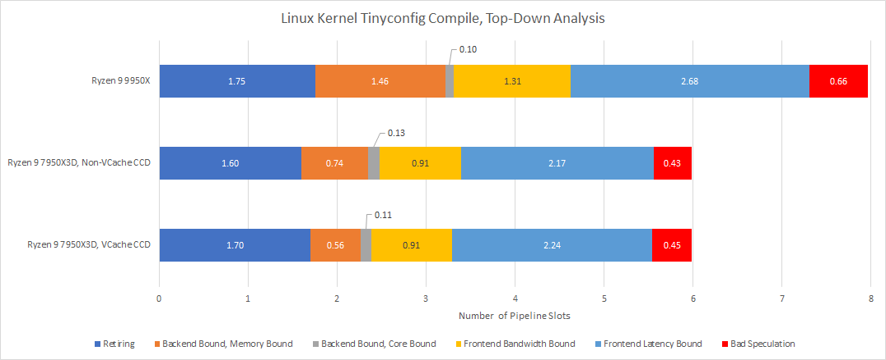

*图 6、7：网页没有给出足以量化两种策略优劣的同平台数据。Zen 5 的测试显示 Core-bound 略少于 Zen 4，但前端和内存延迟通常是更大的限制。*

## 三、FP/向量：四条 512-bit 管线，但调度器存在“慢区”

后续增加独立依赖链后，微基准确认 Zen 5 可以并行执行四条 512-bit 向量整数操作，修正了此前因测试链不足而低估吞吐的判断。

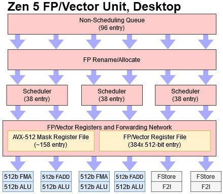

向量整数加法的两周期测量也得到更精确解释。AMD 的延迟表指出：当 FP Scheduler 已满时，最老的一部分 Entry 构成 Slow Region；其中的操作若依赖一周期操作，会额外增加一周期。若依赖 Load 或其他长延迟操作，则没有这项惩罚。

这看起来违背“优先照顾最老指令”的直觉，但它也说明 AMD 没有为了 512-bit ALU 或寄存器读取而给所有路径统一加一级流水。代价只落在“调度器已满、操作位于慢区、依赖一周期结果”的交集，实际影响取决于关键依赖链是否经常进入这一角落。

### 体系结构视角：容量、时序与唤醒选择必须一起看

扩大 Scheduler 会增加比较器、唤醒广播和选择扇出。把一部分老 Entry 做成慢路径，是用少数满载角落的一周期代价换取更大容量与更高频率。验证它不能只跑独立吞吐，还要逐步增加依赖链、占满队列，并分别让生产者来自一周期 ALU 和长延迟 Load。

## 四、Load/Store：队列“能看到多少”不等于结构有多少项

Zen 5 把 L1D 容量与相联度提高 50%，仍维持四周期 Load-to-use；L2 相联度也增加。此前微基准测到约 202 个 Load 在飞，曾被解释成 Load Queue 容量。AMD 优化指南后来澄清：LSU 最多跟踪 64 个未完成 Load，对已经完成的 Load 没有特定上限。原测试使用已完成 Load，更可能先耗尽整数物理寄存器，而不是 Load Queue。

Store Queue 有 104 项，但一条 512-bit Store 仍占两项。AMD 没把每项扩宽到 512 bit，因为 Store Queue 类似多读口寄存器文件：年轻 Load 可能从任意项转发数据，退休端也要读取 Store 数据写入 Cache，全面扩宽会显著增加面积和能耗。

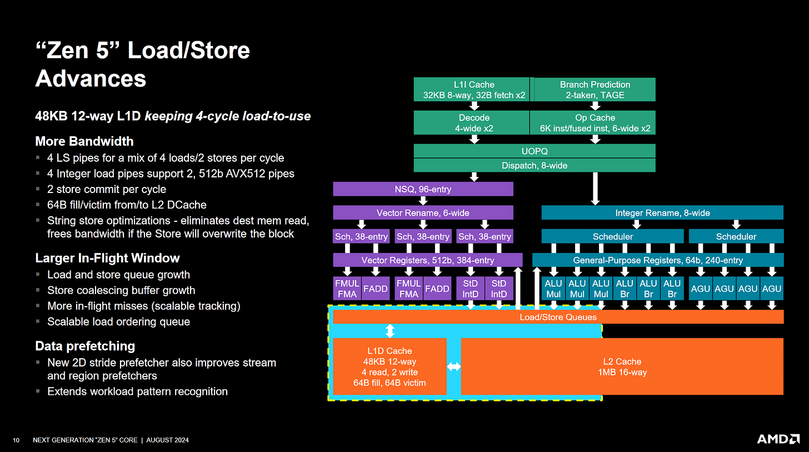

L1D 每周期可处理两次 512-bit Load 和一次 512-bit Store，L1/L2 之间也扩到 512 bit。优化指南还给出最多 124 个 Outstanding L1 Miss；Zen 3/4 为 24，Zen 1/2 为 22。这是单核 Memory-level Parallelism（MLP）的巨大扩展。

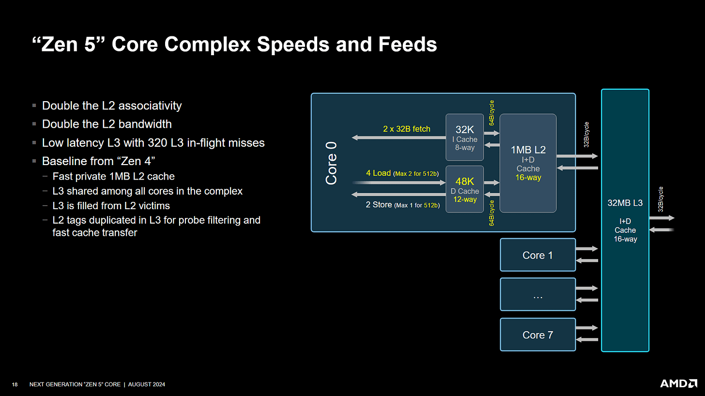

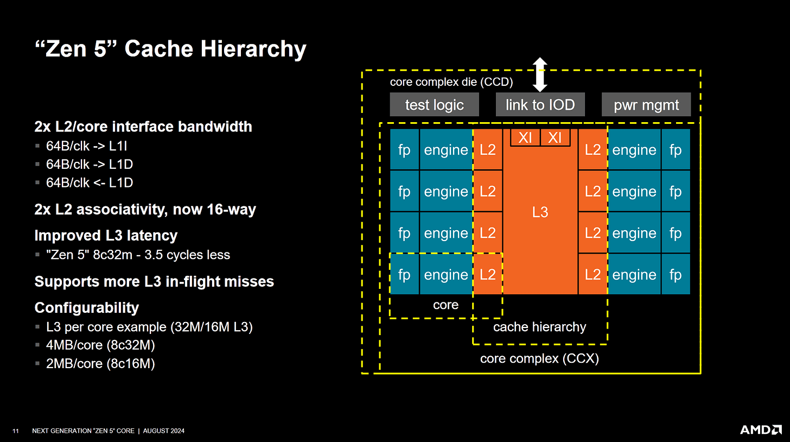

*图 11：L3 容量与布局延续 Zen 3/4，但延迟降低约 3.5 周期。AMD 还强调 Core、Cache 容量与核心数可组合成不同面积/功耗配置；这种模块化并非 Zen 5 才首次出现。*

## 五、性能：厂商 16% IPC 与独立 SPEC 结果不是同一口径

AMD 把 Zen 5 的平均每周期提升归因于前端、执行、Load/Store 和 Cache 等多项变化，并指出大代码工作集获益比例更高。

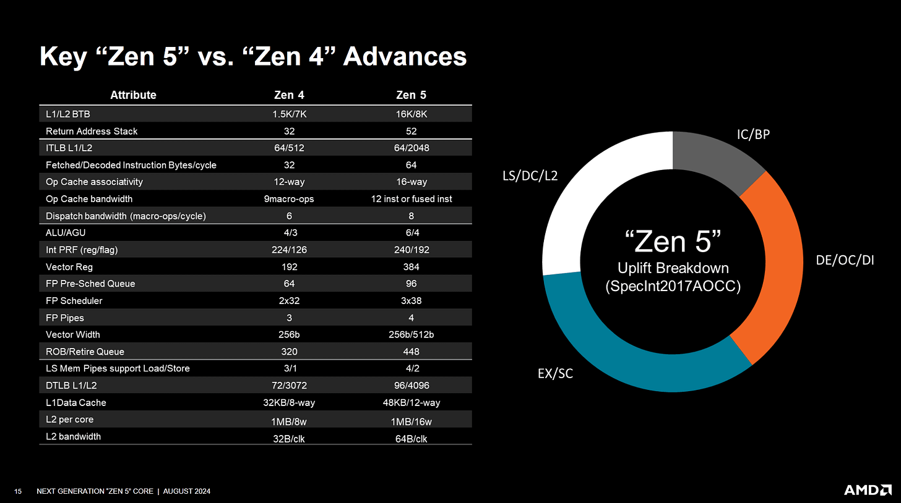

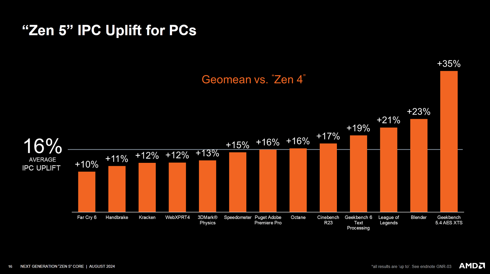

*图 13：AMD 使用 Ryzen 9 9950X 与 Ryzen 7 7700X，均为 4 GHz、DDR5-6000。它是厂商选择的一组应用平均值。*

另行测试的 SPEC CPU2017 使用 AMD 提供的 9950X、DDR5-6000，以及自有 7950X3D、DDR5-5600；未锁频，GCC 14.2，参数为 `-O3 -mcpu=native -fomit-frame-pointer`，分数未提交 SPEC，均标作 Estimate。它既不严格同频，也不能与 AMD 的编译器和数据直接比较。

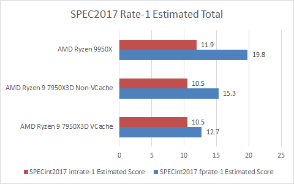

整数 Rate 单 Copy 中，9950X 比 7950X3D 总体高 13.3%。7950X3D 的 V-Cache 与非 V-Cache 核心总体分数相同，子项却差异很大。相近末级 Cache 容量时 Zen 5 通常领先，但 `531.deepsjeng` 等只有低个位数提升；对 V-Cache Zen 4，`548.exchange2` 可领先 50%，`520.omnetpp` 却落后 10.6%。

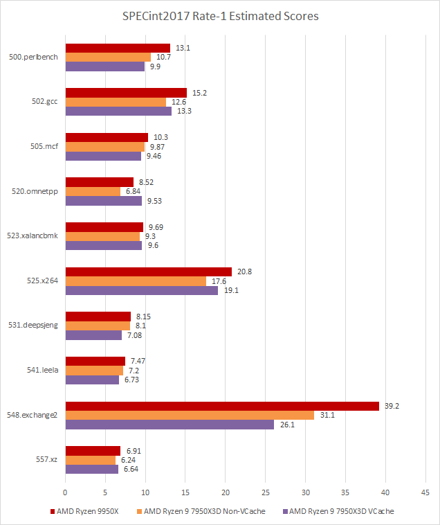

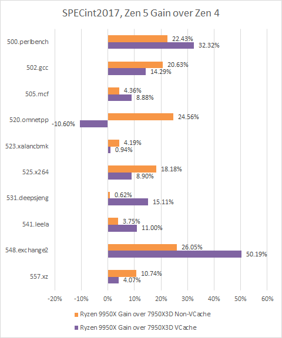

浮点套件中，Zen 5 相比普通和 V-Cache Zen 4 分别领先 29.4% 与 55.9%，而且所有浮点子项都领先。大 FP/向量寄存器文件、更大调度容量、重命名前的非调度队列和完整 512-bit 执行共同发挥作用。整数侧的物理寄存器增幅较小，多加 ALU 端口也容易出现边际递减。

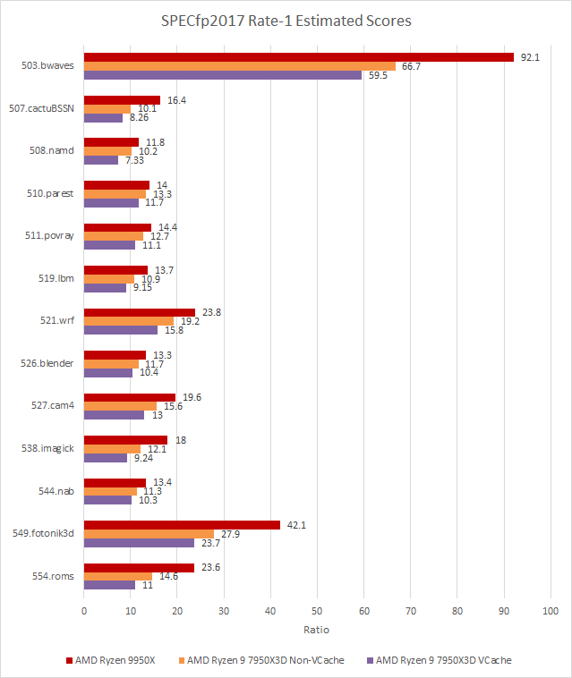

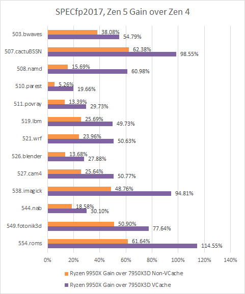

## 六、Zen 5 的核心方法不是“每项都做满”

Zen 5 的设计取舍贯穿整颗核心：单线程不合并双 Decoder，把预算放到 Op Cache；向量 Scheduler 保留窄条件下的慢区，以维持容量与频率；Store Queue 不全面扩宽，避免昂贵多端口阵列；同时把 L1 Miss 并行性扩大到 124 个，解决宽后端更常遇到的长延迟问题。

这说明评价宽核心不能只统计 Decode、Port 和 Queue 的最大数字。真正关键的是：常见路径能否高速，少见慢路是否可控，容量是否足以让延迟隐藏，以及这些选择在真实工作负载中是否同时出现。Zen 5 的浮点提升很强，整数提升则更依赖具体分支、Cache 与代码足迹；一个平均 IPC 数字无法替代逐子项分析。

## 参考资料

- Chester Lam，*Discussing AMD’s Zen 5 at Hot Chips 2024*：https://chipsandcheese.com/p/discussing-amds-zen-5-at-hot-chips-2024
- AMD，*Software Optimization Guide for AMD Family 1Ah Processors*
- AMD，Zen 5 Instruction Latencies Spreadsheet, Version 1-00
