# AmpereOne：为密度而生

> **文章来源**
>
> - 文章：*AmpereOne at Hot Chips 2024: Maximizing Density*
> - 撰文：Chester Lam
> - 首发：Chips and Cheese
> - 发布：2024 年 8 月 29 日
> - 链接：https://chipsandcheese.com/p/ampereone-at-hot-chips-2024-maximizing-density

Ampere Computing 把目标锁定在 Cloud-native 处理器：同一台物理服务器尽量服务更多用户，同时提供安全、隐私和稳定性能，而且不把工艺节点缩放当作唯一增长来源。会提高峰值、却破坏可预测性的机制因此被排除，包括 Simultaneous Multithreading（SMT）和运行中动态改变时钟频率。

AmpereOne 是 Ampere 第一代自研服务器核心。它与 AWS Graviton 4、Nvidia Grace 以及上一代 Ampere Altra 形成鲜明对比：后三者都直接采用 Arm Neoverse 核心。AmpereOne 产品最高可到 3.7 GHz；Hot Chips 前 Oracle 已开放云实例，但被测 SKU 最高只有 3 GHz。

这篇文章把 Ampere 的 Hot Chips 2024 演讲与 Oracle 实例微基准放在一起：演讲给出设计目标、框图和厂商数据；微基准用来检查预测、队列、Cache 和实际性能。二者口径不会被强行合并，未知结构仍保留近似和推测。

网页没有给出 Oracle 实例的完整 OS、Kernel、编译器与 Flags、预热、重复次数和误差。性能对照来自不同 ISA、消费级与云平台，部分核心被约束到约 3 GHz；只能观察结构取舍和每核趋势，不能替代整机功耗、价格或机架级复测。

## 一颗把 L2 放在中心的核心

AmpereOne 的 GDS 图最显眼之处是 2 MB 私有 L2。核心逻辑集中在上半部，L2 SRAM 占据大块面积。Zen 4c 也呈现类似现象：即便它只有 1 MB L2，Cache 相对缩小后的核心逻辑依然很大。

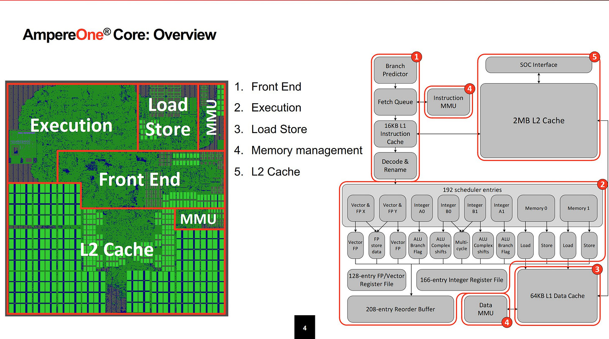

*图 1：左侧 GDS 标出 Front End、Execution、Load/Store、MMU 与 L2；右侧框图给出 208 项 ROB、166 项整数和 128 项 FP/Vector 寄存器、64 KB L1D、2 MB L2。L2 是核心面积的主体之一。*

*图 2：Hot Chips 2023 的 Zen 4/Zen 4c 版图。网页正式图注提示关注 Zen 4c 的 L2 与其余核心逻辑面积。跨厂商、跨工艺的版图不能直接推导 SRAM 密度，但能说明密度优化后 Cache 未必同步缩小。*

这也许是 Density-optimized Core 的共同特征：高性能设计里的 L2 本就使用高密度 SRAM，缩小流水线、执行逻辑和 L1 后，L2 在面积构成中自然更突出。

### 体系结构视角：密度优化不是把所有结构等比例缩小

核心逻辑含多端口寄存器文件、Wakeup/Select、旁路和高扇出控制，缩窄宽度与降低端口数可显著省面积和功耗；大容量 SRAM 的单位位面积已经很紧凑。保留 2 MB L2，还能减少进入 Mesh 的 Miss，改善多租户环境中由远端流量引起的性能波动。

因此“L2 占比很大”不等于浪费面积。应结合 L2 Hit Rate、每核 Mesh 请求、尾延迟与同面积可容纳核心数判断，而不是只看核心框图的几何比例。

## 前端：小 L1I、强 L2 供给与激进融合

AmpereOne 使用八表 TAGE 方向预测器。八张表采用几何递增的历史长度，每个分支由最适合其相关距离的表提供预测。这是与 AMD、Qualcomm 以及很可能 Intel 同一时代的主流高精度路线。

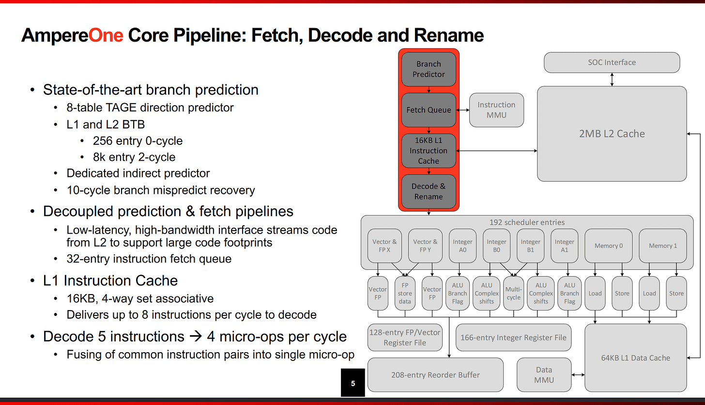

*图 3：Ampere 公开的前端参数包括八表 TAGE、专用间接预测器、256 项零 Bubble L1 BTB、8K 项两周期 L2 BTB、10 周期错误预测恢复、32 项 Fetch Queue、16 KB 四路 L1I，以及“扫描五条指令、生成四条 Micro-op/cycle”。图中 ROB 为 208 项、全部 Scheduler 合计 192 项。*

Ampere 宣称预测正确率位于 90% 高段，Oracle 实例总体支持这一说法。7-Zip 24.07 压缩 2.67 GB 文件仍有 95.16%；libx264 4K、veryslow、CRF 24 为 97.49%；Linux Kernel `tinyconfig` 编译为 97.79%。

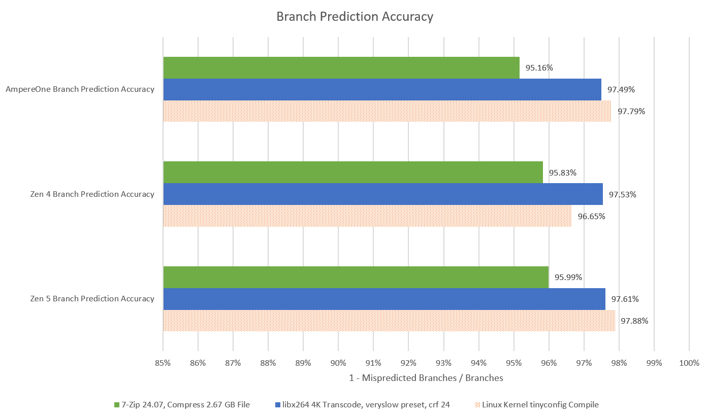

*图 4：AmpereOne 三项为 95.16%/97.49%/97.79%；Zen 4 为 95.83%/97.53%/96.65%；Zen 5 为 95.99%/97.61%/97.88%。不同平台执行的总指令与分支数不同，正确率只描述分支集合中的比例。*

按每千条指令错误预测数（MPKI）归一后，AmpereOne 在 7-Zip/libx264/Kernel Compile 为 8.93/1.51/4.80；Zen 4 为 9.29/1.67/7.26，Zen 5 为 8.93/1.62/4.61。它大体处在最新 AMD 核心的水平。

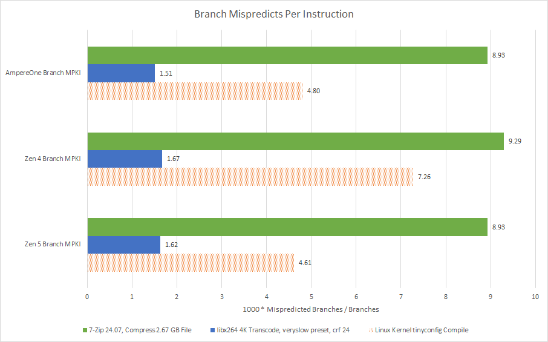

*图 5：MPKI 同时考虑了不同 ISA 的执行指令数，较单纯正确率更接近前端压力；仍需乘以恢复周期和错误路径工作量，才能估计性能损失。*

目标预测分两级。Ampere Slide 给出 256 项、零 Bubble 的 L1 BTB 与 8K 项、两周期的 L2 BTB。无条件 Taken Branch Chain 在溢出 L1 后每三周期完成一次 Branch，即相邻目标间观察到约两周期额外延迟，与公开资料吻合。

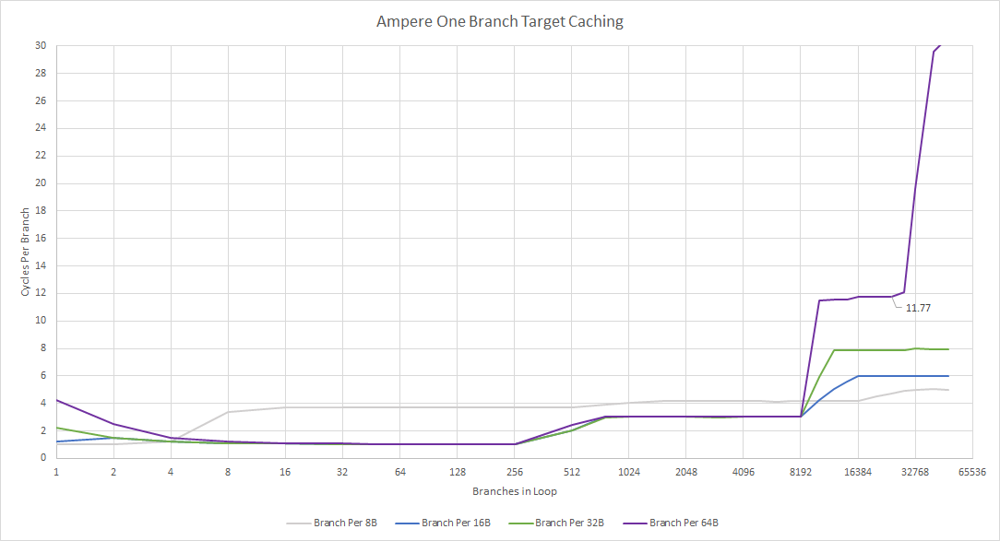

*图 6：小足迹由 256 项快层覆盖，之后进入 8K 项主层；再溢出时曲线接近 Cache 延迟。若 L2 BTB Miss 后重新取指，L2 代码路径约 11～12 周期，与数据侧 L2 相近。*

错误预测恢复只有 10 周期。Ampere 为此把 L1I 控制在 16 KB：核心没有 Micro-op Cache，L1I 延迟直接进入错误预测后的重新供给路径，更小、更快的阵列有助于压低恢复时间。Zen 4 为 11～18 周期，官方常见值 13，最快 11 周期很可能对应 Micro-op Cache Hit。两者频率目标不同，但 AmpereOne 的周期数很低。

预测器通过 32 项 Fetch Queue 与取指解耦，可以提前运行并驱动 Instruction Prefetch。16 KB 四路 L1I 每周期最多向 Decode 提供八条指令，但容量很小，因此 Ampere 建立了从 2 MB L2 到前端的低延迟、高带宽路径。

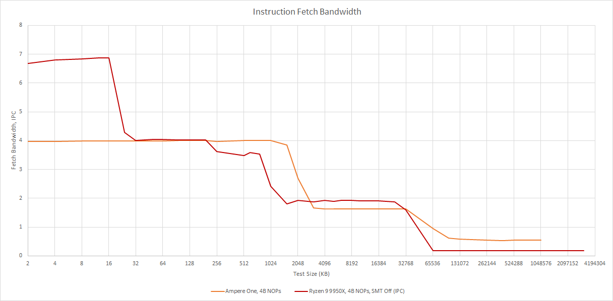

*图 7：测试在数组中填入 NOP、末尾 Return，再跳转执行。越过 16 KB L1I 后吞吐下降，但 L2 仍足以喂满 Decoder；更大足迹落入系统级 Cache 或 DRAM 后继续下降。NOP 融合会抬高架构指令/cycle，不能直接当作 Decode 宽度。*

这种策略使 16 KB L1I 在某些程序中更像一张“原始指令热缓存”：绝大部分时间命中它，类似 Zen 4/5 大部分时间命中 Micro-op Cache；Footprint 变大时，再由高性能 L2 路径兜底。

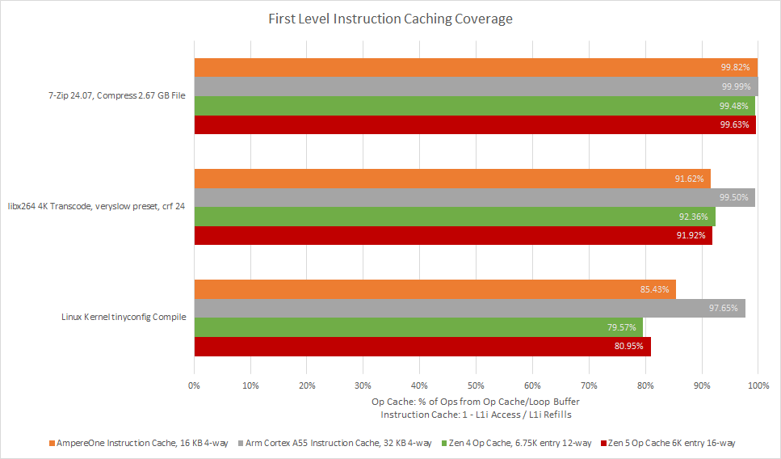

*图 8：AmpereOne 越过 L1I 后仍保持较高 Instruction/cycle。Cortex-A55 并非同一性能等级，但同为 AArch64 且使用传统 32 KB L1I，可作为供给形态参照。网页正式图注明确提示这种可比性限制。*

Decode 每周期最多生成四条 Micro-op，却可以扫描五条架构指令，以利用相邻指令融合。融合让两条指令占一个后端位置，减少 ROB、Scheduler 和 Register 资源消耗。Ampere 认为自家融合是业内最激进之一，用它从四宽机器中挖出更高吞吐。

7-Zip 是典型案例。Flag-setting Instruction 加相邻 Conditional Branch 可融合；AmpereOne 与 Zen 4 的 Retired Micro-op / Instruction 都小于 1，分别约 91.89% 和 94.09%，即出现“负 Micro-op Expansion”。

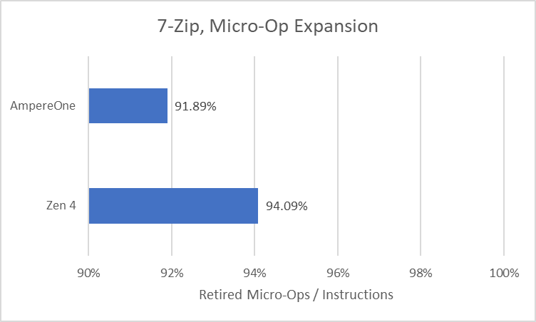

*图 9：AmpereOne 每条架构指令平均退休的 Micro-op 更少。该结果说明特定代码序列融合有效，不代表所有指令都能五进四出。*

Ampere 称前端尺寸来自超过 1000 条 Instruction Trace 的评估，目标是尽量缩短从预测到执行的延迟。

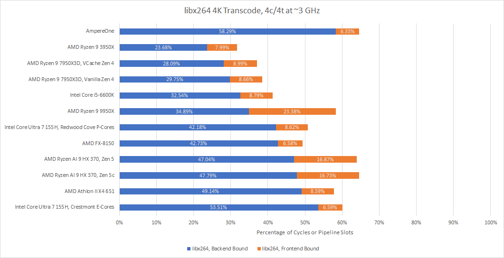

*图 10：AmpereOne 在 Kernel Compile、7-Zip 与 libx264 中均以 Backend Bound 为主，Frontend Bound 相对较低。指标来自 Oracle 3 GHz 实例和既有对照数据，不是统一平台复测。*

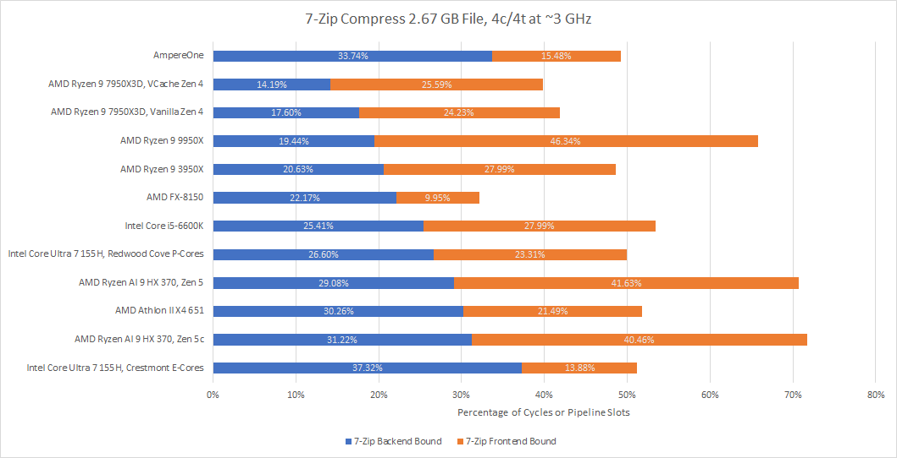

*图 11：在 7-Zip 压缩中，AmpereOne 并未比其他核心更受前端限制。大核心的后端更强，因此 Frontend/Backend Bound 的相对占比也会不同。*

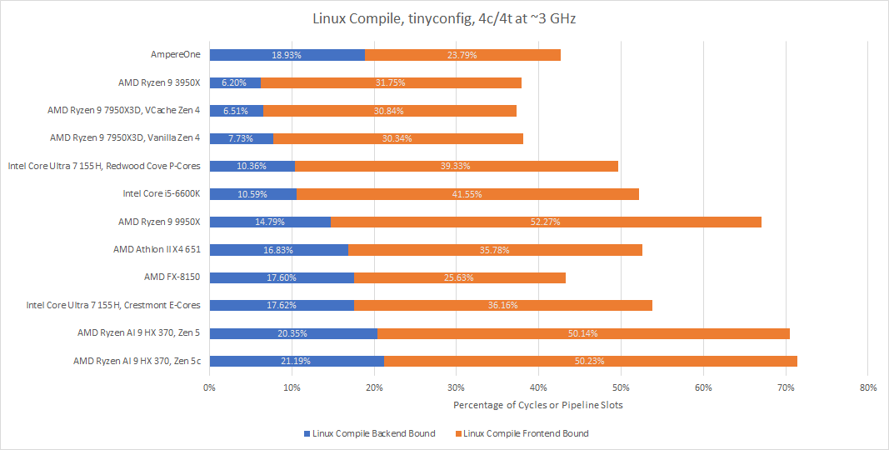

*图 12：同样以密度为目标的 Crestmont 更偏 Backend Bound，却采用 64 KB L1I 和六宽 Decoder。不同前端策略都能成立，关键是是否与后端能力匹配。*

### 体系结构视角：小 L1I 是一场有条件的赌博

16 KB L1I 可降低访问能耗与重定向关键路径，但会提高 Miss 频率。Ampere 用 32 项 Fetch Queue、强 L2 取指和融合弥补容量；只要热点代码高度集中、L2 供给足够，前端就不会成为主瓶颈。

风险在于大代码、间接跳转和多租户 I-cache 干扰。验证时应把 L1I Miss、L2 Code Fetch、BTB Miss、Fetch Queue Empty 与 Rename 饥饿周期关联起来：如果 L1I Miss 增多但 Decoder 仍持续满载，L2 兜底成功；若 Fetch Queue 频繁见底，小 L1I 才真正限制 IPC。

## 后端：八个 Scheduler、十二条 Pipe

AmpereOne 的八个 Scheduler 合计 192 项，连接十二条执行 Pipe。四个整数 Queue 可以每周期处理两条 Branch 和两条复杂 Shift，其中两组还能把 Multiply/Divide 等多周期操作送往共享单元。

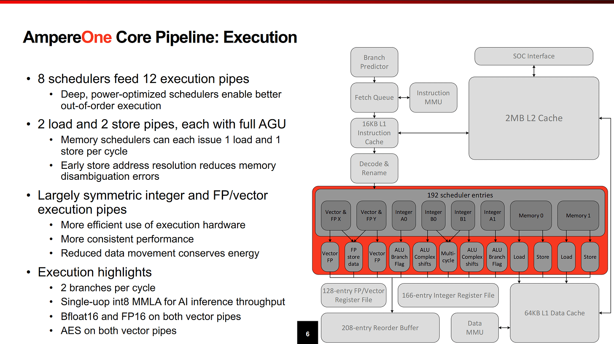

*图 13：四个整数、两个 FP/Vector、两个 Memory Scheduler；两条 Branch、两条 Complex Shift、一条共享 Multi-cycle、两条 Vector/FP、共享 FP Store Data，以及两 Load、两 Store Pipe。Ampere 还强调单 Micro-op Int8 MMLA、两条向量 Pipe 均支持 BF16/FP16/AES。*

按 Henry Wong 的依赖链方法，四个整数 Scheduler 各约 20 项。FP/Vector 侧两组各约 24 项；基础 FP Add 可使用两组及其端口，BF16、FP16 与 AES 两端口都支持，较少见的 `ADDV`、`FJCVTZS` 只在单端口实现，两边共享 FP Store Data Unit。

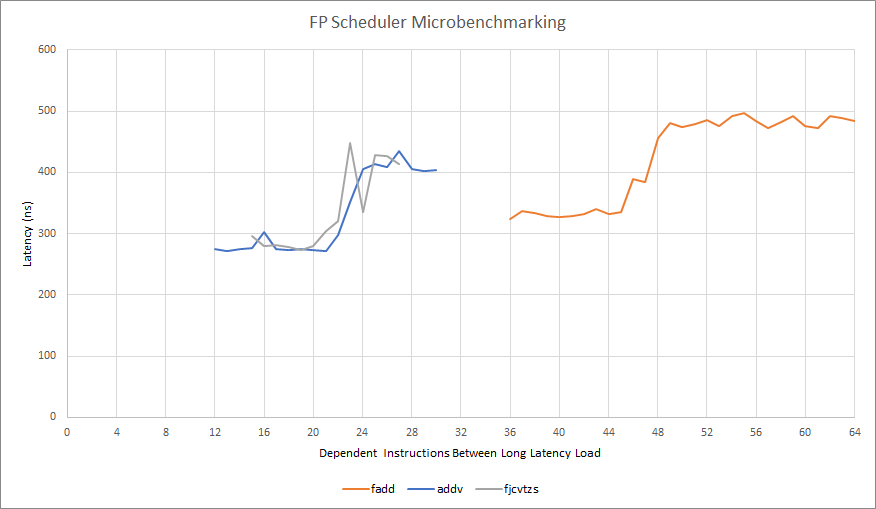

*图 14：两组曲线在增加依赖操作数后分别出现台阶，支持每组约 24 项的判断。网页正式图注也提醒数据有噪声；容量是可见调度深度，不是 RTL 阵列复核。*

两组 Memory Scheduler 各约 32 项，每组每周期可选一条 Load 和一条 Store，并支持全部寻址模式。四个 20、两个 24、两个 32 相加恰好是 192，但这只能说明微基准估计与 Slide 总数一致。

分布式 Scheduler 的难点是负载不均：一个 Queue 满，Rename 就可能停，即使其他 Queue 尚空。7-Zip 中 `IDR_STALL_IXU_SCHED` 很高，但该事件也可能由整数物理寄存器不足触发，无法单凭它区分两种原因。

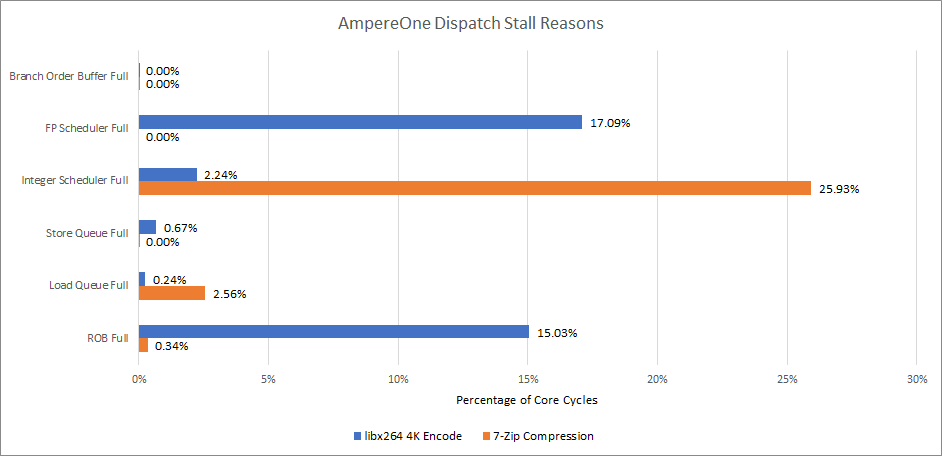

*图 15：7-Zip 的 IXU Scheduler/Register Stall 明显高于 libx264，FP Scheduler Stall 则体现不同工作负载分布。公开事件把多个资源原因合并，柱高不能直接等价成某张 Queue 已满。*

进一步看端口利用率，性能监控文档称为 IXA 的一组整数 Issue Queue 负载远高于其余组；整个 7-Zip 运行中平均达到约 74%，端口吞吐本身也可能成为瓶颈。libx264 的 Micro-op 分布更均衡，说明 7-Zip 也许是异常不均衡案例。

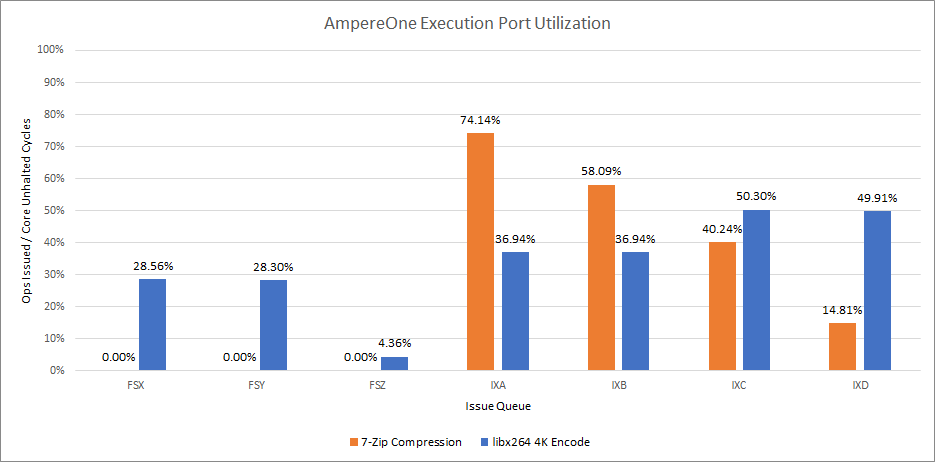

*图 16：橙色 7-Zip 在若干整数端口显著偏高，蓝色 libx264 在 FP/Vector 与访存侧更分散。平均利用率高不等于每周期都饱和，但 74% 已足以把单端口吞吐列为候选瓶颈。*

两组 24 项 FP Scheduler 放在当代大核中并不算“特别深”：V2 是两组 28，Zen 4 是两组 32，且二者都有 Non-Scheduling Queue（NSQ）额外容纳未完成操作。不过在低面积、弱向量的 AmpereOne 中，2×24 也许已经是很深的配置；FP Queue 满导致 Dispatch Stall，是密度目标下可以预期的取舍。

### 体系结构视角：总条目数无法消除端口碎片

192 项听起来很大，但操作只进入能执行自己的 Queue。某组复杂整数或单端口向量操作拥塞时，其他空位不能借用；分布式 Scheduler 用较小 Wakeup 网络换能效，也把编译调度和端口映射变得更重要。

应使用端口专属与多端口操作分别填充窗口，再同时观察 Issue Queue Occupancy、Ready-but-not-issued、物理寄存器 Full 与 Dispatch Stall。只有 Queue 高占用、对应 Pipe 也接近饱和，才能把瓶颈归到吞吐；Queue 高而 Pipe 低则更像依赖或可达性问题。

## Load/Store：Write-through L1D 与更强的 Forwarding

AmpereOne 使用 64 KB、四路 L1D，Load-to-use 延迟四周期。它采用 Write-through：Store 经过 Write-combining Buffer 合并后继续送往 L2，而不是先在 L1D 留下脏行。

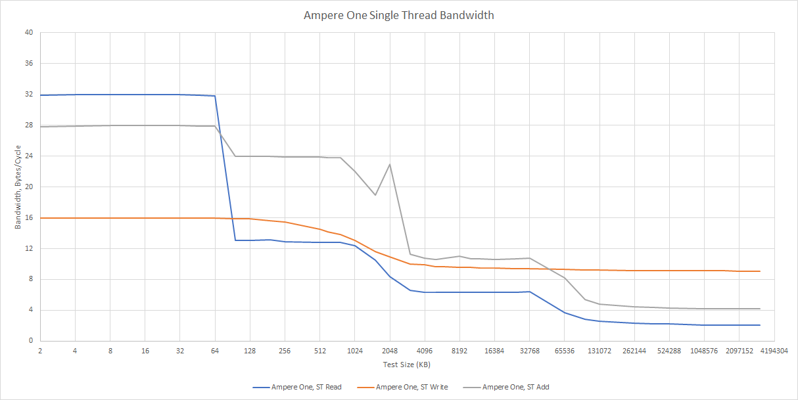

*图 17：小足迹 Read 约 32 B/cycle、Write 16 B/cycle、Add 约 28 B/cycle；进入 L2 后 Read 约 13、Write 从 16 缓降、Add 约 24。Write-through 不必然意味着写吞吐低，关键是 L1 合并与 L2 接收能力。*

Bulldozer 和 Pentium 4 的 Write-through L1D 曾因 L2 写带宽不足受到批评；AmpereOne 实测可持续 16 B/cycle 写入，避免了同样问题。

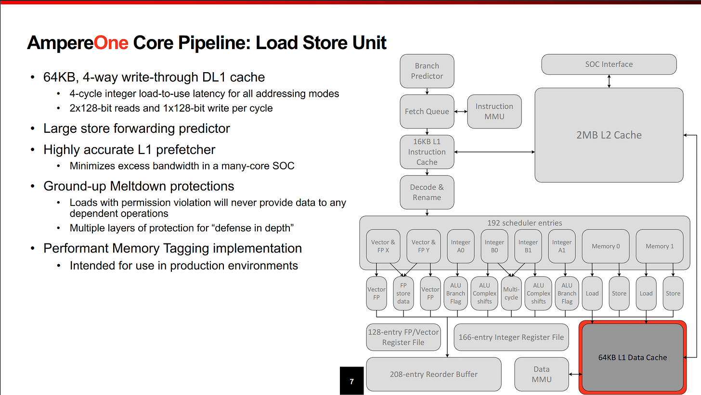

*图 18：64 KB 四路 L1D、四周期 Load-to-use、Write-combining Buffer、两 Load/两 Store Pipe，每组 Memory Scheduler 可同周期选一 Load 与一 Store。Slide 还强调较早解析 Store Address，以减少 Memory Disambiguation 错误。*

依赖处理比同期 Arm 核心更灵活。只要年轻 Load 完全包含于更老 Store，就可在 6～7 周期快路转发；Neoverse V2 等核心通常要求 Load 在 Store 内按自身宽度对齐。代价是 6～7 周期对低频核心不算短。

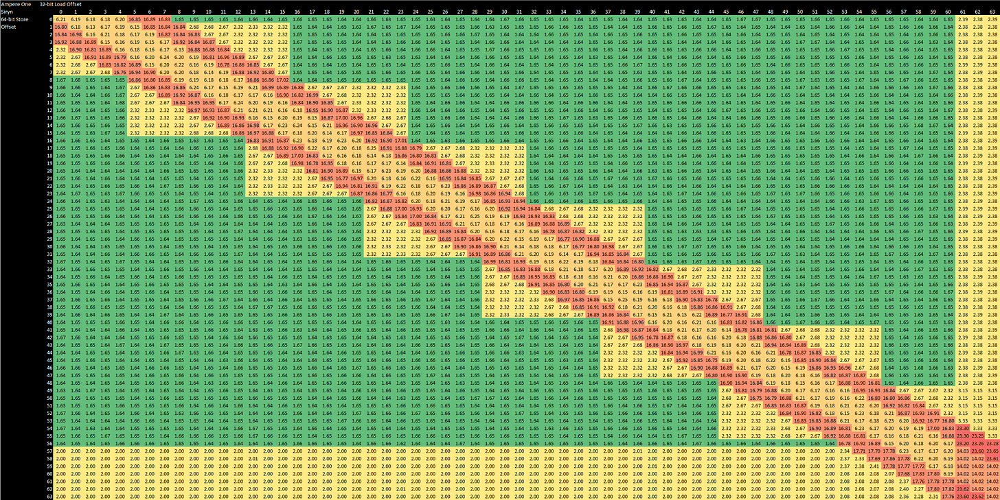

*图 19：以 Store/Load Offset 扫描组合。绿色区域表示 Load 被旧 Store 完全覆盖时可快转发；部分重叠、对齐失败或假依赖进入黄/红慢路。Fast Forward 为 6～7 周期，失败约 17 周期。*

未对齐 Load 的惩罚比现代双 Load/双 Store 设计更大，由此推测 L1D 可能只有两个本地数据端口。触及同一个 16 B Block、但只按 8 B 对齐的访问还会出现 False Dependency，不过 LSU 恢复较快。

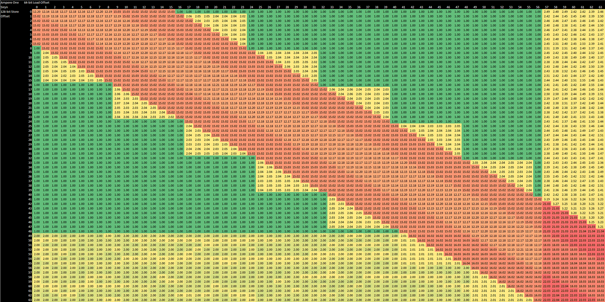

*图 20：向量转发延迟高达 12 周期，失败惩罚反而较好。未对齐模式与 64/32-bit 测试相近，支持 L1D 数据通路原生 128-bit 的推测；仍不是 RTL 位宽确认。*

LSU 从头设计时还把安全纳入约束：权限失败的 Load 不会把数据提供给依赖操作，从源头避免类似 Meltdown 的瞬态数据泄漏。Memory Tagging 也在每次访问中参与检查。

### 体系结构视角：Write-through 用系统流量换一致性简单与行为稳定

Write-through 让 L2 很早看到 Store，减少 L1 脏状态和某些一致性复杂度，也更适合 Ampere 追求的可预测性；代价是每次写都给 L2 和 Mesh 更大压力。Write-combining、每周期 16 B 写带宽和每核大 L2 是这套选择成立的前提。

验证不能只测顺序写峰值。还要改变 Store 宽度、地址局部性、写合并机会、Read-modify-write 与多核并发，并观察 Write Buffer Full、L2 Write、Mesh Backpressure 和尾延迟。若随机小写很快堵住合并缓冲，顺序 16 B/cycle 并不能代表真实服务负载。

## TLB 与 Page Walk：所有条目都支持任意页大小

Ampere 强调“Universal TLB Entry”：任意 TLB 的任意 Entry 都可以缓存任意 Page Size。一级 iTLB 为 64 项、四路，一级 DTLB 为 64 项全相联；二级 iTLB 为 768 项、六路，二级 DTLB 为 1536 项、六路。

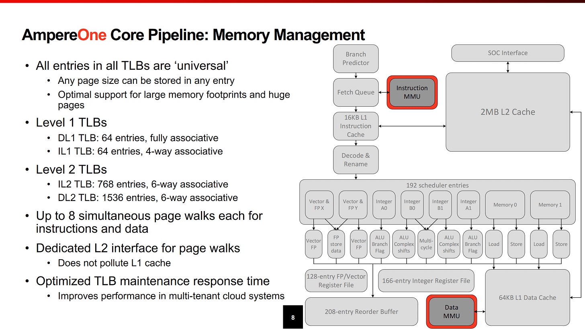

*图 21：每个 Instruction/Data Page Walker 最多八个并行 Walk，并通过专用 L2 接口取页表，避免污染 L1。Ampere 还优化了高核心数下的 TLB Maintenance 广播响应，但没有公开具体协议与队列。*

有些核心为大页另设容量较小的 TLB，Ampere 的通用 Entry 在大内存与 Huge Page 工作负载下更灵活。不过 V2、Zen 4 已能在所有主要 TLB 层支持 2 MB 页，差异主要会在更大 Page Size 和专业应用中显现。

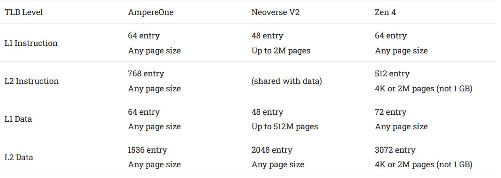

*图 22：表格比较各级容量、相联度与支持页大小。AmpereOne 的辨识点不是所有层都容量最大，而是每一项都可装任意页大小。网页原资源实际为 JPEG，已按真实编码保存为 `.jpg`。*

### 体系结构视角：TLB Reach 只是第一层，Walk 并发与维护才决定云端尾延迟

大页可用同样 Entry 覆盖更多地址空间，但真实云环境还会遇到 Page Table Miss、虚拟化多级翻译和 TLB Shootdown。八个 Instruction、八个 Data Walk 以及专用 L2 接口，解决的是多个 Miss 同时发生时的吞吐和 Cache 污染。

验证需要按 Page Size 测 L1/L2 TLB Hit、Walk 数与周期，再增加线程迁移和 Mapping Change 触发维护。高核心数下，如果广播或确认链路阻塞，平均 TLB Hit 很好也可能出现很长的 P99 Pause。

## 2 MB 私有 L2：扩展性与稳定性能的支点

AmpereOne 的 2 MB、八路 L2 同时服务指令和数据，Load-to-use 为 11 周期。它每周期可调度一次 Read 和一次 Write，每周期可向 L1 送一条完整 64 B Cache Line，并可跟踪 48 个发往 Mesh 的 Outstanding Request。

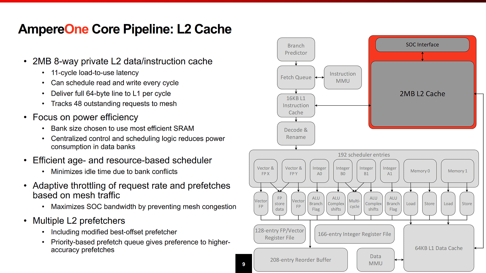

*图 23：L2 选用高能效 SRAM，控制与调度集中而非每个 Data Bank 重复；Age/Resource-based Scheduler 减少 Bank Conflict 空闲。多组 Prefetcher 包括改进的 Best-offset，Prefetch Queue 优先保留更准确请求，并按 Mesh 反馈节流。*

Read-modify-write 测试在 L2 可持续约 24 B/cycle，高于纯写的 16，但没有达到理论 32。Slide 声称 L2→L1 能送 64 B/cycle，持续 Load 仍受 LSU 的 32 B/cycle 上限约束。结构接口峰值、访问模式和核心接收端上限不能混为一谈。

11-cycle 宣称与 Pointer Chasing 一致：3 GHz 下测得 3.68 ns，约为 11 周期。大 L2 尤其重要，因为它隔离了很慢的 System Level Cache。Oracle 实例的后级 Cache 延迟看起来接近 Nvidia Grace，而后者只有 1 MB L2，曾因 Load Stall 无法充分利用比 Graviton 4 更高的频率。

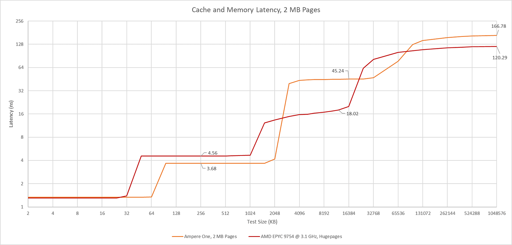

*图 24：2 MB 页下，AmpereOne 在 2 MB 附近保持约 3.68 ns/11 周期，越过私有 L2 后延迟陡升；DRAM 约 166 ns，明显高于其他 DDR5 服务器。大型 Mesh Traversal 很可能贡献一部分，但现有曲线不能分解 SLC、NoC、控制器和 DRAM。*

### 体系结构视角：Prefetch 也需要服从全芯片拥塞控制

单核看，Prefetch 越积极越可能隐藏 11 周期以后的延迟；192 核同时这么做，则会用低价值请求淹没 Mesh。Ampere 把准确率排序和系统反馈节流放在 L2，使每核 Prefetcher 不只优化自己，还要响应全芯片资源状态。

应在不同核心数下同时看 Useful/Useless Prefetch、L2 Miss、48 项 Outstanding 占用、Mesh Queue 与加载延迟。若节流后总带宽略降但关键线程 P99 改善，这恰好符合 Cloud Consistency 目标，而不是单线程性能退步。

## Chiplet、192 核 Mesh 与 I/O

AmpereOne 是 Ampere 第一款 Chiplet 设计。中央 Compute Chiplet（CCL）使用 TSMC 5 nm，Memory Controller 与 PCIe I/O Die 使用 TSMC 7 nm，由自研 Die-to-die Link 相连，单方向最高 2.8 TB/s。相同 Building Block 可以组成八通道 AmpereOne 与十二通道 AmpereOne M，也方便集成客户 IP。

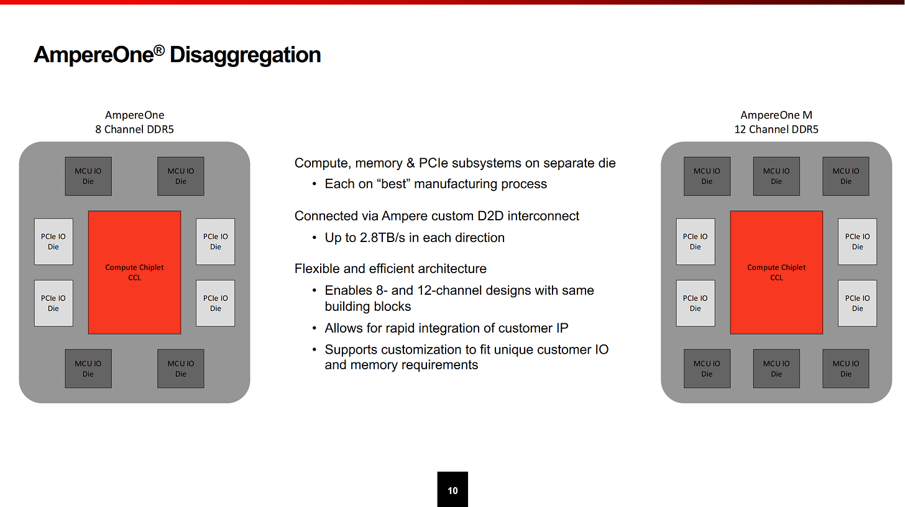

*图 25：计算、内存和 PCIe 分置不同 Die。八通道配置围绕 CCL 放四颗 MCU I/O 与四颗 PCIe I/O；十二通道版本增加 MCU I/O。Slide 强调按子系统选择合适工艺，而非把所有模块都放在最先进节点。*

CCL 内有 192 颗自研 CPU 核，以四核 Cluster 为单位，排成六列、每列八组。完全连接的 8×9 Mesh 横截面带宽最高 5.7 TB/s。64 个分布式 Coherency Engine 各带 1 MB System Level Cache，共 64 MB，并包含 Snoop Filter；过滤器容量足以追踪全芯片 384 MB 私有 L2。

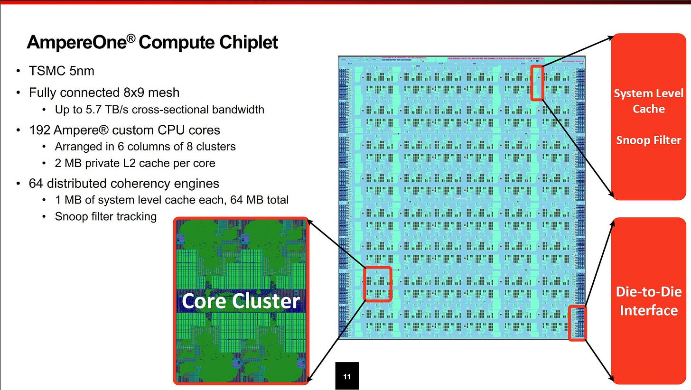

*图 26：TSMC 5 nm CCL、192 核、48 个四核 Cluster、64 个一致性引擎和 64 MB SLC。Cluster GDS 中可见四组大 L2；Die 边缘还放置 System-level Cache/Snoop Filter 与 D2D 接口。*

Mesh 并非完全从零自研。官方文档表明它基于 Arm Coherent Mesh Network（CMN），Ampere 为 Memory Tagging 和自定义跨 Die 链路做了修改。六乘八的 Core Cluster 位于 8×9 Mesh 下部中央；部分 Cluster 与 SLC Slice 共置，另一些与 I/O Coherent Request Node 共置。

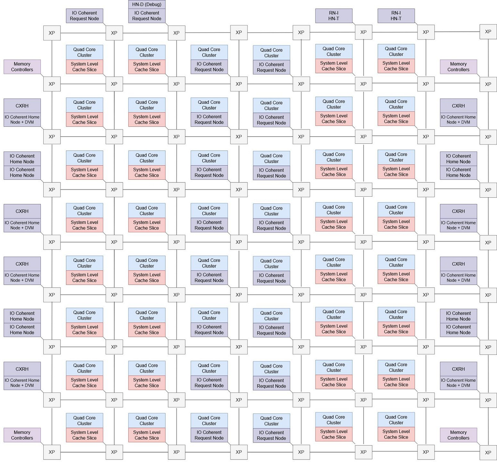

*图 27：XP Crosspoint、Quad Core Cluster、SLC Slice、I/O Request/Home Node、Memory Controller 与边缘 CXRH 的位置。网页正式图注说这张图耗时很久。角落邻近 Memory Controller；CXRH 功能没有披露，推测可能连接 PCIe I/O Die，但 Ampere 未确认。*

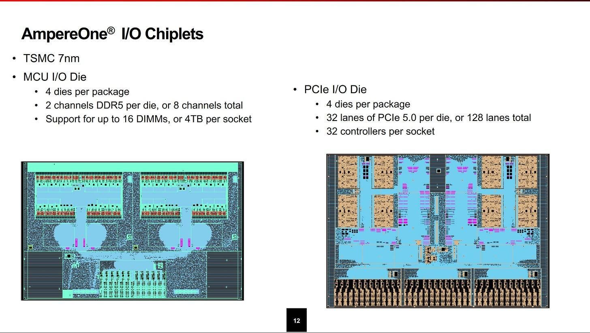

*图 28：TSMC 7 nm。每包四颗 MCU I/O Die，每颗两通道 DDR5，合计八通道，最高 16 DIMM/4 TB per Socket；四颗 PCIe I/O Die 每颗 32 Lane PCIe 5.0，合计 128 Lane，并称每 Socket 32 个 Controller。*

### 体系结构视角：192 核首先是一项互连与目录工程

把核心复制 192 次并不难，难的是让 384 MB 私有 L2、64 MB SLC、Snoop Filter、内存和 I/O 在可接受功耗下保持一致。目录必须覆盖所有私有 Cache Line，Mesh 要处理位置不均、热点 Home Node 和跨 Die 信用反压。

验证应把核心到 SLC/内存的物理距离、Cache-to-Cache Latency、Snoop Filter Hit、D2D Link 利用率和 Memory Controller 分布一起测。单核 DRAM 166 ns 只能说明端到端路径偏长，不能把全部延迟归到某一个 Mesh Hop。

## Memory Tagging 与 Adaptive Traffic Management

Ampere 宣称把首个面向数据中心市场的 Memory Tagging 实现带入产品。每 16 B Memory Granule 有 4-bit Allocation Tag，Pointer 地址高位携带 Access Tag；每次 Load/Store 比较二者，不匹配就 Fault 并阻止数据访问。

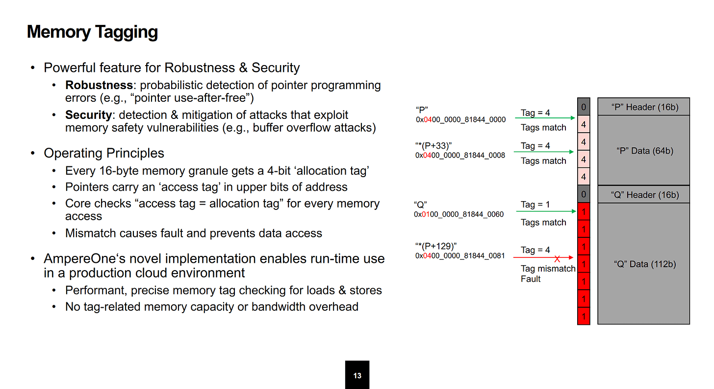

*图 29：指向 P Allocation 的 Tag 4 Pointer 可访问对应 Granule；同一 Pointer 越界进入 Tag 1 的 Q Allocation 时触发 Fault。Ampere 称检查精确、可在线上云环境运行，并且没有 Tag 带来的内存容量或带宽开销；这些是厂商披露，网页未独立量测其代价。*

这类机制能概率性发现 Use-after-free、Buffer Overflow 等 Pointer Bug，也能提高安全攻击利用难度。它与普通页权限互补：页表判断页面是否合法，Memory Tag 进一步判断 Pointer 是否属于当前 Allocation。

系统层面的 Adaptive Traffic Management（ATM）则面向一致性能。SLC/Snoop Filter 和 Memory Controller 等下游 Agent 向核心报告 Busy 程度；核心据此调整请求速率与 Traffic Profile。Latency-sensitive 与 Bandwidth-hungry 工作负载会得到不同响应。

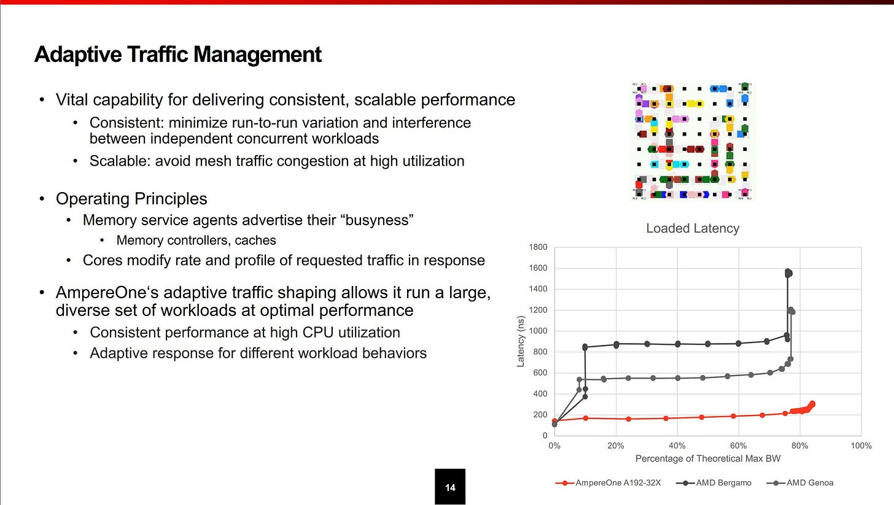

*图 30：厂商 Loaded Latency 曲线中，AmpereOne A192-32X 在接近理论带宽 80% 前保持约 150～220 ns，Genoa/Bergamo 更早升到数百甚至上千 ns。测试把一个延迟敏感应用与逐渐增加的带宽负载并置；配置、负载与统计细节需结合原演讲，不能视为通用平台定律。*

### 体系结构视角：云端追求的是受干扰时的可预测性能

SMT、动态 Boost 和无限制 Prefetch 都可能提高空闲时峰值，却让邻居负载改变延迟。ATM 相当于把 Congestion Control 放进请求源：下游拥塞之前便整形流量，牺牲某些峰值换更平滑的 P99。

评估时不能只看空载带宽。应让 Latency-sensitive Tenant 与不同数量的带宽流共存，报告平均值、P95/P99、Run-to-run Variation、每核带宽和总功耗。只有同条件下的完整曲线，才能确认一致性收益。

## 厂商机架数据与有限的每核实测

Ampere 宣称在 `SPECrate 2017 int_base`、GCC 13 下，AmpereOne 估算 SIR Score 694、用电 274 W，Perf/W 2.53；Genoa 为 638/379/1.68，Bergamo 为 733/333/2.20。其机架示意给出相对 Genoa 1.34×、Bergamo 1.22× Performance/Rack。

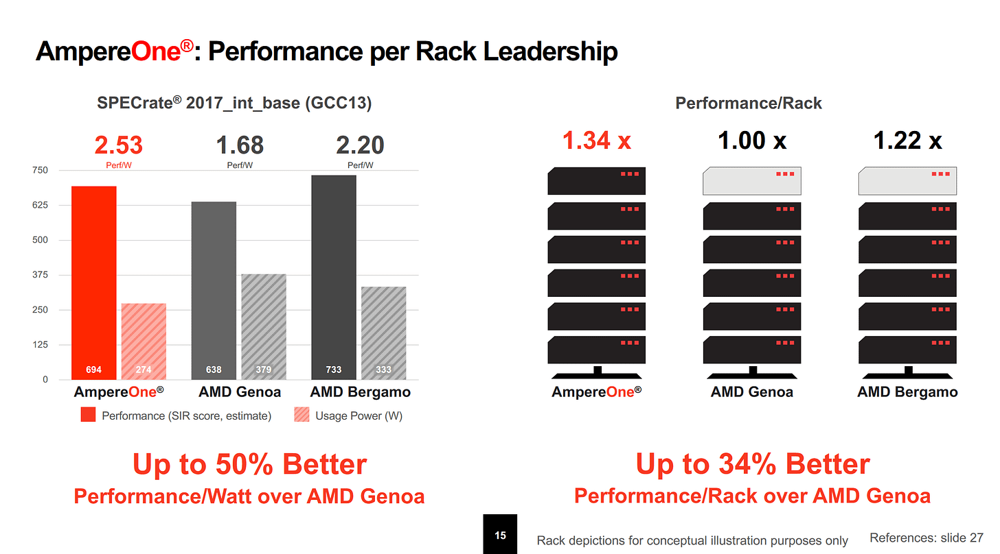

*图 31：厂商称相对 Genoa 每瓦最高好 50%、每机架最高好 34%。SIR Score 是估算值，机架图明确写着仅作概念示意。Oracle 配额只有 16 核，网页无法获得整颗芯片，更没有条件复测物理机架，因此这些结果应保持为 Ampere 的公开主张。*

离开演讲数据，Oracle 上的有限测试显示 AmpereOne 每核表现尚可。7-Zip 24.07 压缩 2.67 GB 文件，四核四线程、约 3 GHz 时为 28.30 MB/s，接近 3 GHz Skylake i5-6600K 的 27.88；Skylake 按默认更高频率运行时很可能领先。7-Zip 分支困难，大核心也未必能完全发挥更深窗口。

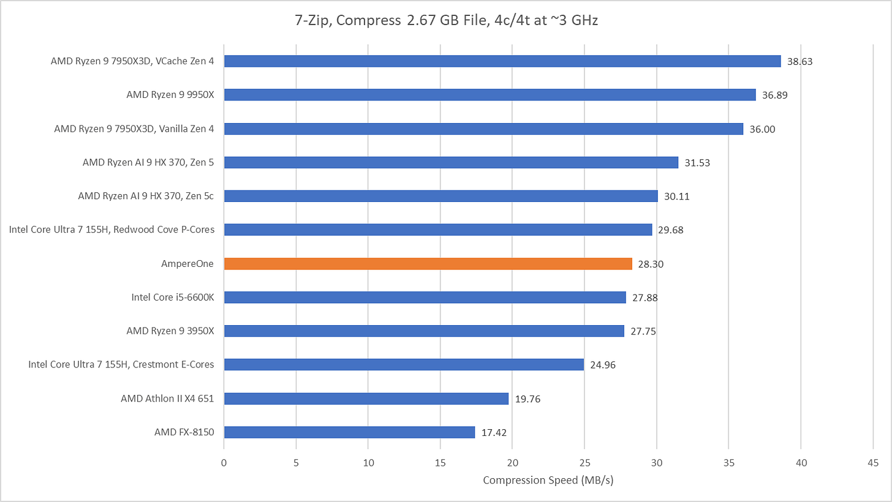

*图 32：AmpereOne 为 28.30 MB/s；Crestmont 24.96，Skylake 27.88，Redwood Cove 29.68，Zen 5/Zen 4 多数为 30～39。图中消费级核心、云实例与 Cache 配置不一，只用于 Clock-for-clock 的粗略位置。*

libx264 4K Transcode 对 AmpereOne 困难得多。较弱的 FP/Vector 侧使其只有 1.30 FPS，低于 Crestmont 1.46、Skylake 1.70，更远低于 Zen 4/5 的约 2.15～2.60。高性能对照恢复默认频率后，差距还会扩大。

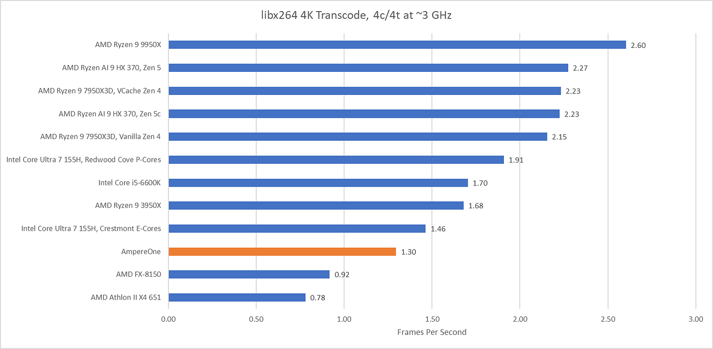

*图 33：所有平台限制到约 3 GHz 后，AmpereOne 仍落后于密度优化 Crestmont，说明瓶颈不只在频率；向量宽度、Scheduler 容量、执行 Pipe 和 Cache/Memory 共同参与。*

## 最后的评价：停止追逐大核峰值，本身就是产品特性

按单核比较，AmpereOne 没有试图追平 AMD、Intel，甚至 Arm 自家的高性能核心。它要在同一物理空间容纳更多客户，并把稳定性能置于峰值之上。大私有 L2、无 SMT、固定频率和流量整形都与此一致。

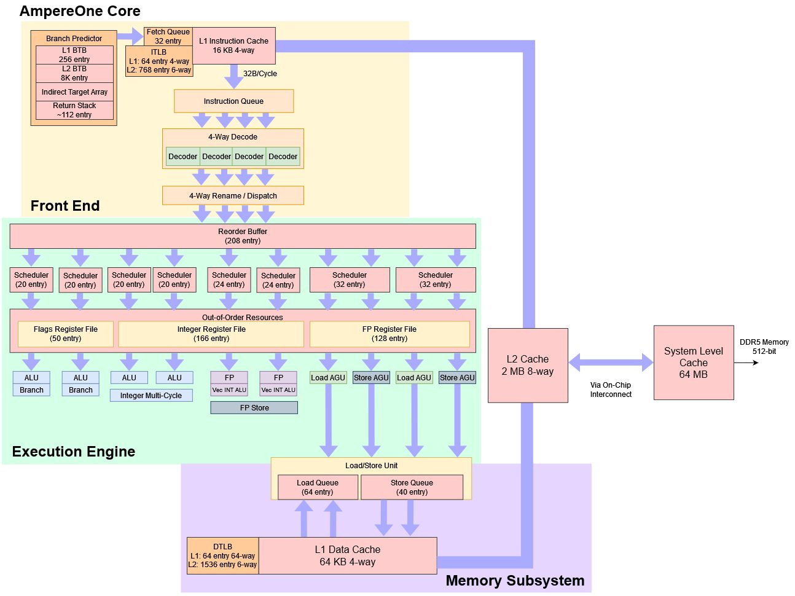

*图 34：四宽 Rename/Dispatch、208 项 ROB、四个约 20 项整数、两个约 24 项 FP、两个约 32 项 Memory Scheduler，166/128/50 项整数/FP/Flags Register，64 项 LQ、40 项 SQ、64 KB L1D、2 MB L2、64 MB SLC。约 112 项 RAS 等未在演讲披露的结构来自微基准估计。网页正式图注也明确这一点。*

最有辨识度的是非常规 Cache 组合：16 KB L1I 和 Write-through L1D 看起来都只做到“足以不让 L2 成为日常瓶颈”，真正的容量与流量缓冲交给 2 MB L2。现有几项工作负载表明整体仍算均衡，但样本很少；Oracle 又不支持 Ubuntu、Debian 等熟悉发行版，进一步限制了测试。

第一印象仍然积极。Ampere 为密度做了清晰取舍，没有达到 Zen 5 或 Redwood Cove 的单核性能并非失败，而是目标的一部分。对一家首次自研 CPU 核心的公司来说，这是一套相当成熟的起点。

### 体系结构视角：从 AmpereOne 可以看到的几件事

第一，稳定性能可以成为第一等微架构目标。固定频率、无 SMT、ATM 和大私有 L2 共同减少运行间波动；它们牺牲的是短时峰值和单核利用率，换来云端更容易兑现的服务等级。

第二，四宽核心仍可通过融合获得很高的资源效率。扫描五条指令、生成四条 Micro-op，再以 208 项 ROB 跟踪，可以减少宽 Decode、Rename 和寄存器文件的面积；代价是收益高度依赖编译代码能否形成可融合 Pair。

第三，分布式 Scheduler 既是节能工具，也是端口碎片来源。总计 192 项并不保证所有程序都能使用全部容量；7-Zip 的 IXA 高负载正说明映射均衡与物理条目数同样重要。

第四，Write-through L1D 不是天然落后。只要 Write Combining、L2 写入和 Mesh 节流足够强，它能简化状态并保持 16 B/cycle；是否成功要由随机小写、多核干扰与尾延迟决定。

第五，2 MB L2 同时解决三个问题：小 L1I 的代码供给、Write-through L1D 的写流量，以及高延迟 SLC/Mesh 的隔离。它不是孤立的大 Cache，而是整颗核心取舍的中心。

第六，192 核产品的胜负更多落在系统级。64 个目录/SLC Slice、8×9 Mesh、D2D、内存通道、Tag 与 Traffic Management 决定规模能否转化成可用吞吐；单核 Benchmark 只覆盖其中很小一部分。

第七，厂商的 Rack/Perf-Watt 数据与 Oracle 的 16 核微基准回答不同问题。前者需要同条件整机复测，后者只能评价被测 SKU 的局部行为；将两者并列而不互相替代，才是理解 AmpereOne 的正确方式。

## 参考资料

- Chips and Cheese：[*AmpereOne at Hot Chips 2024: Maximizing Density*](https://chipsandcheese.com/p/ampereone-at-hot-chips-2024-maximizing-density)
- Henry Wong：[*Store-to-Load Forwarding and Memory Disambiguation in x86 Processors*](https://blog.stuffedcow.net/2014/01/x86-memory-disambiguation/)
