# Arm Cortex-A53：微小，却举足轻重

> **文章来源**
>
> - 文章：*ARM’s Cortex A53: Tiny But Important*
> - 撰文：Chester Lam
> - 首发：Chips and Cheese
> - 发布：2023 年 5 月 28 日
> - 链接：https://chipsandcheese.com/p/arms-cortex-a53-tiny-but-important

提到 Arm，很多人首先想到的是兼顾性能与能效的 Cortex-A7xx 和 Cortex-X 大核。但 Arm 的产品线也覆盖更低的功耗、面积与性能区间，而这些不抢镜的小核心往往出货更多，也更深入日常设备。Cortex-A53 就是最典型的例子：它不追求把单线程性能推到极限，而是以尽可能低的代价处理那些并不敏感于 CPU 性能的任务。

2014 到 2017 年间，A53 很可能是手机市场出货最多的 Arm 核心之一。它作为“LITTLE”核陪伴了两代大核，数量常与大核相同甚至更多。Snapdragon 835 采用四颗 Cortex-A73 加四颗 A53；定位更低的 Snapdragon 626 则把八颗 A53 运行在 2.2 GHz。即使 Cortex-A55 已经接班，A53 仍出现在 Google Pixel Visual Core、Socionext 的 24 核无风扇边缘服务器芯片、Roku 机顶盒等产品中。

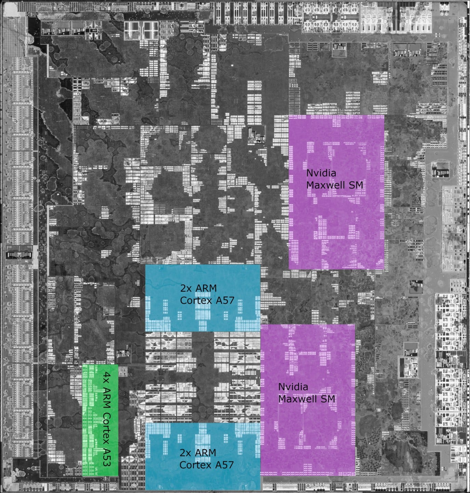

*图 1：Tegra X1 把四颗 A53 与四颗 Cortex-A57 大核放在同一芯片上，是 A53 早期 big.LITTLE 用法的代表。裸片照片来自 Fritzchens Fritz，标注由 Clam 完成。*

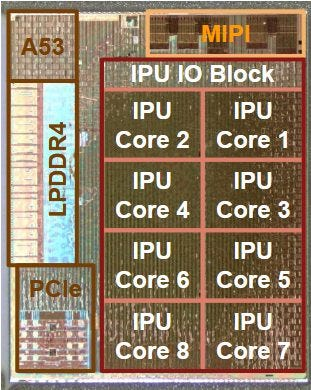

*图 2：Google 2018 年的 Pixel Visual Core 用一颗 A53 管理图像处理单元阵列；图来自 Google Hot Chips 演讲。此时手机 SoC 已逐步改用 A55，A53 却仍适合作为低功耗控制核。*

测试平台是 Odroid N2+ 单板机，SoC 为 Amlogic S922X：两颗 A53、四颗 A73 和一颗 Mali-G52 iGPU。S922X 也用于部分机顶盒。Arm 向芯片厂商授权 CPU IP，再由后者选择 Cache 容量、互连、内存与实现参数，因此后文有些结果属于 S922X 的具体实现，不能直接外推到所有 A53。

网页没有披露操作系统与内核版本、编译器和参数、频率固定方式、预热、重复次数、误差，以及大多数微基准的源码版本。应用测试给出了程序和输入，但并非统一行业 Benchmark。以下数字适合用来理解结构瓶颈，不适合作为跨产品的综合性能排名。

## 两发射、顺序执行：现代工艺下的另一条路线

Cortex-A53 是双发射（dual-issue）、顺序执行（in-order）核心。它在组织方式上有点像 Intel 初代 Pentium，但工艺与晶体管预算已经完全不同。Pentium 是五级流水线，频率止步于约 300 MHz；A53 用八级流水线运行在 2 GHz 以上，还能双发射多种整数、浮点和向量指令，同时把功耗压得很低。

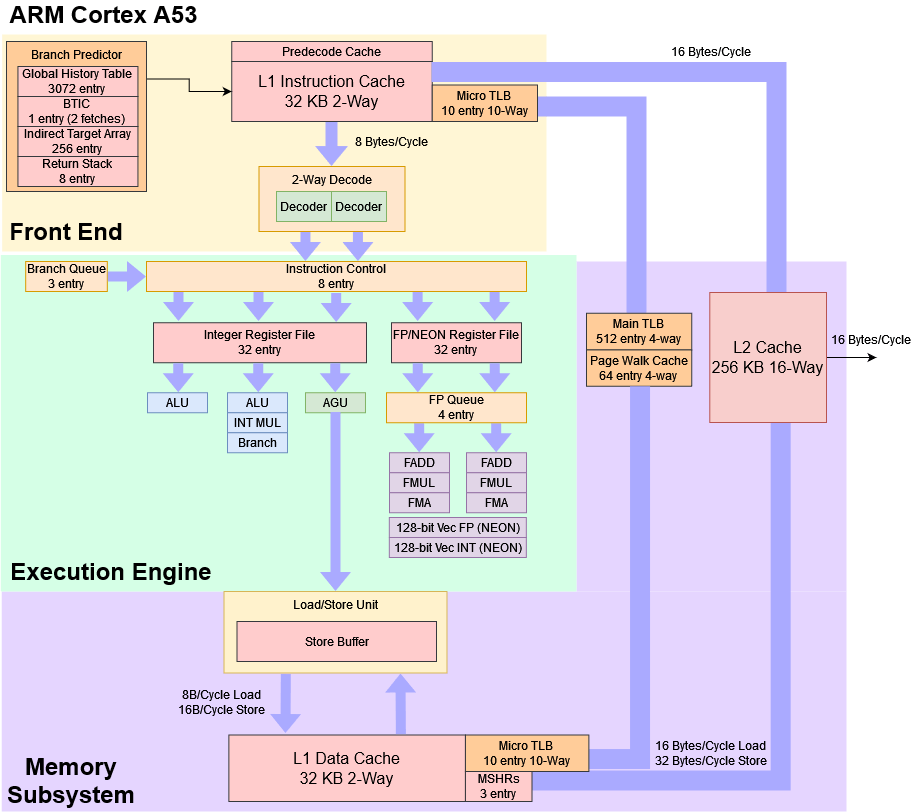

*图 3：前端包含分支预测、L1I、取指和双宽译码，执行侧有两条主要整数路径、FP/NEON、Load/Store 单元，外接每核 L1D 和集群共享 L2。结构图用于帮助理解模块关系；具体参数仍以 Arm TRM 与后文测试为准。*

顺序执行并不等于“一条指令做完再做下一条”。流水线仍可同时容纳多条指令，也可在没有依赖和资源冲突时每周期发射两条。区别在于：乱序核心会把未就绪指令放入调度器，让后续就绪指令先执行；A53 缺少这种大窗口，因此遇到真正的长延迟依赖时，很快就会停住。

### 体系结构视角：低功耗核心为什么仍会选择顺序执行

乱序执行需要重排序缓冲区（ROB）、物理寄存器、寄存器重命名、唤醒选择网络和较大的 Load/Store Queue。这些结构不仅占面积，还要频繁比较和广播，动态功耗很难忽略。若目标是 1 W 以下、控制型任务或极小面积，省下这套复杂逻辑仍有价值。

顺序核的代价则集中在延迟容忍能力：一次 L1 miss、较长的乘法依赖或 TLB miss 都可能让整个后端空转。其性能更依赖编译器静态调度、局部性和短依赖链。判断瓶颈时，应把 IPC 与前端空、Load miss 等待和执行 interlock 周期放在一起看，而不是只比较峰值发射宽度。

## 分支预测：精度、速度与面积都做了减法

分支预测决定下一段取指地址。走错路径既浪费周期，也让错误路径的取指、译码和执行消耗能量；但预测表越大、查询越复杂，本身也越耗面积和功耗。A53 无法像大型乱序核那样在错误方向上投机执行上百条指令，误预测一次丢掉的有效工作较少，因此 Arm 可以把更多设计预算让给面积与能效。

Arm 技术参考手册（TRM）给出的全局历史表为 3072 项。作为尺度参照，2003 年的 Athlon 64 已有 16384 项历史表；同期 Snapdragon 821 的 Kryo 小核本质上是降低频率、缩减 L2 的大核，面积也与大核相同，预测能力自然更强。

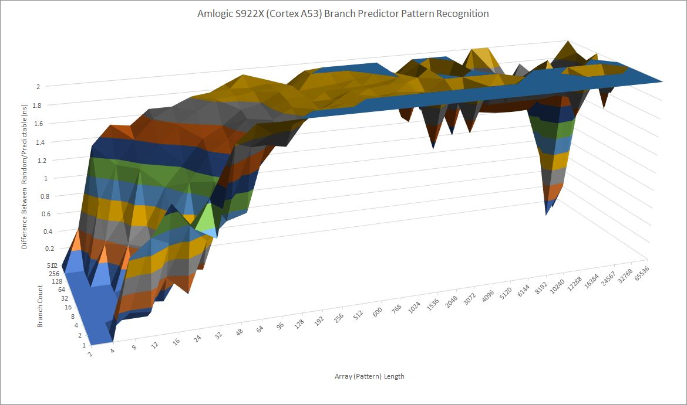

*图 4：横轴增加 Pattern Length，另一维改变 Taken 数量，纵轴为每分支周期数。低延迟区域代表模式可稳定学习；A53 对周期超过约 8～12 的重复模式很快失去把握。曲面只能显示可预测性边界，不能据此确定具体哈希或计数器实现。*

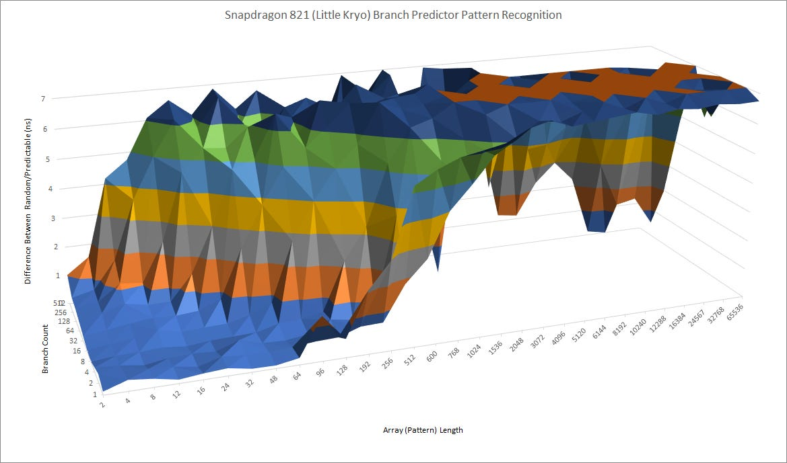

*图 5：Snapdragon 821 Little Kryo 的对照曲面。与图 4 相比，它在更长模式和更多静态分支下仍保持较低代价。A53 随分支足迹增大而恶化，很可能混入了不同分支映射到同一表项的破坏性混叠。两图不是应用性能对比。*

A53 的返回地址栈（Return Address Stack，RAS）深度为 8；Kryo 为 16，Athlon 64 为 12。八项不算深，却能覆盖多数浅层函数调用，比完全依赖普通间接预测好得多。

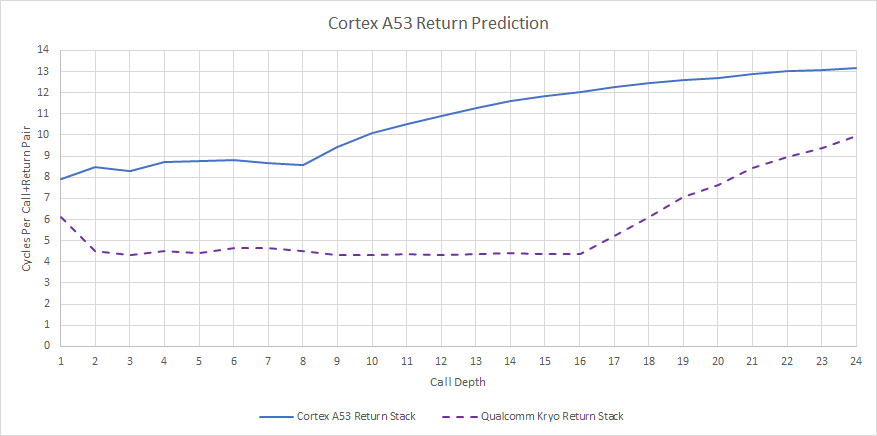

*图 6：调用深度在约 8 以内时 A53 曲线较平，超过后代价逐步上升；Kryo 的明显转折接近 16。该结果与 A53 八项 RAS 的公开描述相符。*

### 间接分支

间接分支的同一个 PC 可以跳到多个目标，比方向预测更难。Arm TRM 给出 256 项间接目标阵列。测试中，A53 能为最多约 64 个静态分支可靠跟踪每分支两个目标；单分支目标继续增加后，表现明显落后于更复杂核心。

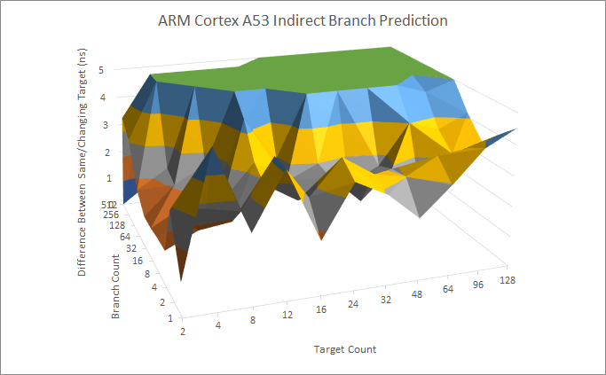

*图 7：横轴是每个间接分支的目标数，另一维改变间接分支数量，纵轴为平均周期。两目标、最多约 64 个分支的区域相对稳定；目标数和分支数同时增大后，容量、关联和混叠共同抬高代价。*

这种能力虽然有限，却不能省掉。现代面向对象代码中的虚函数、接口调用和跳转表都可能生成间接跳转；一个小型预测器也远胜于每次等待执行级确定目标。

### 目标预测速度与 BTIC

A53 没有大型高性能核心常见的解耦分支目标缓冲区（Branch Target Buffer，BTB）。多数情况下，前端必须从 L1I 取到分支指令，译码并计算目标，通常需要 3 个周期。

极小循环有一个单项 Branch Target Instruction Cache（BTIC）加速。TRM 表示它保存两个 Fetch Window 的指令字节；文章据 AArch32 指令宽度推测每窗为 8 B、总容量约 16 B，但这只是结构推断。Taken 分支间距达到 16 B 后，测试中 BTIC 的收益确实开始消失。

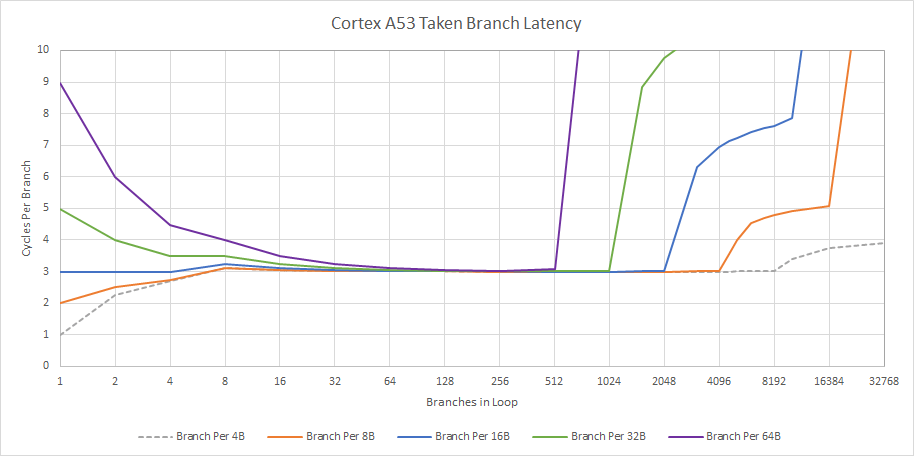

*图 8：横轴扩大分支足迹，曲线改变 Branch Spacing。命中 BTIC 时 Taken 分支约 2 周期，普通 L1I 内路径约 3 周期；“每 4 B 一条分支”对 4 B 定长 Arm 指令没有实际意义，因为它等于每条指令都是分支。超过 32 KB L1I 后，曲线直接暴露 L2 和 DRAM 取指代价。*

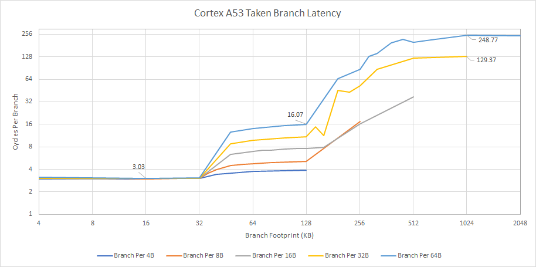

*图 9：按分支代码足迹重画后，约 32 KB、256 KB 处的台阶分别对应 S922X 的 L1I 与共享 L2。A53 没有可远远跑在取指前面的 BTB，因此这类测试不像大核那样只显示 BTB 层级，而会直接显出指令字节来自哪一级。*

代码一旦溢出 32 KB L1I，前端必须等待下一级把分支本身送来，代价迅速上升。A53 有非常基础的预取，却不是由分支预测器驱动；跨越足够多指令后，它无法遮住延迟。

### 体系结构视角：方向正确不等于前端不断流

方向预测回答“跳不跳”，目标预测回答“跳到哪里”，BTIC/BTB 的访问延迟又决定何时能把这个地址交给 Fetch。即使方向完全正确，目标给晚了，前端仍会产生 Taken Bubble。A53 用极小 BTIC 优化最常见的小循环，却接受大代码足迹下的高代价，这是一种非常明确的局部最优。

验证时可分别改变 Pattern Length、静态分支数、Branch Spacing、单分支目标数和调用深度。若只改变代码足迹，BTB、L1I、iTLB 和预取都会一起变化，很难把台阶唯一归因于某张表。

## 取指与译码：两宽很容易喂满，L1I 之外却很难

S922X 的每颗 A53 配置 32 KB、两路组相联 L1I；Arm 允许实现者在 8、16、32 和 64 KB 间选择。它采用虚拟索引、物理地址（Virtually Indexed, Physically Addressed）的组织，使 TLB 翻译和 Cache 索引可并行进行，从而降低命中延迟。

为了进一步节省功耗和面积，L1I 的奇偶校验是可选项。启用时，每 31 bit 配一位奇偶信息；检测出错误后使对应 Cache Set 失效，再从 L2 或更低层重取。替换策略使用伪随机而非 LRU，因为真正的 LRU 需要额外元数据来记录访问次序。

L1I 还保存一种中间指令格式：在填入 L1I 前先做部分预译码，换取更简单、更短的主译码路径，代价是每条指令占用更多存储位。

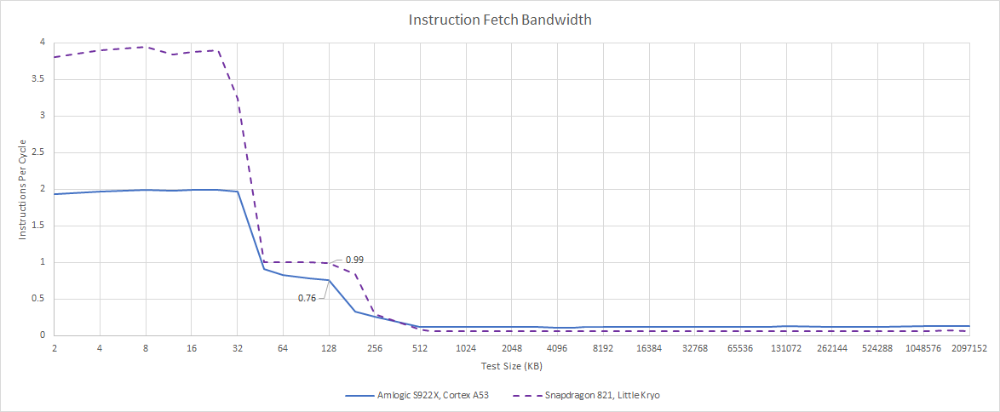

*图 10：代码命中 L1I 时，A53 可以稳定供给两宽译码；Little Kryo 可达约 4 IPC。足迹超过 L1I 后两者都显著下降，Kryo 从 L2 约 1 IPC，A53 更低；进入内存后尤其糟糕。*

Arm TRM 给出 L1I 到 L2 的 128-bit（16 B）读接口，但实测没有接近这一理论带宽。较合理的解释是核心无法同时跟踪足够多的未决取指 miss。S922X 又没有 L3，256 KB L2 作为末级 Cache 容量很小，因此大代码足迹会同时撞上低并发度和高 DRAM 延迟。

## 执行引擎：灵活双发射，但没有乱序调度器

初代 Pentium 的双流水线限制较死，而 A53 的两个 Dispatch Port 可以把指令送往多个执行单元。依赖满足、目标单元可用时便能双发射；常用单元往往有两份，因此许多代码更容易被数据依赖而非峰值单元数限制。

测试还显示它可以绕开部分基础顺序核会遇到的流水线冒险。两条写同一 ISA 寄存器的指令可以同周期发射，说明写后写（WAW）不会直接卡住。文章不认为这等同于完整寄存器重命名，更可能是冲突检测与写回抑制：如果较新的指令已经覆盖同一寄存器，就不让旧结果破坏架构状态。没有 RTL，无法进一步确认。

缺少真正重命名也意味着没有 Move Elimination 和 Zeroing Idiom Recognition。`XOR reg, reg` 或 `SUB reg, reg` 的结果虽然恒为零，A53 仍会错误依赖旧寄存器值。

### 整数执行

常见整数加法、寄存器 MOV 和位运算可以双发射；整数乘法和分支不能各自双发射，但可与另一类指令并行。乘法与分支混排只有约 0.7 IPC，说明两者共享某条复杂管线，两个整数 Pipe 很可能分成基础与复杂路径。

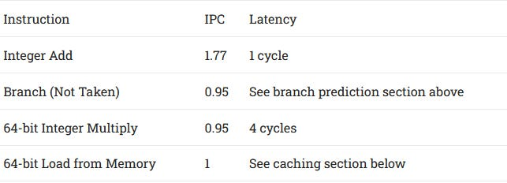

*图 11：整数 Add 为 1.77 IPC、1 周期延迟；不 Taken 分支 0.95 IPC；64-bit 整数乘法 0.95 IPC、4 周期；64-bit Load 约 1 IPC，延迟见 Cache 章节。IPC 大于 1 表明该类指令可以双发射。*

### 浮点与 NEON

A53 可以双发射常见标量 FP Add 和 Multiply，这对大量使用双精度语义的 JavaScript 很有价值。但两者延迟都是 4 周期；低频顺序核没有大窗口寻找独立工作，依赖链会直接形成 interlock。FMA 的吞吐约 1.19 IPC、延迟 8 周期。

128-bit NEON 指令则不能双发射，也不能与标量 FP 同周期发射，说明一条 128-bit 操作很可能同时占用两条 FP 路径。图中 128-bit FP32 Add/Multiply 吞吐均约 0.91 IPC、延迟 4 周期；FMA 约 0.95 IPC、8 周期；INT32 Add 约 0.95 IPC、2 周期，Multiply 约 0.91 IPC、4 周期；128-bit Load 约 0.49 IPC，Store 约 1 IPC。

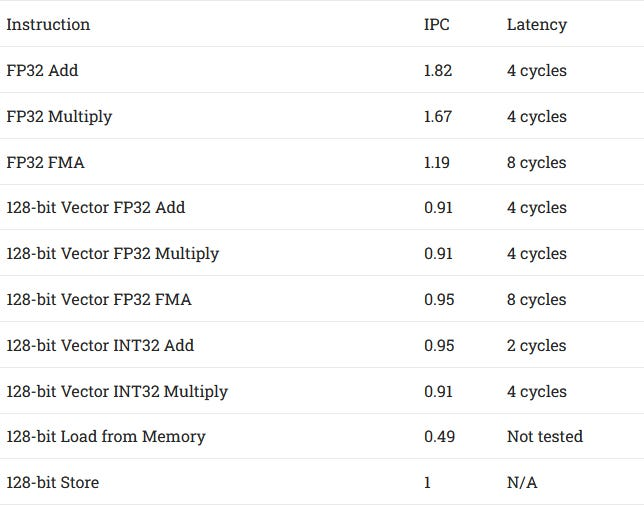

*图 12：表中同时列出吞吐和依赖链延迟。标量 FP 可以接近双发射，128-bit NEON 大多约每周期一条；向量 Load 约每两周期一条，而 128-bit Store 可到每周期一条。*

### 有限的 Nonblocking Load

A53 不是完全遇到 Cache miss 就立即冻结。它能越过一个未完成 Load，继续向前执行很短一段，说明内部有若干缓冲区保存尚未提交的状态。但这与乱序执行不是一回事：缓冲很小，也不需要像调度队列那样每周期比较所有条目，因此省电，却很快会触发停顿。

以下任一情况都会迫使核心停止继续前进：包括 miss 在内达到 8 条在途指令；出现使用该 Load 结果的指令；出现任何新的访存操作，包括 Store；在途 FP 指令达到 4 条；出现任意 128-bit NEON 指令；或者经过超过 3 条分支，无论 Taken 与否。

如果 miss 去 DRAM，停顿可能持续数百周期。这种能力不能与最早期的简单乱序核相提并论，却说明 Arm 利用现代工艺，在不引入完整乱序复杂度的前提下，仍为顺序流水线增加了有限延迟容忍。

### 体系结构视角：Nonblocking 不等于乱序执行

Nonblocking Cache 只表示 miss 未完成时 Cache/流水线还能接受某些后续动作；乱序执行还需要保存更多指令状态、识别就绪依赖、选择端口，并在异常或误预测时精确恢复。A53 的“向前走几步”更像受严格类型和数量限制的缓冲，而不是通用 Scheduler。

可用“一次长延迟 Load + 不同数量、不同类型的独立指令”探测边界。若第 8 条在途指令、第二个访存、第四个 FP 或第四条分支稳定出现台阶，就能区分具体阻塞条件；但这仍只能证明外部可见容量，不能直接给内部队列命名。

## Load/Store：单 AGU，转发慢路却不算糟

A53 只有一条地址生成流水线（Address Generation Unit，AGU），所以稳态最多每周期处理一条内存操作。L1D 命中时，简单寻址 Load 延迟 3 周期，带缩放索引的复杂寻址为 4 周期。即使较弱的乱序核心也常能每周期处理两次访存，因此单 AGU 是 A53 很明确的吞吐上限。

顺序执行简化了 Load/Store Unit（LSU），但没有消除字节粒度、不同访问宽度、对齐和内存依赖。流水线重叠意味着后一条 Load 仍可能需要尚未提交 Store 写出的数据，因此必须做 Store-to-Load Forwarding 或等待 Store 提交。

A53 看起来以 8 B 对齐块访问 L1D。标量访问跨越 8 B 边界增加 1 周期；转发通常也增加约 1 周期。Load 只与 Store 部分重叠时没有出现几十周期级灾难，最坏情况是 Load 起始地址高于 Store 时约 6 周期。

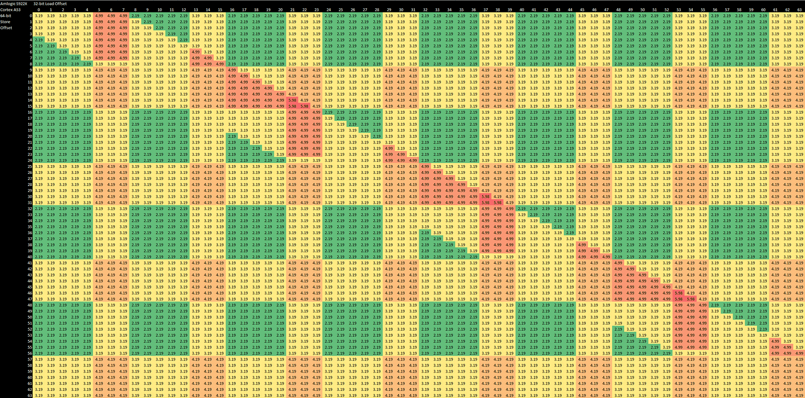

*图 13：列为 32-bit Load Offset，行为 64-bit Store Offset，格内为周期。绿色约 2.19、黄色约 3.19～4.19，部分重叠慢路约 4.99～5.98；每 8 B 边界形成重复结构。高密度矩阵应点击原图查看。*

Neoverse N1 在 Load 没有位于 Store 内部的 4 B 对齐位置时会多付 10～11 周期；Kryo 的完全包含为 12～13 周期、部分重叠为 14～15 周期。A53 的简单设计反而避开了复杂乱序 LSU 的某些极慢恢复路径。一种可能是它并没有复杂的直接转发网络，而是短暂延迟 Load，待 Store 提交后再从 L1D 正常读取；现有延迟矩阵无法确认这一实现。

NEON 访问更依赖 16 B 对齐。128-bit Load/Store 未对齐时增加 1 周期；转发大多接近免费，只有 Load 地址高于 Store 的部分组合升高。即使如此，相关 Store/Load 对最慢约每 6 周期一组，仍算不错。

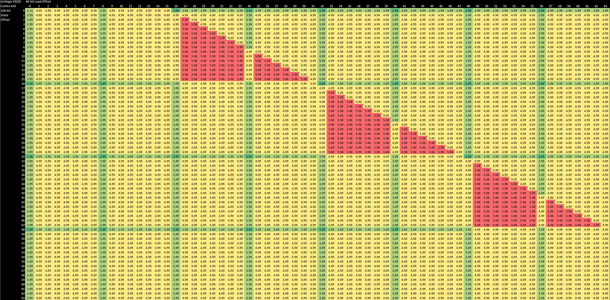

*图 14：列为 128-bit Load Offset，行为 128-bit Store Offset。16 B 对齐点约 2.99 周期，常见组合约 3.99～4.99，部分高地址 Load 重叠区约 5.98。矩阵的 16 B 周期性比标量图更明显。*

A53 跨越 4 KB 页边界没有额外惩罚；更高性能的 N1 在 Store 跨 4 KB 边界时反而会多约 12 周期。这再次说明，复杂 LSU 为高并发和投机付出的恢复代价，有时会在边界条件下输给简单顺序路径。

### 体系结构视角：对齐、转发和跨页分别在解决什么

对齐慢路来自一次逻辑访问需要覆盖两个内部数据块；转发慢路来自 Store 与 Load 的字节掩码、年龄和地址匹配；跨页访问还可能需要两次地址翻译，并面对第二页异常。三者可能叠加，却不是同一机制。

验证时要同时扫描 Store/Load 的相对 Offset、宽度、完全/部分重叠、4 KB 边界和异常页。对于异常 Store，只能要求陷阱前不产生架构不允许且无法回滚的可见副作用；不能从程序最终结果反推 Cache 阵列从未预取、分配或请求所有权。

## 地址转换：小而快的两级 TLB

现代操作系统用页表把每个进程的虚拟地址映射到物理地址。若每次访存都遍历页表，一次用户 Load 会变成多次串行内存访问，因此处理器用地址转换后备缓冲区（Translation Lookaside Buffer，TLB）缓存翻译结果。

A53 把两级称作 Micro TLB 与 Main TLB。图中整理为 10 项全相联 Micro TLB、512 项四路 Main TLB；Main TLB 命中只增加约 2 周期。两级均 miss 后由 Page Walker 工作，并有 64 项、四路 Page Walk Cache 保存第二级页表结构。图中容量来自 Arm 资料整理，不是本次测试反推。

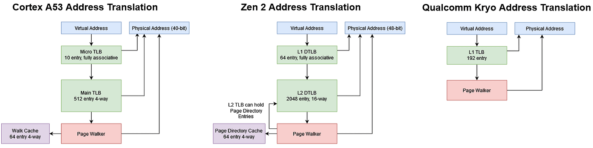

*图 15：A53 为 10 项全相联 Micro TLB、512 项四路 Main TLB、64 项四路 Walk Cache，物理地址宽度 40 bit；Zen 2 为 64 项全相联 L1 DTLB、2048 项 16 路 L2 DTLB 和 64 项四路 Page Directory Cache，物理地址 48 bit；Kryo 图中只有 192 项 L1 TLB 与 Page Walker。*

Zen 2 的 2048 项 L2 DTLB 覆盖更大，但命中多约 7 周期。大乱序窗口可以遮住这段延迟，A53 却很难，因此后者更重视小工作集下的低延迟。A53 只支持 40-bit 物理地址，最多寻址 1 TB 物理内存；手机不会在意，但服务器可能受到限制。

### 体系结构视角：TLB Reach 与命中延迟的交换

TLB Reach 等于条目数乘页大小。更大表能减少 Page Walk，却带来更多 Tag 比较、更长线路和更高动态能耗。顺序核尤其怕命中本身变慢，所以“小一级 + 较快主表 + Walk Cache”是一种合乎定位的组合。

应分别用 4 KB 与大页、固定随机访问数和不同工作集测试；同时记录 TLB refill、page walk、L1D miss 与周期。只看总延迟曲线，Cache 容量台阶和 TLB 覆盖台阶很容易混在一起。

## Cache、共享 L2 与 DRAM

每颗 A53 有四路组相联 L1D。S922X 配置 32 KB，Arm 允许 8、16、32 或 64 KB。L1D 命中约 3 周期，这对低频核心很好。它同样使用伪随机替换，但与 L1I 的虚拟索引不同，L1D 是物理索引、物理 Tag，必须完成地址翻译后才能访问。

L1D Data Array 可选 ECC，能够纠正单 bit 错误；Tag 与状态阵列只用奇偶校验，状态保护又只覆盖 Dirty Bit，以确保修改数据最终能正确写回。数据 Cache 可能保存系统中唯一的最新副本，因此保护强度高于可从下级重取的指令 Cache。

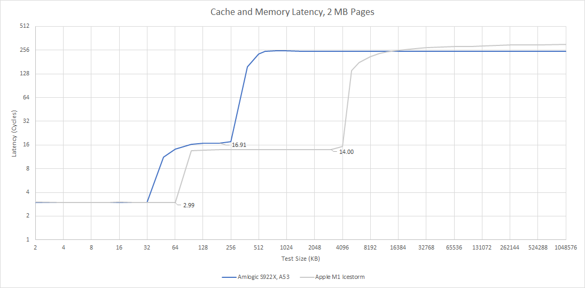

*图 16：使用 2 MB 大页减少 TLB miss。A53 的 L1D 约 3 周期，256 KB 共享 L2 约 16.91 周期，进入内存约 250 周期；Apple M1 Icestorm 作趋势参照，使用 Asahi Linux，因为 macOS 无法使用 2 MB 页。跨平台曲线只用于展示量级。*

L1D 每周期可读 8 B，即一次 64-bit 标量 Load，或每两周期一次 128-bit Vector Load；Store 却能达到每周期 16 B。Load 通常多于 Store，这个不对称选择有些反常，页面也没有给出原因。与本站测试过的其他核心相比，A53 的 L1 带宽很低。

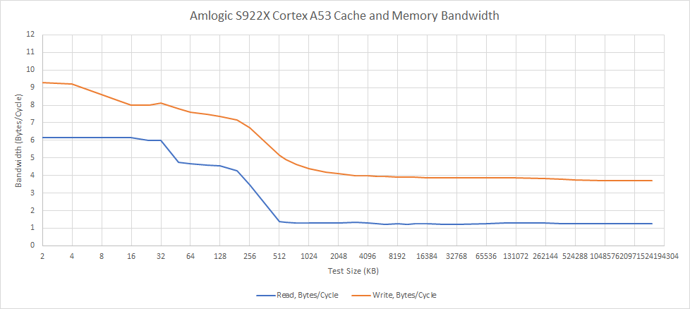

*图 17：横轴为测试工作集 KB，纵轴为 B/cycle。极小工作集下 Read 约 6 B/cycle、Write 约 9 B/cycle；跨出 32 KB L1D 后开始下降，256 KB 之后落到约 1.2 B/cycle Read、约 4 B/cycle Write。*

L1D miss 控制器最多跟踪 3 个待处理 miss。共享 L2 为 16 路 Victim Cache，可配置 128 KB、256 KB、512 KB、1 MB 或 2 MB，也可以完全省略；ECC 同样可选。S922X 的双核 A53 集群只配 256 KB。

*图 18：网页在介绍 L2 时再次嵌入了与图 17 字节完全相同的单核带宽图。这里保留这一原始编排；它仍显示 32 KB L1D 与 256 KB L2 的两个工作集边界。*

每核 L1D 到 L2 的读接口为 128 bit，写接口为 256 bit；L2 Fetch Path 为 512 bit，理论上足够服务四核集群。实测 L2 范围内单核 Write 略低于 8 B/cycle，Read 略低于 5 B/cycle。接口宽度并未转成同等有效带宽，原因很可能是 3 个未决 miss 不足以覆盖 L2 延迟。

Arm TRM 允许 L2 Data Array 配置 2～3 周期输出延迟；S922X 的端到端 Load-to-use 约 9 ns、17 周期。共享 Cache 还要仲裁多个核心请求，这可能贡献了部分延迟，但没有分项测量，不能唯一归因。

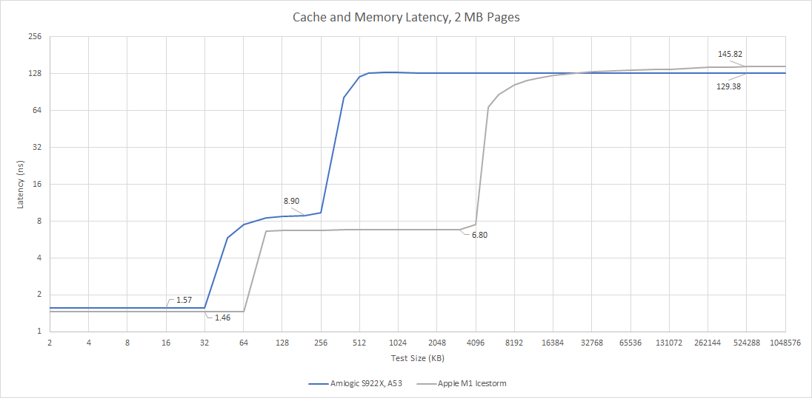

*图 19：以 ns 表示并继续使用 2 MB 大页。A53 L1/L2/DRAM 约为 1.57/8.90/129.38 ns，M1 Icestorm 约为 1.46/6.80/145.82 ns。M1 内存延迟更高，但它有更大 Cache 与更强乱序能力，不能从单个数值推断应用表现。*

两颗 A53 同时访问共享 L2 时，吞吐接近翻倍：128-bit Vector Store 合计约 14 B/cycle，Load 约 9 B/cycle。这表明 L2 本体能并行服务两核，单核更多受自身 miss 并发度限制。

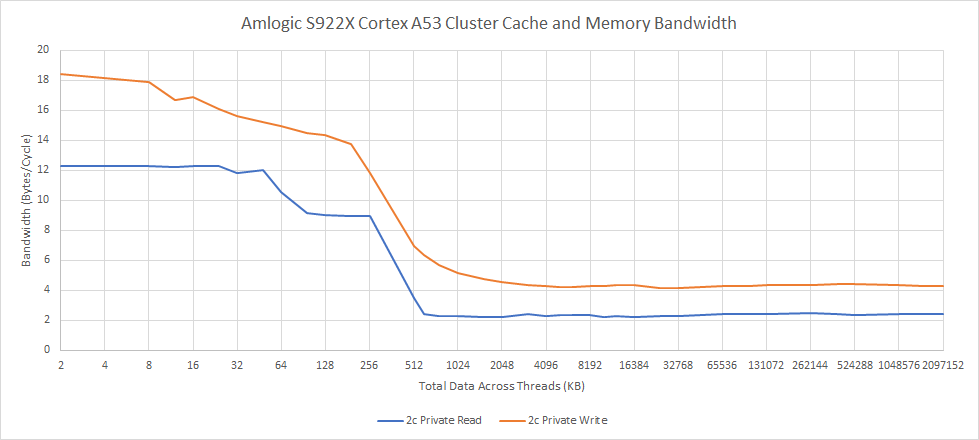

*图 20：横轴是两线程数据总量。L1 范围合计 Read 约 12 B/cycle、Write 约 18 B/cycle；进入共享 L2 后约 9 与 14 B/cycle；超过 256 KB 后降至约 2.2 与 4.2 B/cycle。*

### 一致性与跨集群传输

L2 还负责 A53 集群内部一致性。它维护 Shadow Tag，跟踪各核心 L1 中的数据，按 33 bit 粒度做 ECC；只有请求命中 Shadow Tag 时才向核心发 Snoop，减少广播流量。协议使用 MOESI，即 Modified、Owned、Exclusive、Shared、Invalid 五种状态。

集群内的 Snoop Control Unit（SCU）能较快完成 Cache line 转移。图 21 中 1、2 号是 A53，3～6 号是 A73：两颗 A53 互访约 22.85～23.45 ns，四颗 A73 之间约 28～29 ns；跨 A53/A73 集群约 267 ns，接近完整 DRAM 往返。Snapdragon 821 也有类似跨集群高代价。

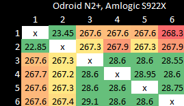

*图 21：1、2 号为 A53，3～6 号为 A73，单位为 ns。集群内为约 23 或 28～29，跨集群为约 267。网页没有披露同步协议、Cache line 状态或测试重复统计，因此矩阵只能说明路径分层。*

普通程序的 Core-to-core Transfer 远少于 DRAM miss，跨集群慢路未必显著影响一般负载；但频繁共享同一 Cache line 的锁、队列和生产者—消费者程序会更敏感。

Odroid N2+ 为 S922X 配置 32-bit DDR4-2640。双核 A53 写带宽 8.32 GB/s，读只有 4.57 GB/s；同芯片四颗 A73 可读到约 8 GB/s，说明内存子系统而不是 A53 核本身决定了上限。文章把最好情况类比为表现平庸的双通道 DDR2。

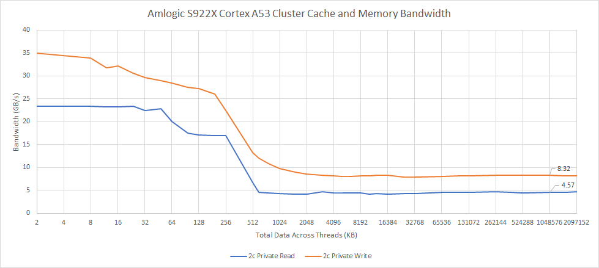

*图 22：横轴为两线程总工作集，纵轴为 GB/s。超过 256 KB L2 后，Read 最终约 4.57 GB/s、Write 约 8.32 GB/s。DRAM 延迟超过 129 ns，而前面只有 256 KB L2，这对顺序核心尤其不利。*

### 体系结构视角：接口宽度、并发度与有效带宽

128/256/512-bit 描述一次内部传输能搬多少数据，并不保证程序每周期都能发起相同规模请求。有效带宽还取决于 MSHR、miss buffer、bank 冲突、refill 队列、预取和内存级并行（MLP）。A53 每核只能跟踪 3 个 L1D miss，因此很宽的 L2 接口也可能吃不满。

若工作集跨过 L1 后带宽下降，同时未决 miss 很快达到上限，就应先看并发不足；若多核能近似线性提高 L2 带宽，说明共享阵列仍有余量。进入 DRAM 后还要把 SoC Fabric、内存控制器、DDR 宽度与频率算进来，不能全部归因于 A53 IP。

## 四类实际负载：顺序核真正怕什么

应用部分使用四个工作负载：

- `sha256sum` 计算一个 2.67 GB 文件的 SHA-256，分支不足执行指令的 1%，访存规律、Cache 命中率高；
- 7-Zip 压缩同一个 2.67 GB 文件，分支更多，指令足迹较小但数据足迹大；
- `ffmpeg`/libx264 解码 4K 视频，两颗 A53 无法实时完成；
- 把 4K 视频缩放到 1280×720，再用 libx264 `slow` Preset 转码。它同时有较大指令与数据足迹，且不能与本站以 `veryslow`、4K 输出的旧编码测试直接比较。

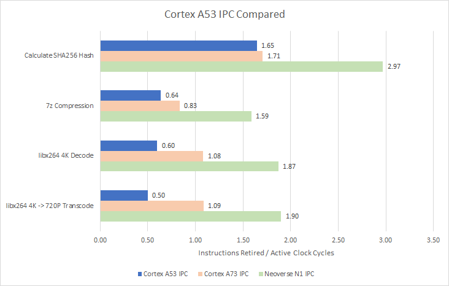

*图 23：四项中 A53/A73/N1 IPC 分别为 SHA-256 1.65/1.71/2.97，7-Zip 0.64/0.83/1.59，4K Decode 0.60/1.08/1.87，4K→720p Transcode 0.50/1.09/1.90。ISA、核心结构与平台条件并不统一，图的价值是展示工作负载敏感性。*

SHA-256 很少 miss，编译器可把独立指令排在依赖之间，静态调度让 A53 达到 1.65 IPC，与 A73 的 1.71 很接近。工作集一旦频繁 miss，顺序执行便迅速失去竞争力。

### 用 Attributable Performance Impact 事件拆流水线

Arm 为 A53 提供 Attributable Performance Impact 事件，可把部分停顿归到具体阶段。文章合并为以下类别：

- Event `0xE0`：DPU Instruction Queue 为空，且并非近期 Micro TLB miss、L1I miss 或 Predecode Error。它可能来自误预测冲刷，也可能来自 Taken 分支附近的前端带宽不足；单个事件不能再细分二者。
- Event `0xE1`：DPU IQ 为空且有 L1I miss 待处理。
- Event `0xE8`：流水线 `Wr` 阶段因 Store 停顿。Store 不产生后续指令依赖的结果，因此这里更可能反映内存层级暂时无法接受更多写请求。
- Event `0xE7`：`Wr` 阶段因 Load miss 停顿。
- Event `0xE4 + 0xE5 + 0xE6`：依赖 Interlock 周期，且排除 `Wr` 阶段，主要反映执行结果尚未就绪。

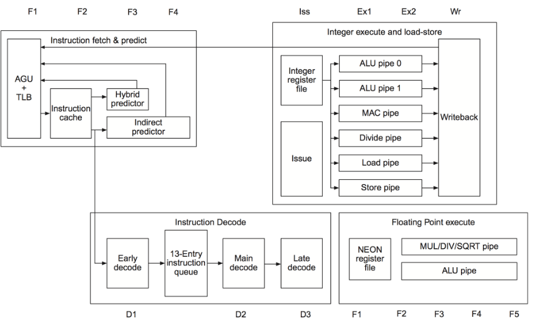

*图 24：引用自页面给出的课程讲义链接，用于说明 Wr 表示 Writeback。该图部分端口描述值得怀疑，例如它暗示 Load 可与 Store 同发，而 A53 单 AGU 测试并不支持这一点，因此不能把它当成 Arm 官方实现图。*

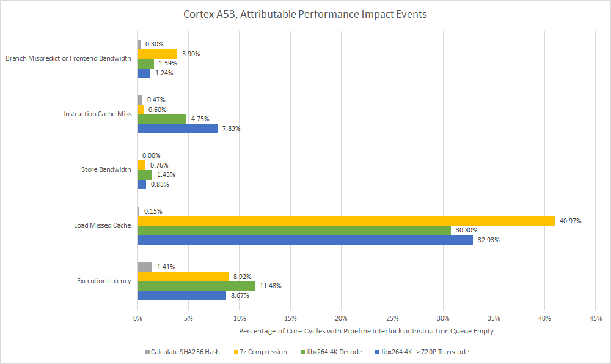

*图 25：SHA-256/7-Zip/Decode/Transcode 的“误预测或前端带宽”约为 0.30/3.90/1.59/1.24%，L1I miss 为 0.47/0.60/4.75/7.83%，Store 带宽为 0/0.76/1.43/0.83%，Load miss 为 0.15/40.97/30.80/32.93%，执行延迟为 1.41/8.92/11.48/8.67%。类别可能重叠于不同周期口径，不能简单相加成总 CPI。*

7-Zip 约每十条指令就有一条分支，SHA-256 则约每百条才一条。7-Zip 的预测正确率只有 87.76%，N1 超过 95%，Zen 2 超过 97%；但 A53 最多只损失约 3.9% 周期。因为它不能在分支后投机很远，大预测器的潜在收益有限，未必值得面积和功耗。

libx264 还叠加了大代码足迹。Decode 中 AGU 依赖 Interlock 接近 6% 周期，其他整数依赖为 4.14%；SIMD/FP 依赖只有 1.36%。编码时 SIMD/FP Interlock 上升到 3.32%，但标量整数依赖仍造成更多停顿。

三个非平凡负载最突出的共同点都是等待 Load miss：7-Zip 为 40.97%，Decode/Transcode 也超过 30%。改善执行延迟或前端只能处理次要部分；A53 无法越过很远的 Cache miss，才是与乱序核心最根本的差距。

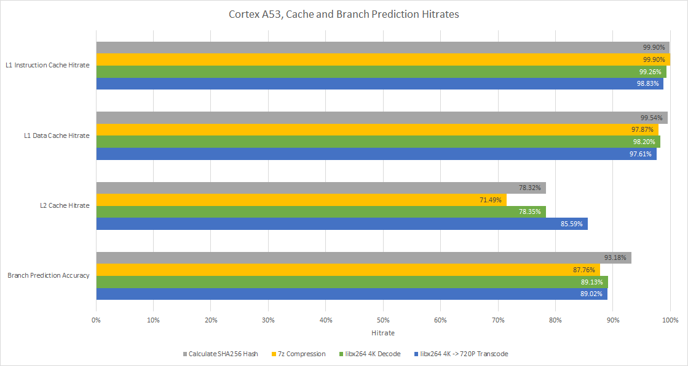

*图 26：四项负载的 L1I 命中率为 99.90/99.90/99.26/98.83%，L1D 为 99.54/97.87/98.20/97.61%，L2 为 78.32/71.49/78.35/85.59%，分支预测为 93.18/87.76/89.13/89.02%。高百分比不等于低性能损失，因为 miss 代价和访问频率不同。*

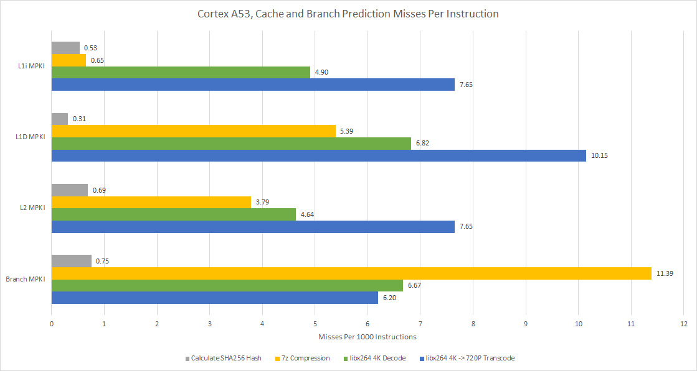

*图 27：按 SHA-256/7-Zip/Decode/Transcode 顺序，L1I MPKI 为 0.53/0.65/4.90/7.65，L1D 为 0.31/5.39/6.82/10.15，L2 为 0.69/3.79/4.64/7.65，Branch MPKI 为 0.75/11.39/6.67/6.20。作为参照，Zen 2 的 L3 通常低于 2 MPKI；S922X 的 256 KB L2 很难承担末级 Cache。*

A53 的 32 KB L1 和廉价替换策略呈现出预期表现，约 5～10 MPKI 在 Zen 2 上也不罕见；区别是 Zen 2 后面还有更大、更快的 L2/L3 和乱序窗口。A53 同时缺少两者，因此承受最不利组合。不过这并非设计失误：小 Cache 正是它降低面积与功耗的手段。为 A53 配很大的 Cache 虽能提高性能，却可能偏离选择这颗核心的初衷。

### 体系结构视角：命中率、MPKI 与停顿周期必须一起看

命中率说明某级 Cache 的有效性，MPKI 把 miss 数量归一到执行指令，停顿事件则反映这些 miss 有多少真正落入关键路径。99% 命中率在每千条指令有大量访存时仍可能产生可观 MPKI；同样 MPKI 下，乱序窗口和 MLP 又会决定最终损失多少周期。

较完整的性能归因应同时记录 Instructions、Cycles、各级 Miss、Page Walk、前端空、依赖 Interlock 和内存带宽，并检查事件是否互斥。没有统一版本、编译参数和输入时，这些数据只能解释当前平台，不能拿来宣布某一 ISA 或核心系列普遍更快。

## 结语：顺序与乱序之争，只是下沉到了更低功耗区间

高性能市场曾长期争论顺序与乱序执行。乱序能隐藏延迟、提取指令级并行，却需要昂贵 Buffer 和复杂控制。Intel Itanium 与 IBM POWER6 都试图在高性能区间坚持顺序路线，最终前者退出市场，后者被乱序 POWER7 接替。随着晶体管预算增加，Tremont、Neoverse N1 和 AMD Jaguar 等低功耗核心也采用乱序执行。

但在一个领域失去优势的设计范式，往往会在另一个区间找到位置。目标降到约 1 W 及以下、每一点面积都重要时，避开完整乱序引擎仍有意义。Arm 演讲给出的对比是：同为 32 nm，A53 可用比双宽乱序 Cortex-A9 小 40% 的面积提供相同性能。这个数字属于 Arm 指定条件下的官方比较，不等于跨产品的通用结论。

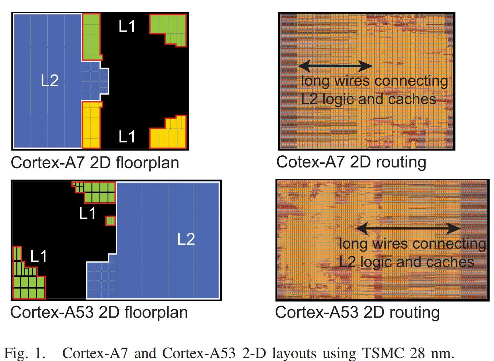

*图 28：来自论文 “High-Performance Logic-on-Memory Monolithic 3-D IC Designs for Arm Cortex-A Processors”。图中比较 Cortex-A7 与 A53 的二维 Floorplan 和 L2 长连线，用于展示小核的面积与布线特征，不是 S922X 裸片的实测布局。*

A53 比经典顺序核更适应现代软件：有直接与间接分支预测、返回栈、灵活双发射、标量 FP 双发射和 NEON，也用少量缓冲越过一次 Load miss。继续增大 Cache、降低执行延迟、强化分支预测当然能提高性能，但每一步都会增加面积和功耗；如果愿意承担这些代价，选择 A53 本身就未必合理。

它最终在极低功耗与性能点上取得了平衡。A53 没有追逐边际收益很低的性能，却因此被大量手机、控制器、机顶盒和边缘设备采用，并在退出手机主流之后继续存在。

### 体系结构视角：从 A53 可以看到的六个设计认识

第一，微架构没有脱离目标区间的“绝对先进”。顺序执行在服务器大核上不成立，不代表它在 1 W 以下控制核中没有价值；面积、功耗和要处理的延迟分布共同决定正确答案。

第二，预测器投入应与投机深度匹配。A53 的方向预测很弱，目标供给也高度依赖 L1I，但它一次误预测丢掉的工作很少。扩大预测器会提高 IPC，却不一定比节省的面积与能量更划算。

第三，顺序核最怕的不是某条 ALU 少一条，而是长延迟无处隐藏。四个实际负载中，Load miss 造成的停顿远大于分支和大部分执行依赖；这解释了为什么 Cache、TLB、预取和 MLP 对小核同样关键。

第四，简单结构有时能避开复杂核心的异常慢路。A53 的 Store Forwarding 和跨页访问并不强，却没有 N1、Kryo 某些重叠组合的十余周期惩罚。更高峰值并不保证所有边界条件都更短。

第五，接口宽度与可兑现带宽是两回事。A53 有 128/256-bit L1—L2 接口和 512-bit L2 Fetch Path，但每核仅三个待处理 miss，单核很难填满这些通路；双核反而能更接近共享 L2 上限。

第六，CPU IP 与 SoC 必须分开评价。跨集群约 267 ns、4.57 GB/s DRAM Read 和 129 ns 内存延迟包含 S922X 的 SCU、Fabric、内存控制器、32-bit DDR4 与板级实现，不应全部写成 A53 核心本身的属性。

## 参考资料

- Chester Lam，*ARM’s Cortex A53: Tiny But Important*，Chips and Cheese，2023-05-28：https://chipsandcheese.com/p/arms-cortex-a53-tiny-but-important
- Arm，*Cortex-A53 Technical Reference Manual*（网页引用的公开规格来源）
- Arm Keynote 中 Cortex-A53 与 Cortex-A9 的同工艺面积/性能比较（网页引用）
- *High-Performance Logic-on-Memory Monolithic 3-D IC Designs for Arm Cortex-A Processors*（图 28 来源）

如果这类分析对你有帮助，可以通过原页面列出的 Patreon 或 PayPal 支持 Chips and Cheese，也可以加入其 Discord 社区交流。
