# Cortex-A57：Nintendo Switch 的 CPU 为何如此吃力

> **文章来源**
>
> - 文章：*Cortex A57, Nintendo Switch’s CPU*
> - 撰文：Chester Lam
> - 首发：Chips and Cheese
> - 发布：2023 年 12 月 12 日
> - 链接：https://chipsandcheese.com/p/cortex-a57-nintendo-switchs-cpu

2010 年代初，Arm 的 32-bit 核心已经站稳手机和平板市场。终端内存容量继续上升、Arm 又希望进入服务器，64-bit 支持于是不可回避。Cortex-A57 与 A53 共同构成 Arm 第一代 64-bit 核心：A53 面向面积与能效，A57 则以三宽乱序执行承担主要性能任务。

这里观察的是 Nintendo Switch 所用 Nvidia Tegra X1。该 SoC 面向移动、汽车等场景，强调有限功耗下的 GPU 性能，恰好适合便携游戏机。Tegra X1 采用 TSMC 20 nm（20SoC），Die Area 为 117.6 mm²；一颗 A57 略低于 2 mm²，四核 A57 Cluster 共 13.16 mm²。

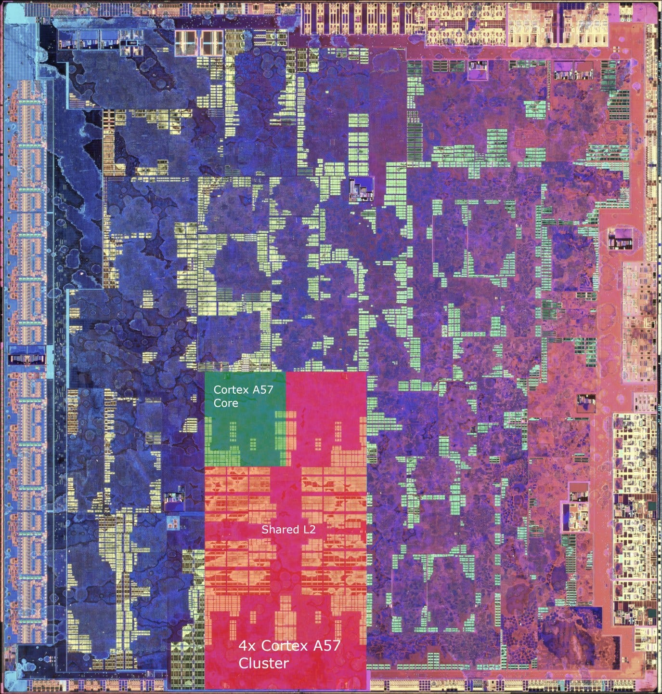

*图 1：Tegra X1 Die Shot 来自 Fritzchens Fritz，Chester Lam 添加标注。四核 A57 Cluster 位于右上区域，SoC 还集成 Maxwell GPU、内存控制器以及一组 A53。网页正式图注保留了两者归属。*

Tegra X1 还有四颗节能 A53，但 Nintendo 没有启用。LPDDR4 Controller 连接 4 GB DRAM，理论带宽最高 25.6 GB/s。A57 最高标称 1.78 GHz；Ubuntu 下从 1.2 GHz 升到最高点大约需要三分之一秒。

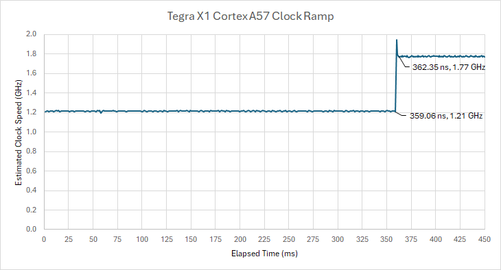

*图 2：负载开始后约 340 ms，频率才从约 1.21 GHz 升至约 1.77 GHz。短任务的平均性能会混入 DVFS 响应，不能只按最高频率换算。*

网页没有完整披露 Switch/Ubuntu 软件栈、编译器与 Flags、温控、重复次数和误差。Skylake、Jaguar、A73 对照来自不同平台；其中 PMU 事件定义也不完全一致。下文用这些结果解释结构和瓶颈，不把跨平台柱图当成同频 IPC 结论。

## 总览：三宽乱序，窗口大而调度器小

Cortex-A57 是三宽乱序核心。它能维持较大的最大重排序容量，Scheduler 和配套队列却相对小；设计显然优先考虑功耗和面积，不过仍比 Jaguar、Silvermont 等旧低功耗核更有野心。

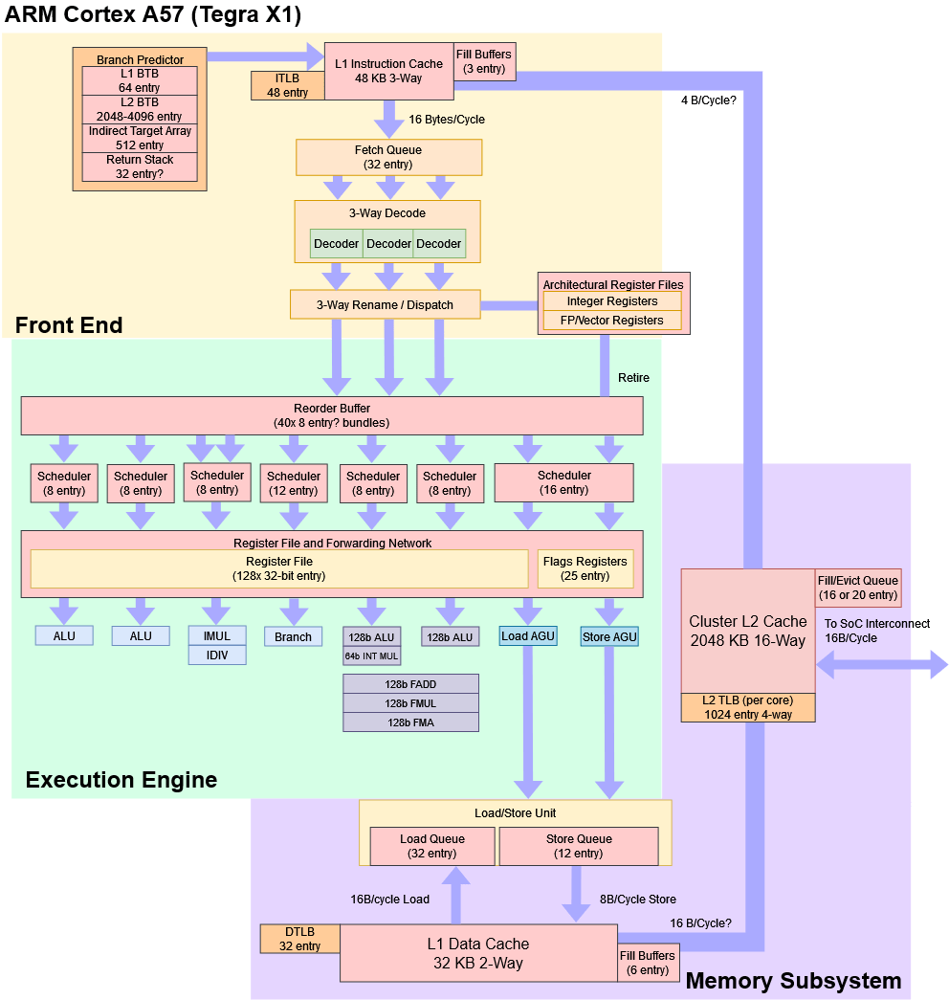

*图 3：前端包含方向/目标预测、48 KB L1I、Fetch Queue、三宽 Decode/Rename；后端以分布式 Scheduler 驱动 Integer、Branch、FP/ASIMD 和 Load/Store Pipeline。该图用于汇总公开资料与测试，不是 RTL 网表。*

A57 最特殊的结构之一，是以 128 项、每项 32 bit 的统一 Register File 同时支持整数与 FP/Vector Rename。多项 32-bit Entry 可以拼成 64 或 128-bit Result，借此减少独立大宽度寄存器阵列的面积。

一簇最多四核，共享 512 KB、1 MB 或 2 MB L2。Nvidia 选择 2 MB，牺牲面积换取容量。L1 不可配置：L1I 固定 48 KB，L1D 固定 32 KB；实现者可以关闭 L1 Error Correction，以可靠性换少量面积和功耗。

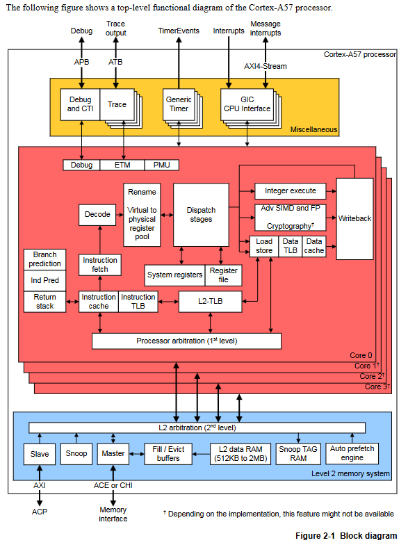

*图 4：Arm TRM 展示四颗核心、共享 L2、Snoop Control Unit 与外部接口。网页正式图注说明来源；Tegra X1 采用最大 2 MB L2 选项。*

### 体系结构视角：总窗口与“随时可选的工作”不是一回事

ROB/Bundle Buffer 决定最多能保留多少未退休工作，Physical Register 决定能容纳多少新结果，Scheduler 和 Load/Store Queue 则决定其中多少工作能等待并在条件满足时被唤醒。A57 的总在途规模并不小，但多数 Scheduler 只有八项，程序很可能先在局部队列遇到 Full。

因此“约 128 条在途”不能直接等价为能隐藏 128 条指令距离的 Cache Miss。判断有效窗口应同时看 ROB/Bundle、Rename Stall、各 Scheduler Full、Load/Store Queue Full 与 Ready-but-not-issued 周期。

## 分支预测：适合低功耗核，但不追求桌面级长历史

预测得快且准，既能保持流水线供给，也能减少错误路径的能耗。预测器本身又占面积与功耗，A57 因 Speculation Distance 和 Core Throughput 都低于桌面核心，采用了较克制的方案。

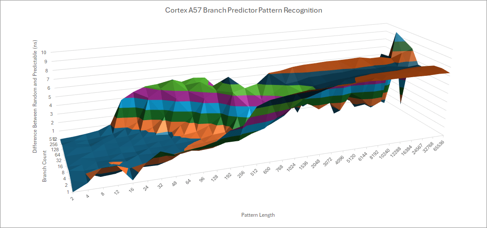

*图 5：测试逐步增加 Pattern Length 和活跃 Branch 数。A57 使用 Global History，但无法稳定识别桌面预测器可处理的极长模式；曲面还混合 Capacity 与 Aliasing，不能反推唯一表结构。*

Global History 意味着当前 Branch 的预测会参考此前其他 Branch 的行为，而不只看它自己的局部轨迹。覆盖能力不算激进，但对低功耗设计已经合理，避免为边际收益付出过多 SRAM 与访问能量。

目标侧是两级 BTB：L1 为 64 项，命中 Taken Branch 产生一周期延迟；L2 约 2048～4096 项，命中为两周期。

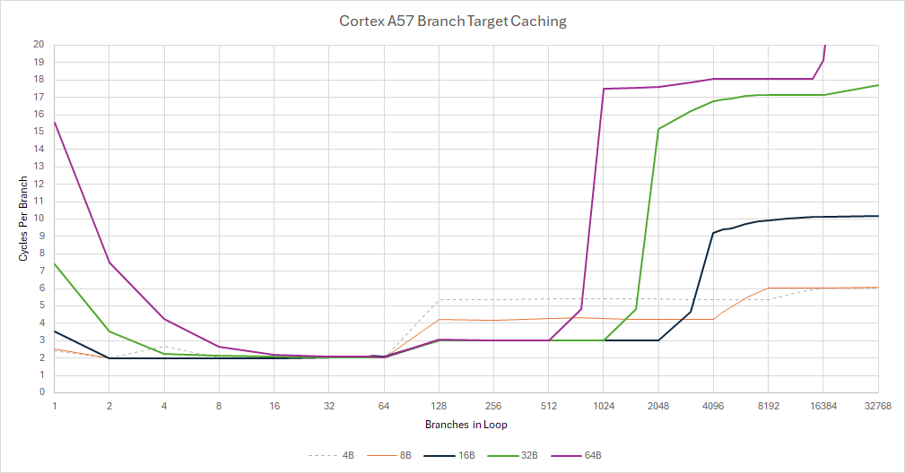

*图 6：不同 Branch Spacing 的延迟曲线显示 64 项快速层和更大的第二层。测试越过 L1I 后延迟陡增，说明 L2 BTB 的有效访问或目标供给与 L1I 路径紧密耦合。*

Indirect Branch 可能从同一 PC 跳往多个地址，常见于面向对象语言的 Virtual Dispatch。A57 对单一 Indirect Branch 最多可跟踪 16 个 Target；用 64 个 Branch、每个在两个 Target 间交替时，总共 128 个 Target 仍没有明显惩罚。Arm Slide 暗示 Indirect Predictor 为 512 项。

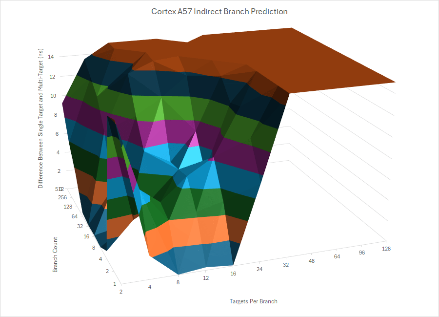

*图 7：纵轴为平均周期，两个维度分别扩大每 Branch 的 Target 数和活跃 Branch 数。低延迟区域支持“单 Branch 约 16 Target、总计至少 128 Target”的观察，不等于确认 512 项的精确组织。*

Return 是间接跳转的特殊情形。Call 时压入下一条指令地址，Return 时弹出，通常由 Return Address Stack（RAS）处理。A57 测试不像其他核心那样有清晰断崖，但约 32 层附近存在拐点，因此只能推测 RAS 约 32 项。

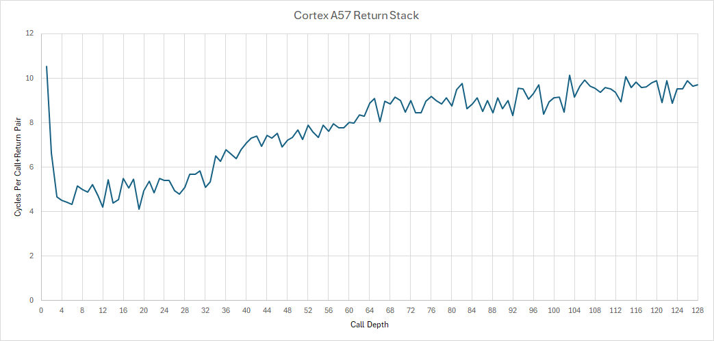

*图 8：曲线在约 32 次嵌套调用后总体抬升，但噪声较大。32-entry RAS 是对拐点的解释，并非 Arm 明示规格。*

### 体系结构视角：低功耗预测器追求的是“足够远”

更长历史、更大 BTB 与更多 Indirect Target 都可能降低 MPKI，却也延长访问或增加每次 Fetch 的能耗。A57 的后端宽度、频率和窗口限制了它从极致预测精度中可获得的收益，64-entry Fast BTB 加较大慢表是一种典型层级化取舍。

验证应把 Direction Mispredict、L1/L2 BTB Hit、Indirect Target Miss、RAS Overflow 与 L1I Miss 分离。图 6 越过 L1I 后的陡升提醒我们：Target Metadata 有容量，不代表对应代码字节也能及时抵达。

## 取指、译码与重命名

前端先查询 48 KB、三路组相联 L1I。Data 可选每 4 B 一组 Parity，Tag 可选每 36 bit 一组 Parity；发现错误后失效对应 Line，再从 L2 重载。地址翻译由 48 项全相联 iTLB 完成。

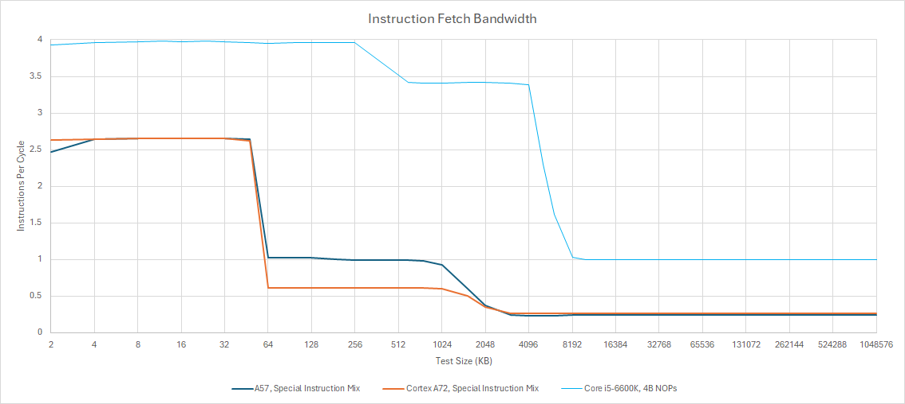

*图 9：L1I 内 A57 可接近三 IPC；Miss 后向 L2 发 Fill，并顺带 Prefetch 下一条 Sequential Line，但 L2 代码吞吐只有约一 IPC。它落后桌面核和新一代 Arm 核，却意外优于 A72。A57/A72 的 48 KB L1I 比常见 32 KB 更能减少 Miss。*

取回的指令进入 32-entry Buffer，再译为 Micro-op。Decoder 同时完成 Register Rename，消除 Write-after-write（WAW）假依赖；但不像同期 x86 或现代 Arm，它既不做 Move Elimination，也不会用 Zeroing Idiom 打断旧依赖。

### 体系结构视角：前端宽度只有在代码字节持续到达时才有意义

三宽 Decode 的峰值存在于 L1I Hit。越过 48 KB 后，约一 IPC 的 L2 Fetch 会直接把后端压到三分之一供给；32-entry Buffer 只能平滑短抖动，无法覆盖持续带宽不足。

可通过相同 Loop 改变 Footprint、Branch Density 和布局，再联看 Fetch Queue Empty、L1I Refill、iTLB Refill 与 Decode Utilization。若 Decoder 空闲而 Queue 也空，增加后端端口不会改善性能。

## 乱序引擎：40 个 Bundle 与特殊的容量计数

A57 最多保留 40 个 Instruction Bundle。Bundle 可包含多条指令，但 NOP 是例外：一条 NOP 就占一整个 Bundle，所以用 NOP 做朴素 ROB 测试只会得到 40；至少八条 Integer Add 或 128-bit Vector Math 可以装进同一 Bundle。Memory Access 与 Branch 也像 NOP 一样独占 Bundle。

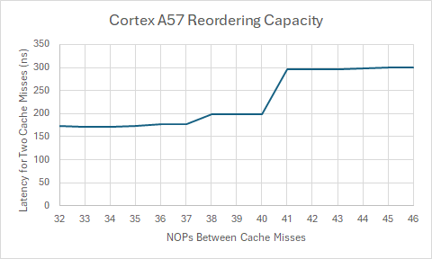

*图 10：采用 Henry Wong 方法，让 Pointer-chasing Load 阻塞并增加中间 NOP。约 40 附近出现台阶；横轴包含 Pointer-chasing Load。它测得的是 Bundle 占用规律，不是固定“40 条指令 ROB”。网页正式图注保留了这一口径。*

### 统一 Register File

多数 CPU 把低延迟 Integer Register 与更宽 FP/Vector Register 分开；A57 却用 128 项 32-bit Entry 统一承载。32-bit Integer Code 最占优势，64-bit Value 要两项，128-bit Vector 要四项，FP 与整数还会竞争同一总容量。

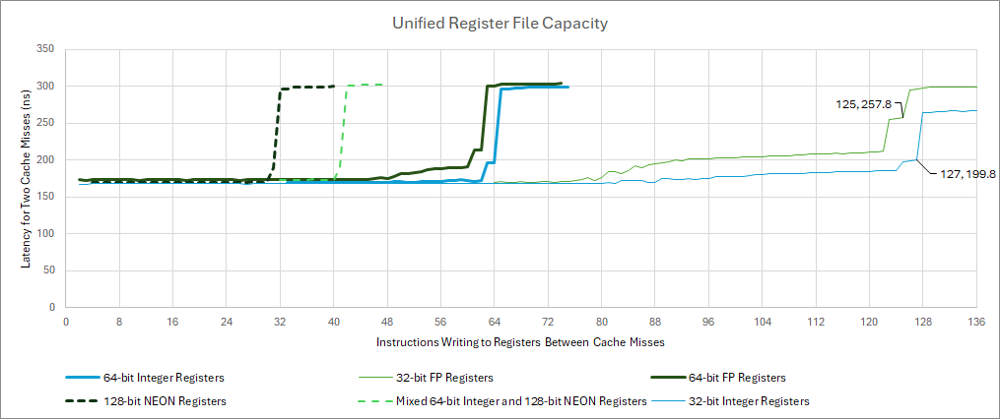

*图 11：32-bit 测试接近统一 Register File 的最大容量；Bundle 容量、Architectural Register 和测试中的阻塞指令共同决定最终拐点，图上约 108/109 一类可见值不能直接写成物理 Entry 总数。网页正式图注说明 32-bit Value 可获得最大重排序容量。*

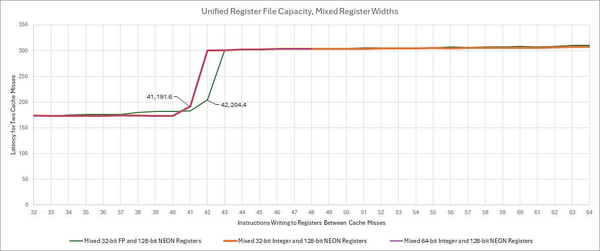

*图 12：32-bit、64-bit 与 128-bit Result 逐步消耗更多 32-bit Entry，混合宽度也会改变台阶。64-bit 容量尚可，128-bit Vector 很快变紧。*

混合不同宽度时，可用容量还会略微偏离理想的 128 项换算。较合理的解释是，多项 Entry 拼成宽 Value 时存在类似 GPU Register File 的 Alignment/Contiguity 限制。

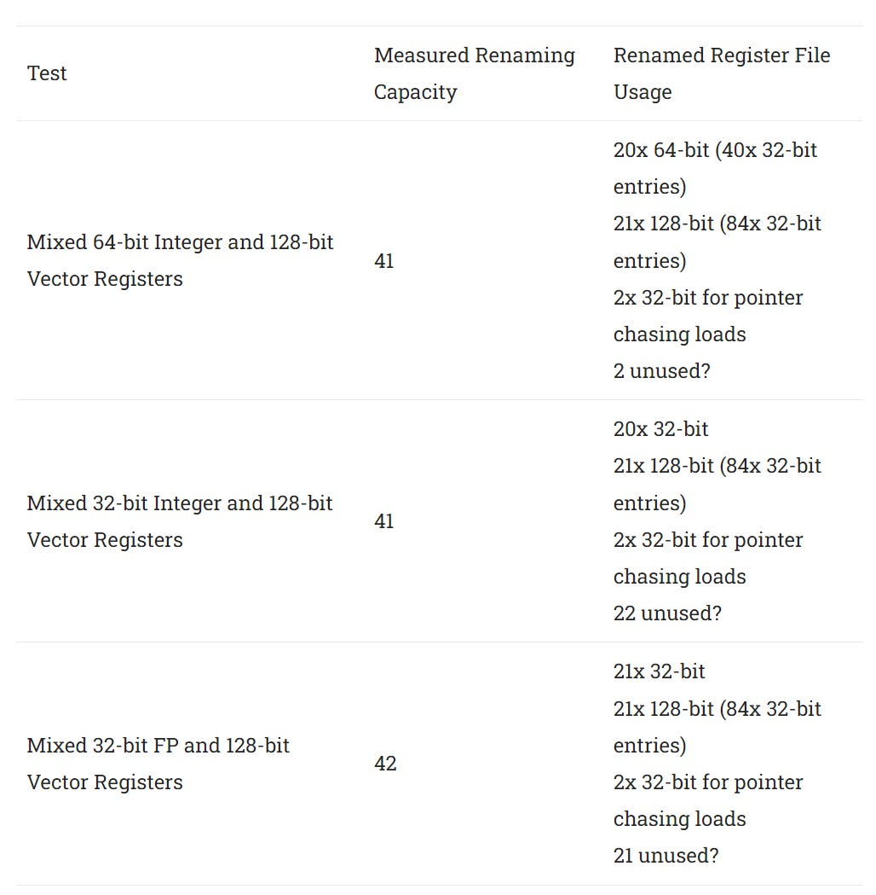

*图 13：表格列出若干 32/64/128-bit 混合测试的可见 Rename 容量，并以 32-bit Entry 分配示意说明：空闲总数足够时，也可能找不到连续、对齐的四项来放 128-bit Value。这是基于现象的推测，不是 RTL 确认。*

退休时，结果从 Renamed Register File 复制到独立 Architectural Register File（ARF）。它类似 Intel P6：退休即可释放 Rename Entry，异常恢复也能从集中保存的已提交状态开始；代价是额外数据搬运与功耗。Intel 在 Sandy Bridge 转向 Physical Register File（PRF），Arm 到 A73 也采用类似变化。A72 可能仍接近 A57，但当时云实例测试时间有限，数据不足以确认。

### 体系结构视角：统一寄存器文件把面积效率变成动态容量

统一 SRAM 避免“整数空着、向量却满了”的固定分区浪费，32-bit 工作负载尤其受益；可变宽分配也引入碎片和端口压力。其容量不再只是一个 Entry 数，而取决于动态指令的结果宽度组合。

验证应分别生成 32/64/128-bit Destination，并控制 Bundle 类型、Architectural Live Register 与 Dependency。宽度混合后出现非线性下降，才支持 Alignment/Fragmentation 假说；只有 RTL 的 Free-list、Allocation Mask 与 Bank Select 才能确认具体规则。

### 分布式 Scheduler

A57 以小型专用 Scheduler 驱动不同执行单元。多数是八项；Branch Scheduler 为 12 项，两条 Load/Store AGU 共用 16-entry Scheduling Queue。实际程序很可能在 Register File 或 40 Bundle 填满前，先撞上局部调度容量。

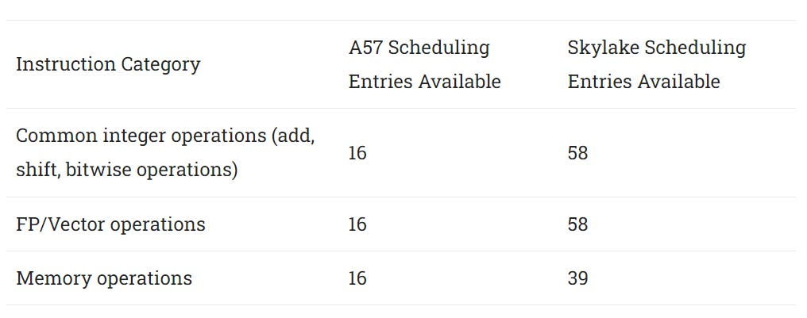

*图 14：Common Integer、Shift/Bitwise、FP/Vector、Memory 等测试下，A57 可见调度项远少于 Skylake。表格把 A57 的分布式队列与 Skylake 更大的窗口作结构性对照，不代表两者指令映射完全等价。*

### 整数执行

两条 Integer Pipeline 处理常见操作；Multiply 等多周期整数指令进入独立 Pipe，64-bit Result 延迟五周期；Branch 也有专用 Port，以尽早 Resolution、缩短误预测损失。

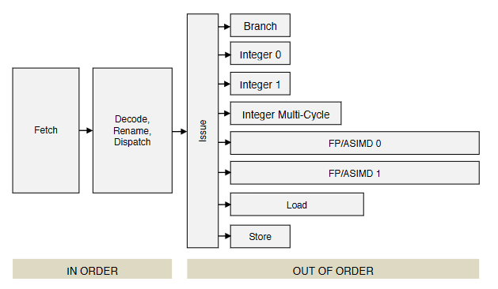

*图 15：Optimization Guide 中 Decode/Rename/Dispatch 之后分别连接 Branch、两条 Common Integer、一条 Multi-cycle、两条 FP/ASIMD、Load 与 Store。网页正式图注说明图片来源。*

理论上每周期可执行四个 Integer Operation；实际上 Branch 和 Multi-cycle Operation 远少于简单 ALU，四路同时占满并不常见。

### FP 与 Vector

两条 FP/Vector Port 各由八项 Scheduler 供给。Optimization Guide 暗示两边都能做基本 FP Add/Multiply，但微基准无法达到每周期两条 Scalar FP；128-bit Packed FP 也只有每周期一条。因此总数据宽度确有 128 bit，指令吞吐却不是两条。

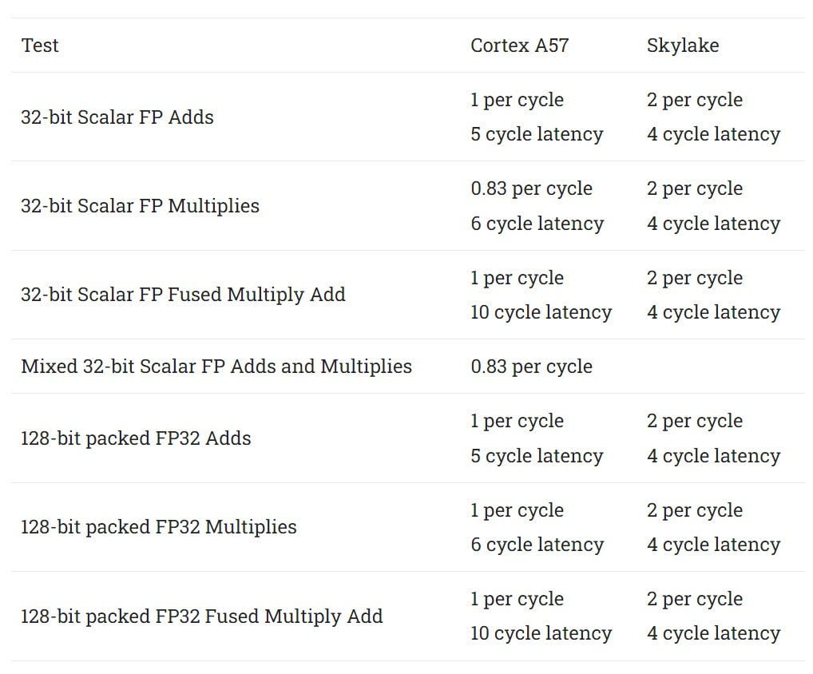

*图 16：A57 的 Scalar FP32 Add/Multiply 约一条每周期，128-bit Packed FP 也约一条；FMLA/FMAD 可每周期一条、借一次指令完成乘加而翻倍运算量，却有高达十周期延迟。Vector Integer Add 为三周期，Multiply 四周期；128-bit Packed Integer Multiply 只走第一条 FP Pipe，每两周期一条。*

### 体系结构视角：峰值 FLOPS 与依赖链性能可以朝相反方向变化

FMA 每拍一条使理论 FLOPS 很好看，十周期 Dependency Latency 却要求至少十条独立链才能喂满；A57 每个 FP Scheduler 只有八项，真实代码还要与其他操作共享窗口。吞吐和延迟之间的裂缝因此很难靠乱序完全填平。

应同时测试单依赖链、多独立 Accumulator 和混合 Load/FP。若纯独立 FMA 接近峰值、真实 Kernel 仍低，需继续看 Scheduler Occupancy、Register Pressure 与 L1D Refill，而非简单归因于 FPU 不够宽。

## Load/Store：一条 Load、一条 Store，不做内存依赖预测

两条 Memory Pipeline 分别处理 Load 与 Store。最多 32 个 Load、12 个 Store 在途；若目标是约 128 条在途指令，12-entry Store Queue 覆盖窗口的比例甚至低于 Zen 4，可能很早限制重排序。

A57 不像新 Arm 核或同期桌面 CPU 那样预测 Load 是否独立于旧 Store。只要更老 Store 的地址尚未解析，年轻 Load 就等待，从根源上避免违反依赖后的 Replay，但牺牲了绕过慢 Store Address 的机会。

Store-to-load Forwarding 通常约七周期。若 Load 与 16 B 对齐的 Store 部分重叠，延迟约翻倍；除此之外没有突出的超慢路径。

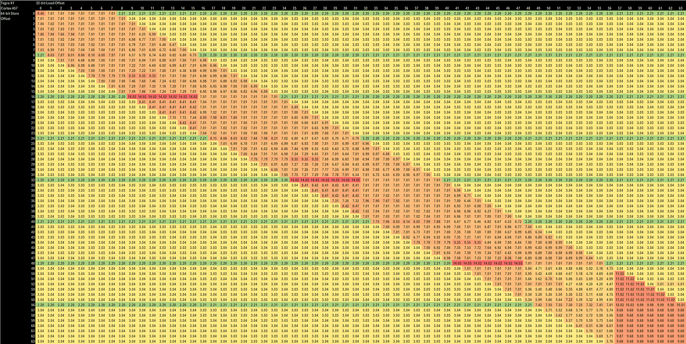

*图 17：采用 Henry Wong 方法扫描 Load/Store Offset。大片常规区域约七周期，部分重叠形成约十四周期斜带。网页正式图注说明测试方法来源。*

A57 以 32-entry 全相联 dTLB 把程序可见 48-bit Virtual Address 转为 44-bit Physical Address；4 KB Page 下覆盖 128 KB。L1 Miss 由统一 1024-entry、四路 L2 TLB 接住，后者也处理 iTLB Miss。44-bit Physical Address 可覆盖 16 TB，反映 A57 同时瞄准 Client 与 Server；后来的 X2 反而只支持 40 bit，把更大物理地址留给 Neoverse。

### 体系结构视角：保守内存排序省掉恢复，也压缩有效窗口

Memory Dependency Predictor 允许年轻 Load 猜测绕过未知 Store，猜错再重放。A57 选择地址全部解析后才放行，硬件更简单、恢复能耗更低；只要一个旧 Store 的地址链很长，后面即便是完全独立的 Load 也无法利用 32-entry Queue。

可构造“旧 Store 地址慢、年轻 Load 地址已知”的 Test，分别让地址重叠和不重叠；如果两者都等待到旧地址解析，便符合保守策略。验证还应区分 Store Queue Full、Unknown-address Stall 与真正 Forwarding Latency。

## Cache 与 TLB 延迟：A57 最严重的短板

L1D 为 32 KB、两路组相联，可选每 4 B 一组 ECC。简单 Load 一般四周期，Indexed Addressing 五周期。使用 4 KB Page 时，Working Set 仅 12 KB 就出现约 16 周期尖峰；改用 Huge Page 后尖峰消失。按 32-entry dTLB 计算，12 KB 本应远在 128 KB Coverage 内，因而这是一个无法用名义容量解释的异常负面结果。

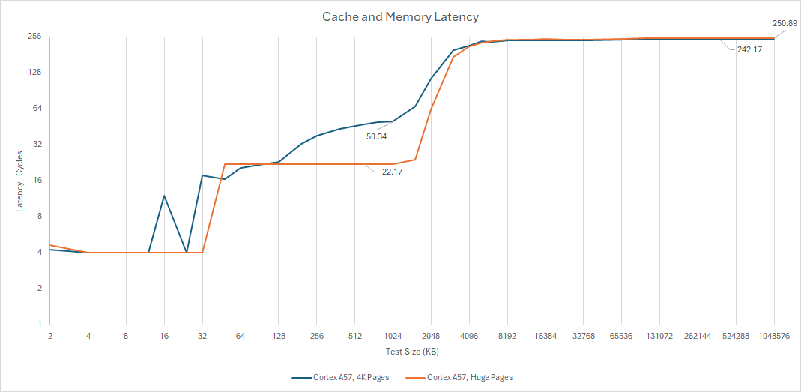

*图 18：4 KB Page 曲线在很小 Footprint 就多次抬升，Huge Page 则保持平滑。测试可以确认地址转换参与了慢路，却不足以解释为何名义 Coverage 尚未耗尽便发生 L1 dTLB Miss。*

L1 Miss 进入四核共享 2 MB L2。Data/Tag 都强制 ECC；Random Replacement 省掉 LRU Metadata，但可能逐出次优 Line。Arm 允许在较大 L2 前后增加 Register Slice 以守住频率，无法确认 Nvidia 采用哪一档。实测 L2 Load-to-use 约 22 周期；叠加 L2 TLB 后超过 50 周期，DRAM 约 250 周期。

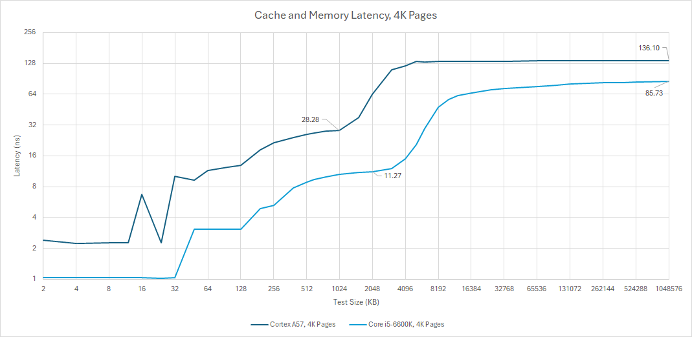

*图 19：A57 的 32 KB L1D、2 MB L2 和 DRAM 形成高台阶；近同期 i5-6600K 的 6 MB LLC 约 11.2 ns，其中还包括取得 L2 TLB Translation 的若干周期。平台、频率与内存类型不同，对照用于展示量级。*

Switch 的 LPDDR4 面向高带宽、低功耗设备，可能贡献了比桌面 DDR4 更高的延迟；但 TLB 与共享 L2 的慢路同样重要，不能把所有问题推给 DRAM。

### 体系结构视角：名义 TLB 容量无法保证低转换延迟

32-entry L1 与 1024-entry L2 看起来并不小，关键却是有效相联、Page Size、Set/Bank 冲突、Walk Cache 以及 Hit Pipeline。A57 在 12 KB 就出现的尖峰说明“容量乘页大小”只是上界，不能替代实际 Latency Curve。

进一步验证需要固定 Physical Coloring、访问步长和 Page Placement，分别测 L1/L2 TLB Hit 与 Page Walk，并读取 dTLB Refill/Walk Cycle。如果无法控制 OS 分配，结论应保持为“地址转换相关异常”，而不是猜出某种具体 TLB Bug。

## 核间延迟：一致性可用，但并不快

多核必须保持一致的 Memory View。A57 的 L2 严格 Inclusive 于各核 L1D，并保存 L1D Tag 的 Duplicate Copy。测试以 `__sync_bool_compare_and_swap` 在两核之间往返同一 Value，观察 Cache Line 所有权转移。

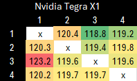

*图 20：矩阵约为 118.8～123.2 ns，对角线不测。四核都在同一 Cluster，结果却仍有少量拓扑差异。*

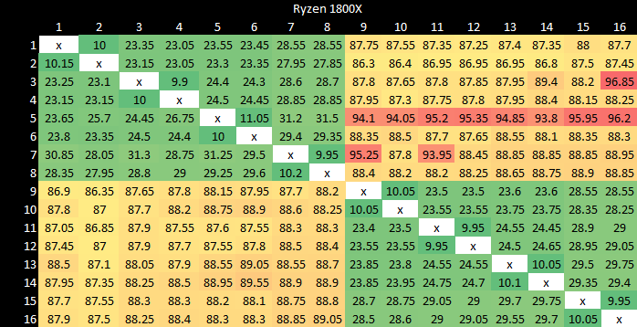

*图 21：Ryzen 1800X 跨 CCX 的矩阵也常低于 Tegra X1 同 Cluster 结果。平台和同步原语环境不同，只能说明 A57 路径不算紧凑。*

良好并行程序会尽量避免多个核心反复写同一 Cache Line，因此这一延迟对多数应用影响有限；不能由单项 Ping-pong 测试推断所有多核负载都慢。

### 体系结构视角：核间延迟是所有权协议的往返，不只是导线长度

一次 Atomic Ping-pong 可能包含请求、Directory/Tag 查询、Snoop、旧 Owner 响应、Line 转移、权限确认和原子操作，若干阶段会落入关键路径。Inclusive L2 的 Duplicate Tag 有助于定位 L1 Copy，却不保证整个协议很短。

应区分 Read Sharing、Write Ownership Transfer、Atomic RMW 与 False Sharing，并同步观察 Snoop、Retry 和 Fabric Queue。只有不同模式都慢，才有理由把问题扩大到一致性路径本身。

## 带宽：L1 尚可，L2 与 DRAM 明显不足

L1D 每周期可服务一条 Load 和一条 Store。按 128-bit Vector Load、1.78 GHz 计算，读取约 28 GB/s。奇怪的是 16 KB 后带宽就下降；Huge Page 会消除这一凹陷，与延迟测试一样指向地址转换问题，A72 也观察到类似现象。

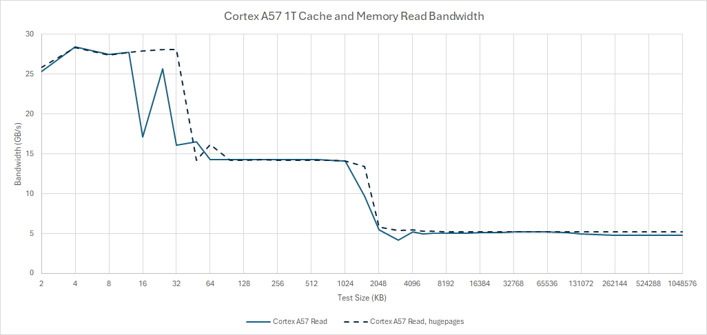

*图 22：Huge Page 曲线在 L1D 范围维持峰值，4 KB Page 很早跌落。它再次证明慢路与 Translation 有关，却没有解释具体内部原因。*

Tegra X1 的共享 L2 为 2 MB、16 路。Tag 分两 Bank，每拍可接两个 Request；每个 Tag Bank 覆盖四个 Data Bank。单核大约可获得 8 B/cycle Read Bandwidth。

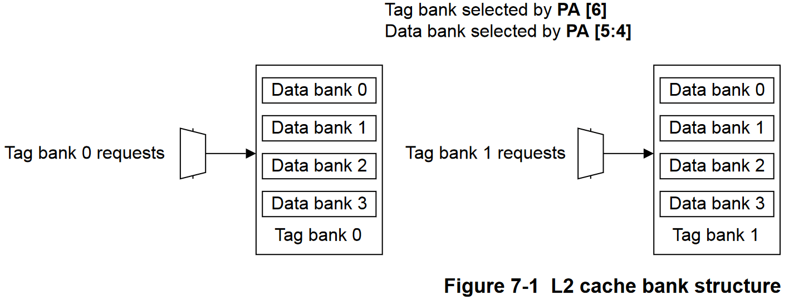

*图 23：两组 Tag Bank 各连接四个 Data Bank。Banking 让两个核心同时运行时带宽明显增加，但并不等同于四核线性扩展。*

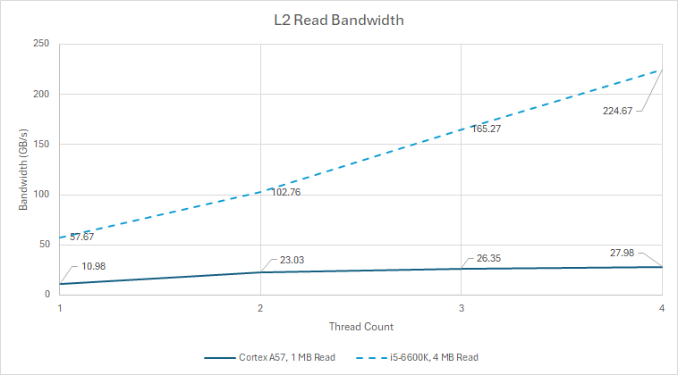

*图 24：A57 单核约 7.09 GB/s、四核约 27.98 GB/s；i5-6600K 的 L3 随线程增加至约 110.57、236.47 GB/s。频率、Cache Level 与测试平台不同，绝对 GB/s 不表示同类结构效率。*

Skylake 的 LLC Bank 数随核心数扩展，单颗 Skylake 核心就能超过 Tegra X1 四颗 A57 的 Cache Bandwidth。按每周期看，四核 Skylake 略高于 62 B/cycle，A57 L2 约 15.72 B/cycle。

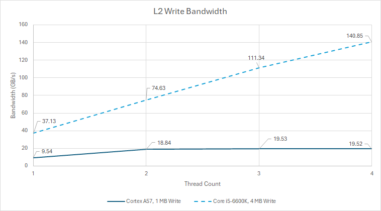

*图 25：A57 L2 写带宽略低于读带宽，可能包含 Read-for-ownership（RFO）开销；Skylake 依然大幅领先。*

Tegra X1 LPDDR4 理论 25.6 GB/s，CPU 实测不到 30%，两到三核后便停止增长，峰值低于 8 GB/s。

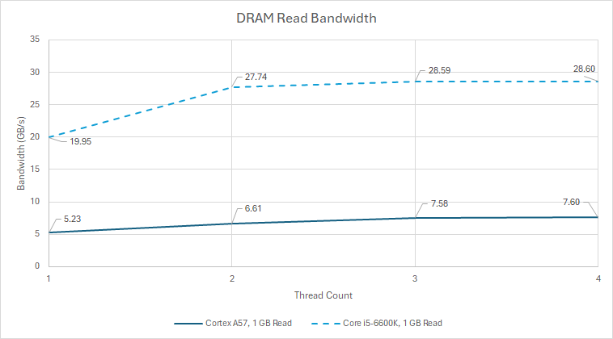

*图 26：A57 从单核约 3.43 GB/s 增至四核约 7.55 GB/s；i5-6600K 的双通道 DDR4-2133 实测 28.6 GB/s，约为理论 34.1 GB/s 的 83%。Skylake 的 DRAM Bandwidth 甚至高于 A57 的共享 L2。*

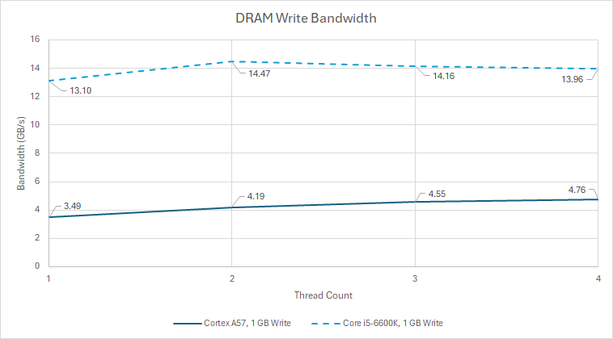

*图 27：Write 结果延续相同趋势，A57 远低于 Skylake，增加核心数也很快饱和。*

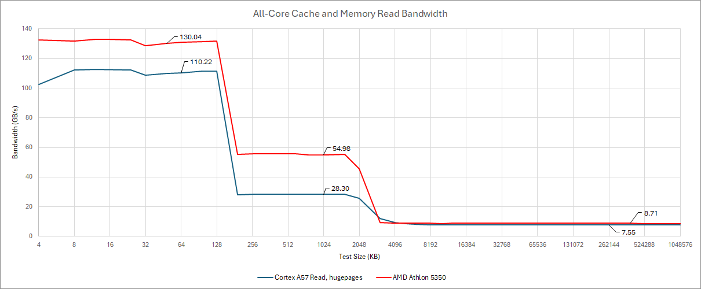

*图 28：Jaguar 同样拥有 2 MB Shared L2，却约有 A57 两倍 L2 Bandwidth。Tegra X1 使用更现代的 64-bit LPDDR4，A57 CPU 侧仍未超过 Jaguar 的 Single-channel DDR3。网页正式图注感谢 agent_x007 提供 Jaguar 数据。*

### 体系结构视角：理论 DRAM 带宽不等于 CPU 可获得带宽

25.6 GB/s 描述 Memory Controller/Pin 的峰值。CPU Request 还要经过 L2 Miss Handling、Cluster Interface、Interconnect、控制器队列与 LPDDR 时序；GPU 等其他 Client 的设计优先级也会影响路径。Tegra X1 强调 GPU，CPU 只拿到不到 8 GB/s 并不矛盾。

要定位限制，需要同时报告每核 Outstanding Miss、L2 Pending Fill、Fabric Request、DRAM Channel Utilization 与读写比例。两三核后平台化说明某个共享环节饱和，但仅凭图 26 不能判断是 L2 MSHR、Bridge 还是 Controller。

## 轻量 Benchmark：三宽 A57 与两宽 A73 接近

对比选择后继 Cortex-A73，而不是结果显而易见的 Skylake。A73 只有两宽、同样有小 Scheduler，持续吞吐理论上不及三宽 A57，但频率更高，为 2.2 GHz。

测试包括 7-Zip 压缩 2.67 GB 大文件，以及 libx264 把 4K Video 转为 720p。网页没有给出版本、命令行、输入文件编码参数和运行统计，因此只能按这次端到端结果讨论。

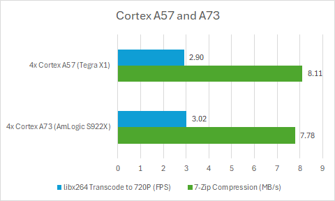

*图 29：A57 压缩约 8.11 MB/s，A73 约 7.78 MB/s；libx264 中 A57 约 2.90 FPS，A73 约 3.02 FPS。各自胜负都不到 5%，三宽低频与两宽高频形成接近结果。*

A73 不只改变宽度。它的 Predictor 更强：7-Zip、libx264 每指令 Mispredict 分别降低约 20% 和 27%，因而更少在错误路径浪费时间和能量。

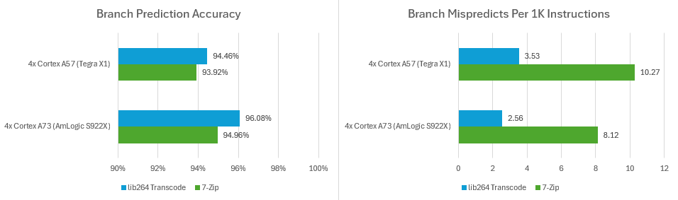

*图 30：A57 只有 Execute-stage Branch/Mispredict 事件，A73 才有 Retired 口径。这里选择最接近的 PMU Event 作粗略对比，不能把柱值视为完全同定义。*

A73 虽失去一条 Decode Width，却把 L1I 增至 64 KB。libx264 每指令 I-cache Miss 降低 53%，也减少从 L2 搬指令字节的能耗。7-Zip 同样受益，只是 A57 的 48 KB 已基本够用。

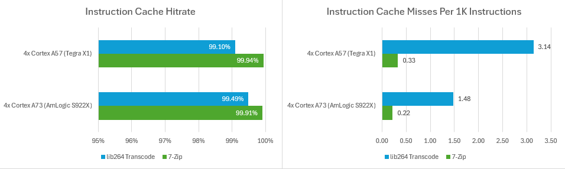

*图 31：libx264 上 A73 的 I-cache Refill 明显低于 A57；7-Zip 差距较小。图中归一化事件仍受 PMU 定义和平台环境限制。*

数据侧变化不大：两者都是 32 KB L1D，Hit Rate 接近；两个程序都有不少 L1D Refill，libx264 更严重。

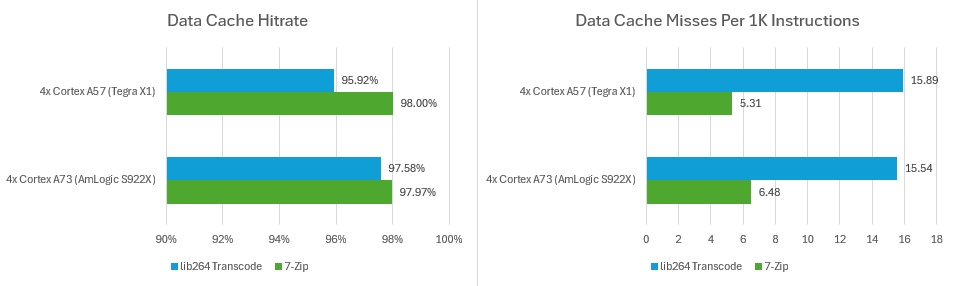

*图 32：左图比较 Hit Rate，右图给每千指令 Refill。A57/A73 容量相同，但实际 Miss 还受相联、替换、Prefetch 与代码行为影响。*

L2 事件最难比较。两边都使用 `l2d_cache_refill`，A73 计出的 L2 Data Refill 甚至多于 L1D Refill，可能包含很积极的 L2 Prefetch，因而不能解释为普通 Demand Miss。

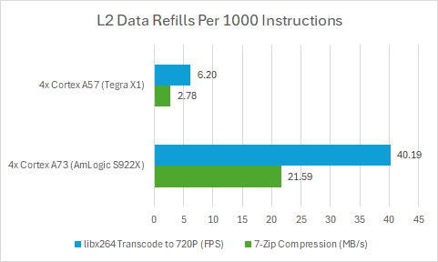

*图 33：A73 的 7-Zip/libx264 值约 21.59/40.19，A57 约 2.78/6.20；反常数量关系说明两核事件语义不等价，不能据此说 A73 的 L2 命中更差。*

A57 的 L2 Prefetcher 在一次 Miss 后最多产生八个 Prefetch，但都不能跨越同一 4 KB Page。A73 TRM 没说明激进程度；它可支持 48 个 Pending Fill，A57 最多 20 个，更多 Memory-level Parallelism（MLP）可能帮助 A73 用较小的 1 MB L2 抵消容量劣势。

### 体系结构视角：宽度只是 IPC 方程的一项

三宽 A57 在 7-Zip 略胜，两宽 A73 在 libx264 略胜，说明实际性能由预测准确率、L1I 容量、执行延迟、调度窗口、MLP 与频率共同决定。减少一次前端 Miss，可能比增加一条理论发射槽更有价值。

PMU 比较尤其要先核事件定义。Execute-stage Branch 会包含错误路径，Retired Branch 不会；Prefetch Fill 可能被算入 Refill，也可能不算。事件名相似并不足以保证分母、投机层级和触发点相同。

## 最后的评价：核心尚可，存储系统拖了后腿

单独看 A57，它是一颗合格的同期低功耗核心：32-bit Integer Rename Capacity 很好，分支预测够用。后端弱点是 FP Latency 高、Scheduler 小、Store Queue 只有 12 项；这些限制在其他低功耗设计中也常见。

真正严重的是 Memory Subsystem。32 KB Private L1D 加 2 MB Shared LLC 在纸面上很正常，Jaguar 也采用相似层级；A57 却在名义 128 KB dTLB Coverage 内出现无法解释的 L1 dTLB Miss，1024-entry L2 TLB 又会额外增加二十多个周期——多数 CPU 的二级 TLB Hit 不到十周期。共享 L2 与系统内存带宽也都偏低。

作为当年的手机/平板低功耗核心，A57 可以接受，后续制程进步也让 Arm 有空间把更复杂的结构塞进几瓦功耗。作为 Nintendo Switch 的 CPU，它却很弱，无法和当时已经不新的桌面核心相比。

现代游戏仍能移植到 Switch，背后需要大量针对性优化。《Hogwarts Legacy》Switch 版比 PC 初版晚约九个月，画面与关卡组织的调整甚至让它接近另一款游戏。

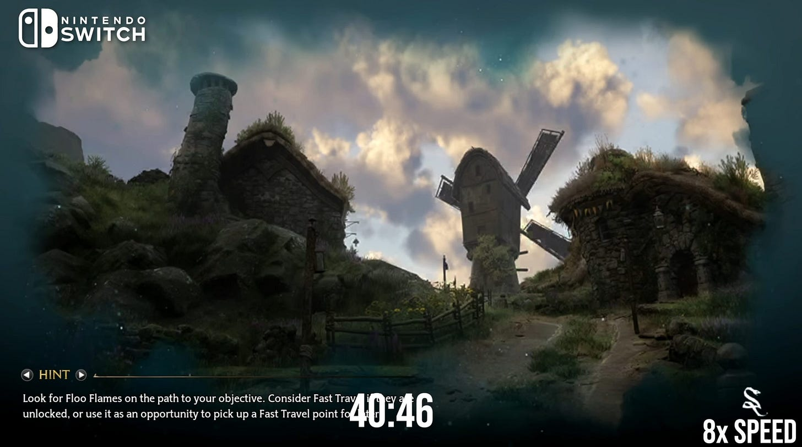

*图 34：截图来自 Digital Foundry 的 Switch Port 分析；部分新增 Loading Screen 超过 40 秒。网页正式图注用它说明：开发者通过分区加载等手段，把超出 CPU/内存能力的工作重塑为可运行版本。*

能让这类游戏运行本身已经令人惊讶。类似的可伸缩优化也可能让使用旧 CPU 或集成显卡、预算有限的玩家接触现代游戏；只是这种成果来自软件大量重构，不能反过来证明硬件瓶颈并不重要。

### 体系结构视角：从 A57 可以看到的七点认识

第一，较大的总窗口掩盖不了局部队列短板。40 Bundle 和灵活 Rename 让 A57 看似能容纳很多工作，八项 Scheduler 与 12-entry Store Queue 却可能更早产生 Backpressure。

第二，统一 Register File 是面积效率很高、行为却依赖 Workload 的设计。32-bit Code 受益最大，128-bit Vector 既消耗四倍 Entry，又可能遇到对齐碎片。

第三，保守 Memory Ordering 用性能换简单恢复。不预测 Load/Store Independence 可以避免 Replay，却会让一个未知 Store Address 阻塞大量本可独立的 Load。

第四，TLB 不能只看 Entry Count。32/1024 项的层级在纸面上足够，12 KB 异常和五十多周期慢路却证明 Pipeline、有效映射与实现细节同样关键。

第五，SoC 目标会重塑 CPU 可见性能。Tegra X1 为 GPU-heavy Mobile Device 设计，25.6 GB/s LPDDR4 只有不到 8 GB/s 被 CPU 取得；这既不是 A57 ALU 的属性，也不是 Pin Bandwidth 的简单比例。

第六，后继核心可以用“变窄”换来整体进步。A73 的两宽没有阻止它凭更强预测、更大 L1I、更多 Pending Fill 和更高频率追平三宽 A57。

第七，游戏机性能是软硬件共同形成的预算。Switch Port 用加载画面、资源重排和大量优化绕开 A57 的长延迟与低带宽；它展示了软件工程的力量，也展示了硬件约束如何渗透到用户体验。

## 参考资料

- Chips and Cheese：[*Cortex A57, Nintendo Switch’s CPU*](https://chipsandcheese.com/p/cortex-a57-nintendo-switchs-cpu)
- Henry Wong：[*Measuring Reorder Buffer Capacity*](https://blog.stuffedcow.net/2013/05/measuring-rob-capacity/)
- Henry Wong：[*Store-to-Load Forwarding and Memory Disambiguation in x86 Processors*](https://blog.stuffedcow.net/2014/01/x86-memory-disambiguation/)
- Digital Foundry：Switch 版 *Hogwarts Legacy* 技术分析（正文图中援引）
