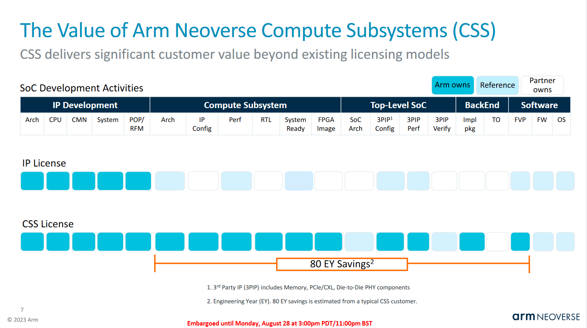
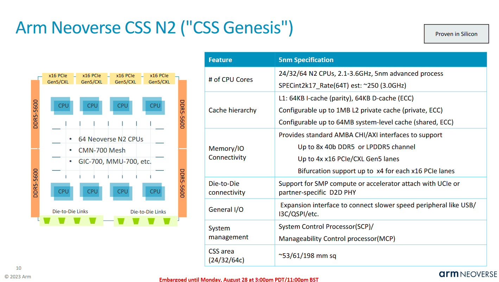
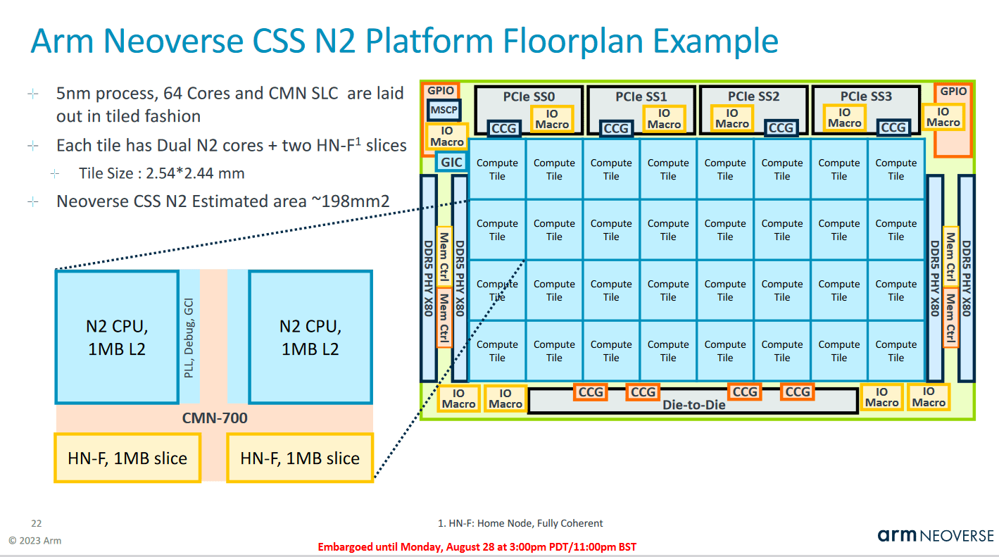
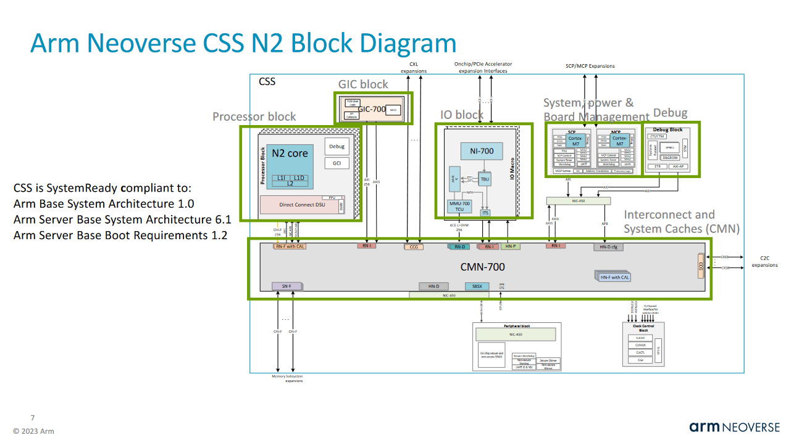
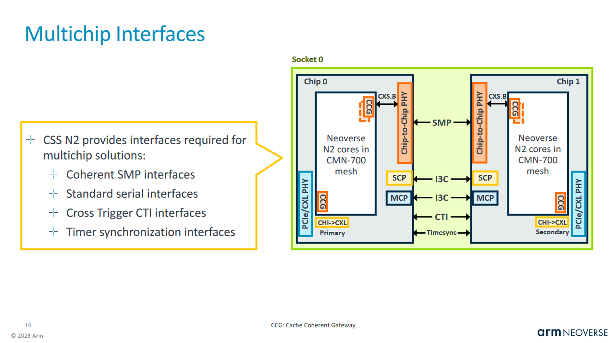
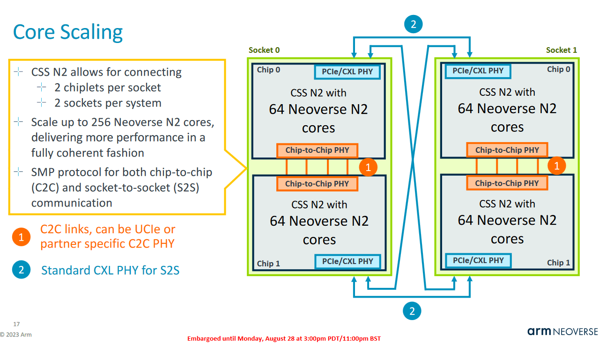
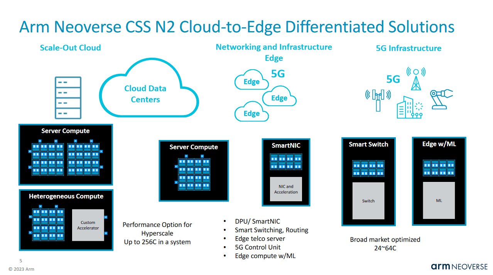
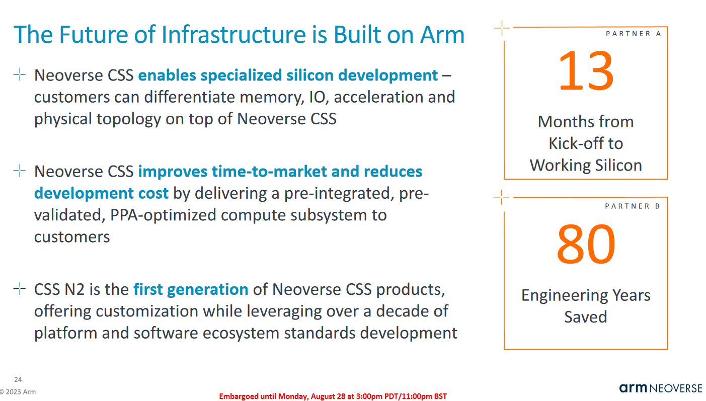

# Arm CSS-Genesis：从授权核心走向预集成计算子系统

> 英文标题：Arm at HC35 (2023): CSS-Genesis
> 撰文：Chester Lam
> 首发：Chips and Cheese，2023 年 9 月 13 日
> 链接：https://chipsandcheese.com/p/arm-at-hc35-2023-css-genesis

Arm 不只提供 Cortex/Neoverse 核心，还提供 DSU-110、CMN-700 互连、MMU-700 外设地址翻译和 GIC-700 中断控制器。但客户仍要选择、配置、连接和验证这些模块；相比 AMD/Intel 的成品芯片与平台，传统 Arm IP 模式往往需要更长落地周期。Neoverse N2 在 2021 年 4 月发布，直到阿里云倚天 710 才出现已知实体实现，就是一个例子。

Hot Chips 35 展示的 CSS-Genesis N2 试图缩短这段距离：Arm 不再只交付零散 IP，而是提供已经组合、验证过的 Compute Subsystem RTL。

## 节省集成与验证时间

Arm 宣称典型客户相对逐块购买并自行组装，可节省 80 Engineer-years，也就是团队累计工程时间。

这不是指项目日历直接缩短 80 年，而是综合 RTL 集成、时钟复位、内存/IO、验证和实现收敛的人力。客户仍要完成自身加速器、封装、板级、固件与产品验证。

CSS-Genesis N2 最多集成 64 个 Neoverse N2、四个 DDR5 Controller 和 64 条 PCIe 5.0 Lane，由 CMN-700 Mesh 相连。Cortex-M7 形式的 SCP/MCP 管理时钟和电压；I/O Block 包含 GIC-700、MMU-700、NI-700 和地址翻译逻辑，便于挂接片上加速器和 PCIe 设备。Arm 已在 TSMC N5 上做物理实现以获取面积和实现特征。

成品既可作为独立 Server CPU，也可嵌入更大的 SoC，与 ML、图像等客户加速器结合。这里交付的是可实现 Subsystem，不是固定封装和整机。

### 体系结构视角：预集成真正出售的是“已验证接口”

CPU 核心性能只是系统的一部分。Mesh 一致性、Interrupt、IOMMU、Clock/Power Domain 和 Reset/错误恢复任何一处集成错误，都可能拖延流片。CSS 把这些跨模块状态空间提前验证，从而减少客户风险；代价是客户在拓扑与第三方 IP 选择上的自由度下降。

## N5 面积与 Bergamo 对照

64 核最大 Cache 配置中，核心、互连与 LLC 估计占 198 mm²。CMN-700 由 32 个 Core Tile 组成，每 Tile 6.2 mm²，包含两个 N2 核和两个 1 MB LLC Slice。

作为尺度参照，Zen 4c 单核约 2.48 mm²；普通 Zen 4 的 8 核、32 MB LLC CCD 约 69.5 mm²。若假定 Bergamo 16 核 CCD 面积相近，则交付 16 核约多用 40% 面积。但 Zen 4c 核心更强、每核 L3 多一倍，而且 AMD CCD 还包含 Die-to-Die Interface 和 Microcontroller；后两项在 CSS 中可能是可选/另计。跨公司图像的边界不同，因此只能说明 CSS 的密度目标，而不能当作同口径面积竞赛。

对能运行 Arm 软件且不需要 Zen 4c 较强单核性能的客户，较小硅片可能带来成本优势。

## Supporting Components 与平台锁定

MMU-700、GIC-700、NIC-450、CMN-700 和 Cortex-M7 都来自 Arm。

预配置减少客户工作，也鼓励整套采用 Arm IP。Server 中 CPU 与互连对性能更关键，这种影响或许有限；若未来扩展到 Mobile CSS，预集成 Mali GPU 可能让 Arm 获得更多 GPU 份额。

## 用双 Die 扩到 128 核

单个 CSS-Genesis N2 上限 64 核，低于 80 核 Ampere Altra，更低于 96/128 核 Zen 4 Server。它支持类似 Magny Cours/Interlagos 的双 Die 一致性，一 Socket 放两颗可到 128 核。

双 Socket 节点可达 256 核，与双路 Bergamo 核心数相当，但不支持超过两 Socket。

核心数相同不代表吞吐相同：Zen 4c 有更大的乱序引擎和更强向量；当时未来 Sierra Forest 预计 144 核/Socket，Ampere Siryn 目标 192 核。

### 体系结构视角：Chiplet 扩展先受到一致性流量约束

多 Die 让核心数增长，却增加远端 LLC/Memory 延迟、Snoop/Directory 流量和 Die-to-Die 功耗。衡量 128 核 CSS 不应只看峰值 Core Count，还要看 NUMA、双 Die Bandwidth、内存通道归属和跨 Die Cacheline 迁移。CSS 提供一致性能力，不等于客户的封装互连自动达到最佳性能。

## 24、32、64 核的市场跨度

CSS-Genesis 提供 24、32、64 核，面向 Server 到 Smart Switch 等市场。

最小 24 核约 53 mm²，可在不需要高 CPU 吞吐时降成本。对 SmartNIC 而言，24 核也可能太多，因为 Packet/Data Path 常由 Dedicated Accelerator 或 FPGA 承担；未来是否提供更低 Core Count 尚未知。

## 结语：Arm 商业模式向成品再走一步

CSS-Genesis 的价值，是让 Start-up 和 Hyperscaler 不必从单个 IP Block 起步。客户可以较快做出差异化 Compute Platform，却仍要与 Bergamo 这类成熟整机平台比较性能、软件、成本和支持。Arm 当时称已有客户，但未公布名称；倚天 710 是否使用该服务只能是推测。

Arm 表示若需求存在会扩展服务。可能方向包括 Neoverse V2、未来核心、更高核心数，甚至 Consumer/IoT；文章也设想 Arm 最终提供 Semi-custom Finished Silicon。但这些都是可能性，不是已公布路线。

CSS-Genesis 让 Arm 从“核心和零件供应商”向“已验证计算子系统供应商”前进一步。它提高了与 AMD/Intel 成品平台竞争的能力，也会改变 Arm 与 Qualcomm 等现有合作伙伴之间的边界。

## 参考资料

- Arm Hot Chips 35 CSS-Genesis N2 演讲与 Briefing
- Chips and Cheese：Arm at HC35 (2023): CSS-Genesis
