# 深入 Neoverse N1：80 核服务器为何单核仍像 Haswell

> **文章来源**
>
> - 文章：*Deep Diving Neoverse N1*
> - 撰文：Chester Lam
> - 首发：Chips and Cheese
> - 发布：2021 年 10 月 22 日
> - 链接：https://chipsandcheese.com/p/deep-diving-neoverse-n1

此前的 N1 与 Zen 2 对比主要追问：性能差异究竟来自 ISA，还是来自微架构。这一次视野扩大到核心内外：Cache、CMN-600 Mesh、TLB、分支预测、重命名与队列容量，再用编译、压缩、渲染、密码学、ChampSim 和视频编码检验这些结构如何落到真实负载。

主要 N1 平台是 80 核 Ampere Altra；Zen 2 包括桌面 Ryzen 9 3950X、Threadripper 3960X 与 Azure 中的 EPYC 7452 VM，另加入 Zen 1/3、Haswell、Skylake、Qualcomm Kryo、Ampere Altra、兆芯、Piledriver 和树莓派等参照。平台跨度很大，图表用于解释结构与场景，不是产品综合排名。

## Cache 与 Mesh：单核不宽，全芯片靠数量

单线程每周期带宽上，Ryzen 9 3950X 在所有存储层级都高于 N1。Zen 2 L2 达 31.59 B/cycle，N1 为 19.28；后者高于 16，暗示接口可能为 32 B 宽，但实现很难接近理论上限。

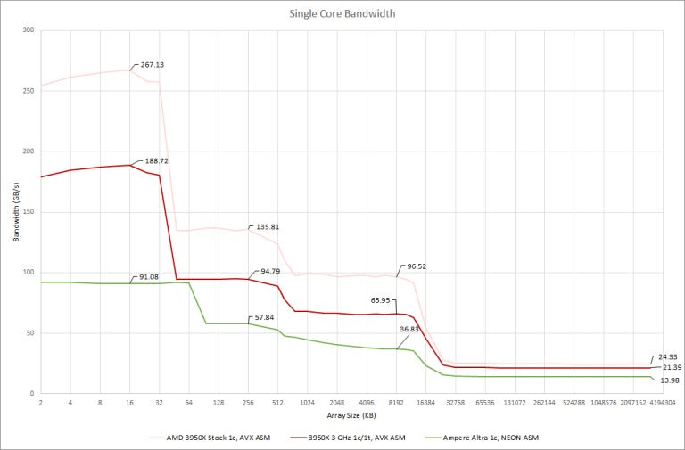

*图 1：Zen 2 的 L2 每周期带宽约 31.59 B，N1 约 19.28；Zen 2 L3 甚至高于 Altra L2。进入 DRAM 后平台通道数、控制器和频率开始主导。*

AMD 把 L3 放得离核心很近并按核心频率运行。Altra 为支撑大单片 80 核，使用约 1.8 GHz CMN-600 Mesh；该互连技术上可达 2 GHz，Ampere 只在后来的 128 核型号达到。

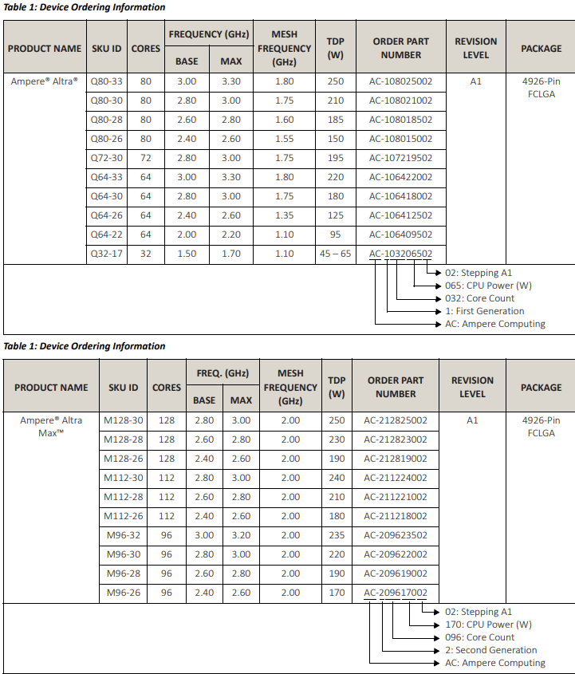

*图 2：公开规格表展示核心数、频率、功耗和 Mesh 时钟的组合。128 核变体把 Mesh 提到约 2 GHz，但核心频率与 L3 容量也会随 SKU 取舍。*

四线程时，Altra L2 追上 Zen 2 L3；在 3950X 用尽 L3 前仍落后。刚进入内存时 Altra 略占优势，3 GB 规模 Zen 2 即使通道更少也小幅反超。

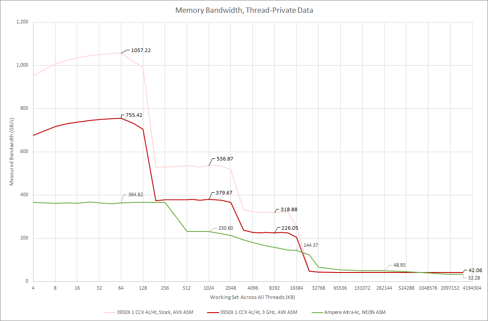

*图 3：每线程独立数组避免控制器合并相邻请求，得到更可信 DRAM 带宽。代价是 Altra 的 32 MB L3 淹没在 80 MB 总 L2 之后，不易从曲线单独识别。*

全芯片吞吐则是 Altra 的主场：80 核很难被 16 核 3950X 或 24 核 3960X 抵消。原测试没有 64 核 EPYC 裸机，不能把结果外推成同核心数结论。

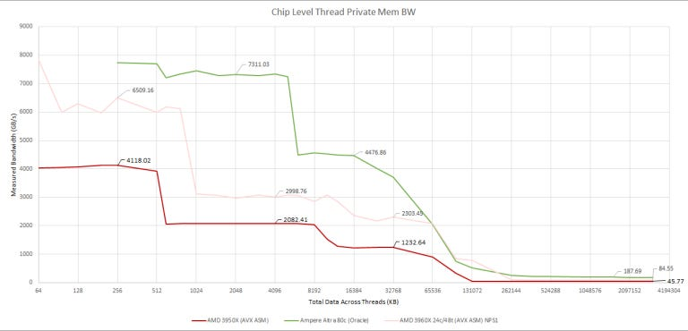

*图 4：Threadripper 3960X 数据由 Nemes 提供。共享/相邻地址可能被控制器合并，因此曲线更适合找 Altra L3 台阶，不用来报告最终 DRAM 带宽。*

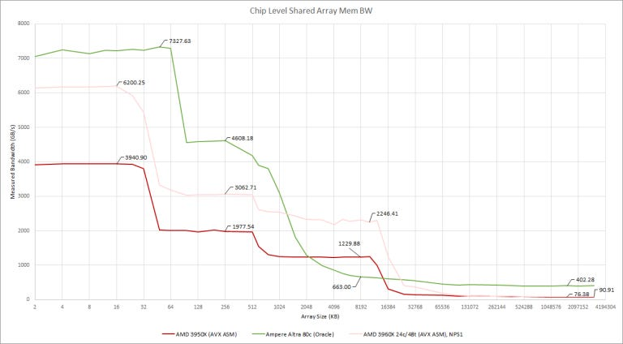

*图 5：网页正式图注说明，3950X 与 Altra 在进入 DRAM 后给出不合理高值，且与 Zen 2 硬件计数器不符，因此没有采用这一模式。方法学上的负面结果同样重要。*

Altra L3 总带宽最合理估计约 663 GB/s，低于 Threadripper Zen 2，甚至低于桌面 3950X。其延迟超过 Zen 2 两倍。文章据此不看好把小型 L4/系统 Cache 放到 AMD IOD：若容量不大、延迟高、带宽低，实际价值有限。这是作者判断，不是 AMD 路线确认；L3 带宽对多数应用也未必重要，科学计算是较可能例外。

### 体系结构视角：Mesh 用局部性能换规模可扩展性

核心频率 L3 提供低延迟高带宽，却难以把许多核心接在一个统一域；Mesh 可扩到 80～128 核，代价是更低互连频率、更远 hop 与更高共享 Cache 延迟。服务器设计优化的是每瓦吞吐、内存通道与部署密度，不必追求桌面式单线程 Cache。

判断 Mesh 是否瓶颈，应按 NUMA/目标 Slice、hop、并发线程和每线程独立数组分组，观察 Mesh 占用、L3 hit、内存控制器流量与延迟，而不是只看全芯片 GB/s。

## TLB：N1 更小但更快，Page Walk 仍缺资料

现代操作系统让进程使用虚拟地址，处理器再把它翻译成物理地址；Translation Lookaside Buffer（TLB，地址转换后备缓冲器）用来缓存这一映射，避免每次访存都重新遍历页表。

Zen 2 L1 DTLB 为 64 项，N1 为 48；L2 TLB 分别为 2048 与 1280。N1 L2 hit 约 5 周期，比 Zen 2 的 7 周期低。Zen 2 手册还记录 64 项 Page Directory Cache，可保存 PML4 与 PDP 层条目；N1 没有找到等价公开资料，容量之后的曲线更难解释。

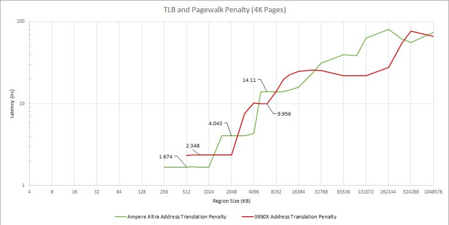

*图 6：N1 较小 TLB 更早出现容量台阶，但 L2 命中惩罚较低；越过 L2 后曲线混入页表层级 Cache、Page Walk 并发和数据 Cache 命中，不能从单个台阶推导 Walker 结构。*

## 方向预测：N1 快而克制，Zen 2 容量更大

两者都有先进方向预测。Zen 2 能学习更长模式、承受更多静态分支，说明用于 Pattern Tracking 的有效存储更大；但模式变长后，第二级 TAGE Override 越频繁，前端逐步增加空泡。Zen 2 的 PMU 把 TAGE 与 L2 BTB 覆盖都计入 `L2 BTB Overrides`，两者可能在同一流水级产生结果。

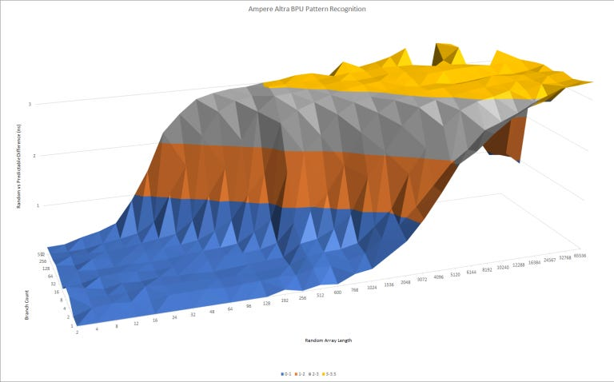

*图 7：N1 在短模式区保持较低惩罚，长历史和大量分支下较早退化。曲面不是 PHT 大小的直接测量。*

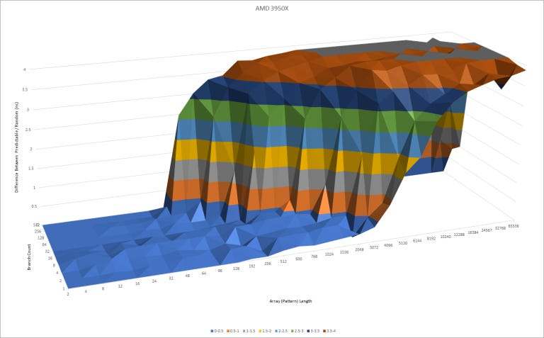

*图 8：Zen 2 高准确率平台更大，但越靠近二级 TAGE 覆盖区域，延迟逐步上升。容量与预测时效是两项不同指标。*

## 间接分支：N1 总目标更多，Zen 2 单分支更深

N1 至少能追踪 4096 个间接目标，即 512 个分支各 8 个目标，且在容量耗尽前，单分支目标增加几乎不额外加重惩罚。

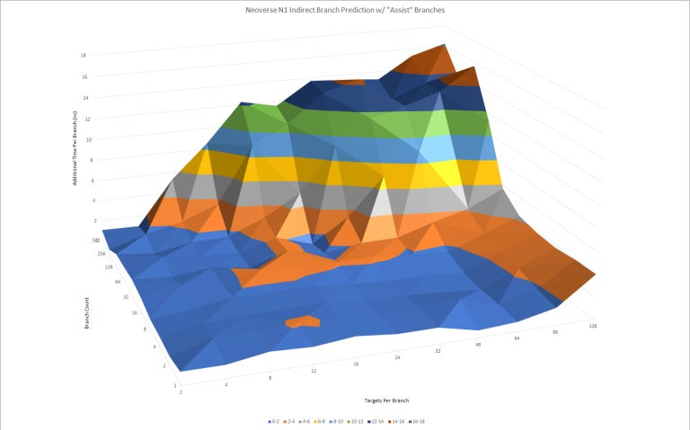

*图 9：同时改变分支数量、每分支目标与模式，N1 展示很大的总目标容量。*

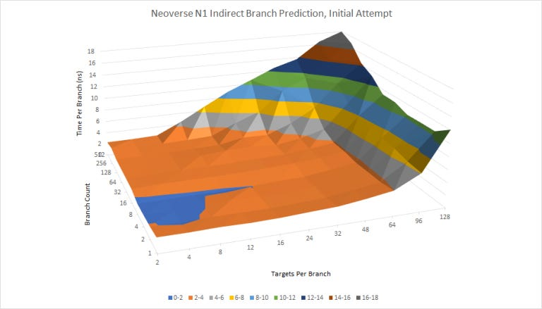

*图 10：早期构造揭示 N1 对多目标选择惩罚较低，也促使测试继续加入更多干扰因素。*

加入直接分支后，N1 间接容量下降，暗示直接与间接目标可能共享 BTB。

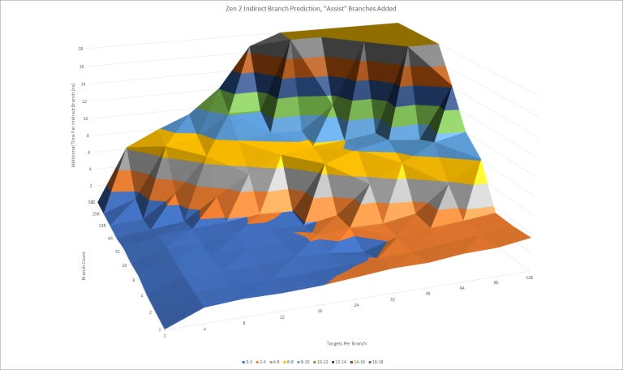

*图 11：目标行为不变而加入直接分支后容量变小，支持共享结构假说，但不足以确认具体 bank 或 entry 格式。*

Zen 2 对最多两个分支可各追踪至少 128 个目标，总间接目标却不超过约 1024，且目标数越多延迟越高。手册称它用 Global History 在 L2 BTB correction latency 上选择目标。只有间接分支与循环分支时，没有方向历史与目标选择相关，Zen 2 会频繁误预测；N1、Skylake，甚至 Piledriver 可能使用 Local History 或把间接目标纳入全局历史。现实影响不确定，因为 Zen 2 的实际间接 mispredict 并不多。

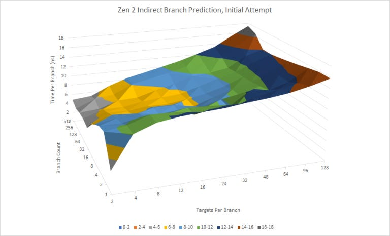

*图 12：Zen 2 优化少数分支拥有很多目标，N1 优化大量分支的总容量。两者对应不同服务器代码形态。*

### 体系结构视角：目标预测也需要“上下文”

普通 BTB 记住 `PC → target`，遇到同一 PC 多目标就不够。加入方向历史、路径或局部目标序列可以选择不同候选；代价是表更大、访问更慢。Override 可以让“上次目标”先走快路，复杂上下文随后纠正。

验证时要分别扫描静态分支数与每分支目标数，再加入无关直接分支，才能区分单 entry 候选数、总容量和共享污染。

## 两级 RAS 与有限的重命名优化

N1 像兆芯一样使用两级 Return Stack，但一级有约 11 项，二级再提供约 31 项；二级稍慢，却远没有兆芯慢路那么严重。Zen 2 使用单级、约 31 个可用项的快速 RAS。

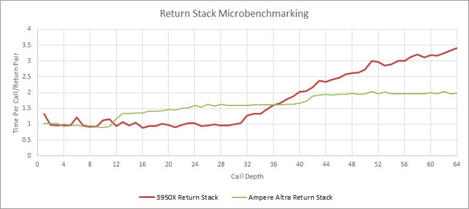

*图 13：N1 在约 11 后进入缓慢上升的二级路径，累计再覆盖约 31；Zen 2 在约 31 前维持单级快路，之后溢出。*

两者都能打破寄存器 MOV 依赖，但 N1 无法真正消除 MOV，且链式 MOV 偶尔仍保留依赖；Zen 2 可在重命名阶段零延迟“执行”每个寄存器 MOV。N1 能识别立即数零写入，不占 ALU；其他清零情形大多没有识别。Zen 2 能识别更多独立清零，却因吞吐不超过 ALU 数而不一定完全消除。

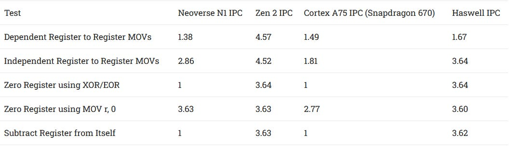

*图 14：依赖/独立 MOV、XOR 清零、`MOV 0` 与 SUB 清零的 IPC 显示 N1 优化覆盖较窄；结果区分“打破依赖”和“完全不占执行端口”。*

## N1 核心：四宽入口，44 Store 与 56 Load 后不再扩展

框图以 ARM N1 Platform White Paper 为基础：Fetch Queue 深度、Rename/Allocate 与 Commit/Retire 宽度来自官方；其他容量由微基准补齐。L1I 保存部分预译码指令，简化后续 decode，代价是额外元数据；ARM 未给 N1 开销，旧设计每条 16/32-bit 指令存约 36～40 bit。

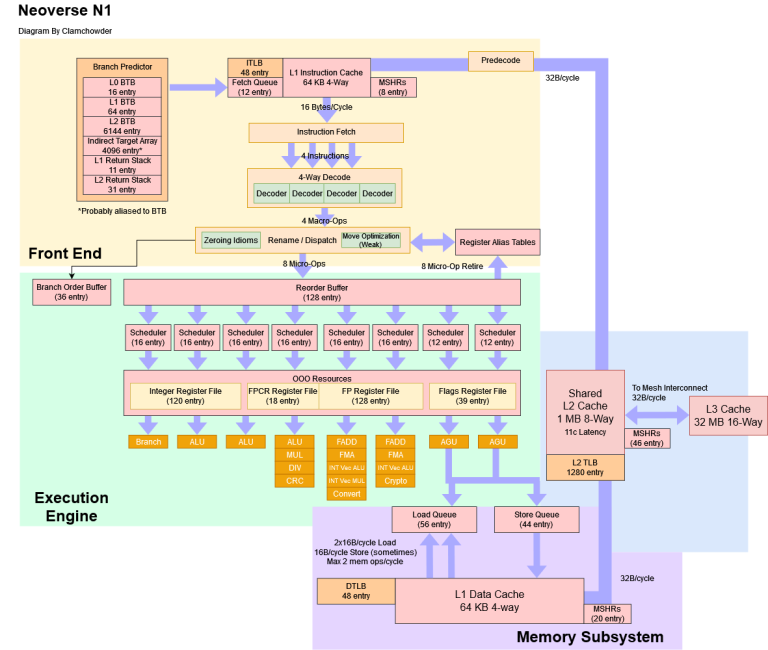

*图 15：N1 是相对紧凑的四宽乱序核心，1 MB 私有 L2 后接共享 Mesh/L3。框图把官方宽度与测试容量合在一起，不能全部视作同一证据等级。*

Load/Store Queue 与 WikiChip 数字不一致。N1 在超过约 44 个 Store 或 56 个 Load 后无法继续提取 ILP；甚至两条总为 L1D hit、夹在 Cache miss 之间的 pending Load，也会让它明显吃力。

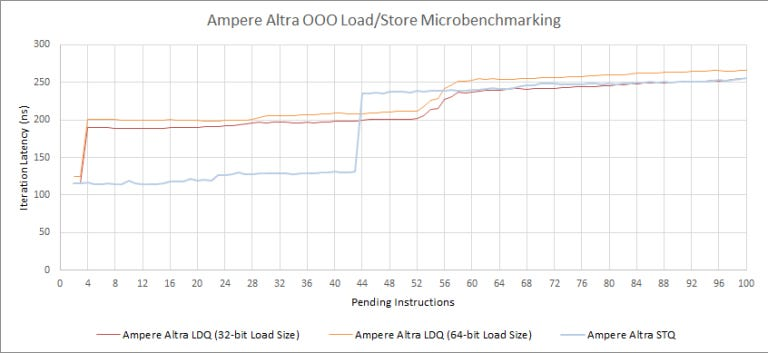

*图 16：不同 filler 类型在约 44 Store、56 Load 附近形成拐点。它测的是特定依赖与退休条件下的可用容量。*

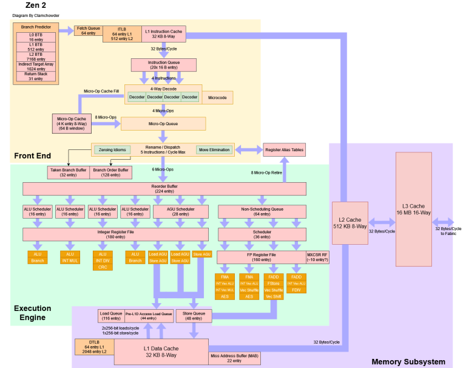

*图 17：Zen 2 的更大前后端、微操作 Cache、分层 Load 跟踪与核心频率 L3，为宏基准提供结构参照。*

AMD 手册称 Zen 2 Load Queue 44 项，但只适用于仍在等数据的 Load；Load 已投机完成、只等退休时可追踪约 116。按 N1 那种“不能提前执行”的标准，N1 Load Queue 约 37 项。

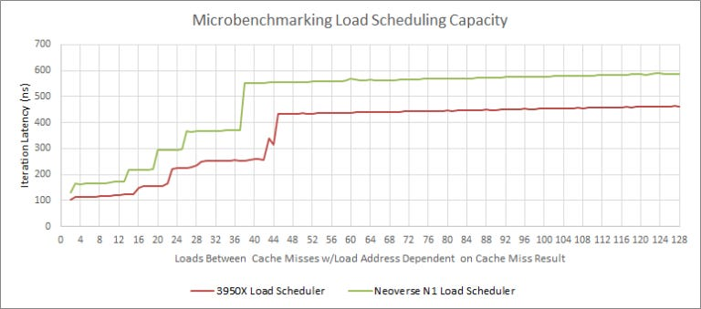

*图 18：正式图注说明 filler Load 依赖 Cache miss 结果，不能投机执行，因此接近“等待数据”的 Load 调度容量。*

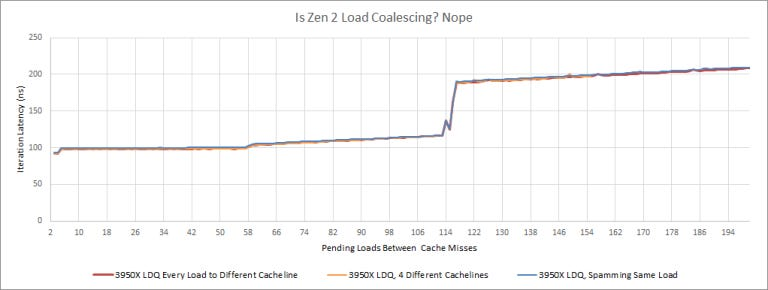

*图 19：独立 Load 可先执行，因此测到 Zen 2 约 116 个退休前跟踪项；每条指向不同 64 B Cache line 后结果仍相同，不是 Load Coalescing。*

### 体系结构视角：跨厂商队列比较先问“条目活到什么时候”

同名 Load Queue 可能只服务等待执行、也可能一直跟踪到退休。AMD 拆层后，44 与 116 都成立；N1 的 37/56 又对应不同构造。若不说明 Load 是否可投机完成、退休如何阻塞，条目数没有可比性。

## 宏基准方法：WSL1 改成 Linux VM 后，旧结论被推翻

新测试用 Hyper-V 四核 Linux VM 固定单 CCX，而不是此前 WSL1 与 `1+1+1+1`。`2+2`、`1+1+1+1`、`4+0` 在多数测试仅差误差；WSL1 与 Linux VM 却在编译中改变结论。还加入 SMT 与一个短时启动的四核八线程 EPYC Azure VM；这个云实例来自作者任职微软所获的订阅额度，频率、内存配置均无法确定，绝不是裸机对等比较。

### 编译 gem5

Linux VM 结果证明，先前认为 WSL1 系统调用转换开销不至于改变结论是错的。同频 N1 比桌面 Zen 2 慢 40.3%，比 EPYC 云实例慢 27.2%；3 GHz Skylake 不再落后。N1 最接近 Haswell，仍慢约 4%，应从“以小核而言令人印象深刻”修正为“略显不足，落后 Zen 2 两三代、落后 Skylake 约一代”。SMT 下 3950X 领先 86.4%，Haswell 领先 21%；EPYC 7452 比 3 GHz 3950X 慢 10%，提示编译对内存延迟敏感。

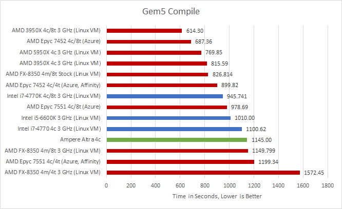

*图 20：纵轴为完成时间、越低越好。VM/WSL 选择足以改变旧结论，说明系统调用密集 Benchmark 必须披露运行环境。*

### 7-Zip 压缩

Linux `p7zip-full 16.02` 与 Windows 16.04 即使压缩率相同，速度差异巨大；Linux VM 又慢于 WSL。Azure Zen 2 更接近 Windows，若硬套 VM 数字会得到 Zen 1 比 Zen 2 快 18.5%、EPYC 比 3 GHz 3950X 快 65% 的不合理结论，说明 Windows 10 Hyper-V 开销干扰。文章最终以 Windows 数字判断，同时保留 VM 数据。

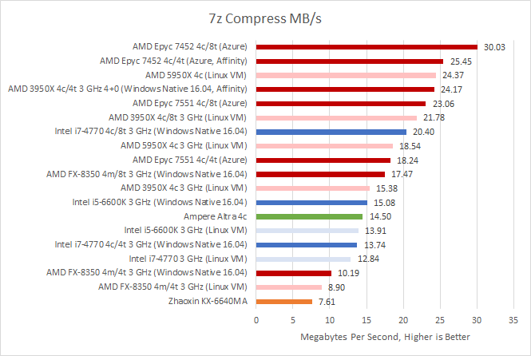

*图 21：桌面 Zen 2 同频领先 N1 66.7%。版本、操作系统和虚拟化路径会比 CCX 排布造成更大差异。*

Zen 2 的优势来自：分支准确率 97.6%、5.35 MPKI，对 N1 的 95.6%、8.16；Op Cache hitrate 89.8%；L1 DTLB miss 2.02 对 2.77 MPKI，N1 翻译惩罚出现频率高 37.1%；Page Walk 0.74 对 Zen 2 L2 DTLB miss 0.1/千指令。Altra L3 计数器显示 hitrate 低于 1%，但作者怀疑事件可能不准。

N1 的 64 KB L1D 是优势：hitrate 98.7%、3.53 MPKI，Zen 2 为 98.9%、4.33。看似更低 hitrate 却更低 MPKI，是因为 Zen 2 有 43% 指令访存，N1 只有 27.32%；这说明不能只看 hitrate。EPYC 7452 可能因 boost 到约 3.3 GHz 而领先 3950X 5%，云 VM 无法锁频。Skylake 仅领先 N1 4%，Haswell 反而慢 5.5%，可能受 Intel 较弱预测影响。

### Blender Cycles

3950X 在 Linux VM 中把同频领先扩大到 69.3%；3 GHz Haswell 领先 37.2%，Zen 1 也领先 10.1%，说明 SIMD 性能不只看 128-bit 宽度。EPYC 结果随 1 CCX/SMT 组合异常；兆芯的弱 AVX 甚至落后 Piledriver 和 Raspberry Pi 4。

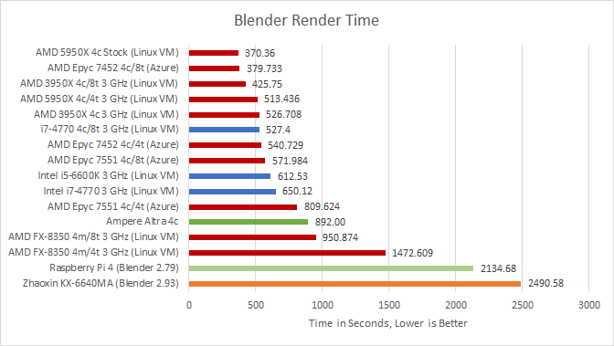

*图 22：正式图注说明测试 BMW Sample Scene，纵轴时间越低越好。平台与线程模式不同，重点是向量执行与存储系统对渲染的共同影响。*

### OpenSSL RSA2048

这是纯整数吞吐，WSL1 开销不明显。N1 不但远落后，还输给 Qualcomm Kryo 与老 FX-8350，证明 ISA 本身不是答案。

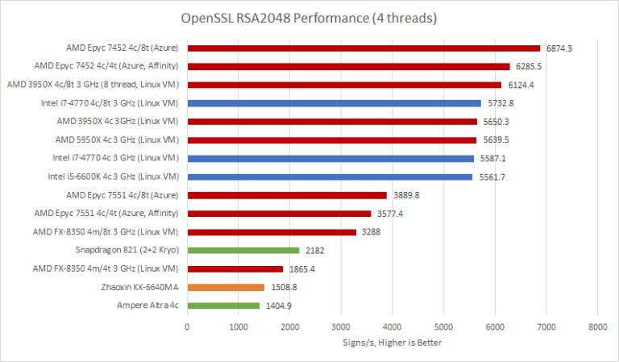

*图 23：OpenSSL 1.1.1，签名吞吐越高越好。Kryo 低频仍领先 N1 约 55%，异常大于简单 ALU 数能解释的程度。*

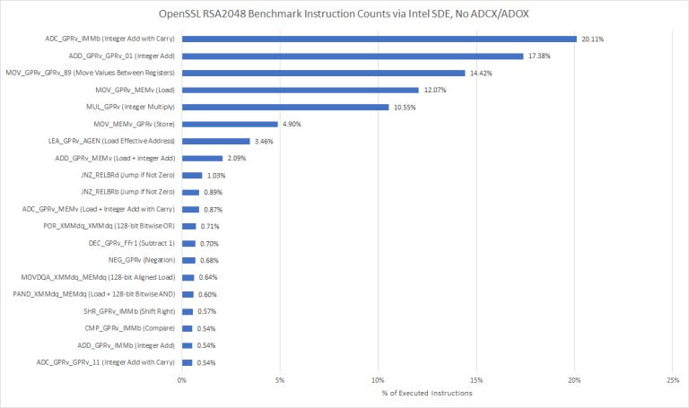

*图 24：Add-with-Carry 与整数乘法占主导。Kryo 约四条 ALU、平均 1.25 次整数乘法/cycle；N1 三条 ALU、约 1 multiply/cycle，仍无法解释全部差距。*

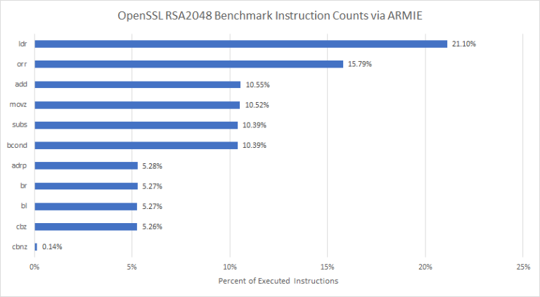

*图 25：ARMIE 给出的执行占比以 `adc`、`add`、乘法等为主；作者明确不完全信任工具输出。N1 PMU 只能看到后端阻塞重命名/前端，无法进一步定位哪个队列或端口已满。OpenSSL 3.1.0 master 与 1.1.1 在误差内。*

Zen 2、Zen 3、Haswell、Skylake 在 3 GHz 下几乎相同；Zen 2 SMT 只增 8.3%。只有 FX-8350 的“SMT”收益大，因为第二线程会带来另一组整数资源。

### ChampSim

修改版 ChampSim 单线程运行一条 Trace、6000 万指令。只有这一项 N1 的预测器表现最佳：同频领先 Zen 2 26.8%、Skylake 31.9%。

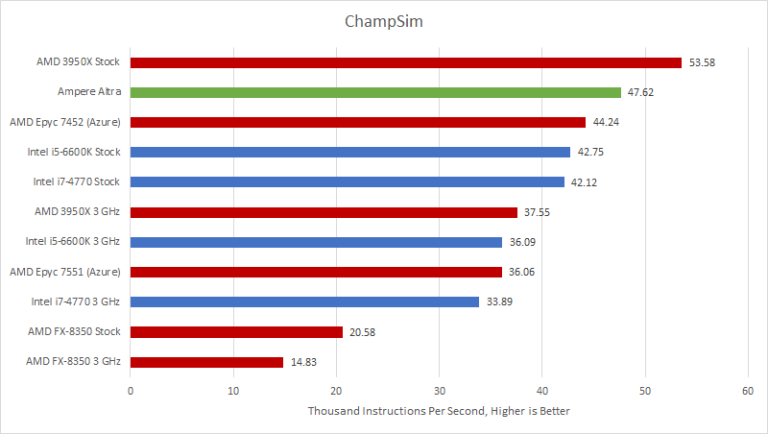

*图 26：N1 分支准确率 98.86%、2.65 MPKI，Zen 2 为 97.67%、5.36；N1 L1I hitrate 99.7%，Zen 2 为 93.37%。作者据此建议 AMD 考虑恢复 K10/Zen 1 的 64 KB L1I。*

### x264 与 x265

Linux VM 让桌面 x86 略有提升，但结论不变。x264 中 Zen 2 借助向量单元领先 N1 59%，Skylake 43%，Haswell 35%，Zen 1 即使同为 128-bit SIMD 也领先 17%；EPYC 7452 小幅领先 3 GHz 3950X，说明延迟影响小于频率。

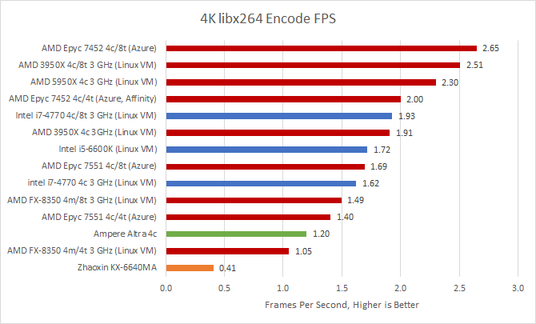

*图 27：帧率越高越好。源代码能否调用各 ISA 的 Intrinsic/汇编路径，对结果至关重要。*

x265 中除向量实现很弱且低频的兆芯陆家嘴外，其他核心都远超 N1。

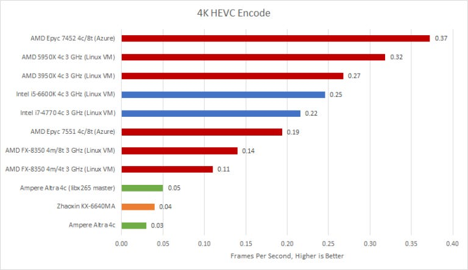

*图 28：更重的向量与编码内核放大了 N1 执行宽度、后端和存储系统的差距。*

## 为什么会这样：N1 前端并不差，后端更常阻塞

N1 的表现最能由较小乱序引擎和 1 MB L2 之后较差的 Cache 解释。Rename/Allocate 大量周期因等待后端资源而停住。

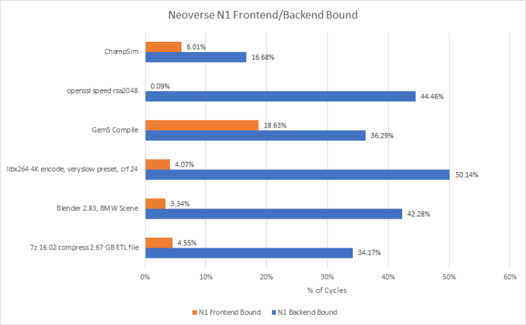

*图 29：编译、OpenSSL、gem5、x264、Blender、7-Zip 在 N1 上普遍有高 Backend Bound；PMU 粒度有限，不能再拆到具体队列。*

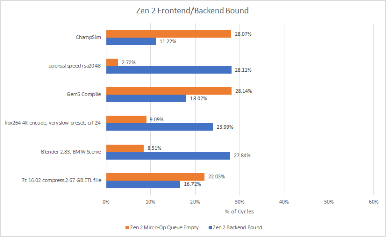

*图 30：Zen 2 平均同样后端受限，却没 N1 极端；更大窗口、更强 Cache 与 Op Cache 改变了瓶颈分布。*

ARM 在 A77/A78 扩大后端，并加入微操作 Cache。后者能增加前端带宽、减少平均误预测惩罚，但 N1 原本流水线因低频与预译码已较短；没有更强后端，单独加前端帮助有限。AMD 则在 Zen 3 同时增强前后端，仍可从更大 L1I 获益。

## 结论：N1 的目标不是单核同频击败 Zen 2

无论 CCX 配置或平台如何变化，同核心同频 N1 都不敌 Zen 2；这些变量只改变几个百分点，而差距常跨数代。Haswell 更接近 N1 的整数表现，但 3 GHz 锁频已让 i7-4770 自缚一手，默认频率会更快；使用向量单元的负载又把 N1 拉开。

这暴露 Source-based Benchmark 的局限：编码器、渲染器等吞吐程序常用 Intrinsic 或汇编利用 ISA。若只重新编译同一高级语言源代码，可能忽略产品真实软件路径，给出现实性不足的画面。

2021 年的产品方向也不同：AMD 正部署 Zen 3 EPYC Milan，以相同核心数提高单核；Ampere 推 128 核 N1 Altra，AnandTech 看到单核下降，符合 L3 缩到 16 MB、频率降低。作者质疑若 Ampere 采用更新 A77/A78，而不是继续堆 2019 年发布、已两年半的 N1，结果会如何。这是当时的观点，不倒写后续产品答案。

文章以 Patreon 支持渠道结束。

## 方法补充

Hyper-V 四核 VM 用于固定单 CCX。Windows affinity 对 Blender、ffmpeg 和 WSL1 不可靠；Zen 2 的 Collaborative Processor Performance Control（CPPC，协作处理器性能控制）会向 OS 提供 Preferred Core 排名。3950X 排名最高的四核恰在 CCX1，测试时用任务管理器确认；5950X 关闭第二 CCD 创建单 CCX。3950X SMT 测试只能用 `2+2`，无法只启一个 CCX。

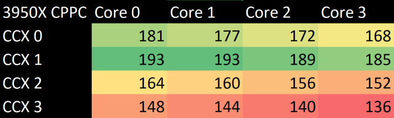

*图 31：四个 CCX 的排名不同，CCX1 的 193/193/189/185 最高，使 Hyper-V 更稳定地把四核 VM 放在同一 CCX。*

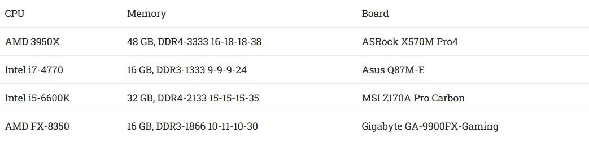

*图 32：列出 Altra、i7-4770、i5-6600K、FX-8350 等平台的内存与主板。云 VM 的内存配置无法确定，因此相关结果只作视角补充。*

## 体系结构视角：从 N1 得到的七点认识

第一，**单核与整芯片可以得出相反排名**。N1 单核 Cache 带宽弱，80 核总吞吐却强；服务器要先明确优化目标。

第二，**Mesh 是规模化成本，不是简单缺陷**。低频互连牺牲 L3 延迟，换来更多核心、内存通道和单片扩展。

第三，**预测器也有工作负载风格**。N1 方向容量小于 Zen 2，间接总目标却更大；ChampSim 又因分支与 L1I 特征让 N1 获胜。

第四，**队列名称没有统一语义**。Load 等数据、已完成等退休、验证顺序是不同生命周期，44、116、37、56 都要连同测试构造阅读。

第五，**前端升级只有后端能接住才有用**。N1 大量 Rename Stall 来自后端资源；更宽微操作 Cache 无法自动解决执行与 Cache 瓶颈。

第六，**运行环境可能颠覆结论**。WSL1 与 Linux VM 让 gem5 编译从“令人印象深刻”变为“略显不足”；版本 16.02/16.04 也让 7-Zip 无法直接比较。

第七，**ISA 不能替代具体实现与软件优化**。Kryo 可在 OpenSSL 击败 N1，Zen 1 同为 128-bit SIMD 也能在 x264 领先；端口、窗口、Cache 与汇编路径共同决定性能。

## 参考资料

- Chester Lam, *Deep Diving Neoverse N1*, Chips and Cheese, 2021-10-22：https://chipsandcheese.com/p/deep-diving-neoverse-n1
- Arm, *Neoverse N1 Platform White Paper*
- AMD, *Software Optimization Guide for AMD Family 17h Processors*
- Henry Wong, *Measuring Reorder Buffer Capacity*
