# Arm Neoverse N2：面向服务器的 Cortex-A710

> **文章来源**
>
> - 文章：*ARM’s Neoverse N2: Cortex A710 for Servers*
> - 撰文：Chester Lam
> - 首发：Chips and Cheese
> - 发布：2023 年 8 月 18 日
> - 链接：https://chipsandcheese.com/p/arms-neoverse-n2-cortex-a710-for-servers

Neoverse N1 从 Cortex-A76 演化而来，通过指令 Cache 一致性、48-bit 物理地址等增强进入服务器。AWS Graviton 2、Microsoft Azure 和 Oracle Cloud 中的 Ampere Altra，证明这条路线能够站稳脚跟。Neoverse N2 延续同一思路：核心与移动端 Cortex-A710 高度同源，再用更大的 Cache、地址空间和 CMN-700 Mesh 适配服务器规模。

这次实际接触的是一台八核 Alibaba Yitian 710 云实例，由 Chips and Cheese 团队成员 Titanic 提供。完整倚天 710 有 128 核、最高 3.2 GHz、约 600 亿晶体管、八通道 DDR5 和 96 条 PCIe 5.0，但八核实例无法验证全芯片吞吐。微基准只能说明被分配核心的行为，并显示其与 Cortex-A710 极为接近——甚至共同出现“常见整数加法和位运算只有三条 ALU 管线可接收”的结构特征。

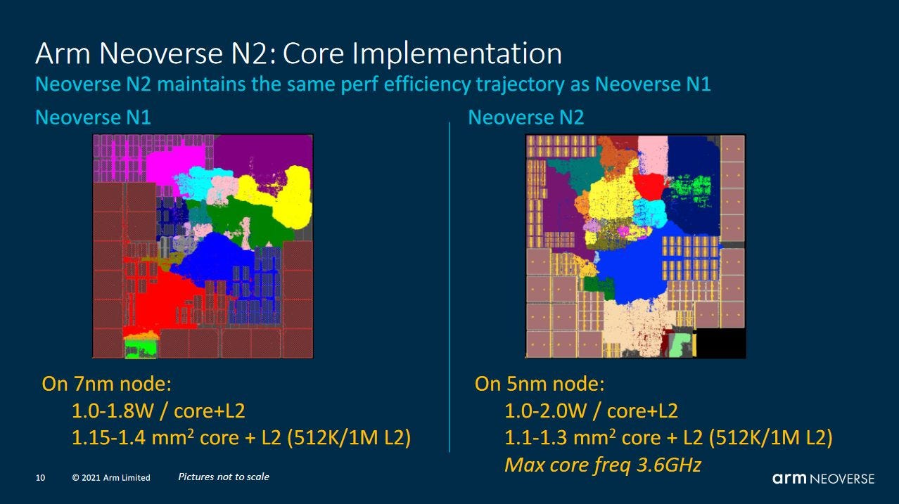

*图 1：Arm 给出的 N1/N2 实现示例。N2 采用更新工艺并提高单核性能与效率；图中属于官方演示信息，不代表本次八核云实例的实测结果。*

本文先比较 N2 与 Zen 4，再回到 A710 与 N2 的差别。Zen 4 具有面向密度的 Bergamo 版本，会牺牲 L3 容量和频率以缩小面积；Sapphire Rapids 也是同期服务器对手，但更偏向单核性能。

## 五宽 N2：小窗口配大调度能力

N2 是五宽乱序核心，结构与倚天 710 的测试结果基本一致。Arm 称其流水线为 10 级；文章推测，这可能对应目标命中微操作 Cache 时的最小分支误预测惩罚。Zen 4 的最小误预测惩罚为 11 周期，但“流水级数”和特定测试测得的恢复延迟并不是天然等价的指标。

云实例可用时间有限，因此测试优先核对未公开的队列和寄存器容量；Arm 已公开的数据直接采用官方数值，不用微基准覆盖。

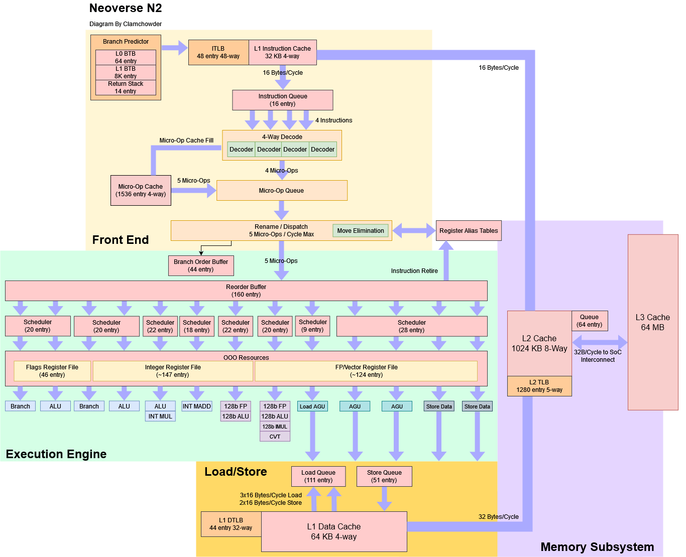

*图 2：五 micro-op/cycle 的 Rename/Dispatch、160 项 ROB、约 147 项整数物理寄存器、111/51 项 Load/Store Queue、64 KB L1D、1 MB L2 和 64 MB L3 被放在同一张图中。粉色容量既有官方规格，也有微基准反推，不能全部当成 Arm 公布值。*

前端中，Arm 明确给出 64 项 micro-BTB 和 8K 项主 BTB。倚天 710 与 A710 的曲线相似：静态分支少于 64 时偶尔可在一周期处理多于一个 Taken 分支，符合 micro-BTB 快路；测试规模超过约 10K 个 Taken 分支后，延迟才明显上升。8K 与 10K 不是矛盾的直接证据，哈希、组相联、测试布局和有效占用都会让拐点偏离物理项数。

### 体系结构视角：窗口不大，不代表后端每一处都小

ROB 决定能跨越多少未退休指令，Scheduler 决定有多少“已进入窗口、正在等操作数或端口”的操作可被选择。N2 的策略不是把所有结构同比放大，而是以 160 项 ROB 配置相对充裕的分布式 Scheduler、Load/Store Queue 和执行端口，减少某一局部资源先于 ROB 耗尽的概率。

判断限制来自哪里，应同时观察 ROB full、物理寄存器耗尽、各 Scheduler/LSQ full、ready-but-not-issued 以及 Rename Stall。只有 ROB 先满，扩大 ROB 才能直接增加可见窗口；若端口、寄存器或队列更早反压，再大的 ROB 也装不进去。

## 对照 Zen 4：前端、乱序窗口与执行端口

Zen 4 是六宽核心，客户端与服务器版本高度同源；服务器 Genoa 把物理地址从客户端的 48 bit 提到 52 bit。它沿 Zen 3 主线扩大全流水线，并首次加入 AVX-512。

### 分支预测：N2 以密度换容量

N2 的方向预测器已经很现代，但文章认为仍落后 Zen 4 一步。AMD 从 Zen 2 起持续投入面积，换来更高的预测速度与准确率；N2 更保守，以节省核心面积。

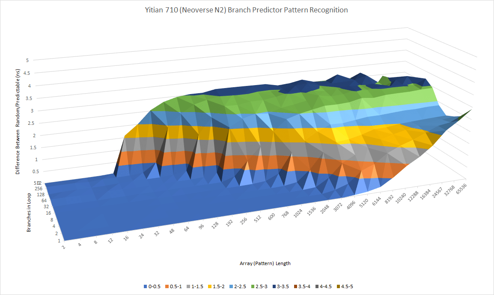

*图 3：纵轴是每分支周期，另外两轴改变 Pattern Length 与静态分支数量。N2 在可学习区域内保持较低代价，超出有效历史或容量后曲面抬升。*

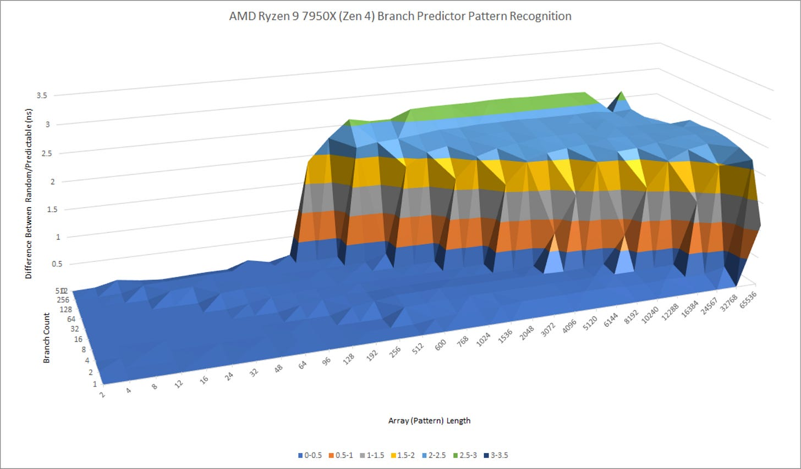

*图 4：Zen 4 的低延迟、高准确率区域更宽。曲面同时受历史长度、表容量、混叠和多级预测覆盖影响，不能反推出某一张 PHT 的精确条目数。*

若分支本身可预测且代码足迹较小，N2 的快速大容量 BTB 仍很有竞争力；在 micro-BTB 工作范围内，一周期处理两个 Taken 分支甚至可能比 Zen 4 更快穿过密集控制流。这里说的是目标供给吞吐，不等于整套预测器在一般程序中更准确。

### 整数后端：160 项 ROB 对 320 项 ROB

N2 的重排序容量远小于 Zen 4：ROB 为 160 项，整数物理寄存器约 147 项，其中约 116 项可供投机重命名；Zen 4 分别为 320 与 224。单看这组数字，N2 更像 Sandy Bridge 时代的窗口规模。

Arm 对其他结构的投入弥补了一部分差距。N2 的 Load/Store Queue 并不比 Zen 4 小很多，整数 Scheduler 尤其充裕；Zen 4 采用半统一结构，让同类操作可在多组 24 项队列间选择，N2 的分布式队列灵活性略低，但内存操作不会像 Zen 4 那样与 ALU 操作争用同一组 Scheduler 项。

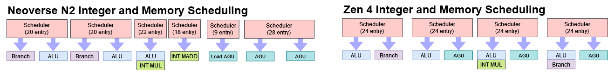

*图 5：N2 把整数、分支、乘法和访存分散到多组队列；Zen 4 以半统一队列扩大可选端口。图中容量用于说明调度拓扑，不应简单相加成统一 Scheduler。*

两者都能每周期解析两条分支，也都能处理三次访存、其中最多两次 Store。N2 多一条整数乘法端口，Zen 4 多一条通用 ALU 端口。端口数本身并不等于持续吞吐：就绪操作能否及时进入正确队列，往往更关键。

文章对 N2 整数侧的评价很高，但认为寄存器文件与 ROB 还可以更大。现有 Scheduler、LSQ 和端口已经足以支撑 200 项以上 ROB；而后文会看到，N2 从 L3 取数时尤其需要更大的延迟隐藏窗口。

### 浮点与向量：SVE 到了，物理宽度没有同步翻倍

N2 加入 SVE，Zen 4 加入 AVX-512，但两者都没有像 Intel 早期 AVX-512 核那样，随 ISA 扩展同步增加执行单元宽度或端口数。N2 延续 N1 的两条 128-bit FP/Vector 管线；Zen 4 仍以 256-bit 数据通路分解 512-bit 指令。

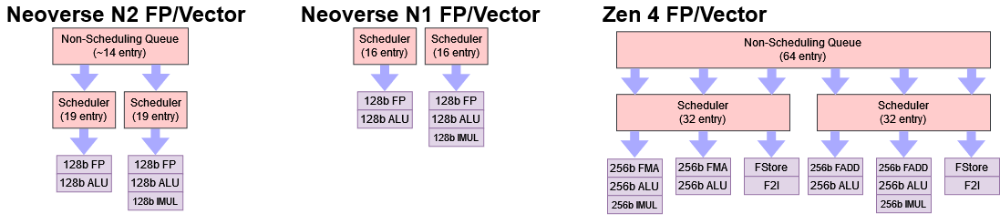

*图 6：修订后的结构把 N2 表示为两组约 19 项 Scheduler，前方另有约 14 项共享 Non-Scheduling Queue（NSQ）；N1 是两组约 16 项队列，Zen 4 则有 64 项 NSQ 和两组 32 项 Scheduler。N2 容量来自微基准重建，`约`不能省略。*

N2 的执行端口布局相对 N1 不变，提升主要来自更大 Scheduler 与 NSQ。后者可以暂存尚未进入 FP Scheduler 的操作，使其他类型 micro-op 不因 FP 队列已满而一起卡在 Rename。图中推定结构合计可保留约 52 条未完成 FP/Vector 操作；正文另以单端口测试观察到约 30 条，二者对应不同指令组合与共享队列占用。

这段内容在首发后因测试错误修订过。最初测试选错了 `SCVTF` 指令形式，实际测到多周期整数端口而非向量端口；后续改用单端口 `FJCVTZS`、16-bit 元素形式的 `ADDV`，并通过依赖/独立 filler 混合区分 Scheduler 与 NSQ。当前图 6 和上述结论采用修订后的解释，仍不是 RTL 确认。

从产品时代看，N1 大致对应 Zen 2，N2 大致对应 Zen 4。AMD 在这段时间改善端口分布、减轻 FADD/FStore 管线压力，并近乎翻倍 FP Scheduler；Arm 的改动更温和，重点是让短暂 FP/Vector 峰值不那么容易堵住整个后端。Zen 4 依靠更大 Scheduler/NSQ 和 256-bit 执行宽度仍占优势，N2 相比 N1 则已有实质升级。

### 体系结构视角：为什么“能容纳 52 条”不等于 52 项 Scheduler

Scheduler 中的指令会被唤醒、选择并发射，NSQ 只负责等待进入可调度窗口。把一串依赖操作夹在两次 Cache miss 之间，只能测出“核心还能追踪多少未完成操作”；若前面还有 NSQ，它会把两种容量叠在一起。

区分两者要让一部分 filler 独立执行、主动腾出 Scheduler 空位，再改变依赖操作在队列中的相对位置。只有延迟台阶随这个位置移动，才有理由把总在途容量拆成 Scheduler 与 NSQ。指令形式、micro-op 数和端口绑定一旦判断错误，整个结构图都会跟着错。

## 从 Cortex-A710 到 N2：服务器化改动

### 频率：云端更在意一致性

云服务商偏好稳定、可预测的性能，通常会锁定或限制频率。所测倚天 710 实例固定在 2.75 GHz，从 idle 唤醒也没有可测的 Boost 延迟。阿里称完整芯片最高可达 3.2 GHz；量产实例可能为了良率和功耗选择更低频率。

N1 也类似：3.3 GHz Altra SKU 曾经存在，多家云服务商却选 3 GHz。到 2023 年 8 月 7 日，Ampere 已不再宣传 3 GHz 以上型号。当时能够测试的 N2 实现只有倚天 710，因此不能据此判断其他 N2 芯片的频率策略。

### 地址转换：更大内存需要更多 TLB 覆盖

A710 面向较小工作集，L1 DTLB 只有 32 项，后接 1024 项、四路组相联 L2 TLB。N2 把 L1 DTLB 增至 44 项，L2 TLB 增至 1280 项、五路组相联；这与 N1 的 1280 项 L2 TLB 接近，后者 L1 DTLB 略大，为 48 项。

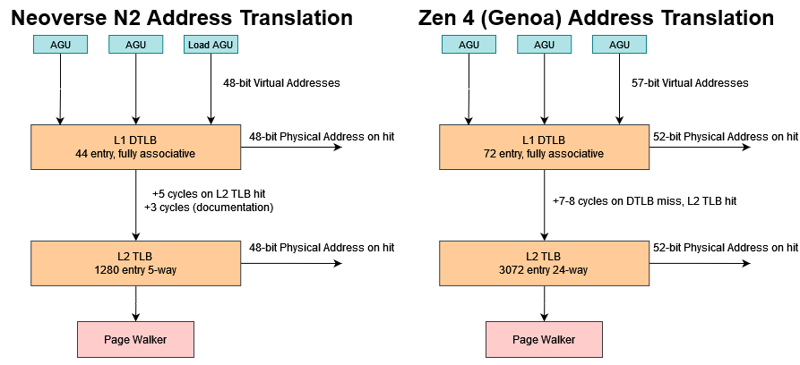

*图 7：Zen 4 为 72 项 L1 DTLB、3072 项 L2 TLB，指令侧另有独立 512 项 L2 iTLB；N2 数据侧覆盖明显更小。图中还并列展示 48-bit 与 52-bit 物理地址宽度。*

同期 Intel、AMD 的 L1 TLB 多保持约 64 项，L2 TLB 则持续变大。Zen 4 的 72/3072，再加独立 512 项 L2 iTLB，可在代码与数据位于不同页面时扩大总覆盖。N2 因而延续了 Arm 服务器核 TLB 覆盖低于同期 x86 的趋势。

A710 的 40-bit 物理地址最多覆盖 1 TB，服务器明显不够；N2 改为 48 bit，可寻址 256 TB。这与 A76 到 N1 的变化相同。Genoa 与 Ice Lake 使用 52 bit，可覆盖 4 PB，对超大共享内存系统更有意义；文章在 2023 年判断 Arm 并不以此类系统为目标，因此 48 bit 已够用。这是当时的市场判断，不是架构上限永远不再增长的承诺。

### 体系结构视角：TLB 项数、地址位宽与覆盖范围是三件事

物理地址变宽会增加每项 TLB 的标签与权限元数据成本；TLB 条目数决定能同时缓存多少页，真正覆盖的字节数还取决于 4 KB、2 MB 等页尺寸。服务器既需要更宽地址以容纳物理内存，也需要更大 TLB 或 Huge Page 避免工作集扩张后频繁 Page Walk。

验证时应固定页尺寸，分别扫描数据与代码工作集，记录 L1/L2 TLB miss、Page Walk 次数与 Walk 周期。只看平均内存延迟，无法区分 Cache miss 与地址翻译 miss。

## Cache 与 CMN-700：私有层级救火，Mesh 负责扩展

N2 的 Cache 配置比移动端 A710 更偏向大工作集。所有 N2 都有 64 KB L1I 和 64 KB L1D；文章认为 64 KB L1 通常比近年 x86 常见的 32/48 KB 取得更高 hitrate，并希望 AMD 恢复 K10/Zen 1 时代的 64 KB L1。

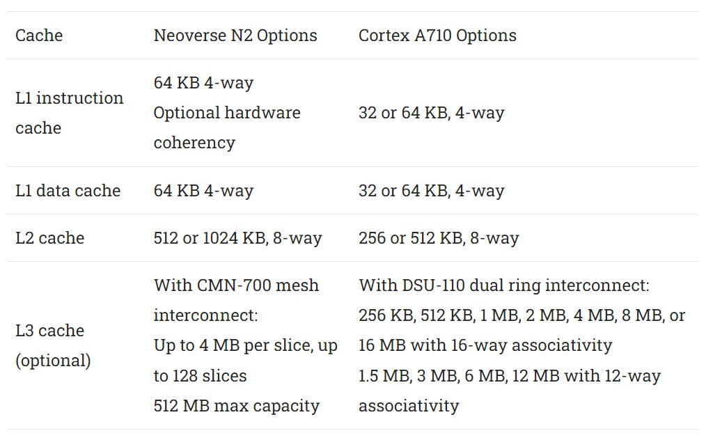

*图 8：N2 固定 64 KB L1，可选 512 KB/1 MB 私有 L2，并能连接 CMN-700 Mesh；A710 可连接最多 12 核的 DSU-110。Arm 文档也允许 N2 使用 DSU-110，但文章未见实际产品采用。*

N2 可选硬件指令 Cache 一致性。Arm 建议高核心数系统启用，因为靠软件广播 I-Cache invalidate 无法良好扩展。L2 对 L1I 内容保持 Inclusive，使其他核心的 Read-for-Ownership 能经 L2 目录触发 L1I 失效。文章进一步推测 L2 可能对 L1D 呈 Exclusive，以避免同一地址在本核 L1D/L1I 同时形成不一致副本；这一部分是机制解释，不是公开 RTL。

Arm 推荐 1 MB L2。若只有 512 KB，其中 64 KB、即八分之一会被 L1I Inclusive 副本占用；256 KB 更不理想，也没有成为 N2 可选项。容量从 A710 的 512 KB 增至 N2 的 1 MB 并未增加周期数，二者 L2 Load-to-use 都约 13～14 周期。Altra 与 Zen 4 的周期数相近，Zen 4 依靠更高频率取得更低实际纳秒延迟。

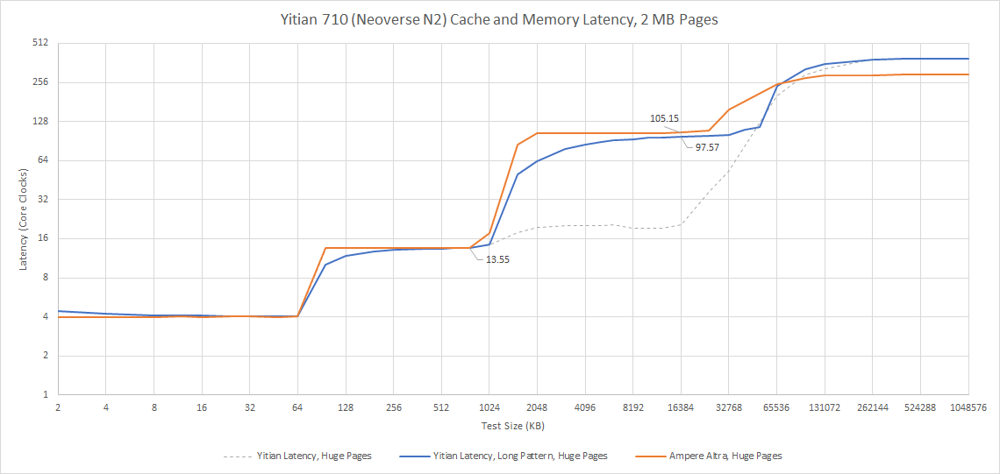

*图 9：2 MB 页面、超长 Pointer Chasing Pattern 用来压制能记住长序列的预取器。序列变长会更早重访 Cache line，因此层级边界没有普通随机链那么整齐。*

更大的 L2 也在隔离高 L3 延迟。N2 可接 CMN-700 Mesh；DSU-110 双环最多 12 核，不适合大规模服务器。倚天 710 使用 CMN-700 和 64 MB L3。它的 L3 以核心周期计略快于 Altra，但核心频率更低，实际纳秒延迟几乎相同。

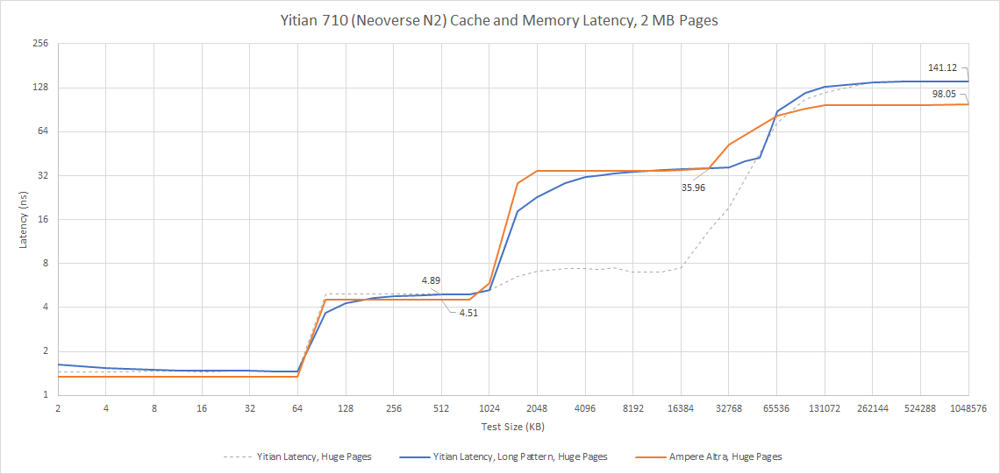

*图 10：16 MB 工作集下，倚天 710 为 35.48 ns，Ampere Altra 为 35.05 ns。更大 L3 没有进一步恶化实际延迟，但绝对值仍高。*

Sapphire Rapids 的同尺寸延迟为 33.48 ns，说明大 Mesh 普遍付出高 L3 代价。按 Little’s Law 做理想化估算：512 项 ROB 的 Sapphire Rapids 若维持 6 IPC，只能覆盖约 85 个周期；160 项 ROB 的 N2 若维持 5 IPC，只能覆盖 32 周期。这个除法展示的是窗口上限，不代表每个 ROB 项都能形成独立 miss，也不等于实测可隐藏延迟。

预取器能在指令进入后端前发起请求，但更强预取需要额外片上状态，过度积极还会浪费带宽。AMD 则用两级互连避开全 Socket 单级 Mesh：最多八核的快速环连接本地 L3，miss 再进入较慢 Infinity Fabric。

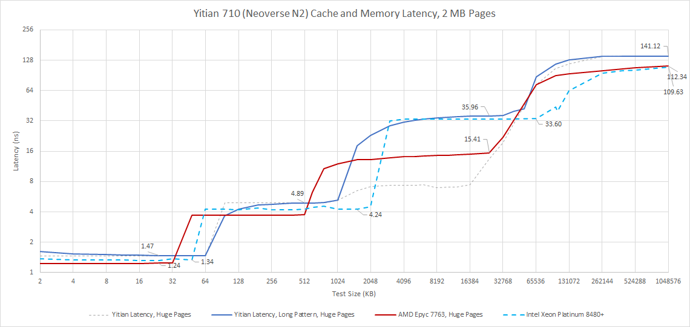

*图 11：Zen 3 EPYC 7763 在 16 MB 约低于 15 ns，明显优于 Mesh 系统；其 256 项 ROB 在 6 IPC 下仍不能完全覆盖 L3，但处境好于 N2 和 Sapphire Rapids。倚天 710 DRAM 约 141 ns，Sapphire Rapids DDR5 约 109.6 ns，后者甚至能与 DDR4 Milan 竞争。*

### L3 带宽：高延迟也限制并发请求

单核能追踪的 L2 miss 有限，高 L3 延迟会连带压低带宽。单个 N2 核从 L3 读取约 36.5 GB/s，Sapphire Rapids 相近，Zen 3 则超过 80 GB/s。

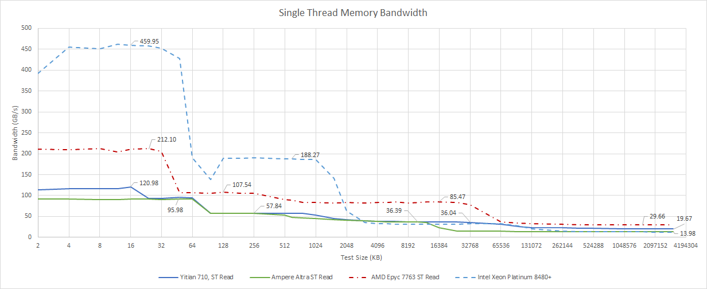

*图 12：曲线展示单线程跨层级带宽。Zen 3 的近核 L3 与更多可并发 miss 共同形成优势，不能只由数据通路位宽解释。*

八核同时读取时，倚天 710 L3 为 141 GB/s；没有同配置 Sapphire Rapids 数据，Ice Lake 大致相当；Zen 3 八线程达到 530 GB/s。Intel、AMD 均支持双路 SMT，Intel 加载所有 SMT 线程后带宽明显增加，AMD 的变化较小。

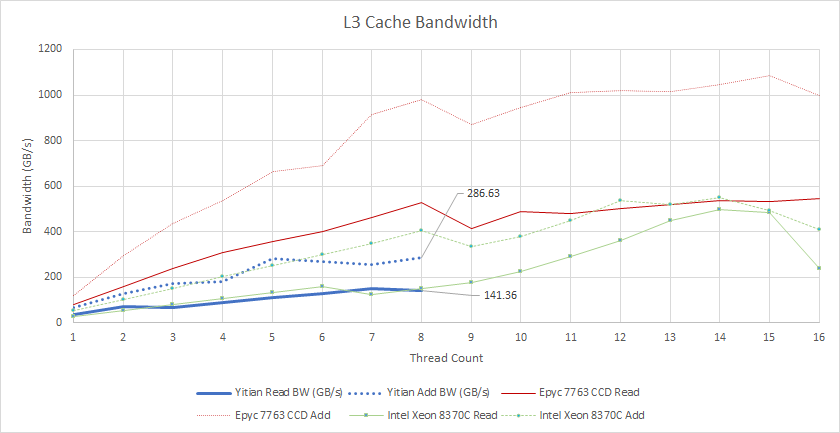

*图 13：测试规模为 16 MB。只读流量比较的是八个可见核心/线程组合，不代表完整 Socket 的峰值。*

Read-Modify-Write 能借 Writeback 暴露更多并行性：八核倚天 710 达 286 GB/s，Ice Lake 403 GB/s，Zen 3 凭优化良好的 Victim Cache 达 981 GB/s。

N2 相比 N1 给 L1D 增加一个端口，可每周期完成三次 128-bit Load；八核从私有 L1 合计接近 1 TB/s。Intel 因重视向量吞吐，私有 Cache 带宽更高，Ice Lake 的 L2 带宽甚至超过 N2 任一层。Zen 2 以来的 AMD 每周期可做两次 256-bit Load，处于两者之间。

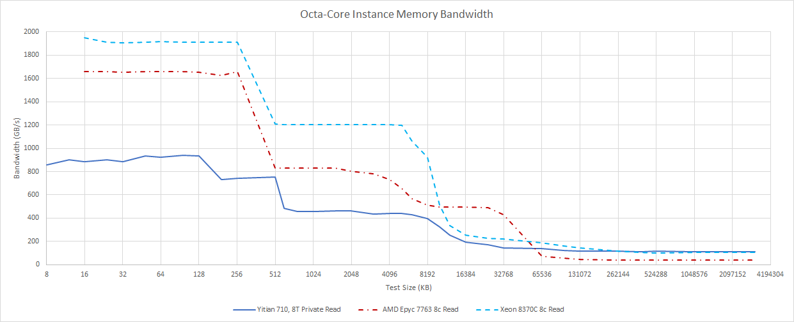

*图 14：Ice Lake 在 L1/L2 居首，Zen 3 在 L3 居首。进入 DRAM 后，八核倚天 710 的 DDR5 为 111.95 GB/s，Ice Lake 为 103.69 GB/s，Zen 3 VM 受 Infinity Fabric 链路限制只有 40.23 GB/s。*

AMD 的两级互连带来强 L3 和低成本 Chiplet，却可能限制“不够并行、又高度依赖 DRAM 带宽”的负载。反过来，八核 VM 的数据也无法说明完整 128 核倚天 710 的八通道峰值。

### 体系结构视角：一条延迟曲线串起 ROB、MSHR、预取与互连

L3 延迟不是孤立数字。ROB 决定核心能保留多少未退休工作，Load Queue/MSHR 决定能挂起多少 miss，预取器决定请求能否提前，Mesh 与目录决定请求走多远。任一环节先满，前端再宽也会因 Rename/Dispatch 反压停住。

较完整的诊断应同时看有效 IPC、ROB/LSQ full、L2 miss outstanding、prefetch useful/late、L3 Slice 命中、Mesh hop 与内存控制器队列。只有带宽下降与 outstanding 上限、互连排队同时出现，才有理由进一步定位哪一级失去并行性。

## 指令侧带宽：L2 容量比小代码峰值更重要

固定 64 KB L1I 让 N2 在代码足迹超过 32 KB 后略优于 A710，但优势有限，因为 N2 从 L2 也能维持 3 IPC 以上。N2 的更大 L2 在代码继续扩张时更有价值；进入 L3 后，A710 反而因更低系统延迟取得更高前端带宽。

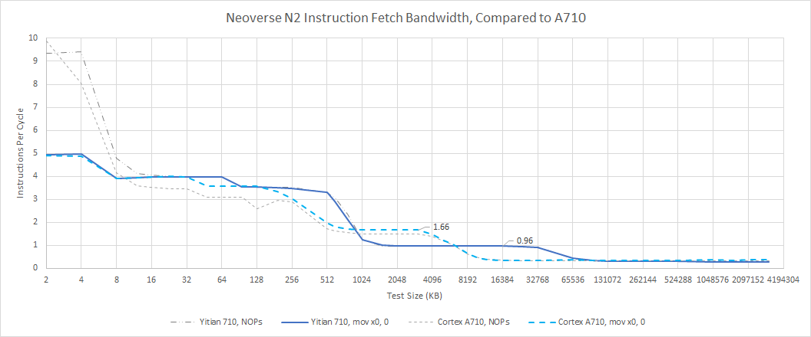

*图 15：横轴扩大 NOP 代码足迹，纵轴为每周期指令数。小足迹主要观察 micro-op Cache/L1I，跨过 Cache 容量后则混入 miss 并发和下级延迟。*

Arm 经常以 N1 对照 N2，因为中间没有新的 N 系列服务器核。小代码足迹下，N2 可由 micro-op Cache 维持 5 IPC；后端能否长期接住这份供给仍是问题。代码进入 L2 后，N2 可能凭更多并发 L1I miss 几乎隐藏 L2 延迟，显著优于 N1；两者从 L3 取指都很差。

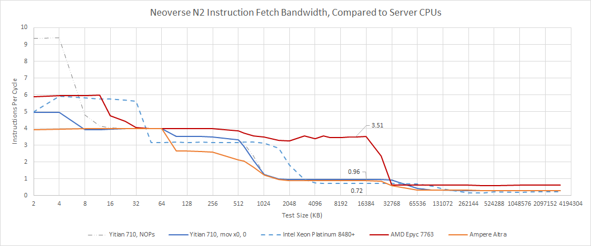

*图 16：x86 为变长指令，测试统一使用 4-byte NOP，接近整数代码平均长度。AMD/Intel 小足迹凭六宽略胜；Zen 3 从 L2 可持续 16 B/cycle，并在代码落入 L3 后明显领先。网页正文此处曾写成 N1 小幅领先 Intel，但图题和上下文都在比较 N2，属于原页面内部文字不一致。*

## 核间延迟：Mesh 的结果并不糟，但也不突出

测试用原子 Compare-and-Exchange 测量一个核心的写入何时对另一个核心可见。八核实例内约为 50～60 ns，属于中等水平；相邻核心的结果非常接近，文章据此推测两个核心可能共享一个 Mesh Stop。Altra 确实采用每 Stop 两个 N1 核；CMN-700 本可扩到 12×12，阿里若也配对，可能是为了缩小 Mesh。

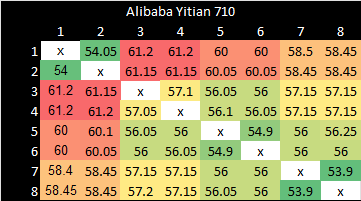

*图 17：八个可见核心间大多为 50～60 ns。矩阵反映该 VM 的可见拓扑，不能还原完整 128 核芯片的 Mesh 坐标。*

AMD 在单个 Core Cluster 内使用更快的环；跨 Cluster 约 100 ns，跨 Socket 两侧约 110 ns，但这不会出现在八核 VM 的同 Cluster 情形。

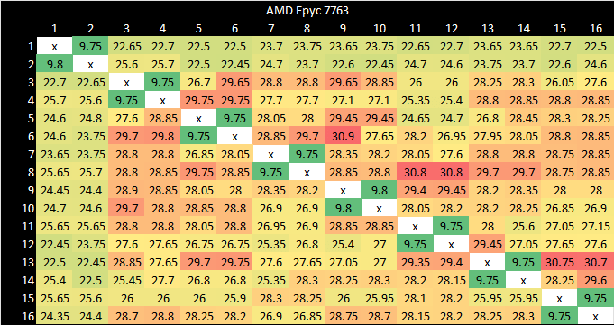

*图 18：绿色低延迟块对应近邻核心/共享 Cluster，远端访问显著抬升，展示两级互连的局部性。*

Ice Lake 使用 Mesh，表现与倚天 710 接近；Sapphire Rapids 的 Socket 内延迟大体相似，但上升到约 70 ns。

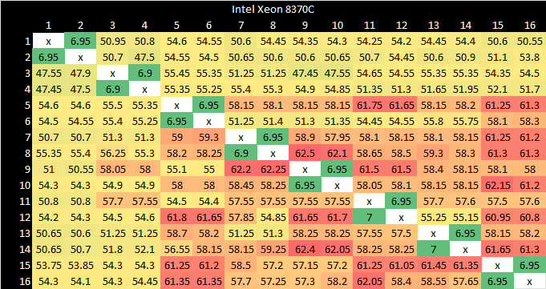

*图 19：Ice Lake 与 Sapphire Rapids 的矩阵呈现 Mesh 距离和拓扑分区。不同平台的核心编号不等于物理坐标，不能仅凭颜色格点断言路由。*

需要跨核转移 Cache line 的访问大约比 L3 miss 少一个数量级；它们确实存在，但这些平台的核间延迟仍低于 DRAM，文章因而没有把它视为主要风险。

### 体系结构视角：一致性延迟不是一条固定的“核到核导线”

原子交换可能经过请求核、目录/Home Node、持有脏副本的核心和应答路径；部分阶段可重叠，是否命中私有 Cache、Cache line 状态和拓扑距离都会改变结果。相邻编号出现相似值只能形成 Mesh Stop 配对假说。

若要验证，应分别测 Shared/Clean、Modified、跨 NUMA 与不同核心对，并同时观察 Snoop、Probe Retry、目录命中和 Fabric 排队。只有延迟台阶与这些事件一致，才能把瓶颈进一步归到一致性路径。

## 结语：移动大核向上走，桌面大核向下压

过去几十年，服务器核心长期来自客户端设计。2008 年 Xeon 甚至与 Core 2 共用 Die；2010 年代先以更大 Ring、更多 L3 和核心数区分，Skylake 后又在 L2 与向量结构上拉开。AMD 更像早期 Intel：复用同一核心，通过不同 Infinity Fabric 配置扩展服务器。

Arm 也在做同一件事。N1/N2 来自 Cortex，靠更大 Cache 与 Mesh 扩到高核心数。CMN-700 让它在系统形态上更像 Intel：跨核 Cache line 延迟稳定但不亮眼，L3 延迟和带宽偏弱，因此必须依赖高 L2 hitrate 把流量留在私有层级。AMD 的桌面 Chiplet 路线给出更强 L3，代价是 L3 miss 后更容易受 Infinity Fabric 限制。

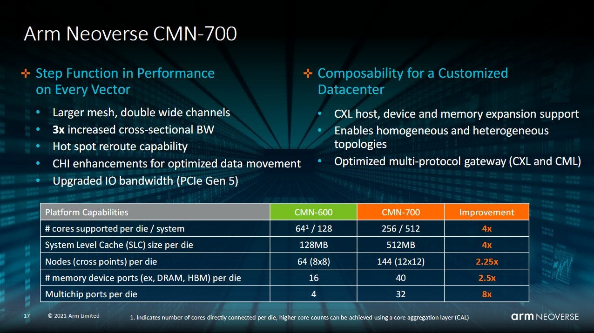

*图 20：Arm Hot Chips 幻灯片列出 CMN-600 到 CMN-700 的 12×12 Mesh、512 MB 系统级 Cache、144 节点和更多内存/PCIe 端口。它说明 IP 上限，不等于倚天 710 的具体配置。*

核心路线则从两端接近：Arm 给移动大核“打开油门”满足服务器性能，AMD/Intel 给桌面大核“收油门”换密度与能效。N2 单核能力仍弱于 x86 对手，整数代码最有竞争力，向量负载差距更大；移动出身带来的密度优势，则可能由更多核心补回来。

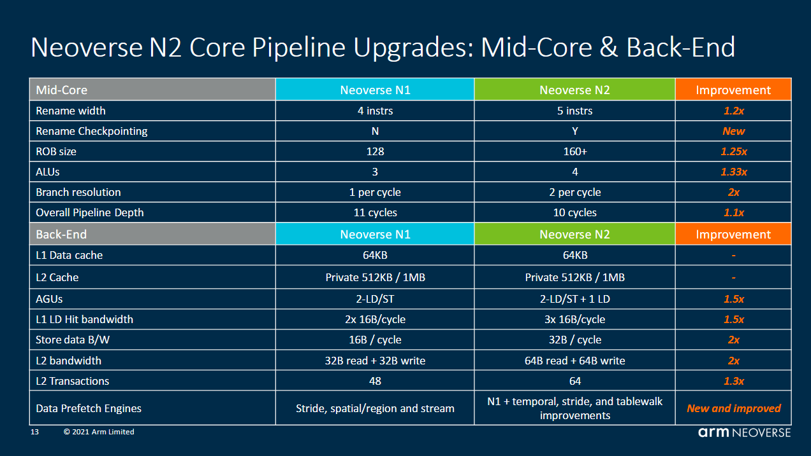

*图 21：Arm 给出的改进包括 Rename 4→5 宽、加入 Rename Checkpoint、ROB 128→160+、分支解析 1→2/cycle、L1D Load 2×16→3×16 B/cycle、Store 16→32 B/cycle、L2 读写各 32→各 64 B/cycle，以及更多 outstanding transaction 和预取能力。这里是官方代际对比。*

N2 是 N1 的明显升级：A710 比 A76 晚数代，更强乱序后端和 Memory-Level Parallelism 都被带进服务器。文章接受 Arm 以单核性能换更多核心的方向，但仍希望进展更激进：2019 到 2023 年，Zen 2→Zen 4 的 L2 TLB 从 2048 增至 3072，即使物理地址扩到 52 bit；Sapphire Rapids L2 增至 2 MB，而 Skylake/Ice Lake 为 1/1.25 MB。N2 却仍是 1 MB、13～14 周期 L2，频率也与 N1 相近，倚天 710 的 DRAM 延迟还比 Altra/Graviton 2 相对 x86 的表现退步。

这份担忧来自服务器市场的竞争史。K8/K10 Opteron 曾经强势，随后被 Nehalem/Sandy Bridge Xeon 压过；Intel 的长期统治又被 Rome、Milan、Genoa 逐步挑战。N1 获得立足点不等于 N2 可以只做到“足够好”。

到 2023 年，高密度也不再只有 Arm：Ampere 正推进最高 192 核的自研 Siryn，AMD Bergamo 达 128 核并可能带来更强单核，Intel Sierra Forest 当时传闻为 144 个能效核、发布日期尚未确定。文章依然看好 Arm 的执行能力，也期待 N3 尽快把正确方向上的改进做得更彻底。结尾提供 Patreon、PayPal 与 Discord 支持渠道。

## 体系结构视角：从 N2 得到的七点认识

第一，**服务器化首先发生在系统边界**。48-bit 物理地址、I-Cache 一致性、1 MB L2 与 CMN-700，往往比 ISA 增加一条指令更能决定核心能否进入大规模服务器。

第二，**宽度、窗口和调度容量必须成套看**。N2 前端可达 5 IPC，ROB 却只有 160 项；大 Scheduler 减少局部阻塞，却无法替代跨越长 L3 miss 的全局窗口。

第三，**预测吞吐与预测准确率不是同一件事**。N2 可在小分支足迹内处理两条 Taken 分支，Zen 4 则有更大的方向预测有效容量；真实收益取决于代码布局与分支可预测性。

第四，**在途条目不等于可调度条目**。NSQ 会让简单容量测试高估 Scheduler；只有构造能让独立操作腾出队列的微基准，才有机会拆开两者。

第五，**大 Mesh 把压力推回私有 Cache**。35 ns 级 L3 很难靠 160 项 ROB 隐藏，因此 64 KB L1、1 MB L2、预取和 MSHR 才是维持单核 IPC 的关键。

第六，**Chiplet 与 Mesh 是不同层级化答案**。AMD 用快环保住局部 L3，再把远端流量交给 Infinity Fabric；Arm/Intel 用统一 Mesh 换大规模与规则性。二者没有脱离工作集和拓扑的绝对优劣。

第七，**云实例尤其需要克制结论**。2.75 GHz 锁频、八个可见核心和未知物理映射足以研究单核结构，却不能代表 128 核芯片的完整带宽、功耗或拓扑。

## 参考资料

- Chester Lam, *ARM’s Neoverse N2: Cortex A710 for Servers*, Chips and Cheese, 2023-08-18：https://chipsandcheese.com/p/arms-neoverse-n2-cortex-a710-for-servers
- Chester Lam, *Correction for A710/Neoverse N2’s FP Scheduler Layout*, Chips and Cheese, 2023-08-20：https://chipsandcheese.com/p/correction-for-a710-neoverse-n2s-fp-scheduler-layout
- Arm, *Neoverse N2 Platform* 与 Hot Chips 资料
- Henry Wong, *A Superscalar Out-of-Order x86 Soft Processor for FPGA*
