# Centaur CHA 的 Die：用小核心给 NCore 和 I/O 腾出空间

> **文章来源**
>
> - 文章：*Examining Centaur CHA’s Die and Implementation Goals*
> - 撰文：Chester Lam
> - 首发：Chips and Cheese
> - 发布：2022 年 4 月 30 日
> - 链接：https://chipsandcheese.com/p/examining-centaur-chas-die-and-implementation-goals

CHA 是 Centaur 最后一颗 SoC，面向 Edge Server Inference：八颗最高 2.5 GHz 的 CNS x86 Core、2.5 GHz NCore ML Accelerator、16 MB L3、四通道 DDR4、44 条 PCIe Lane 和双路 Link。本文从 Die Area 看产品目标如何决定核心设计：不是“把大核缩小”，而是有意把 CPU 频率和 IPC 控制在适合密度的范围，把面积留给加速器和 I/O。

## 对比 Haswell-E：相似 I/O/核数，Die 只有略多一半

CHA 用 TSMC 16 nm、194 mm²；八核 Haswell-E 用 Intel 22 nm、355 mm²。

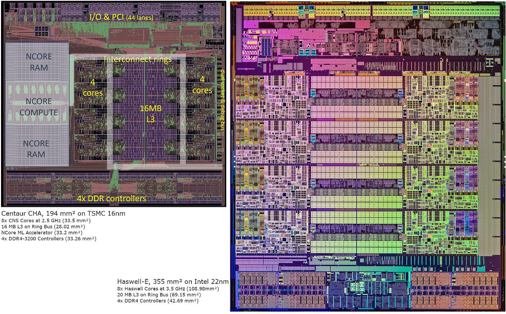

*图 1：两者均为八核、四通道 DDR4、双路；CHA 有 44 条 PCIe 通道，对方为 40 条；L3 为 16 MB 对 20 MB。工艺标称不可直接等比例换算，Die 图提供整体实现证据。*

Haswell Core 约占三分之一，加 L3/Ring 约一半，其余 I/O。

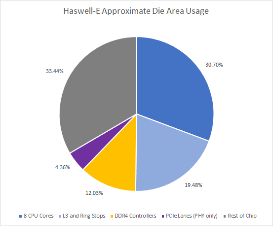

*图 2：另约 33.44% 主要为 PCIe/QPI Logic 与 Bus。*

CHA 的 I/O 也接近一半，但八颗 CNS 核心及其 L3 只占约三分之一；剩余空间容纳了面积约等于八颗 CPU 核心的 NCore。

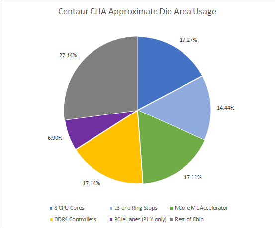

*图 3：未标面积主要是 Bus、I/O Control、Dual-socket Interconnect。NCore 显然是第一优先级。*

Haswell-E 要服务 HEDT，3 GHz 以上的 Single-thread 性能需要庞大的高频 Circuit；Broadwell 缩到 14 nm 后，Core 仍然很大。

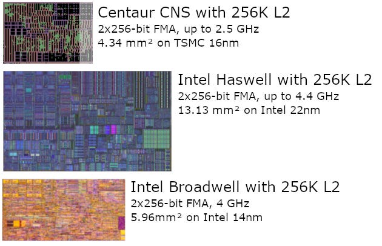

*图 4：高频 Library、长 Pipeline 与更多 Critical-path Logic 都付出面积。*

CNS 只瞄准低功耗 Edge Server，以小 Core 达到接近 Haswell 的 IPC，却无法继续抬频。

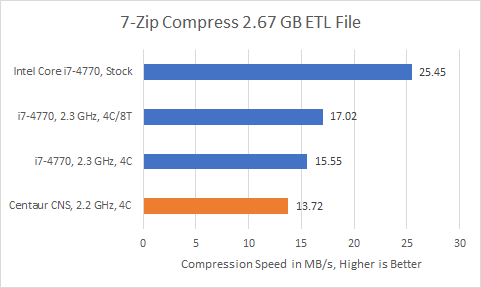

*图 5：Haswell Predictor 可追更长 History、Branch-heavy 7-Zip 更快；CNS 无文档 PMU，解释不能直接验证。*

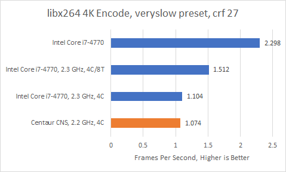

*图 6：约 14.67% 指令使用 AVX-512 时，CNS 同频接近 Haswell；解除频率限制后，Haswell 明显领先。*

Y-Cruncher 中 23.29% 指令为 AVX-512，`VPMADD52LUQ` 12.76%、`VPADDQ` 9.06%；前者无直接 AVX2 对应。

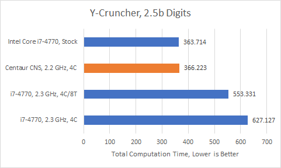

*图 7：同频 CNS 大胜，Stock Haswell 靠高频追平；Haswell SMT 也补偿部分面积密度。*

### 体系结构视角：Core Area 的“效率”必须绑定目标频率

低频可用 High-density Cell/SRAM、短 Pipeline、更简单 Adder 与更少 Buffer；高频则需 High-performance Library、Pipeline Register、Carry Lookahead 和更多旁路。比较 mm² 时必须同时列频率、IPC、Voltage 与 Workload，否则小核心未必在目标产品上更高效。

## 对比 Zeppelin 与 Coffee Lake：通用性也占面积

Zeppelin（GF 14 nm）包含八颗 Zen 1 核心、两组 4 核 + 8 MB L3，比 CHA 大约 9%，却只有一半的 DDR Channel，以及 32 条而非 44 条 PCIe 通道。

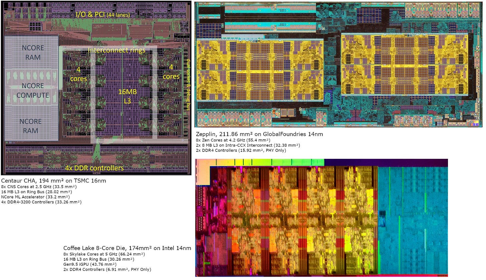

*图 8：三者节点近似但 Foundry/Library 不同，不作纯工艺归因。*

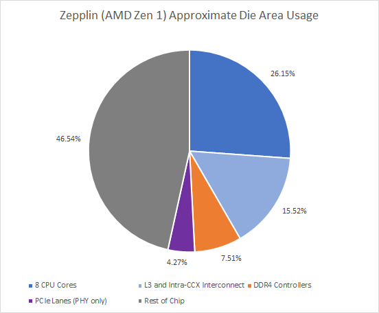

*图 9：L3 面积近似，TSMC 16 nm/GF 14 nm High-density SRAM 量级接近；Core Area 介于 CHA 与 Haswell-E。*

Zeppelin 还要兼任 Desktop/Workstation/Server Building Block：USB 3.1、PCIe/SATA Multi-mode、IFOP 都耗面积，却能由单 Die 扩展到四 Die EPYC（32 核、8 个 DDR Channel、128 条 PCIe 通道）。Zen 1 需达到 Desktop 频率，因此使用 128-bit Execution/Register，把 256-bit AVX 拆成两个 Uop，以节省 Vector Area。

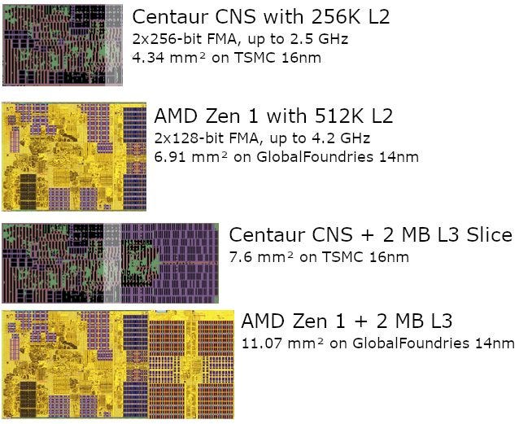

*图 10：Zen 1 不含 L2 已约 5.24 mm²，仍大于含 L2 的 CNS。*

Zen 1 以适中 IPC/频率和 SMT 平衡密度。

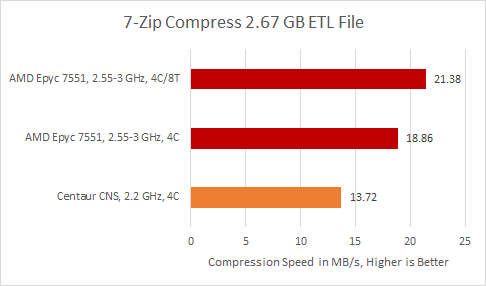

*图 11：Cloud VM 是平台边界。*

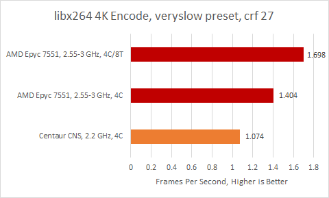

*图 12：Server Zen 1 Boost 低于 Desktop，却在轻线程和同频 IPC 都领先。*

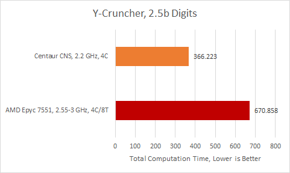

*图 13：AMD 的大 Vector Non-scheduling Queue 减少 Renamer Stall，价值超过 CNS 较高 Execution Throughput。重 Vector AVX-512 的 Y-Cruncher 则由 CNS 大胜。*

Coffee Lake 的 Core 与 L3 占据超过一半面积，约四分之一留给 iGPU；其 GPU 无论绝对面积还是占比都比 NCore 大，剩余部分才是有限的 I/O。

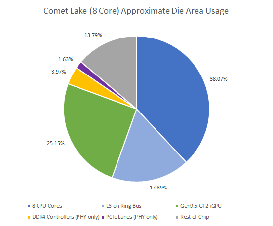

*图 14：窄 Client 目标让它在小 Die 里塞入更多 CPU Performance。*

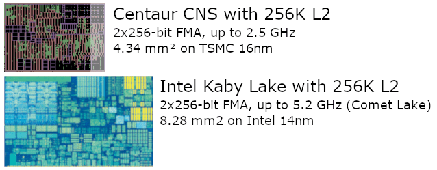

*图 15：同基本核心经 Process Tweak 提频，面积大于 CNS/Zen 1。*

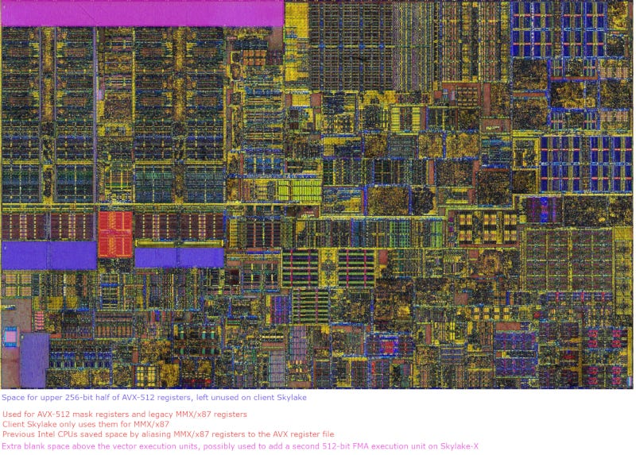

*图 16：Skylake Core 还为 AVX-512 Ready 留面积，让同一设计覆盖 Ultrabook 到 Server；这是设计复用换面积。*

## AVX-512：CNS 追求最低成本，Skylake-X 追求最大收益

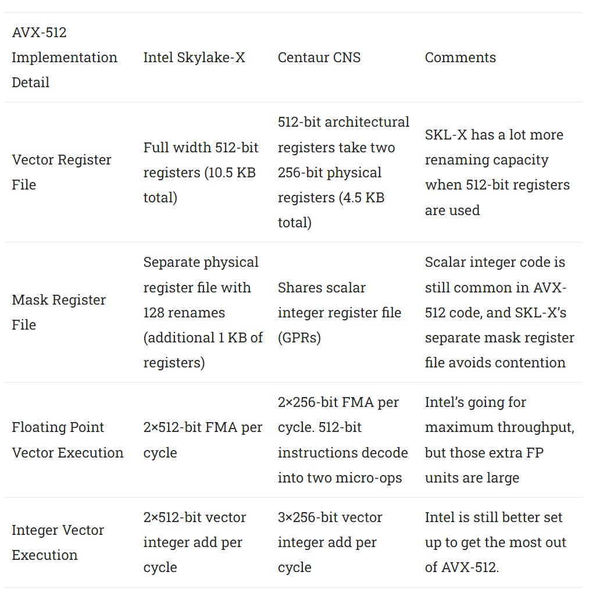

*图 17：CNS 扩展 RAT 处理 Mask Register、Decoder 识别指令，只增加重视的 Specialized Unit；不采用 Intel 那种全面加宽 Register/Execution。*

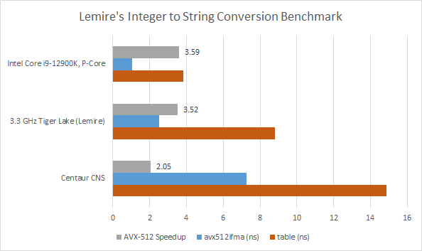

*图 18：灰条相对 Table Lookup；Skylake-X 不支持 AVX-512 Integer FMA 而未测。CNS 面积成本低，但仍能在匹配指令上明显加速，不代表所有 AVX-512 负载。*

## 设计逻辑：低频、最低限度 AVX-512、适中 ROB

Centaur 需要低成本 Edge SoC，又要 NCore、PCIe 和 Memory I/O，只能让 CPU 追求密度。高性能 SRAM Bitcell 的示例为 Samsung 7 nm 0.032 µm²，高密度版本为 0.026 µm²；高频还需要更深的 Pipeline 与更复杂的 Circuit。

CNS 只追求接近 Haswell 的 IPC，而非当时最新的 Skylake。ChampSim 对 7-Zip Trace 的 ROB Occupancy 显示，多数周期要么低于 200 项，要么直接接近填满。

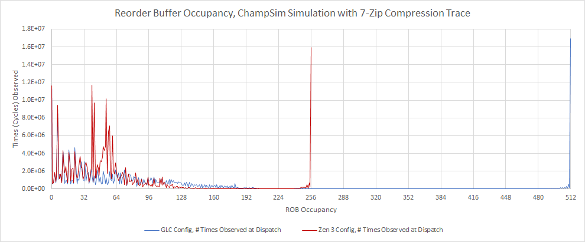

*图 19：GLC Baseline 来自站内旧 Cache Study，属于模拟而非 CHA PMU。*

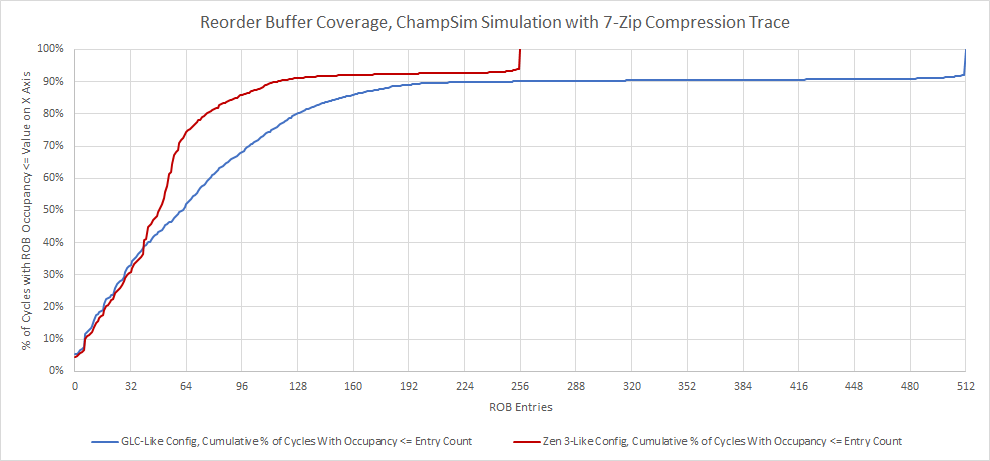

*图 20：超过约 200 项后开始收益递减；扩大 ROB 还必须扩大 RF/Scheduler/LSQ，否则别处会先满，面积增长不成比例。*

CNS 在 2.2 GHz Heavy AVX 下约为 65 W，2.5 GHz 时暴增到 140 W，显示已越过 Efficiency Knee，不适合消费者。CHA 每个 Socket 又只有八核，未使用 NCore 的程序也缺乏多线程竞争力。

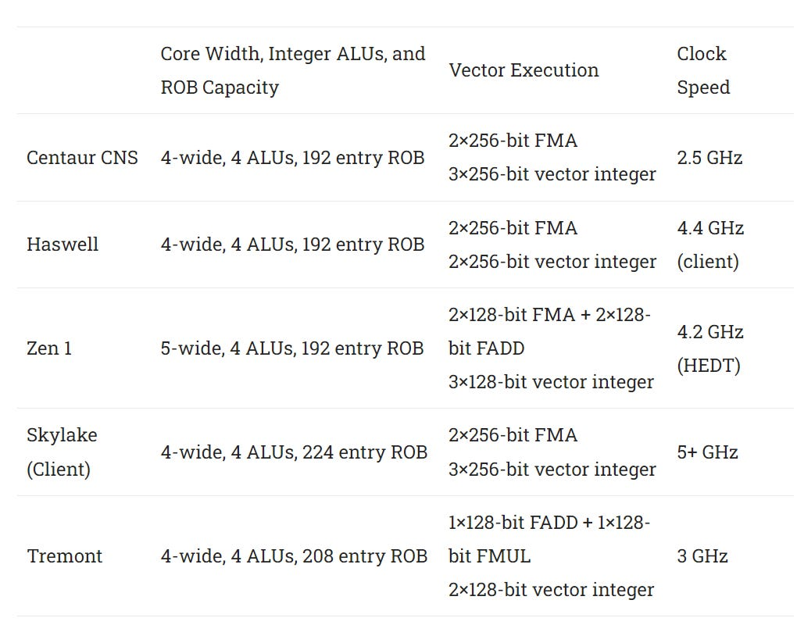

*图 21：关键结论是强 Vector Unit 可以放进小核，只要频率/IPC 目标按密度设定。Centaur 团队约 100 人、使用上一代节点，说明这类路线对有限资源可行。*

## 如果当年走另一条路

这是明确的 Speculation。若把八核 CPU Complex + Cache 复制四倍，约为 246 mm²；加上 I/O 后，32 核 CNS 仍可能比 28 核 Skylake-X 的 677.98 mm² 小得多。

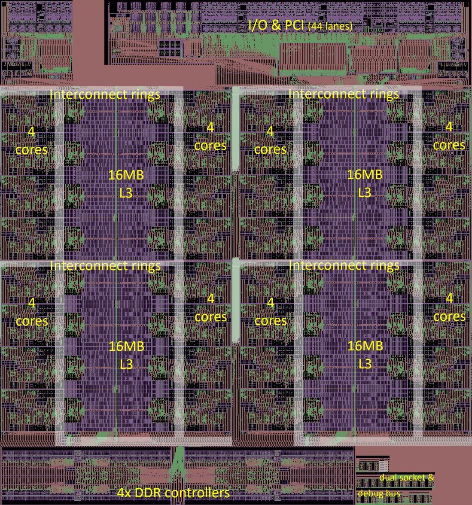

*图 22：MS Paint 可视化约为 372 mm²，不是可布线 Floorplan。2019 年前可凭低价和 AVX-512 与 32 核 Zen 1 EPYC 竞争，后者的 Vector 较弱。*

进入 Zen 2 与 TSMC 7 nm 时代后，AMD 拥有更大的 OoO 窗口、更快且更大的 Cache 和 256-bit Unit；逐核比较时，CNS 已没有胜算。

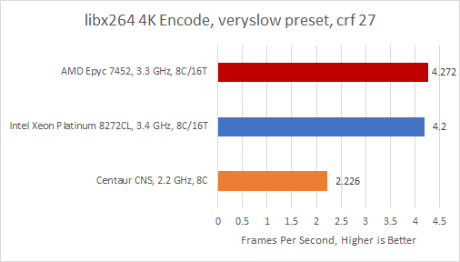

*图 23：即使 CNS 2.5 GHz 也明显落后。*

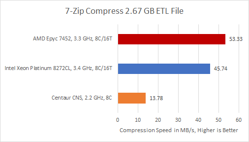

*图 24：CNS 从四到八核缩放异常差。*

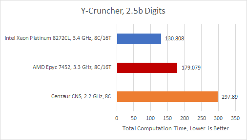

*图 25：Zen 2 仍靠高频 + SMT 领先；7 nm 又让单 Socket 可达 64 核。*

文章设想若 CNS 缩到 7 nm，可能成为带 AVX-512 的最小 CPU Core、类似 Altra 但 Vector 更强；被 Intel 收购后，其 Vector 技术也可能补 E-Core 的 AVX-512，解决 Alder Lake ISA 不一致。均为当时设想，没有后续实现事实。

## 参考资料

- Chester Lam, *Examining Centaur CHA’s Die and Implementation Goals*, Chips and Cheese, 2022-04-30
- Centaur Linley Presentation；Intel/AMD Die Photo 与公开规格
- ChampSim 修改版 ROB Occupancy 模拟
