# Centaur CHA 的双路实现：协议能跑，带宽却像没做完

> **文章来源**
>
> - 文章：*Centaur CHA’s Probably Unfinished Dual Socket Implementation*
> - 撰文：Chester Lam
> - 首发：Chips and Cheese
> - 发布：2022 年 4 月 23 日
> - 链接：https://chipsandcheese.com/p/centaur-chas-probably-unfinished-dual-socket-implementation

Centaur CHA 面向服务器，却只有八核；双路系统能把规模扩展到 16 核，因此很关键。集成 Memory Controller 让每个 Socket 拥有自己的 Memory Pool，远端访问必须跨 Socket Link，形成 NUMA。优秀实现不能消除远端惩罚，只能把额外延迟降到合理水平，并让足够多 Outstanding Request 填满长链路。

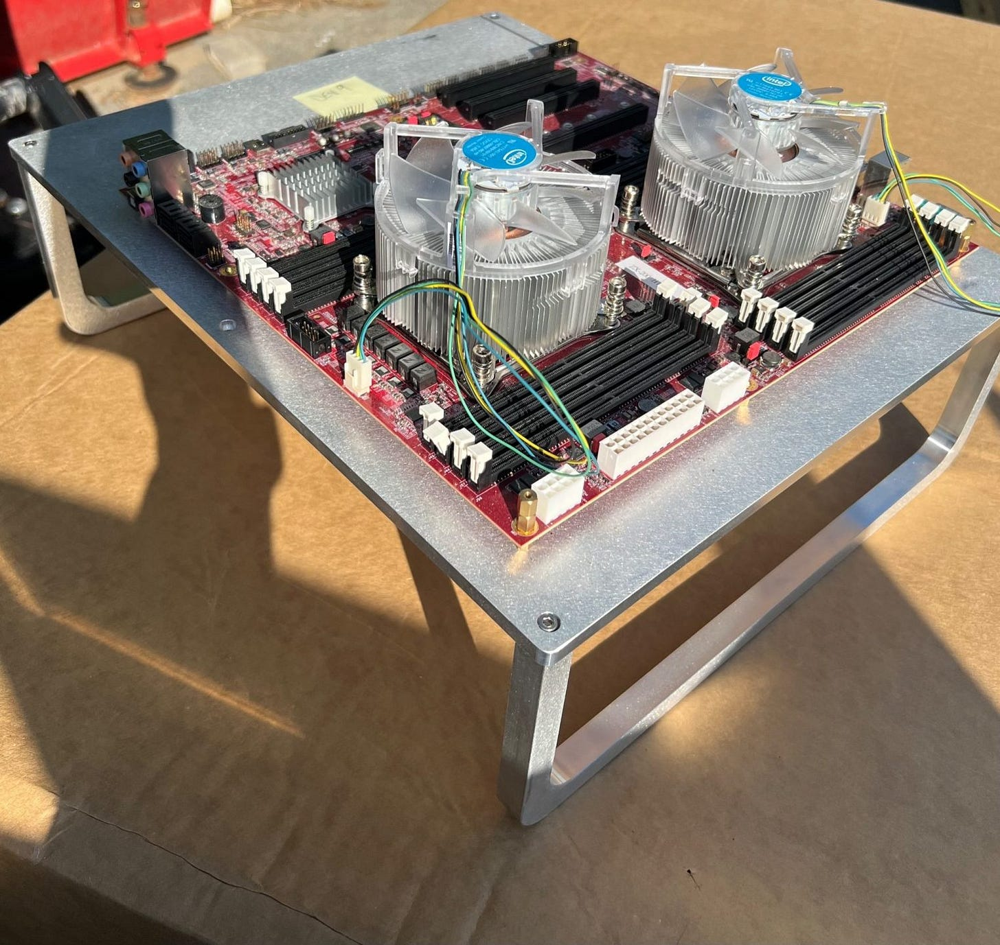

*图 1：每个 Socket 各有 CPU、DDR 与跨 Socket Coherence Link。*

## 远端延迟：额外约 92 ns

测试把 1 GB Array 分配到不同 Node，再由不同节点上的 Core 做 Pointer Chasing；1 GB 可越过 Cache，使用 2 MB Page 避免 TLB miss。多数 Client 使用 4 KB Page，因此这些数字用于隔离 NUMA，不代表应用的平均 Memory Latency。

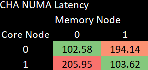

*图 2：跨 Socket 多约 92 ns，远端接近本地两倍。*

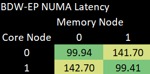

*图 3：Xeon E5-2660 v4、DDR4-2400 CL17；远端仅多 42 ns、慢 41.7%。更老的 Westmere 本地为 70.3 ns、远端为 121.1 ns，相差约 51 ns，也优于 CHA。*

Broadwell Cluster-on-die（CoD）把每个 Socket 分成两个 NUMA Node，每个覆盖一条 Ring + 双通道 DDR。Local 略快，但四个 Memory Pool 让路由复杂；同一 Die 跨 Node 竟多出近 70 ns，比跨 Socket 链路本身的影响更大。

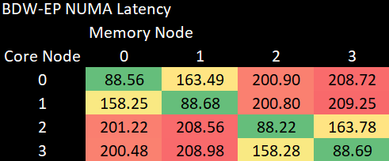

*图 4：CHA 只有两 Node 时显得平庸；Intel 同时选择三个 Remote Node 时也接近。*

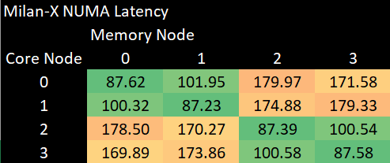

*图 5：AMD 每个 Socket 有两个 Node，同 Socket 跨半区只多 14.33 ns，跨 Socket 约 70～80 ns，说明快速 Directory 可显著降低 Home Routing 成本。Azure Cloud 结果含虚拟化边界。*

### 体系结构视角：NUMA 延迟包含“找 Home”与“走链路”

一次远端 Load 先需根据 Physical Address 找到 Home Agent/Memory Controller，再经过 Link、Remote DRAM，最后返回。Broadwell CoD 显示 Directory/Route Lookup 有时比物理跨 Socket 更贵。验证应做 Source Core×Memory Node Matrix，并改变 Home Address，而不是只报一个 Remote Number。

## 远端带宽：只有约 1.3 GB/s

Bandwidth 测试使用 3 GB Array 越过 Cache，只测 Read；CHA 为四通道 DDR4-3200。

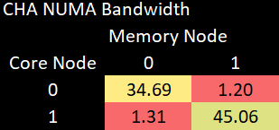

*图 6：远端略高于 1.3 GB/s，甚至低于优秀 NVMe 的顺序读取速度，明显不正常。*

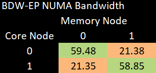

*图 7：每个 Socket 仅有一个 Node 时，本地接近 60 GB/s，远端为 21.3 GB/s；Westmere 三通道 DDR3 本地为 20.4 GB/s、远端为 11.2 GB/s，也远高于 CHA。*

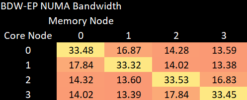

*图 8：每个 7 核 Node 的远端带宽仍高于 CHA；同一 Die 跨 Node 却约减半，显示内部 Ring/Home 约束。*

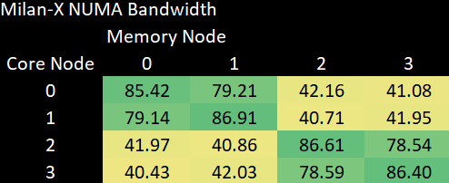

*图 9：八通道使本地带宽很高，同 Socket 另一半的带宽也保持良好，跨 Socket 时每个 NPS2 Node 仍超过 40 GB/s，接近 CHA 的本地带宽。*

长延迟链路要获得高带宽，必须按 `Bandwidth≈Outstanding Requests×Line Size/Latency` 提供许多在途 Miss。CHA 协议能访问远端，却似乎只有很浅的 Queue 或有限的 Credit。

## Cacheline Ping-pong：反而是 CHA 表现最好的一项

测试用 Locked Compare-and-exchange 在两核间反复修改同一 Line，以测量 Coherence Ownership Transfer。CHA 跨 Socket 约为 90～130 ns。

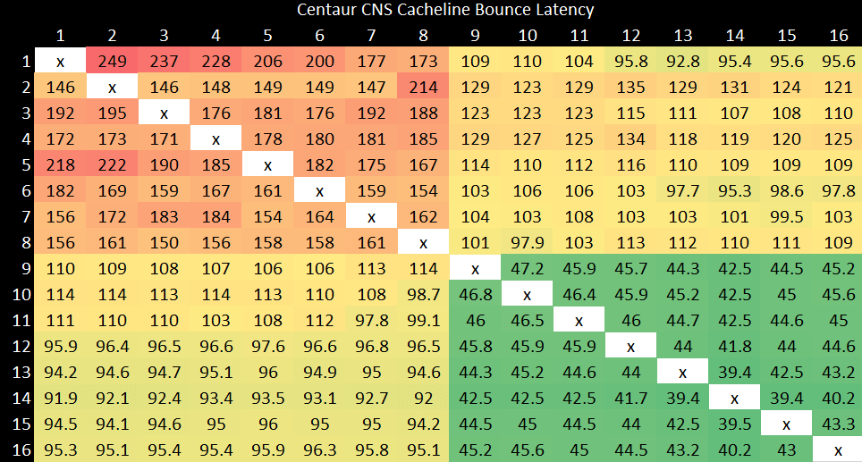

*图 10：若 Line Home 在远端，甚至同 Chip 两核也可能跨 Link Round-trip，形态类似 Ampere Altra；CHA 核少、拓扑简单，绝对值更低。*

Westmere 跨 Socket 更好，并可在同 Die 完成 Coherence，即使 Line Home 在远端 Socket。

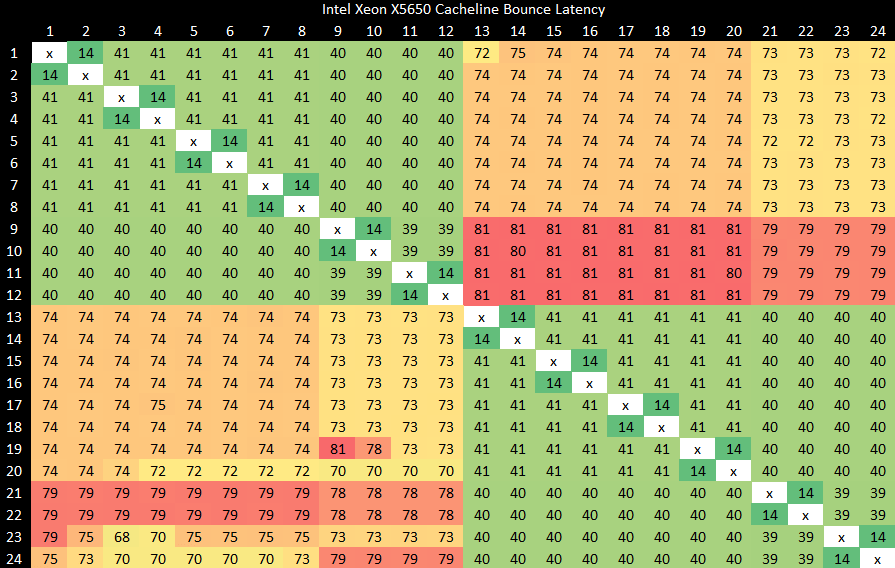

*图 11：Central Global Queue 简单，利于 Coherence；代价是普通 L3 延迟/带宽不如后来 Distributed Ring。*

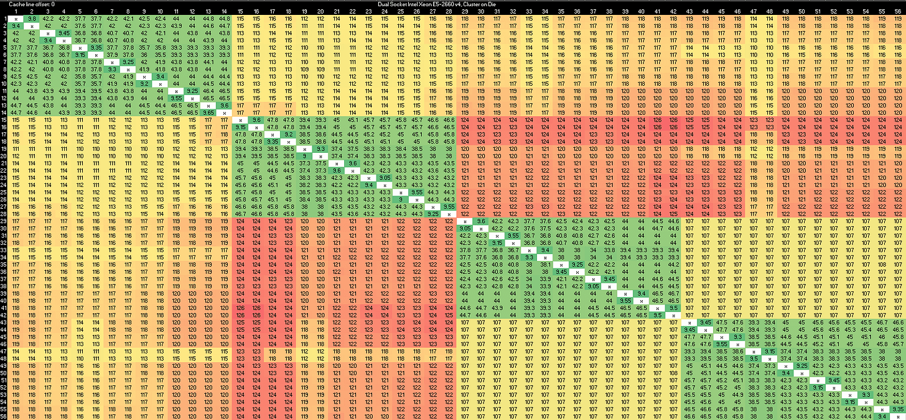

*图 12：同 Cluster 的 Inclusive L3 + Core Valid Bit 很快；L3 miss 后 Directory 较慢，同一 Die 跨 Node 已超过 100 ns，跨 Die 只再多 10～20 ns。*

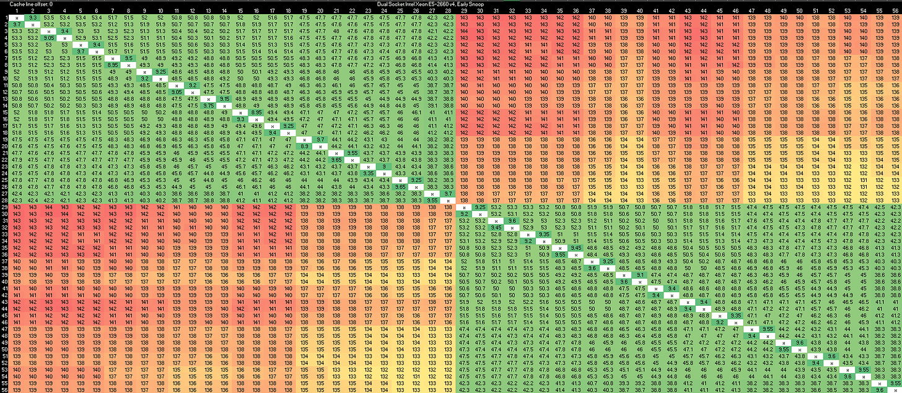

*图 13：同一 Die 内即使跨 Ring 也在 50 ns 以内，但跨 Socket 约为 140 ns，略差于 CHA。*

Milan-X 云实例的 Pinning 不够干净，结果大致与 AnandTech EPYC 7763 相符：同 CCX 很低、NPS2 内跨 CCX 约 90 ns、跨 NPS2 约 110 ns、跨 Socket 约 190 ns。CHA 在这项测试中优于 EPYC，说明协议/Directory 基本可用；但目前没找到实际应用明显受益于低 Ping-pong Latency，Contended Atomic 并不常见。

## 为什么判断“没做完”

CHA 每个 Socket 支持数百 GB Memory、四通道 DDR4 和 44 条 PCIe Lane，八核却偏少，双路本可补足。1.3 GB/s 会让 NUMA-unaware Workload 严重受损，也使通过跨 Socket Interleave 获取总带宽的模式不可行。

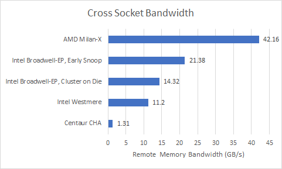

*图 14：使用该 Node 的全部 Thread，仍未把 Link 跑起来。*

文章猜测 Link 前有 Queue，但 Centaur 小团队忙于 Server 新技术，未完成验证或调优。

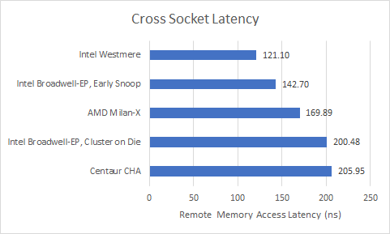

*图 15：Latency 尚合理，恰与“协议正确、并发深度不足”相符；仍不是内部 Queue 的直接证据。*

Centaur 已不存在，CHA 的双路潜力不会再完成。结论应保持边界：“Probably Unfinished”是由极低带宽、合理延迟与团队背景形成的判断，而非项目内部确认。

## 参考资料

- Chester Lam, *Centaur CHA’s Probably Unfinished Dual Socket Implementation*, Chips and Cheese, 2022-04-23
- Intel Broadwell/Westmere NUMA；AMD Milan-X NPS2 对照
- 测试平台由 Brutus 配置
