# 给主板芯片组做微基准：多绕一颗芯片，PCIe 延迟增加多少

> 英文标题：Microbenchmarking Chipsets for Giggles
> 撰文：Chester Lam
> 首发：Chips and Cheese，2026 年 3 月 22 日
> 链接：https://chipsandcheese.com/p/microbenchmarking-chipsets-for-giggles

从 Athlon 64 把 Memory Controller 收进 CPU，到 Sandy Bridge 把显卡 PCIe Lane 也直连处理器，Chipset 已逐渐退出性能关键路径。今天它仍承载大量 I/O，却通常只连接 SSD、Network Adapter 等高延迟设备。芯片组 Benchmark 未必指导日常选购，但能把平台拓扑中的每一跳具体量出来。

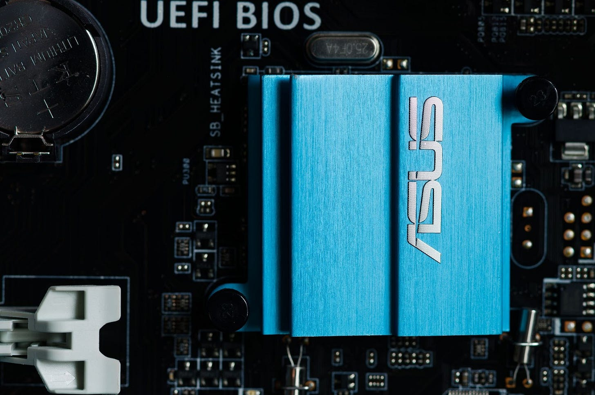

## 测量方法与边界

测试基于 Nemes 的 Vulkan GPU Benchmark，经修改后用 `VK_MEMORY_PROPERTY_HOST_COHERENT_BIT` 分配 Host Memory，并取消 `DEVICE_LOCAL`，让 Nvidia T1000 从 GPU 侧经 PCIe 读取 System Memory。重点是同一卡接 CPU Slot 与 Chipset Slot 的差异，而非 GPU 之间比较。T1000 为单槽卡，可安装在各平台底部 Slot。

除 FX-8350 使用 Windows Server 2016 与 Driver 475.14 外，其余为 Windows 10、Driver 553.50。

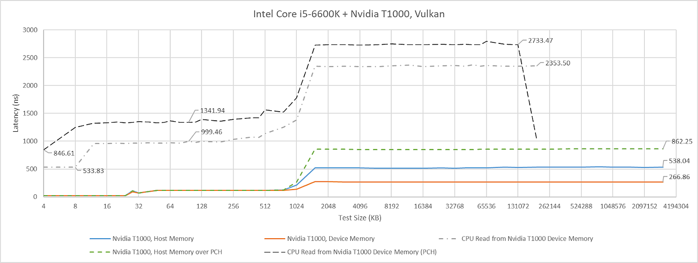

反向让 CPU 访问 VRAM 时，大工作集出现无法解释的拐点，Windows 指标显示大量 Page Fault，可能有 Driver Intervention，且不同 GPU 行为不一致。因此正文聚焦 GPU→Host，CPU→VRAM 只在文末作旁证。

## Host-coherent Memory 带来的 Probe 迷雾

`HOST_COHERENT` 让 CPU/GPU Write 无需显式 Flush/Invalidate 即可互见。T1000 却在命中自身 Cache 时也制造大量 Probe，Platform 可能因 Probe Throughput 限制 GPU Cache-hit Bandwidth。Piledriver 的 Integrated Northbridge PMU 显示，小工作集位于 T1000 Cache 时 Probe 洪峰明显；工作集变大、PCIe Bandwidth 限制后 Probe 下降。

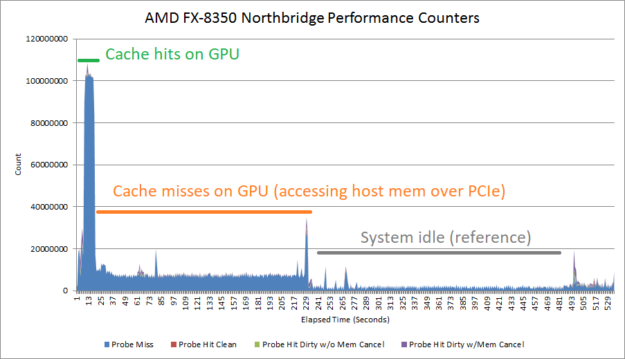

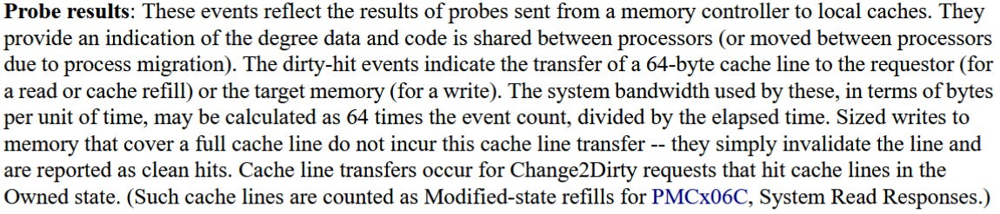

Probe 按 64 Byte Cache Line 工作，但观测速率更像 T1000 每 512 Byte Cache Hit 发一次；Cache-hit Latency 又未受影响。机制未确定，因此只标出平台影响，不对 Miss Bandwidth 解读。T1000 仅 PCIe Gen3 x16，即便新平台支持 Gen4/5，也不能测试更高 Link Rate。

### 体系结构视角：Coherent I/O 多了一条“控制流量”路径

GPU 数据命中本地 Cache，不代表平台完全不参与。为维持 CPU/GPU 可见性，Probe、Snoop Filter 或 Directory 仍可能交换 Metadata；所以 Payload 没过 PCIe，控制路径也可能限制表观 Cache-hit Bandwidth。没有 Transaction-level Trace 时，只能把 PMU 相关性写成证据，不能据此指定内部协议。

## AM5：一颗 PROM21 加约 570 ns，两颗更慢

AM5 的 PROM21 以 PCIe 4.0 x4 Uplink 连接 CPU。X670E 串联两颗 PROM21：Gigabyte X670E Aorus Master 的两个下方 PCIe Slot 接在第二颗；第一颗只服务 M.2/USB。ASRock B650 PG Lightning 只有一颗，并把 Slot 接到它。

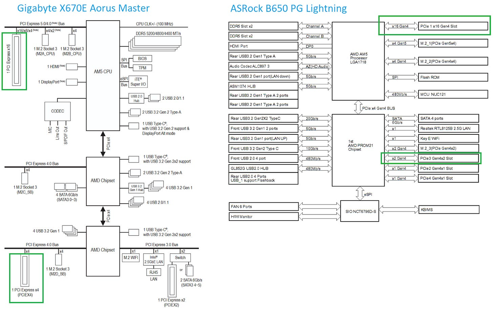

CPU Lane Baseline 约 650 ns；B650 经过一颗 PROM21 为 1221 ns，即增加 569.7 ns；X670E 经过两颗则比 Baseline 多 921.3 ns。

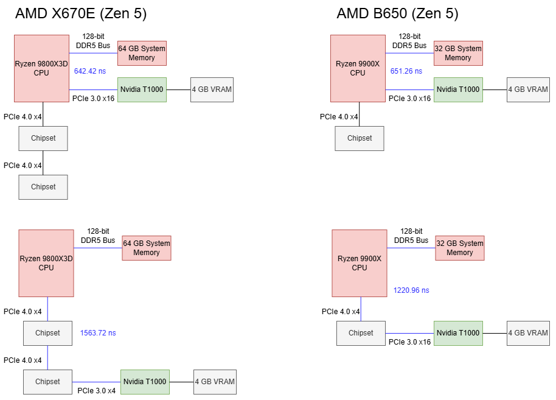

CPU Lane 上 T1000 Cache-hit Bandwidth 不变；换到 Chipset Lane 后降到略高于 25 GB/s，一颗或两颗 PROM21 差异很小。

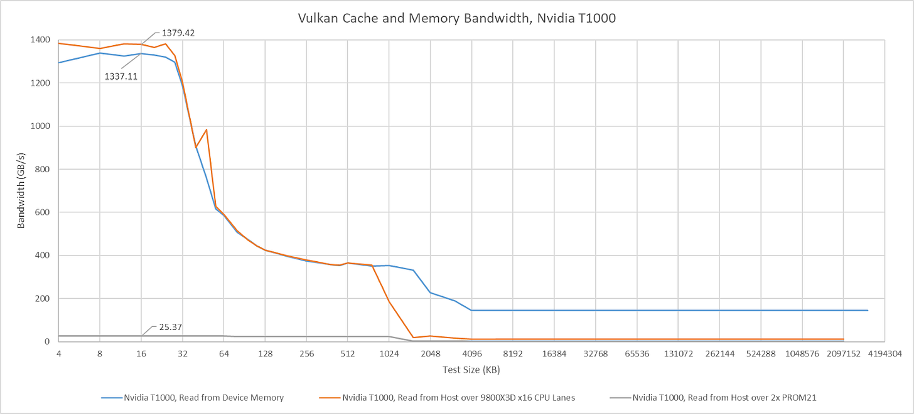

## Arrow Lake：Z890 PCH 也加约 550 ns

Intel 自 Sandy Bridge 起用 Platform Controller Hub（PCH）作 Southbridge，通过类似 PCIe 的 DMI 连接 CPU。Z890 的 DMI Gen4 为 8 Lane、最高 16 GT/s。MSI PRO Z890-A WIFI 顶部 x16 直连 CPU，另两条 x4 接 PCH。

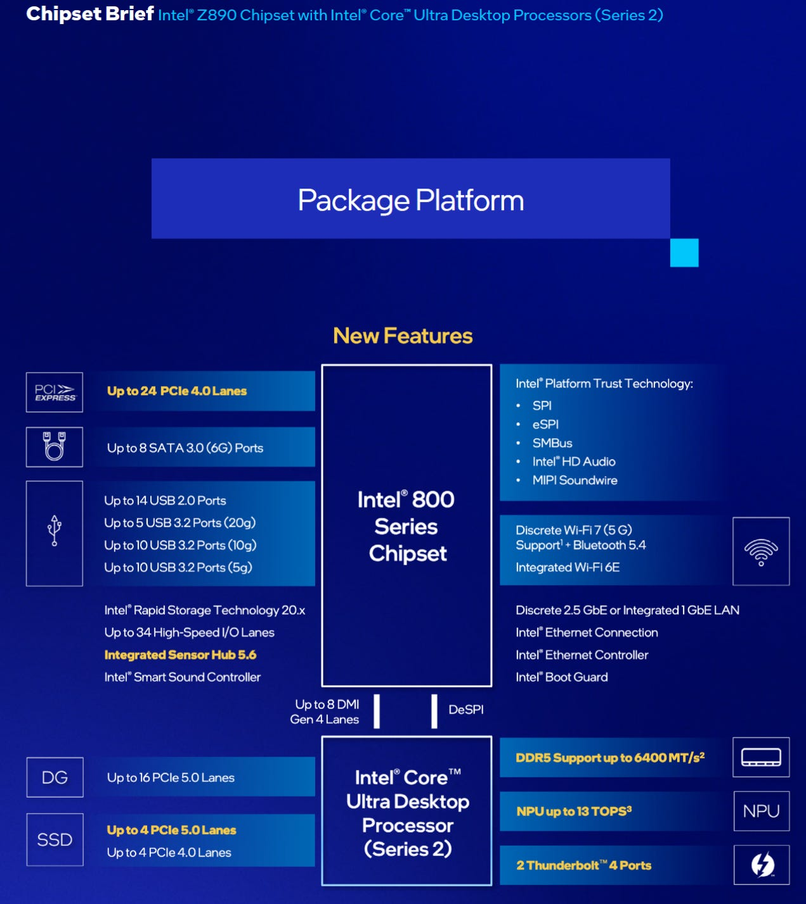

Arrow Lake Baseline 为 785 ns，比 Zen 5 高；经 PCH 再加约 550 ns，与单颗 PROM21 接近。

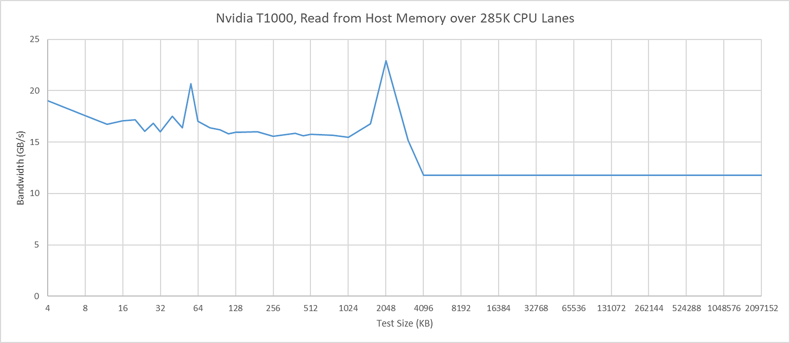

T1000 在 Arrow Lake 即使直连 CPU，Cache-hit Bandwidth 也不符合预期，因此不据此评价平台。作为对照，Arc B580 可保持完整 Hit Bandwidth，却又不能把 Host Memory 缓存在 L2，说明 GPU/Driver 也会改变观测。

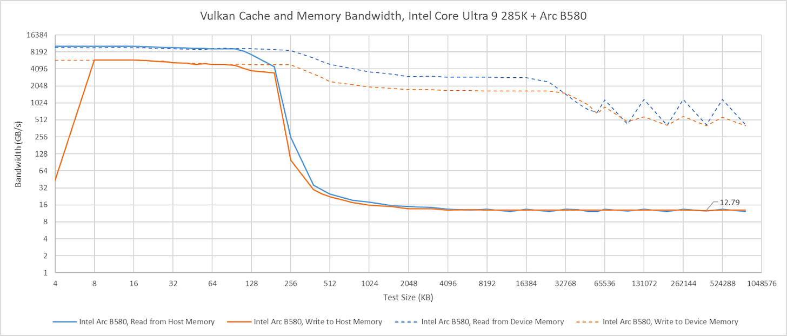

## Skylake：老 Z170 的 PCH Hop 反而较低

MSI Z170 Gaming Pro Carbon 顶部 x16 直连 CPU，中间 Slot 可把 16 Lane 拆成 2×8，底部 Slot 接 Z170 PCH。

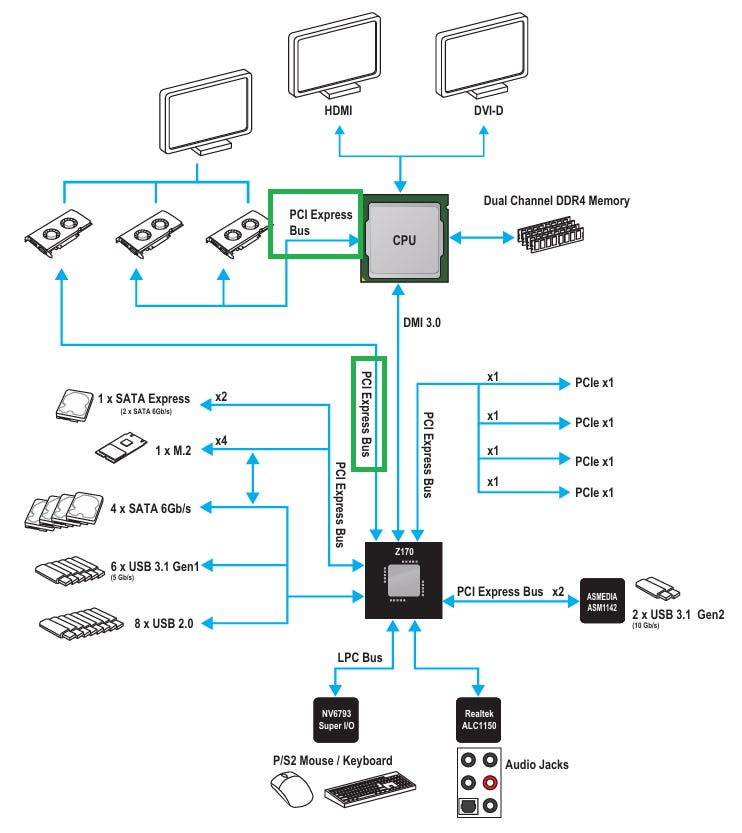

CPU Lane Baseline 535.59 ns，是所有现代平台里很好的结果；PCH 增加 338 ns，虽然远高于普通 DRAM Access，仍优于 AM5/Z890。

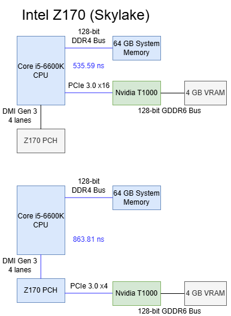

直连时 T1000 L1 Bandwidth 不变，L2 Hit 奇怪地稍低但仍远超 VRAM Bandwidth；经 PCH 后 Hit Bandwidth 降至略高于 51 GB/s。

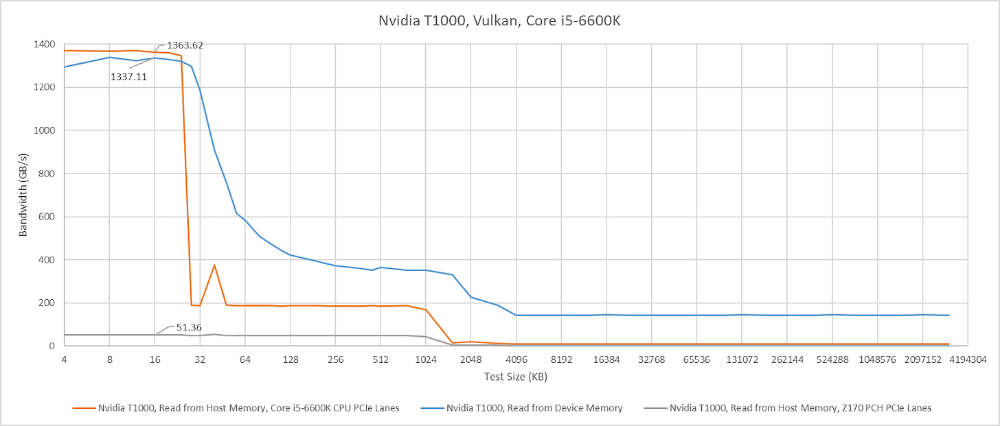

## AM3+：外置 Northbridge 也能给出合理延迟

Bulldozer/Piledriver 已把 Memory Controller 集成进 CPU，但 990X Chipset 仍负责全部 PCIe。ASUS M5A99X EVO R2.0 的 RD980 Northbridge 以 5.3 GT/s HyperTransport 连接 CPU，推测运行 16 bit Ganged Mode；两条 GPU Slot 接 RD980，可为 x16 或 2×8。RD980 再以基于 PCIe Gen2、5 GT/s 的 x4 A-Link Express III 连接 SB950 Southbridge。

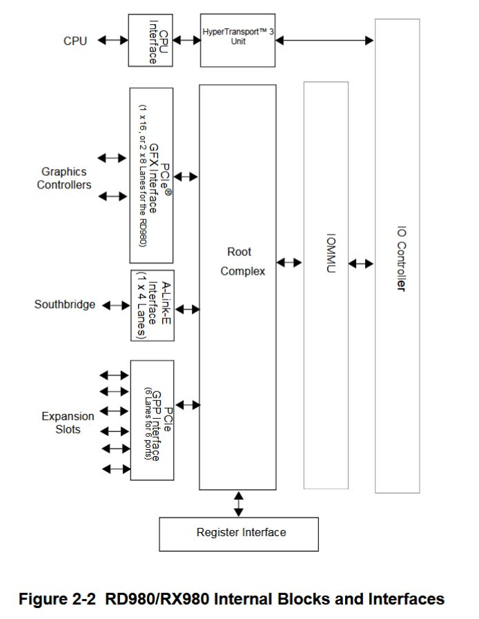

RD980 Lane Baseline 769.67 ns，介于 Zen 5 与 Arrow Lake，考虑 PCIe 并非直连 CPU，表现相当不错。

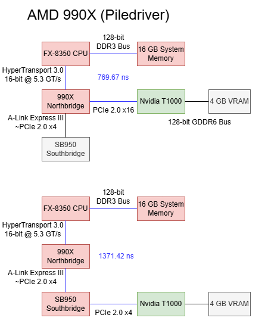

再经过 SB950 增加 602 ns，高于 Arrow Lake PCH/单颗 PROM21，却低于 X670E 双 PROM21。

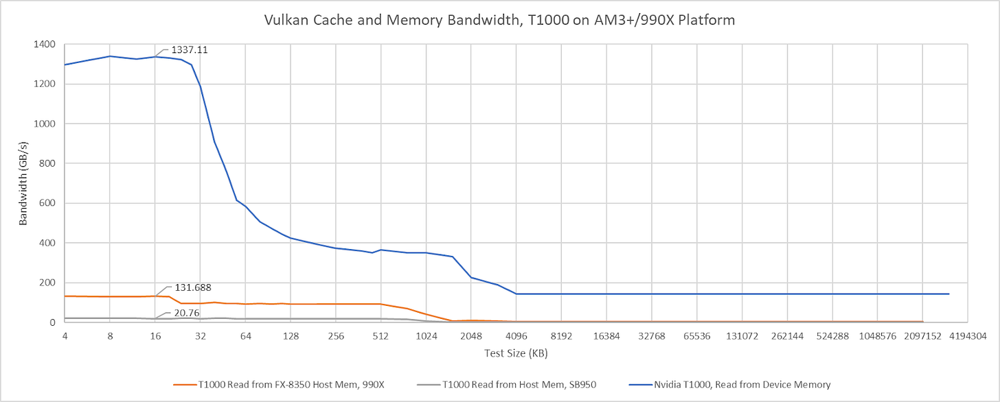

T1000 接 Northbridge 时 Hit Bandwidth 约 132 GB/s，接 Southbridge 略高于 20 GB/s。两者都超过真实 I/O 上限：HyperTransport 每方向仅 10.5 GB/s，说明这里测到的不是 Payload Bandwidth；若限制确来自 Probe，990X 的 Probe Capacity 约为饱和 I/O 所需的 10 倍，却仍覆盖不了 GPU 本地 Cache Hit Rate。

## 反方向验证

T1000 的 Host-visible Device Memory 在 CPU 侧为 Uncacheable，可能为维持 Coherence。小到 4 KB 时可避开 Address Translation Penalty/Page Fault，用于估计 CPU→VRAM Baseline。两种方向数值略有差异，平台排序没有根本改变。

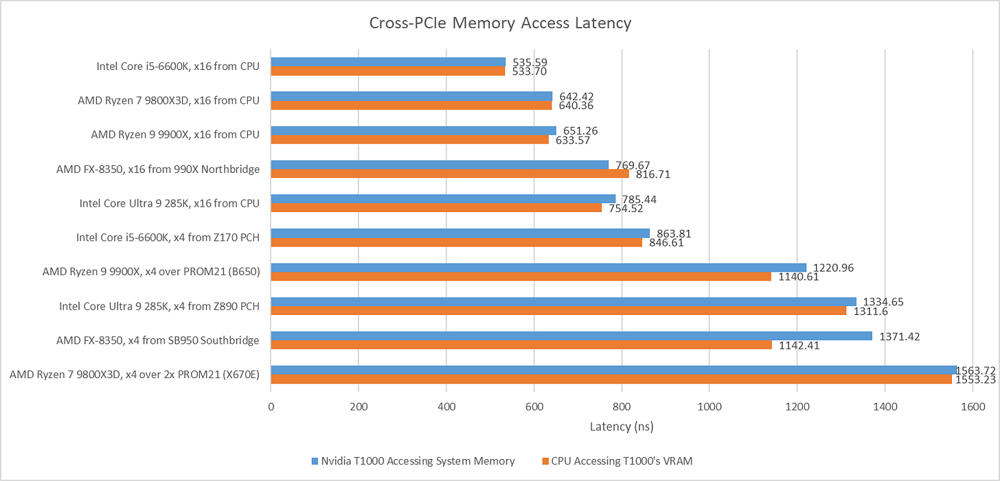

## 结语：数百纳秒很大，但对现代 Chipset 用途通常不重要

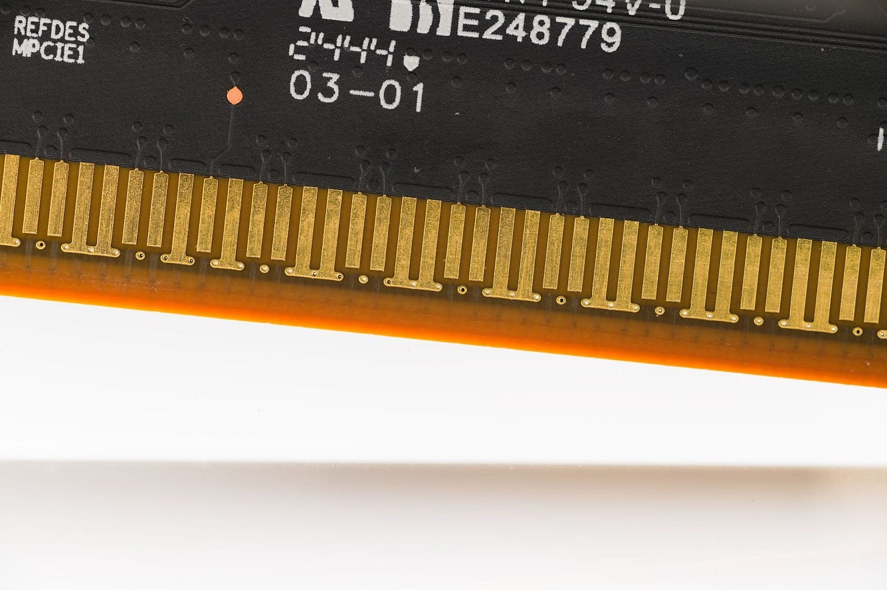

Chipset PCIe Lane 普遍多出数百纳秒，也可能限制 Coherent Probe Path。990X 表明外置 Northbridge 并非必然慢，但未来平台大概不会为此优化：Multi-GPU 已退潮，Chipset 主要连接本就有 μs 乃至 ms 延迟的 SSD、NIC，额外几百 ns 很难改变应用体验；GPU 又主要访问自身 VRAM，Host-coherent Cache Hit 是 Corner Case。

未来更可能优化成本、Connectivity 与新 SSD 所需带宽，而非 Chipset Latency。对实践而言，Latency-sensitive Accelerator 应优先使用 CPU-direct Lane；对普通存储和网络设备，则应先看 Lane Sharing、总带宽与设备自身延迟。

## 参考资料

- Nemes Vulkan GPU Microbenchmarks
- AMD PROM21、990X/RD980/SB950 Platform Documentation
- Intel Z890/Z170 Chipset Documentation
- Chips and Cheese：Microbenchmarking Chipsets for Giggles
