# Cinebench 2024：这个热门渲染跑分到底在测什么

> 英文标题：Cinebench 2024: Reviewing the Benchmark
> 撰文：Chester Lam
> 首发：Chips and Cheese，2023 年 10 月 23 日
> 链接：https://chipsandcheese.com/p/cinebench-2024-reviewing-the-benchmark

Cinebench 免费、容易运行，又能扩展到大量核心，因此长期占据处理器评测中心。但它首先测的是 Maxon 渲染器，并不自动等同于游戏或所有生产力软件。要理解分数，需要把动态指令、前端、乱序后端和内存系统逐层拆开。

## 指令构成：用了 AVX，却很少真正用宽向量

Intel Software Development Emulator（SDE）显示，Cinebench 2024 大量使用 AVX；标量整数指令仍占重要位置，类似 libx264，而非被 AVX-512 主导的 Y-Cruncher。AVX-512 比例小到对结果基本无关。

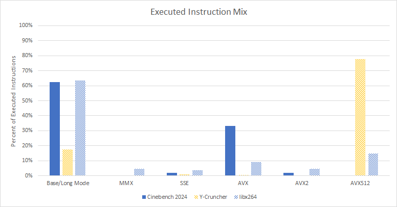

多数 SSE/AVX 数学仍是 Scalar，最常见的是 `VMULSS` 和 `VADDSS`。约 6.8% 指令对 128 bit Vector 做计算，256 bit 几乎消失。AVX 的价值在这里更多来自 Non-destructive Three-operand Format，而不是向量宽度。

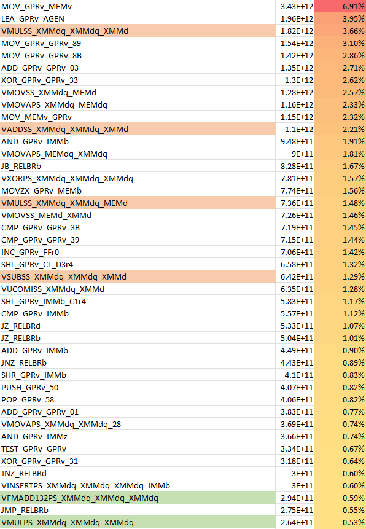

平均指令长度为 4.49 Byte。Haswell/Skylake 若维持 4 Micro-op/Cycle，平均需约 18 Byte/Cycle，而 Golden Cove 之前 Intel L1I 只能给 16 Byte/Cycle；幸好 Micro-op Cache 或其他更早出现的瓶颈通常会遮住这个上限。

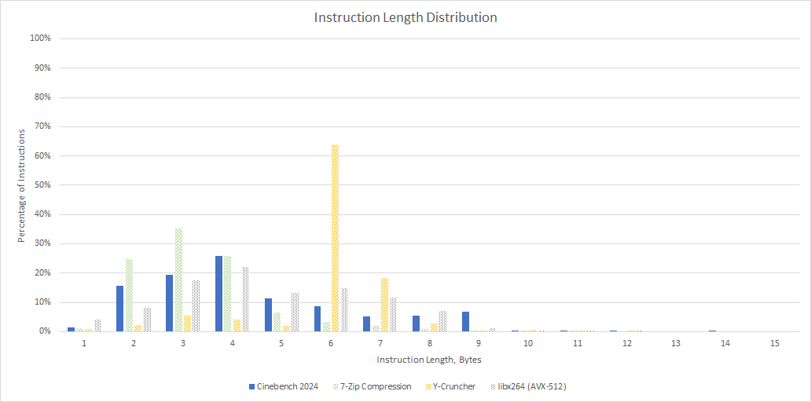

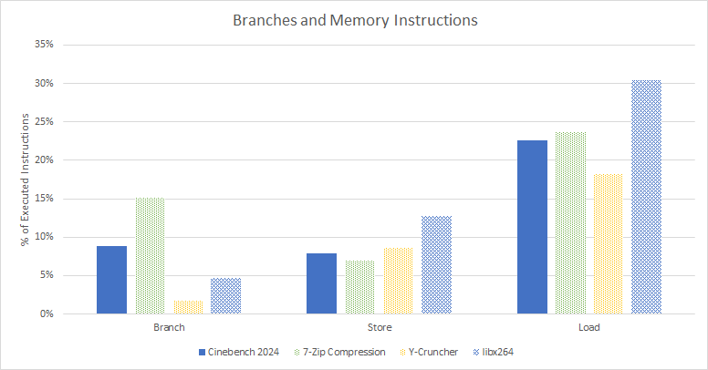

22.6% 指令读内存，7.85% 写内存，Branch 约 9%，Load/Store 约 3:1，处于 7-Zip 与 libx264 之间。

## 测试平台与总体吞吐

性能计数器主要来自 Ryzen 9 7950X/7950X3D，并以 Ryzen 9 3950X 和 Core i7-7700K 对照；Intel 侧也使用 VTune。Zen 2 缺少在 Rename 处逐 Slot 归因的 Event，相关结果是 Cycle-level Estimate，方法见文末。

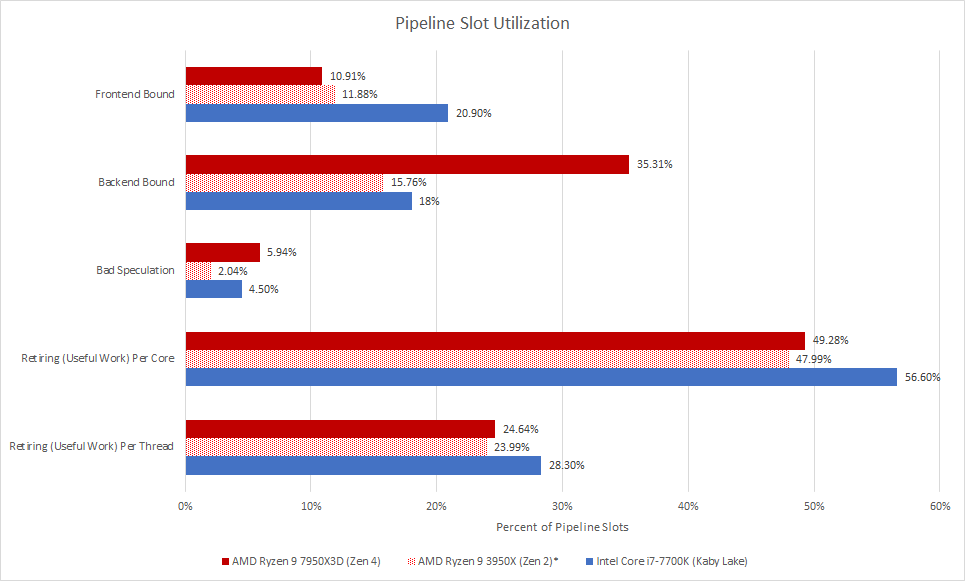

游戏常以前端压力为主，Cinebench 2024 在 Zen 4 上更多受后端限制；Kaby Lake 的前后端损失接近。7950X3D、3950X、7700K 每线程平均 IPC 分别为 1.44、1.20、1.07。测试占满 SMT，粗略翻倍后每核都超过 2 IPC，属于中等偏高吞吐，却仍没逼近核心宽度。

## 分支预测与 BTB

三种核心的 Branch MPKI 都低于 2，分支比游戏少且更可预测。

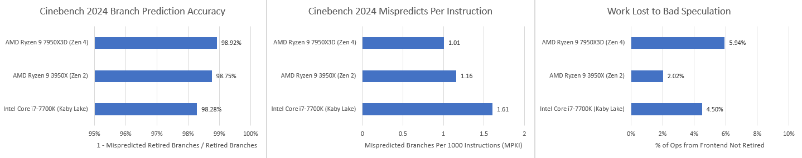

Zen 4 准确率最高，却可能损失更多 Wrong-path Slot：更快的前端和更大的后端窗口会在发现误预测前带入更多错误指令。也就是说，核心其他部分越强，残余误预测的浪费反而越大。

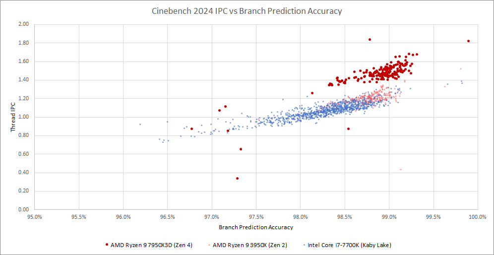

预测不只要准，还要尽早给出 Target。Zen 4 很少发生 L2 BTB Override，据此估计 Hot Branch Footprint 小于 1536 项，Taken Branch 很少承担额外 3 Cycle Pause。

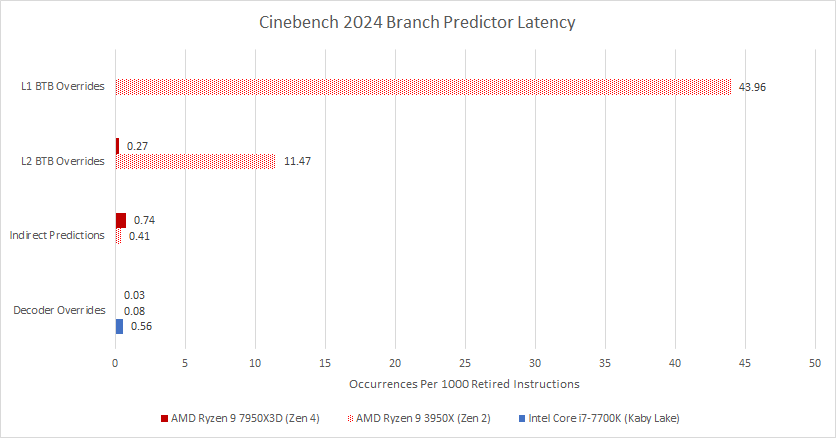

Zen 2 的 16 项 L0 BTB 可 Zero-bubble，但容量太小；多数落入 L1，仍有一部分命中慢速 L2，Taken 后形成 5 个 Bubble。Intel Haswell/Skylake 可对约 128 项 Branch 做 Zero-bubble，再由 4096 项 Main BTB 覆盖大多数 Target。

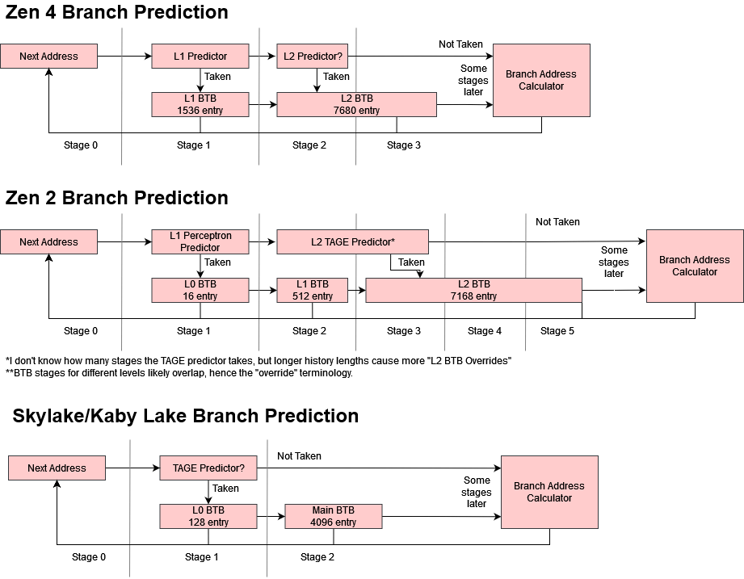

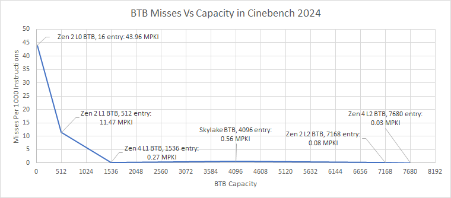

512 项仍不足，1536 项已覆盖大部热点，超过约 7K 后 Decoder Redirect/BAClear 接近消失。这个容量推断只适用于此运行轨迹，不能被解释成通用“最佳 BTB 大小”。

### 体系结构视角：更宽前端会放大每次误预测的成本

MPKI 只告诉我们错误次数，真正性能损失还取决于恢复延迟、每周期带入宽度和后端可容纳的 Wrong-path Work。对宽核而言，Predictor 只小幅提高准确率，也可能挽回大量 Slot；因此不能只拿不同核心的 MPKI 横向排名。

## 取指：代码溢出 Micro-op Cache，但多数留在 L2

Zen 4 的 144 项 Loop Buffer 在 SMT 时分成 2×72，Cinebench 几乎用不到，说明缺乏很短且极热的循环。Zen 2 没有 Loop Buffer；Kaby Lake 的 2×64 项因缺陷被禁用。

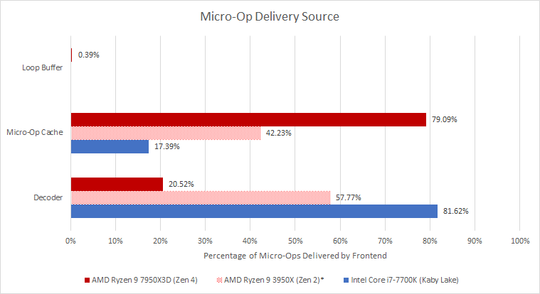

Zen 4 的 6912 项 Micro-op Cache 覆盖很好，但 Decoder 仍供给 20.52%；Zen 2 的 4096 项约与 Decoder 各半；Kaby Lake 仅 1536 项，覆盖低于 20%，四宽 Decoder 承担主力。

代码 Footprint 类似游戏，L1I 装不下，主要落在 L2。即便 Kaby Lake 只有 256 KB L2，也能让来自 L3 及更远层级的取指低于 0.1%。

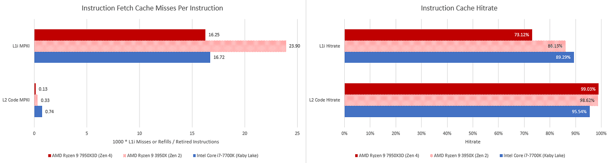

核心能以高吞吐从 L2 取代码，但功耗并非没有代价：L2 偏密度、访问能耗高于 L1，约每 17～25 Cycle 就有一次 Code Fetch。

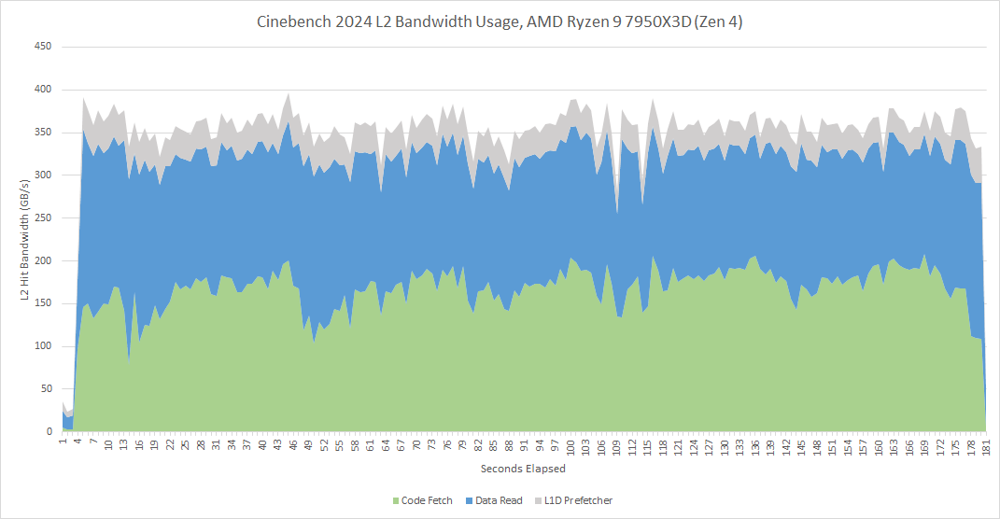

把数据访问算入后，L2 大约每 10 Cycle 收到一次请求。

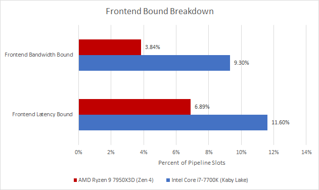

因此 Cinebench 对前端比游戏温和，但仍奖励强 Predictor、大 Micro-op Cache，以及能在 L1I Miss 时继续沿正确路径工作的 Decoupled Frontend。

## 乱序后端：先看 Scheduler，再看队列和 ROB

Rename 为指令分配后端资源。AMD 两代都没有某个单一结构长期压倒性满载，ROB 却常满；这未必是坏事，反而说明其他队列让核心能把窗口用足。Store Queue 相对突出，Zen 2 也有若干 Scheduler-related Stall。

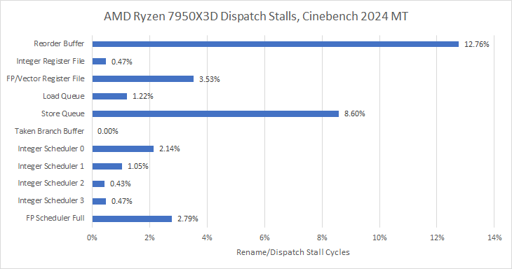

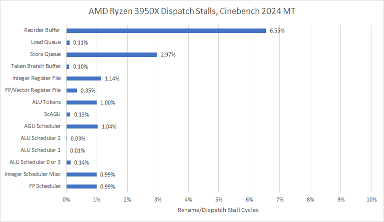

Kaby Lake 用 58 项 Unified Scheduler 同时服务 Integer/FP，Memory Address Generation 另有统一队列。Intel Load 在 Retirement 前不能离开 Load Buffer，而 AMD Load 可提前离开 Load Queue。除 Store Buffer 外，多数 Kaby Lake Event 没有公开，沿用旧架构 Event 的结果需谨慎。

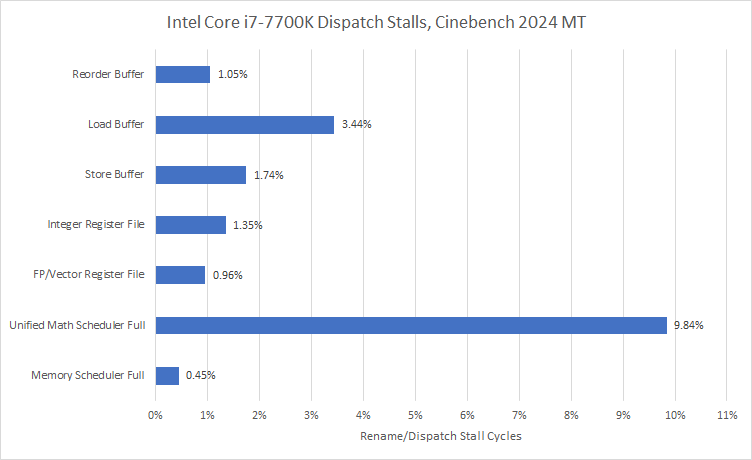

Cinebench 约 37% 为 FP/Vector。Zen 2 有 64 项分布式 Integer Scheduler，加 36 项 FP 共 100；Zen 4 为 96+64，共 160，明显高于 Kaby Lake 共享的 58 项。因而测试先受益于 Integer 与 FP 的总调度容量，随后才是更大的 Load/Store Queue 和 ROB。

## 执行端口：没有谁真正被打满

AMD 没有完整公开 Integer Port Counter，主要观察 FP Pipe Assignment。

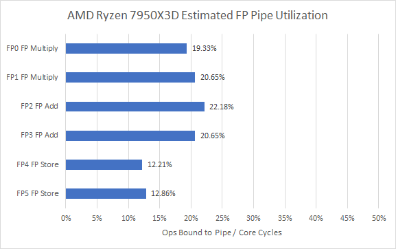

Zen 4 的加法、乘法 Pipe 承担主力，两条 FP Store Pipe 很轻，更适合看成“Store 卸载后的增强四管线”。Zen 2 的 FP2 同时做 Add 与 Write，负载最高但刚过 30%，并未饱和。

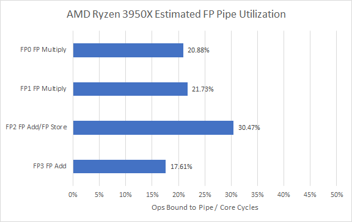

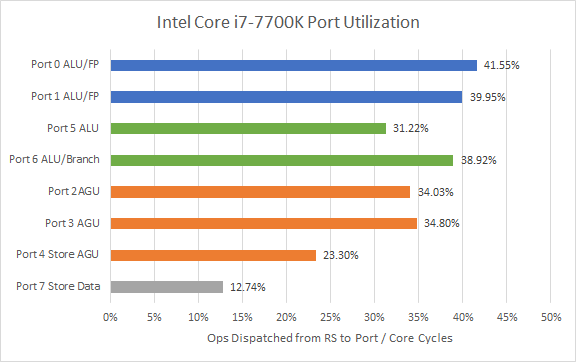

Kaby Lake 双 FP Pipe 较忙但不构成硬瓶颈，整体操作分布也合理；结合 Port 5/6，可推断 AMD ALU 数量对该负载同样够用。

## Cache 与 DRAM：比旧 Cinebench 更像现代负载

Zen 4 看似 Memory-bound Slot 更多，还受六宽分母影响；宽核更难把每个 Slot 都填满，不意味着绝对内存性能更差。

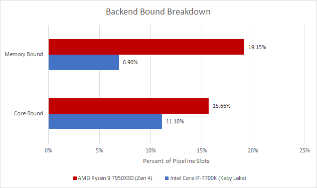

数据访问比游戏规则得多：L1D 偶尔 Miss，L2 捕获绝大部分；但一旦穿过 L2，继续穿过 L3 的概率不低。

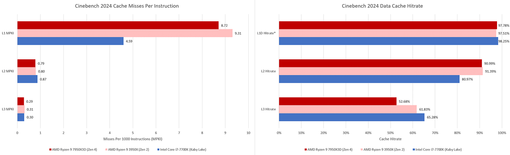

与 R15/R23 相比，2024 的 Data Footprint 更大、DRAM Traffic 更高。单核 LLC Miss 仍低于游戏，但所有核心同时运行会把带宽需求相乘。

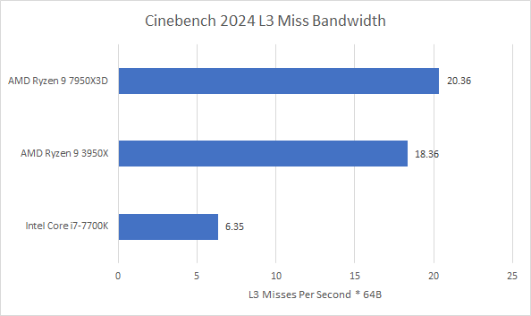

对照而言，Call of Duty Cold War 约 8.5 GB/s，ESO 低于 4 GB/s。Zen 4 的双通道 DDR5-5600 可以承受；Zen 2 测试平均占 DDR4-3333 理论带宽的 34.5%，Queueing 拉高延迟，小 Buffer/Queue 更难遮蔽。

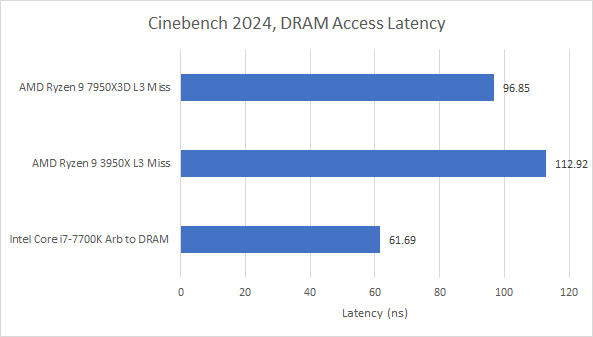

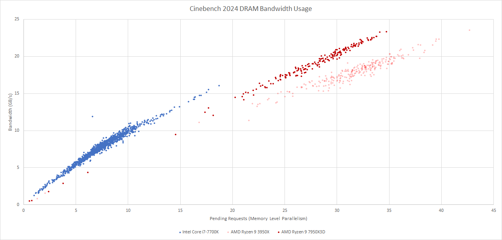

7700K 的 DDR4-2400 最慢，但四核总需求低，延迟变化不大；假想把同样单核需求扩到 16 核，才可能撞上 Bandwidth Limit。

### 体系结构视角：多核跑分必须把“每核局部性”和“整机并发流量”分开

单线程 L3 MPKI 不高，不代表全核渲染不吃内存。核心数把独立 Miss Stream 叠加后，Memory Controller Queue、DRAM Bank Parallelism 和通道带宽才开始决定 Scaling。比较两颗不同核心数 CPU 时，总分同时包含 Core Performance 与 Uncore/Memory Provisioning，不能全部归因于前端或执行宽度。

## 计数器口径与结论边界

Zen 2 的 Frontend-bound 用 Micro-op Queue Empty 估计，Backend-bound 为两组 Dispatch Stall 相加，Cycle Granularity 会低估没有填满 Rename Width 的前端损失。Retiring 分母按每周期 5 条 Instruction，而不是可处理 6 Micro-op 的 Rename Width；7700K 与 7950X3D 分别按 4、6 Micro-op/Cycle。

AMD Demand Refill 会包含 Speculative Access，Intel 在 Retirement 标记 Load 的 Data Source；误预测路径上的 L1D Miss 前者可能计入、后者不计。两者都只把一条 64 Byte Cache Line 的首个请求算 Miss，命中 Pending Refill 不重复算。

DRAM Latency 也从不同位置测量：Zen 4 在 L3 对 Miss 抽样，Zen 2 以 Pending L3 Miss 和 In-flight Count 结合 Little’s Law，Kaby Lake 在 System Agent Arbitration Queue 测量，后者不含 On-chip Interconnect，图 25 只适合看各平台负载变化，不适合绝对横比。

AMD `FP pipe assignment` 在 Rename 时计数，Intel 是 Scheduler 发往 Port 时计数。Zen 4 的 512 bit Operation 是一个 Micro-op 却要占两次 Issue Cycle，会令该事件低估实际使用；所幸 Cinebench 2024 几乎不用 AVX-512。这个 Event 从 Zen 2 以后 PPR 中移除，但定向实验显示仍能工作。

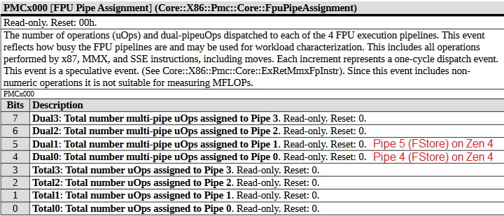

## 结语

Cinebench 2024 是中等 IPC、较大代码与数据 Footprint 的全核渲染负载。控制流比游戏容易，代码却会溢出 L1I/部分 Micro-op Cache；数据会穿过 L3 并产生约 20 GB/s 级流量。它奖励 Predictor、Micro-op Cache、Integer/FP Scheduler、ROB、Load/Store Queue 和多核内存系统的平衡。

它不像游戏，也不像被宽向量或纯带宽主导的 Y-Cruncher；和视频编码更接近，但 Vector Emphasis 更弱。相较 R23，新版更关注 DRAM，却仍很少用 256/512 bit Compute。因而 Cinebench 2024 是一个不错但不完备的 CPU Benchmark：分数应配合版本、线程数、内存配置、功耗限制和其他类型负载一起阅读。

## 参考资料

- Maxon Cinebench 2024
- Intel SDE、VTune
- AMD/Intel Performance Monitoring Events
- Chips and Cheese：Cinebench 2024: Reviewing the Benchmark
