# Cortex-X925：Arm 的桌面级高性能大核

> **原文信息**
>
> - 原文：*Arm's Cortex X925: Reaching Desktop Performance*
> - 副标题：*A big, high performance core from Arm*
> - 原作者：Chester Lam
> - 首发平台：Chips and Cheese
> - 原文日期：2026 年 3 月 3 日
> - 原文链接：https://chipsandcheese.com/p/arms-cortex-x925-reaching-desktop
> - 内容性质：第三方独立技术分析，非 Arm、Nvidia 或 Dell 官方材料

桌面和笔记本需要在大量不同类型的负载中维持很高的单线程性能。要设计出满足这种要求的 CPU 核心并不容易。AMD 和 Intel 过去主要依靠高频率、高吞吐以及大型乱序执行引擎占据高性能市场；Arm 则长期优先考虑低功耗和小面积，并不一味追求峰值性能。不过，从 2012 年推出首个 64 位核心 Cortex-A57 开始，Arm 持续增加核心复杂度，也不断向更高性能的市场扩展。如今，追上 Intel 和 AMD 最强核心已经不再只是遥远目标。

【作者判断】Nvidia GB10 中的 Cortex-X925，在作者的测试里达到了 AMD Zen 5 与 Intel Lion Cove 高端桌面实现的性能水平。这使 Arm 不但拥有足以进入笔记本市场的核心，也有机会进入对单线程性能最敏感的桌面应用。GB10 集成十个 X925，分为两个簇；其中一个核心最高达到 4 GHz，其余核心约为 3.9 GHz。测试设备是 Dell Pro Max 系列中的 GB10 产品。

## 测试平台与结论边界

本文主要对象是 Dell Pro Max 中的 Nvidia GB10：十个 Cortex-X925 分成两个簇，测试图表标注每核 2 MB L2、整颗测试配置具有 16 MB L3。总体性能对照包括 AMD Ryzen 9 9900X（Zen 5、32 MB L3）、Intel Core Ultra 9 285K（Lion Cove、36 MB L3）、Ryzen 7 9800X3D（Zen 5、96 MB L3）、AWS Graviton 4（Neoverse V2）和 Azure Cobalt 100（Neoverse N2）。部分分支与前端微基准使用 Ryzen 7 9800X3D，而不是总体图中的 Ryzen 9 9900X。

SPEC CPU2017 图表明确标为估算的 `intrate-1` 与 `fprate-1` 成绩。原文没有集中列出所有平台的操作系统、内核、编译器版本、优化参数、二进制构建方式、内存时序、功耗限制、预热、重复次数和误差范围。因此，这些数据适合分析作者所测配置的结构特征和性能趋势，不应写成跨平台的官方排名，也不能由单个子项直接推导整套 ISA 或产品生态的优劣。

下文采用以下证据边界：

- **Arm 公开资料**：技术参考手册（TRM）和优化指南明确给出的接口、容量或配置选项；
- **作者实测**：Chester Lam 在 GB10 及对照平台上通过微基准、PMU 和 SPEC CPU2017 得到的数据；
- **作者推断**：根据曲线拐点、资源极限和公开材料解释出的内部结构；
- **未确定项**：公开来源彼此冲突，或测试无法唯一确定的参数，保留其不确定性。

## 一、核心总览：一颗真正面向峰值性能的大核

Cortex-X925 是一颗规模很大的十宽核心。它拥有比 AMD Zen 5 更大的实用在途指令容量，L2 容量则达到近年 Intel P-Core 的级别。与 Arm 的 7 系列中核不同，X925 很少为了面积和功耗作明显收缩，它从前端到后端都围绕峰值性能设计。

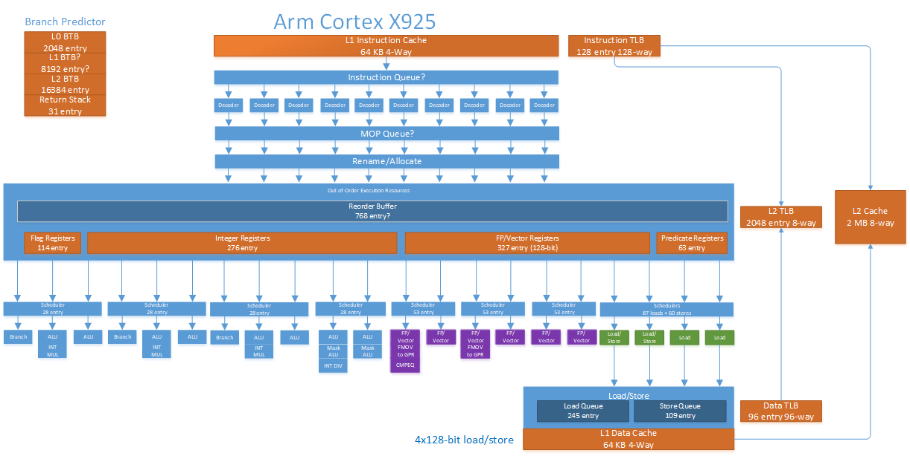

*图 1：原作者根据公开资料和微基准整理的粗略框图。图中包含十路译码、四个 28 项整数调度器、三个约 53 项 FP/向量调度器、约 87 项 load/60 项 store 调度容量、245 项 Load Queue、109 项 Store Queue、114 个 flags 状态项、276 个整数与 327 个 128 位 FP/向量物理寄存器、128 项 iTLB、96 项 DTLB、2048 项二级 TLB、64 KB L1 和 2 MB L2 等信息。带问号的 BTB、指令队列、MOP 队列及 ROB 数字不是 Arm 官方完整披露，不能把整张图都当作已确认实现。*

X925 仍保留 Arm IP 核常见的实现选项，但不再提供 Cortex-A725 上那些极度压缩成本的配置。X925 的 Cache 至少具有奇偶校验或 ECC，取消了 A725 可以完全不做错误检测或纠正的选项；L1 I-Cache 和 L1 D-Cache 都固定为 64 KB，不再提供 32 KB 版本。

L2 是最重要的容量选项。芯片实现者可以选择 2 MB 或 3 MB，分别为 8 路和 12 路组相联；ECC 粒度可选 128 位或 256 位，以在面积与可靠性之间取舍。MediaTek 和 Nvidia 均采用 2 MB 版本。

X925 通过 Arm DSU-120 连接簇内其他核心、系统互连和共享 L3。DSU-120 最多可配置 32 MB L3，GB10 的测试配置为 16 MB。X925 与 DSU 支持 40 位物理地址，理论地址空间为 1 TiB。作者认为这对消费级系统足够，却明显不是面向需要 48 位乃至 52 位物理地址的服务器场景而设计；这里说的是可寻址上限，不是 GB10 实际安装内存容量。

## 二、分支预测：方向、目标与返回同时扩容

性能和能效都始于准确、及时的分支预测。作者让条件分支按照长度不断增加的随机 taken/not-taken 序列重复执行，并改变循环中的分支数。X925 能识别很长的重复模式，曲面形状与 Zen 5 很接近。AMD 从 Zen 2 开始一直拥有很强的分支预测器，因此作者认为 X925 的结果十分出色。

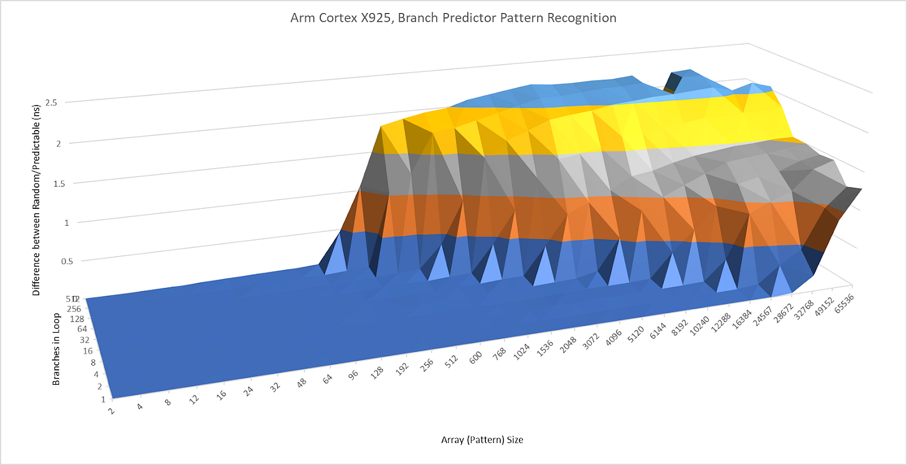

*图 2：横轴为重复随机模式的数组长度，另一轴为循环中的分支数，纵轴为随机模式相对完全可预测模式增加的时间。低而平的区域代表预测器仍能学习该组合；曲面抬升表示模式长度、分支数量或别名冲突使其无法维持相同预测效果。该图只能说明可观察行为，不能直接换算成某个内部历史寄存器的确切位数。*

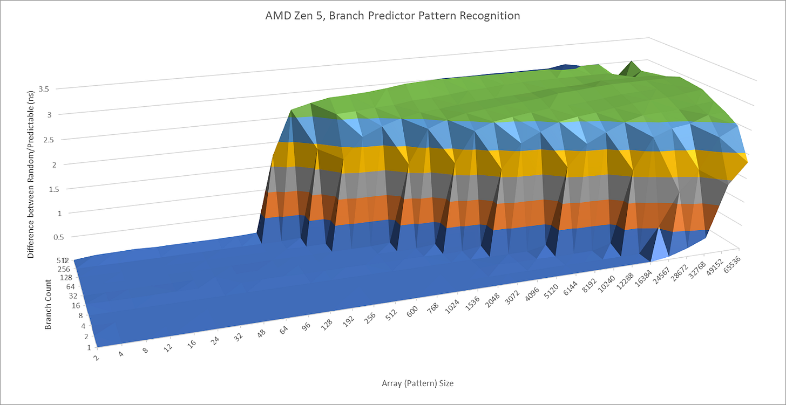

*图 3：Ryzen 7 9800X3D 上 Zen 5 的对照曲面。两颗核心在长模式和多分支压力下表现相似，但测试同时受到预测表容量、索引、历史长度和别名影响，不能仅凭曲面相似就断言两者采用相同算法。*

### 多级 BTB

【作者实测与推断】X925 的快速一级分支目标缓冲器（Branch Target Buffer，BTB）每周期可以处理两个 taken 分支。其可见容量随分支间距变化，但最多似乎能跟踪约 2048 个分支。这与早期 Arm 大核只配置 32～64 项 micro-BTB 的做法不同，策略更接近 Zen 5 的大容量快速 BTB。

更大的分支足迹由较慢的 BTB 层级覆盖。作者测得其最大可跟踪约 16384 个分支，目标供给延迟约为 2～3 周期；曲线还可能暗示存在一个 4096～8192 项的中间层级，但测试无法唯一确认。这里的 2048、4096～8192 和 16384 都是通过性能台阶反推的可见容量，不等于已经从 RTL 或官方存储阵列参数得到确认。

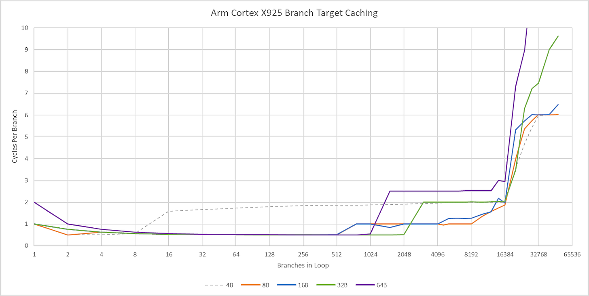

*图 4：不同曲线分别让相邻分支间隔为 4、8、16、32 或 64 B。约 512～2048 项之后，部分曲线从快速层进入下一层；16384 项之后多数曲线迅速升到约 5～6 周期甚至更高。分支密度会改变一条 Cache line 或一个 BTB 项能承载的目标数，因此“容量”不是脱离代码布局的单一常数。*

与 Zen 5 相比，X925 的最快层级容量大致相当，具体取决于分支间距。Zen 5 的最大目标容量更大，尤其在单个 BTB 项能够同时记录两个分支时更明显；但 X925 已比数年前的 Arm 核心进步很大，例如 Cortex-X2 的总目标容量约在一万个分支处见顶。

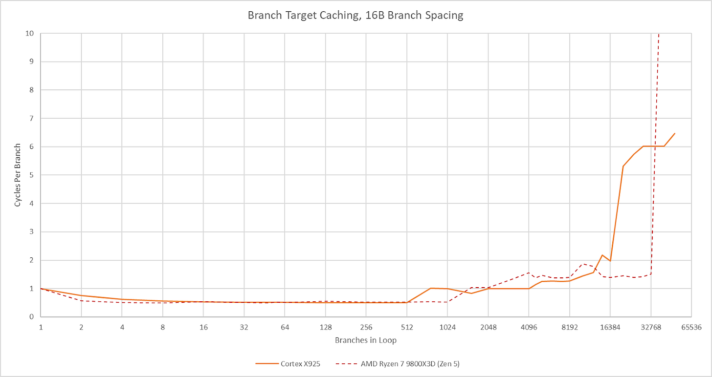

*图 5：在 16 B 分支间距下，X925 约在 512 项后从最低延迟层逐级上升，超过 16384 项后明显变慢；Zen 5 在更大的范围内维持较低延迟，直到约 32768 项附近才出现陡升。图中比较的是特定代码布局下的目标供给行为。*

### 返回栈与 SPEC 中的预测准确率

正文称 X925 使用 29 项返回地址栈（Return Address Stack，RAS）预测函数返回；图 1 却标为 31 项。原文没有解释这两个数字的差异，因此不能强行统一。作者还观察到，与 Intel Sunny Cove 及后续核心类似，如果测试中的返回点排列得过密，RAS 无法正常表现；他把测试“函数”之间的距离设为 128 B 后才得到清晰结果。

【作者实测】在 SPEC CPU2017 整数测试中，X925 的预测准确率在多数子项上与 Zen 5 相当，几何趋势甚至可能略好。长期令预测器头疼的 505.mcf 和 541.leela 中，X925 分别为 94.38% 和 93.72%，高于图中的 Zen 5（93.98%、93.36%）及 Lion Cove（93.69%、92.46%）。Lion Cove 整体略落后于前两者。

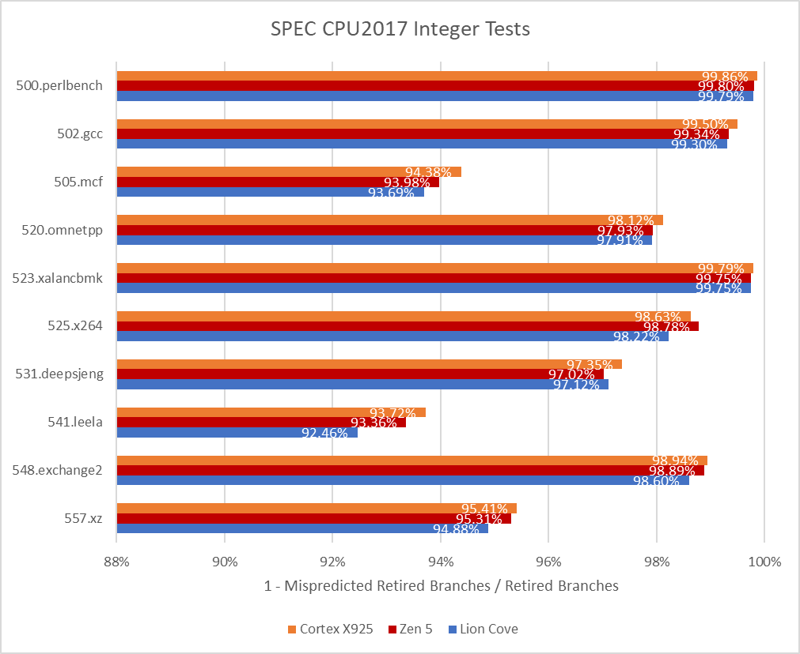

*图 6：准确率定义为 `1 - 退休误预测分支数 / 退休分支数`。X925 在 505.mcf、541.leela 和 557.xz 等难例中领先，但不同程序的分支频度不同，相同的准确率差值不一定产生相同的性能影响；还必须结合 MPKI 与单次恢复代价。*

浮点套件对预测器总体更温和，绝大部分子项都在 95% 以上。X925 再次大体追平或略高于 Zen 5，并多数领先 Lion Cove，但各子项差距很小。

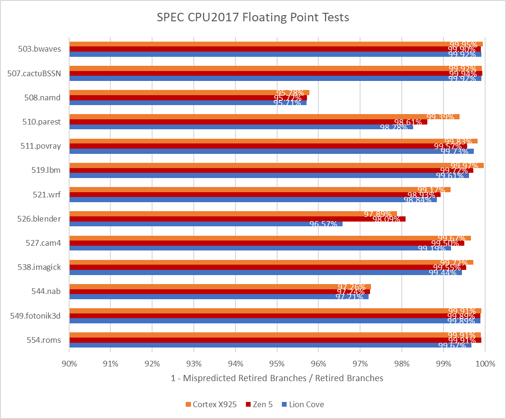

*图 7：503.bwaves、507.cactuBSSN、549.fotonik3d 和 554.roms 等项目接近 99%～100%，508.namd、526.blender 和 544.nab 相对更具挑战。高准确率不等于零成本，因为剩余误预测仍会清空错误路径并中断指令供给。*

## 三、取指与译码：十宽，但没有 MOP Cache

X925 与中核 Cortex-A725 一样，取消了前代 Arm 核心中的 MOP Cache。MOP 是 Arm 对内部宏操作的称呼，可近似理解为译码后的内部操作。虽然 X925 不像 A725 那样受到严格面积和功耗约束，作者仍认为取消 MOP Cache 有合理性：Arm 可通过预译码等方式降低译码成本，而且 X925 的目标频率低于高频 x86 桌面核心，再增加一个 MOP Cache 可能得不偿失。

【Arm 公开资料与作者推断】X925 TRM 显示 L1 I-Cache 数据按 76 位粒度存储。AArch64 指令固定为 32 位，因此 76 位可以容纳两条指令和 12 位额外信息。与 A725 的文档不同，Arm 没有说明其中任何一组位仍是原始 AArch64 操作码。可能只是文档省略，也可能说明 L1I 保存的是不完全保留原始操作码的中间格式；原文没有足够证据区分这两种可能。

【作者实测】X925 前端最高可以持续提供每周期 10 条指令，但 4 KB 页面下出现了反常的吞吐下降。换成 2 MB 大页后，只要测试代码仍装得进 64 KB L1 I-Cache，就能维持约 10 条/周期。X925 可以把相邻 NOP 融合为一条 MOP，不过融合不会把最终供给率推到每周期 10 条以上。

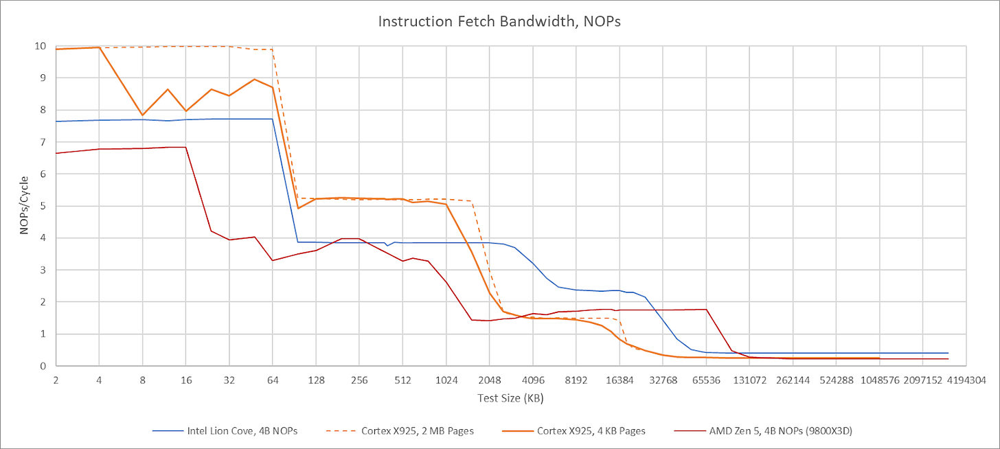

*图 8：虚线表示 X925 使用 2 MB 页面，64 KB 以内接近 10 NOP/cycle；实线表示 4 KB 页面，部分工作集只有约 8～9 NOP/cycle。超过 L1I 后，X925 在 L2 范围约为 5 NOP/cycle，超过 2 MB 后继续下降。Lion Cove 在小工作集约 7.7 NOP/cycle；Zen 5 依赖 Op Cache 为单线程提供较高带宽。Zen 5 使用 4 B NOP 时存在异常限制，作者为保持一致仍让各核心使用相同 NOP 大小。*

按每周期吞吐看，十宽 X925 超过两个八宽 x86 对手；若乘以实际频率，Zen 5 和 Lion Cove 更高的时钟会缩小甚至反转每秒供给量的差距。代码足迹增大时，X925 一直表现良好，直到超过 L2 容量；Zen 5 则更依赖 Op Cache 维持单线程高供给率。

## 四、重命名与资源分配

前端产生的 MOP 进入寄存器重命名（Register Renaming）和资源分配阶段。重命名把架构寄存器映射到物理寄存器，消除不必要的写后读与写后写依赖；ROB、调度器和访存队列等资源同时得到分配，使后端可以乱序执行、最终仍按程序顺序退休。

X925 可以像前代 Arm 核心一样消除寄存器到寄存器的 MOV，还会特殊处理把立即数零写入寄存器的操作。与 A725 类似，当大量寄存器 MOV 紧密排列时，普通 MOV 消除容易达到吞吐极限；两种优化都不能按重命名器的完整十宽带宽持续完成，这在超宽核心中并不罕见。

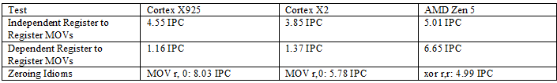

*图 9：独立寄存器 MOV 的吞吐为 X925 4.55 IPC、Cortex-X2 3.85 IPC、Zen 5 5.01 IPC；依赖 MOV 分别为 1.16、1.37 和 6.65 IPC。写零操作在 X925 上达到 8.03 IPC，X2 为 5.78 IPC，Zen 5 的 `xor r,r` 为 4.99 IPC。不同 ISA 的指令与消除规则不同，这组数据说明各自的重命名优化吞吐，不能直接当作通用整数 IPC。*

与 A725 不同，X925 没有为 `PTRUE` 提供同样的零成本处理。`PTRUE` 用于把 SVE predicate 寄存器设为所有 lane 有效；A725 可像处理清零惯用法一样消除它，且不分配物理寄存器，X925 则没有表现出这一行为。这个细节说明 Arm 的中核和大核并不是简单按比例缩放，而会采用不同优化组合。

## 五、乱序执行：很大，但一个数字无法概括

乱序后端会在操作数准备好时执行指令，让其他独立工作覆盖长延迟指令的等待。关于 X925 的重排序窗口，公开来源互相矛盾：Android Authority 称为 750 MOP；WikiChip 根据 Arm“相对 Cortex-X4 容量翻倍”的幻灯片推测为 768 条指令；图 1 也以问号标出 768。作者的 NOP 测试却能让 948 个 NOP 同时在途，除非 NOP 融合只在部分位置生效，否则这个结果与前两个数字都不直接对应。

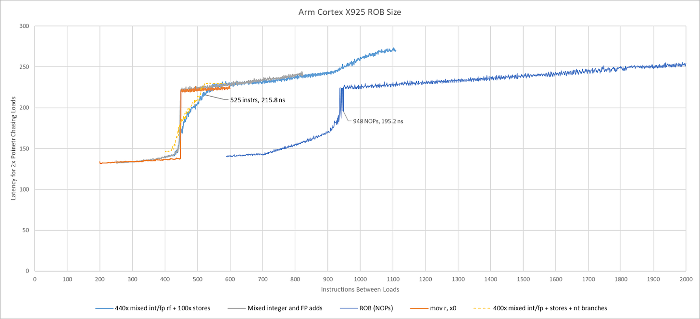

*图 10：横轴是在两次追逐式长延迟 load 之间插入的指令数，纵轴是两次 load 的总延迟。纯 NOP 在约 948 项处产生台阶；混合整数/浮点寄存器写入受 448 项物理寄存器回收表限制；加入 store 后，可见在途容量略高于 525 条。不同曲线先撞到不同资源，因此不能把所有拐点都叫作 ROB 大小。*

为绕开单一资源上限，作者组合了写整数寄存器、写浮点寄存器以及其他指令。整数与浮点寄存器写入混合后，最多只能同时分配 448 个重命名寄存器。`MOV r,0` 这类已识别清零操作不占整数物理寄存器，却仍遇到 448 条限制；加入 predicate 寄存器写入也共享这一限制。再加入 store 后，在途指令数可以略高于 525；继续加入 not-taken 分支没有再扩大容量。

因此，作者没有给 X925 的 ROB 强行指定一个精确数字，而是给出“实际约 525 条指令在途”的保守结论。这个规模与 Lion Cove 的 576 项处于同一档次，并超过 Zen 5 的 448 项。

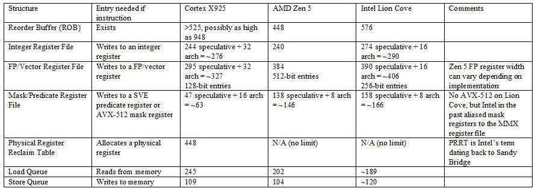

*图 11：作者汇总的 X925 容量包括 244 个推测整数寄存器加 32 个架构寄存器、295 个推测 FP/向量寄存器加 32 个架构寄存器、47 个推测 predicate 寄存器加 16 个架构寄存器、448 项物理寄存器回收表、245 项 LQ 和 109 项 SQ。对照栏中，Zen 5 为 448 项 ROB、240 个整数、384 个 512 位 FP、约 146 个 mask、202 项 LQ/104 项 SQ；Lion Cove 为 576 项 ROB、约 290 个整数、406 个 256 位 FP、约 166 个 mask、约 189 项 LQ/120 项 SQ。X925 的访存队列相当可观，弱项是只有 128 位的向量状态。表中数值混合了测试反推与公开信息，应按原作者证据等级理解。*

### 整数执行单元与分区调度器

X925 的整数侧在高吞吐与寄存器文件、调度队列端口成本之间作了平衡。八个 ALU 端口和三个分支单元分散在四个 28 项调度器中。每个调度器都有两条 ALU 管线，且各有一条能执行整数乘法；前三个调度器各带一条分支管线，第四个则负责指针认证、SVE predicate 操作和整数除法等特殊操作。

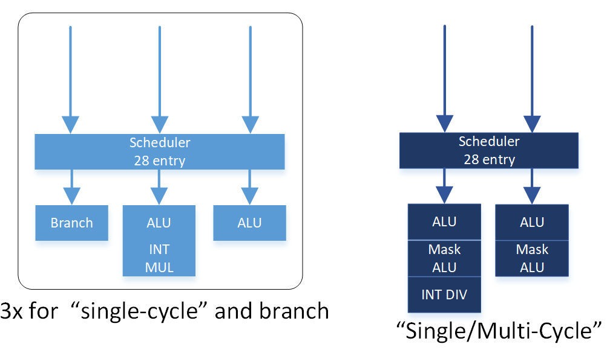

*图 12：左侧结构共有三组，每组是 28 项调度器、两条 ALU 和一条分支管线；右侧第四组同为两条 ALU，但承载 mask/predicate、整数除法等操作。四组高度对称，使常见 ALU 操作获得八路潜在吞吐，同时避免建设一个端口数极高的统一队列。*

AArch64 有执行整数乘加的 `madd` 指令。A725 和更早 Arm 核心使用专门的多周期管线处理 `madd` 等复杂整数操作；X925 则把 `madd` 拆成两个微操作，交给任意一条具备乘法能力的整数管线。作者推测，这能增加 `madd` 吞吐，又避免为每条乘法管线建设三个整数寄存器读端口。

Arm 优化指南仍把第四调度器的管线称为“single/multi-cycle”。但在 X925 上，“single-cycle”整数管线也能执行延迟为两周期的乘法，因此这个名字已不能按字面解释。这里的“multi-cycle”更像是指能够处理特殊操作，并可访问 FP/向量或 predicate 相关寄存器的管线。

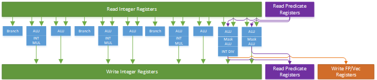

*图 13：绿色箭头表示整数寄存器读写，紫色表示 predicate 寄存器路径，橙色表示与 FP/向量寄存器的交互。右侧两条特殊管线各可从 predicate 状态取得两个操作数和一个 mask；图上把三路输入合并画成一条紫色箭头。该图说明分区调度能降低普通路径端口成本，但特殊操作只能落到较少管线。*

【作者推断】由于四个整数调度器较为对称，重命名器可能用简单轮转方式把可去往多个队列的操作分配下去。把依赖整数加法与独立加法交错时，X925 能容纳的依赖加法约减半；先放依赖加法、再放独立加法，测得容量只略微减少。这说明每个待执行操作可能在重命名阶段就被指定到某个调度器；如果目标队列已满，核心会停顿，而不会再搜索其他同样能执行该操作且仍有空位的队列。

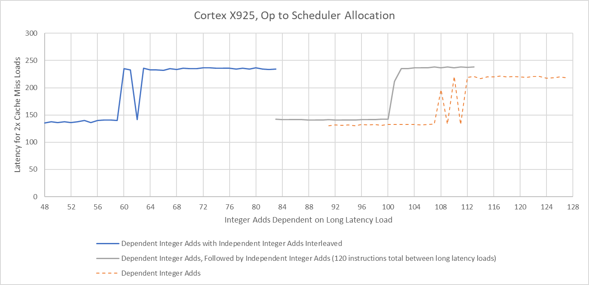

*图 14：只放依赖加法时，拐点接近四个 28 项队列的总量；把依赖与独立加法交错后，约一半依赖操作就会使某个被指定队列先满。曲线支持固定或轮转分配的解释，但并非 RTL 证明。*

### FP/向量执行

X925 的 FPU 有六条执行管线，六条都能处理向量浮点加法、乘法和乘加（FMA），也都支持向量整数加法与乘法。`addv` 等较少见操作仍有四条管线可以执行。三组 FP 调度器每组约 53 项，容量非常大：单个队列已经接近 AMD Bulldozer 为两个线程共用的 60 项统一 FP 调度器，而 X925 用三组队列服务一个线程。

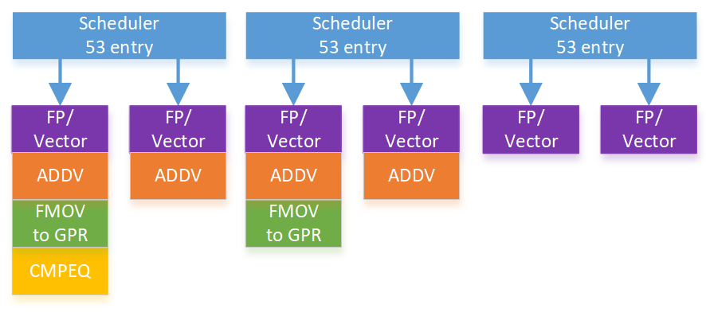

*图 15：三个约 53 项调度器各连接两条通用 FP/向量管线；其中四条还处理横向归约 `ADDV`，部分管线负责 FP 到通用寄存器搬运或比较。六管线和大调度容量有助于用并行度弥补 128 位向量宽度。*

作者认为，虽然 X925 的向量宽度只有 128 位，但高管线数量和很大的调度容量仍应让它在向量化应用中取得良好表现。不过，能否弥补 AMD、Intel 更宽向量的每条指令工作量优势，最终仍取决于具体代码。

## 六、Load/Store、TLB 与内存依赖

访存是现代处理器中最复杂、也最影响性能的一类操作。Load/Store Unit（LSU）不仅要计算虚拟地址、完成地址转换，还要判断 load 应从更早的 store 取得数据，还是访问 Cache 层次。X925 有四个地址生成单元（Address Generation Unit，AGU），其中两条能够处理 store。

数据地址转换采用两级 TLB。一级 DTLB 为 96 项全相联；二级统一 TLB 为 2048 项、8 路组相联，命中会增加约 6 周期。Zen 5 的一级 DTLB 容量和相联度相同，二级 DTLB 则有 4096 项、增加约 7 周期。Zen 5 另有独立二级 ITLB，而 X925 的二级 TLB 由指令和数据共享；由于代码和数据通常位于不同页面，AMD 的分离方案有机会获得更大的总覆盖范围。

### Store forwarding

当 load 的数据完全包含在一条更早的整数 store 中时，X925 能够完成 store-to-load forwarding。相比只能把 64 位 store 的特定一半转发给 32 位 load 的 Cortex-X2，这是明显改进。FP/向量侧仍接近旧 Arm 核心，只在 load 相对 store 地址满足特定对齐关系时成功。与近期 Intel、AMD 核心不同，即使 load 与 store 地址完全相同，X925 也不能实现零延迟转发。

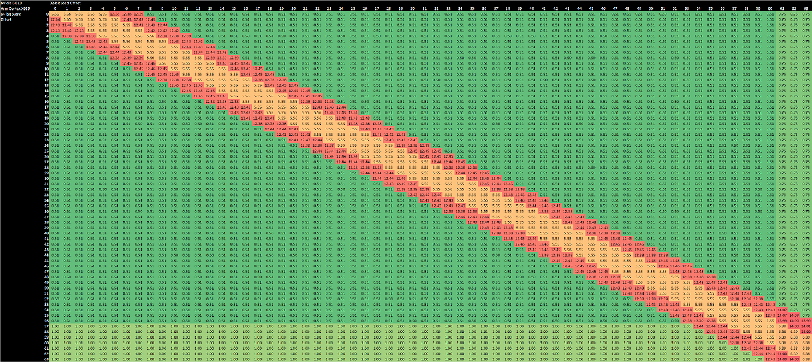

*图 16：测试使用 64 位 store 和 32 位 load，横纵轴改变两者在 64 B 范围内的偏移。绿色表示互不依赖的约 0.5～1 周期吞吐区；load 完全落在旧 store 内时，橙色带约为 5～6 周期；仅部分重叠时会失败并升到约 12～13 周期。跨 64 B Cache line 边界会进一步增加代价。*

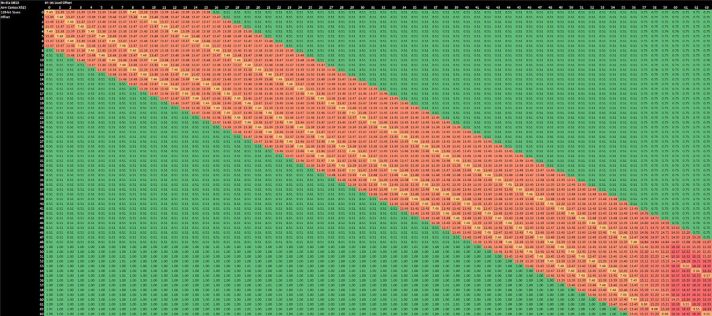

*图 17：测试改用 128 位向量 store 与 64 位 load。只有读取 store 的前半或后半、或 load 从 store 地址前 4 B 起始等特定关系能够较快转发；其他重叠组合大多落入约 13～15 周期区域。与整数矩阵相比，向量路径对相对对齐更敏感。*

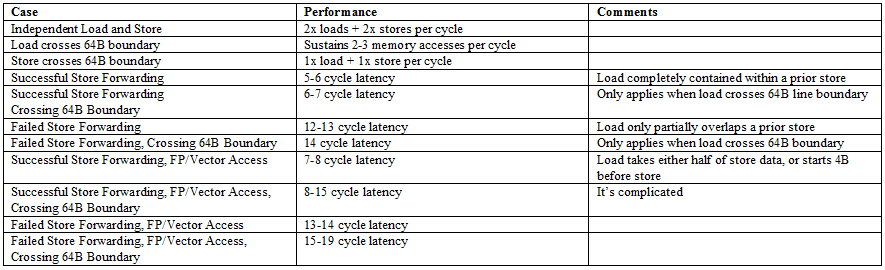

*图 18：独立访问可达到每周期两条 load 加两条 store；load 跨 64 B 边界时仍约为每周期 2～3 次访问，store 跨界则约为一 load 加一 store。整数成功转发约 5～6 周期，失败约 12～13 周期；FP/向量成功约 7～8 周期，复杂跨界情况可达 15～19 周期。*

只有地址转换完成后，处理器才能确定两个完整地址是否真的相同。有些核心会先用页内偏移位做早期相关性检查。作者观察到，当 load 和 store 的低 12 位看起来重叠时，X925 会产生一个几乎难以测量的小惩罚，因此推测它可能也在转换完成前做页内别名检查。这个现象很弱，原文没有把它写成确定实现。

## 七、核心私有 Cache

GB10 中的 X925 与配套 A725 一样使用 64 KB、4 周期 L1 D-Cache，但利用更大的功耗和面积预算提高了容量利用率与带宽。X925 使用更复杂的重引用间隔预测（Re-reference Interval Prediction，RRIP）替换策略，而 A725 使用 pseudo-LRU。

【Arm 公开资料】TRM 称 L1D 具有“四条 128 位读路径和四条 128 位写路径”。核心只有两个可处理 store 的 AGU，因此不可能持续每周期完成四条 store；四条 load 可以使用全部 AGU，并从 L1D 达到 64 B/cycle。这个水平可以与几代之前支持 AVX2 的 x86-64 核心竞争，但近期 AMD、Intel 核心依靠更宽向量和更高频率取得更高的每秒 L1D 带宽。

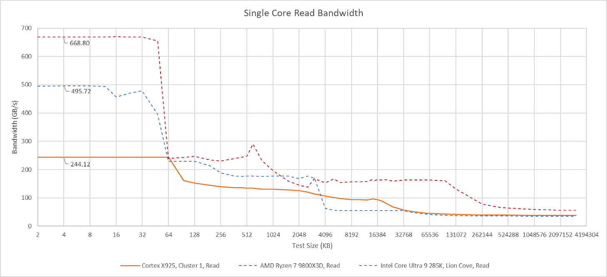

*图 19：4 GHz X925 在 L1D 区间测得约 244.12 GB/s，对应约 61 B/cycle，接近 64 B/cycle 理论值；Ryzen 7 9800X3D 与 Core Ultra 9 285K 分别约为 668.80 和 495.72 GB/s。超过 64 KB 后 X925 进入 L2 区间，读取带宽逐步接近约 32 B/cycle；横向比较还混合了频率、向量宽度与测试平台差异。*

Arm 提供 2 MB、8 路和 3 MB、12 路两种 L2。Nvidia 采用 2 MB 版本，作者测得命中延迟为 12 周期。较低的周期数让 X925 即使频率低于 Intel、AMD 桌面核心，L2 绝对延迟仍具有竞争力。L2 纯读取带宽约为 32 B/cycle；改用 read-modify-write 模式时，总带宽提高到约 45 B/cycle。

与 AMD 类似，Arm 让 L2 严格包含 L1 D-Cache。这样 L2 可以兼任 snoop filter：外部一致性探测若在 L2 miss，就能确定该行也不可能存在于 L1D，无需继续查找更内层数据 Cache。

## 八、SPEC CPU2017：高 IPC 抵消频率差距

【作者实测】X925 在 SPEC CPU2017 整数套件中的估算成绩非常出色。在作者测试的最高性能桌面配置中，它与 Intel、AMD 的高性能核心处于误差范围附近。Zen 5 在浮点套件中领先，但差距不算悬殊。把 Ryzen 9 9900X 的内存从 DDR5-5600 换成 DDR5-6000，可把整数估算成绩略微提高到 11.9，仍没有明显拉开与 X925 的距离。

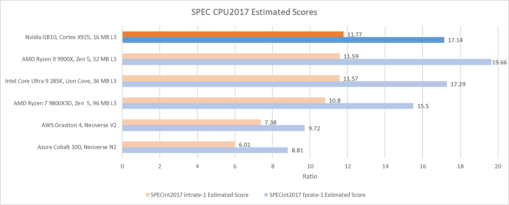

*图 20：GB10/X925 的 `intrate-1` 与 `fprate-1` 估算值分别为 11.77、17.14；Ryzen 9 9900X 为 11.59、19.66；Core Ultra 9 285K 为 11.57、17.29；Ryzen 7 9800X3D 为 10.8、15.5；Graviton 4 为 7.38、9.72；Cobalt 100 为 6.01、8.81。图中平台的频率、Cache、内存和软件栈均不相同。*

### 整数子项：宽度与频率各有胜负

逐项观察会得到更复杂的图景。在偏核心执行的负载里，X925 与更高频的 AMD、Intel 核心互有胜负。548.exchange2 和 500.perlbench 展示了高频率的优势，两个八宽 x86 核心都超过 4 GHz、十宽的 X925；525.x264 则相反，X925 用更少指令完成工作，并保持明显 IPC 优势。X925 在 541.leela、505.mcf 等挑战预测器的负载中继续表现良好。520.omnetpp 等内存受限测试则更容易受到核心之外的 Cache、内存和平台因素影响。

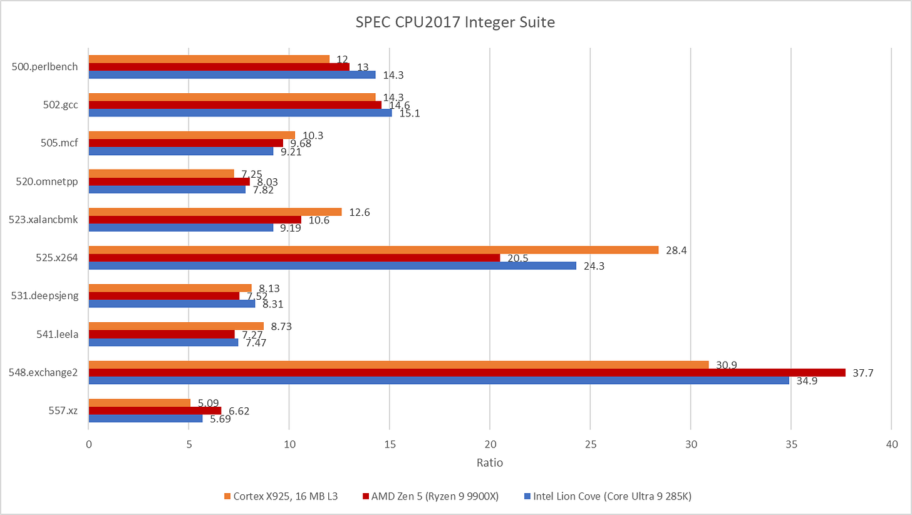

*图 21：X925 在 525.x264 为 28.4，明显高于 Zen 5 的 20.5 和 Lion Cove 的 24.3；在 505.mcf 为 10.3，也高于 9.68 和 9.21。548.exchange2 中 X925 为 30.9，低于 Zen 5 的 37.7 与 Lion Cove 的 34.9。子项差异说明同一个总分可能来自完全不同的频率、IPC、指令数和存储行为。*

PMU 数据表明 X925 主要靠高 IPC 弥补频率劣势。它在图中绝大多数整数子项里都保持高于两个对手的退休 IPC；557.xz 则略低于 Zen 5。IPC 优势能否抵消频率差距取决于具体程序。作者据此认为，Arm 选择的“较低频率、较高每周期工作量”路线，与 Intel、AMD 的实现路线同样可行。

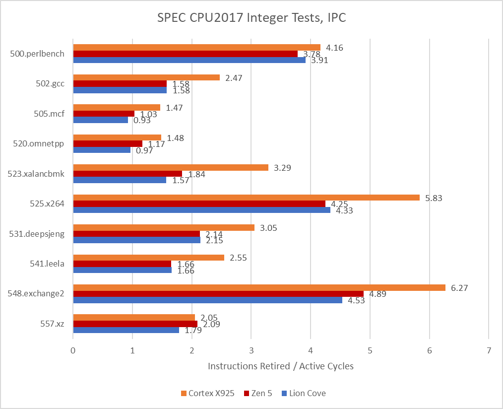

*图 22：X925 在 525.x264 达到 5.83 IPC，Zen 5 和 Lion Cove 分别为 4.25、4.33；548.exchange2 为 6.27，对手为 4.89、4.53；即使在 505.mcf 这类延迟型负载中，X925 也有 1.47 IPC，对手约为 1.03、0.93。IPC 只按活跃周期计算，仍需结合频率和实际执行指令数解释最终时间。*

### 浮点子项：高 IPC 不一定带来更高成绩

SPEC CPU2017 浮点套件打破了整数部分的平衡。X925 在足够多的项目上落后 Zen 5，使 AMD 获得清晰的总体优势；对 Arm 有利的是，X925 总体仍能追上 Lion Cove。

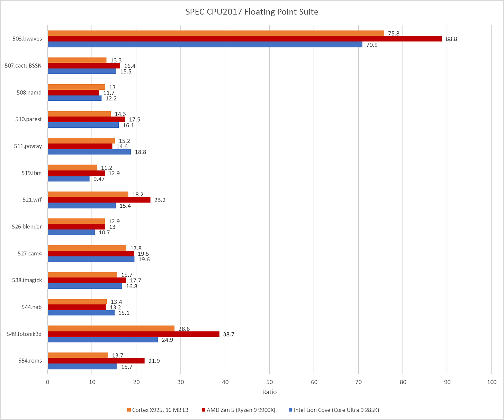

*图 23：Zen 5 在 503.bwaves、510.parest、521.wrf、549.fotonik3d 和 554.roms 等项目领先 X925；X925 在 508.namd、519.lbm、526.blender 等子项有优势。不同项目受向量宽度、内存、编译器代码生成和频率影响的程度并不相同。*

PMU 数据仍显示 X925 在所有图示浮点子项中维持更高退休 IPC。然而，几个测试在 AArch64 二进制上需要执行显著更多指令。X925 不仅要靠 IPC 抵消频率差距，还要覆盖更高动态指令数；它的 IPC 虽高，却不足以在这些项目中同时抵消两项劣势。

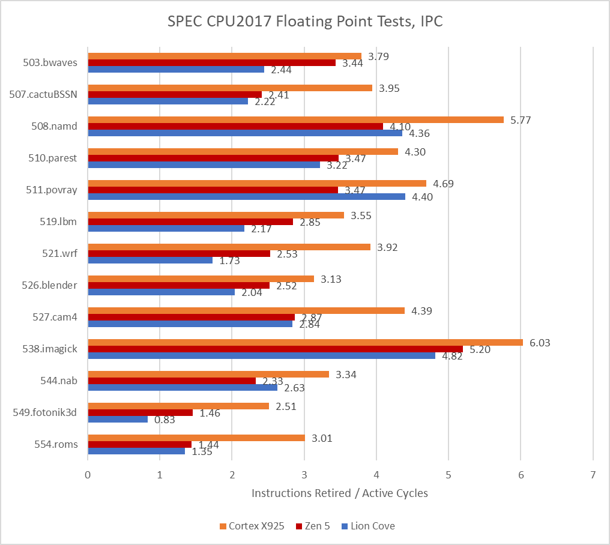

*图 24：X925 在 508.namd 达到 5.77 IPC、538.imagick 达到 6.03 IPC；在 549.fotonik3d 中为 2.51 IPC，远高于 Zen 5 的 1.46 和 Lion Cove 的 0.83，但该项目最终成绩仍落后 Zen 5。单看 IPC 会遗漏频率和动态指令数。*

507.cactuBSSN、521.wrf、549.fotonik3d 和 554.roms 在 X925 上都需要更多退休指令，而且差距并不小。554.roms 最突出：图中 X925 的指令计数为 1386.25，而 Zen 5 为 582.71，即超过两倍；Lion Cove 为 813.88。这四个测试的平均 IPC 距离任何一颗核心的理论宽度都很远。额外指令不只是增加执行时间，还会占用 ROB、调度器、物理寄存器和访存队列，削弱核心用乱序窗口隐藏延迟的能力。

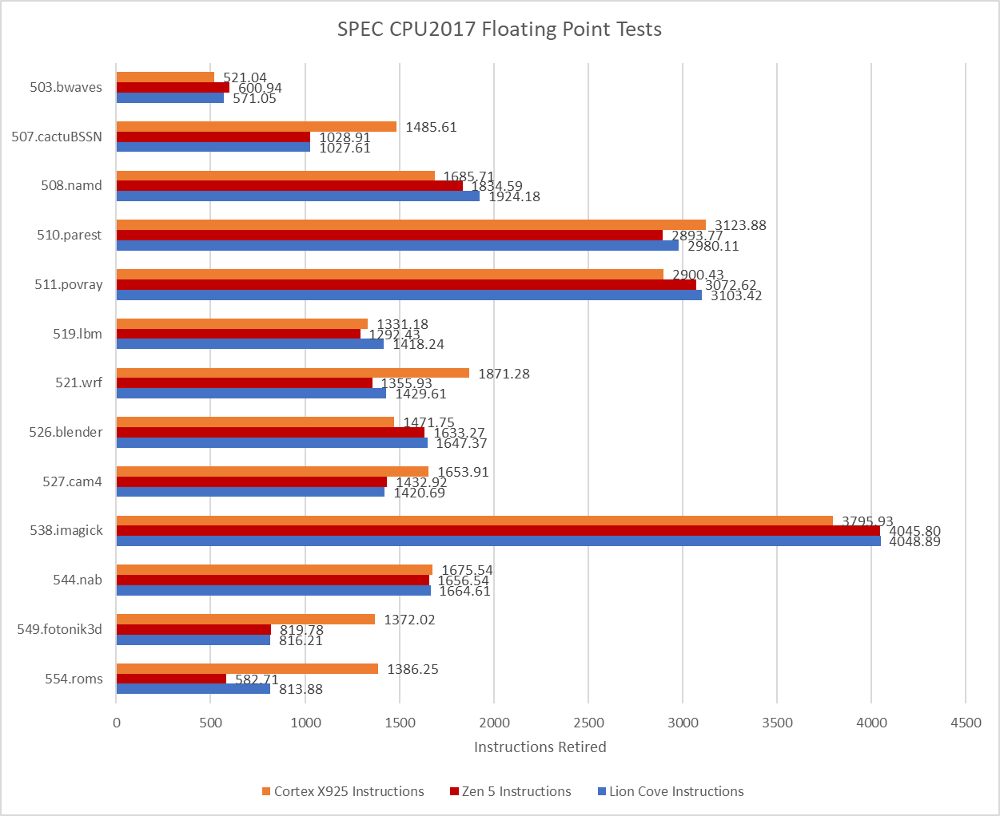

*图 25：X925 在 507.cactuBSSN、521.wrf、549.fotonik3d 和 554.roms 的计数明显更高；例如 fotonik3d 为 1372.02，对照约为 819.78、816.21。图中没有把差异拆成 ISA、向量宽度、编译器或库实现，因此只能确认这些测试二进制的动态工作量不同，不能单独归因。*

## 九、总结

【作者结论】Arm 已经拥有一颗不仅能服务笔记本，也能进入桌面高性能场景的核心；而且它在相对克制的 4 GHz 频率下做到了这一点。X925 的成功并不依赖某个孤立技巧，而是来自整条流水线基本功：快速且先进的分支预测、很强的指令供给、巨大的乱序执行资源、宽而对称的执行端，以及数量不多且经过权衡的结构惩罚。能够设计出这种性能级别核心的公司并不多，作者认为 Arm 有充分理由为此自豪。

高性能核心仍只是完整平台的一部分。游戏在消费市场非常重要，相比单纯提高核心吞吐，它往往更依赖强大的内存子系统。作者认为，如果 DSU 能提供超过 32 MB 的 L3 选项，可能更有利于这类负载。x86-64 已形成的软件生态也是 Arm 必须面对的挑战。此外，Arm 仍需依靠芯片伙伴把 IP 核、互连、内存、功耗和软件整合成最终产品。

因此，本文最稳妥的结论是：Cortex-X925 已证明 Arm 可以在桌面级单线程性能上与 Zen 5、Lion Cove 同场竞争；但最终产品能否持续取得优势，还取决于 DSU/L3、内存延迟与带宽、实现频率、编译器和应用生态。更多竞争若能推动这些环节一起进步，才会真正转化为更好、更便宜的处理器。

## 参考资料

1. Chester Lam，*Arm's Cortex X925: Reaching Desktop Performance*：https://chipsandcheese.com/p/arms-cortex-x925-reaching-desktop
2. Arm Cortex-X925 TRM，L1 指令数据 RAM 编码：https://developer.arm.com/documentation/102807/0002/Direct-access-to-internal-memory/L1-cache-encodings/L1-instruction-data-RAM-returned-data
3. Android Authority 对 Cortex-X925 重排序容量的介绍：https://www.androidauthority.com/arm-cortex-x925-g925-explained-3445480/
4. WikiChip 对 Cortex-X925 的分析：https://fuse.wikichip.org/news/7761/arm-launches-next-gen-flagship-cortex-x925/
5. Henry Wong，*Store-to-Load Forwarding and Memory Disambiguation in x86 Processors*（原作者将其方法移植到 AArch64）：https://blog.stuffedcow.net/2014/01/x86-memory-disambiguation/
