# CPU 从空闲到高频要多久：Alder Lake、Zen 4、M1 与更多平台补测

> 英文标题：Addendum: Clock Ramp on ADL, Zen 4, M1, and More 
> 撰文：Chester Lam 
> 首发：Chips and Cheese，2022 年 10 月 26 日 
> 原始链接：https://chipsandcheese.com/p/addendum-clock-ramp-on-adl-zen-4-m1-and-more

此前的升频测试缺少 Kaby Lake 之后的处理器，社区补充数据后，Alder Lake、Rocket/Tiger/Cannon Lake、Broadwell、Excavator、Rembrandt、Zen 4、Apple M1/M1 Max 都可放到同一框架下观察。

这里测的不是 CPU 在特殊条件下改变频率的物理极限，而是典型空闲状态接到工作后，需要多久进入较高频率。电压爬升、操作系统策略、硬件 P-state 控制都会影响结果。Skylake-X 遇到 AVX-512 时能在约 0.1 ms 内降几百 MHz，是因为它已经处在负载电压、频率变化小，也不必等待 OS 电源状态命令，不能和从 idle boost 直接类比。

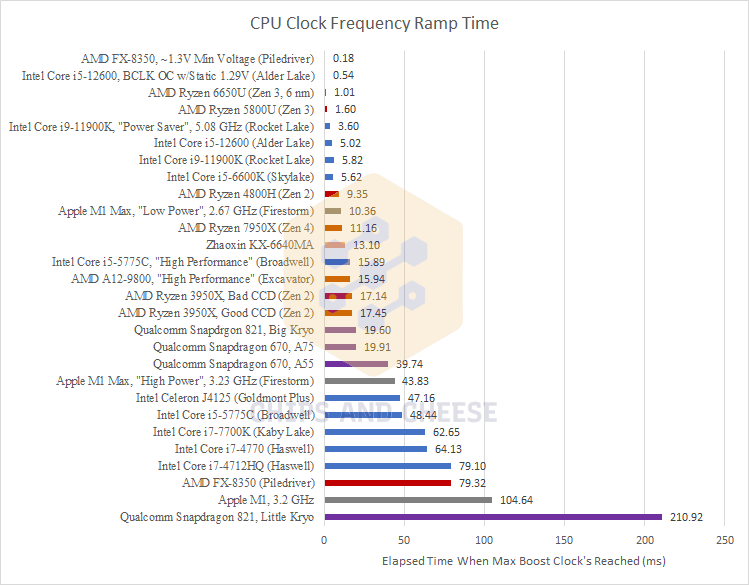

图 1 不能用来简单宣布 Piledriver “升频最快”。若静态电压或高性能计划让空闲电压维持很高，测到的是以待机功耗换响应速度的特殊状态。

## Intel：Speed Shift 把闭环交给硬件

Core i5-12600 只有 6 个 Golden Cove 核。默认开启 Speed Shift 时，CPU 不必等待 OS 逐级请求频率，略多于 5 ms 即可到达最高 boost；虽然比 i5-6600K 高近 1 GHz，反而略快。

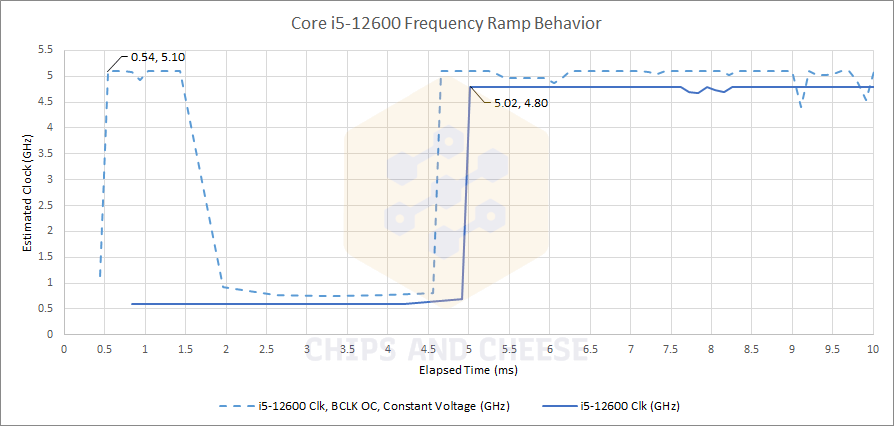

静态 1.29 V 时，Alder Lake 约 0.5 ms 就从 idle 超过 5 GHz，却又奇怪地回落到 idle 数毫秒，再重新升频。默认 idle 为 600 MHz，早期 Intel 桌面平台多为 800 MHz；BCLK 超频时 idle 也随之上升。

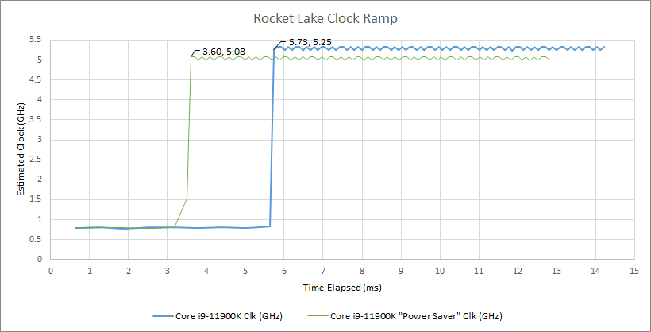

Rocket Lake 的 Cypress Cove 是 Sunny Cove 回移到 14 nm 的版本。Balanced 模式约 5 ms 到顶；Power Saver 约 3.6 ms 到达稍低的最高频率。两种模式都能在很短时间冲到高频。

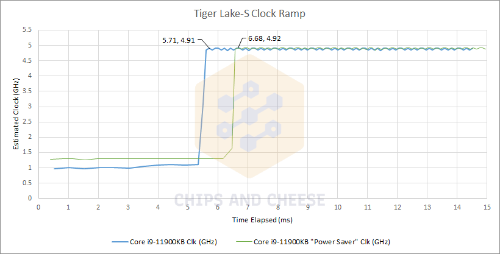

Tiger Lake 在 NUC 中最高 4.9 GHz，同样约 5 ms 一步到位，没有中间频点；Power Saver 会晚约 1 ms 开始，但最终频率相同。

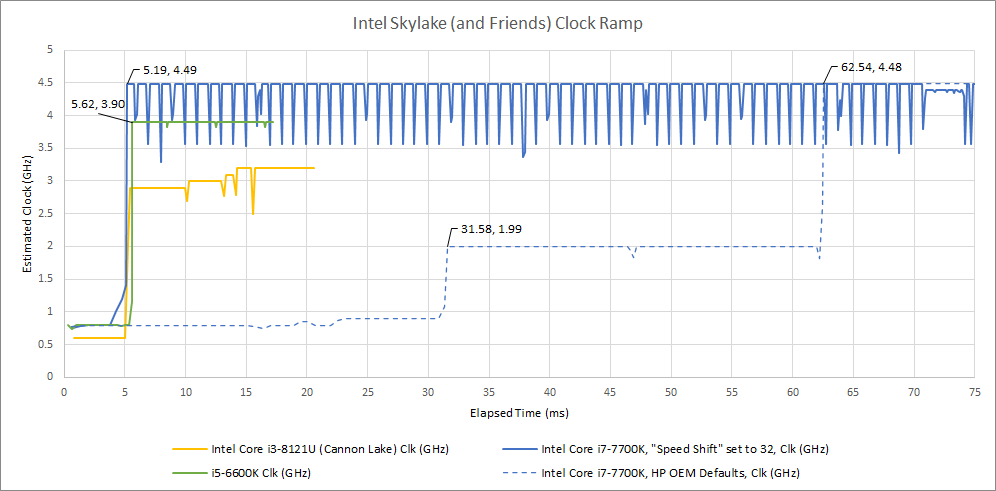

HP BIOS 没有选项，因此 Kaby Lake 用 ThrottleStop 强制开启 Speed Shift，约 5 ms 到顶。Cannon Lake 先在 5.43 ms 到 2.89 GHz，随后阶梯上升，14.27 ms 到 3.2 GHz。它比其他 Speed Shift 平台慢，却仍明显快于 OS 主导的传统 P-state 切换。

Broadwell 是桌面 Core 引入 Speed Shift 前的最后一代。Balanced 模式约 15 ms 到 2.1 GHz，48 ms 才到最高；High Performance 模式 15.89 ms 直接到 3.7 GHz。

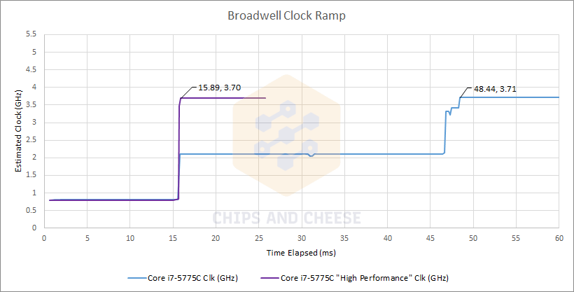

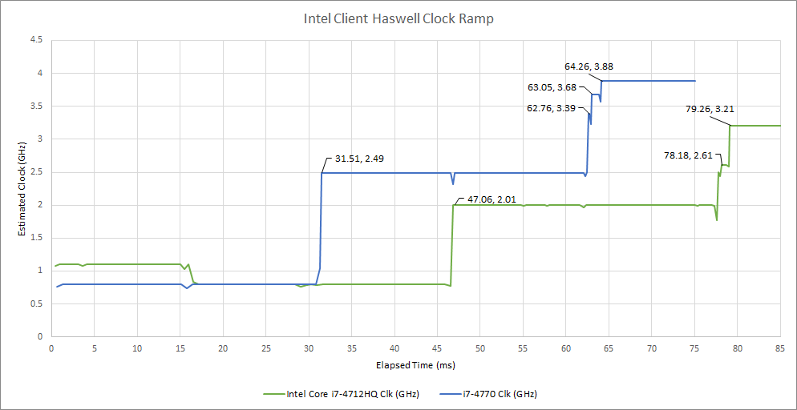

Broadwell 位于 Haswell 与 Skylake 之间：中间频点到达时间约为 Haswell 一半，最高频率也快约 25%；但 High Performance 并未保持高电压，因此没有 Piledriver 或静态电压 Alder Lake 那种亚毫秒结果。

## AMD：从 Excavator 到 Zen 4

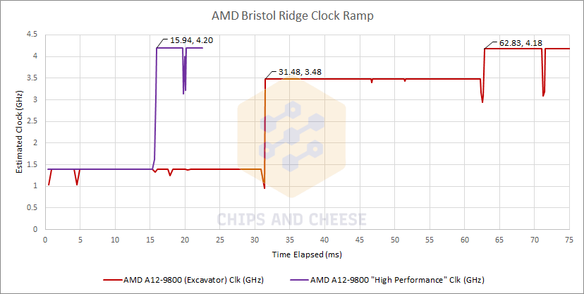

默认状态下 Excavator 先到 3.48 GHz，62 ms 后稳定在 4.2 GHz；High Performance 则约 16 ms 直接到 4.2 GHz，同时 idle 电压仍低至 0.847 V，是较实用的响应性设置。

Rembrandt 是 TSMC N6 上的 Zen 3+，主要重做 uncore 并改善物理实现和能效。本结果只有 Linux 能稳定复现，Windows 波动更大。

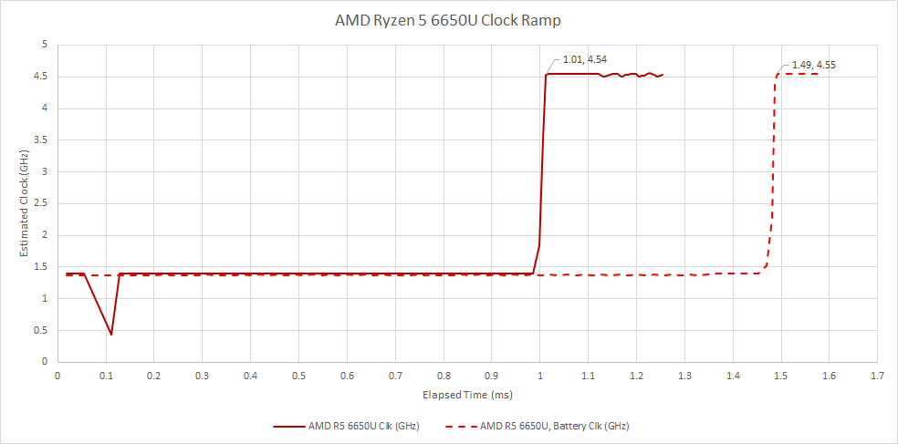

接电时从 1.4 GHz 开始，不到 1 ms 便进入爬升并达到 4.5 GHz；电池下约 1.5 ms，初始和最高频率不变。这是总览中最快的默认轨迹，但 Linux 下无法读取 Zen 3 核心电压，不能排除 idle 电压偏高。

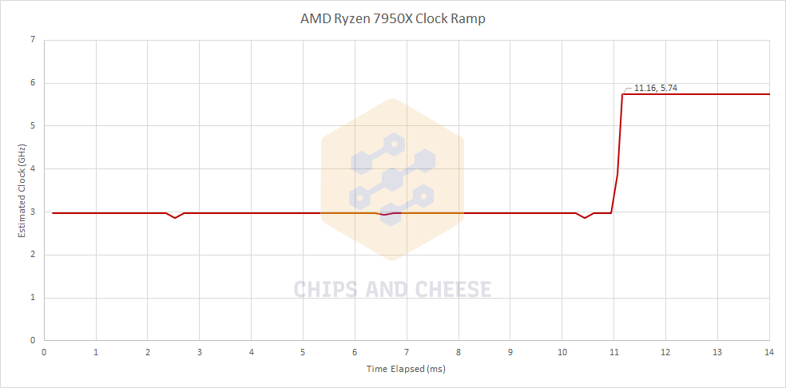

Zen 4 idle 已在较高的 3 GHz，约 11 ms 后到 5.7 GHz。到顶时间略慢于部分旧 AMD 核心，但高 idle 频率意味着工作刚开始时就有较强响应。

### 体系结构视角：响应性不等于“到最高频率所需时间”

用户看到的延迟取决于升频前几毫秒完成了多少工作。一个从 600 MHz 起步、5 ms 到顶的核心，未必比从 3 GHz 起步、11 ms 到顶的核心更快完成短任务。频率轨迹还只是控制系统输出；实际 IPC、缓存热度、唤醒延迟和调度迁移同样决定响应。

测量以一串依赖整数加法的耗时反推频率，得到的是窗口内有效执行速率。若核心在频率切换时短暂停顿，曲线可能显示一个很低的“等效频率”，不能据此确认 PLL 真在那个频点运行。

## Apple：更渐进，也更不稳定

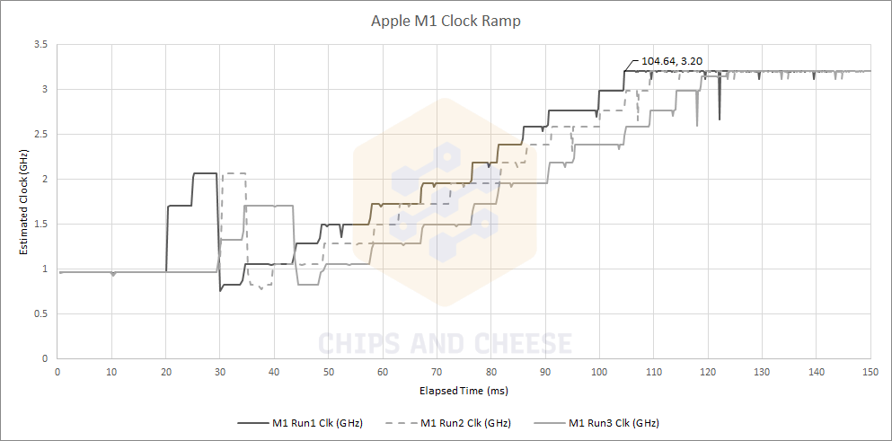

M1 通常约 20 ms 后开始升频，逐步爬到 3.2 GHz，整个过程略超 100 ms；不同运行差异较大，偶尔会在 20—30 ms 先跳到 2 GHz 多。策略类似电池状态下 Snapdragon 821 的渐进升频，但明显快于后者近 400 ms 的轨迹。

M1 测的是不使用电池的 Mac mini，因此渐进策略有些意外。可能是 Apple 没有为平板、超轻薄本和小型桌面分别实现策略，但缺少其他 M1 设备复测，无法验证。

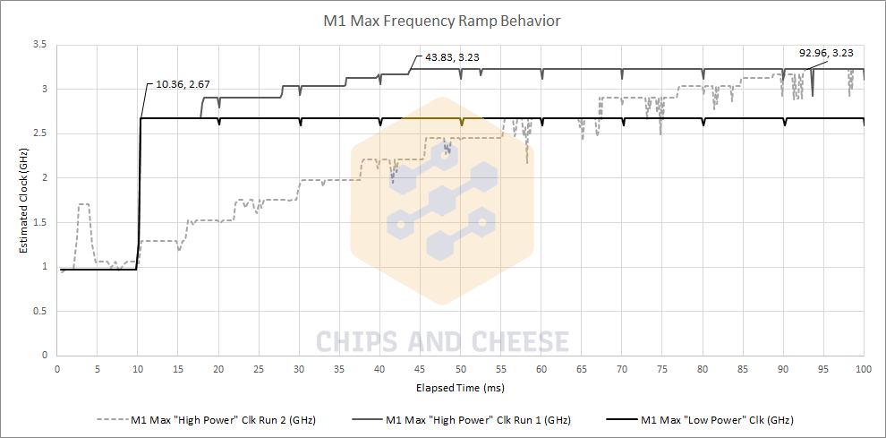

M1 Max 面向高功率笔记本和 Mac Studio。最佳运行在 10 ms 多到 2.67 GHz；Low Power 停在这里，High Power 再慢慢到 3.23 GHz。有一次 43 ms 到顶，也有运行接近 100 ms，波动使统一结论很困难。接电状态不改变轨迹，真正起作用的是 High/Low Power；低功耗模式主要表现为 2.67 GHz 上限。

## Linux governor 是否决定一切

Odroid N2 的 Amlogic S922X 含 2 个最高 1.9 GHz Cortex-A53 和 4 个最高 2.2 GHz Cortex-A73，用来比较 Linux governor。

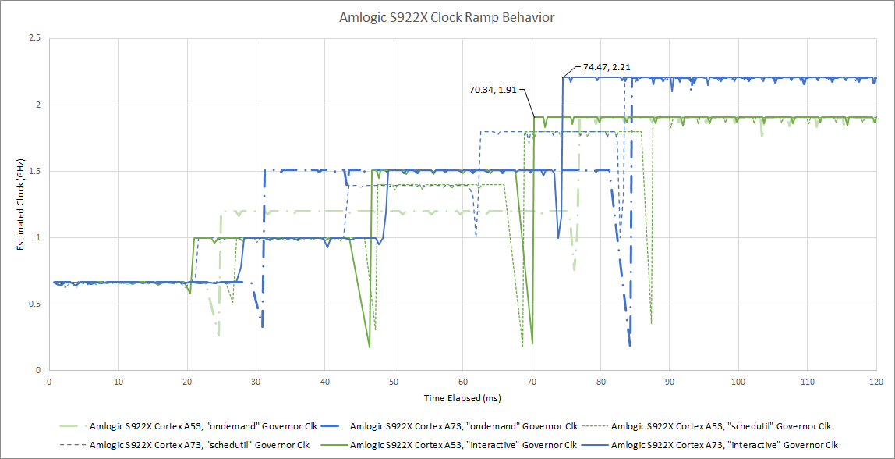

更换 governor 影响很小。interactive 最早到顶，ondemand 和 schedutil 约晚 10 ms；30—50 ms 间 ondemand 的中间频率略高。曲线在跳频前常出现下凹，可能是核心短暂停顿：例如 2.44 ms 窗口显示 200 MHz 等效速度，也可能是核心先以 1.5 GHz 跑约三分之一毫秒，随后停约 2 ms。没有硬件轨迹就不能区分。

### 体系结构视角：DVFS 是跨层闭环

OS governor 决定请求策略，硬件 P-state 控制器决定传感、功率预算和电压频率切换，稳压器与 PLL 决定物理响应。Speed Shift 一类机制把快速环路移进硬件，因此能在约 5 ms 内动作；OS 仍负责给出性能偏好和功率边界。静态电压能缩短电压准备时间，却增加 idle 功耗，不能视为免费的优化。

验证时最好联合读取 APERF/MPERF、硬件频率计数器、调度 trace 与墙上功率，并说明采样窗口。只用软件报告的瞬时频率，很容易把休眠、停顿或线程迁移误判为 DVFS 频点。

## 结语

现代 Intel 自 Skylake 起借 Speed Shift 通常在 5 ms 左右到最高 boost；现代 AMD 也能把控制闭环放进硬件，Zen 世代略快或略慢。对这些平台，没有必要为了“更快升频”常驻最高频率或静态高电压。

没有纯硬件控制的 Broadwell、Excavator，在 Windows High Performance 下也可约 16 ms 到顶，同时保留低 idle 电压。Apple M1 的渐进策略最突出；M1 Max 已能在 10 ms 多到中间频点，但到最高频率的运行间差异仍大。

测试环境并不完全统一：Broadwell、Rocket/Cannon/Tiger Lake 与 Excavator 使用 Windows 10 22H2 并尽量关闭后台任务；Alder Lake 在 Linux；Rembrandt 在 EndeavourOS、schedutil governor；Apple 由社区设备提供。曲线适合解释控制策略，不适合做脱离配置的“最快 CPU”排名。
