# CPU 改变频率到底有多快：从 Zen 3、Skylake 到手机 SoC 的毫秒级测试

> 英文标题：How Quickly do CPUs Change Clock Speeds? 
> 撰文：Chester Lam 
> 首发：Chips and Cheese，2022 年 9 月 15 日 
> 原始链接：https://chipsandcheese.com/p/how-quickly-do-cpus-change-clock-speeds

CPU 规格表列的是最高频率，实际处理器为减少热量和功耗不会常驻 boost。电源电路需要先提高电压并提供更多电流，频率也不可能瞬间跳变。这里测的是从 idle 到较高频率的日常响应，而不是 PLL 或稳压器在特殊状态下的物理极限。

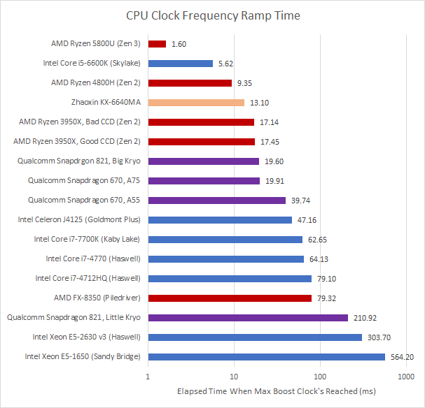

图 1 不能单独决定“响应最快”，因为很多核心会先很快到足够高的中间频率，再过很久才冲最高点。短任务可能在最高 boost 到来前已经完成。

## AMD Zen 3 与 Zen 2

移动 Zen 3 Cezanne 在几毫秒内到 3.7 GHz；测试时没看到 4.4 GHz，可能是迭代时间不够。3.7 GHz 已足以提供良好交互响应。

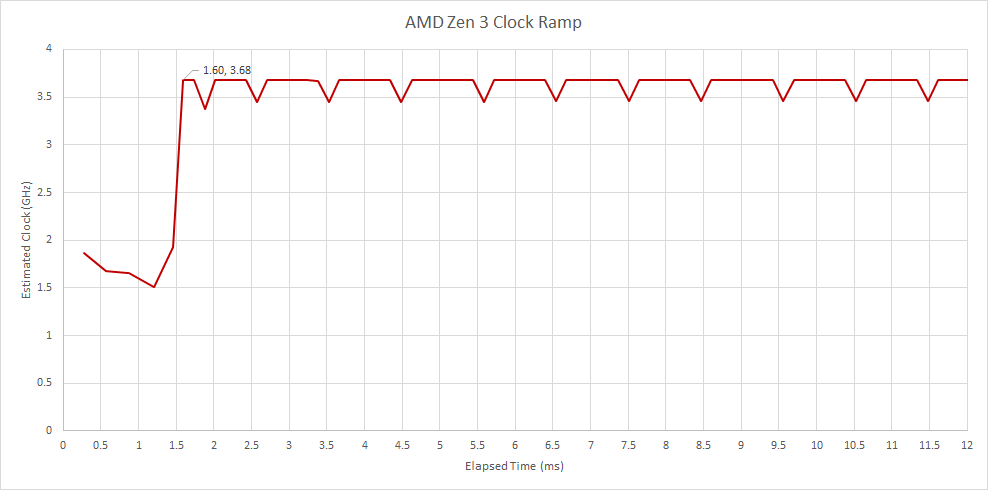

桌面 Zen 2 Matisse 从 1.7 GHz 起步，约 16 ms 到 4.3 GHz；Ryzen 9 3950X 最佳核心停约 1 ms，17.45 ms 到 4.7 GHz。17.45 ms 约等于 57 FPS 一帧，仍属快速。移动 Renoir 从更低 1.4 GHz 起，9 ms 多到 4.3 GHz。

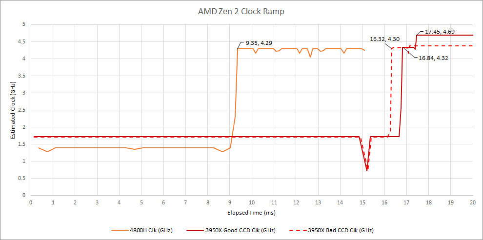

3950X 平台为 ASRock X570M Pro4，4800H 在 Eluktronics RP-15；桌面/移动策略不同，不能把差异只归于核心架构。

## Intel Skylake：Speed Shift 的意义

Skylake 引入 Speed Shift，把 P-state 快速控制从 OS 交给 CPU。i5-6600K 约 5.62 ms 到 3.9 GHz。

Kaby Lake 同源，却在测试机上 31.5 ms 才到 2 GHz，62.54 ms 到 4.5 GHz。

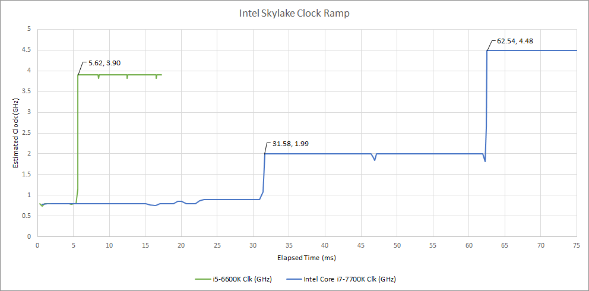

差异可能来自 OEM 系统：i7-7700K 位于 HP 802F/C236，i5-6600K 位于普通 MSI Z170A Gaming Pro Carbon。BIOS、Windows policy 和主板电源管理可以覆盖架构能力，因此不能说 Kaby Lake 天生比 Skylake 慢十倍。

## Piledriver：高 idle 电压换亚毫秒响应

FX-8350 默认接近 Haswell，约 80 ms 到最高；47 ms 已到 3.4 GHz，实际响应好于“到顶时间”。

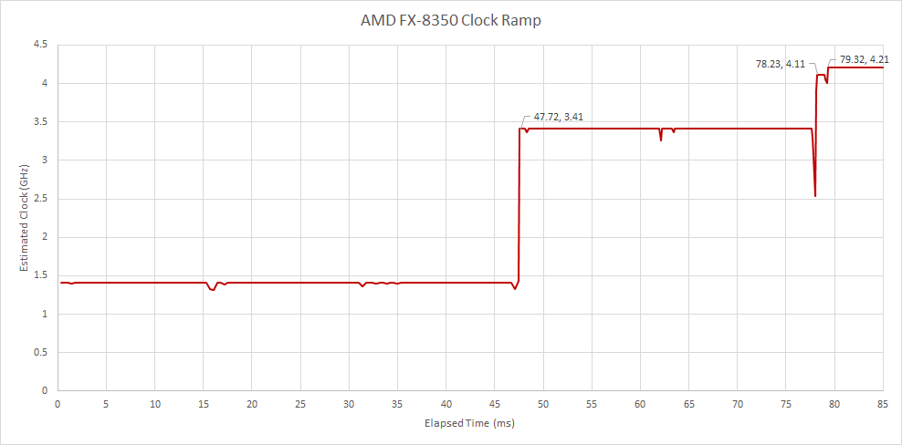

Windows minimum CPU state 设 100% 后，idle 仍约 1.35 V；核心从 1.41 到 4.1 GHz 不到 0.2 ms，约 1 ms 多到 4.2 GHz。

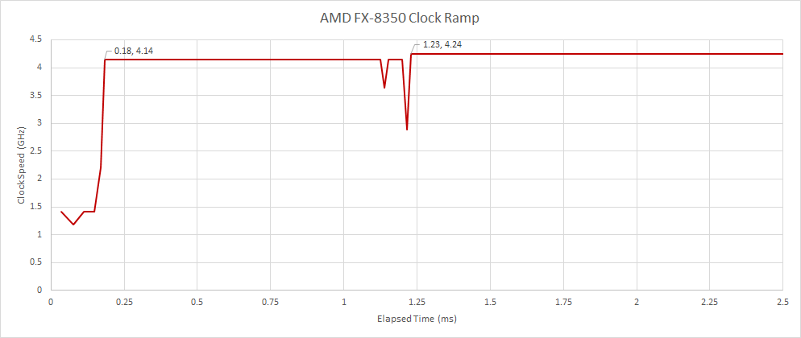

这说明大部分默认延迟来自升电压准备，但不是免费优化：idle 高压增加静态与动态功耗。平台为 Gigabyte GA-990FX-Gaming。

### 体系结构视角：DVFS 的关键路径往往在电压而非时钟

频率提高前必须确保最坏路径在新频点满足时序，核心电压、VRM 电流能力、温度和 power budget 都要就绪。保持高电压可让 PLL 很快切频，却牺牲空闲能耗。现代硬件 P-state 把 sensor/控制环放进 CPU，减少 OS 调度与命令延迟；系统策略仍可决定目标和停留时间。

## Haswell 与旧 HEDT

客户端 Haswell 先到中间频率：桌面约 31 ms 到 2.5 GHz，60 ms 后高频；移动版 47 ms 到 2 GHz，79 ms 到最大。

它比只看最高频率更响应，但远慢于 Skylake Speed Shift。移动平台为 Dell Precision M3800，桌面为 Asus Q87M-E。

HEDT Sandy Bridge Xeon E5-1650 很快到 3.2 GHz base，随后等近 0.5 秒才到 3.8 GHz 单核 turbo；Haswell E5-2630 v3 约三分之一秒到最高，但本身是低频 SKU。

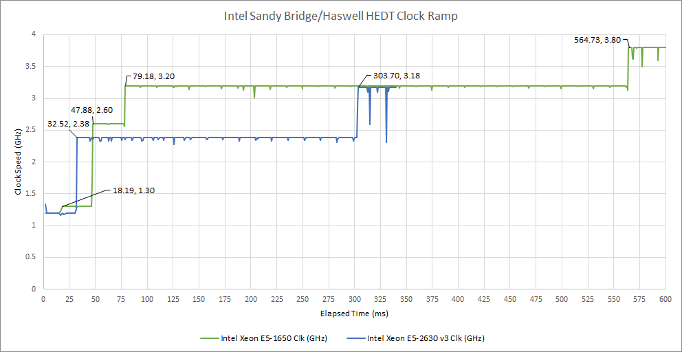

HEDT idle 约 1.2 GHz，客户端多为 800 MHz。长 ramp 可能故意避免短任务功耗，但没有平台控制文档确认。E5-1650 使用 HP 1589/C602，E5-2630 v3 使用 Dell 0K240Y/C612。

## Goldmont Plus 与两代 Snapdragon

Goldmont Plus 是 2017 年 3-wide 低功耗乱序核，似乎没有 Speed Shift，47 ms 到 2.6 GHz。测试机是 Coofun GK41 小型主机。

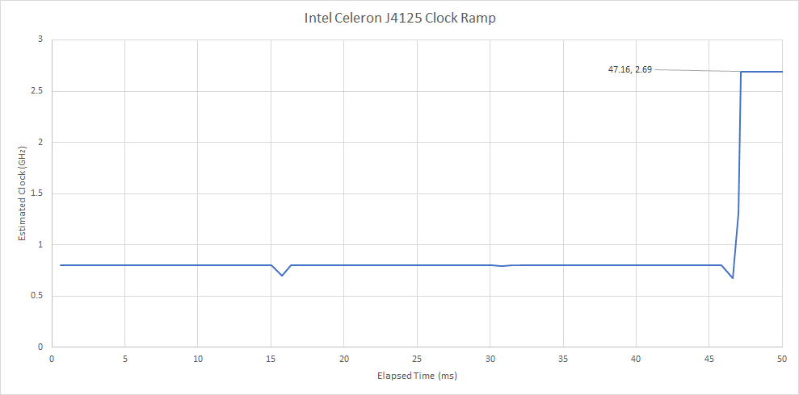

Snapdragon 670（Pixel 3a）有 2×Cortex-A75 2 GHz、6×A55 1.7 GHz。A75 ramp 很快；A55 较慢，而且插电时 A55 更快、A75 反而电池时更快。A55 idle 600 MHz，A75 略超 800 MHz。

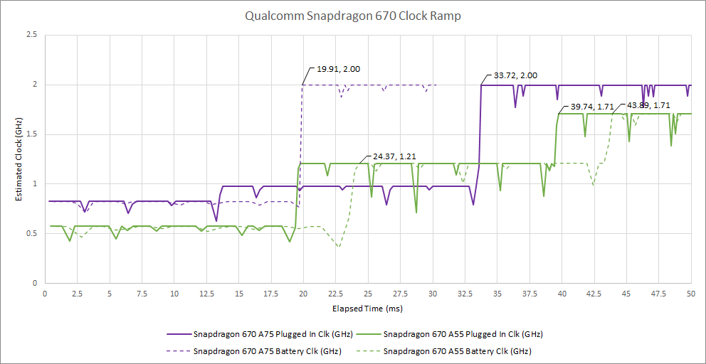

Snapdragon 821（LG G6）大小核都是 4-wide OoO Kryo，但 cache 与物理目标不同。Little Kryo 不论电池/满电接电都逐级超过 200 ms 到 1.59 GHz；电池 idle 300 MHz，接电 600 MHz。

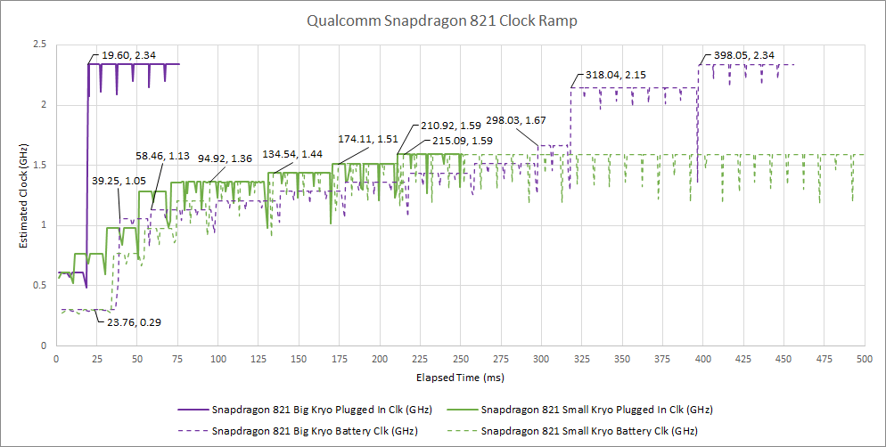

Big Kryo 满电接电时不到 20 ms 到 2.34 GHz，电池却近 400 ms；可能为防短任务瞬时功耗。电池下 100—300 ms 间，little 甚至略高于 big。

### 体系结构视角：移动 SoC 优化的是电池能量和温升，不是最短到顶时间

渐进 ramp 可让许多短任务在中频结束，避免电压冲高与热量积累。Big/little 的起始频率、cluster 电源域和调度迁移都会改变用户感知。测试应说明接电、充电状态、thermal state 和线程 affinity；否则同一 SoC 可出现完全相反曲线。

## 兆芯陆家嘴补测

KX-6640MA 使用旧版程序，按键启动采样而非睡眠 5 秒；按键事件传递可能多耗几 ms，精度略低。仍可看出陆家嘴 ramp 快于 Goldmont Plus，慢于 Zen 3/Skylake。

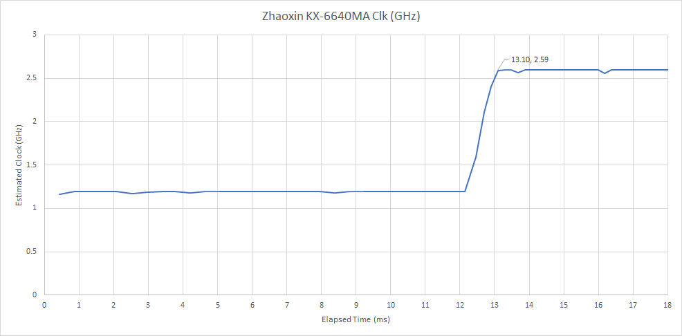

## 测量方法与误差

程序执行已知数量的依赖整数加法；绝大多数核心每周期推进一次，测量完成时间即可估算有效 core cycle/frequency。

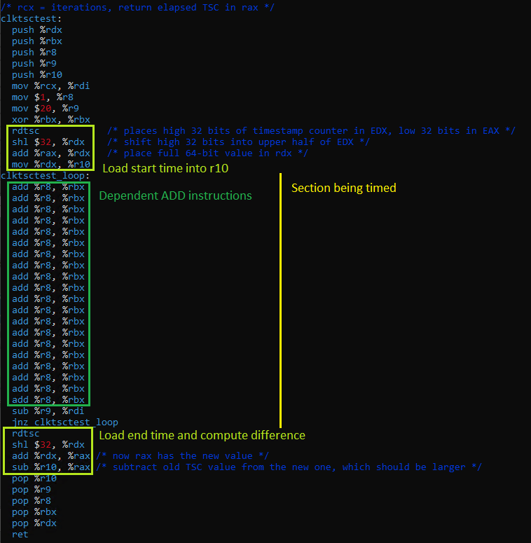

标准 `gettimeofday`/`ftime` 难测亚毫秒，x86 用 RDTSC，Arm 用 `CNTVCT_EL0`。重复小窗口后，以约 2 秒长区间同时读取系统时间与 timestamp counter，标定 counter→real time。最终精度受读 counter overhead 限制。

x86 TSC 通常按 base clock 增长，例如 FX-8350 4 GHz base 时每 ns 四 tick；Snapdragon 670/821 的 `CNTVCT_EL0` 约每 50 ns 一 tick，精度较低。

测得的是窗口内依赖加法的“有效频率代理”。若核心短暂停顿、线程迁移或加法 latency 不是 1 cycle，都会偏差；它不等同于直接采 PLL。

## 结语

Skylake Speed Shift、Zen 2/3 可在约 5—20 ms 内进入高频；Haswell/Piledriver 默认几十 ms，HEDT 和电池 Snapdragon 821 可达数百 ms。高 idle voltage 能把 Piledriver 压到亚毫秒，却显著增加待机功耗。

真正的交互响应要看完整曲线，而不是单一“到最高 boost”。先到 3—4 GHz 的处理器可能已经完成短任务；移动平台则可能有意避免最高频。主板、OS、接电状态和测量 counter 都是结果的一部分。
