# Everactive PKS3000：一颗靠环境能量运行的自供电 SoC

> 英文标题：Everactive’s Self-Powered SoC at Hot Chips 2025
> 撰文：Chester Lam
> 首发：Chips and Cheese，2025 年 9 月 17 日
> 链接：https://chipsandcheese.com/p/everactives-self-powered-soc-at-hot

Hot Chips 2025 的主角大多是数百瓦乃至千瓦级 AI 芯片，Everactive 讨论的却是一颗没有稳定电源、从光照和温差中“捡”能量运行的 SoC。自供电设备适合大规模工业传感：不用铺电源线、换电池，也不会直接因电网故障停机；代价是只能在微瓦到毫瓦且不断波动的预算内工作。

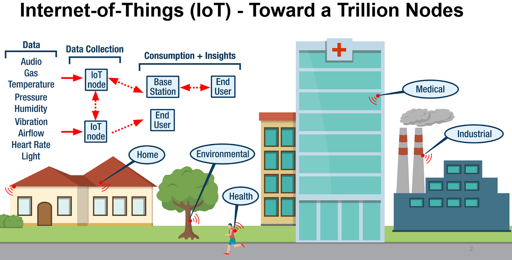

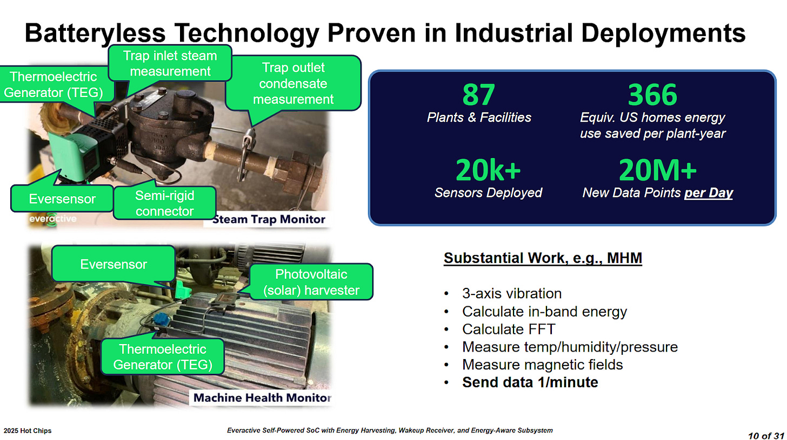

## PKS3000 总览

PKS3000 使用 55 nm ULP 工艺，面积 6.7 mm²。它可在 5 MHz 下以 12 μW 工作，最低功耗状态为 2.19 μW。芯片连接多种 Sensor，并提供低功耗 Wi-Fi/Bluetooth/5G 通信；扩展口还能连接外部 MCU 和存储，二者也可由采集能量供电。

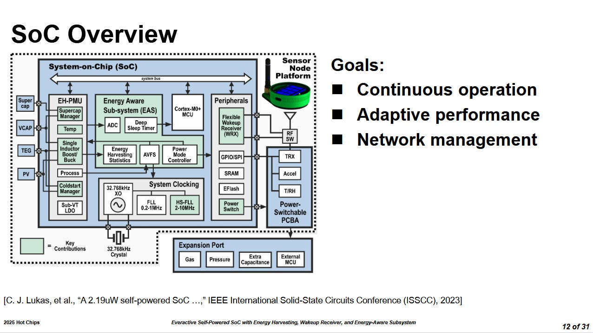

处理核心是 Arm Cortex-M0+，只有两级流水线、无内置 Cache，指令和数据共享内存端口。片上配置 128 KB SRAM 和 256 KB Flash。它的存储少于初代 IBM PC，却能以更高频率运行，体现近半个世纪工艺与低功耗设计的进步。

## EH-PMU：两路采集、四路供电

能量采集电源管理单元（Energy Harvesting PMU，EH-PMU）采用多输入、单电感、多输出（MISIMO）拓扑，可同时从两个来源采能并向四条 Rail 供电。典型输入是光伏（PV）与温差发电器（TEG），也可面向射频、振动或气流配置。

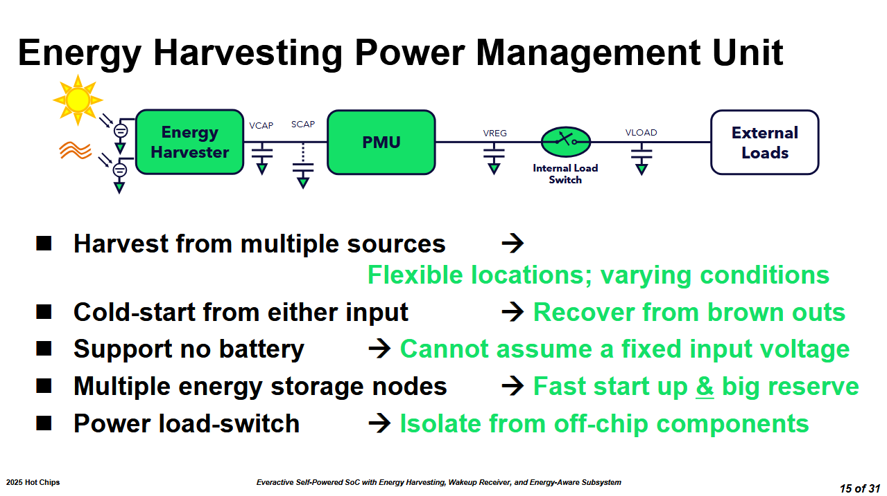

最大功率点追踪（MPPT）让每种能源在合适电压下取能。两只电容对抗波动：Supercapacitor 存更深的能量，帮助熬过长期恶劣条件；小电容充得快，Brownout 后可加速 Cold Start。PV+TEG 在 60 lux、8°C 温差下即可冷启动，大致相当于偏冷房间中的室内照明环境。

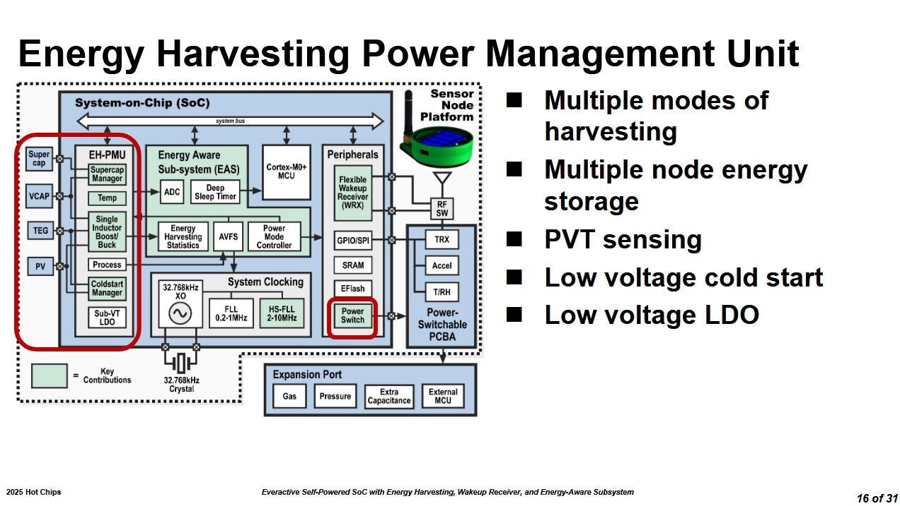

四条输出名为 1p8、1p2、0p9 和 adj。条件好时直接用采集源，条件差时转由电容供电；脉冲计数器监测全芯片能量流，并把统计送往能量感知子系统。

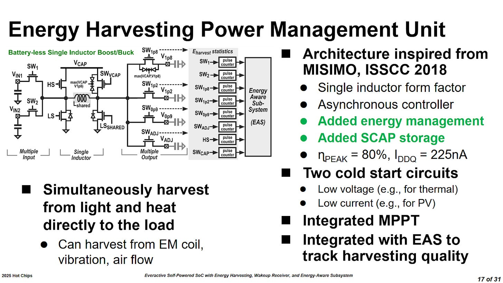

## EAS：不仅调频，还能切断外设

能量感知子系统（Energy Aware Subsystem，EAS）监控采集、储存和消耗，角色类似 Intel PCU 或 AMD SMU。Firmware 可设最高频率和策略，系统也可根据能量决定何时启用模块或执行 OTA 更新。

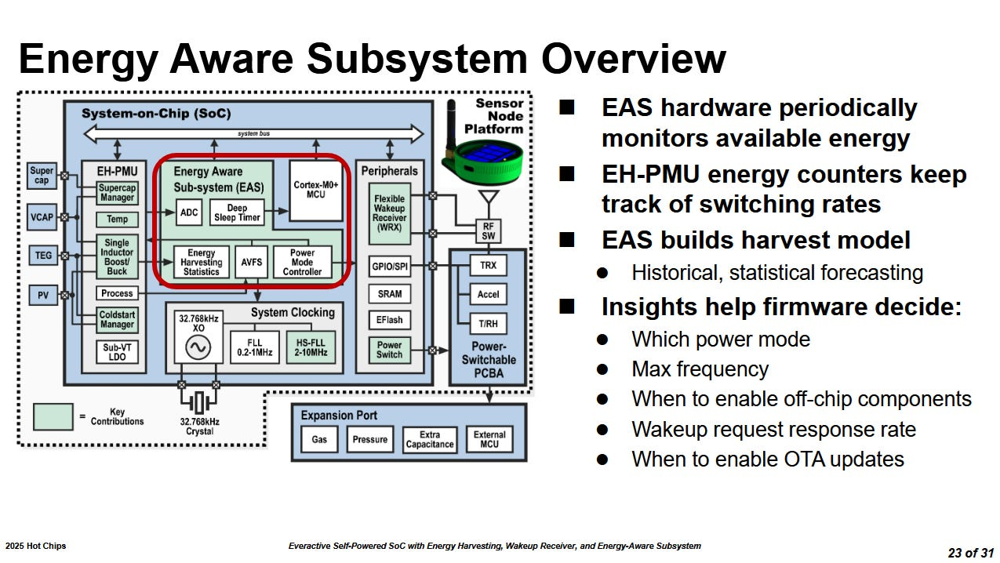

EAS 还能控制 Load Switch，切断静态功耗过高的外部器件。它会先通知外设优雅关机，必要时也能强制断电。这里的后果不只是电费或续航：一次错误预算可能触发频繁 Brownout，导致工业传感数据长时间缺失。

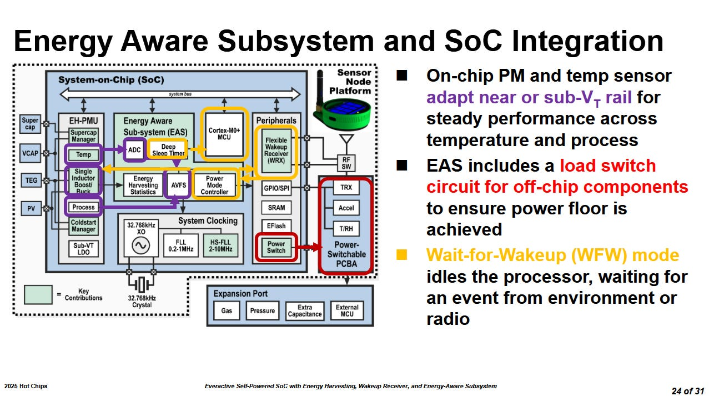

Wait-for-Wakeup 模式让芯片在低功耗下快速响应 Sensor/环境事件。整个设计不是追求持续运行，而是尽可能多地 Idle，把有效工作压缩成短 Burst。

### 体系结构视角：能量中断成为新的“异常”

普通 CPU 主要假设电源持续存在，DVFS 优化平均功耗；PKS3000 必须把未来能量收入也纳入调度。储能不足相当于一种系统级资源耗尽：EAS 要降频、推迟非关键任务、关闭外设，并保证恢复后仍有一致状态。验证不仅看平均微瓦，还要注入光照/温差下降，测 Brownout、冷启动、数据丢失和恢复时间。

## Wake-Up Radio：亚微瓦等待

Radio 即使只保持连接也有很高功耗底线，完全断开又有重连延迟，部分 AP 也不善于频繁重连。Wake-Up Radio（WRX）用超低功耗常开接收器只识别一小类唤醒消息，需要通信时才启动主收发器。

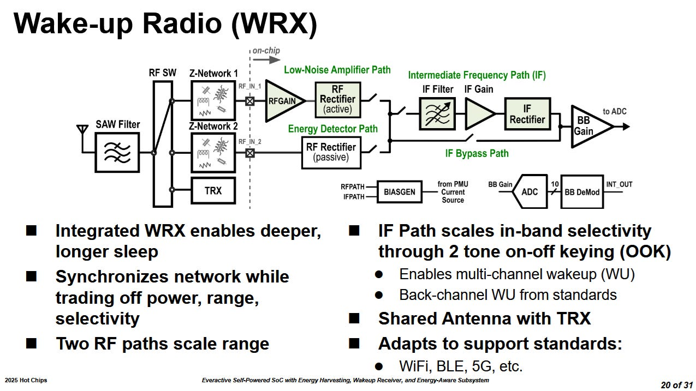

WRX 与客户选择的外部 Transceiver 共用天线，由 RF Switch 切换；板上匹配网络选择频段。Passive Path 覆盖 300 MHz～3 GHz，先做能量检测，再按协议选择 Baseband Gain 或 IF Gain。

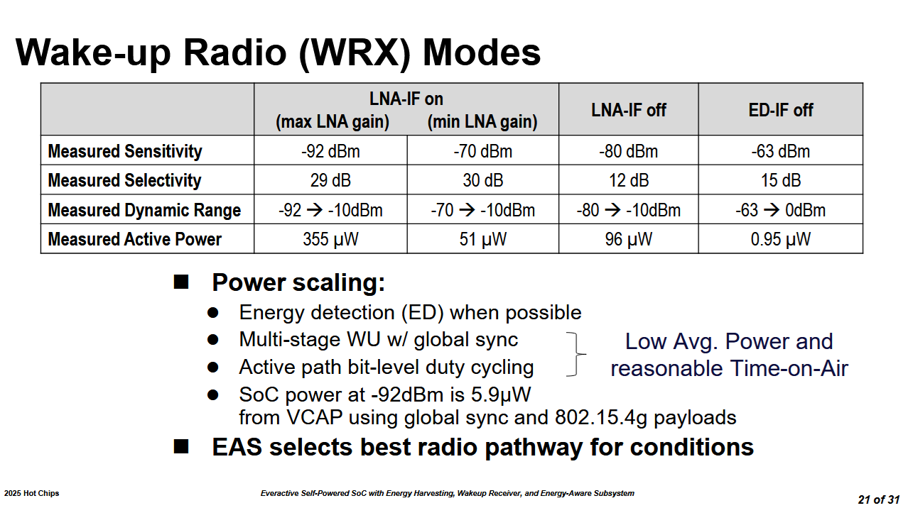

不启用 RF Gain 的被动模式低于 1 μW，在 Sub-GHz 下灵敏度约 -63 dBm、距离约 200 m，适合工业现场。超过 1000 m 需要 RF Boost；多级唤醒和细粒度 Duty Cycling 只在可能出现消息片段时采样，使平均功耗低于 6 μW、灵敏度达到 -92 dBm。

作为尺度参照，Intel Wi-Fi 6 AX201 在 Core Power Down 约 1.6 mW，连接 2.4 GHz AP 时约 3.4 mW。它绝对值也很低，却仍比 WRX 高几个数量级；两者功能不同，不能作产品性能排名。

## 从 PKS2001 到 PKS3000

PKS3000 可在部分功能关闭时以 2.19 μW Idle，WRX 常开也低于 4 μW；Active 为 12 μW。

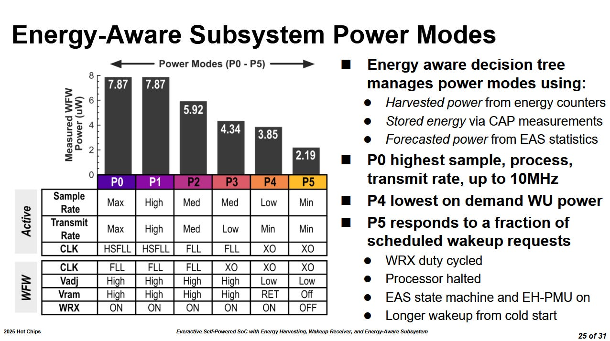

相比 65 nm PKS2001，55 nm ULP 的 PKS3000 频率更高、Radio 灵敏度更好，Idle 从 30 降至 2.19 μW，Active 从 89.1 降至 12 μW。工艺有贡献，EH-PMU、EAS、WRX 和更积极关断同样重要。

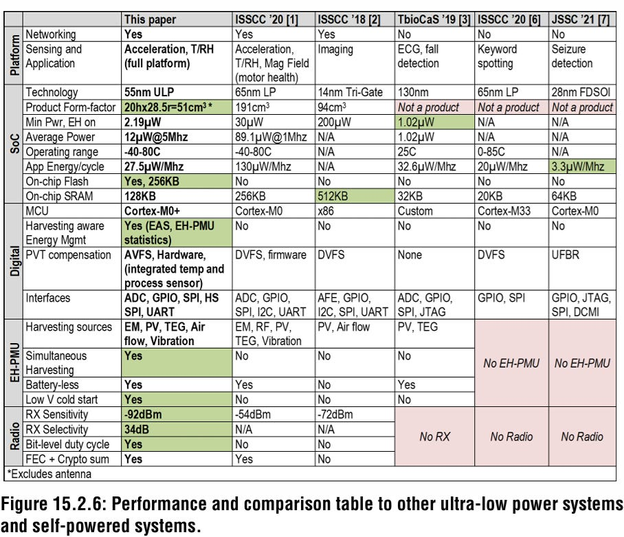

## 结语

PKS3000 展示的是“功耗底线”设计：数据中心关心 FLOP/W，手机关心毫瓦，而它要为每个微瓦建立机制。并非所有负载都适合这种 SoC，但工业监测等稀疏事件、低数据率任务可以用环境能量免去电池和布线。

两代芯片都没有使用尖端 FinFET，却在目标任务上取得极低功耗。与同届会议中 Google 的兆瓦级 AI 功率波动、Meta 的 93.5 kW 机架形成鲜明对照。未来应用能否扩大，取决于可采集能量、传感计算复杂度、无线标准和更先进工艺的成本，而不是单看 Cortex-M0+ 性能。

## 参考资料

- Everactive Hot Chips 2025 演讲
- Arm Cortex-M0+ 公开资料
- 文章所列低功耗 Wake-Up Receiver、PKS2001 与 Intel AX201 资料
