# Alder Lake 的缓存与能效：数据每远离核心一级，能耗就上一个台阶

> 英文标题：Alder Lake’s Caching and Power Efficiency 
> 撰文：Chester Lam 
> 首发：Chips and Cheese，2022 年 7 月 7 日 
> 原始链接：https://chipsandcheese.com/p/alder-lakes-caching-and-power-efficiency

缓存不仅提升性能，也直接决定数据搬运能耗。这里在内存带宽微基准中加入封装能量计数器：每个数据点开始和结束时读取 Intel MSR `0x611` 或 AMD MSR `0xC001029B`，按照能量单位寄存器换算为焦耳，再计算每 bit 或每条指令的能量成本。

所有平台只启用 4 个核心。每个线程使用独立数组，因此曲线显示的是 4 个私有缓存容量之和：若每核 L1D 为 32 KB，工作集超过 `4 × 32 KB = 128 KB` 才会整体溢出。Golden Cove 与 Haswell、Skylake 对比；Gracemont 与 Tremont、Goldmont Plus 对比；也加入 Zen 2/Zen 3，但 AMD 的 RAPL 很可能是模型估算而非直接测量，结果只能作为参考。

## Golden Cove：DRAM 每 bit 成本接近 L3 的五倍

Golden Cove 每核有 48 KB L1D、1.25 MB L2，整颗处理器共享 30 MB L3。数据离核心越远，单位搬运能耗越高。

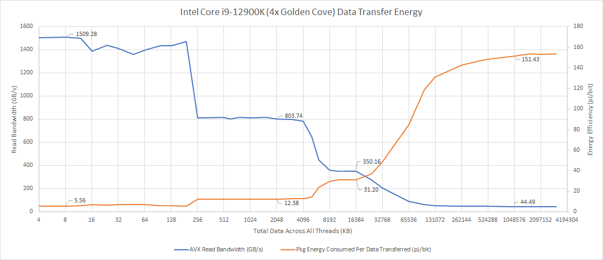

图 1 显示，从 DRAM 取数据的封装内能耗接近 L3 的 5 倍，而且尚未计入 DIMM 自身功耗。测试因 DDR5 主板问题使用 DDR4-3200，这一配置边界不能忽略。

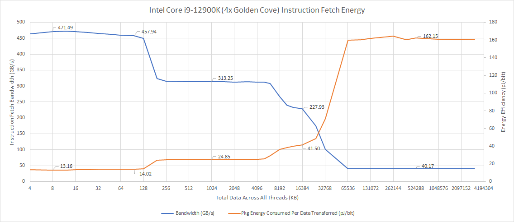

指令侧趋势相同，但用的是 4 字节 NOP，而数据侧 AVX load 一次可搬 256 bit，因此单位指令成本略高。按 `4 字节 × 4K uop × 4 核` 估算，微操作缓存覆盖约 64 KB 工作集；溢出到 L1I+译码后，每条指令能耗只增加 6.5%，而进一步落到 L2 时增加 77%。这说明 Golden Cove 的 L1I/译码路径能耗与 uop cache 很接近，也提示低功耗核心未必值得用大块 SRAM 建 uop cache。

### 体系结构视角：能耗取决于距离，也取决于完成时间

一次 L1 hit 只激活局部 tag/data 阵列和短数据通路；L3/DRAM 则涉及更长互连、更多仲裁与协议状态。单位时间功率低不等于单位工作能耗低：若带宽下降导致核心等待更久，ROB、调度器和寄存器文件仍需保持活动，最终焦耳数反而更高。这也是后文“race to sleep”只有在合适工作点才成立的原因。

## Gracemont：低功率核心不一定有最低搬运能耗

Gracemont 四核共享 2 MB L2。它在 DRAM 区域更高效，但缓存命中时的单位数据能耗反而高于 Golden Cove。

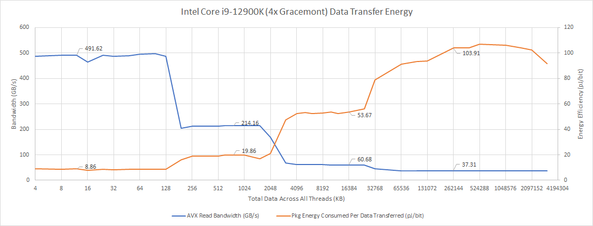

Gracemont 虽支持 AVX，但 256-bit 操作会拆成两个 128-bit 操作，更小的数据粒度会延长搬运同等数据量所需时间。共享 L2 还要在四核请求间仲裁，面积利用率较好，却可能牺牲带宽和能效。

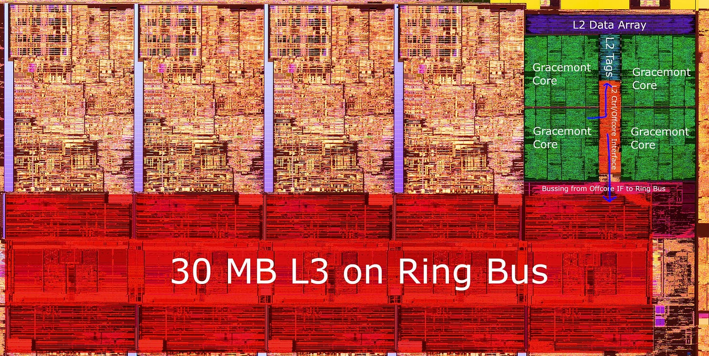

图 4 的橙色标注是根据裸片图作出的推测，不是 Intel 公布的逻辑框图。共享 L2 控制器和 off-core 接口可能承担集群仲裁，让每个小核到 ring 的路径不如 P-Core 直接；这可以解释 L3 区域的部分差异，但不能由照片确认内部拓扑。

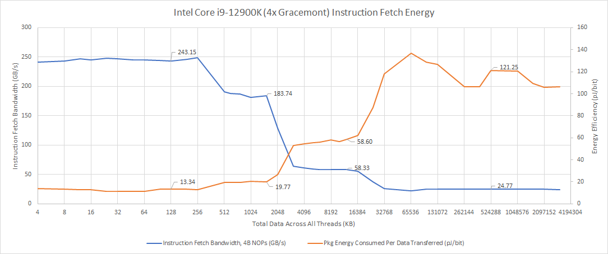

Gracemont 的 L1I+译码略优于 Golden Cove，但不如后者 uop cache；差距都小于 10%。进入 L2 后 Gracemont 略胜，进入 L3/DRAM 后则大体重复数据侧趋势。DRAM 区域 Gracemont 胜出，主要因为内存瓶颈下它较小的乱序后端耗电更少。

## Golden Cove 与旧 Intel 大核

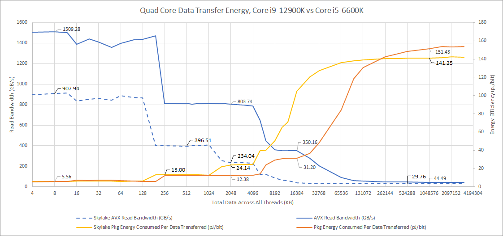

Golden Cove L1D 在带宽显著增加、load port 更多且频率更高的情况下，单位搬运能耗仍与 Skylake 接近；L2 容量和带宽更高，能效还略好。L3 结果更复杂：Skylake 的 ring 更短、L3 更小，单次读取更省能；Golden Cove 的大 L3 则能减少昂贵的 DRAM 访问。DRAM 区域第一代 Skylake 略优，因为它没有让超大的乱序结构在高频下等待内存。

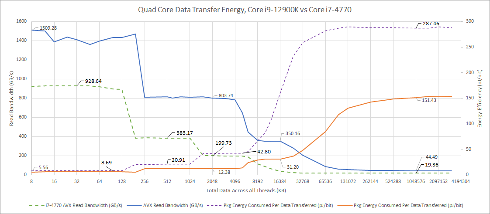

Haswell 虽仍有不错带宽，但 22 nm 工艺在各层级都更耗能，DDR3 平台也明显落后于更新的 DDR4 配置。跨代结果同时包含工艺、频率、缓存和内存差异，不能当作纯微架构对比。

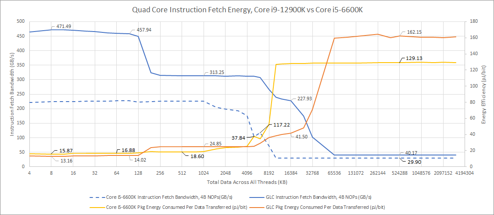

指令侧 Golden Cove 总体领先；Skylake 的 L2 取指路径却异常高效。两代在 uop cache miss 后转走 L1I+译码时，能耗增加都很小。

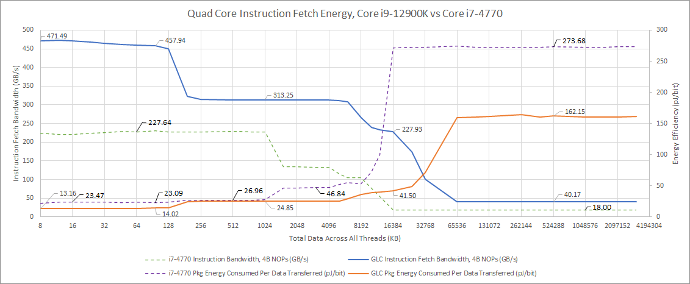

Haswell 受旧工艺影响全面落后，而且测试没有观察到明显的 uop cache 能效收益，或收益落在误差范围内。

## 与 AMD 比较：Intel 私有缓存强，AMD 共享 L3 强

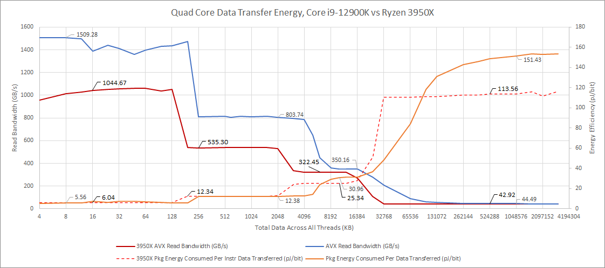

Zen 2 与 Golden Cove 的 L1/L2 单位能耗非常接近；Zen 2 在 L3 区域领先，可能因为一个片上网络域只连接 4 核及其 L3 slice，而 Golden Cove ring 要连接 10 个核心或核心集群及 10 个 L3 slice。DRAM 区域 Zen 2 接近 Skylake；Golden Cove 的超大后端在内存停顿时可能消耗更多。

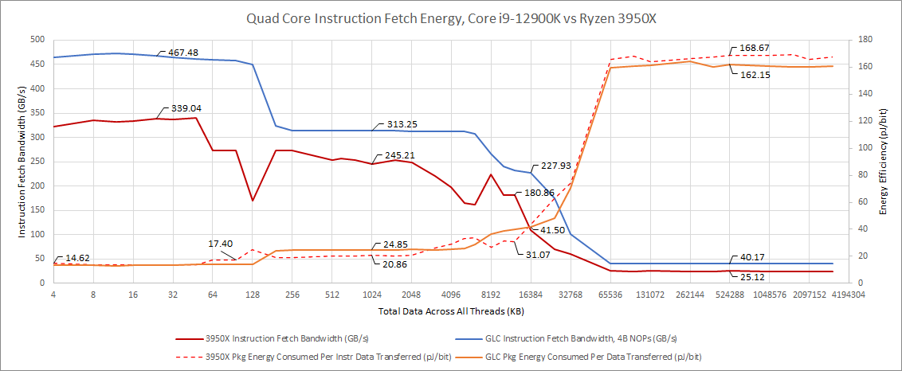

Golden Cove 从 uop cache 供给时略优；Zen 2 在 uop cache miss、转入 L1I+译码后能耗增加较明显。但 L1I miss 后由更低层缓存供给时，Zen 2 更高效；进入 DRAM 后，这一优势又消失。

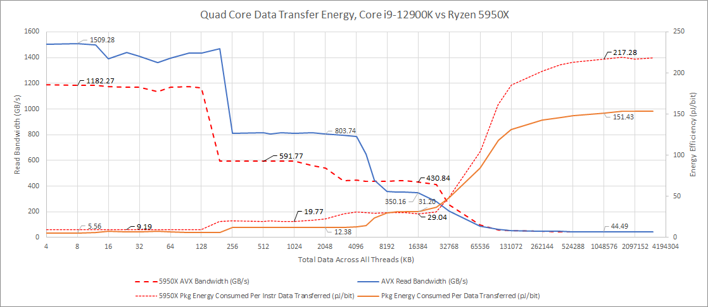

Zen 3 的私有缓存能效相对 Zen 2 回退，但 L3 仍以更高带宽和略低能耗胜出。可能因素包括更高默认 boost、更快内存带来的 Infinity Fabric 频率上升，以及 I/O die 功耗增加。

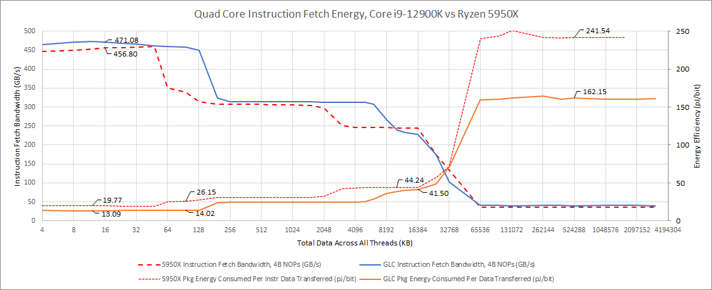

指令侧重复相似趋势，但 Zen 3 在 L3 区域不再保持明显能效优势。总体看，Intel 的私有缓存适合高带宽，AMD 的 L3 更强。若 AMD 整体能效领先，更可能来自以较小乱序结构达到相近性能；较低缓存延迟也降低了对深窗口的需求。

这里必须再次强调：AMD RAPL 值可能是功耗模型输出，并不具备 Intel 硬件计量同等精度。

## Atom 路线：Tremont 省电，Gracemont 更像面积核

Tremont 每核 32 KB L1D，四核共享 1.5 MB L2 与 4 MB L3，运行在 3 GHz 以下。

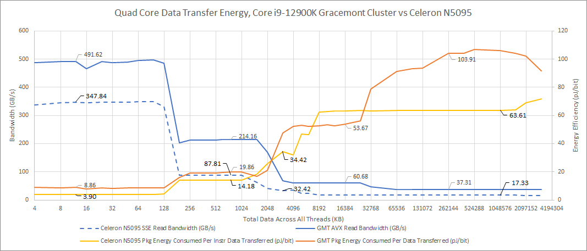

Tremont 在所有层级每 bit 能耗都更低。DRAM 工作集下，计数器报告整个封装仅 9.5 W，而 i9-12900K 约 30 W，这个低值本身也值得怀疑。代价是 Tremont L2/L3 带宽低，而且不支持 AVX。

Goldmont Plus 是 14 nm、3-wide 核心，每核 24 KB L1D，四核共享 4 MB L2。

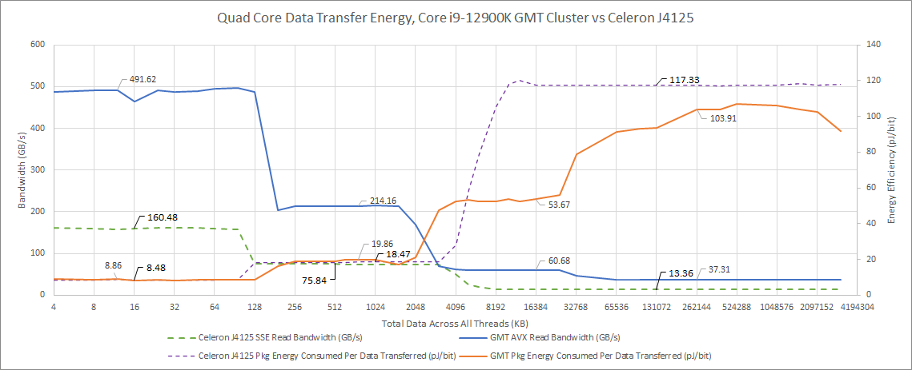

Goldmont Plus 缓存能效略好，4 MB L2 甚至比 Gracemont 的 2 MB L2 更省能，说明低频下成熟 14 nm 仍很高效，也反映 Gracemont 在 i9-12900K 中被推到接近 4 GHz。它的绝对带宽则很差：低频且不能每周期执行多个 SSE load。

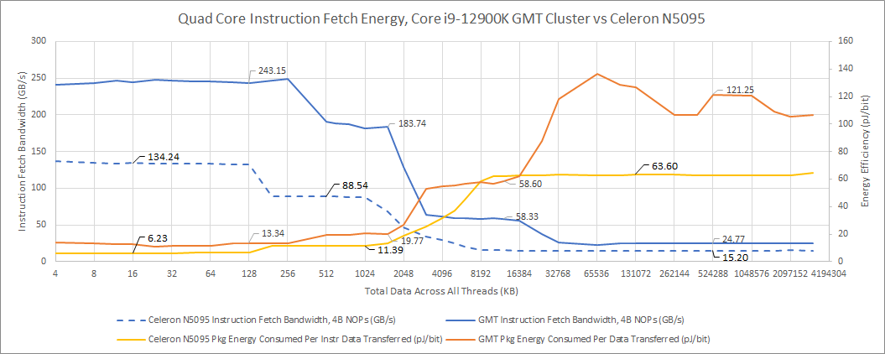

Tremont 在指令侧仍然最省能。

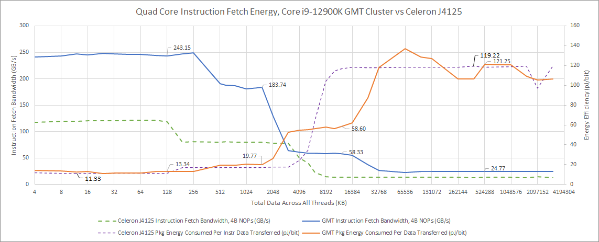

Gracemont 与 Goldmont Plus 的单位能耗接近，但前者凭更高频率和更宽流水线提供更高吞吐。由此更合适的定位是“面积效率核心”，而不是像早期 Atom 那样纯粹追求最低功耗。

### 体系结构视角：小核、低功率和高能效不是同义词

小核减少每周期激活的逻辑和静态面积，但同样工作若需要更多周期，能量可能并不低。宽向量数据在两个 128-bit 周期中搬运，会让时钟树、队列和控制逻辑保持活动更久；共享 L2 省面积，却增加仲裁路径。评价 E-Core 必须同时看 performance/W、energy/task 和 performance/mm²，不能只看瞬时瓦数。

## 一个跨平台规律：每远一级，成本显著上升

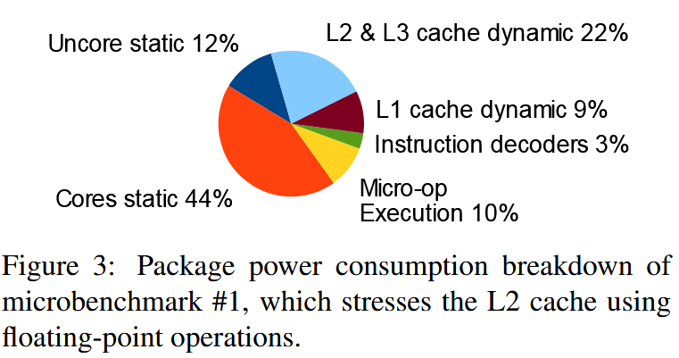

图 18 来自一篇研究 Haswell 译码器功耗的论文，用来说明缓存本身就是显著功耗来源，并非本文微基准的新测量。

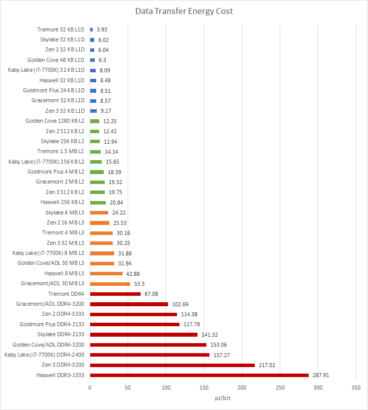

图 19 按缓存层级着色，使用落在某级容量内、又超出上一级容量的数据点取平均；DRAM 使用 1—3 GB 工作集。经验上，L2 hit 约为 L1 的两倍，L3 往往又超过 L2 的两倍，DRAM 通常是 L3 的 4—5 倍。

图 20 是 Arm 的公开示意，不是 Alder Lake 测试数据。它反映业界共同认识：降低数据移动距离同时改善性能与能效。

有些 CPU 在 DRAM 工作集下的封装功率反而低于 cache 工作集，但 DRAM 带宽低得多，完成同量数据所需时间更长，最终每 bit 能量仍更高。等待期间，大型乱序结构继续漏电和维持状态，race-to-sleep 逻辑必须结合完成时间理解。

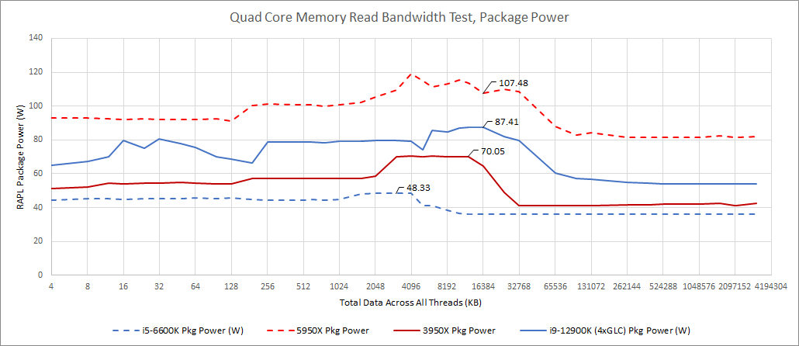

图 21 展示大核在 L3 流量加重时出现可测功率增加。Intel 用大 L2 减少 ring 访问是合理方向：其长 ring 和较多 L3 slice 让共享缓存访问比 AMD 更耗能，而 Golden Cove L2 又能在较大容量和高带宽下维持很有竞争力的单位能耗。

## 结语

所有平台都呈现同一阶梯：L1、L2、L3、DRAM 越走越远，单位数据能耗越高。Golden Cove 借 Intel 7 工艺在增加 load port、频率和带宽的同时，保持了强劲私有缓存能效；Gracemont 则在高频桌面配置下没有击败前代 Tremont，更像面积效率方案。

Intel 的强项是核心私有缓存，AMD Zen 2/Zen 3 的强项是低延迟、高效 L3。跨厂商数字还混入频率、内存、互连和计数器实现差异，尤其 AMD RAPL 的模型性质，因此只能讨论结构趋势。真正稳固的结论是：缓存命中率改善不仅省下等待周期，也省下片上与片外搬运能量。
