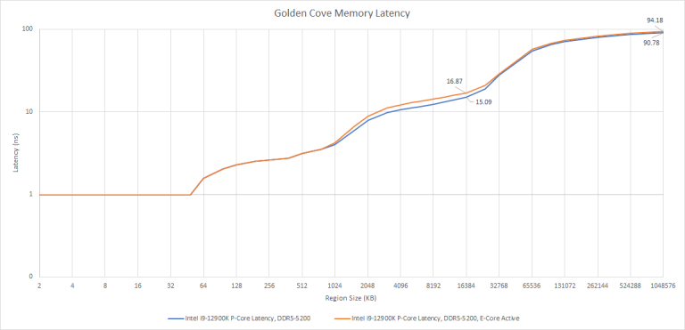
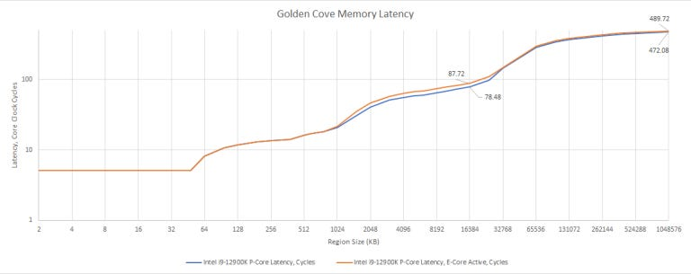
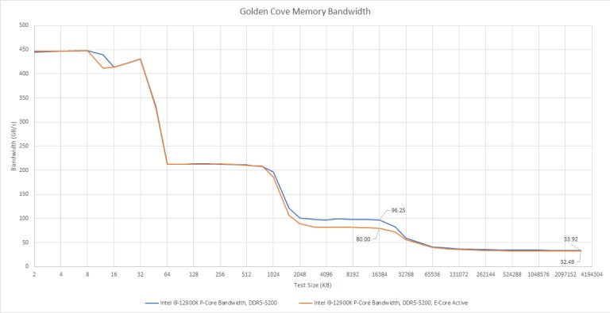
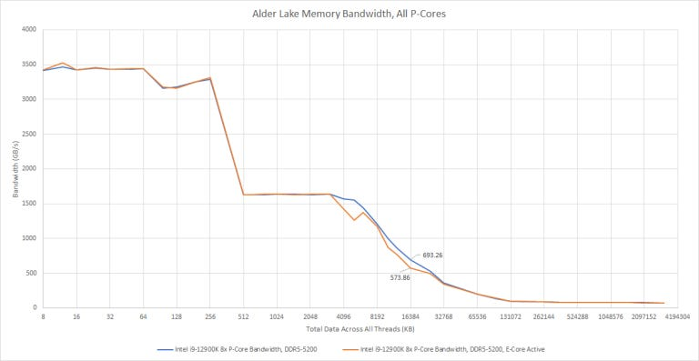
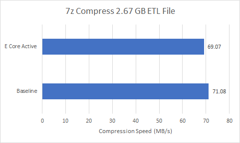
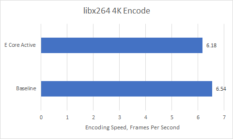

# Alder Lake 的混合架构磨合：E-Core 一忙，Ring 为何跟着降频

> 英文标题：Alder Lake – E-Cores, Ring Clock, and Hybrid Teething Troubles 
> 撰文：Chester Lam 
> 首发：Chips and Cheese，2021 年 12 月 16 日 
> 原始链接：https://chipsandcheese.com/p/alder-lake-e-cores-ring-clock-and-hybrid-teething-troubles

Alder Lake 只启用 P-Core 时，环形总线（ring）可以运行在 4.7 GHz；只要 E-Core 上有任务，ring 就降到 3.6 GHz。更关键的是，这个行为并不要求 E-Core 真正访问 L3 或内存。

测试在一颗 Gracemont E-Core 上运行很小的 NOP 循环作为假负载。循环只从该核心的 L1 指令缓存取指，不访问 L3 或内存；同时在 P-Core 侧分别测量延迟、带宽和应用性能。这样可以把“E-Core 占用共享缓存”的影响，与“E-Core 激活导致 ring 降频”的影响分开。

## 延迟：P-Core 侧凭空多出 9—10 个周期

图 1 显示，在 L3 容量范围内，ring 降频带来约 11.7% 的延迟惩罚，绝对差约 1.78 ns。进入内存后，差距扩大到 3.4 ns，但相对增幅降至 3.7%，因为 DRAM 自身延迟占据了更大比例。

按核心周期看，激活 E-Core 让 P-Core 的共享层级访问多出约 9—10 周期。Golden Cove 虽有很大的乱序窗口，但 demand L3 hit 依然更难完全隐藏，因而更依赖大容量私有缓存和预取器维持指令吞吐。

## 带宽：L3 下降约 20%，内存影响很小

单核测试里，L3 带宽下降约 20%，内存带宽只下降约 3.2%。由于假负载没有向 L3 发请求，这个差异不能归因于 E-Core 与 P-Core 争抢缓存带宽；ring 的频率变化才是主要变量。

多 P-Core 聚合测试重复了同一趋势：L3 带宽下降约 20%，但在 3 GB 工作集下，内存带宽只少 0.05%，处于运行间波动内。内存控制器和 DRAM 已成为瓶颈时，ring 从 4.7 GHz 降到 3.6 GHz 尚不足以改变可持续内存带宽；对片上 L3，它却直接削弱了服务能力。

### 体系结构视角：时钟域耦合让“没访问共享资源”也会付费

混合核心加入同一一致性环，必须在电压、频率、时序和唤醒状态之间建立安全规则。如果早期实现采用保守策略——E-Core 一进入活动态，ring 就切换到兼容所有参与者的较低工作点——那么即使小核只执行 L1I 内的 NOP，大核也会承担共享时钟域的延迟和带宽代价。

这类问题应通过 uncore/ring 频率、L3 hit latency、ring occupancy 和 E-Core C-state 同步观测来确认。本文只确认了宏观行为，没有 RTL 或厂商时钟控制资料，不能进一步断言具体 PLL、分频器或电压域实现。

## 应用影响：小，但可以测出来

应用测试把线程亲和性固定到全部 P-Core，每个核心一个线程；唯一差别是是否在一颗 E-Core 上保留 NOP 假负载。

E-Core 保持空闲时，压缩性能提高 2.9%。这与 L3 延迟和带宽改善方向一致，但单项应用无法把全部差异精确归因到某一级缓存。

编码性能提高 5.8%，变化可测，却很难在日常使用中直接感知。另一方面，真正让 E-Core 工作通常会带来额外吞吐，其收益可以轻易超过这部分 P-Core 损失。因此这不是“应该关闭 E-Core”的结论，而是 Alder Lake 第一代混合架构存在共享环频率副作用。

### 体系结构视角：单线程延迟与整机吞吐是两套目标

P-Core 单独跑得更快，不等于系统把 E-Core 关掉后更快。ring 降频使每个 P-Core 的 L3 命中更慢，但 E-Core 增加了可退休的总指令数。调度器真正需要解决的是把延迟敏感线程留在 P-Core，把后台或可扩展线程放到 E-Core，并在整体吞吐收益与共享 uncore 代价之间取得平衡。

如果工作负载主要命中 P-Core 私有 L1/L2，ring 降频影响可能很小；如果频繁命中 L3、依赖跨核共享或锁操作，影响会更显著。本文的两个应用结果只代表其具体版本、输入和亲和性配置；页面没有披露完整编译参数，不能外推为所有软件的固定损失。

## 结语

Alder Lake 展示了 Intel ring 的模块化扩展能力，也暴露了第一代混合设计的磨合问题：一颗 E-Core 仅运行 L1I 内的 NOP，就会让 ring 从 4.7 GHz 降到 3.6 GHz；P-Core 侧 L3 延迟增加约 11.7%，L3 带宽下降约 20%，而 DRAM 带宽基本不变。

实际测试中，E-Core 空闲让压缩和编码分别快 2.9% 与 5.8%。这部分损失通常能被 E-Core 提供的额外吞吐抵消，但它说明混合架构的难点不只在软件调度，还包括共享互连、时钟域和功耗状态的协同。后续 Raptor Lake 的泄露材料曾暗示 Intel 会继续改进这一点；在正式实现数据出现前，这仍是当时的预期，而不是本文测试确认的结果。
