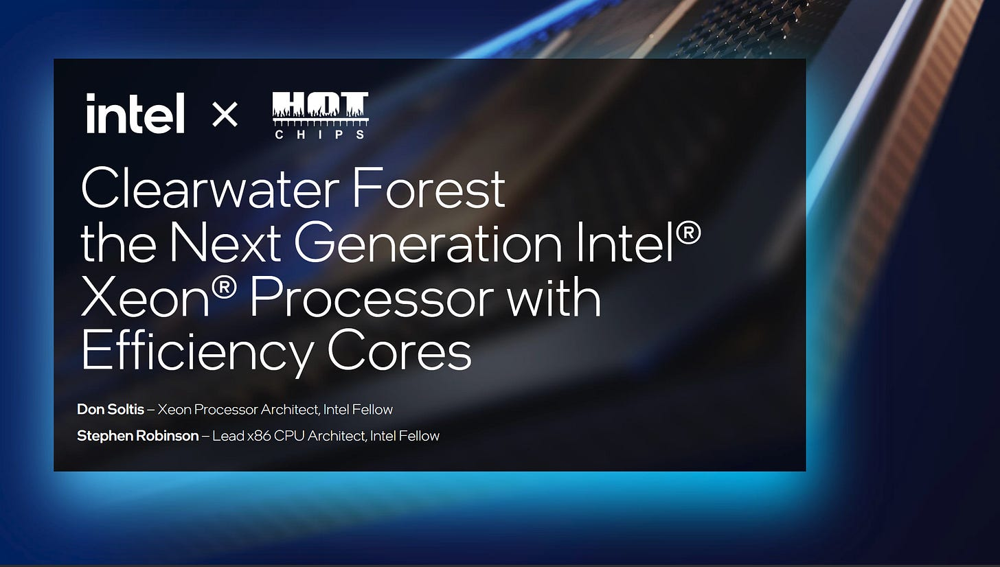
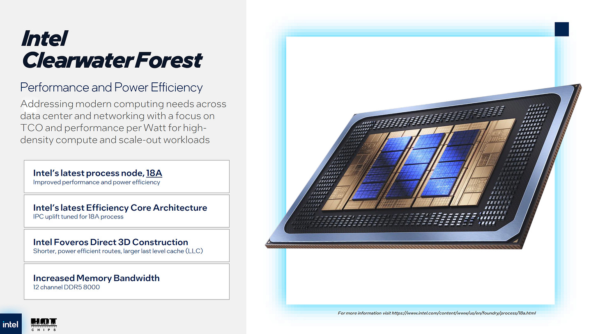
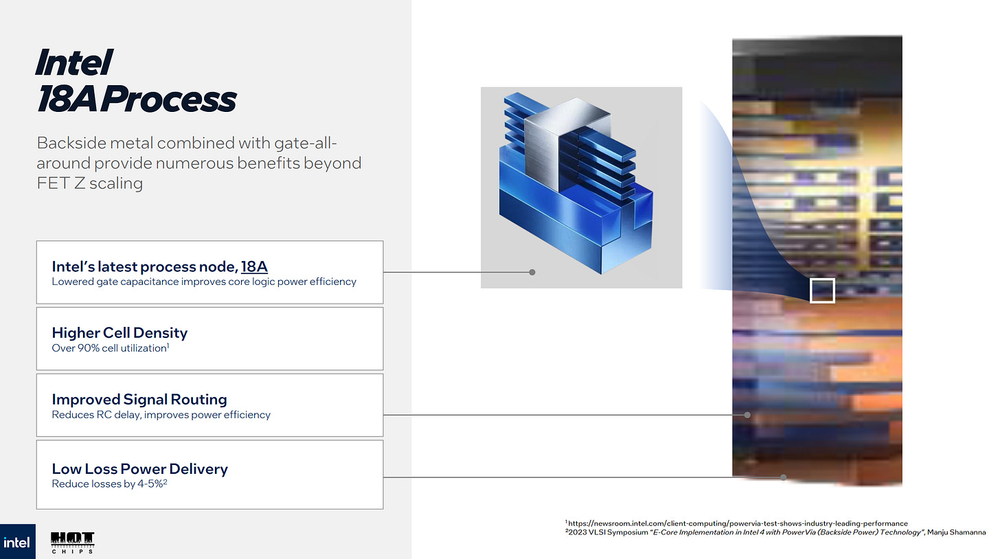
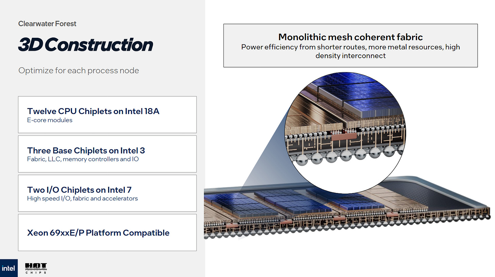
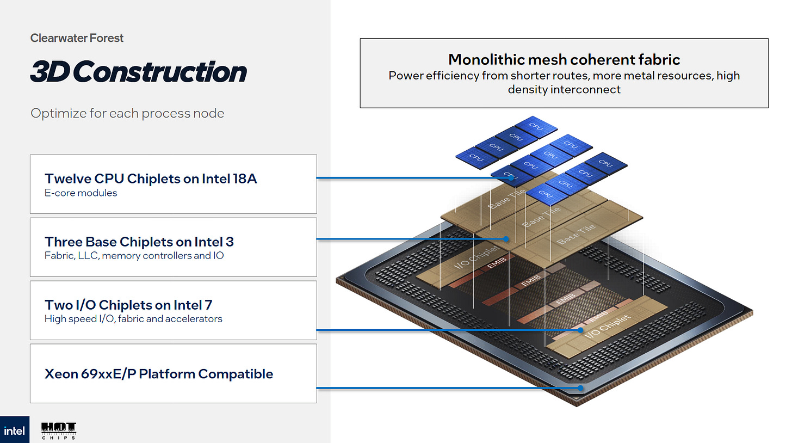
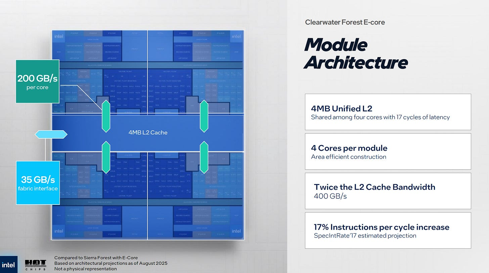
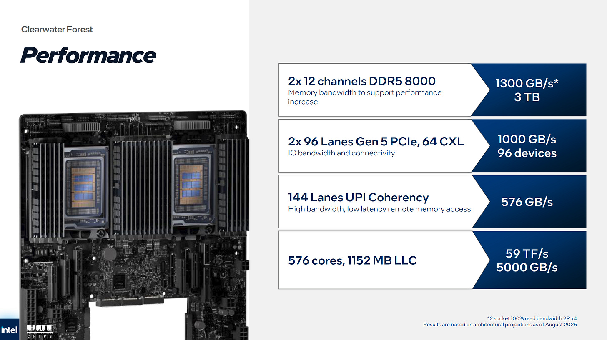
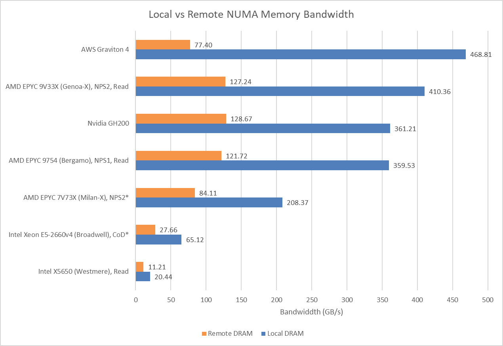
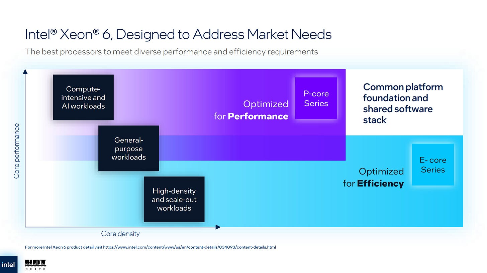

# Clearwater Forest：288 个 E-Core 如何拼成一颗服务器 CPU

> **文章来源**
>
> - 文章：*Intel’s Clearwater Forest E-Core Server Chip at Hot Chips 2025*
> - 副标题：*Sometimes, the solution to a problem is more E-Cores*
> - 撰文：Chester Lam
> - 首发：Chips and Cheese
> - 发布：2025 年 8 月 25 日
> - 链接：https://chipsandcheese.com/p/intels-clearwater-forest-e-core-server

E-Core 在 Client 用密度补多线程，在 Server 同样成立。Ampere Altra 80 核、AmpereOne 192 核、AMD Bergamo 128 核已经证明 Density-optimized Server 市场存在。Clearwater Forest 让 Intel 用 Skymont E-Core 正面进入：288 核，是 Sierra Forest 144 核的两倍。

*图 1：Skymont 比前代 Crestmont 更宽、Window 更大，在 Client 上已接近 P-Core 单线程；四核 Cluster 共享 4 MB L2。本文基于 Hot Chips 2025 资料，产品尚未接受独立实测。*

## 封装：18A Compute Die 堆在 Intel 3 Base Die 上

每颗 Compute Die 似乎有六组 Skymont Cluster，即 24 Core，使用 Intel 18A，因为 Core 最能从 Density 和 Power Delivery 提升获益。

*图 2：一颗 Compute Die 的 24 核来自六个 4C/4 MB L2 Cluster。图中“appears”口径应保留，尚非拆片确认。*

Skymont 还在 Arrow Lake 采用 TSMC 3 nm，显示 Intel Core Design 已能跨 Foundry Node，而非旧时代与自家制程强绑定。

*图 3：先进 Node 帮助 E-Core 提升频率、能效与密度；具体产品 PPA 仍需 Silicon Test。*

Compute Die 通过 3D Stack 放在 Intel 3 Base Die 上。Base Die 承载 Mesh 与 L3 Slice；分离 L3 获得实现 8 MB Slice 的面积，全芯片 576 MB LLC。三颗 Base Die 以 45 μm Pitch Embedded Silicon Bridge 相连；Compute-to-base 约 9 μm Pitch——后一个数字带“若现场听取无误”的不确定性。

*图 4：计算层用 18A，互连/Cache Base 用 Intel 3，把逻辑类型映射到更合适 Node。*

Mesh 可看成横纵两个 Ring。Vertical Direction 跨 Base Die 从顶到底；Memory Controller 位于 Base 边缘，Cache Slice 在 Horizontal Direction 关联最近 Controller。由此推测每 Slice 管理的 Physical Address Range 对应最近 Memory Controller，便于降低 Memory Latency、划分 NUMA；这是读图解释，不是 Intel 明示的地址映射公式。

*图 5：每 Base 承载四 Compute Die=96 Core，三 Base 合计 288。上下 I/O Die 使用 Intel 7，因为 I/O 不随先进 Node 良好缩放，并复用 Sierra Forest I/O，类似 AMD 跨代复用 I/O Die。*

### 体系结构视角：3D 分层是在按逻辑属性选择制程

Core 需要高 Density/高性能 Transistor，L3/NoC 需要容量和大 Wiring，SerDes/PCIe 更重 Analog/PHY、缩放收益小。把它们拆到 18A、Intel 3、Intel 7，可分别优化良率与成本；代价是 Vertical Link、Thermal Path、Clock/Power Domain 和跨 Die Verification 更复杂。

## 两级 Interconnect：Cluster 内 L2，系统级 Mesh

Skymont 单 Core L2 Bandwidth 与 Crestmont 相同，但 Cluster Aggregate 增大：先前测量口径为每 Core 64 B/cycle、四核总 256 B/cycle；Crestmont Cluster 仅 128 B/cycle。

*图 6：Private Execution Path 不必变宽，Shared L2 Bank/Port Aggregate 增长即可让四核更少互相争用。*

每 Cluster 可维持 128 个 L2 Miss 到系统 Fabric。更多 Outstanding Miss 对隐藏 Server L3/DRAM Latency 至关重要。Intel 给出每 Skymont Cluster 35 GB/s Fabric Bandwidth；这更像受 Latency 限制的测量值，不一定代表 Mesh Interface 物理宽度。Arrow Lake 4C Skymont 从 L3 可读超 80 GB/s，差异暗示 Clearwater Forest L3 Latency 高或 Mesh Clock 低。

*图 7：4 MB L2 承担关键隔离作用；Server 若 L2 Hit Rate 低，35 GB/s/Cluster 的可见 Fabric 能力可能限制吞吐。*

### 体系结构视角：128 个 Miss 不是 128 倍带宽，而是延迟预算

Little’s Law 给出 `Throughput≈Outstanding/Latency`。高 Latency Mesh 需要更多 In-flight Miss 才能接近 Link Limit；若 128 项仍不够，接口看似很宽也会空转。反过来，扩大 Miss Queue 增加 Area/Tag Compare/Recovery 状态，Prefetch 还可能挤压 Demand。

## 576 MB L3、1.3 TB/s DRAM 与 576 GB/s UPI

L3 Latency 很可能高、Bandwidth 中等，但 576 MB 容量可带来巨大 Hit-rate 优势。AMD V-Cache 单 Cluster 96 MB，且一个 Cluster 不能向另一个 L3 Allocation；Intel Unified/System L3 的可用范围不同。

DDR5-8000 Read 约 1.3 TB/s，是很高的 Server DRAM Bandwidth。

*图 8：英文正式图注明确这是旧数据，只用来给量级背景。Clearwater Forest 双路 UPI 宣称 576 GB/s，需真机确认实际可达到多少。*

I/O 也很大：每 Socket 96 条 PCIe Gen5，其中 64 支持 CXL，Aggregate I/O 达 1 TB/s。

### 体系结构视角：Density Server 的三层带宽必须同时扩展

288 Core 先争 Cluster L2，再争 Mesh/L3，最后争 12? Channel DDR5/UPI/I/O（Channel 数在本文未给，不能补写）。任何一层只扩容量、不扩 Outstanding/Port，就会把瓶颈下移。Topology-aware Thread/Data Placement 和 NUMA 分区将直接影响可用带宽。

## Intel 的 20 Rack 对 70 Rack 主张该怎样理解

Intel 称 20 Rack Clearwater Forest 可提供旧 P-Core Server 70 Rack 的相同性能，测试为 SPEC CPU2017 Integer Rate。Rate 运行很多独立 Copy，天然随 Core Count 扩展，最能展示 288 Core Density。

*图 9：这是 Intel 官方容量/性能主张，不是 Chips and Cheese 独立实测。必须知道 SPEC Subset、Compiler/Flags、Power Limit、Rack 配置、Memory 与基准旧平台，才能评价 20:70 的普适性。*

### 体系结构视角：Rate Benchmark 奖励核心密度，不等同于所有 Server Workload

独立 Copy 很少共享数据，能把 288 Core、Memory Channel 和大 L3 并行利用；Latency-sensitive Database、Strong Scaling、Lock-heavy Service 或每 Core License Workload 会有不同最优点。应同时报告 Per-core、Per-socket、Per-watt、Per-rack 与 Tail Latency。

## 最后的评价：很有潜力，但真机前不能下结论

若 Skymont 在 Server 仍接近 Desktop Per-core Performance，Clearwater Forest 会对 AMD 与最新 Arm Server 形成强竞争。但 Core Performance 高度依赖 Memory System，L3/DRAM Latency 仍未知，更可能在高 L2 Hit Rate 时发挥。

Atom/E-Core 十年间从与 P-Core 不在一个性能层级，走到进入 Desktop 和 Server。Intel 同时要验证 Skymont 的 18A Server/TSMC 3 nm Client Implementation，以及 3D Compute/Base、跨 Base Mesh、复用 I/O。能否把 Hot Chips 数字转成部署表现，必须等产品与独立测试。

### 体系结构视角：从 Clearwater Forest 可以归纳出的六点认识

第一，E-Core 已从“省电辅助核”变成 Density Server 主角。288 Core 的目标是每 Rack/每 Watt Throughput，而非绝对单线程冠军。

第二，3D Stack 让 Cache/NoC 不再和 Core 争同一平面面积。8 MB Slice 与 576 MB L3 是分层工艺直接带来的组织自由。

第三，大 L2 是慢 Mesh 的第一防线。4 MB/Cluster 与 256 B/cycle Aggregate 需要尽量截住 Traffic。

第四，Unified L3 容量优势可能伴随高 Hit Latency。真实收益由 Working Set、Sharing 与 Placement 决定。

第五，I/O Die 复用是工程资产。Intel 7 PHY 不必迁先进 Node，可降低验证与 Supply-chain 成本。

第六，发布前的体系结构判断必须留白。35 GB/s Fabric、1.3 TB/s DRAM、576 GB/s UPI 与 20:70 Rack 都需要独立测试条件闭环。

## 参考资料

- Chips and Cheese：[*Intel’s Clearwater Forest E-Core Server Chip at Hot Chips 2025*](https://chipsandcheese.com/p/intels-clearwater-forest-e-core-server)
- Intel：Hot Chips 2025 Clearwater Forest Presentation（正文 Slides/数据来源）

网页末尾提供 Patreon、PayPal 与 Discord 支持入口。
