# Crestmont：Meteor Lake E-Core 的渐进升级

> **文章来源**
>
> - 文章：*Meteor Lake’s E-Cores: Crestmont Makes Incremental Progress*
> - 撰文：Chester Lam
> - 首发：Chips and Cheese
> - 发布：2024 年 5 月 13 日
> - 链接：https://chipsandcheese.com/p/meteor-lakes-e-cores-crestmont-makes-incremental-progress

E-Core 自 Alder Lake 起成为 Intel Client 战略核心。Meteor Lake 用 Crestmont 替代 Gracemont，还加入两颗 Low-power E-Core（LPE-Core）。两类核心 Microarchitecture 相同，周边完全不同：主 E-Core 接 Ring 和 Shared L3，LPE-Core 位于 SoC Tile，不开 CPU Tile 就能处理轻负载，代价是没有 24 MB L3。

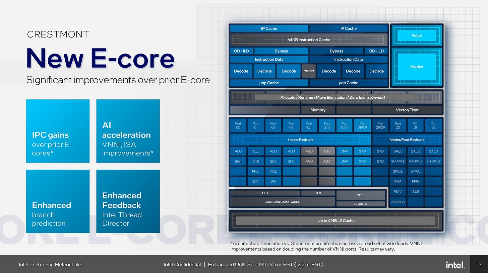

*图 1：测试为 Core Ultra 7 155H / ASUS Zenbook 14 OLED，主要对照旧 Core i7-12700K/i9-12900K Gracemont 数据。平台、Clock、DRAM 不统一。*

## 系统与 Clock：两组四核加一组双 LPE

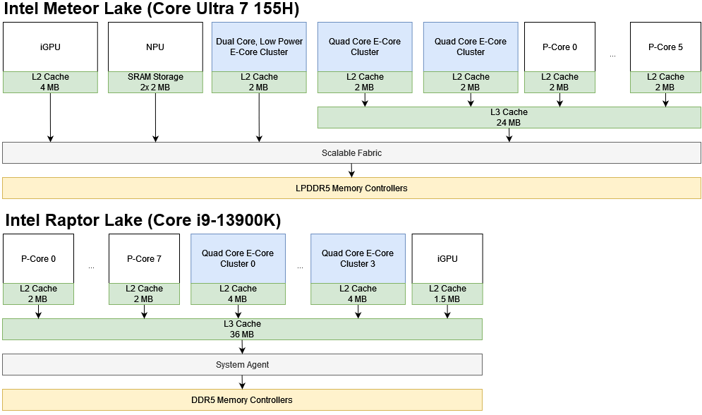

*图 2：八个 E-Core 分两组四核 Cluster 接 Ring，与 P-Core 共享 L3；两 LPE 位于 SoC Tile，靠 Scalable Fabric 一致性。旧 Intel 则让所有 Core/iGPU 围绕 Ring、共享 L3/System Agent。*

Crestmont 使用按 Active Core Count 固定的旧式 Boost：超过四核降到 3.1 GHz，超过六核降到 2.8 GHz；P-Core 仍按温度/功耗/电流动态独立调整。

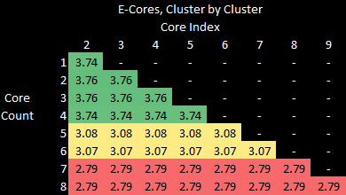

*图 3：正式图注说明频率由 Dependent Register Add 估算。最多四核保持 3.8 GHz，不论同 Cluster 四核还是两 Cluster 各两核；LPE 不影响该 Ratio。*

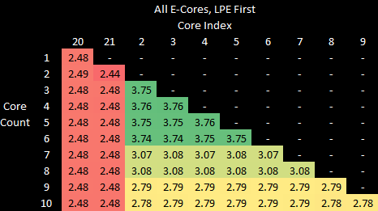

*图 4：同样为估算值。LPE 独立管理。*

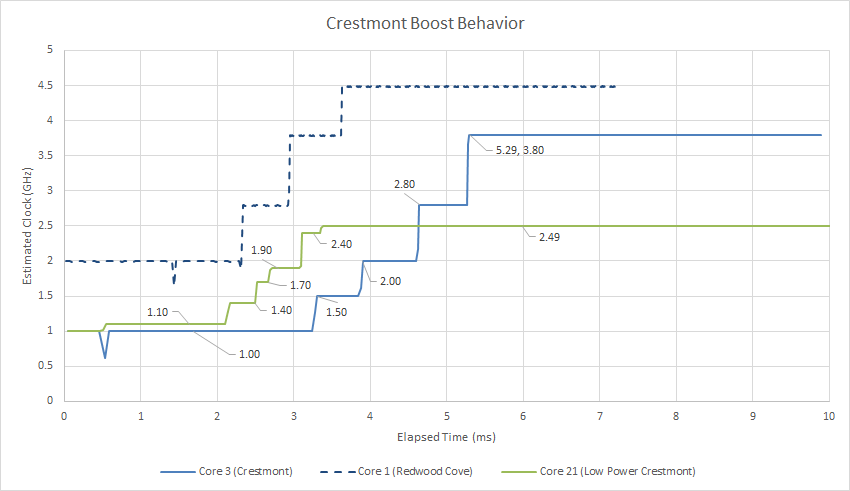

*图 5：主 E-Core 约 5 ms 到 3.8 GHz，分多 Step，可能给 Power Delivery 留响应时间；LPE 前 3～4 ms 更快，最高仅 2.5 GHz。*

## 核心总览：六宽，但多数 Backend 没变

Crestmont 是 6-wide Superscalar OoO Core，本质是增强版 Gracemont。用微基准估算容量并非精确科学：Retirement 后资源不一定立即 Reclaim，Distributed Scheduler 还要逐 Queue/Port 探测，小差异可能只是误差。

*图 6：容量为反推；Store-data 与 Jump 共享同一 Queue 由 Intel Guide 说明，旧分析曾因没想到这种组合而漏掉。*

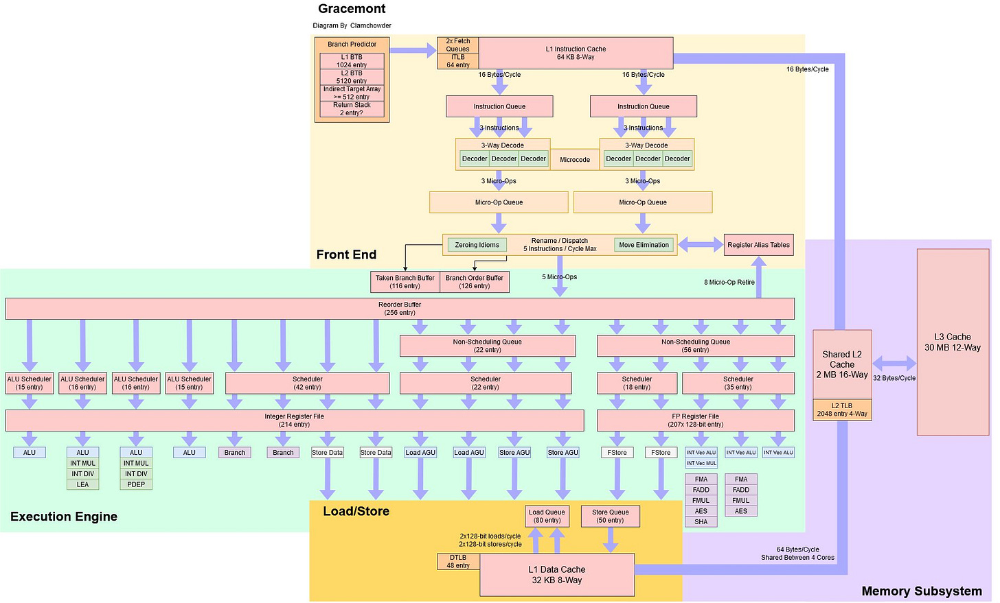

*图 7：ROB、RF、LSQ 和大体 Execution Resource 接近，Crestmont 重点改 Frontend、Rename、TLB 与部分 FP。*

## Branch Prediction：容量增加，慢层也更慢

L1 BTB 仍 1024 Entry，Taken 1-cycle；L2 BTB 从 5120 增至 6144 Entry。

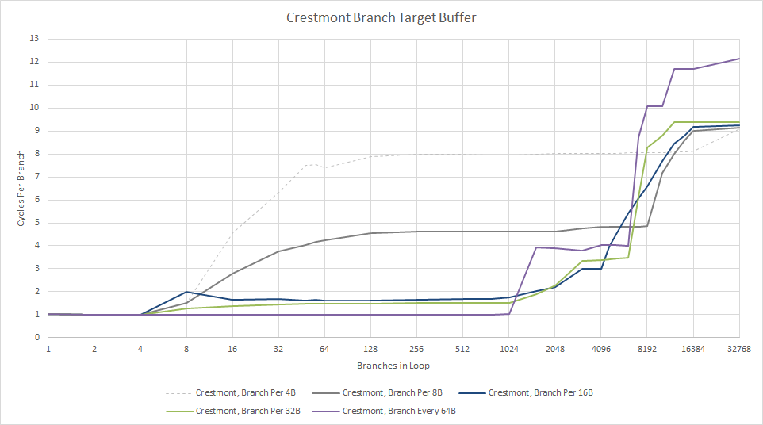

*图 8：扩容提高 Target Coverage，却增加 Latency。Crestmont 在 Branch 间距 64 B 时最好。*

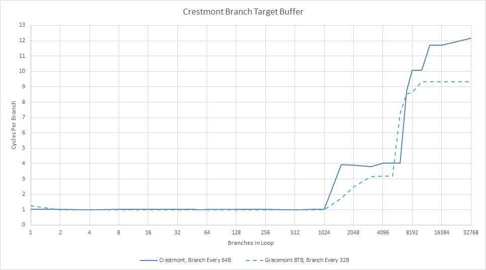

*图 9：Crestmont L2 BTB 约四 Cycle 一个 Target；Gracemont 旧测试约三 Cycle，但未测完全相同 64 B Case，可比性有限。*

Intel Guide 称 Predictor 每周期可 Scan 128 B，Gracemont 为 32 B；这里无直接测量。更远 Lookahead 可能掩盖慢 L2 BTB。Enhanced Path-based Prediction 也让 Pattern 更长。

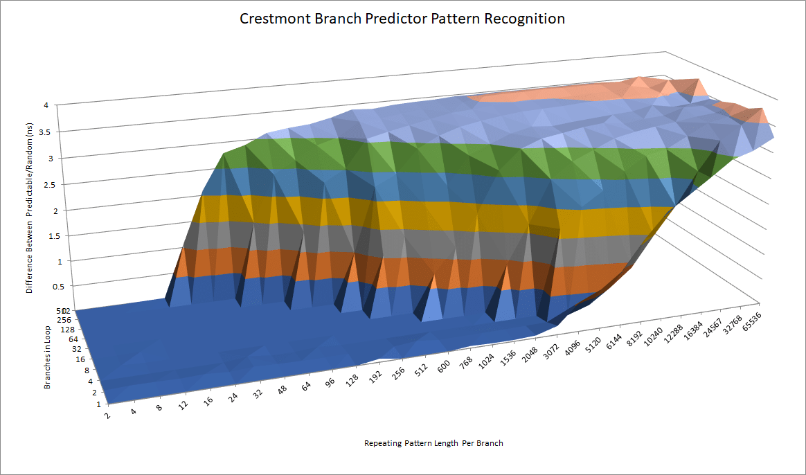

*图 10：少量 Branch 时，2048-long Pattern 几乎无 Mispredict Penalty；Gracemont 在 1536 后开始上升。曲线不确认 History Register 长度或算法。*

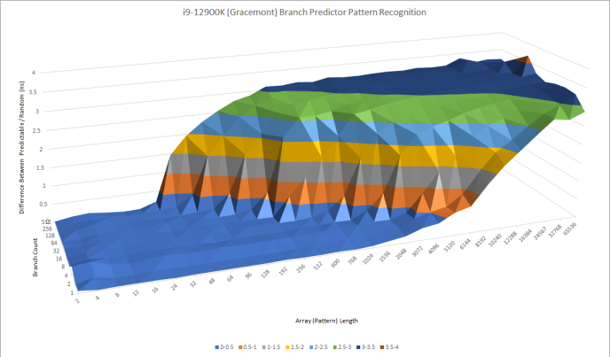

*图 11：两者都能与老 Intel Big Core 竞争，Crestmont 是小幅而非整代跳升。*

### 体系结构视角：更慢的大 BTB 可以用更早的 Lookahead 补偿

Capacity 减少 Miss，Latency 增加命中等待；若 Predictor Scan 走在 Fetch 前足够远，慢结果仍可能及时。验证应把 Target Generation Lead、Queue Occupancy 与 Fetch Bubble 对齐，而不是只看每次 BTB Access Cycle。

## 两组 3-wide Decoder 与六宽 Rename

64-entry iTLB 翻译后，从 64 KB L1I Fetch。两组独立 Pipeline 各 Fetch 16 B、Decode 3 Instruction；Predictor 交替填两组 Fetch Target Queue 并做 Load Balance，行为像传统六宽 Decoder。即使巨大无 Branch Basic Block，也能六 Instruction/cycle。

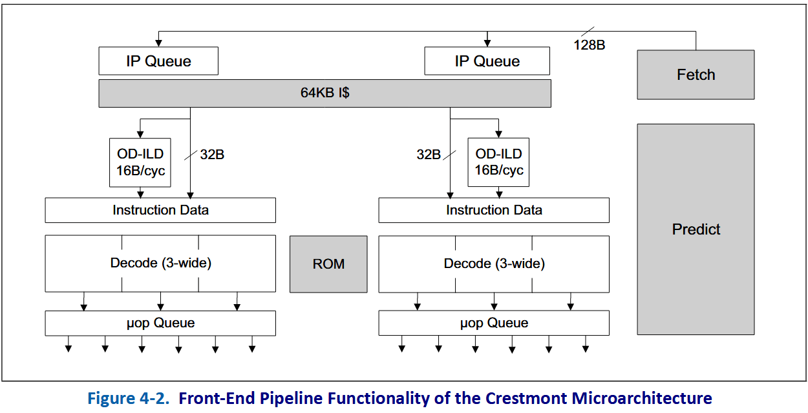

*图 12：正式图注来自 Optimization Guide。Clustered Decode 不等于两个 Thread；Crestmont 无 SMT，两组服务同一 Instruction Stream。*

*图 13：每组独立 Fetch/Decode，再在 Rename 前恢复 Program Order。*

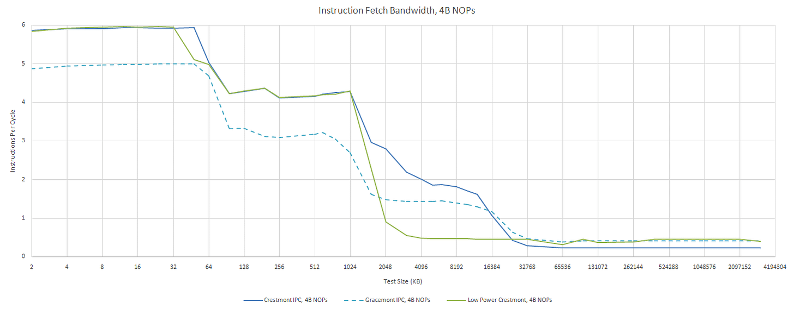

*图 14：L1I 内因六宽 Rename 高于 Gracemont；8-entry I-cache Miss Buffer 掩盖 L2/L3，L2 仍超 4 IPC。LPE 在 L1/L2 接近，L2 Miss 后直接到慢 DRAM。*

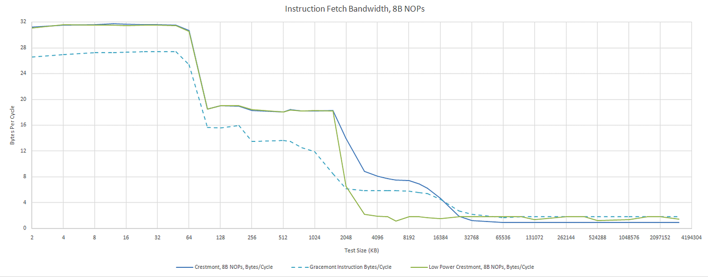

*图 15：长 x86 指令把瓶颈移到 Byte Supply，Crestmont 约 32 B/cycle；LPE Per-cycle 类似。*

Renamer 从 Gracemont 五宽增到六宽，并能同 Cycle 同时读两 Cluster Uop Queue，再按程序顺序 Splice。MOV 可五条/cycle 消除；Scalar `XOR/SUB reg,reg` 只解除依赖，四条/cycle 且仍分配 Physical Register/可能占 ALU；Vector XMM Zero 却可四到五条/cycle，超过三 Vector Pipe，说明 Rename 可直接完成。

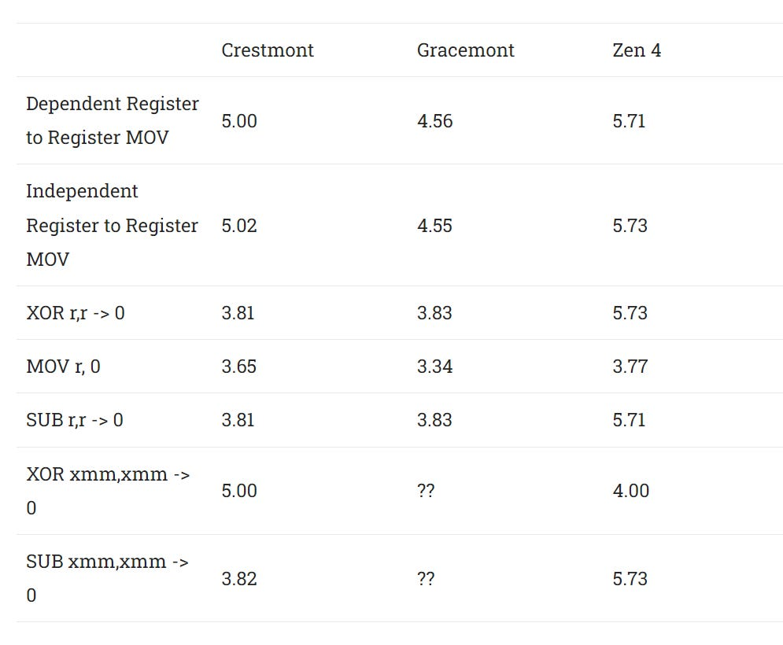

*图 16：Crestmont 还在 Rename 把 256-bit Vector Op Split 为两个 128-bit Half，而非 Decoder 就拆，节省 Decode Bandwidth 与 Uop Queue Entry。*

### 体系结构视角：Clustered Decode 的难点在重新拼回全序

两组前端可独立前进，但 Rename 必须按 Architectural Program Order 更新 Map、分配 ROB 并保证 Exception 精确。跨 Cluster 同拍 Splice 增加选择和排序复杂度，却避免每拍只能消费一组 Queue，兑现六宽。

## OoO/FP：小幅补强，不改大图景

Scheduler Layout 与 Execution Resource 基本不变。FP/Vector Store Scheduler 约 18→22，FP Math 35→38；小差异仍可能受微基准误差。FP Divide 从 Gracemont 的 10-cycle（uops.info）约减半到 5-cycle；另增 Vector Integer Multiplier，但适用 Instruction 未确定，Packed INT32 Mul 不在其中。ROB、Renamed RF、LSQ 看来未变。

## TLB 与 Store Forwarding

L1 DTLB 仍为 48-entry Fully Associative；L2 TLB 从 2048/4-way 增至 3072/6-way，额外 Hit Latency 保持 9 cycle。

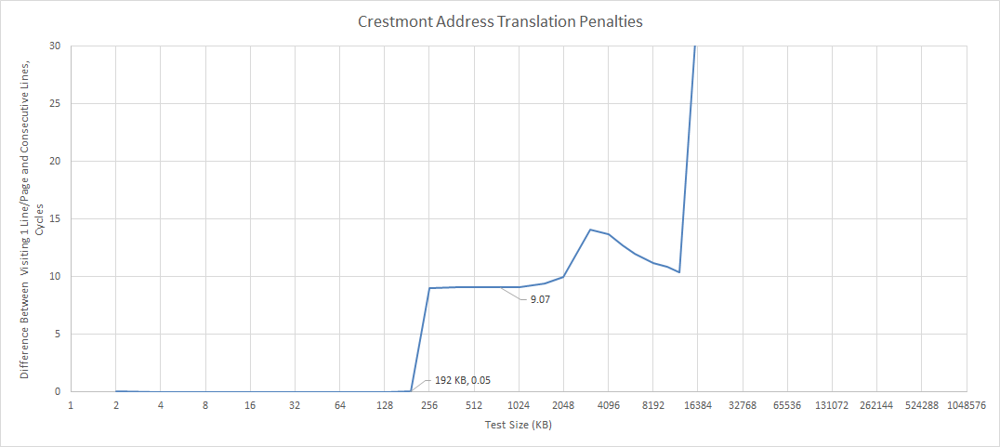

*图 17：更大 Reach 减少大 Footprint Page Walk，但九拍对低频核心仍很重。*

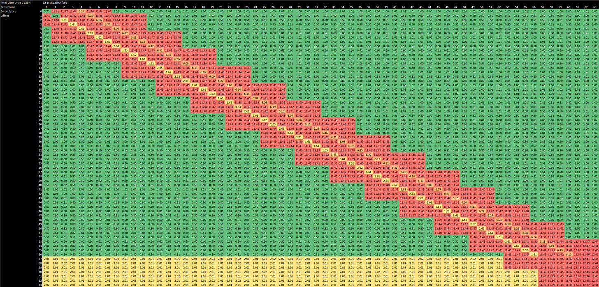

*图 18：只能把 Store 上/下半 Forward 给 Load；Exact Address 有 1～3-cycle Fast Path，上半约 6 cycle，其他 Overlap 11～12，双方都跨 64 B 时 12～13。*

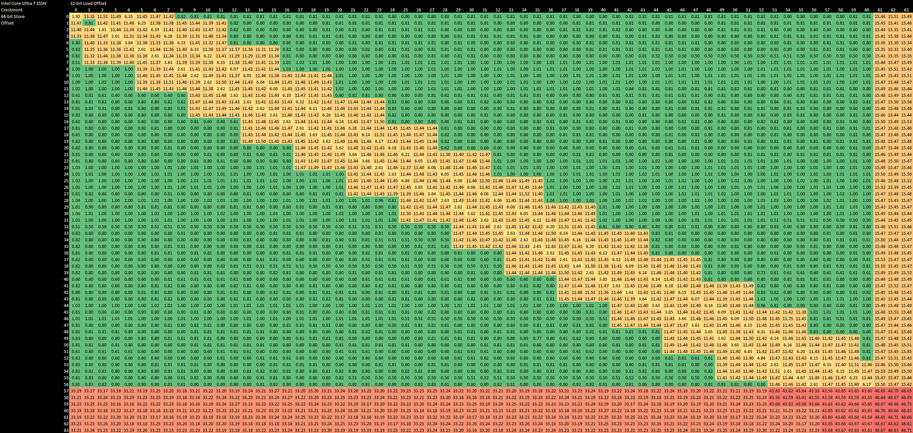

*图 19：行为总体继承。跨 4 KB Page，Load 额外 15 cycle、Store 33；高性能 Intel/AMD Core 的跨页 Load 惩罚很小或无，Store 仍难。*

### 体系结构视角：低成本 LSU 优先优化高频 Case

Exact Match 最常见，做 1～3-cycle Bypass；Partial Overlap、Cross-line/Page 走 Replay/拼接慢路，减少 Compare/Port 成本。对 E-Core 合理，但 Memory Copy、Packed Field 或 Unaligned Data Structure 会放大慢路。Offset×Size Matrix 和 Page Boundary Microbenchmark 能直接暴露分界。

## Cache/Memory：LPE 的 2 MB L2 是最后一道防线

Crestmont/Gracemont Cache 接近，L2 Replacement 可能从 LRU 改为 Non-LRU。Main E-Core 靠 2 MB Shared L2 隔离高延迟 Ring L3；LPE 无 L3，2 MB L2 就是 LLC。

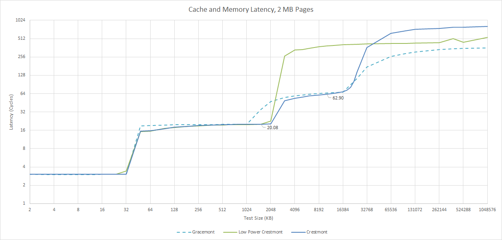

*图 20：Main E-Core 与 Gracemont 接近；2 MB 对 LLC 太小，LPE 对 DRAM Miss 极敏感。*

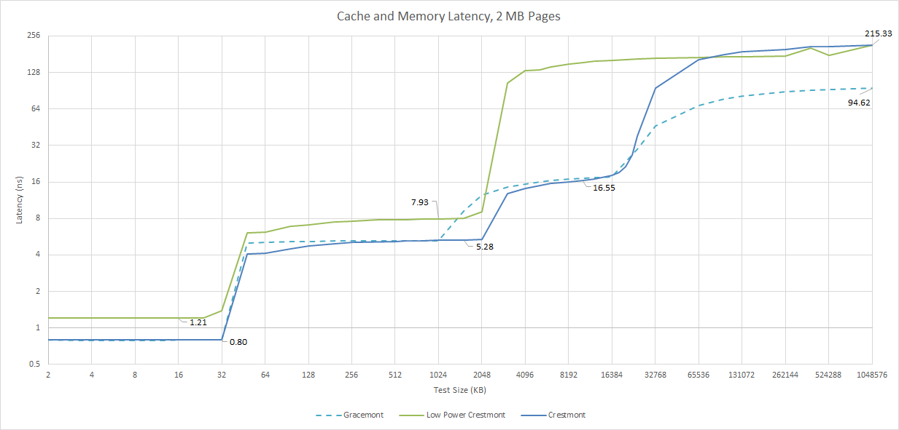

*图 21：低 Clock 让 LPE L2 只略快于 Zen 2 L3；Meteor Lake DRAM 较高，LPDDR5 有影响，但 Van Gogh/Phoenix 在 2 MB Page 下可低于 200 ns。*

Crestmont 原生 128-bit Load/Store，AVX 256 不比 SSE 提高带宽；四 Memory Pipeline 为两 Read、两 Write，均匀混合可达 64 B/cycle L1D。

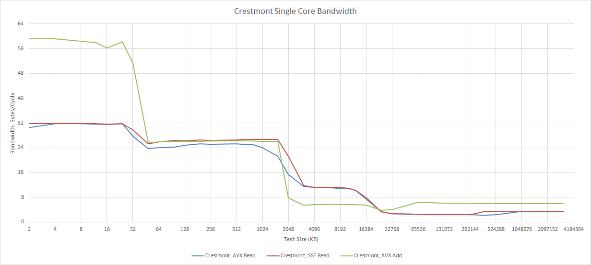

*图 22：单 Core L2 略低于 32 B/cycle；Main E-Core L3 仅 10～12 B/cycle。*

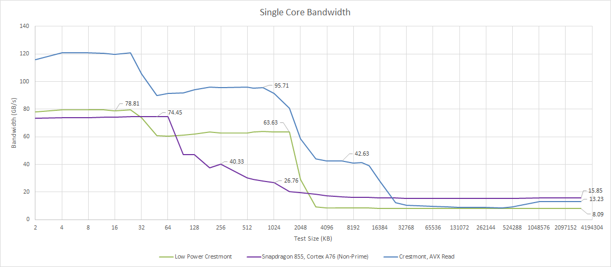

*图 23：Snapdragon 855/OnePlus 7 Pro 由 Zarif98 提供。LPE Bandwidth 更像数年前 Phone Core；A76 L1 接近，Crestmont Shared L2 Per-core 较好，而 Snapdragon 2 MB CPU L3 很差。跨 ISA/平台仅作量级。*

Cluster L2 可供 64 B/cycle，64-entry L2 Miss Queue 连接 Ring。

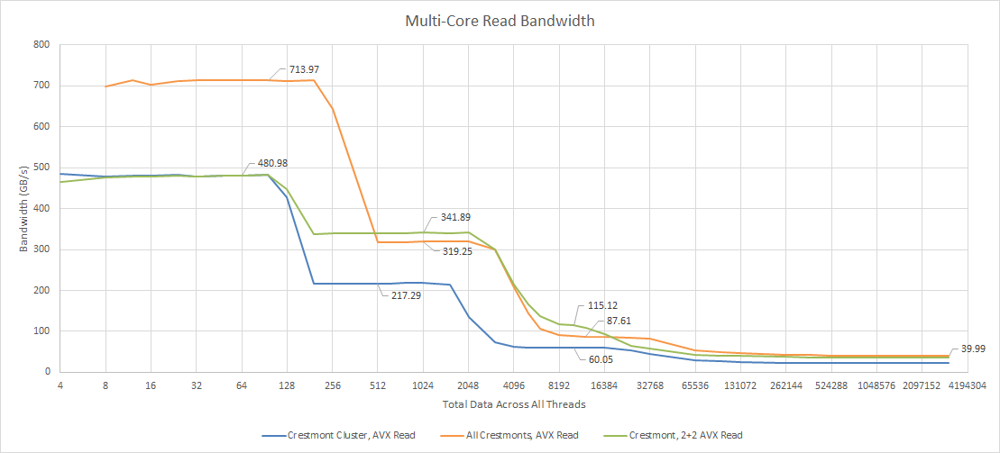

*图 24：每个 Cluster 让两个 Core 同时加载、保持 3.8 GHz 时，双 Cluster L2 Aggregate 为 341 GB/s；超过四核后降频反而降低带宽。L3 Read 为 115 GB/s，与 Alder Lake Gracemont 相同。*

两 Cluster 从 DRAM Read 略低于 40 GB/s，低于 12900K Gracemont 60 GB/s；高 Latency 限制 Outstanding Request 兑现。Write 可较早交给 Cache Hierarchy，混合流较能绕开回程等待。

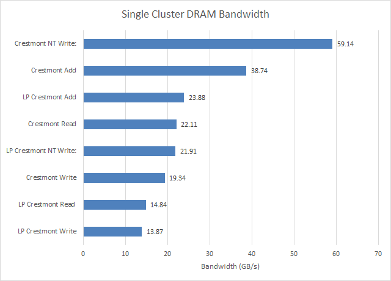

*图 25：一个四核 Cluster Non-temporal Write 接近 60 GB/s，可能再次碰到 Ring Stop；LPE 更差，可能 Link 更慢或 Queue 更少，原因未确认。*

### 体系结构视角：频率政策会让“加载更多核”降低 Cache 吞吐

共享 Cache 的 B/cycle 可能固定，Absolute GB/s 随 Cluster Clock。第五颗 Core 触发 3.8→3.1 GHz 后，即使请求者更多，Aggregate L2 反而可能降。带宽测试必须报告 Active Core Count 与实时 Frequency。

## Core-to-core：LPE 跨 Fabric 付出更高一致性代价

*图 26：Main E-Core 与 Alder Lake 类似，一致性在 Ring 处理；同 E-Core Cluster 反而比跨 Cluster 慢，可能需要 Ring Full Round Trip。LPE 不是 Ring Client，跨 Scalable Fabric 延迟高，量级像 AWS Graviton 1 跨 Cluster。*

## 最后的评价：保守有充分理由

Tremont 把 Atom 做大，Gracemont 修缺陷并加 AVX2；Crestmont 的六宽 Rename、更大 L2 TLB、更强 Predictor 值得肯定，却没有改 ROB/RF/LSQ 等主要资源，是渐进一代。

Meteor Lake 同时转 Chiplet、部分 TSMC Node、抛弃 Sandy Bridge System Architecture、加入 NPU 与新 iGPU，还让 Crestmont 在两种 Physical Implementation/Interface 承担 E/LPE Role。

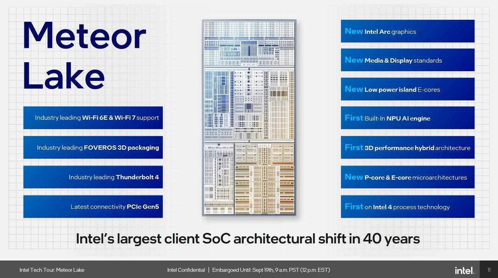

*图 27：正式图注强调“很多新东西”。减少 CPU Core 变更，是对工程时间、验证和整体风险的控制。*

AMD Phoenix 复用 Monolithic System，并让 Zen 4/Zen 4c 共用 Architecture，因此能把更多工程投入 Core。Zen 4 增大 Window、加 AVX-512、增强 Predictor。Crestmont 则仍受 Gracemont 遗留：无 AVX-512 迫使 P-Core Client 也关闭，L3 一般，48-entry DTLB 小，L2 TLB 九拍高。

### 体系结构视角：从 Crestmont 可以归纳出的六点认识

第一，系统转型会挤占核心创新预算。Meteor Lake 同时改 Node、Package、Fabric、GPU/NPU，保守 Core 降低集成风险。

第二，同一 Microarchitecture 也会因系统位置表现悬殊。Ring+L3 的 E-Core 与 SoC Tile LPE 在 L2 外完全不同。

第三，Clustered Decoder 可服务单线程。关键是 Predictor Load Balance 与 Rename 跨 Queue 顺序拼接，不应和 Zen 5 SMT Cluster 混淆。

第四，容量扩张可能以延迟换取。L2 BTB 5120→6144 但吞吐变慢；128 B/cycle Lookahead 可能负责隐藏它。

第五，低功耗核心的慢路更值得关注。跨页、Partial Forward、L2 Miss 和跨 Fabric 一旦出现，低 Clock 会放大 ns。

第六，E-Core 的系统价值不能只看 IPC。LPE 能让 CPU Tile 断电处理 Background Task，节省平台功耗，即使单次 DRAM 性能差。

## 参考资料

- Chips and Cheese：[*Meteor Lake’s E-Cores: Crestmont Makes Incremental Progress*](https://chipsandcheese.com/p/meteor-lakes-e-cores-crestmont-makes-incremental-progress)
- Intel：Intel 64 and IA-32 Architectures Optimization Reference Manual；Meteor Lake Tech Tour

网页末尾提供 Patreon、PayPal 与 Discord 支持入口。
