# Gigabyte 泄露材料里的 Zen 4：从 Cache、AVX-512 到 Genoa I/O

> 英文标题：Details on the Gigabyte Leak 
> 撰文：Chester Lam 
> 首发：Chips and Cheese，2021 年 8 月 22 日 
> 原始链接：https://chipsandcheese.com/p/details-on-the-gigabyte-leak

2021 年，勒索软件团伙泄露 Gigabyte 数据以索取赎金。本文不讨论攻击过程，只整理当时材料暴露的 Zen 4/Genoa/AM5 技术信息。来源不是 AMD 正常发布会，文件语境与版本也可能不完整；所有推断都应保持 2021 年“产品尚未发布”的证据强度。

Performance-counter unit mask 描述显示，Zen 4 延续 Zen 3 的四组 integer scheduling queue，BTB 仍分两级。Genoa 支持 AVX-512F、VL、BW、CD、IFMA、DQ、VPOPCNTDQ、BITALG、VNNI、VBMI、VBMI2、BF16；就 AVX-512 专属扩展覆盖看，大致接近 Ice Lake Server。

## Cache 与 TLB

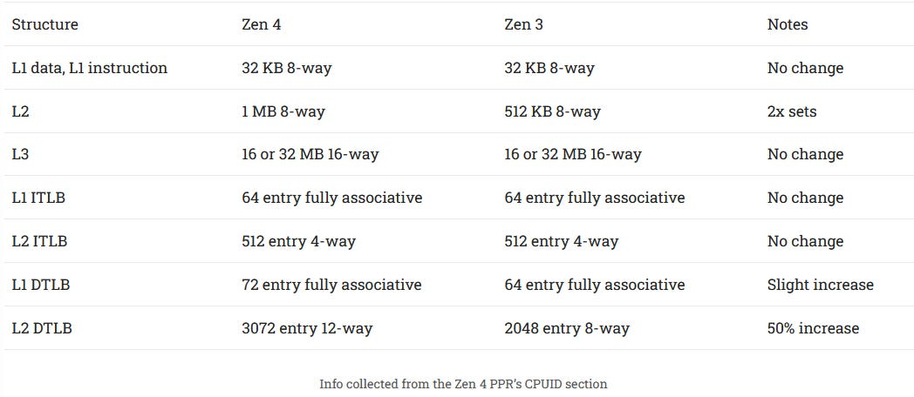

Zen 4 L2 翻倍到 1 MB，仍 8-way，只增加 set 数；Willow Cove 1.25 MB L2 为 20-way。较低相联度可能增加 conflict miss、略降 hitrate，却只需比较更少 tag，lookup 可更快或更省电。因此当时预期 Zen 4 L2 比 Willow Cove latency 低、hitrate 略差；它是结构推论，不是性能实测。

L2 DTLB 有 3072 项，对 4 KB page 的基础 reach 为 `3072×4 KB=12 MB`，Zen 2/3 的 2048 项为 8 MB。Unit mask 显示 page coalescing 仍存在，但没说 Zen 4 是否改变；若像 Zen 2/3 一项合并连续 4 个 4 KB page，理论 reach 可达 48 MB。这个 48 MB 带明确假设，不能写成无条件容量。

PPR 还称 L2 tag/state array 每 42 tag bit 配 7 ECC bit，可用于估算 SRAM 密度。

### 体系结构视角：扩容量与扩相联度解决的不是同一种 Miss

Set 数翻倍主要减少 capacity pressure；ways 增加主要缓解多个地址映射同 set 的 conflict。更多 way 意味着更多 tag 比较、mux 与布线。实际最优点取决于访问分布、频率和功耗；可通过地址 stride/set-conflict 微基准把容量与冲突分开，不能只看 1 MB 数字。

## AVX-512 吞吐的当时推测

L1D 容量/相联度不变，natural alignment 从前代 32 B 变 64 B。这不保证 64 B/cycle port——Zen 1 natural alignment 32 B，load/store port 仍只有 16 B/cycle。但跨 32 B、不跨 64 B 的访问不再必然拆成额外 cache access，至少应改善部分 misaligned throughput。

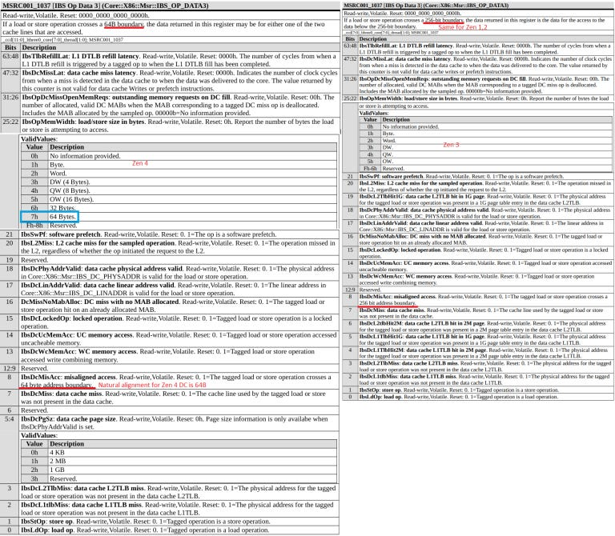

IBS field 表明单个 micro-op 可访问 64 B，打破 AMD 初代引入更宽 FPU 时常拆成两个窄 uop 的传统，至少 memory operation 如此。很多 AVX-512 math instruction 可带 memory operand，因此当时推测纯计算也可能不拆成两个 256-bit uop，但这不是文件直接确认。

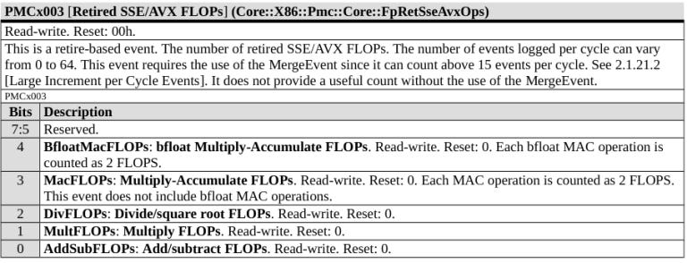

该 event 每周期最多加 64 FLOP，所以当时估计上限不超过 `2×512-bit FP32 FMA=64 FP32 FLOP/cycle`。同一编码也暗示 BF16 可能只有 `1×512-bit=64 BF16 FLOP/cycle`。

文章进一步猜测一条 512-bit FMA unit 可作为 `1×512` 或 `2×256`，类似 Sunny Cove；其余 pipe 可能延续 `2 FMA + 2 FADD`，至少一条 FMA 扩宽。宽 vector 极耗面积和功率，即便 execution throughput 没翻倍，单 512-bit uop 仍能节省 ROB/scheduler/rename 资源，并更高效使用 memory subsystem。以上全部是 2021 年的推演，不能当 Zen 4 最终执行端口确认。

### 体系结构视角：ISA 宽度、Uop 宽度和物理执行宽度是三层概念

一条 ZMM 指令可解成一个 uop，却在 256-bit datapath 上分两拍执行；也可拆成两个 uop；还可由真正 512-bit pipe 一拍完成。IBS 的 64 B access 只直接说明 memory-uop 记录能力，不唯一决定 FMA unit 宽度。验证需分别测 dependent latency、independent throughput、mixed-width contention 与 PMU uop 数。

## Genoa 为分层、超大内存准备 PMU

L1 refill event 新增 Storage Class Memory（SCM）来源；IBS 还能标记来自 DRAM address map 中“long latency”bit 的 load。SCM 例如 Optane DIMM，比 SSD 快、比 DRAM 慢，可能对应 long-latency DRAM 类别。

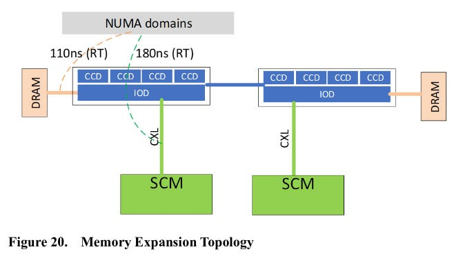

另有 Extension Memory（例子包括通往外部 memory 的 Gen-Z）和 Peer Agent Memory；peer 可能是 accelerator，但含义不明。

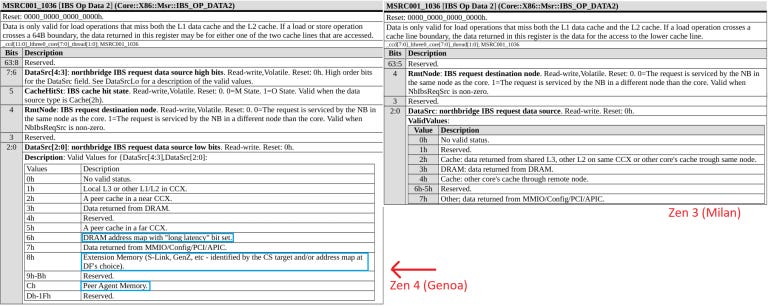

这些 PMU 类型说明 Zen 4 预备观测跨 DRAM、SCM、扩展/peer 的透明地址空间。它不等于产品已经支持超算巨型共享 memory pool；AMD 明确称 memory pooling 不在 Zen 4 scope。

## 更高带宽：双 SDP、双 I/O Hub 与新微控制器

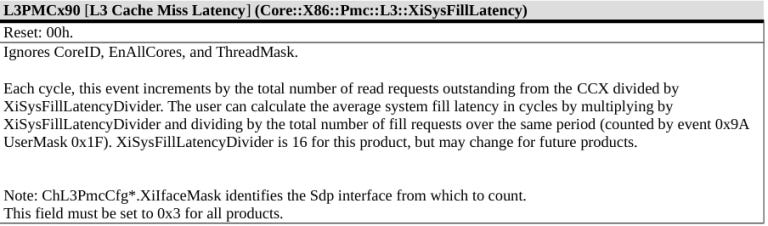

Little’s Law 为 `queue_occupancy = arrival_rate × latency`，event 可辅助估 L3 miss service time 或 interface queue 压力。

SDP mask `0x3` 的两个 bit 暗示每 CCX/CCD 可能有两条 Scalable Data Port 到 Infinity Fabric。单链仍像 Zen 2/3：load 32 B wide、store 16 B wide。

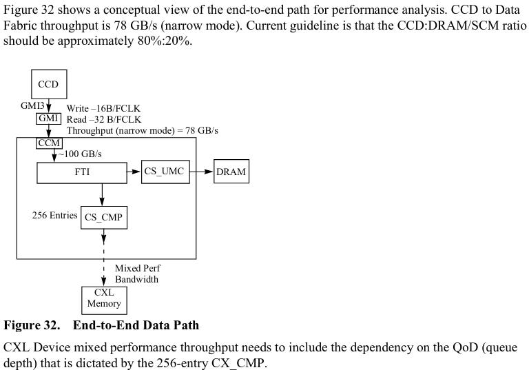

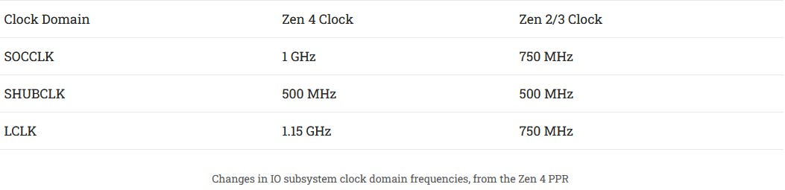

Genoa 最多 12 通道 DDR5-5200，为让单 CCD 使用更多总带宽，AMD 可能增加 IF link；narrow mode 可能在低需求时关掉一条省电。二者都是字段驱动的解释。

I/O hub 的 LCLK 比 Rome/Milan 高 53%，并从一组变两组，目标显然是提高 I/O bandwidth。

新 I/O Microprocessor（MPIO）负责 xGMI、WAFL、PCIe 等 training、UBM 平台拓扑发现，以及 PCIe hot-plug、NVMe、SATA/DFC 与系统软件动态通信。它可能把部分传统 motherboard BIOS 职责转入 AMD firmware。MP5 management controller 仍是 per-CCD。

DMA microprocessor（MPDMA 及变体）像 Rome/Milan PTDMA 后继，可加速 page migration，例如把热 page 从 SCM 搬到 DRAM。

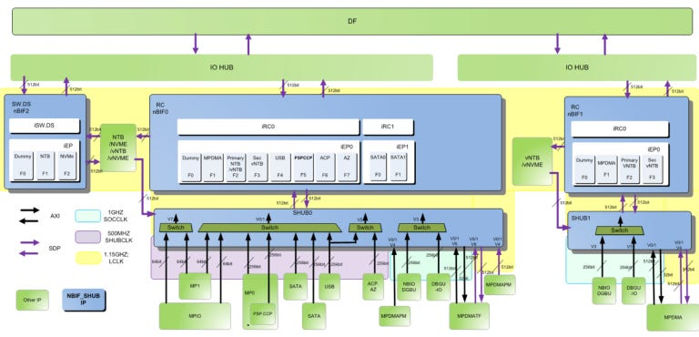

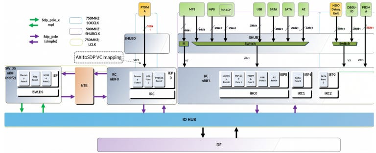

空闲部分支持 clock/power gating；SOCCLK 下 system hub 也可 deep sleep。

### 体系结构视角：大内存系统需要“数据搬迁引擎 + 可观测性”

当 memory latency 跨 DRAM/SCM/CXL 多个数量级，OS/runtime 需要知道 load 来自哪层、队列多拥堵，并把热 page 迁到快层。PMU 提供证据，MPDMA 减少 CPU copy 开销；否则透明寻址只会把慢层 latency 悄悄暴露给核心。本文能确认的是字段/职责描述，不是具体 migration policy。

## AM5 客户端 I/O

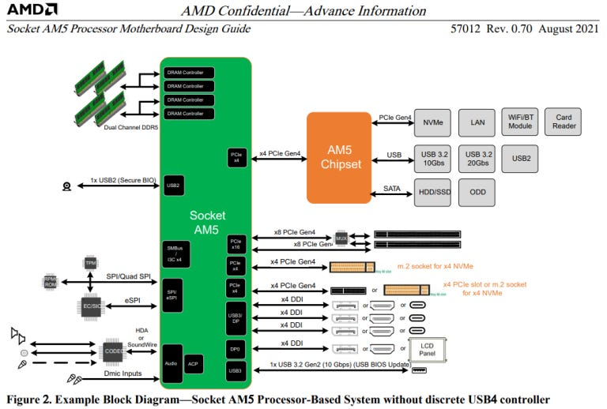

AM5 增加 4 条 PCIe Gen4，可用于更多 M.2 或 USB4；并非所有 CPU type 都有。材料当时没有提 AM5 CPU 的 PCIe 5，文章因此判断 AMD 选择“更多 lane 而非更快 lane”；这是发布前文件范围内的观察，不应倒推最终产品。

10 Gbps USB port 内建 BIOS update：上电时 GPIO `AGPIO23` asserted 即触发，AMD 建议主板做按钮。相对 AM4 跨代时常需借旧 CPU/官方短期 CPU loan 刷 BIOS，这提高可维护性。

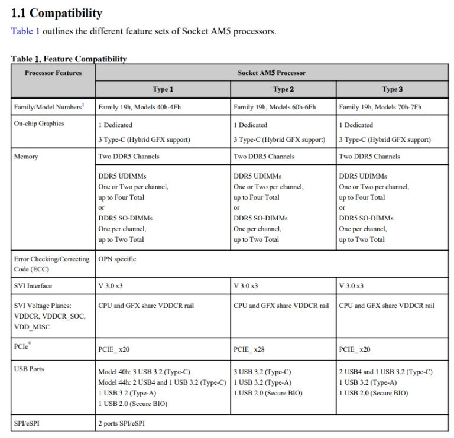

三种 AM5 processor type 都提 on-chip graphics，脚注称部分 OPN 可能不支持 GFX；文档其他处又都称 APU，因此无 iGPU SKU 可能只是 defective/disabled，但这是推断。集显可方便无独显用户和故障排查。

CPU 提供 4 路 DisplayPort，其中 3 路可走 USB-C DP Alt Mode。版本未找到；AMD 给 DP→HDMI 2.1 schematic，推测带宽足够 4K60。

## 结语

在 2021 年这个时间点，Zen 4 看起来更像“保留 Zen 3 基础、扩大 cache/TLB、加入 AVX-512”，而不是彻底重构。迁移 TSMC 5 nm 已有工艺风险，避免同时大改核心是稳妥策略；L2、DTLB 和 AVX-512 本身即可带来 IPC/特定应用增益。

更激进变化位于平台：AM5 转 DDR5、增加 lane 与 BIOS 便利性；Genoa 增到 12 通道 DDR5、更多核心、面向 PCIe 5 与层级化大内存，I/O 变化类似 Zen 1→Zen 2 的幅度。

由于材料来自泄露、版本不明，而且文章写于产品发布前，四 scheduler、两级 BTB 等字段可视为文档事实；FMA 宽度、双 SDP、narrow mode、peer memory 和无 iGPU SKU 原因则必须保留推测边界。
