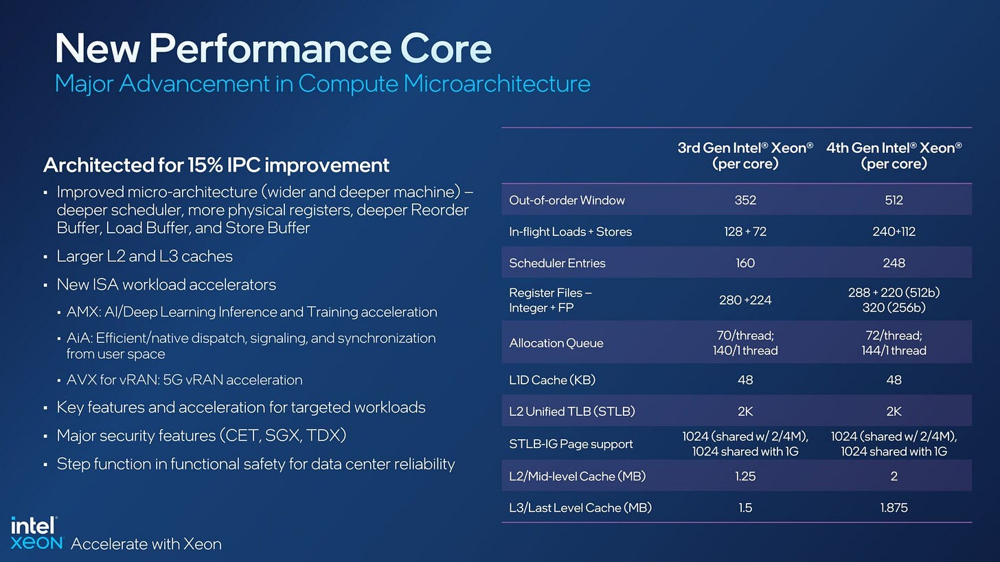
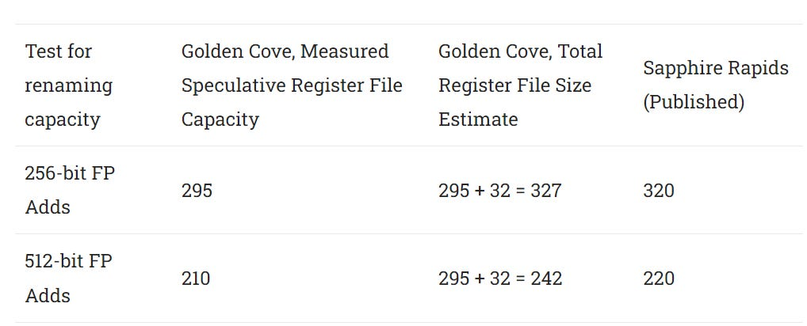
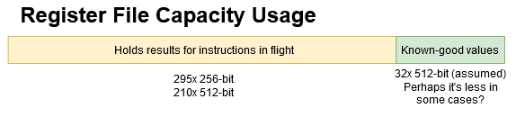
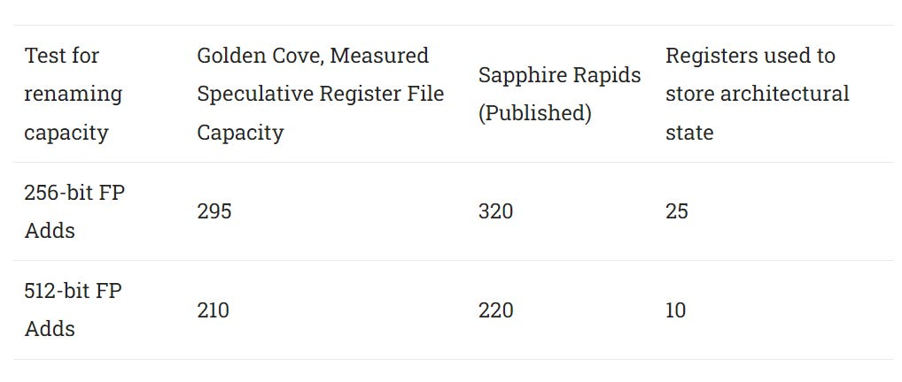
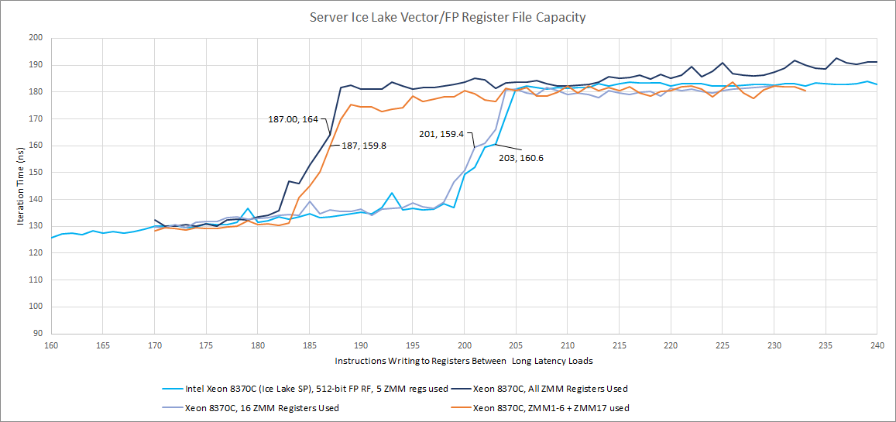
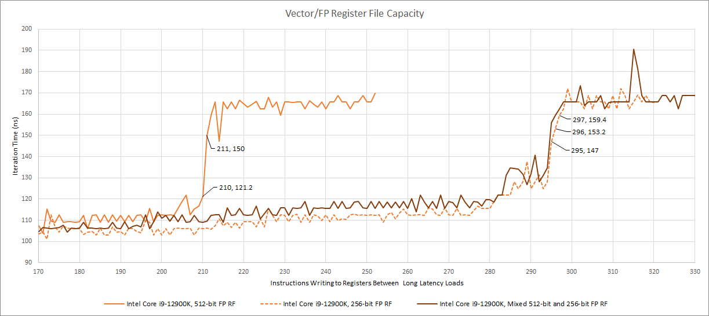
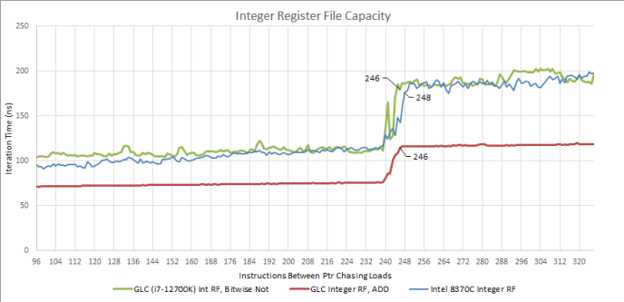

# 用 Sapphire Rapids 官方数据复核 Golden Cove：向量寄存器文件到底有多大

> 英文标题：Golden Cove’s Vector Register File: Checking with Official (SPR) Data 
> 撰文：Chester Lam 
> 首发：Chips and Cheese，2023 年 1 月 15 日 
> 原始链接：https://chipsandcheese.com/p/golden-coves-vector-register-file-checking-with-official-spr-data

此前微基准显示，Golden Cove 为 AVX-512 使用了不对称向量寄存器文件：约 210 个 512-bit rename、295 个 256-bit rename。Intel 随后公布 Sapphire Rapids（SPR）数据，可以检验这些估计。比较的前提是客户端 Golden Cove 与服务器 SPR 核心足够相近；这本身是一项合理但未由 RTL 验证的假设。

测试值与官方数据处在同一量级，足以确认关键结论：只有一部分物理向量寄存器具备完整 512-bit 宽度。但绝对数量略被高估。

## 为什么“加 32 个体系结构寄存器”会算错

此前从 speculative rename 容量出发，假设 AVX-512 的 32 个架构向量寄存器必须各占一个物理 entry 保存已退休、可精确恢复的状态，于是推算总计 327 项、其中 242 项全宽。

官方数字说明 Golden Cove 不必固定消耗完整 32 项保存状态，因此微基准看到了比预期更多的真实物理容量。

可能的一种机制是零值跟踪：程序启动时寄存器为零，测试只写 XMM/YMM/ZMM 1—5，其他已退休寄存器可由 retired RAT 的零标志表示，不必分配 data entry。Intel 已知能对 `xor reg,reg` 或同寄存器相减做 zero idiom 消除，但这只是一种猜想。

Ice Lake-SP 的结果支持更粗粒度机制：只要使用 AVX-512 新增的 ZMM16—31 中任意一个，核心就额外预留 16 项已知正确状态；用一个还是全部都一样。Golden Cove 可能沿用相似方式，但没有直接证据确认。

### 体系结构视角：精确异常不要求“每个架构寄存器永远占一格”

乱序核心必须在异常或误预测恢复时给出正确架构状态，但状态可以由 retired mapping、常量标记、共享零寄存器或其他编码表示。物理寄存器文件 entry 数、可投机分配数和软件可见寄存器数因此不是简单加法。

优化正常运行时释放更多 rename entry；当程序首次使用上半组 ZMM 时，核心可能切换模式并保留更多已退休状态。模式转换若存在，会影响短暂可用容量，但本文没有直接测其恢复时序。

## 微基准如何测，以及为什么会有几项误差

方法来自 Henry Wong：两次会 miss cache 的 pointer-chasing load 之间插入大量消耗某种乱序资源的填充指令。如果资源够，两次 load 可以并行；若 rename 阶段先因资源耗尽而停，第二次 load 进不了后端，两次 miss 只能串行，完成时间出现台阶。

核心未必能完美回收寄存器，曲线可能缓慢上升而不是垂直跳变。测试选择“仍至少有时能让两次 load 并行”的最后一点，天然可能误差数个 entry。这也是为什么大规模结构差异可靠，小差异不应假装精确。

## AMD Zen 4 对照

使用 5 个 ZMM 的旧测试显示，Zen 4 speculative 部分可用 154 项；AMD 公布总计 192 项，差 38 项用于 non-speculative state。它没有采用 Ice Lake 那种只在用到上半 ZMM 后才额外保留的策略。

现代 AMD 至少不像 Bulldozer 那样永久为两个 SMT 线程都预留向量状态。第二线程未激活时不会白占那部分容量；这一点与 Intel 相近。

## 其他结构：整数寄存器与 Load Queue

Intel 官方称 SPR/Golden Cove 整数物理寄存器从 Sunny Cove 的 280 增至 288，只多 8 项、约 2.8%。

无论使用是否设置 flags 的指令，测试都未看到更多 speculative 容量。这意味着新增 8 项被某种体系结构状态占用，没有让后端看得更远。Sunny Cove 用 32 项保存两个 SMT 线程的 16 个整数架构寄存器；若按差值推算，Golden Cove 每线程似乎又用 4 项做别的事情。整数状态即使 sibling 未激活也为两线程保留，与向量寄存器行为不同。

即使 8 项全部可投机使用，相对 512-entry ROB 也很小。大量代码超过半数指令会写整数寄存器，248+8 也只有 256，Golden Cove 仍可能先耗尽整数寄存器而非 ROB。

Load Queue 更有定义差异：Intel 称 SPR 有 240 项，微基准只测到 192 个 in-flight load 后前端被后端挡住。此前 Intel 官方 load buffer 数与测试相符，说明新架构可能增加了内部 tracking entry，却在 240 项之前因另一限制停止接收 load。

AMD 恰好相反：官方 Zen 1 Load Queue 为 72 项，微基准却可跟踪 116 个在途 load，后代类似，Zen 4 增至 136。一种解释是 load 可在退休前提前从某内部 72-entry 结构释放。无论如何，厂商说的“队列项数”和软件测得的“前端因 load 资源反压前可容纳多少条”可能不是同一指标。

### 体系结构视角：结构名相同，不代表容量定义相同

一个 load 可能依次占用地址生成队列、次序检查结构、数据返回表、退休跟踪和 miss buffer；某些条目可在执行后提前释放，另一些必须等到退休。官方可能公布物理阵列深度，微基准测到的是多种资源中最先形成反压的一项。验证时应把 allocation、execution、completion、retirement 四个生命周期分开。

## 结语

Sunny Cove 把 ROB 增至 352，Golden Cove 再到 512；寄存器文件、Load Queue 等结构必须同步增长，否则更大的 ROB 只会被更早的瓶颈架空。Intel 不仅增加 entry，也通过按需保存 AVX-512 上半组状态，尽量把昂贵容量留给投机执行。

关键发现得到官方数据支持：Golden Cove/SPR 的向量寄存器文件确实只有一部分是 512-bit。绝对容量估计则不是精确科学：已退休状态压缩、free-list 回收、微码 scratch 和曲线判读都可能让结果偏几项。软件反推硬件最适合确认“是否存在大结构差异”，不适合把每一个 entry 都写成板上钉钉。
