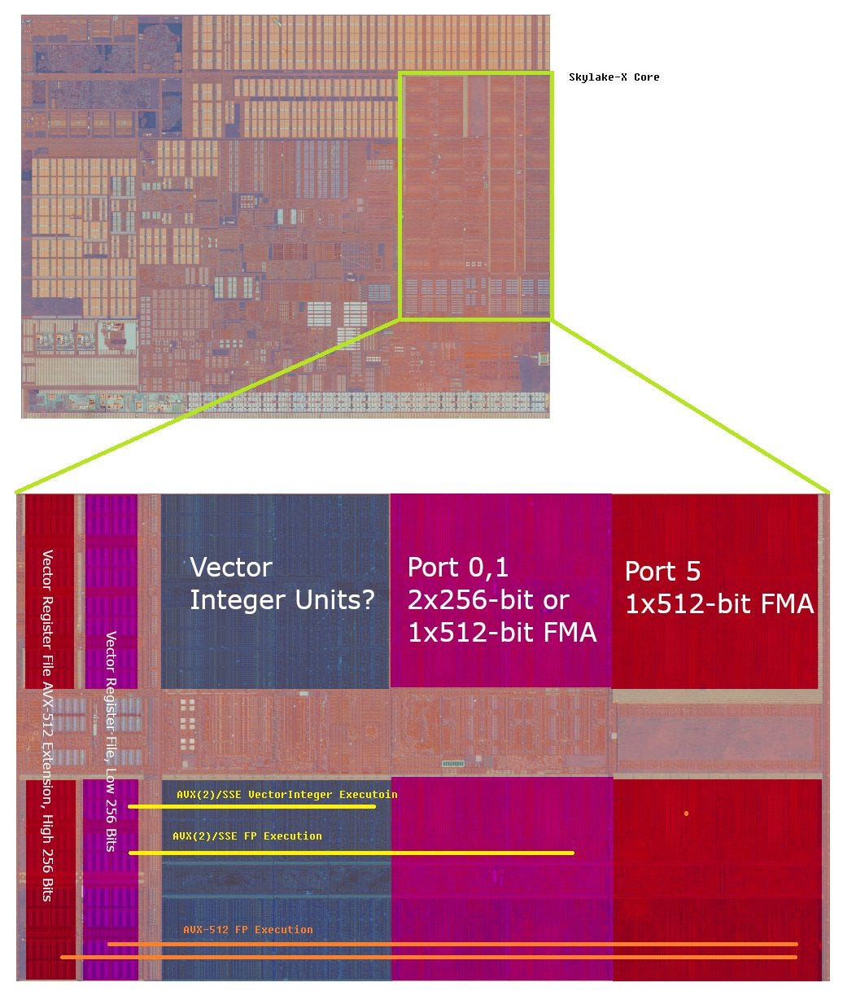
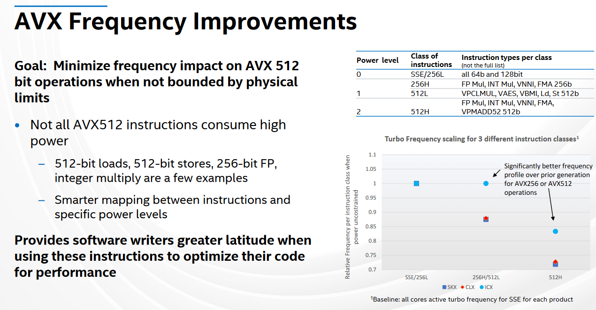
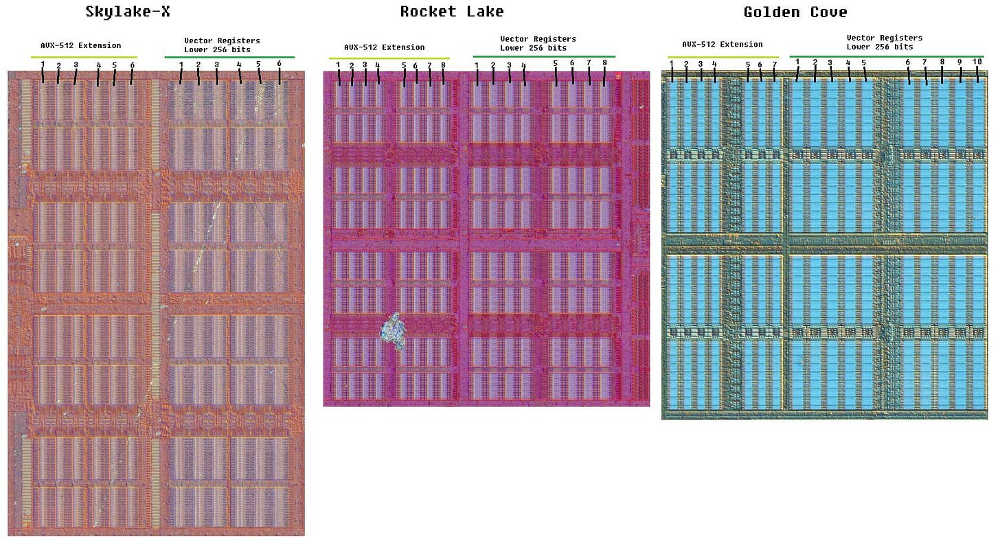
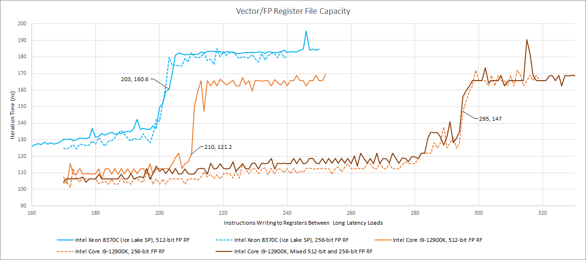
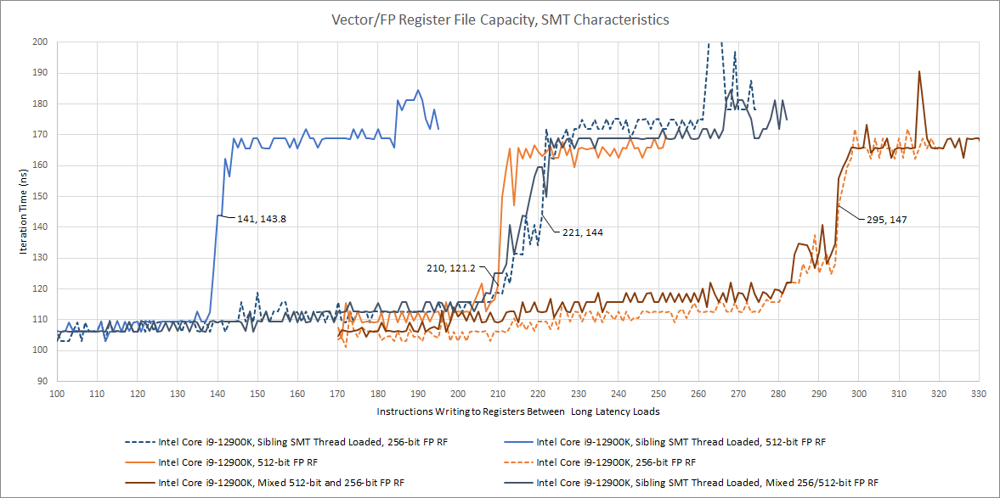
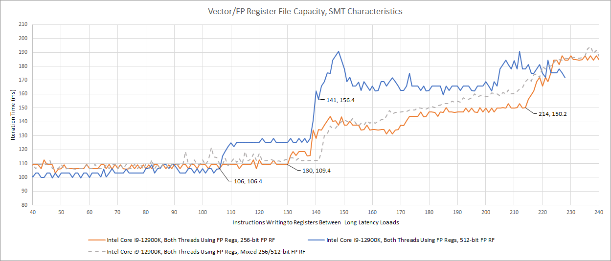
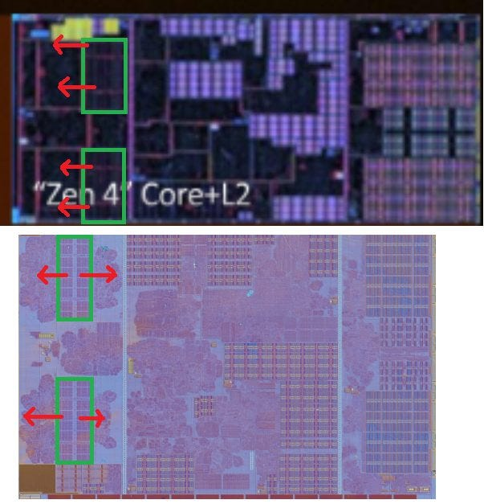
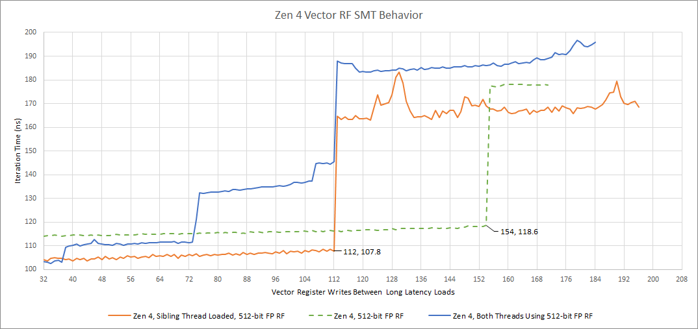

# Golden Cove 不对称的向量寄存器文件：AVX-512 宽度、重命名容量与 SMT 的取舍

> 英文标题：Golden Cove’s Lopsided Vector Register File 
> 撰文：Chester Lam 
> 首发：Chips and Cheese，2022 年 12 月 25 日 
> 原始链接：https://chipsandcheese.com/p/golden-coves-lopsided-vector-register-file

Intel 把 AVX-512 带入大核后，并没有简单地把整个向量数据通路等比例放大。早期实现把每个物理向量寄存器的低 256 bit 留在靠近主要执行单元的位置，再在另一侧增加保存高 256 bit 的扩展阵列。常见 SSE/AVX2 访问走较短路径，罕见的 512-bit 操作承担更长距离和更高能耗。

图 1 展示了这种物理不对称。服务器额外浮点单元也像核心扩展一样放在主执行区另一侧，与输入寄存器距离较远，可能是早期 AVX-512 低频、高功耗的因素之一，但裸片距离本身不能单独证明时序瓶颈。

工艺与架构迭代逐步缓解频率惩罚，但另一项需求同时增长：乱序执行需要更深窗口隐藏缓存延迟，更多在途结果就要更多物理寄存器。512-bit 寄存器的数据量和布线尤其昂贵。

## 不是所有物理向量寄存器都需要 512 bit

旧架构的低半部与 AVX-512 扩展部块数相近；Golden Cove 的扩展部明显更少。微基准可估计这种容量分配，但不能给出精确晶体管结构。

测试测得约 295 个 256-bit rename、210 个 512-bit rename。若假设两个 SMT 线程共需 32 项保存体系结构状态，当时推算总物理向量寄存器约 327 项，其中约 242 项具备完整 512-bit 宽度。两种容量都高于 Ice Lake，但主要增益落在更常见的 SSE/AVX2 代码。

交替写 256-bit 与 512-bit 结果时，测试仍能使用接近完整容量，说明重命名器会优先把窄结果放进不具备高半部的 entry，把全宽 entry 留给 ZMM 结果。它很可能维护两类资源池，并对 256-bit 结果的分配作出选择；具体启发式没有公开，不能仅凭曲线确认。

### 体系结构视角：重命名寄存器为什么会先于 ROB 变满

寄存器重命名把架构寄存器映射到物理寄存器，使多个未退休版本同时存在。每条写寄存器指令都要分配新 entry，直到旧版本可回收；如果物理池耗尽，rename 阶段必须停下，前端随之反压，即使 ROB 还有空位。扩大 ROB 而不扩大寄存器文件，无法等比例增加可见窗口。

分宽度资源池把最昂贵的 512-bit 存储只给真正需要的指令。正常情况下它提高面积利用率；当全宽结果密集时，512-bit 池会先耗尽，吞吐和可重排序深度就由较小池决定。可用 Henry Wong 式“两次 cache-miss pointer chase + 中间填充指令”观察容量拐点，也可配合 rename stall 事件，但没有 RTL 就不能从结果推出 free-list 的精确组织。

## SMT：高水位限制，而不是简单对半切

Golden Cove 在 sibling thread 已唤醒、但只跑标量整数 NOP 类循环时，主线程仍可使用超过一半的向量寄存器。

结果支持高水位（watermark）方案：两线程活动时，单线程最多约使用 221 个 FP rename；512-bit 操作最多约 141 个。

双方都竞争时，每线程至少约保证 130 个 SSE/AVX 或 106 个 AVX-512 rename；上限不变。最低保障和最高水位之间是动态竞争区域，某线程有一定概率拿到足够 entry，使两次长延迟 load 并行。

Ice Lake-SP 也出现类似 watermark，可能在上一代已经引入；Skylake 更像严格对半。动态共享提高 SMT 利用率，同时以最低保障维持公平。

## AMD Zen 4：更小、更简单的另一条路线

Zen 4 对 256-bit 和 512-bit 指令提供相同重命名容量。物理布局把执行单元放到寄存器文件一侧，类似 Intel；此前 Zen 把执行单元分布在两侧，以缩短执行路径，却让 load/store 单元到寄存器更远。

Zen 4 总向量 entry 较少，物理阵列更小，数据不必走那么远；执行单元也小于服务器 Intel 核心。SMT 分配看起来是完全竞争共享，没有对半或 watermark。第二线程活动但不用 FP 时，第一线程的容量差只来自为第二线程保存体系结构状态：32 个 AVX-512 寄存器和 8 个 MMX/x87 寄存器。Zen 2 也类似，但 AVX2 只有 16 个架构向量寄存器。

### 体系结构视角：公平、利用率与确定性无法同时最大化

严格对半最容易保证服务质量，却会浪费空闲线程那一半；完全竞争利用率最高，但需要防止一个线程长期挤占；watermark 在两者之间，用最低保障和最高限制塑造共享区。验证时应分别测试 sibling halt、整数假负载、双方 FP 压力和不同启动次序，因为“线程活动”与“线程真正占用该资源”是两个状态。

## 结语

Golden Cove 用三个办法提高向量寄存器文件效率：只让一部分 entry 具备 512-bit 高半部；让重命名器按结果宽度选择资源池；SMT 下用 watermark，而不是固定对半。这让 Intel 能把更多面积投入常见的 SSE/AVX2 重排序，同时仍保持强 AVX-512 容量。

测试近似值不是官方总 entry 数，后续 Sapphire Rapids 官方数据还会修正“为体系结构状态固定预留 32 项”的假设。更现实的限制是，大多数 Golden Cove 客户端根本无法使用 AVX-512；测试需要一颗未 fuse-off 的芯片和允许开启 AVX-512 的旧 BIOS。文章推测 Sapphire Rapids 可能有相似行为，后续官方资料确实提供了核对机会，但本篇当时尚未确认。
