# 拆开 Golden Cove：Intel 如何造出一颗又宽又深的 P-Core

> **文章来源**
>
> - 文章：*Popping the Hood on Golden Cove*
> - 撰文：Chester Lam
> - 首发：Chips and Cheese
> - 发布：2021 年 12 月 2 日
> - 链接：https://chipsandcheese.com/p/popping-the-hood-on-golden-cove

Alder Lake 是 Intel 五年多以来最令人振奋的桌面发布之一。Skylake 之后，Intel 终于再次拿出真正具备正面竞争力的新桌面微架构。承担峰值单线程性能的 P-Core 正是 Golden Cove。

这篇分析不再重复介绍 Alder Lake 的混合核心与产品规格，而是直接拆开 Golden Cove 的流水线：从方向预测、BTB、取指与译码，经过六宽重命名和巨大的乱序窗口，再到执行端口、Cache、DDR5，以及这些结构之间是否真正匹配。

## 测试平台与结论边界

Golden Cove 的主要测试对象是 Core i9-12900K，Sunny Cove 则来自 Azure 虚拟机中的 Xeon 8370C；部分图还加入 Skylake、Zen 2、Zen 3、EPYC、Ampere Altra、Gracemont 等对照。不同平台的频率、内存、虚拟化环境和核心数并不统一，因而跨平台图适合观察数量级和结构特征，不是严格同频 IPC 或能效排名。

测试主板无法启用 AVX-512，Golden Cove 上执行这类指令会产生异常，所以主体分析不覆盖 AVX-512。相关带宽由 CapFrameX 在关闭 E-Core、支持 AVX-512 的另一块主板上补测；这组数据与主体平台不同，不能直接混成同一次实验。

许多容量来自阻塞退休、依赖链和端口冲突微基准。文章也明确把框图称作“粗略近似”：没有 RTL，调度队列、寄存器端口和 BTB 层级只能按可观察行为复原。下文保留这些边界，并把额外机制分析显式放在“体系结构视角”中。

## 总览：更宽，也更深

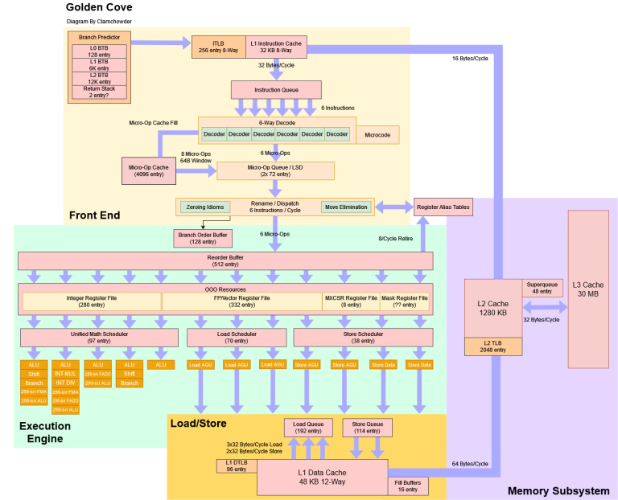

*图 1：Golden Cove 采用六宽重命名、约 512 项 ROB、五条整数 ALU 路径、三条 Load AGU 与两条 Store AGU，L1D 为 48 KB，私有 L2 为 1.25 MB。网页正式图注还指出：若能使用 AVX-512，L1D 理论上可每周期完成两次 512-bit、即两次 64 B Load；该带宽由 CapFrameX 另行验证。*

Sunny Cove 的整体路线与之相似，却明显更窄：四宽重命名、约 352 项 ROB，执行、队列和寄存器资源都更少。Golden Cove 的 ROB 增加约 45%，其他结构也普遍扩容。

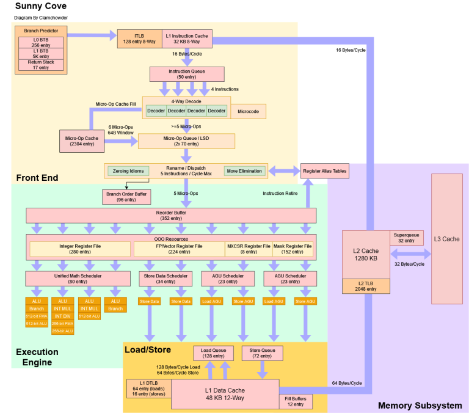

*图 2：Sunny Cove 数据来自 Azure VM 中的 Xeon 8370C。与图 1 并列可见，Golden Cove 的变化不是单纯增加 ALU，而是从前端、重命名、在途窗口到 Load/Store 系统的全链路扩张。*

### 体系结构视角：宽度与深度解决不同问题

“更宽”提高每周期可进入或执行的操作数量，“更深”则让核心越过一次停顿，看见更远处的独立工作。前者改善吞吐峰值，后者提升隐藏延迟的机会。两者必须匹配：六宽入口若只有很小的 ROB，会很快撞到窗口尽头；512 项 ROB 若缺少寄存器、Load Queue 或 miss 跟踪资源，也只能成为名义容量。

精确异常要求所有结果仍按程序顺序退休。后端可以投机执行，却必须在异常或误预测发生时取消更年轻操作、恢复重命名映射，并保证错误路径没有不允许的架构可见副作用。这也是大 ROB、分支跟踪和恢复状态必须共同扩张的原因。

## 分支方向：跨过 6144 之后，Golden Cove 更从容

Intel 在 Architecture Day 中强调 Golden Cove 提高了分支预测准确率。随机重复模式微基准可以逐步增加模式长度与静态分支数量，观察预测器在历史、容量与混叠压力下何时失去规律。

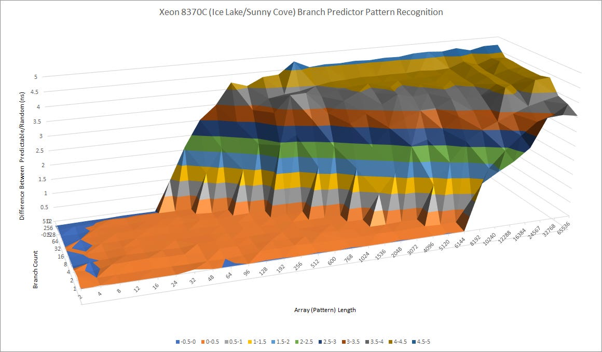

*图 3：曲面在短模式区保持低周期，超过有效历史或表容量后陡升。模式越长、参与分支越多，预测越难；拐点由历史长度、索引散列、表容量和 aliasing 共同决定，不能直接读成某一项 GHR 位宽。*

与 Sunny Cove 相比，差距并不巨大，但重复随机模式超过 6144 后，Golden Cove 的每分支时间没有那么剧烈地跃升，说明算法或表组织确实有所调整。

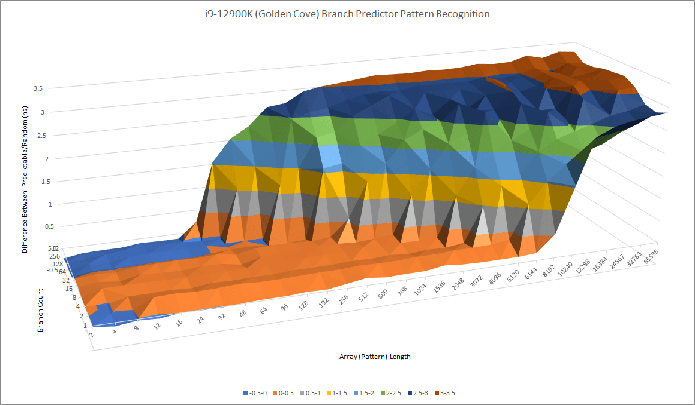

*图 4：网页正式图注说明 Sunny Cove 在上、Golden Cove 在下。两代整体轮廓相似，Golden Cove 在超长模式区的退化更平缓；这是有效能力差异，不足以确定具体采用哪种预测算法。*

Skylake 则明显落后。Golden Cove 能识别更长的模式，也能在大量静态分支同时竞争预测表时维持更好表现。

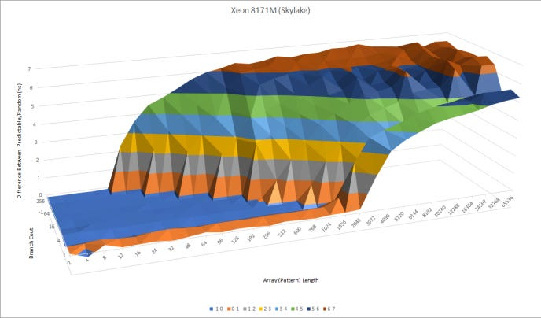

*图 5：Skylake 的低惩罚平台更早坍塌。图与 Golden Cove 使用相同类型的微基准，展示 Intel 多代预测器容量与历史利用能力的积累。*

当循环中放入 512 个分支时，Golden Cove 在模式长度超过约 48 后明显受损。这个数字衡量的是大量分支共享预测结构时的有效能力，而不是单分支极限。

*图 6：静态分支压力放大了表冲突和训练容量问题。单分支可识别很长模式，并不意味着 512 条分支各自都能获得同等历史资源。*

AMD Zen 3 能识别比 Golden Cove 更长的模式，也更能承受大量分支。Zen 2 在单分支场景与 Golden Cove 大致相当——比较时还要剔除其较大的 L2 TAGE override 惩罚；512 分支时，Zen 2 和 Zen 3 分别能把重复模式稳定维持到约 64 和 96，Golden Cove 则在 48 后开始吃力。

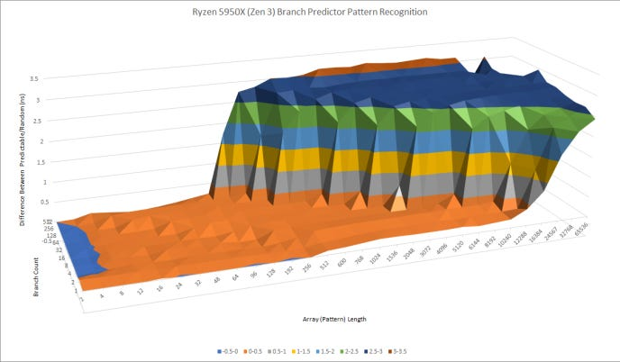

*图 7：Zen 3 的高准确率平台覆盖更长模式，体现 AMD 在方向预测上的优势。曲面仍然只能证明行为差异，不能反推完整表数、标签或更新策略。*

*图 8：网页正式图注说明 Zen 3 在上、Golden Cove 在下。Zen 3 在长历史和多分支区域保持得更好，是文章判断 AMD 方向预测略胜的主要微基准依据。*

*图 9：Zen 2 的长模式区域虽不及 Zen 3，却仍能在 512 分支、长度约 64 时保持较好；其二级预测覆盖会引入额外延迟，所以准确能力与预测时效要分开评价。*

*图 10：网页正式图注说明 Zen 2 在上、Golden Cove 在下。Golden Cove 的单分支能力接近 Zen 2，但大量分支同时出现时，AMD 的结构更抗冲突。*

实际程序没有规则的单一随机循环。7-Zip 压缩中，Golden Cove P-Core 的分支预测准确率为 95.52%，显著高于 Skylake i5-6600K 的 95.42%，但低于 Ryzen 9 5950X 的 96.35%。

*图 11：5950X 16C/16T 为 96.35%，3950X 两组测试均约 96.05%，Ampere Altra 为 95.63%，12900K 的 P-Core 与 E-Core 都为 95.52%，i5-6600K 为 95.42%。图中还有 EPYC、FX-8350、Core 2 Duo 与兆芯 KX-6640MA，对比平台和线程配置不同。*

x264 编码中，Golden Cove P-Core 为 97.46%，接近 Ampere Altra 的 97.44%，略低于 5950X 的 97.73% 与 3950X 的 97.52%，高于 Skylake 的 96.67%。综合两项测试，Golden Cove 比 Skylake 明显进步，但仍略逊于 Zen 3。

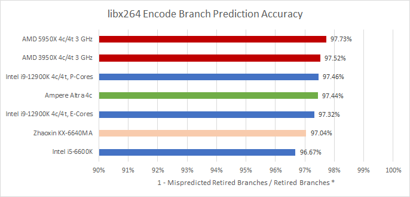

*图 12：12900K P-Core 为 97.46%，E-Core 为 97.32%；5950X/3950X 为 97.73%/97.52%，Ampere Altra 97.44%，兆芯 KX-6640MA 97.01%，i5-6600K 96.67%。准确率接近 100% 时，百分点差异应结合 MPKI 与误预测恢复成本理解。*

### 体系结构视角：准确率只回答“猜对多少”，没有回答“迟到多久”

预测器必须同时给出方向和目标。方向错了会清空错误路径；方向对、BTB 没有及时给出目标，前端仍会停顿。更大的方向表还可能增加访问延迟，因此现代核心常把预测器分层：快速层先覆盖常见分支，较慢的大表再纠正或补充。

验证前端应同时观察 branch MPKI、错误恢复周期、各级 BTB miss、redirect、I-Cache miss 与 frontend starvation。若准确率提升但 IPC 不动，目标预测或指令供给可能已成为主瓶颈；若性能不变而错误路径微操作减少，则能效仍可能改善。

## 三级 BTB：容量巨大，但零空泡覆盖有所取舍

Golden Cove 的 BTB 看起来有三级。前一级 miss、后一级 hit 时，每跨一级约增加 1 个周期；AMD 的 L2 BTB 命中惩罚约 3 周期。图中 Golden Cove 在约 4608 个分支附近仍处于约 2.3 周期平台，约 12288 项附近为约 3.0 周期，之后才进入更重的 miss 区域。

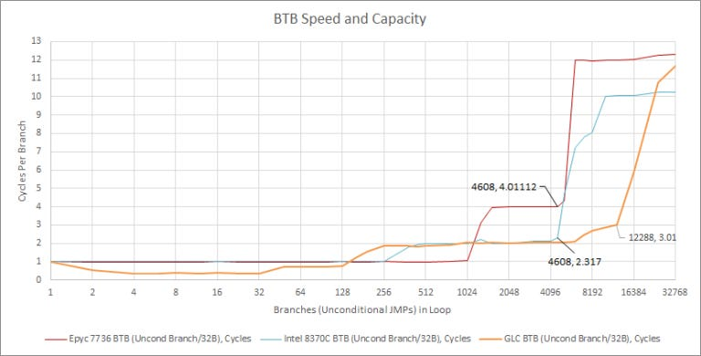

*图 13：橙线是 Golden Cove，蓝线为 Xeon 8370C，红线为 EPYC 7736。Golden Cove 形成约 128、4608 和 12288 分支附近的多级平台，每级增加约一个周期，容量远大于以往 Intel 核心。*

与 Rocket Lake 形态的 Sunny Cove 类似，Golden Cove 还能在微操作队列中展开小循环，达到每周期两个 Taken 分支。它相当于一个很小的 Trace Cache：开发者或编译器无需手工展开，前端也能减少紧密循环的分支开销。

Zen 3 在另一类场景更快：它能让多达 1024 个分支背靠背执行而不插入额外周期。Golden Cove 只有约 128 个分支能维持接近每周期一个的零空泡范围，与 Haswell 相当，却比 Sunny Cove 倒退。文章推测 Intel 为了让巨大 BTB 在 5 GHz 以上工作，接受了这种取舍。

返回预测更加奇怪。即使把 Call/Return 对增加到 128，也看不到清晰的容量断崖；但调用深度超过 2 后，Golden Cove 处理 Return 就偏慢。Sunny Cove、Zen 2 和 Zen 3 在较低时钟下仍更快，直到各自 RAS 溢出。

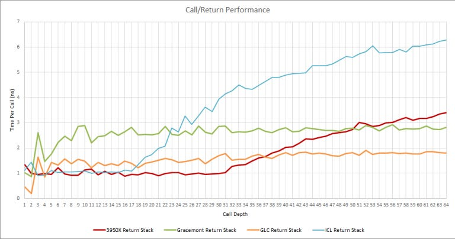

*图 14：Golden Cove 橙线没有明显的固定容量台阶，却在深度超过 2 后长期维持较高每次 Call 时间；Ice Lake 与 Ryzen 9 3950X 会在 RAS 溢出后逐步上升。曲线无法给出 Golden Cove 的确定 RAS 深度。*

## 取指与译码：4K 微操作 Cache、六宽译码、32 B/cycle L1I

预测出下一地址后，前端需要取回指令并译成内部微操作。Golden Cove 的微操作 Cache 增至约 4K 项，Sunny Cove 为 2.25K，Skylake 为 1.5K；读取带宽从每周期 6 个微操作提高到 8 个，与当时的 Zen 相当。

微操作 Cache miss 时，六个指令译码器接管。为喂饱它们，L1I 带宽从 Sunny Cove/Skylake 的 16 B/cycle 翻倍到 32 B/cycle；译码宽度也从四宽提高到六宽。

文章用八字节 NOP `0F 1F 84 00 00 00 00 00` 填满数组，在末尾放置 `C3` Return，再循环计时。六宽流水线若不受字节供给限制，理论上需要 48 B/cycle；微操作 Cache 可对应 64 B/cycle，所以热点区理应达到六条 NOP。

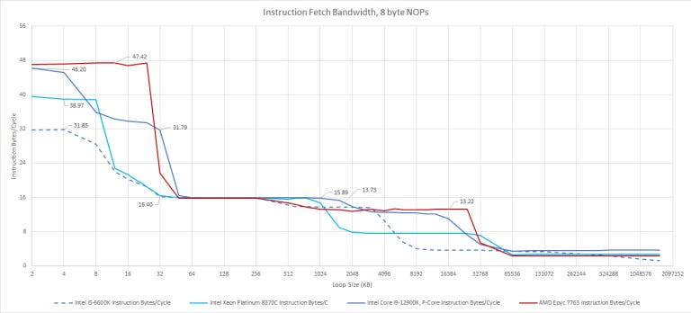

*图 15：网页正式图注给出 Golden Cove/Zen 3 的核心宽度上限为 48 B/cycle，Ice Lake 为 40，Skylake 为 32。Golden Cove 在略超 1024 条 NOP、约 8 KB 时曲线已像 Skylake 一样下降，没有显出名义 4K 微操作 Cache 的完整容量；32 B/cycle L1I 缓解了下降。*

这一结果可能来自组相联、地址映射或测试序列并未以理想方式占用微操作 Cache，不能直接把“看不到 4K”写成“硬件只有 1K”。越过 L1I 后，图中各核心从 L2 都只能读取约 16 B/cycle。常见整数 x86 指令平均约 3～4 字节，所以理论上仍足以支撑约 4～5 instructions/cycle；八字节 NOP 更接近 AVX 密集代码的字节压力。L3 区域也大致相似，Ice Lake 可能额外受 Mesh 互连限制。

### 体系结构视角：前端容量要区分名义条目与有效工作集

微操作 Cache 的名义条目数不等于任意布局都能使用的容量。组相联冲突、跨块边界、分支目标密度和一条 x86 指令展开成多少微操作，都会改变有效覆盖。真正关心的是热点循环能否稳定命中，以及 miss 后 L1I 与译码器能否无缝接管。

如果微操作 Cache miss 上升，却仍有足够 L1I 字节和译码带宽，性能可能只轻微下降；若代码工作集进一步越过 L1I，16 B/cycle 的 L2 取指就会成为窄口。可以用 uop-cache hit/miss、decoded uops、I-Cache miss、frontend bound 与代码大小扫描定位每一级台阶。

## 六宽重命名：消除 MOV，也消除清零微操作

指令译码后，重命名/分配阶段为 ROB、物理寄存器和各种队列分配资源。它把 ISA 寄存器映射到更多物理寄存器，消除 WAR/WAW 伪依赖；因为同拍后续指令可能依赖同拍前一条的新映射，这一级天然具有串行链路，常成为核心最窄的阶段。

Intel 从 Ivy Bridge 引入 MOV elimination，Sunny Cove 已能按重命名宽度消除串联 MOV。Golden Cove 把入口扩至六宽，因此依赖/独立寄存器 MOV 分别达到 5.62/5.68 IPC，与 Zen 3 的 5.72/5.70 接近，远高于 Skylake 的 1.65/3.81。

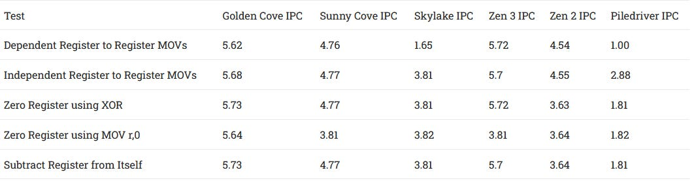

*图 16：Golden Cove 的依赖 MOV、独立 MOV、`XOR r,r`、`MOV r,0`、`SUB r,r` 分别为 5.62、5.68、5.73、5.64、5.73 IPC。Zen 3 只有 XOR 与 SUB 清零能被消除，`MOV r,0` 为 3.81 IPC、受四条 ALU 限制；Golden Cove 对测试中的全部清零惯用法都接近六宽。*

识别清零惯用法不仅打破旧值依赖，Golden Cove 还直接消除微操作，使其不占 ALU 端口。Zen 3 能把这些操作识别为独立，但只有 XOR 与 SUB 情形被消除；立即数零 MOV 仍进入 ALU。

### 体系结构视角：一次重命名优化能同时释放三类资源

被消除的 MOV 或清零操作不再占执行端口，也不必等待旧寄存器值，还可以减少调度与回写网络压力。其消费者更早 ready，短依赖链因而获得超过“少一个 ALU 周期”的收益。

但优化必须满足完整 ISA 语义，包括寄存器宽度、零扩展、标志位和异常。判断一条操作是真消除还是低延迟执行，可以比较依赖链 latency、吞吐、已执行微操作数和端口占用；只看 IPC 很容易把专用执行快路误判成 rename elimination。

## 512 项 ROB：headline 很大，整数寄存器却没有跟上

ROB 记录所有尚未退休的微操作，Golden Cove 约 512 项，Sunny Cove 约 352，增幅 45.4%；Zen 3 约 256。为了利用更大的窗口，Golden Cove 的 FP/向量寄存器、Load/Store Queue 和 Superqueue 都明显增长，但各结构并不整齐。

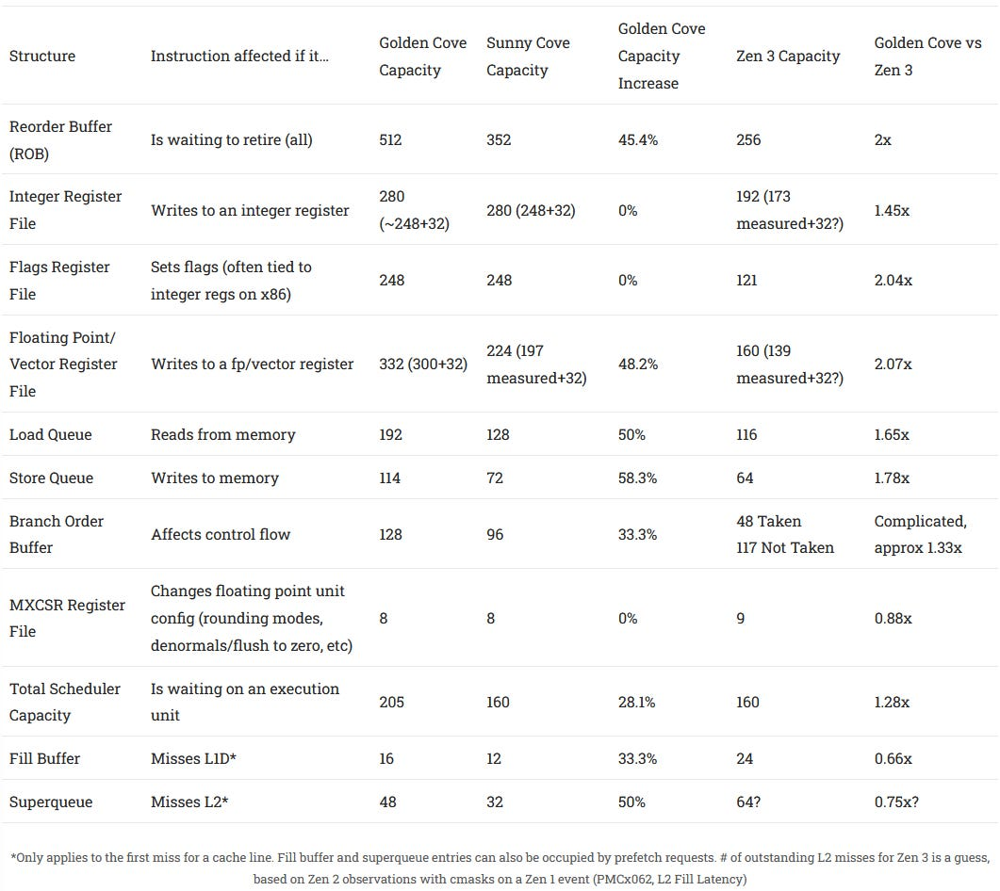

*图 17：Golden/Sunny/Zen 3 的主要容量为：ROB 512/352/256；整数寄存器约 280/280/192；标志寄存器 248/248/121；FP/向量寄存器 332/224/160；Load Queue 192/128/116；Store Queue 114/72/64；Branch Order Buffer 128/96/48 Taken 或 117 Not-Taken；MXCSR 资源 8/8/9；总调度容量 205/160/160；Fill Buffer 16/12/24；Superqueue 48/32/约 64。*

表中的 32 项增量用于解释某些寄存器测量与推定容量差异；Zen 3 的 64 项未完成 L2 miss 只是根据 Zen 2 事件观察作出的猜测。Fill Buffer 与 Superqueue 还可能被预取请求占用，数字不能简单等同于应用 Load 可用的独占槽位。

最突出的问题是整数物理寄存器。Golden Cove 的测试曲线甚至略低于 Sunny Cove；文章不相信 Intel 真会缩小如此关键的结构，因此仍按约 280 项看待，但结论是它没有随着 512 项 ROB 扩张。

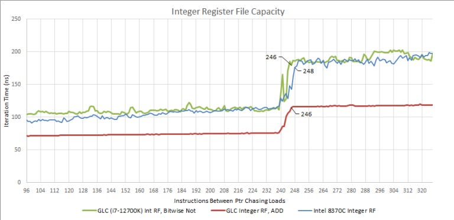

*图 18：Golden Cove、Sunny Cove 与其他核心在阻塞退休测试中的曲线于不同在途指令数量处出现拐点。Golden Cove 的可见值没有超过 Sunny Cove；这证明“特定微基准先耗尽整数重命名资源”，却不能证明物理阵列被缩小。*

文章用 Intel SDE 对两个负载分类：7-Zip 压缩一个 2.67 GB ETL 文件，代表纯整数负载；libx264 编码 4K 视频，代表向量化负载。7-Zip 中 52.34% 指令写整数寄存器，23.66% 是 Load，6.89% 是 Store，15.15% 是分支；libx264 分别为 39.74%、30.4%、12.79%、4.68%，另有 32.08% 写 FP/向量寄存器。

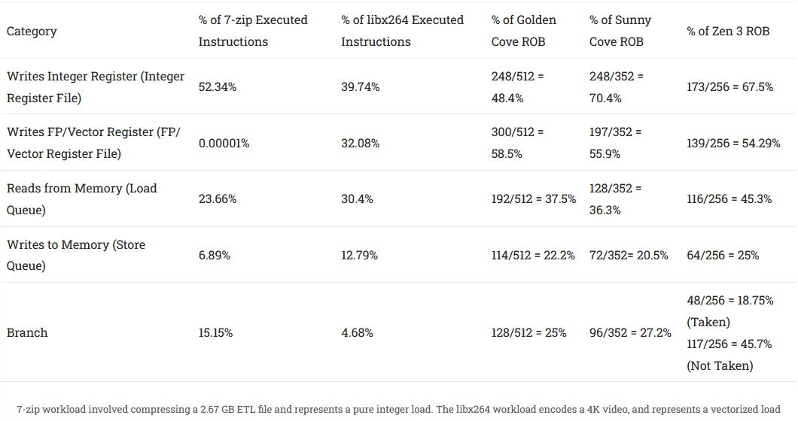

*图 19：Golden Cove 整数寄存器可覆盖 248/512＝48.4% ROB，Sunny Cove 为 70.4%，Zen 3 为 67.5%；FP/向量覆盖分别为 58.5%、55.9%、54.29%；Load Queue 为 37.5%、36.3%、45.3%；Store Queue 为 22.2%、20.5%、25%。整数密集代码可能先耗尽 Golden Cove 的寄存器，而不是 512 项 ROB。*

纯整数负载因此未必能充分利用醒目的 512 项窗口；浮点/向量负载写整数寄存器的比例更低，Golden Cove 测得的可见重排序容量仍比 Zen 3 高出 40% 以上。

### 体系结构视角：ROB 是天花板，最先耗尽的资源才是房间高度

分配必须按序进行。只要下一条指令拿不到整数寄存器、Load Queue、Store Queue、分支或调度条目，后续指令就无法越过它进入窗口。于是“512 项 ROB”只给出最大上限，不同指令混合会看到不同有效深度。

长 Cache miss 出现时，大窗口还必须配合足够的 Fill Buffer、Superqueue 和地址生成吞吐，才能把后续独立请求发出去。验证实际短板可以看 allocation stall reason、各队列 full 周期、在途 Load/Store、并发 miss 与退休停顿；若 ROB 仍有空位而整数 free-list 耗尽，继续扩大 ROB 不会带来收益。

## 执行单元：五条 ALU、五条 AGU，以及两周期 FP Add

现代高性能核心往往更容易被分支和内存限制，执行单元并非总是首要瓶颈。Golden Cove 仍把资源铺得非常充足：五条整数执行路径，是当时 x86 核心中最多的一组。

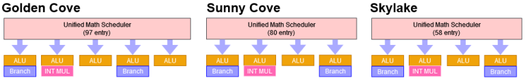

*图 20：Golden Cove 使用统一数学调度器驱动五条整数路径，Sunny Cove 和 Skylake 更少。图中的端口能力不同，并非五条都能执行所有整数指令。*

五条 ALU 若各读两个源，需要最多十个整数寄存器读口；三条 Load 加两条 Store AGU 还要再读取地址源。寄存器文件端口可能在多条执行路径间共享，但测试能同时使用五条整数 ALU，说明至少存在满足十个源操作数的读能力。高端口数会显著增加面积、功耗和布线难度，文章据此猜测整数寄存器没有扩容，可能与端口成本有关。

Intel 继续用统一调度器处理整数与 FP/向量数学操作，把地址生成放到独立队列；AMD Zen 3 则把整数调度分散成四组，并让 AGU 与部分整数路径共享调度域。

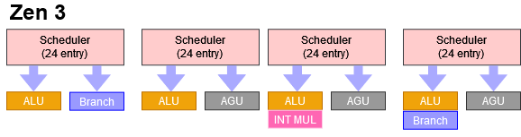

*图 21：Zen 3 使用四个约 24 项队列，每个连接不同的 ALU、AGU、分支或乘法能力。分布式组织更容易控制唤醒选择时序，但指令若分配不均会出现局部拥塞。*

Golden Cove 可每周期为三条 Load 和两条 Store 生成地址，创下当时 x86 的高点。Load 与 Store AGU 在 Intel 图中分离；Zen 3 的三条 AGU 则同时承担两类访问。

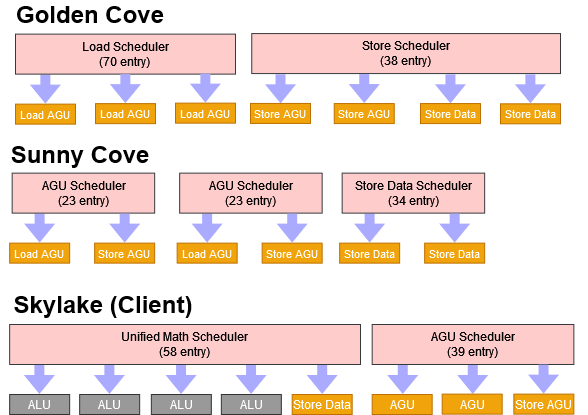

*图 22：Golden Cove 的 Load Scheduler 约 70 项、Store Scheduler 约 38 项，连接三条 Load AGU、两条 Store Address 和两条 Store Data 路径；Sunny Cove 和 Skylake 的端口与队列更少。*

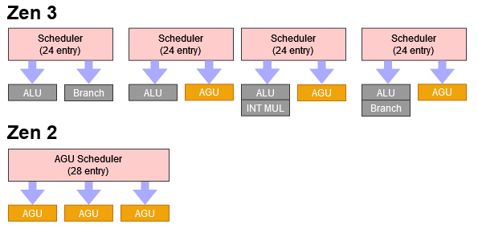

*图 23：Zen 3 的 AGU Scheduler 约 28 项，三条 AGU 兼做 Load/Store 地址生成。与 Intel 的专用路径相比，通用性更高，但每类操作可获得的峰值取决于共享竞争。*

FP/向量侧，Golden Cove 把主要单元放在三个端口之后，相比旧 Intel 核心只有两条 FP Load 相关路径有所增强。最亮眼的是 FP Add 延迟仅 2 周期：VIA Nano 这类低频设计曾做到过，但 Golden Cove 在 5 GHz 以上实现更困难。Zen 3 的 FP Add 为 3 周期；FP Multiply 则反过来，Golden Cove 为 4，Zen 3 为 3。

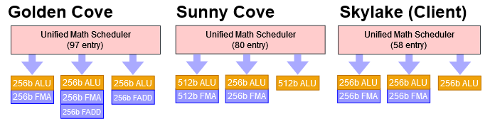

*图 24：Golden Cove 的统一数学调度器约 97 项，三条主要 FP/向量路径可承担 256-bit FMA、加法、整数向量等不同组合。能力并不对称，吞吐还受寄存器读写端口限制。*

两家都能以 1 周期完成向量整数加法；Golden Cove 的 packed 32-bit 向量整数乘法却要 10 周期，与旧 Intel 核心相近，明显慢于 Zen 3 的 3 周期和 Zen 2 的 4 周期。

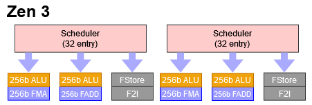

*图 25：Zen 3 有四个约 32 项调度队列/端口，可覆盖两条 256-bit FMA/Multiply、两条 Add 和更多向量整数路径。单项端口更多，不代表四条在任意三输入操作混合下都能同时吃满。*

统一调度器在相同条目数下利用率更高，也更容易让不同操作共享空闲空间；分布式调度更利于物理实现，却要求分配策略把压力铺匀。Zen 3 的四条 FP/向量路径看似比 Golden Cove 多，但两条 FMA 每条需要三个输入，向量寄存器文件未必有足够读带宽同时喂满其余两条。

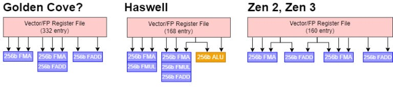

*图 26：Golden Cove 可能有 8 个读口和 3 个写口；Haswell 约 7 读口；Zen 2/Zen 3 至少 8 读、4 写。图是根据吞吐实验反推的逻辑端口需求，不是物理 SRAM 端口图。Intel 用较少端口换来更容易扩大的 332 项容量；AMD 从 Bulldozer、Piledriver 到 Zen 1～3 长期维持约 160 项，Steamroller/Excavator 虽为 176 项，但只有三条 FP 路径、最大约 8 读 3 写。Zen 现有覆盖率尚够，因此当时并不急于扩容。*

### 体系结构视角：端口数只是第一层约束

一条执行路径能否持续工作，还依赖调度器发射、寄存器读口、旁路、回写和具体操作能力。三输入 FMA 比两输入 Add 更容易压满读带宽；AGU 能生成地址，也不代表 Cache 端口、TLB 或 Load Queue 能以同样速率完成访问。

发生端口冲突时，微操作已经 ready，却要在调度器里等待匹配路径。可以通过构造不同指令混合、观察 ready-but-not-issued 与端口利用率，区分“依赖没准备好”和“端口被占”。只按框图数方块，往往会高估实际吞吐。

## 存储系统：带宽极强，延迟也更高

8P+8E 的 Alder Lake 在多线程 Cache 带宽上非常强。L1D 和 L2 接近 Ryzen 9 3950X，并离 5950X 不远。AMD 的 L3 总带宽仍更高，但 AMD 使用 16 个 L3 Slice，按 8+8 或 4+4+4+4 分组；Intel 使用 12 个 Slice 组成统一 Cache。两家都依靠把访问分散到各 Slice、每个 Slice 每周期约 32 B。按每 Slice 计算，AMD 领先约 39.9%，没有总带宽柱状图看起来那么悬殊。

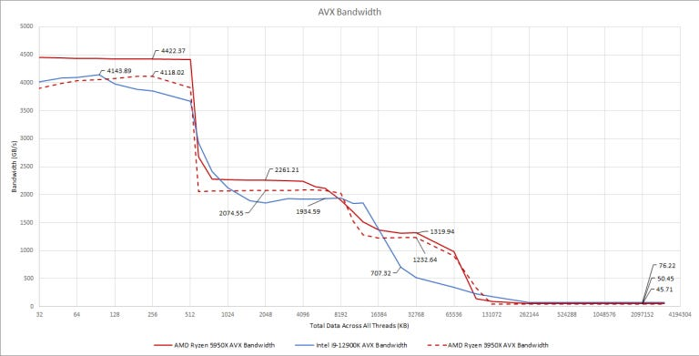

*图 27：网页正式图注说明使用 AVX、所有线程共同施加读取负载。图同时受到核心数、Slice 数、频率和内存配置影响；Alder Lake 的强项集中在 L1/L2，AMD 在 L3 维持优势。*

使用 DDR5-6200 时，Alder Lake 在 3 GB 测试规模达到 96.6 GB/s，几乎是文章此前测得 Zen 3 DDR4 带宽的两倍。这个优势属于整个平台的内存控制器与 DIMM 配置，不应归为单个 Golden Cove 核心的固定参数。

单线程看，Golden Cove 可从 L1D 每周期完成三次 256-bit 向量 Load。Zen 3 也能做三次 Load，但只有两条可为向量 Load。Golden Cove 到 L2 的路径为 64 B/cycle，AMD 为 32 B/cycle；对经过 Cache Blocking、工作集落在私有 Cache 内的向量程序，Intel 因而拥有很高供给带宽。

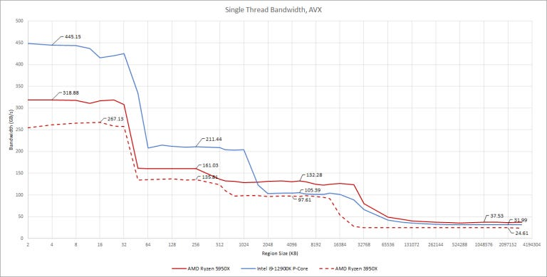

*图 28：网页正式图注说明使用 AVX，Alder Lake 此次采用 DDR4。Golden Cove 在 L1/L2 区间显示宽私有路径，AMD 在 L3 更强；进入内存后，DDR4 配置限制横向解释。*

AVX-512 并非 Alder Lake 官方支持特性，但部分早期主板在关闭 E-Core 后可以启用。Golden Cove 可每周期完成两次 512-bit Load；以约 5.2 GHz 工作时，八颗 Golden Cove 的 L1D 带宽甚至超过 16 颗 Zen 3。L2 区间使用 AVX-512 时达到 64 B/cycle 理论值的略高于 78%，AVX 约 63.5%；越过 L2 后，AVX-512 不再带来带宽优势。

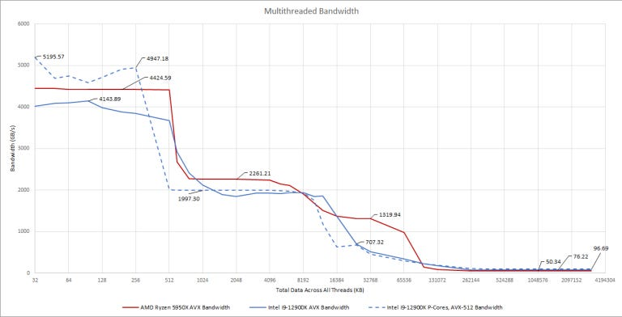

*图 29：这组 AVX-512 数据由支持相关设置的平台另测。L1D/L2 可受益于更宽 Load，L3 与内存区间则由下层接口主导；不能把图中结果外推到所有零售主板与后续微码。*

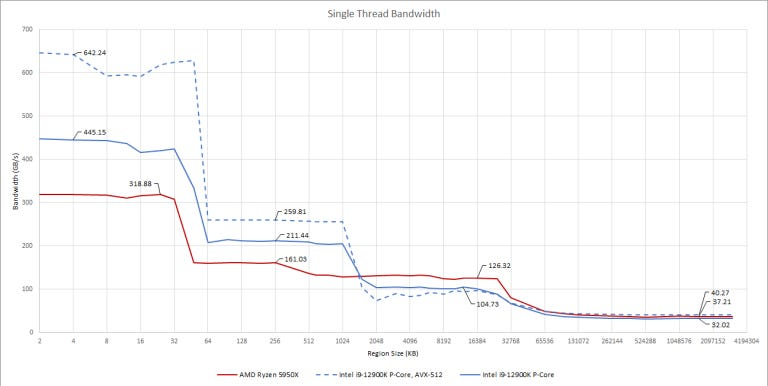

*图 30：网页正式图注说明数据由 CapFrameX 使用 DDR5-6200 测得。3 GB 规模下约 96.6 GB/s 展示 Alder Lake 内存系统的峰值，但测试平台与主体 DDR4 图不同。*

高带宽与高频并非免费。Golden Cove 在所有 Cache 层级的延迟都高于 Zen 3；作为交换，它的 L1/L2 更大、带宽也更高。

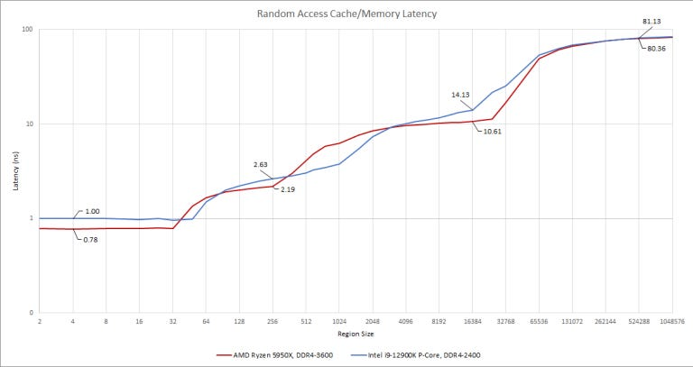

*图 31：网页正式图注提醒不要比较最右侧内存延迟，因为 DDR4 配置没有匹配，若使用 DDR5，Alder Lake 内存延迟还会更高。图适合比较 Cache 台阶，不适合用 DRAM 端点宣布胜负。*

假定 Golden Cove 约 5.2 GHz、Zen 3 约 5.05 GHz，可把延迟换算为周期：Golden Cove L1D/L2/L3 约 5/14/74 周期，DRAM 约 422；Zen 3 约 4/12/54/406。AnandTech 的结果显示 Golden Cove 延迟还可能更高。

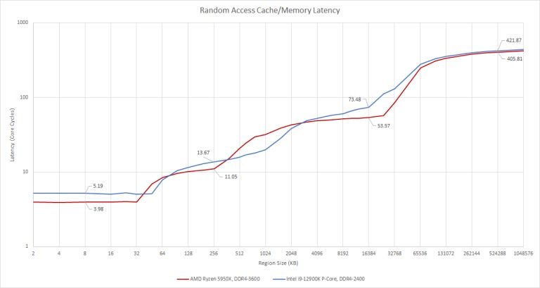

*图 32：网页正式图注指出 AnandTech 测得更高延迟。周期换算依赖实际频率，尤其 Turbo 状态会改变结果；图中的 5.2/5.05 GHz 是分析假设，不是逐点锁频记录。*

## Little’s Law：512 项 ROB 能否覆盖高 Cache 延迟

Little’s Law 写作：

> **L = λ × W**

队列长度 `L` 等于到达率 `λ` 乘以平均等待时间 `W`。把 ROB 近似看作容纳在途指令的队列，并假定其他结构不会先满，就能粗略估计：要在某层延迟下维持 6 IPC，需要多少 ROB 条目。

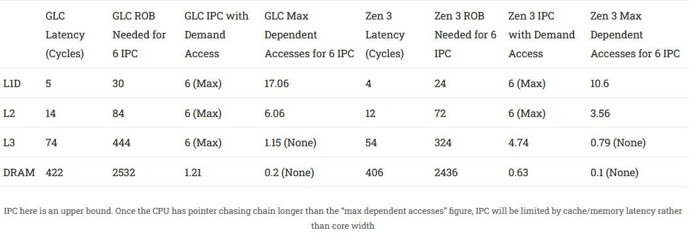

*图 33：Golden Cove L1D/L2/L3 为 5/14/74 周期，对 6 IPC 分别需要约 30/84/444 项 ROB；Zen 3 的 4/12/54 周期对应 24/72/324 项。DRAM 需要约 2532/2436 项，远超两者窗口。Golden Cove 512 项可覆盖表中的 L3 延迟，Zen 3 的 256 项则只能把需求 IPC 降至约 4.74；这只是上界模型。*

表中还给出最大依赖访问链：在 L1D/L2，Golden Cove 理论上分别可容纳约 17.06/6.06 次依赖访问来维持 6 IPC；到 L3 只有 1.15，DRAM 只有 0.2。Zen 3 对应约 10.6/3.56/0.79/0.1。一旦指针追逐链长于这个数，性能就由串行访存延迟而非核心宽度决定。

### 体系结构视角：大窗口隐藏的是“可并行的等待”

Little’s Law 的估算很有启发，但它假定持续 6 IPC、ROB 是唯一限制、窗口中有足够独立指令。真实程序还会被分支、寄存器、Load/Store Queue、Fill Buffer 和依赖链截断。DRAM 延迟远超任何现实 ROB，核心只能依靠内存级并行、预取、SMT 或更好的局部性，而不能靠无限加深窗口。

如果一次 L3 miss 后仍能发出多条独立 Load，大 ROB 和 miss 队列可把等待摊薄；若下一次访问地址依赖前一次返回，所有资源都会围着同一条链空转。因此应同时测 IPC、内存级并行、平均 outstanding misses、ROB occupancy、load-blocked 周期和预取命中，而不是拿 512 与 256 直接推算应用性能。

## 初步结论：Golden Cove 强在哪里，又留下了什么

Golden Cove 是一颗极其庞大的核心。其他评测已经显示其单线程性能超过 Zen 3，Core i9-12900K 也能与 AMD 高核心数桌面产品竞争。在多年 Skylake 延续与 Rocket Lake 之后，这次升级尤其醒目。

它对 FP/向量负载的调校很突出：FP Add 只有 2 周期，向量寄存器文件巨大，核心私有 Cache 能提供极高向量 Load 带宽，1.25 MB L2 也让 Cache Blocking 更容易。五条整数 ALU 中有三条与 FP/向量端口相连；向量循环仍需要标量整数指令完成计数、分支和地址计算，两条专用 ALU 而不是一条，有助于处理这些配套工作。

整数负载也会受益于额外 ALU 与更强重命名，但文章认为 Intel 为了让 Golden Cove 同时服务 Alder Lake 与 Sapphire Rapids，可能留下了一些整数性能。更高的 Cache 延迟要求更强重排序能力；与其继续堆 ALU，若能给整数寄存器更充足的容量，执行管线可能更容易被喂饱。这是基于资源配比的判断，不是 Intel 对设计原因的说明。

Golden Cove 的强项可以概括为：宽核心与很深的重排序窗口；极高的 L1/L2 带宽，配合 DDR5 还有更高内存带宽；大型 L2；容量巨大、相对低延迟的 BTB，有利于把指令预取推进到 L2；在特定早期平台可用的 AVX-512；以及整体匹敌或超过 AMD 的重命名优化。

它的弱项则是：各级 Cache 延迟都高于 Zen 3；整数寄存器相对 ROB 明显偏小；方向预测仍略逊于 AMD。Zen 3 的优势是更大的零空泡 BTB、当时测试中最强的方向预测，以及高带宽低延迟 L3；短板是私有 Cache 比 Willow Cove/Golden Cove 小，乱序资源也更难覆盖 L3 与内存延迟。

## 向前看：一次领先，不是一记终结比赛的重拳

Golden Cove 延续 Sunny Cove 的强项，也削弱了 AMD 的一些优势。Alder Lake 发布时，Intel 重新取得单线程性能领先，但不是压倒性胜利。Zen 3 仍有更好的方向预测和 Cache 延迟，能让较小资源发挥更高效率；反过来说，这些 Intel 弱点也削弱了巨大乱序队列的收益。框图上的容量差距，大于真实应用中的性能差距。

文章发表于 2021 年 12 月，当时只知道 Zen 4 可能在下一年发布并支持 AVX-512。文末对 AMD 能否夺回单线程领先保持期待；这应保留为当时的技术判断，而不是用后来的产品结果倒写原结论。文章还提供 Patreon 与 PayPal 作为读者支持渠道。

## 附录：如何反推向量寄存器文件带宽

Intel 没有公开向量寄存器文件带宽。Haswell 上，以 2:1 比例混合 FMA 与向量整数 Add，只得到 2.41 IPC，平均相当于每周期读取 6.43 个向量源；若每隔一条 FMA 把一个输入改从 L1D 读取，吞吐升到 2.93 IPC，几乎吃满三条向量路径，对应每周期 7.81 个 256-bit 输入。因此文章推测 Haswell 约有 7 个读口。

Sunny Cove 即使不把一半 FMA 改成 Load-op，也能达到 3 IPC；文章假设 Golden Cove 延续这一能力，于是推定其向量寄存器文件有 8 个读口。2021 年 12 月 2 日的修订同时纠正了对 AMD 优化指南的误读：Zen 的向量寄存器文件也有 8 个读口，而不是此前写的更少。

## 体系结构视角：从 Golden Cove 得到的六点认识

综合这些测试，还可以提炼出六点一般性的处理器设计认识；它们用于教学理解，不是 Intel 官方结论，也不是原文章观点的替换。

第一，**规模增长必须看比例，而不是只看最大数字**。512 项 ROB 很醒目，整数寄存器覆盖却从 Sunny Cove 的 70.4% 降到 48.4%。决定有效窗口的是程序最先耗尽的资源。

第二，**高带宽 Cache 与低延迟 Cache 是两种不同的竞争策略**。Golden Cove 用更大、更宽的 L1/L2 配合深窗口，Zen 3 则用更低延迟和强 L3 提高小窗口效率。二者都可能成立，取决于工作集和并行性。

第三，**预测容量与预测时效必须一起设计**。Golden Cove 有约 12K 的巨大末级 BTB，每级只增加约一个周期；Zen 3 的零空泡覆盖更大。前者偏向深度预取覆盖，后者偏向常见直接分支速度。

第四，**重命名是前端与后端之间真正的“总闸门”**。六宽入口不仅分配资源，还能消除 MOV 和清零操作。优化掉一条微操作，会同时释放依赖、端口和调度压力。

第五，**执行端口越多，寄存器与旁路网络越难做**。五条 ALU、五条 AGU 和三条 FP/向量路径背后，是大量读写端口、广播和回写需求；这可能比增加一个 ALU 方块更昂贵。

第六，**大窗口只能隐藏独立延迟，不能消灭串行依赖**。Little’s Law 能说明 512 项 ROB 为何适合 74-cycle L3，却也说明一次 422-cycle DRAM 指针追逐不可能靠窗口解决。预取、数据布局和并行 miss 往往更关键。

Golden Cove 的真正价值，在于 Intel 把前端宽度、重命名技巧、乱序深度、执行资源和私有 Cache 带宽同时推高。它并不完美：整数资源配比和 Cache 延迟都留下了清晰短板。但正因为强项与代价都如此鲜明，它仍是理解现代超宽乱序 x86 核心最好的案例之一。

## 参考资料

- Chester Lam, *Popping the Hood on Golden Cove*, Chips and Cheese, 2021-12-02：https://chipsandcheese.com/p/popping-the-hood-on-golden-cove
- Travis Downs, 关于乱序窗口限制因素的分析（原文章所引）
- Henry Wong / Stuffed Cow，相关微架构微基准方法
- Intel Architecture Day 2021，Golden Cove 公开资料
