# Goldmont Plus：Intel Atom 走向混合架构前的过渡一代

> 英文标题：Tracing Intel’s Atom Journey: Goldmont Plus 
> 撰文：Chester Lam 
> 首发：Chips and Cheese，2024 年 6 月 10 日 
> 原始链接：https://chipsandcheese.com/p/tracing-intels-atom-journey-goldmont-plus

今天的 Atom 血脉已经进入 Intel 高端客户端处理器，也被 Sierra Forest 用来追求面积高效的服务器多线程吞吐。但在几代之前，Atom 还被限制在低功耗设备里，关注度远低于 Core 大核。

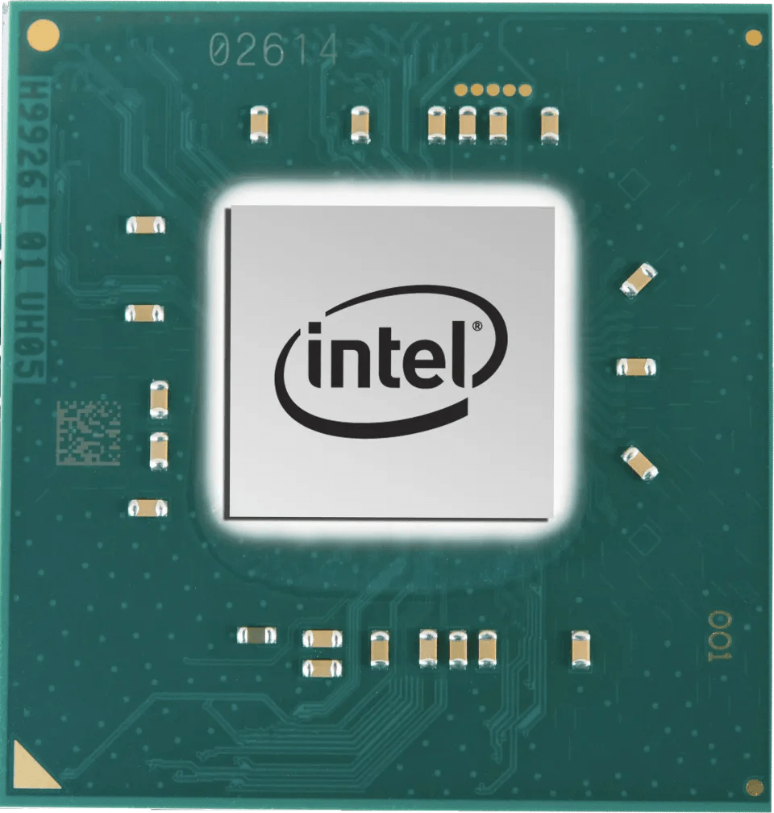

Goldmont Plus（GLP）在 2017 年末随 Gemini Lake 发布，使用 Intel 14 nm，2020 年停产。它位于两个极端之间：Silvermont 为手机和旧工艺承受了大量妥协；Tremont 为后来的 hybrid strategy 显著增强；GLP 已经是较完整的乱序核心，却没有一个能压倒性占优的市场。

测试对象是 Celeron J4125：一个四核 GLP cluster、共享 4 MB L2、FCBGA1090 封装，boost 最高 2.7 GHz。名义目标 10 W，但全核负载常达到 13—14 W。

## 总览：3-wide 乱序小核

GLP 是 3-wide superscalar、out-of-order core，执行引擎和重排序容量远大于 Silvermont，某些方面接近 Core 2；但它不像 Crestmont、Skymont 那样能逼近几代前的大核。

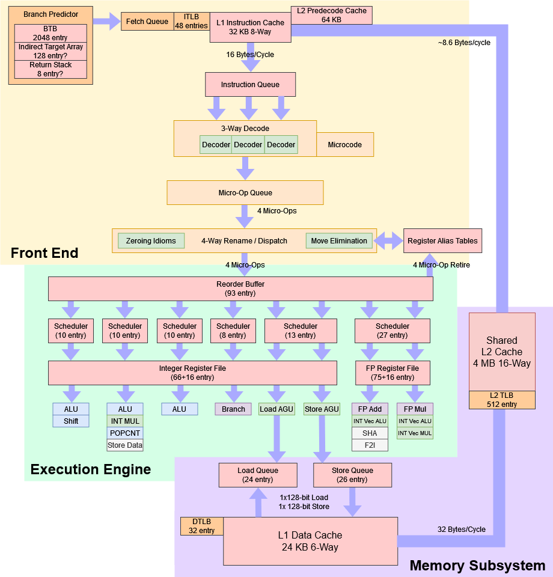

它与现代 Atom 共享 distributed scheduler 和 predecode 等特征。Intel 给出的 branch mispredict penalty 是 12—13 周期，短于同期高性能 Core 常见的 15—20 周期。

## 分支预测：能力不弱，目标路径偏慢

branch predictor 同时影响性能和能效：猜得慢会堵住取指，猜错会浪费错误路径功耗。Silvermont（尤其 Knights Landing 版本）以及 2010 年代前中期很多低功耗 core 的 predictor 较弱，Cortex-A73 也有相似表现。GLP 不再瞄准手机，可能因此获得更高面积与功耗预算；模式识别能力接近 Skylake，但大 branch footprint 下较弱。

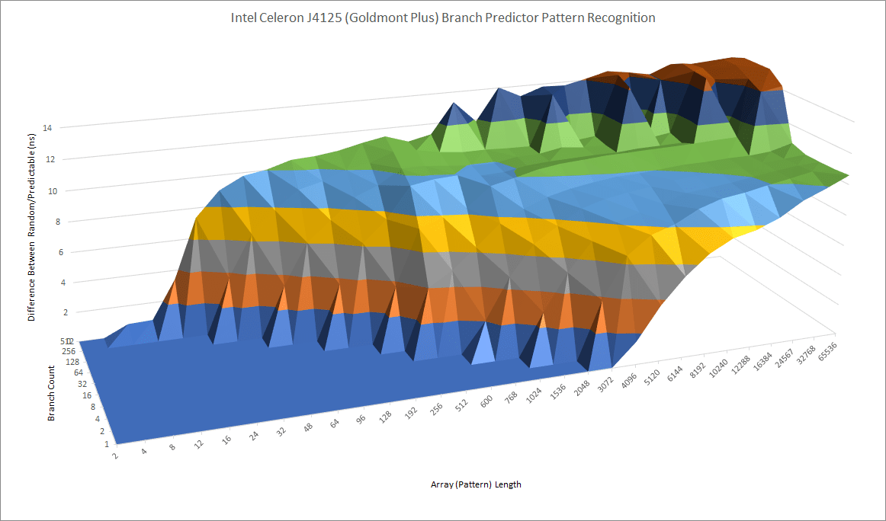

目标预测做了更明显的取舍。GLP 主 BTB 约 2048 项、命中路径 3 周期。容量与 Nehalem、Core 2 接近，速度却更慢：Core 2 主 BTB 约 2 周期，还能让最多四条分支走 1 周期快速路径。

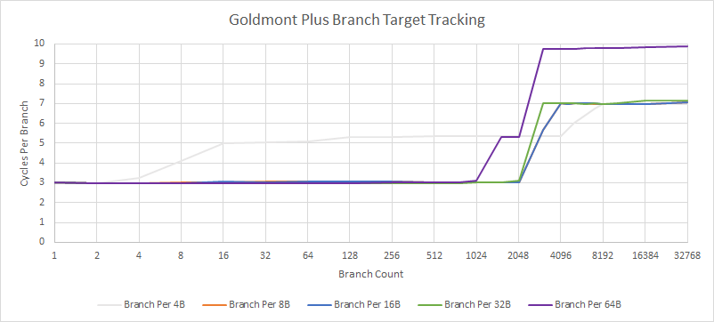

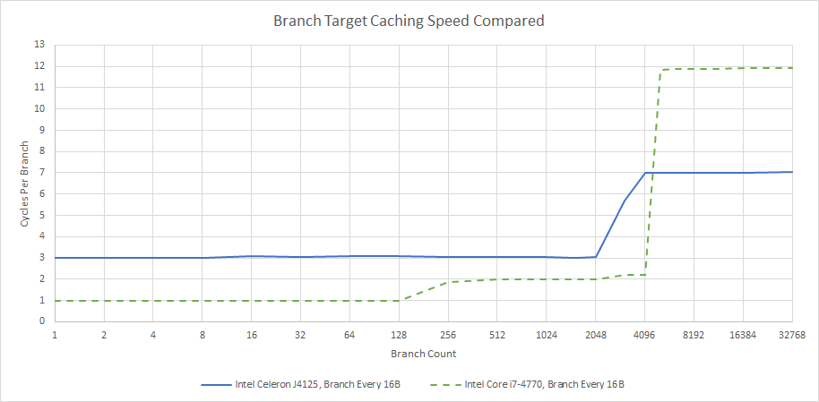

Haswell 同时保留 4096 项、2 周期主 BTB，现代 Crestmont Atom 的 target caching 也更强。GLP 的较短 mispredict pipeline 并不意味着预测前端处处更快；BTB hit latency 会作用在大量正确预测的 taken branch 上。

indirect branch 更难，因为同一 PC 可去多个 target。GLP 在“32 条 indirect branch、每条轮换 4 个 target”时，可跟踪至少 128 个 target 而仅有小幅惩罚；单条 branch 可在约 16 个 target 间轮换，之后才显著恶化。

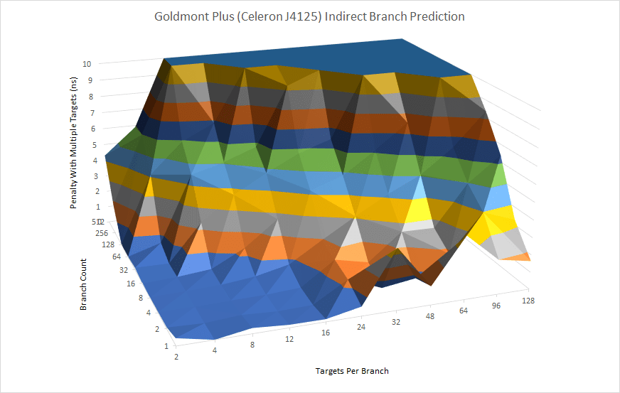

能力不及大核，但至少有基本的多目标 predictor。

### 体系结构视角：方向预测、BTB 容量与重定向延迟要分开看

图 3 主要观察 history/pattern capacity，图 4—5 观察 target 是否被缓存以及命中要几周期，图 6 又是 indirect target selection。12—13 周期 mispredict penalty 只描述错误被发现后的恢复代价。一个核心可以方向很准，却因主 BTB 慢而在正确 taken branch 上不断产生 bubble。

硬件验证可分别使用 branch-miss、BTB miss、resteer、frontend bubble 与 indirect mispredict 计数器；曲线拐点只能近似容量，不能在没有 RTL 时唯一确定 set/way 或替换策略。

## Fetch/Decode：独立 64 KB predecode cache

GLP 有 32 KB instruction cache，旁边是一块独立 64 KB predecode cache，为主 decoder 保存指令边界等信息。Arm 常把 predecode metadata 与 I-cache line 绑定；GLP 即使把指令逐出 L1I，仍可保留 predecode 信息，大 code footprint 再填入时无需重新完成全部预解码。前端还有 48 项全相联 iTLB。

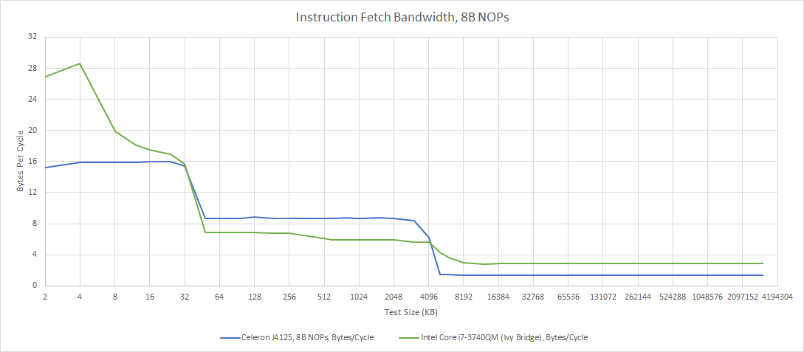

Intel 优化指南写 decoder 可处理 20 B/cycle，实测用 8-byte NOP 只能持续 16 B/cycle。高性能 Core 有 micro-op cache，可绕过 instruction cache bandwidth，尤其帮助带大 immediate 或额外 AVX prefix 的长指令。

decoder 每周期最多三条 instruction，与同期 Cortex-A72 相当，低于 Core 大核的 4-wide。若 cache latency 等其他环节先成为瓶颈，停在 3-wide 是合理的面积选择。

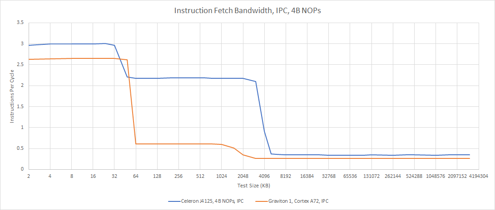

代码溢出 L1I 后，GLP 仍保持不错吞吐，独立 predecode cache 很可能加速 L1I refill。A72 同为 3-wide，从 L2 运行时吞吐下降更大，可能是 predecoder 较弱，或 instruction-side memory-level parallelism 不足；原因未被直接验证。

## Rename/Allocate：前端 3-wide，重命名反而 4-wide

rename 把 ISA register 映射到 internal physical register，消除 WAW 等假依赖，再为微操作分配后端资源。

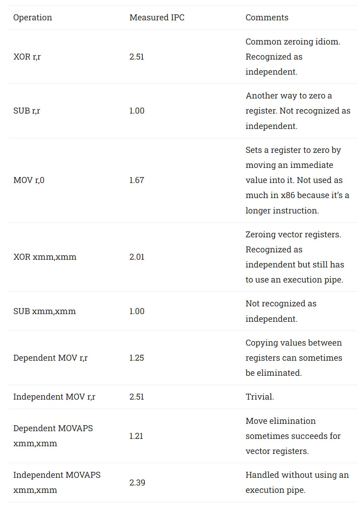

GLP 能识别常见清零 idiom，并在部分 move 上做 elimination，能力有些像 Skylake。一个少见之处是 rename 每周期可处理 4 micro-op，而 decoder 最多给 3 条 instruction。具体原因不明；它可能为 Tremont 铺路，后者同样 4-wide rename，却有足以喂满它的前端。

## PRF、ROB 与乱序窗口

Silvermont 使用 ROB-based register scheme：speculative register file 覆盖整个 ROB，另有 architectural register file 保存已退休结果。好处是寄存器生命周期与 ROB entry 绑定，控制简单；缺点是 retire 时要把值复制到 retired file，增加数据移动。

Goldmont Plus 改用现代 Physical Register File（PRF）：ROB 保存 physical register pointer，PRF 同时容纳 speculative 与 committed value。

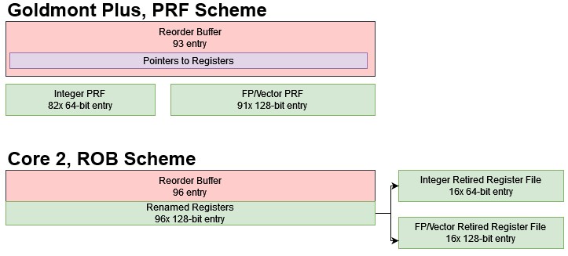

PRF entry 也可能成为 rename 背压来源。实测可用于重命名的 integer PRF 约 66 项、FP/vector PRF 约 75 项。并非每个 ROB entry 都需要目的寄存器，store、jump 等不分配 PRF，因此一般足以覆盖大部分 93 项 ROB。

GLP 的 93-entry ROB 与 Core 2 的重排序能力接近，明显少于 Sandy Bridge 168 项和 Haswell 192 项，却比 Silvermont 32 项大幅提升。

## 分布式调度与执行

GLP 像其他 Atom 一样采用 distributed integer scheduler。常用 ALU 操作总计约有 30 项调度容量，相比 Silvermont 大幅增加；branch 使用独立 port 与 8 项 scheduler，既减轻 ALU 队列压力，也让 branch 不与普通整数操作争抢发射槽，更快发现 misprediction、减少错误路径工作。

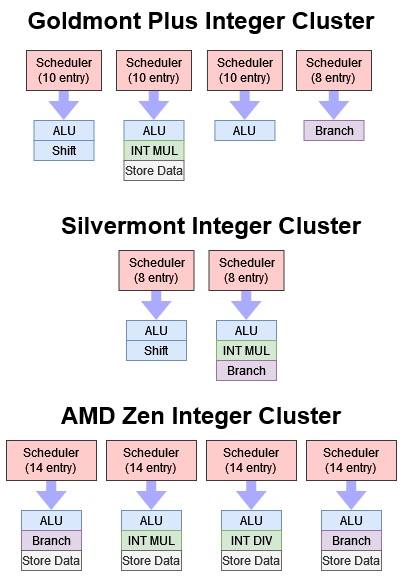

Zen 等高性能 core 有更多整数资源和更大 scheduler，更容易从窗口中找到 instruction-level parallelism。

低功耗 core 通常首先削减浮点/向量。GLP 只有两条 FP pipe，分别偏向 add 与 multiply；vector integer 可走任一 pipe，因为整数向量 ALU 的面积功耗较小。两条 pipe 都是 128 bit，GLP 不支持 AVX。相比 Silvermont，它有更大且 unified 的 FP scheduler，更能吸收长 FP latency。

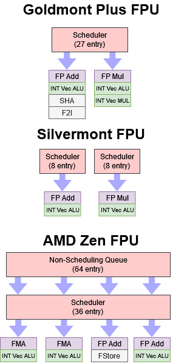

Zen 同样使用 128-bit 执行单元，却分布在四条 pipe，配合更大 scheduler 与 non-scheduling queue，吞吐和隐藏延迟能力明显强于 GLP。

### 体系结构视角：小核不是把大核按比例缩小

GLP 把资源集中在“够用的乱序窗口”和常见整数路径：93 项 ROB、PRF、分布式 scheduler、专用 branch port；把昂贵宽向量、额外 AGU 和更大 cache hierarchy 留掉。队列过小会经常 full，过大又只在罕见长延迟场景有收益。它追求的是每平方毫米和每瓦的平均效率，而非峰值 IPC。

## Load/Store：一条 load AGU、一条 store AGU

两套 address generation unit（AGU）分别专用于 load 与 store。要吃满 L1D 带宽，必须有均衡的 load/store mix；现实程序通常 load 更多，因此不如两套通用 AGU 灵活。不过它仍优于 Silvermont 单 AGU，与老 Core 2 相当。

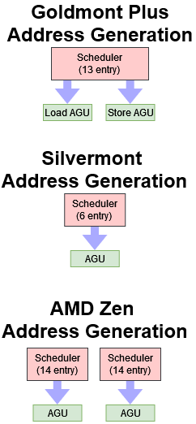

### Store forwarding 与 memory disambiguation

乱序核心必须维持按序语义。register dependency 可由 scheduler 按物理寄存器解决，memory dependency 则要判断巨大地址空间中 load/store 是否重叠，甚至部分重叠。为了省功耗，硬件往往只给常见模式提供 fast path。

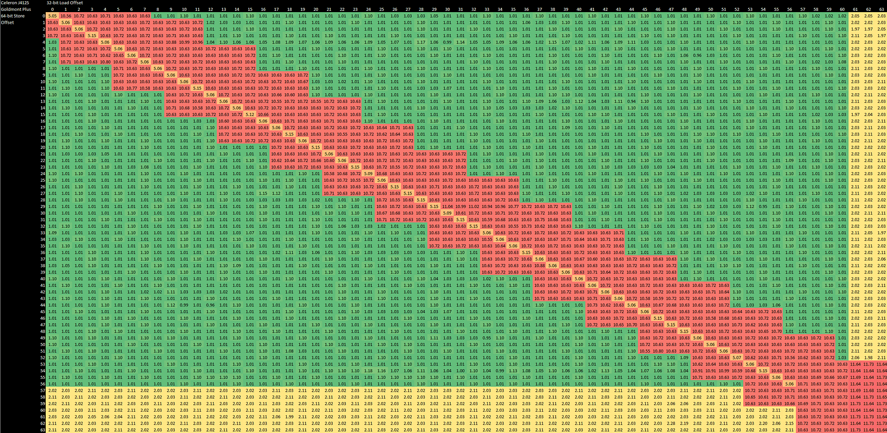

GLP 只有地址与宽度完全匹配时能以约 5 周期快速转发。即使 younger load 完全包含在 store 范围内，其他组合也失败；load 跨 64-byte cache-line boundary 时，连完全匹配也失效。fast path 之外通常多付 10—11 周期。

互不重叠但距离很近的访问也可能误判依赖。锯齿边界像是硬件用“store address + width”判断，却没有比较最低两位地址；这是由图形推断。Sandy Bridge、Haswell、Skylake 也有相似初筛，但能更快识别 false dependency 并恢复。

Skylake 可把 store 数据转发给包含在其范围内的 load，跨 64 B boundary 也少有惩罚。其 L1D 带宽还能同周期处理两条 load 与一条 store，所以 split load 代价低。

### 地址翻译

TLB 缓存 virtual-to-physical translation，避免每次访存都 page walk。

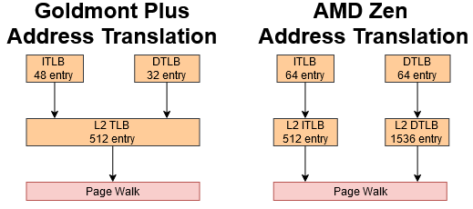

GLP 一级 dTLB 32 项，用 4 KB page 覆盖 128 KB；共享的 512 项 L2 TLB 同时服务 instruction/data，这是相对 Goldmont 只覆盖 data 的改进，但容量仍远少于高性能 core。Zen 的一级 TLB 更大，L2 覆盖也高出数倍。

instruction-side TLB latency 未测；data-side 命中 L2 TLB 会额外增加约 8 周期，与 Skylake 9 周期、Zen 2 约 7 周期相近。但 GLP 频率低，同样的周期惩罚换算成纳秒更严重。

## 两级缓存与高 DRAM 延迟

GLP 使用两级 cache hierarchy，共享 L2 同时作为 LLC，类似 Cortex-A72 cluster 和 Core 2。数据侧从 24 KB L1D 开始，小于 Intel/AMD 大核常见的 32 KB。

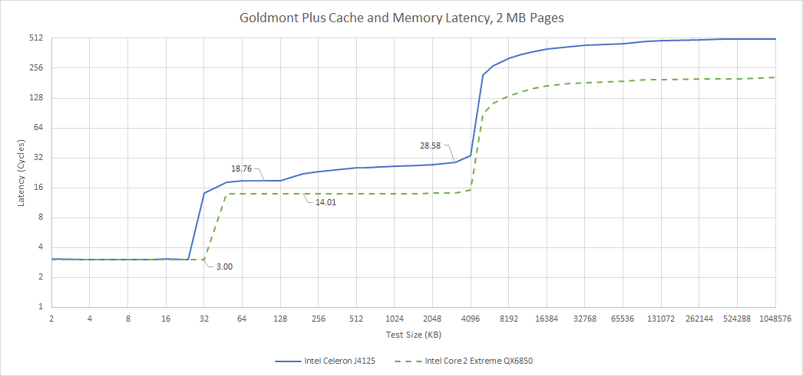

4 MB shared L2 命中约 19 周期，对 multi-megabyte cache 不算差，略快于类似配置的 A72，也优于 Skylake L3 的实际纳秒延迟；不过 Skylake 有快速中间 L2，把 core 与 LLC latency 隔离。

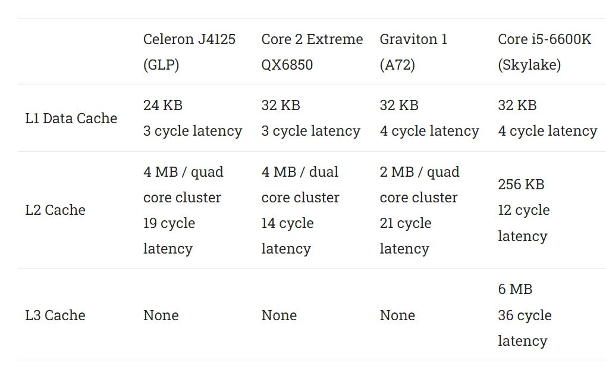

Core 2 同样是两级 cache 的高性能设计，其 L2 既足够大可作 LLC，又足够快可直接承接 L1 miss。

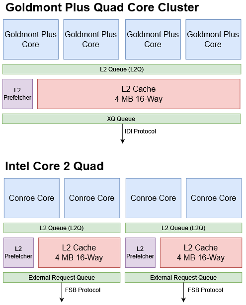

Core 2 靠减少每片共享核心数换低延迟，代价是两片合计 8 MB，但单核最多只能用其中 4 MB，也会重复缓存共享数据。GLP 单块 4 MB 更省面积，单核仍可使用全部 4 MB。

Celeron J4125 在 1 GB footprint 下 DRAM latency 超过 180 ns；老式 FSB 的 Core 2 反而只有 68.86 ns。与 Meteor Lake 不同，给另一核心施加 bandwidth load 并不会明显改变 GLP latency，因此不能用 memory controller 未退出低功耗状态解释。

## 带宽与疑似 write-through L1D

J4125 有四核，却没有 SMT，只有轻量 128-bit vector、较小乱序 buffer 和低频，因此远没有 Core i7-7700K 那样的带宽需求。

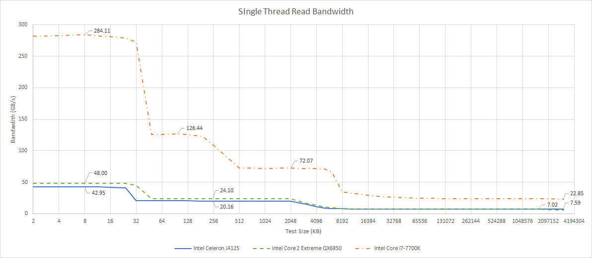

表现接近十年前的 Core 2，远落后 Skylake。Skylake 可在更高频率下每周期两条 32-byte load，单核从 L3 获得的带宽甚至可高于 GLP 从 L1D 获得的带宽。

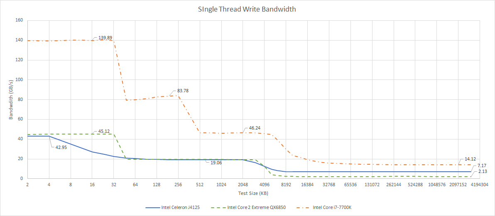

write 方向 Skylake 优势小些，因为它只有一个 data-cache write port，但高频与 256-bit vector 仍然很强。GLP 再次像 Core 2，但单核 DRAM 写带宽低得多。

4 KB 后的骤降让人想到 Bulldozer/Piledriver 的 write-through L1D + 4 KB write-coalescing cache。performance counter 也支持这一点：写入超过 4 KB 的 array 后，4 MB LLC 出现 write access。

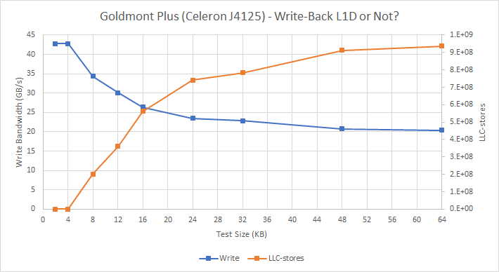

GLP 可能有约 4 KB write-back storage 缓冲写流量，因此不像 Pentium 4 的纯 write-through L1D 那样糟；但它仍会给 L2 增加额外 write traffic，而 24 KB L1D 已因容量小产生更多 read miss。具体结构是计数器推断，不是 Intel 公布实现。

好的一面是 L2 总带宽扩展不错，接近拥有两块独立 L2 的 Core 2 Quad，也远高于不足 37 GB/s 的 Cortex-A72；但仍不及 Skylake 由 ring 与分布式 controller 支撑的 L3。

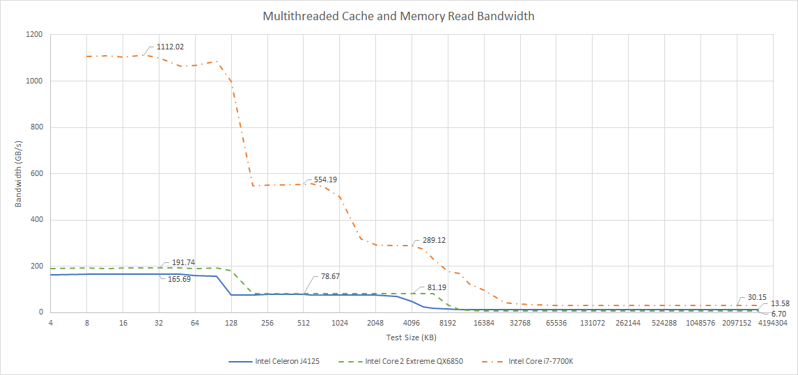

J4125 与 i7-7700K 都应为双通道 DDR4-2400，前者 read bandwidth 仅后者约一半，但仍显著高于 FSB 时代 Core 2，体现 integrated memory controller 的代际收益。

## 核间锁竞争

locked compare-and-exchange 在两核间反复转移 cache line，可观察 ownership transfer latency。J4125 四核同 cluster，任意核对延迟一致，却整体很高；Skylake 更快。

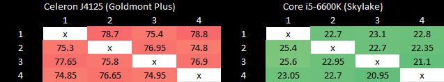

这不太像 interconnect bandwidth 问题，因为共享 L2 latency 与 Skylake L3 接近；更可能是 Skylake 对 contended lock 和 cache-line ownership transfer 做了更强优化。没有额外计数器或 RTL，无法确定具体环节。

## 结语：平衡得不错，却卡在市场与工艺之间

GLP 的 register file、queue 和 scheduler 已足够让乱序执行发挥作用，明显强于 Silvermont；相对 A72 也有更好的 L2 与 branch prediction。它没有像大核那样追逐宽向量和巨型窗口的边际收益，许多取舍对低功耗设计合理。

弱点同样集中：DRAM 性能差，24 KB L1D 太小且需要真正 full write-back；一条 load AGU 限制常见访存组合；缺少把 256-bit AVX 拆成两个 128-bit half 的能力；BTB 路径慢。Tremont 随后修补了不少问题。

最大矛盾仍是定位。更大 buffer/scheduler 让全核功耗轻易超过 13 W，在无风扇 tablet/phone 中会严重 throttle；只要加一个小风扇，2C/4T Skylake ULV 又能给出更强单线程。GLP 比早期 Atom 平衡，却处在无法主导任何一端的空档。

它也预示后来的路线：四核 cluster 延续到后续 Atom；cluster 通过 IDI protocol 与系统相连，已经能以 ring/mesh agent 的同一种“语言”接入 Intel 平台。但 14 nm 还不足以让这套平衡乱序核在极低功耗闪光，Intel 也尚未准备把 Atom 真正带进 hybrid client。
