# Intel Gracemont：Atom 小核的复仇

> **文章来源**
>
> - 文章：*Gracemont: Revenge of the Atom Cores*
> - 撰文：Chester Lam
> - 首发：Chips and Cheese
> - 发布：2021 年 12 月 21 日
> - 链接：https://chipsandcheese.com/p/gracemont-revenge-of-the-atom-cores

这篇可以看作 Golden Cove 分析的下篇：Alder Lake 中另一种核心 Gracemont，甚至比大核更有意思，因为它已经不能按传统意义叫“小核”。

Gracemont 是五宽乱序架构，近祖是 2013 年 Silvermont，更早可追溯到顺序执行 Atom。相比从 Sandy Bridge、乃至 P6 稳步演化而来的 Core 大核，Atom 谱系更年轻，每代变化也更剧烈。

## Atom 变宽、变深，也变成高性能核心

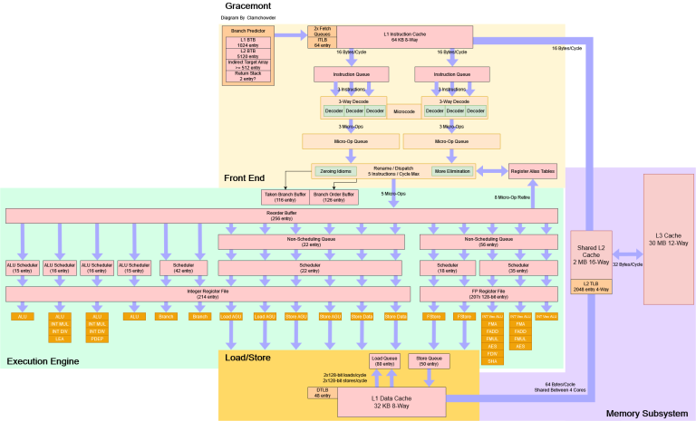

*图 1：双三宽 Decoder、五宽 Rename、256 项 ROB、214 项整数/Flags 与 207 项 128-bit FP/Vector 寄存器、80/50 项 Load/Store Queue、64 KB L1I、32 KB L1D 和四核共享 2 MB L2。ALU Scheduler 布局存在较大不确定性。*

早期 Atom 的窄前端、小窗口和脆弱吞吐在这里几乎消失。Gracemont 的目标不是和 Golden Cove 做相同事情，而是以更小面积、更低功耗提供足够高的单线程性能和很强的多核吞吐。

## 分支预测：名副其实的 Core Class

Gracemont 有数百条在途指令，误预测会清掉大量工作。更准的预测器既提高性能，也减少错误路径能耗。Intel Architecture Day 2021 称其有“深历史、大结构”和 5K 项 Branch Target Cache（BTB）；Tremont 已宣传 Core Class Branch Prediction，Gracemont 继续扩大。

### 方向预测

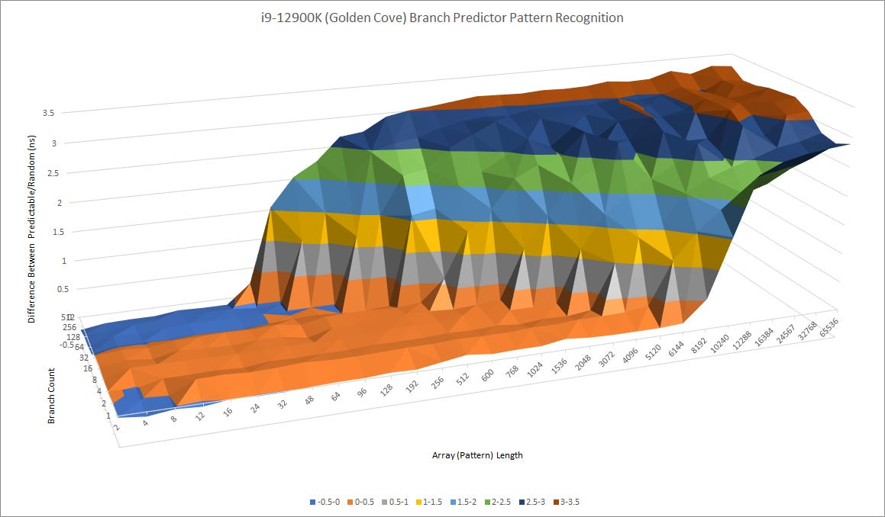

*图 2：Pattern Length 超过约 1K 后，每分支时间温和上升，支持存在较慢 Override Predictor。低延迟区域已超过 Skylake。*

*图 3：Golden Cove 为追求峰值性能，把复杂预测结果也尽量做快；Gracemont 在速度与功耗间更平衡。*

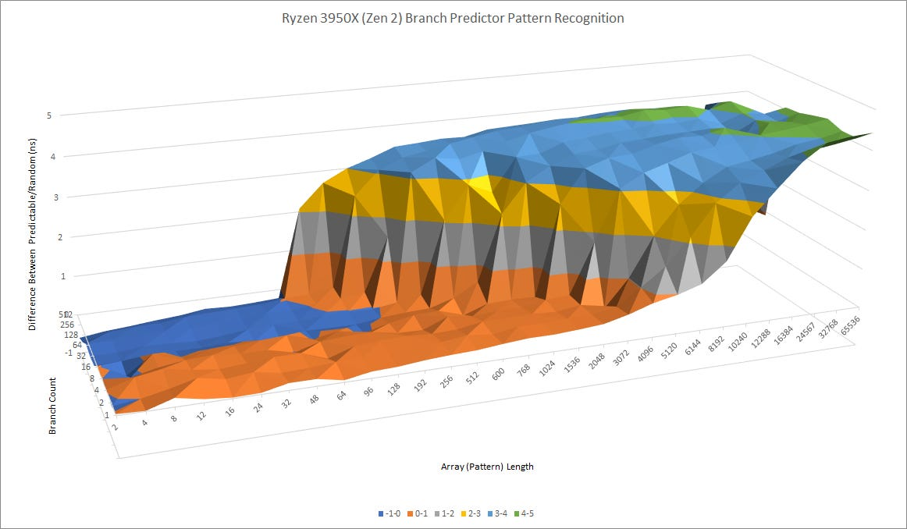

*图 4：两者可追踪相近长历史；Gracemont 一级预测器更强，长历史时较少等待二级覆盖。*

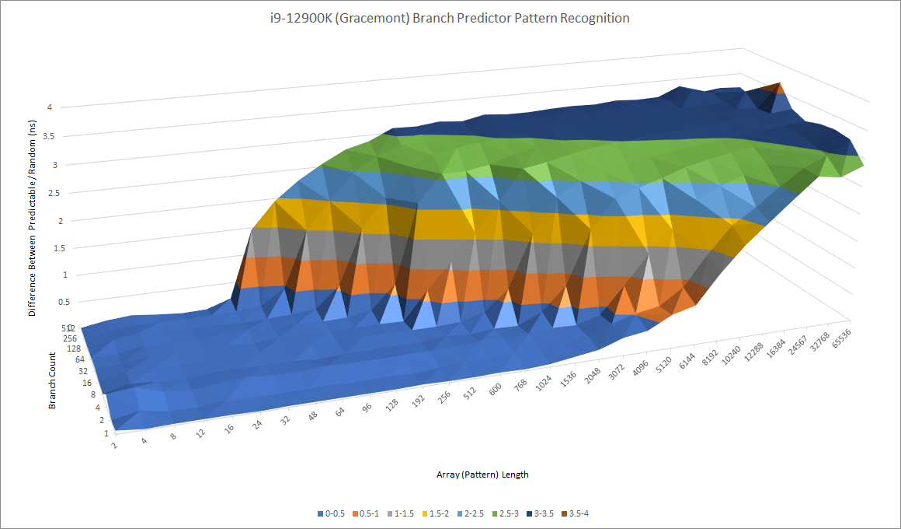

*图 5：静态分支继续增加后，Zen 2 有效容量占优。历史深度与能容纳多少分支是两个独立维度。*

Cortex-A78 是合适的移动参照：它在高端 SoC 中承担兼顾性能与功耗的中核位置，与 Alder Lake 中 Gracemont 的角色相似。

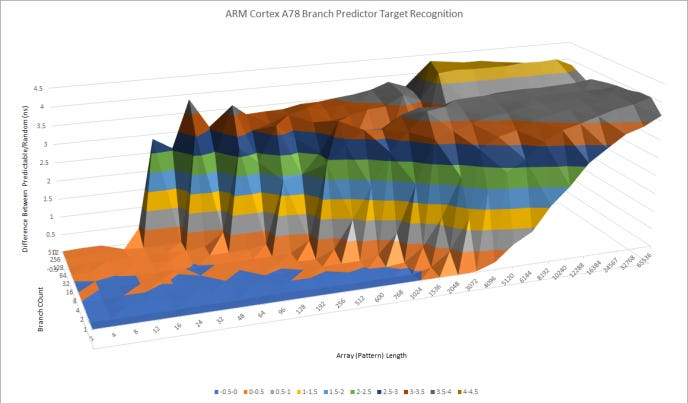

*图 6：A78 使用非 Override 路线，也能覆盖较长历史，但上限低于 Gracemont。*

*图 7：Realme GT 上的 A78 在静态分支达到 512 时明显吃力；平台与 ISA 不同，曲面只比较预测行为。*

### BTB：5K 不小，1024 项可零气泡

Golden Cove 的 12K BTB 极端庞大；Gracemont 的 5K 与 Sunny Cove、Zen 3 相近，也大于 Skylake 及以前约 4K。容量之外，更关键的是速度。

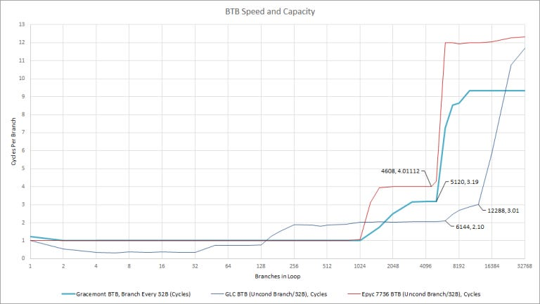

*图 8：Gracemont 与 Zen 3 都能在约 1024 个分支内零气泡预测；Gracemont 二级 BTB 增加约两周期，Zen 3 约三周期。*

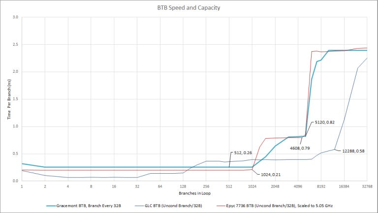

*图 9：Zen 3/Golden Cove 以高频追求绝对性能；难以在高频下一拍完成的 L2 BTB，Zen 3 选择多一级流水。Gracemont 低于 4 GHz，可用更少级数取得相近实际时间；Golden Cove 在 5 GHz 以上仍让 L3 BTB 约三周期。*

### 实际准确率

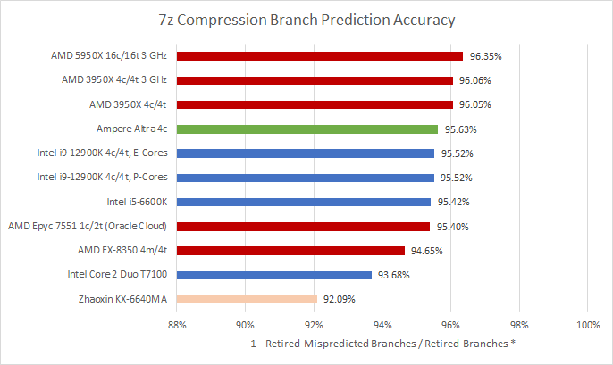

*图 10：压缩中 Intel 核心相对 AMD 表现不占优，Gracemont 没有因为大结构自动获胜。*

*图 11：编码负载同样显示工作负载相关性；准确率与 MPKI 还受每千指令分支数量影响。*

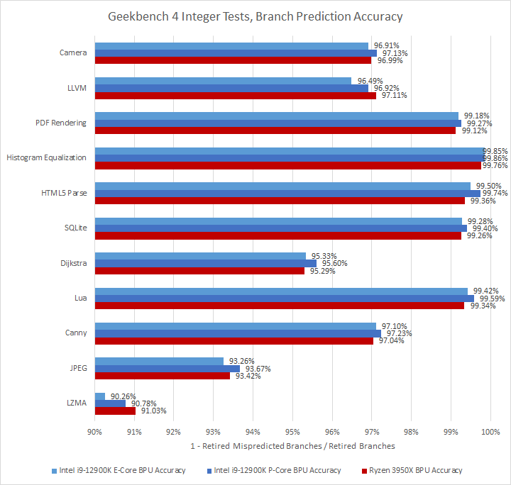

*图 12：部分子项 Gracemont 可胜 Zen 2，整体落在高性能大核同一量级。*

### 体系结构视角：低频给预测关键路径留下另一种选择

高频大核常把大 BTB 切成更多流水级，以守住时钟；能效核频率较低，可在一拍内做更多工作，用更少级数降低分支气泡。周期更少与纳秒更短并不总一致。

验证必须同时报告 Branch Footprint、MPKI、各级 BTB hit/override、重定向周期与实际频率。只看 5K/12K 条目，无法判断前端真实供给。

## 双 Decode Cluster：Tremont 的短板被补上

Gracemont 不用 micro-op Cache，而用两组三宽 Decoder，每组从 L1I 获得 16 B/cycle。

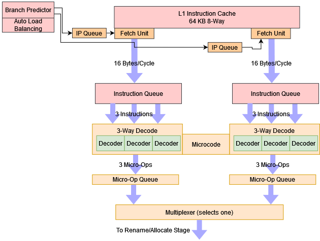

*图 13：两组 Fetch/Instruction Queue/三宽 Decoder 最终经 Multiplexer 汇合；名义取指 32 B/cycle、译码六条，后接五宽 Rename。*

Tremont 只能在 Taken Branch 边界切换 Cluster，巨大展开循环可能一直卡在一边。Gracemont 可自动切换，即使长循环也不掉吞吐。

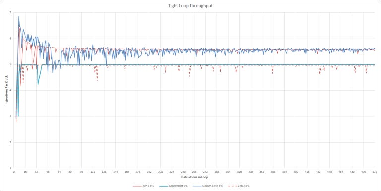

*图 14：随 Loop Length 扩大，Gracemont 没有 Tremont 在约 128～160 条无 Taken 分支后退化为三宽的现象。*

对程序而言，它接近传统六宽 Decoder，接受双向 32 B/cycle；在 Taken Branch 周围，Clustered Decode 还可能比线性 Decoder 少丢吞吐。不过 Rename 一次似乎只能从一组 micro-op Queue 取数据，因此极小循环仍像其他核心一样出现吞吐下降。

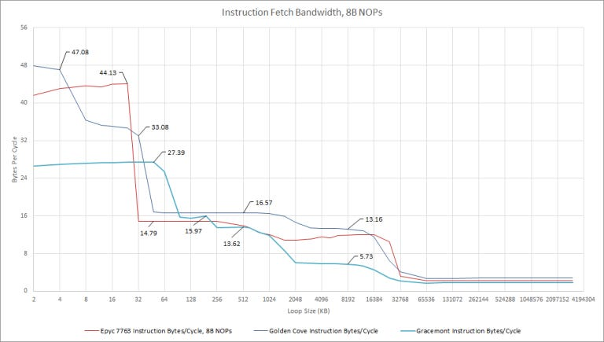

*图 15：L1I 容量内可持续约 32 B/cycle；进入 L2 约 16 B/cycle，进入 L3 后陡降。*

没有 micro-op Cache 对长指令 AVX 代码更不利，不过 Gracemont 的 AVX 吞吐本就不算高。8-byte NOP 更接近极端 AVX 指令长度分布。

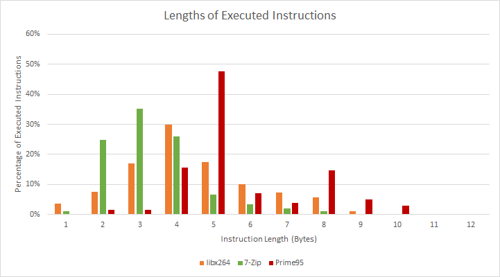

*图 16：Intel SDE 模拟 Haswell 级 ISA（含 AVX2、不含 AVX-512），展示编码负载中长指令占比；8 B NOP 是压力上界，不是平均代码。*

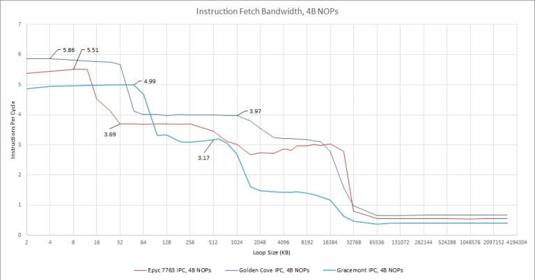

*图 17：常见指令长度下，Gracemont 在整个 64 KB L1I 内稳定 5 IPC；32～64 KB 区间甚至超过只有 32 KB L1I 的 Golden Cove 与 Zen 3。*

64 KB L1I 弥补了更慢 L2、较小 BTB 和较弱指令预取。更多 L1I hit 也减少搬运数据的能耗。

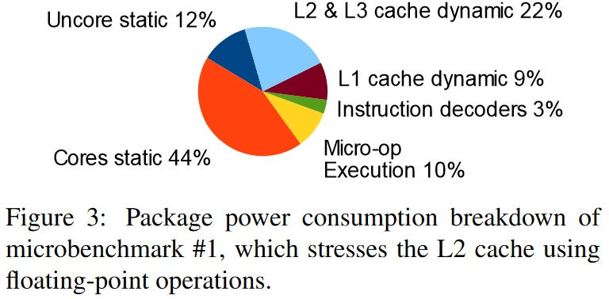

*图 18：Hirki 论文将核心功耗拆解，Instruction Decoder 约 3%、micro-op Cache 约 10%、L1 Cache 动态约 9%、L2/L3 动态约 22%。它说明前端搬运有显著代价，不是 Alder Lake 实测分解。*

文章因此希望大核也恢复更大 L1I，并质疑 AMD 从 Zen 1 的 64 KB 缩到 Zen 2 的 32 KB。高性能同样需要受功耗约束，减少下级 Fetch 是直接的能效手段。

### 体系结构视角：micro-op Cache 与大 L1I 是两种前端投资

micro-op Cache 绕过变长译码，适合热点循环和长 x86 指令；大 L1I 提高代码覆盖，仍需 Decoder 每次工作。Gracemont 用 Clustered Decode 摊薄译码成本，再把面积投向 64 KB L1I。

判断何者有效，应按代码足迹、平均指令长度、micro-op 融合、L1I miss 和 Decode Active 分桶。单一 NOP Loop 只能测一条供给上限。

## Rename：Atom 第一次拥有强大的零成本 MOV

现代 Rename 除了分配 ROB/物理寄存器，还能直接完成部分指令。MOV Elimination 只需让两个架构寄存器指向同一物理寄存器，既不占 ALU，也不进 Scheduler，表现为零延迟。

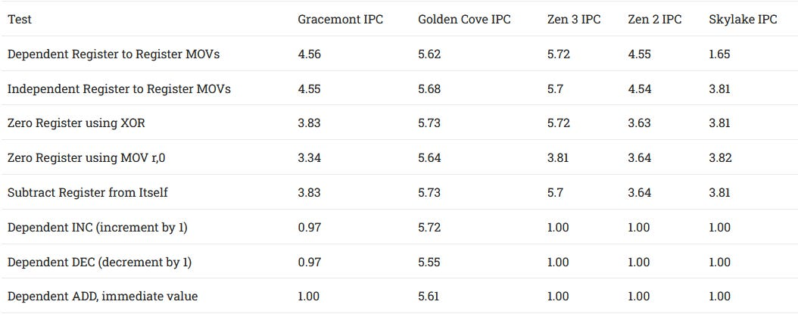

*图 19：Gracemont 的 MOV Elimination 接近 Zen 2，显著强于旧 Atom 与 Haswell/Skylake；XOR 清零可打断依赖，却仍占 ALU，吞吐约 4/cycle。*

Golden Cove 能消除更多 Idiom；Gracemont 不及它，却已大幅超越 Goldmont——Agner Fog 记录后者每周期最多消除一条 MOV，而且经常失败。

## 256 项 ROB：Atom 的乱序资源接近 Zen 3

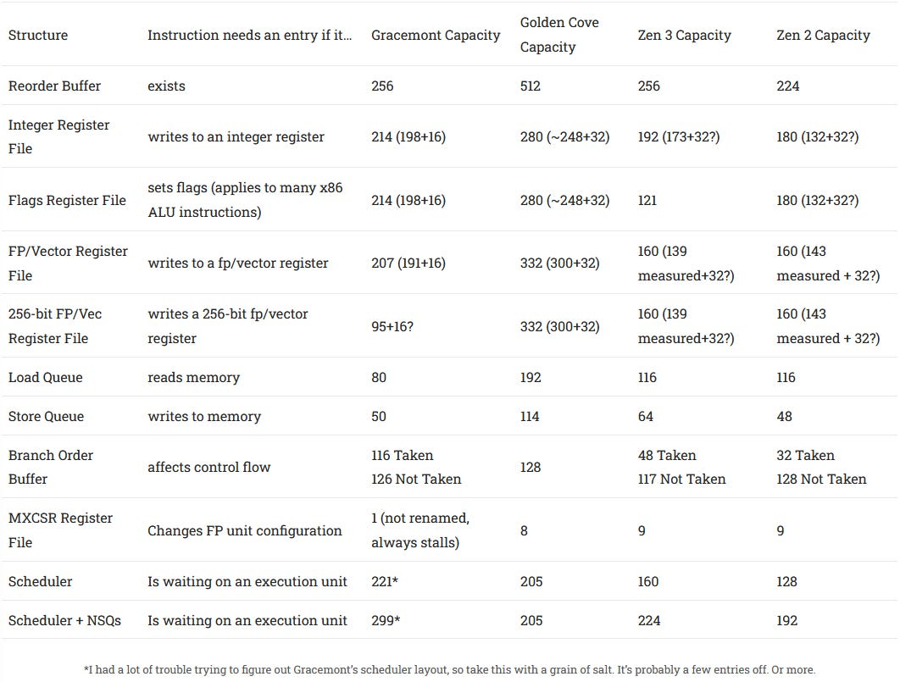

*图 20：Gracemont ROB 256、整数/Flags RF 各 214、FP/Vector RF 207，256-bit FP 写入可见容量约 95+16，Load/Store Queue 80/50，Taken/Not-Taken Branch Order Buffer 116/126。Scheduler 221、含 NSQ 299 带星号，布局不确定且可能偏差多项。*

除少数例外，Gracemont 的 ILP 资源接近 Zen 2/3。Atom DNA 仍在：MXCSR 不重命名，任何写入都会让乱序执行停住；256-bit 指令像 Zen 1 一样拆成两条 128-bit micro-op，物理向量寄存器也只有 128 bit。

207 项 128-bit Vector RF 约 3.3 KB，Golden Cove 至少 10 KB，Zen 2/3 约 5 KB。Gracemont 用更小阵列保持大量标量 FP/128-bit 重命名容量。

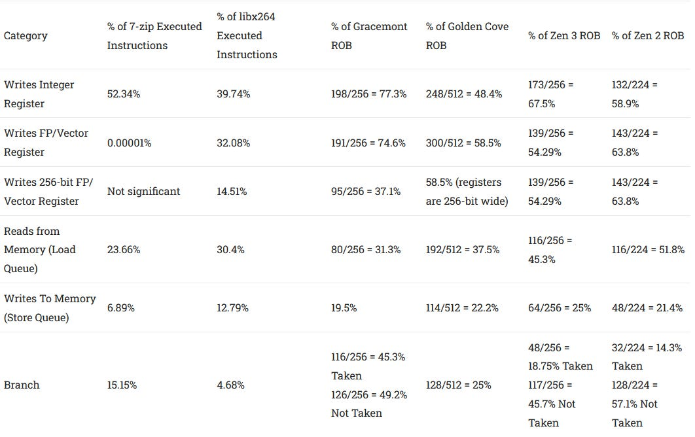

*图 21：混有 256-bit 写入时，libx264 平均每 100 条指令消耗约 47 个 Gracemont 向量寄存器，余量仍大；Y-Cruncher 这类超过 70% 指令写 256-bit 结果的极端负载才会明显施压。*

整数侧约 77% 在途指令可写整数寄存器，比例优于不少近期大核；分支重排序更夸张，几乎一半指令流可为 Taken Branch。相对短板是 80/50 项 Load/Store Queue，突发访存尤其在 L1/L2 miss 时可能先满。

### 体系结构视角：拆成两条 128-bit micro-op 是面积换吞吐

256-bit 指令在 ISA 上是一条，进入后端却占两份 Scheduler、两份 128-bit RF Slice 和多个执行周期。这样避免宽物理寄存器与宽旁路，提升密度；代价是 AVX 代码更快消耗 Queue 和 Rename 资源。

验证要同时按“退休指令”和“后端 micro-op”归一，观察 Vector RF Full、FP Scheduler/NSQ Occupancy 与端口利用率。只按 ISA 指令数看 IPC，会低估拆分压力。

## 调度与执行：分布式队列，却有大核级吞吐

### 整数侧

P6/Core 大核从 1995 年起偏好多端口统一 Scheduler；Atom、AMD 和很多 Arm 核使用分布式队列。后者选择逻辑只搜索本端口附近指令，更快、更省面积功耗，却会产生队列碎片。

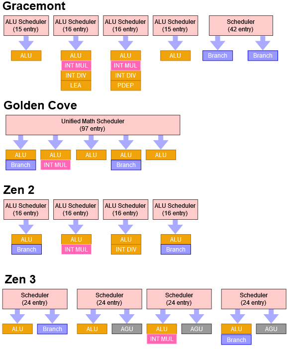

*图 22：明确不是统一结构，但各 ALU 队列与端口映射无法完全确定；附录给出混合指令实验。分支调度容量很大，因为 ALU+Branch 端口通常压力最高。*

四条 ALU 足够一般程序，但特殊操作端口较少：Base+Scaled Offset 的 LEA 只能走一条，Skylake 有两条。Gracemont 有两条整数乘法器，代价是 5-cycle 延迟，高于 Golden Cove/Zen 3 的 3 周期。

### FP/Vector 侧

FP 使用半统一结构：一组 Triple-Port Queue 处理数学操作，一组 Dual-Port Queue 处理 Vector Store，不是 Golden Cove 那种五端口 97 项统一大队列。

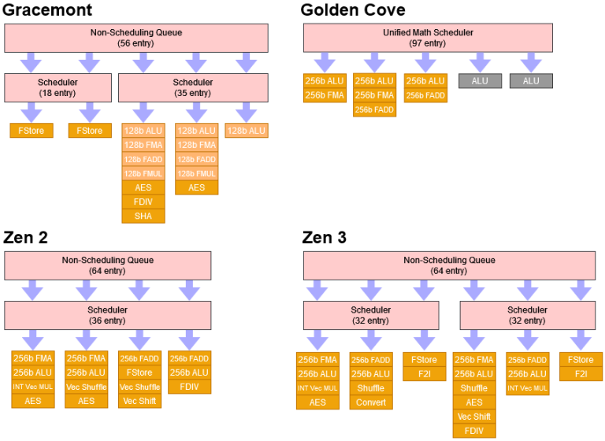

*图 23：较小 Scheduler 前放大 NSQ，可在 Rename 停顿前保留约 91 条 FP/Vector 操作。256-bit AVX 每条拆两 micro-op，也会占两个 Scheduler Slot。*

常用操作至少有两条 128-bit 端口，因此 256-bit 指令一般无额外依赖延迟，吞吐至少 1/cycle。

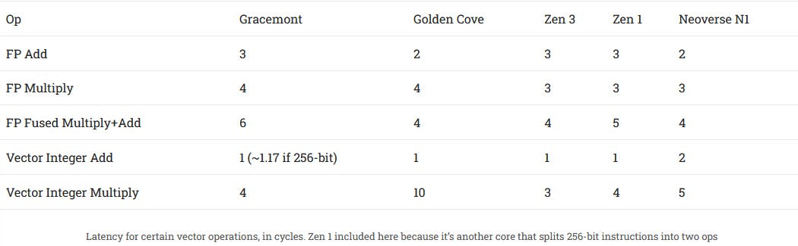

*图 24：Gracemont FP Add/Multiply/FMA 为 3/4/6 周期；Vector INT Add 1 周期（256-bit 约 1.17），Multiply 4 周期。FMA 不及近期大核，但 Vector Integer Multiply 反而避开 Intel 大核的 10-cycle 高延迟。*

整体看，它是 x86 中很强的 128-bit FP/Vector 单元，AVX 表现可用但不顶尖。

### AGU 与 L1D

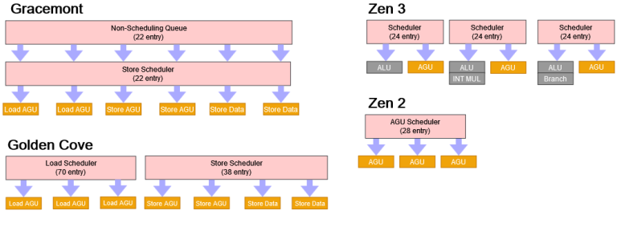

*图 25：Gracemont 可每周期两 Load、两 Store；与 Sunny Cove 数量相当，但 256-bit 访问在 Gracemont 计作两次。图中采用修订后的 Load/Store 共享 Scheduler 方向。*

两 Store/cycle 依赖写入同一 64 B Cache Line 的合并；若连续 Store 分散到不同 Line，即使标量 64-bit 也只有一条/cycle。Store Scheduler 前另有 NSQ；计入后约 84 条访存可等待地址生成，超过 Zen 3，单算可调度容量也约 62 条。

### 体系结构视角：端口吞吐受“地址”和“数据”两条路径约束

Store 要先算地址，再准备数据并提交到 Cache。两个 Store AGU 不保证每周期写两条不同 Cache Line；合并器、Store Data Port 与 Cache Bank 都可能限速。

应分别测试同 Line、不同 Line、连续/随机地址，并看 Store Address/Data 发射、合并命中、L1D Bank Conflict 和 Store Buffer Occupancy。标称端口数只是可行路径数量。

## Atom 第一次接上桌面 L3

大核从 Nehalem 起用小而快私有 L2 缓冲 L1 与大 L3；Atom 传统上四核共享较大 L2，并以它作为末级。Gracemont 保留四核共享 2 MB、17-cycle L2，在 Alder Lake 桌面又接入共享 L3。

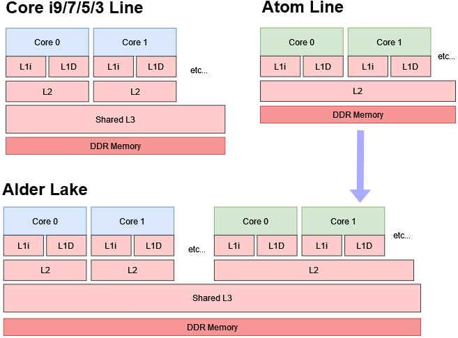

*图 26：每四颗 Gracemont 共用一个 Ring Stop 和 L2，概念上就是“Atom Cluster + 桌面 L3”；大核则每核有私有 L2 和独立 Ring Stop。*

### 延迟

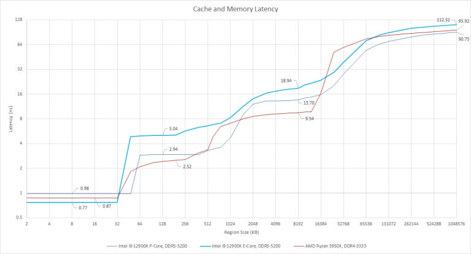

*图 27：Gracemont 3-cycle L1D 即使频率低，也比 Golden Cove 5-cycle 更快返回；大多数数据访问命中 L1，这不到四分之一纳秒的优势有实际价值。*

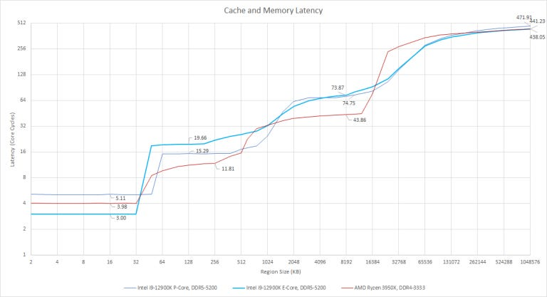

*图 28：2 MB 内共享 L2 以容量换速度；进入 L3 后承受与 Golden Cove 相同的高延迟，换算周期数也接近。*

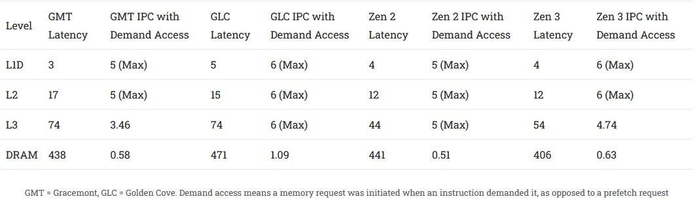

*图 29：Gracemont L1/L2 可维持最大 5 IPC，74-cycle L3 下理想值约 3.46 IPC，438-cycle DRAM 约 0.58；Golden Cove L3 仍可 6 IPC，DRAM 约 1.09。Zen 2/3 数据同时列出。计算是假定 ROB 项均能用于隐藏串行延迟的上界。*

因此 Gracemont 无法靠 256 项 ROB 完全覆盖 L3，命中 2 MB L2 对性能非常关键。

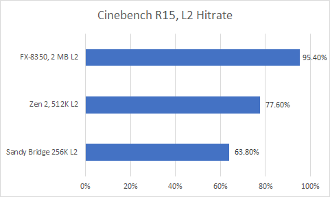

*图 30：i7-1165G7 约 91.69%、Zen 2 R5 3600 约 77.89%、Sandy Bridge 约 63.80%，说明较大/有效 L2 可显著减少慢层访问；这不是三者 IPC 的单变量解释。*

### TLB

数据侧 L1 TLB 为 48 项全相联；L2 TLB 2048 项、四路组相联。L1 略小，L2 容量已匹配大核，只是相联度更低。

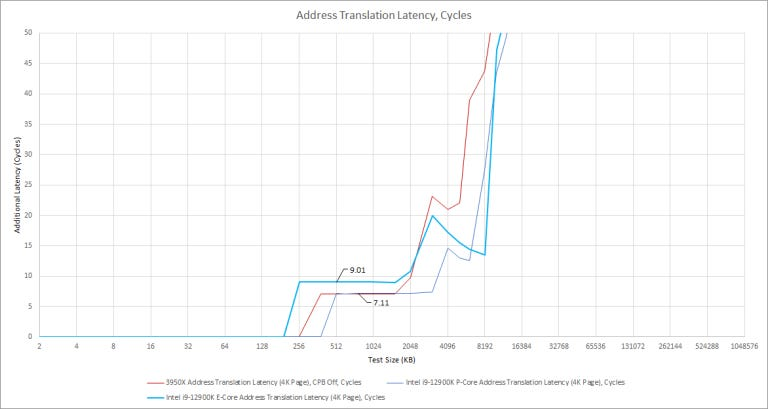

*图 31：Gracemont L2 TLB 比 Golden Cove、Zen 2 多约两周期，可能以较慢流水和较少 Tag 比较换能效。L2 miss 的 Page Walk 可能再产生四次访存；若沿用 Sunny Cove 更大地址空间，可能五次。*

相比小而快 L2 TLB，2048 项慢一些的结构更能避免 Page Walk，通常也更省整体能耗。

### 带宽

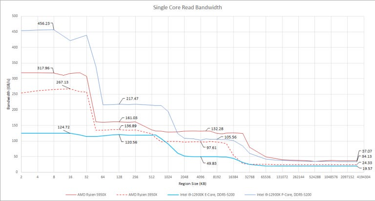

*图 32：高频、256-bit 大核在 L1/L3 占优；Gracemont 的 64 B/cycle L2 接口可把多数带宽动态给单核。DDR4 反而高于 DDR5，支持高 DDR5 延迟和保守预取限制单核并发。*

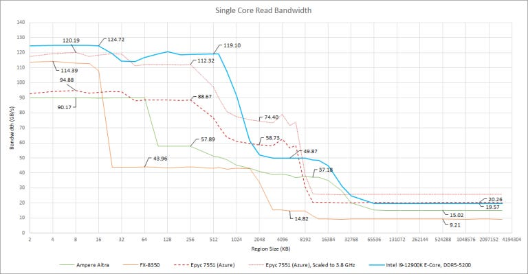

*图 33：Gracemont L2 几乎追平 L1，接近 Zen 1 的相对表现；L3 带宽仍明显较低。*

单核带宽适合分析结构，却未必代表吞吐应用；高度向量化负载通常也会多线程。

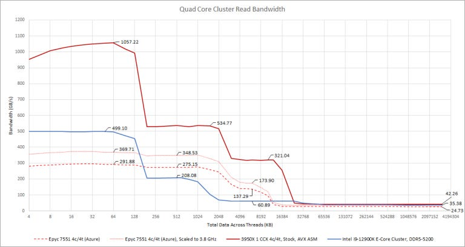

*图 34：四核同时访问后，共享 L2 接口使每核约低于 16 B/cycle，Zen 1 凭每核私有 L2 胜出；L3 扩展也较差。*

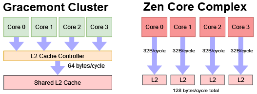

*图 35：两者都有 2 MB L2 总容量；Gracemont 四核共享，代码/常量无需复制，面积利用率高但带宽不随核数线性扩张；Zen 每核 512 KB，合计接口更宽。*

这是合理取舍，除非大量 AVX 操作又频繁 L1D miss，Gracemont L2 带宽通常够用。L3 扩展差不太像单纯 Ring Stop 限制，因为单 Golden Cove 可从 L3 拉约 100 GB/s；更可能是 E-Core 活跃时 Ring 降频，加上节能预取。

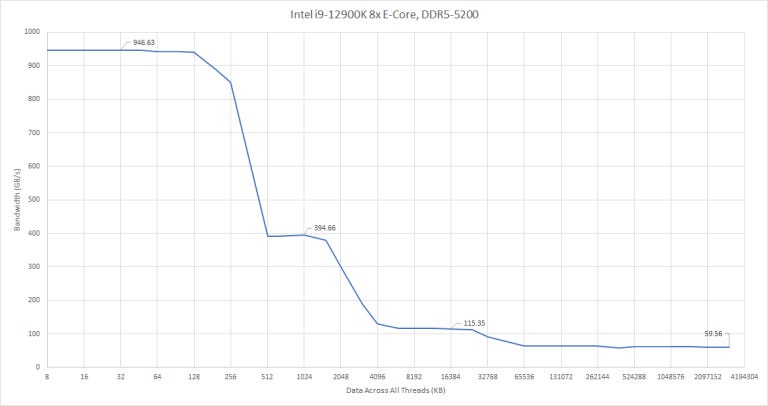

*图 36：八核终于展现 DDR5 优势；L1 总带宽接近四颗 Zen 2，L2 尚可但不突出，L3 仍可能成为中等向量吞吐的瓶颈。*

### 体系结构视角：共享 Cache 的面积收益来自“不复制”

四个私有 512 KB L2 会重复存代码与只读常量；共享 2 MB 可把容量留给更多唯一 Line。代价是所有核心竞争同一 Tag/Data Array、Controller 和下行端口。

评估需同时看有效容量与总带宽：多线程 Hitrate 变好但 B/cycle 封顶，说明共享节省容量却牺牲吞吐；若 Hitrate 也下降，才是容量和带宽一起不足。

## Gracemont 与 Golden Cove：目标不同，不是“大核+小核”套话

Intel 称 Golden Cove 为 Performance x86 Core，Gracemont 为 Efficient x86 Core。媒体常类比手机 big.LITTLE，但 Gracemont 不像 Cortex-A55 这种小顺序核：它宽、窗口深，频率也接近几年前桌面核；只是有意识牺牲峰值来换每瓦与每平方毫米性能。

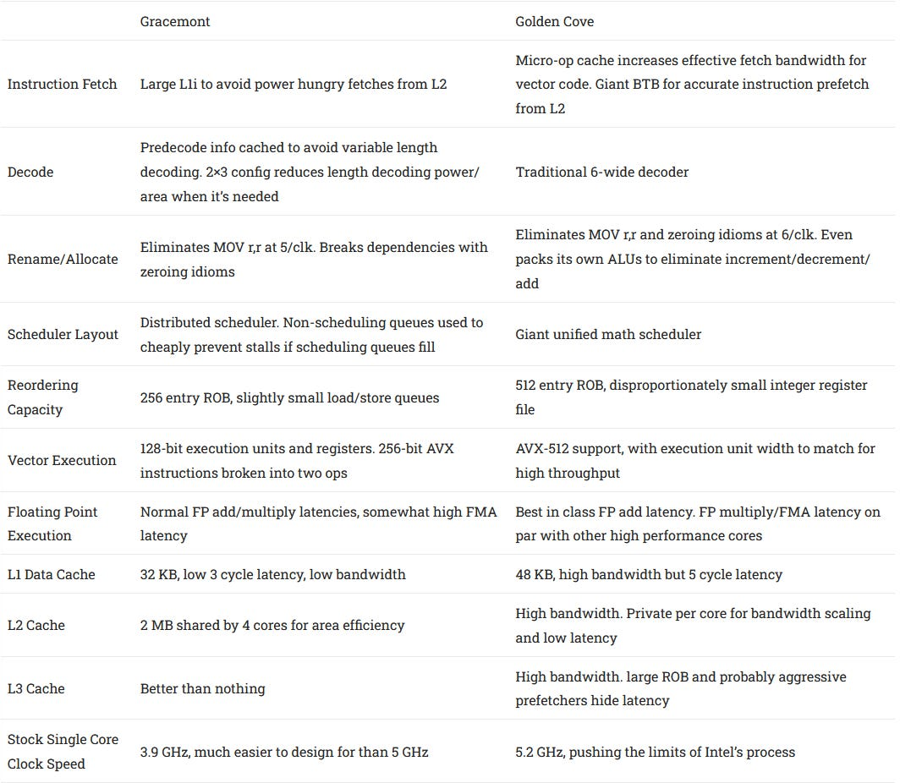

*图 37：Gracemont 用大 L1I、2×3 Decode、五宽 MOV Elimination、分布式 Scheduler+NSQ、256 ROB、128-bit 数据路、3-cycle L1D 与共享 2 MB L2；Golden Cove 用 micro-op Cache/大 BTB、传统六宽 Decode、更强 Rename、512 ROB、AVX-512、5-cycle 高带宽 L1D 和私有 L2。单核标称频率约 3.9 对 5.2 GHz。*

### 功耗实测

测试在 4K libx264 编码的第 90～120 帧读取 RAPL Core/Package Power，用 affinity 控制核心类型与数量。它是特定编码片段，不是全应用平均或外接功耗。

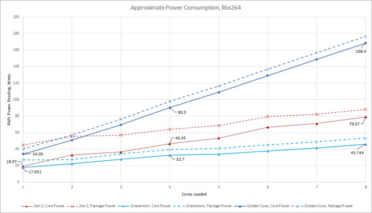

*图 38：单颗 Gracemont 加载时，共享 L2/Ring Stop 让每核摊到的功耗意外偏高；核数增加后分摊改善。八核时 Gracemont 约 5.72 W/core，Golden Cove 约 21.05 W/core。*

整个工作负载 IPC 为 Gracemont 1.72、Zen 2 1.91、Golden Cove 2.25。Golden Cove 更快却付出不成比例的功耗；Gracemont 更慢，但每瓦指令吞吐更高。

### 体系结构视角：共享组件让“单核功耗”不是线性起点

第一个 E-Core 激活时可能同时唤醒 Cluster L2、Ring Stop 和时钟域，后续核心只增加增量功耗。因此用一核功耗乘八会严重高估，用八核总功耗除八又会把共享成本均摊。

应同时报告 Core、Uncore、Package、频率与吞吐，画出 1/2/4/8 核增量曲线。只有性能/W 和完成时间都给出，才能判断适合后台任务还是高响应负载。

## 结论：Gracemont 已经没有传统 Atom 的致命短板

它的强项是均衡乱序资源、优秀分支能力、64 KB L1I、低延迟 L1D 和适中功耗；明显弱点只剩高延迟低带宽 L3，以及低于桌面大核的向量吞吐。其他牺牲大多经过精心选择，不太伤常见整数程序。

十年前 Intel 用单一架构统治笔记本、桌面、服务器与 HPC。到 2021 年，AMD 在单线程、服务器能效与密度上施压，Arm 厂商也靠窄目标优化站稳脚跟。文章用公元 300 年的罗马帝国类比 Intel：资源和工程实力仍强，却必须放弃 One Size Fits All。Core 放开功耗追求单核，Atom 放下手机执念，转向更高性能点与密度。

Alder Lake 中，Gracemont 负责后台和全线程吞吐，也适合平板、无风扇轻薄本；服务器里 N1 已证明密度市场存在，AMD Bergamo 也将以 128 个 Zen 4 密度核竞争。小面积、适中功耗和扎实性能，让 Gracemont 有潜力成为 Intel 进入 Hyperscale 的门票。结尾提供 Patreon/PayPal 支持渠道。

## 附录：如何反推分布式 Scheduler 与 NSQ

### 整数 Scheduler 布局

普通 Add 可见 62 项，但 Scheduler 明显不统一；Multiply 有两端口、可见 32 项；LEA 与 PDEP 各只走一个端口、各见 16 项，混合后为 32，说明分属不同队列。LEA/PDEP 再混 Multiply，从吞吐和容量看似共享端口。

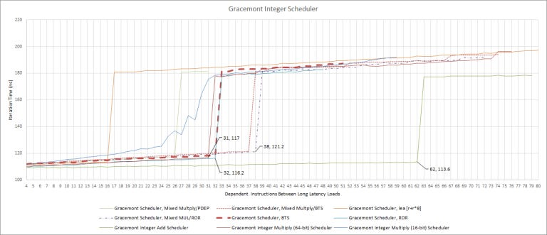

*图 39：ADD、MUL、LEA、PDEP 等曲线用于寻找容量台阶。BTS、ROR 可能在非乘法端口，却无法唯一定位；文章没有找到每个端口都独占的指令。*

Jump 无论 Taken 与否可见约 42 项；Jump+Add 为 63，Jump+Multiply 为 57。

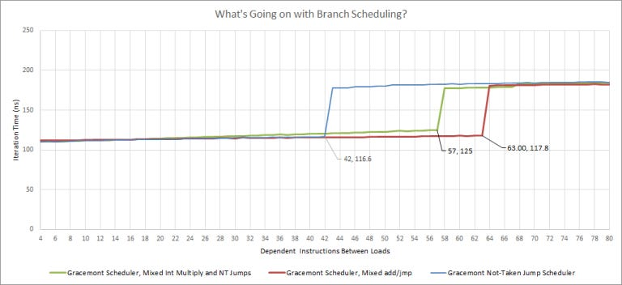

*图 40：不同混合容量证明分布式与部分共享，却仍不足以唯一解出 Queue-to-Port 映射。因此图 1/22 明确保留不确定性。*

### 识别 Non-Scheduling Queue

朴素 Henry Wong 方法把依赖 Pointer-Chasing Load 的 FP Add 放在两次 miss 之间，会看到 91 项，看起来像巨大 Scheduler。Tremont 已暗示 NSQ 存在，因此测试改为固定总指令数，只改变依赖指令的数量与位置。

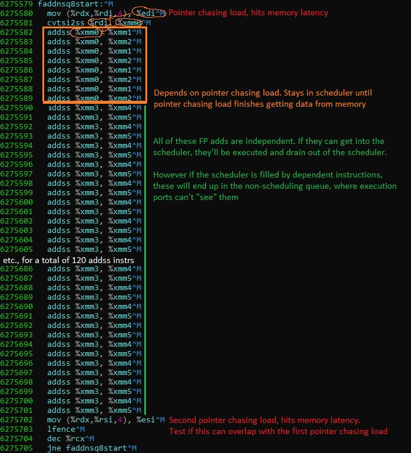

*图 41：独立指令可先离开 Scheduler，为随后依赖指令腾位；台阶取决于真正可 Wakeup/Select 的窗口，而非总在途数量。*

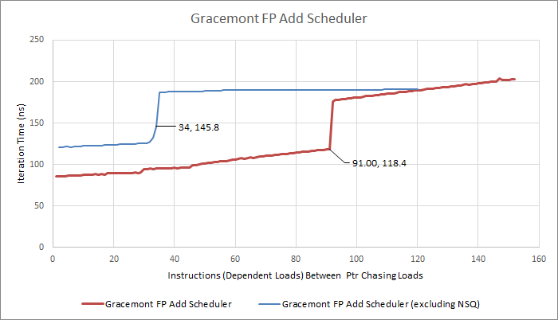

*图 42：基础测试看到约 91 项，新方法把较小 Scheduler 与前方 NSQ 区分开。总指令数必须大于 Scheduler+NSQ（这里大于 91），又小于等待退休上限（这里小于 191）。*

### 12 月 23 日修订：Load/Store 并非独立 Scheduler

最初用长延迟 Load 夹依赖 Load，看到约 40 项且没有 NSQ，似乎 Load Scheduler 与 Store 分离。

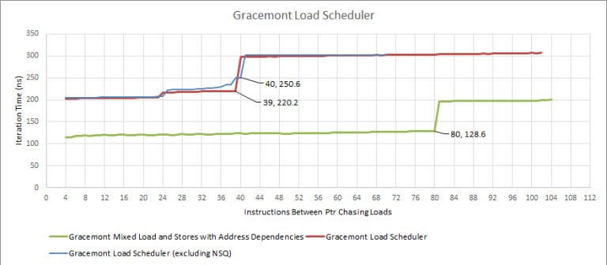

*图 43：依赖 Load 构造下的台阶支持约 40 项，但测量路径可能先撞上其他 Load 相关资源。*

改用链式整数除法阻塞退休后，同类容量测试表明 Load 与 Store Port 共享 Scheduler。

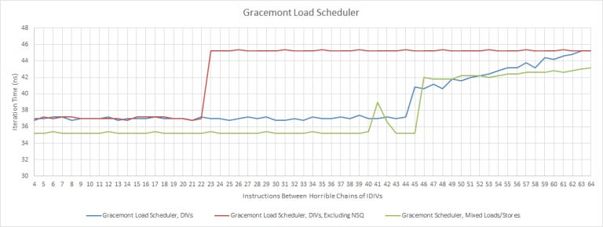

*图 44：不同 Retirement Blocker 得到不同结构解释；正文和图 1/25 采用后续共享队列结论，但两种方法为何在 Gracemont 上分歧仍未解决。*

### 体系结构视角：反推结果必须经受“换阻塞器”检验

结构容量测试假设只有目标资源先满。若 Pointer-Chasing Load 同时占 Load Queue、MSHR、Scheduler 和退休窗口，拐点可能属于任何一个。换成 Integer Divide 阻塞退休，会改变占用链并暴露原假设。

因此可靠流程至少需要两种独立阻塞源、单端口指令、混合端口测试与 PMU Stall 交叉验证；出现冲突时应并列结果，不能用更漂亮的方框图掩盖未知。

## 体系结构视角：从 Gracemont 得到的七点认识

第一，**“能效核”描述目标，不描述能力等级**。五宽、256 项 ROB 和大预测器已经是高性能乱序核心，只是优化函数偏向每瓦与密度。

第二，**低频不是被动弱点，也能放宽关键路径**。Gracemont 的 L2 BTB、3-cycle L1D 可以用更少流水级取得有竞争力的绝对延迟。

第三，**双 Cluster 前端在 Gracemont 才真正闭环**。自动负载均衡消除了 Tremont 对 Taken 分支边界的依赖，让名义六宽更接近一般程序中的六宽。

第四，**AVX2 兼容比 AVX2 峰值更重要**。128-bit 分解牺牲吞吐，却允许线程在 P/E Core 间安全迁移，不再让小核限制整机 ISA。

第五，**大 L1I 是为慢下级 Cache 购买保险**。64 KB 覆盖减少 L2/L3 取指，也降低数据搬运能耗。

第六，**共享 2 MB L2 优化容量效率，不优化带宽扩展**。它适合代码和常量复用，多核向量流则更容易撞上 Cluster 总口。

第七，**Hybrid 的价值来自两条不同 Pareto 曲线**。Golden Cove 用面积和功耗换单线程，Gracemont 用更多核心换每瓦吞吐；把两者压成“大/小”会丢失真正的系统设计意义。

## 参考资料

- Chester Lam, *Gracemont: Revenge of the Atom Cores*, Chips and Cheese, 2021-12-21：https://chipsandcheese.com/p/gracemont-revenge-of-the-atom-cores
- Intel, *Architecture Day 2021*：Golden Cove 与 Gracemont
- Henry Wong, *A Superscalar Out-of-Order x86 Soft Processor for FPGA*
- Hirki, Haswell 微架构功耗分解研究
- Agner Fog, Intel Atom 指令与微架构资料
