# Lion Cove 跑游戏：八宽核心为何大部分时间仍在等待

> **文章来源**
>
> - 文章：*Intel’s Lion Cove P-Core and Gaming Workloads*
> - 撰文：Chester Lam
> - 首发：Chips and Cheese
> - 发布：2025 年 7 月 6 日
> - 链接：https://chipsandcheese.com/p/intels-lion-cove-p-core-and-gaming

Lion Cove 是 Intel 在 Arrow Lake 上的最新高性能核心：它比 Raptor Cove 更宽，重组了执行引擎，还在 L1D 与 L2 之间增加 192 KB 的中间 Cache。SPEC CPU2017 和生产力负载能明显利用这些改进；游戏却往往是低 IPC、低局部性任务，八宽核心的大量槽位仍会空着。

测试平台是 Core Ultra 9 285K、DDR5-6000 28-36-36-96。BIOS 中关闭 E-Core，因为仅把 Call of Duty 亲和性限制到 P-Core 会产生严重卡顿。Cyberpunk 2077 使用 1080p Medium、关闭 Upscaling 的内置 Benchmark；Palworld 选择实体较多的基地附近。三款场景不是统一可复现套件，重点是 PMU 诊断而非帧率排名。

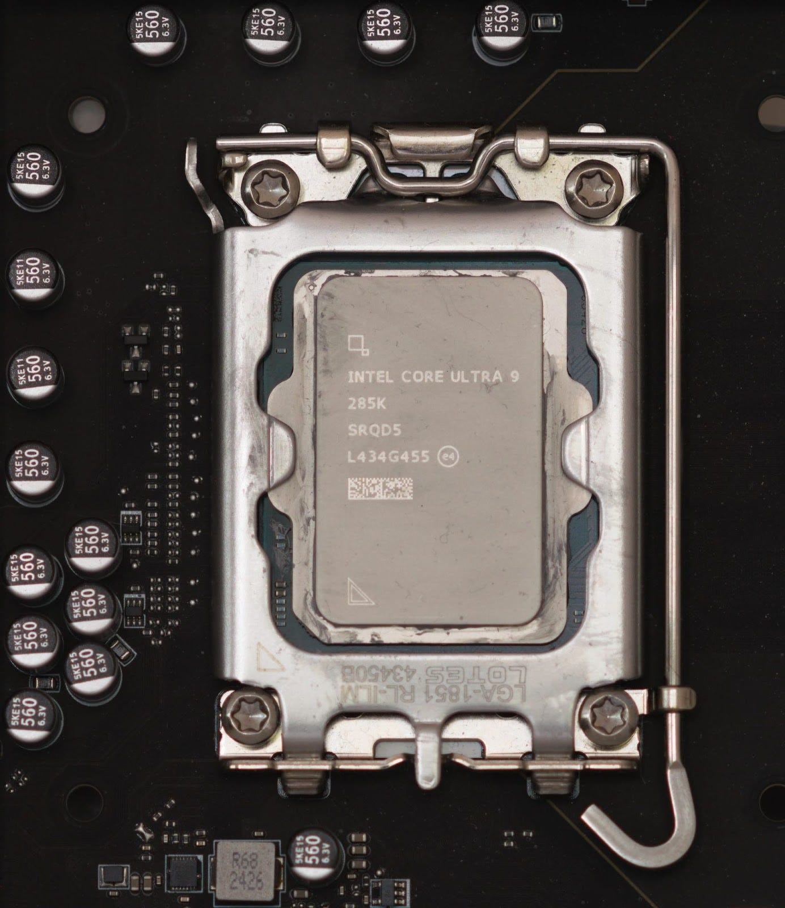

*图 1：处理器照片交代被测平台。核心架构与 Arrow Lake 的 Tile/内存系统共同决定游戏结果，不能把所有差异只归给 Lion Cove。*

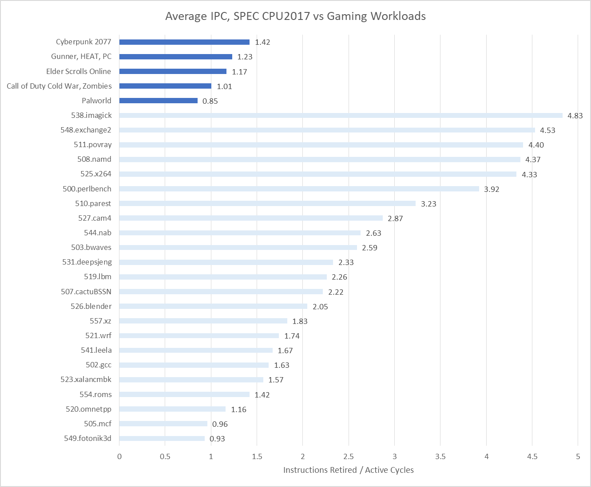

*图 2：Lion Cove 在部分 SPEC 子项超过 4 IPC，三款游戏约在 1～1.7 IPC。峰值可持续八个微操作/cycle，不代表复杂客户端代码能稳定提供足够并行工作。*

## 一、Top-Down：流水线槽位丢在了哪里

Top-Down 在重命名/分配级统计八个 Pipeline Slot：Retiring 是最终有效工作；Bad Speculation 多由分支误预测产生；Frontend Latency 表示整拍没有微操作；Frontend Bandwidth 表示有供给但不满八个；Backend Bound 表示后端无法接收，其中再按阻塞退休的是 Load 还是其他指令分为 Memory/Core Bound。

Intel 对 `TOPDOWN.MEMORY_BOUND_SLOTS` 只给出事件名，AMD 等厂商明确使用“Load 阻塞退休”的定义；这里按相似语义解释，但保留事件口径未完全公开的边界。

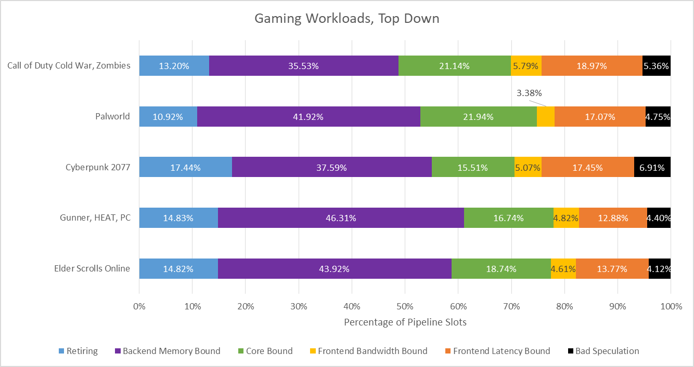

*图 3：后端内存延迟占丢失槽位的最大部分，Core Bound 与 Frontend Latency 也明显；Bad Speculation 和 Frontend Bandwidth 较小。八宽利用不足首先是延迟问题。*

### 体系结构视角：Top-Down 衡量的是机会损失，不是单元利用率

执行端某周期空闲，不一定损失最终吞吐，因为后端端口通常多于分配宽度，可在之后追赶；分配级空槽却无法追回。Top-Down 因而适合回答“为什么没达到八宽”，但要找根因仍需结合 Cache miss、队列占用、分支恢复和数据源事件。

## 二、四层数据 Cache：L1.5 接住了多少

为便于讨论，文章把 48 KB 第一层 L1D 与 192 KB 第二层称为 L1 和 L1.5；后面是每核 3 MB L2、全片 36 MB L3。

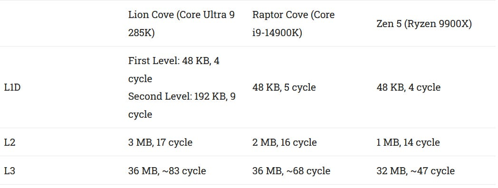

*图 4：Lion Cove 为 48 KB/4 cycle L1、192 KB/9 cycle L1.5、3 MB/17 cycle L2、36 MB/约 83 cycle L3；Zen 5 用 48 KB/4 cycle L1、1 MB/14 cycle L2 和 32 MB/约 47 cycle L3。*

L1.5 截住了可观的 L1 miss，但绝对命中率不算高。L2 命中率在 Call of Duty、Palworld、Cyberpunk 2077 中分别约 49.88%、71.87%、50.98%；L1.5＋L2 累计约 75.54%、85.05%、85.83%。大 L2 的确让多数 L1 miss 不必离开核心。

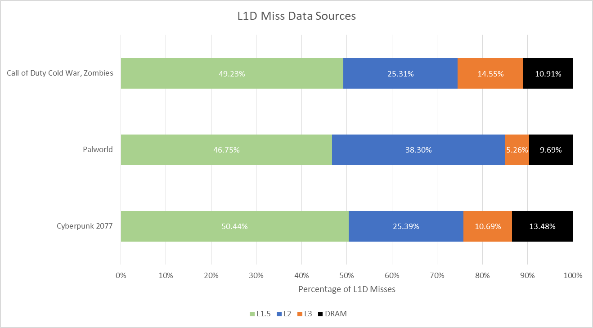

*图 5：绿色 L1.5、蓝色 L2 占大头，仍有少量 L3 和 DRAM。越慢的层级即使比例小，也可能主导等待周期。*

PMU 还可统计某层有 Pending Load、没有更低层 Miss、且没有微操作可执行的 cycle。它表示核心被该层延迟逼到无事可做，并不等同于所有该层访问的平均延迟。

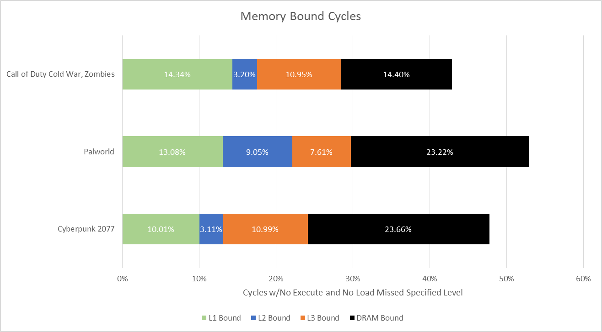

*图 6：L1.5 减少了 L2 压力，L2 Bound 很低；越过 L2 后，约 14 ns L3 和 DRAM 造成显著停顿。*

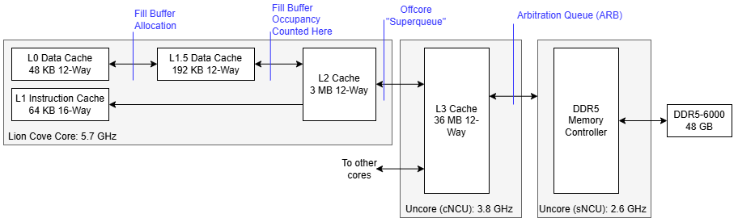

*图 7：请求从核心 L1/L1.5、L2 进入 CPU Tile Arbitration Queue，再经 SoC Tile 的 L3/内存控制器。不同部分运行在不同频率，PMU cycle 不能直接相加。*

`L1D_MISS.LOAD` 在 48 KB L1D miss 时增加，但对应 `L1D_PENDING.LOAD` 只统计越过 192 KB L1.5 的请求；两者相除会把 L1.5 命中当作零延迟。ARB 运行在 3.8 GHz，低于核心最高 5.7 GHz，因此图中又把 ARB 后 cycle 乘以 5.7/3.8，近似折成核心 cycle。

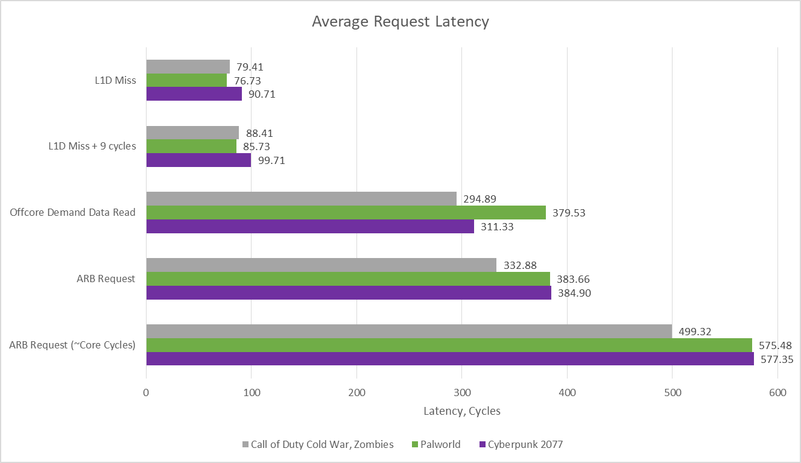

*图 8：原始 ARB/Offcore cycle 与频率换算值并列。换算假设测试期间频率接近给定值，Arrow Lake 动态频率会带来额外误差。*

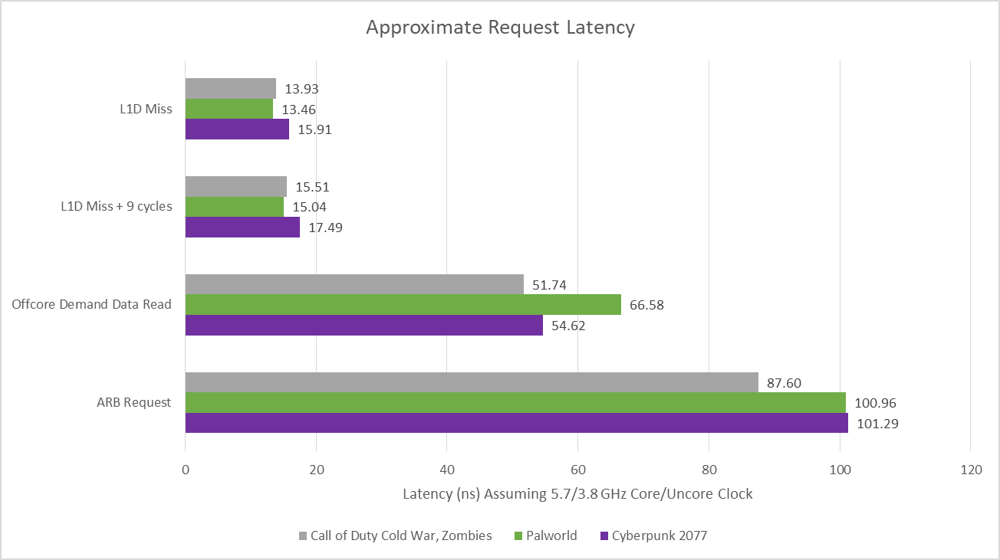

*图 9：ARB 后延迟整体可控，说明三款游戏没有接近 DRAM 带宽上限；真正问题是单次 L3/DRAM 请求本身很长，而非总线已拥塞。*

### 体系结构视角：中间 Cache 优化的是“中等 miss”，不是最坏 miss

L1.5 能把部分 17-cycle L2 命中变成约 9-cycle 命中，却无法帮助落到 80 多 cycle L3 或数百 cycle DRAM 的请求。若工作负载主要被极少数长 miss 卡住，中间层对平均命中时间有益，对尾部停顿却有限。这解释了“命中不少、游戏仍 Memory Bound”的并存。

## 三、前端：预测很准，偶发错误仍然昂贵

指令流比数据访问更可预测，因为准确分支预测可沿控制流提前取指。Lion Cove 在三款游戏中的预测准确率都很高。

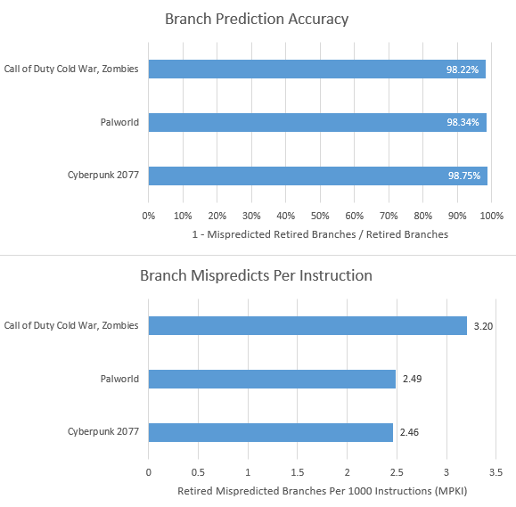

*图 10：准确率约 98% 以上，但 MPKI 仍在约 1.2～2.4。一次误预测不仅浪费错误路径工作，还中断 Predictor 的 Ahead Fetch，可能暴露 L2/L3 取指延迟。*

前端可从 Loop Stream Detector、Microcode Sequencer、Decoded Stream Buffer（DSB/Op Cache）和 Decoder 提供微操作。绝大多数来自 Op Cache，但 5.2K Entry 并不足以覆盖所有代码；64 KB L1I 承担主要指令 Cache 角色。

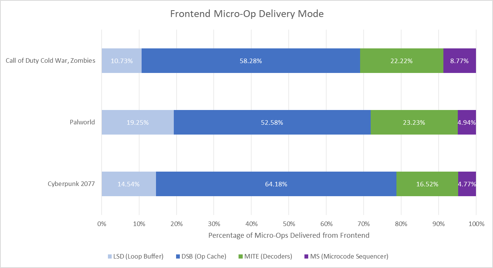

*图 11：DSB 占多数，Decoder 次之，LSD 与 Microcode 很少。来源比例说明正常供给路径，不直接等于每条路径的性能收益。*

Intel 不再公开可直接算 L1I 命中率的新事件，旧事件仍能工作；微基准显示 Op Cache Hit 也会被记为指令 Cache Hit，因此图中表示“无需去 L2 的取指比例”。

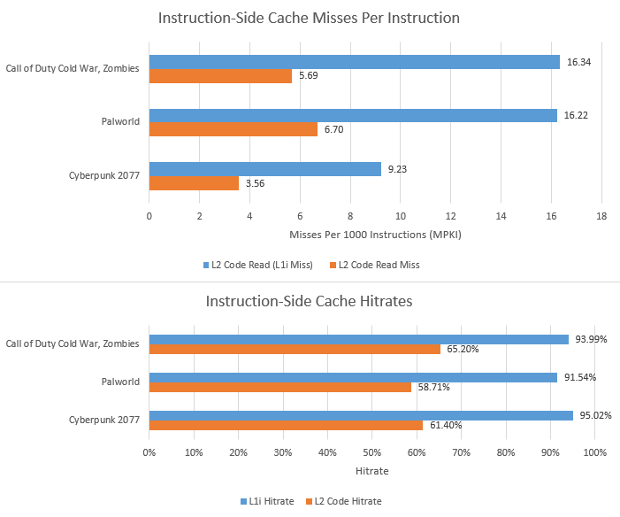

*图 12：64 KB L1I 留住绝大多数代码。Palworld 局部性最差，Cyberpunk 最好；少数 L2 Code Miss 仍会付出很高代价。*

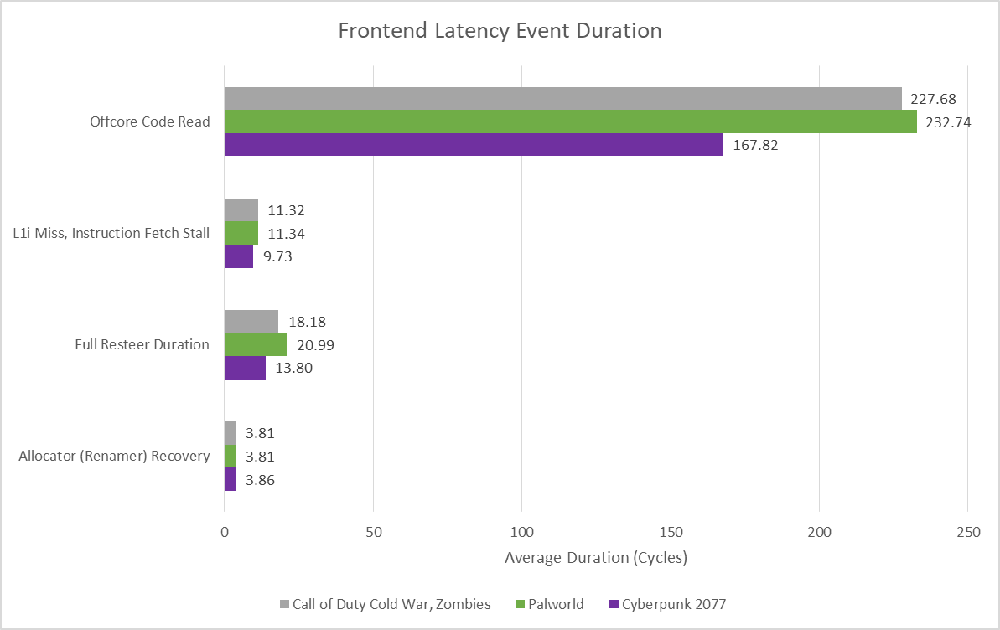

*图 13：Offcore Code Read 可超过 160～220 cycle；L1I Miss/Instruction Fetch Stall 约十余 cycle；Allocator 恢复约 3～4 cycle。不同事件可以重叠，不能简单求和。*

Palworld 的正确路径恢复最慢，主要因代码局部性差。这里的恢复时间从重定向开始，直到重命名器收到正确路径第一条微操作。

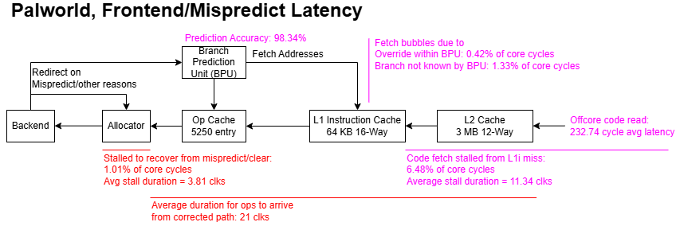

*图 14：误预测准确率、预测点到执行确认、Mapping Table 恢复、L1I/L2/L3 代码命中共同决定总时间。离 Cache 越远，分支惩罚越不再是固定“若干流水级”。*

`INT_MISC.RECOVERY_CYCLES` 可能包含重命名映射表恢复：分支后保存的 Checkpoint 用来回到已知正确的 Register Alias Table。Henry Wong 的研究支持这一解释，但 Intel 没有在本文材料中逐级公开 Lion Cove 恢复状态机。

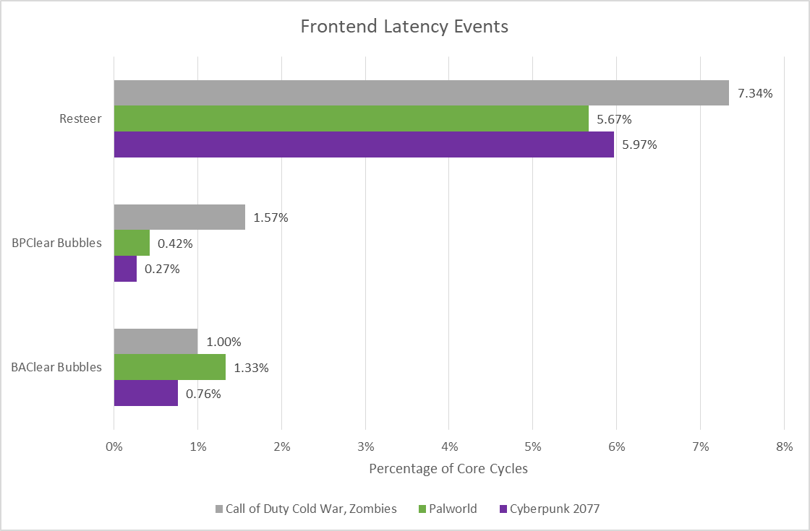

*图 15：Resteer 是主要来源；BPClear（慢层 BTB 覆盖快层）和 BAClear（后续前端发现 Predictor 未跟踪分支）很少，说明 12K Entry BTB 覆盖较好。*

### 体系结构视角：误预测代价不是一个常数

若正确目标仍在 Op Cache/L1I，恢复主要是检测、Checkpoint 和前端重新填充；若目标代码落到 L2/L3/DRAM，预测器失去提前量后还要等待取指。应分别统计 Mispredict MPKI、Recovery Cycle、Correct-path Code Source 与 Branch Target Miss，才知道优化方向是预测准确率还是指令供给。

## 四、退休端的“饥一顿、饱一顿”

低 IPC 游戏里，退休经常完全停止：可能是长延迟 Load 挡在 ROB 头部，也可能误预测后 ROB 一度为空。解除阻塞后，许多已完成的年轻微操作会集中退休。

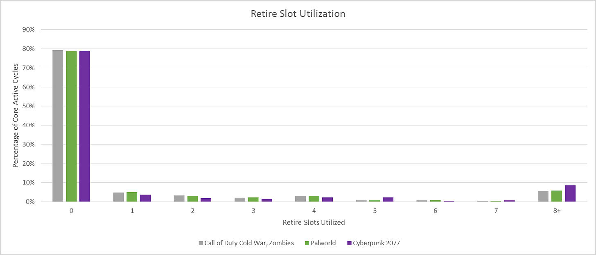

*图 16：绝大多数 cycle 没有退休，或者只退休很少；中等宽度区间很少，呈现明显的 Feast-or-Famine。*

Lion Cove 最多可每周期退休 12 个微操作。一旦用满 12-wide，平均会连续冲过约 28 个微操作后再次阻塞。

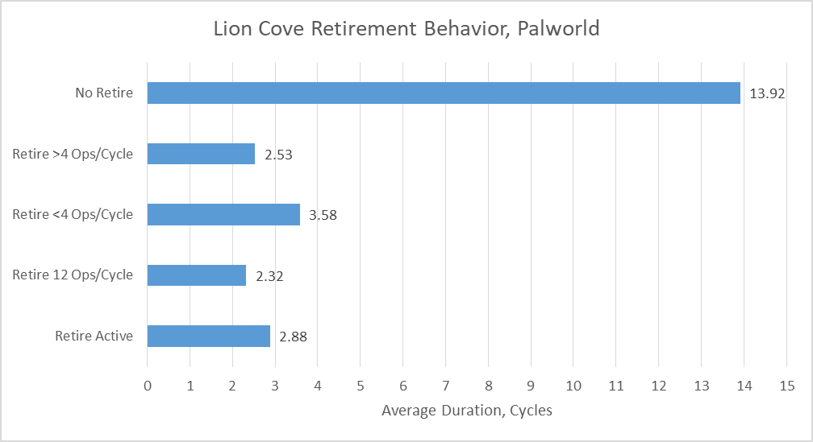

*图 17：No Retire 平均约 13.97 cycle；满 12-wide 的连续段平均约 2.32 cycle。宽退休端有助于快速清空积压，却不能缩短前面的 Cache miss。*

## 五、Lion Cove 在游戏中真正强在哪里

与此前测试的 Zen 4 相比，Lion Cove 更受后端内存延迟影响，却较少受前端延迟影响。AMD Ryzen 9 7950X3D 有 96 MB L3、低得多的 L3 延迟，即使使用较慢 DDR5-5600，DRAM Load-to-use 也更好；Arrow Lake 转向 Chiplet 后的互连仍需改进。

Lion Cove 的前端则很强：更大 BTB、64 KB L1I 和 3 MB L2 让大多数代码留在近处。偶发 L2 Code Miss 仍要数百 cycle，但总体供给明显优于 Zen 4。L1.5 有价值，却主要加速本已较快的 L2 Hit，对 L3/DRAM 长停顿帮助有限。

这组分析可以归纳成五点：

1. 游戏不是“算力不够”，而是难以持续找到可执行工作；增加执行端口和峰值宽度收益有限。
2. 低比例的 L3/DRAM miss 足以主导后端，因为代价远高于大量 L1.5/L2 hit。
3. 大 L1I、BTB 和 L2 缩短误预测后的正确路径恢复，是 Lion Cove 的实际强项。
4. 12-wide 退休帮助清理完成队列，却改变不了 ROB 头部的长依赖；吞吐呈突发而不是平滑。
5. SPEC 的高 IPC 子项与游戏代表两种相反优化目标。芯片面积和功耗有限，不能同时把每种情况推到极致。

Lion Cove 并没有因为游戏 IPC 低而“设计失败”。它在高吞吐代码中兑现宽度，在低 IPC 游戏中靠前端和大 L2 减少部分等待；只是 Arrow Lake 的 L3/DRAM 路径让少数长延迟访问成为更显眼的限制。真正值得期待的下一步，不是单纯继续加宽，而是让困难路径更少、更短。

## 参考资料

- Chester Lam，*Intel’s Lion Cove P-Core and Gaming Workloads*：https://chipsandcheese.com/p/intels-lion-cove-p-core-and-gaming
- Intel，Lion Cove / Arrow Lake Performance Monitoring Events
- Henry Wong，关于 `RECOVERY_CYCLES` 与 Register Alias Table 恢复的研究：https://www.stuffedcow.net/files/henry-thesis-phd.pdf
