# Arrow Lake 上的 Lion Cove：L1.5 很聪明，内存系统却拖了后腿

> **文章来源**
>
> - 文章：*Analyzing Lion Cove’s Memory Subsystem in Arrow Lake*
> - 撰文：Chester Lam
> - 首发：Chips and Cheese
> - 发布：2025 年 1 月 6 日
> - 链接：https://chipsandcheese.com/p/analyzing-lion-coves-memory-subsystem

同一颗 Lion Cove，在 Lunar Lake 最高约 4.8 GHz、2.5 MB L2、12 MB 末级 Cache；到了 Arrow Lake，P-Core 最高 5.7 GHz、每核 3 MB L2、全芯片 36 MB L3，DRAM 延迟也更低。SPEC CPU2017 整数和浮点分别提高 24.8% 与 23.4%，说明核心 IP 的表现高度依赖部署平台。

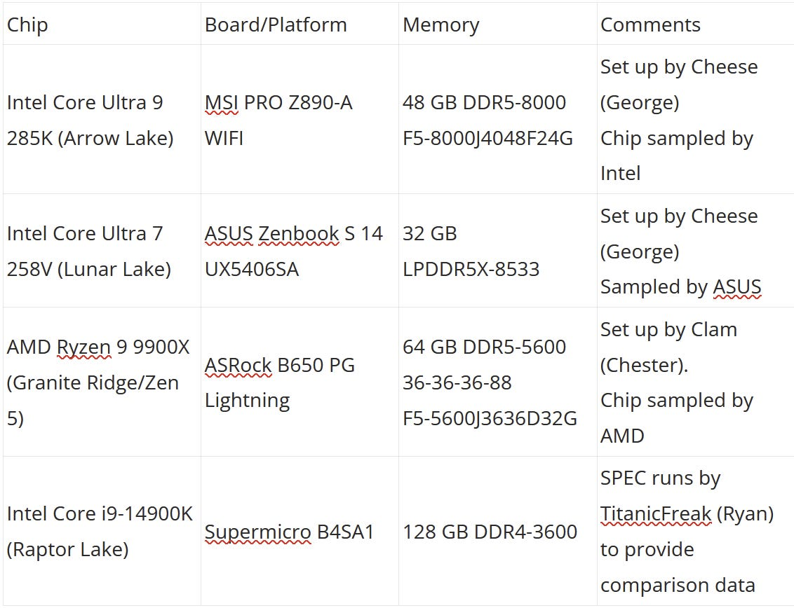

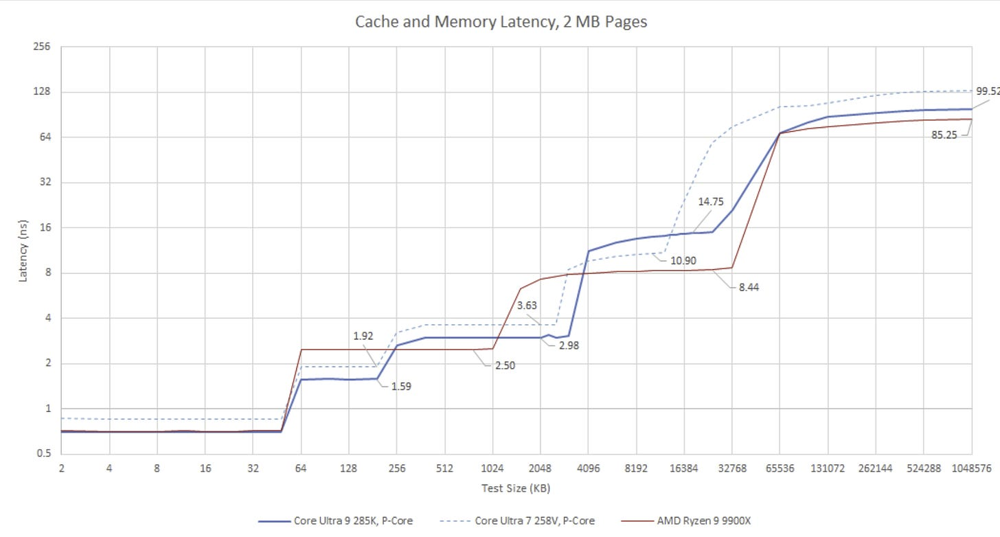

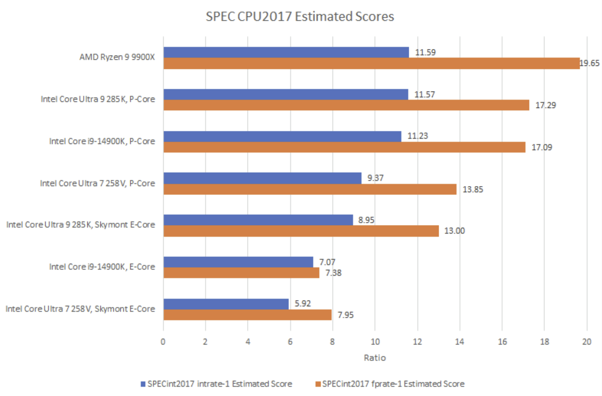

*图 3：Skymont 的平台差距超过 50%，Lion Cove 较小，因为 Lunar Lake 本来就为 P-Core 提供了相对完整的 Cache；仍不能把 24% 全归因于频率或某一级 Cache。*

## 一、Lion Cove 追平 Zen 5，但没拉开 Raptor Cove

Zen 5 与 Arrow Lake P-Core 峰值频率接近。AMD 使用更小 L2、更快 L3和更低 DRAM 延迟；Arrow Lake 的 DRAM 延迟甚至比 Raptor Lake 退步。SPEC 整数中 Lion Cove 只领先 Raptor Cove 1.2%，浮点领先 3%；在 `505.mcf`、`520.omnetpp` 等内存敏感子项，旧平台反而胜出。`omnetpp` 中，Arrow Lake Lion Cove 比 Lunar Lake 同核心快 45%。

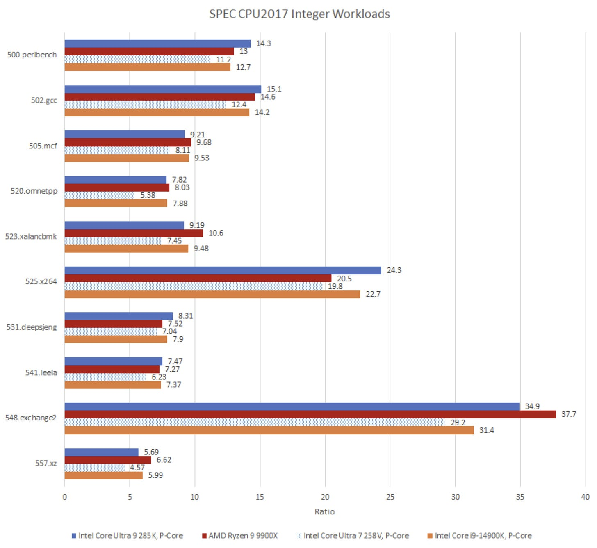

高 IPC、工作集可被 Cache 容纳时，Lion Cove 很强。它与 Skymont、Zen 5 都是 8-wide 级宽核心，但三者用不同 Cache 结构解决供给问题。

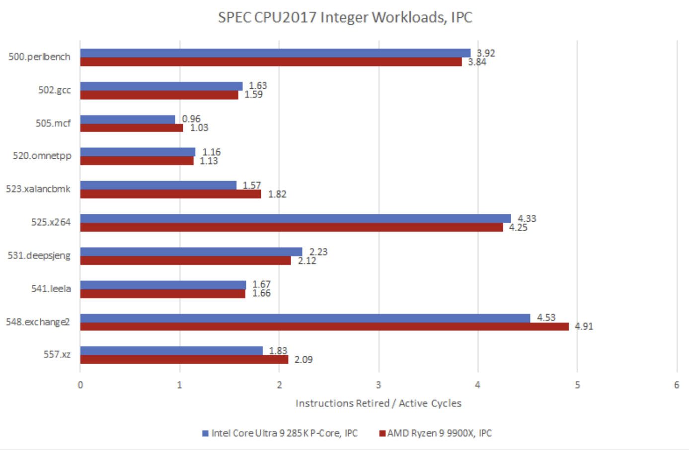

Intel 与 AMD 的 PMU 口径不同：Intel 在 Load 退休时记录最终数据来源；AMD 统计 Demand L1D Miss 的来源，其中可能包含误预测路径、最终不退休的 Load。因此后续 Hitrate 图只能在各自平台内部解释，不能把事件数逐项横比。

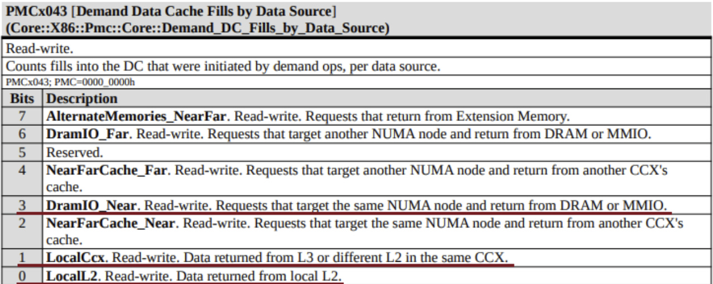

## 二、192 KB L1.5：给高延迟 L2 加一道小而快的缓冲

Intel 文档把 192 KB Data Cache 称作“L1 Data Cache 的 Level 1”。为便于叙述，这里称为 L1.5。它位于常规 L1D 与 L2 之间，能在不少工作负载中接住大量 L1D Miss。

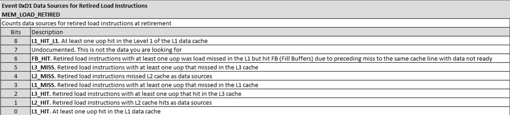

*图 7：事件来自 Intel JSON 文档整理；Unit Mask bit 8 位于 Event Select Register 的 bit 40。资料入口接近 Linux 内核提交，使用时需核对具体型号。*

`525.x264` 是极端例子：192 KB 已足以让 L1.5 接近替代 L2，减少进入高延迟 L2 的流量，可能是 Lion Cove 领先 Zen 5 的原因之一。即便访问模式不够规则，它也常能降低 L2 压力。

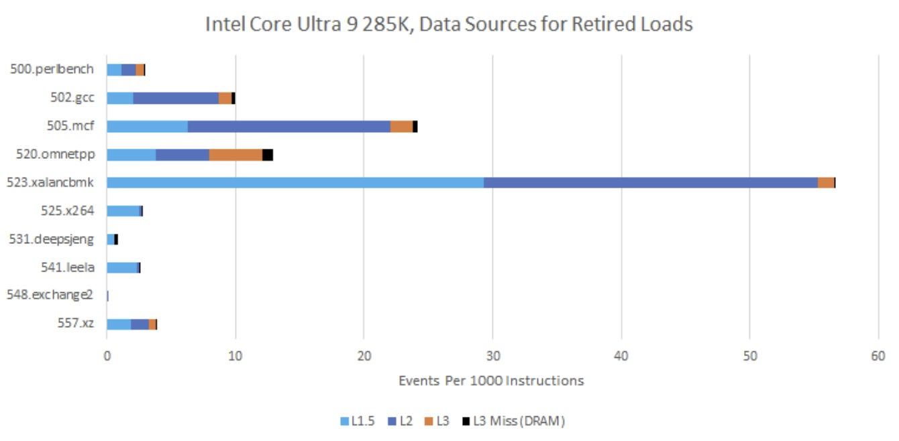

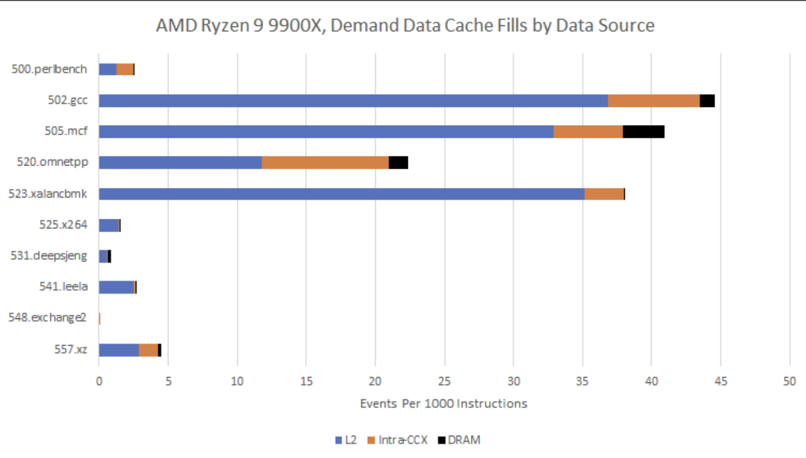

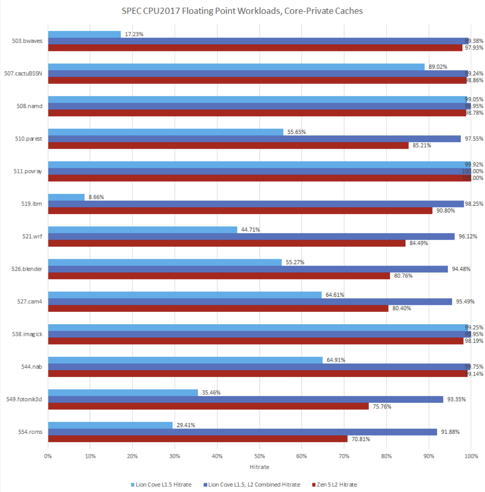

*图 10：Zen 5 在相关测试约 1.45 IPC，较低 L3/DRAM 延迟可能帮助它在 L1.5 无法覆盖时保持吞吐。*

浮点套件中，L1.5 命中率跨度很大：部分子项近乎替代 L2，部分几乎接不住请求，Lion Cove 便要承受更高 L2 延迟。L2 之后也没有固定赢家——有时 Intel 更高 L2 命中率让 AMD 去访问 L3，有时大工作集又让 Intel 的慢 L3/DRAM 吃亏。

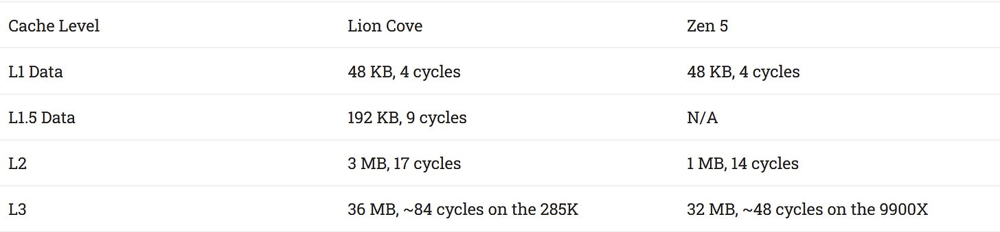

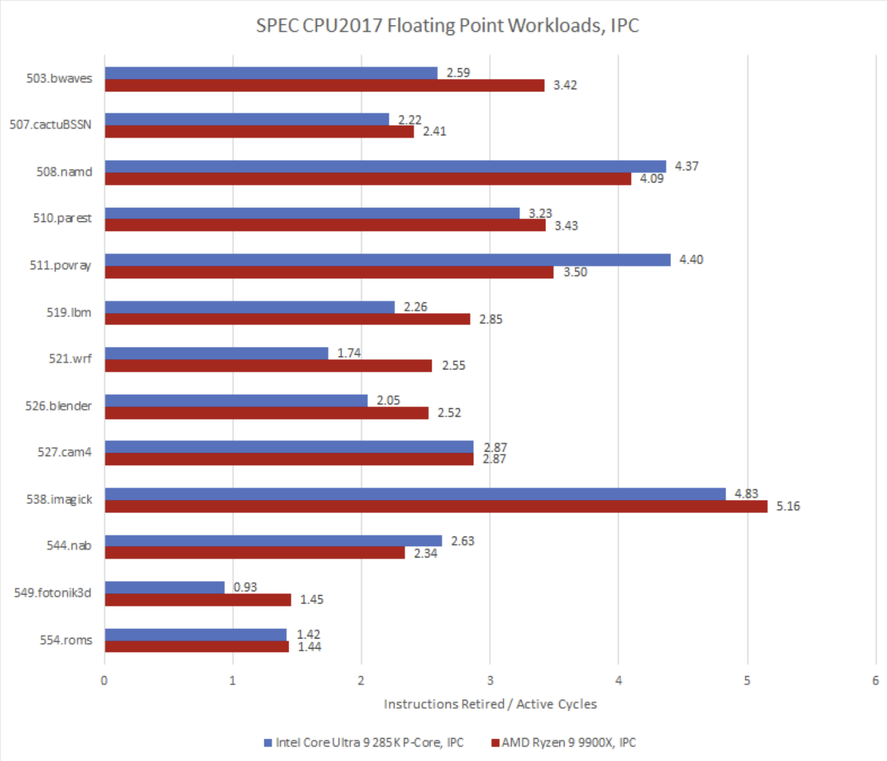

### 体系结构视角：L1.5 是补偿，也是新的命中层级

加一层小 Cache 可显著降低平均 L1 Miss 延迟，但每个 Miss 也多了一次 Tag Lookup、替换与一致性状态管理。它之所以划算，是因为 Lion Cove 的 L2 更大、访问更慢，而 192 KB 足以覆盖不少热点数据。评价时应看平均命中加权延迟，不能只比较 L1、L2 的单个数字。

## 三、FP Port 布局：四个端口并不完全对称

Lion Cove 把四条 FP/向量端口与标量整数端口分离。V0、V1 可执行 FP Multiply/FMA，V2、V3 以更低延迟处理 FP Add。

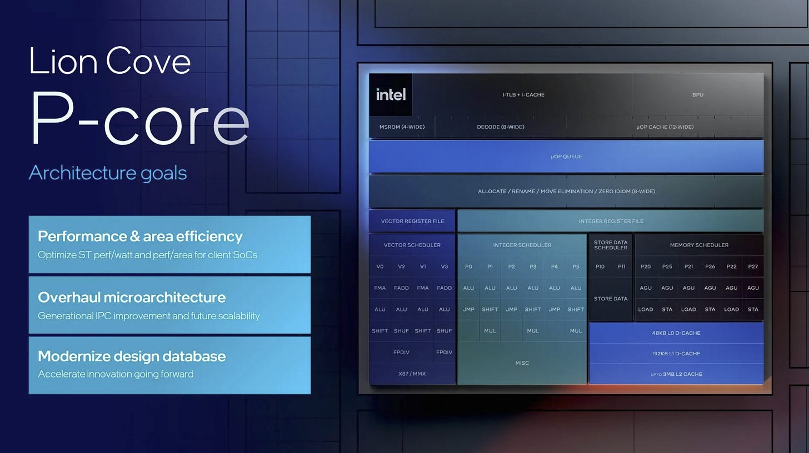

`508.namd` 是 SPEC 中 IPC 最高的负载，重压两条 FMA Port；使用的 `FP_ARITH_DISPATCHED.Vn` 只统计浮点操作，SIMD Integer 还可能增加实际负载。其他子项对端口吞吐要求较低，即使四端口不均衡也不会明显限制。

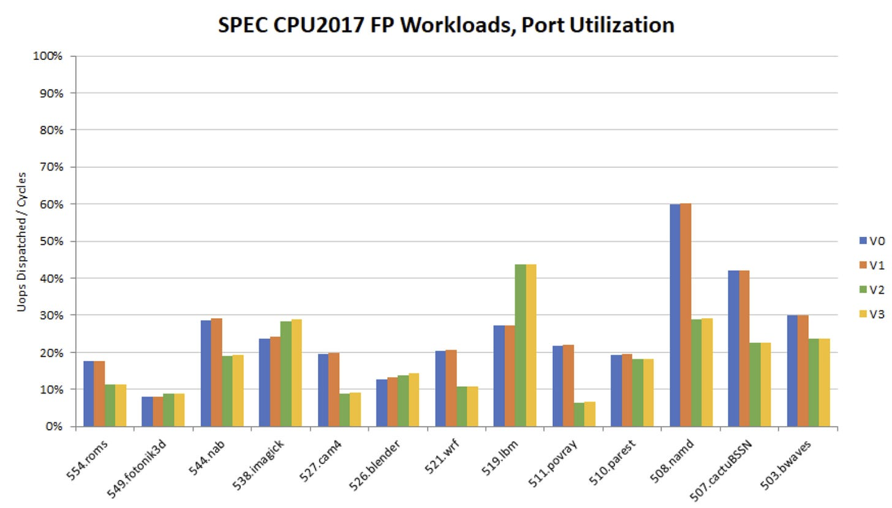

*图 14：让四端口都配置 FADD/FMA 会更均衡，但执行单元、寄存器读取和旁路都很昂贵，只为少数高 IPC 负载获得小幅收益并不划算。*

## 四、libx264 与 7-Zip：一快一慢揭示两种边界

libx264 含手写向量路径。相同核心数下 Lion Cove 比 Zen 5 快约 4%；两者都大幅领先 Skymont。L1.5 减少部分 L2 压力，但两颗大核的大部分 L1 Miss 仍由 L2 满足，也有一部分进入 L3/DRAM。

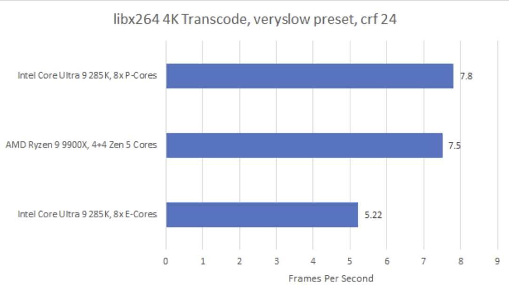

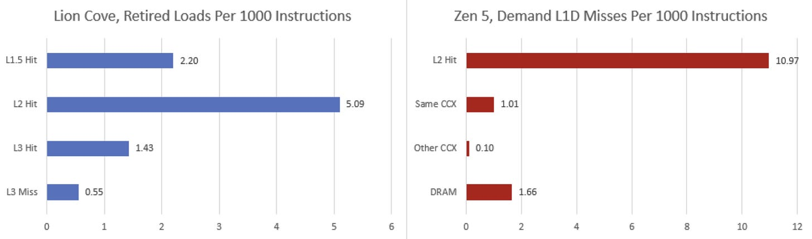

Ryzen 9 9900X 的八核测试必须跨两个 6 核 CCD，但 PMU 显示 Cross-CCX Traffic 相对普通 L3/DRAM 访问很少，因此不能仅凭 Core-to-core Latency 就断言它主导这项成绩。

7-Zip 压缩 2.67 GB ETL 文件，几乎全是标量整数。Lion Cove 领先 Skymont 26%，仍落后 Zen 5；把 Zen 5 限制到单 CCD 六核并拉近总 Cache 后，领先幅度仍相近。它的工作集很大，两边 L2 吸收多数 L1 Miss，但 L2 之后仍有相当比例落到 DRAM。

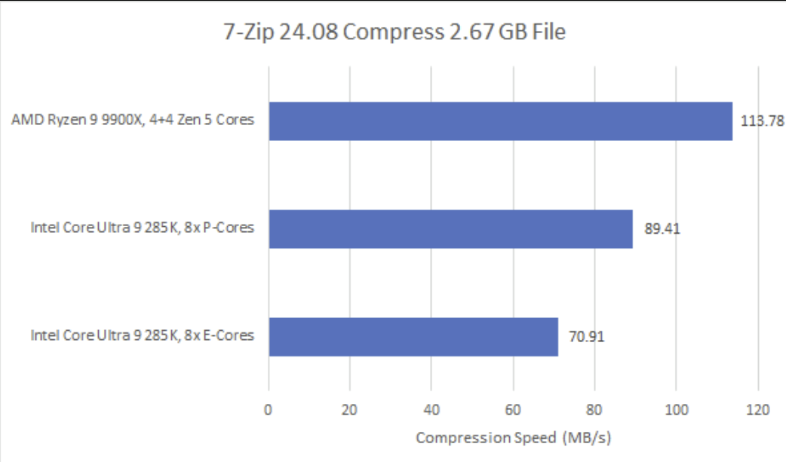

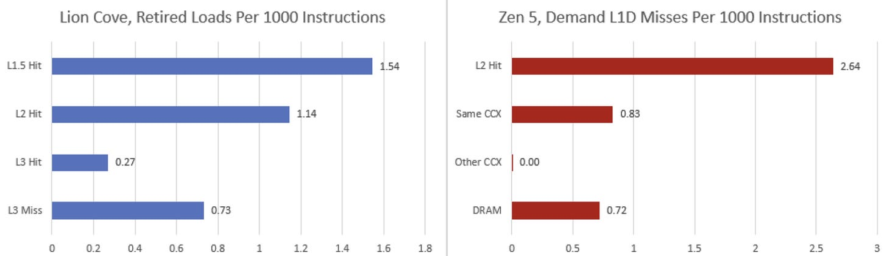

每千条指令即使只有约 0.7 次 DRAM 访问也足以伤害性能：Lion Cove 一次超过 565 Core Cycle，Zen 5 超过 484 Cycle。三类核心还能保持 1 IPC 以上，反而说明乱序窗口已隐藏了大量延迟。

## 五、为什么复杂的新核心没有自动赢

测试平台并不对称：Zen 5 9900X 沿用 2×32 GB DDR5-5600，Arrow Lake 285K 使用 2×24 GB DDR5-8000；截至 2024-12-23，两套内存价格约 150 与 250 美元。Lion Cove 用更贵、更快、容量更低的内存只获得大致相当性能，产品结果并不理想。

但核心内部仍有很多有价值的进展：8-wide Decoder 可跑到 5.7 GHz，L1I 达 64 KB；Rename 可消除小立即数 Add 的有效延迟；L1.5 接住大量 L1D Miss；乱序容量高于 Zen 5；从 Raptor Cove 到 Lion Cove，几乎整条 Pipeline 都重组。

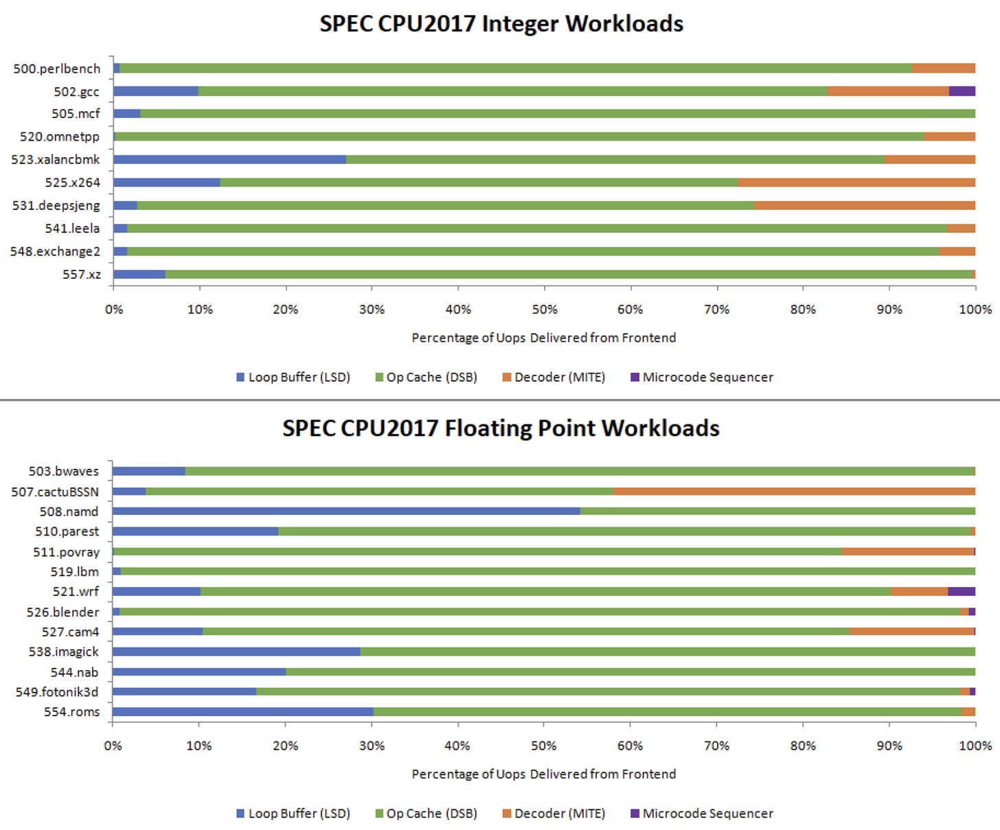

这些特性未必同时转成优势。8-wide Decode 只有在 Op Cache Hitrate 低、IPC 又高于 AMD 4-wide Decoder 可持续能力时才重要。`cactuBSSN` 已让 Decoder 较忙，但 Lion Cove 仍有一半以上微操作来自 Op Cache；Zen 5 的 Decoder 比例低于 25%。两者 IPC 约 2.22 与 2.41，4-wide 在大 Queue 平滑后已经够用。

L1.5 的收益也部分是在补偿慢 L2；慢 L2 又是为了避免更昂贵的 L2 Miss。最终问题落到 Arrow Lake 的 Chiplet Interconnect 和内存延迟。

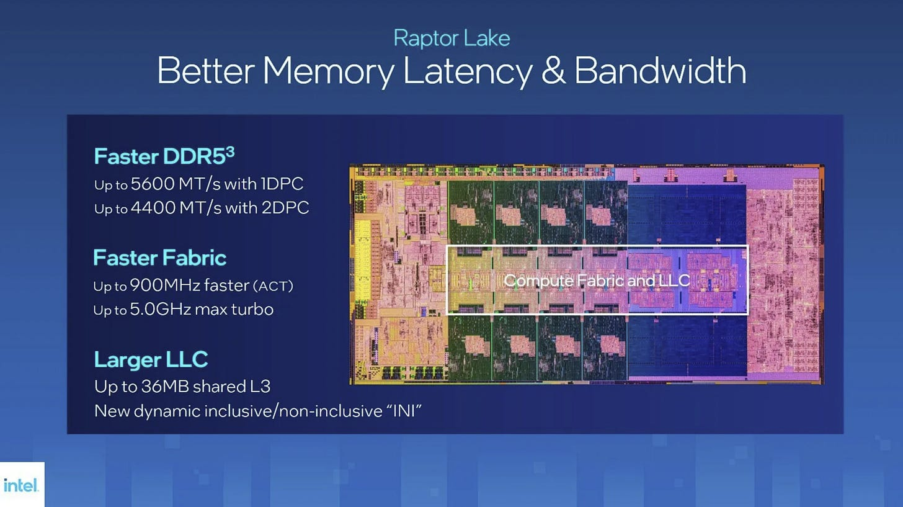

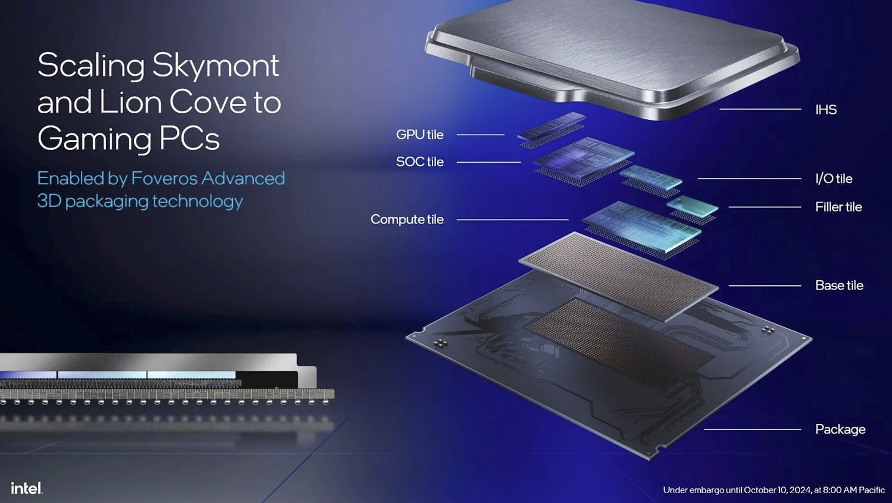

*图 20、21：沿用 Raptor Lake 单片 System Agent 或许有短期收益，Arrow Lake 则尝试建立可复用基础。它类似 AMD 早期 Chiplet 转型：第一代先承受延迟，后续才可能兑现模块复用。*

Lion Cove 的结论因此是“双层”的：核心设计激进而有亮点，Arrow Lake 平台却让 L3 与 DRAM 延迟吃掉不少潜力。若 Intel 后续能在保留 Chiplet 灵活性的同时缩短内存路径，这颗大乱序核心才更容易显示出真正上限。

## 参考资料

- Chester Lam，*Analyzing Lion Cove’s Memory Subsystem in Arrow Lake*：https://chipsandcheese.com/p/analyzing-lion-coves-memory-subsystem
- Intel Performance Monitoring Event JSON / Linux kernel perf data
- SPEC CPU2017 benchmark suite
