# CES 初探 Meteor Lake：三类核心，以及一套为低功耗重做的系统层级

> 英文标题：Previewing Meteor Lake at CES 
> 撰文：Chester Lam 
> 首发：Chips and Cheese，2024 年 1 月 11 日 
> 原始链接：https://chipsandcheese.com/p/previewing-meteor-lake-at-ces

Intel 用 P-Core 追逐单线程，用 E-Core 避开大核边际收益、提高单位面积的多线程吞吐；Meteor Lake 又加入第三类 LPE-Core，希望轻载时不唤醒整个 Compute Tile。CES 的有限测试由 Cheese 完成，被测芯片可能不是最终版本：P-Core 约 4.7 GHz，E-Core 3.77 GHz，LPE-Core 2.48 GHz。

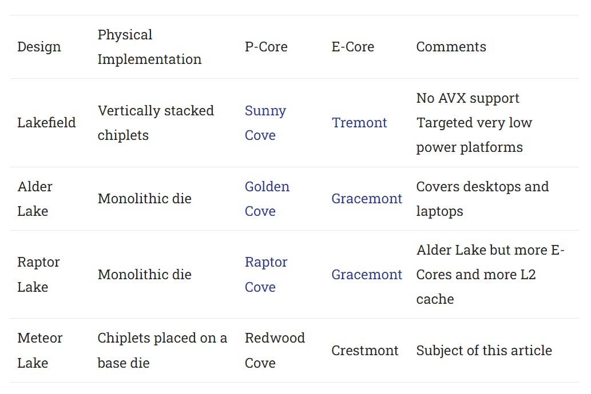

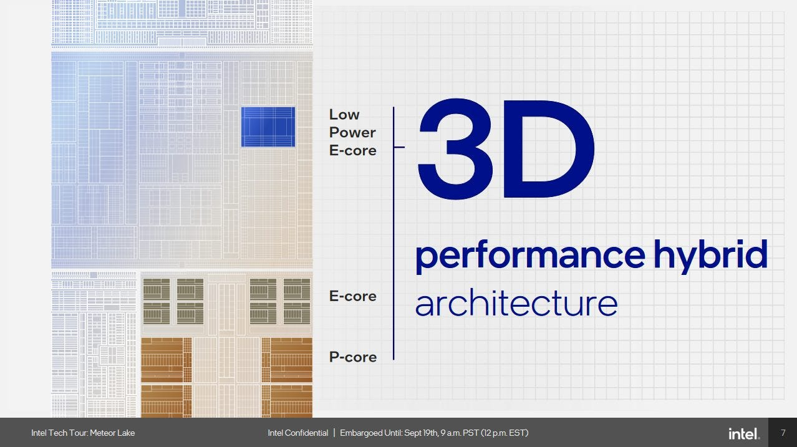

## Redwood Cove P-Core

Redwood Cove 基本继承 Raptor Cove 私有缓存：48 KB L1D/5 cycle、2 MB L2/16 cycle。Zen 4 为 32 KB/4 cycle、1 MB L2/14 cycle。

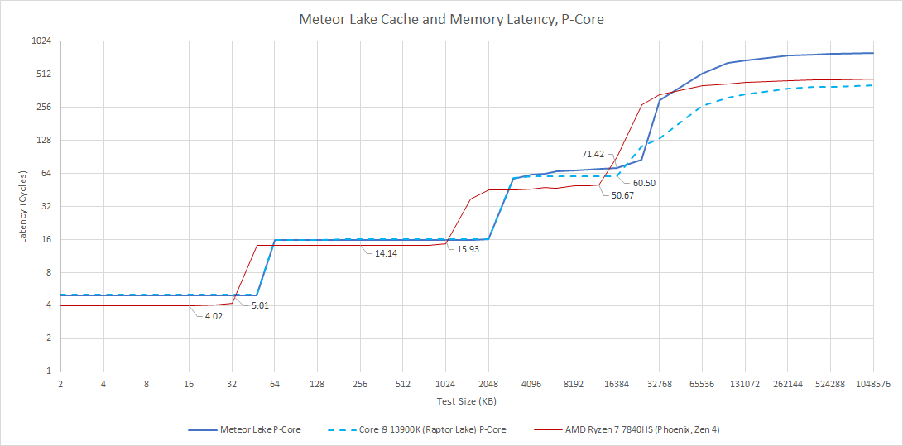

Meteor Lake iGPU 在独立 tile，有自己的 memory-controller 路径，不再使用 CPU L3；访问内存无需唤醒 ring，L3 client 也变少。但 P-Core L3 反而从 Raptor Lake 60 增到 71 cycle。与频率相近的早期 Raptor 工程样品比，L1/L2 纳秒接近，L3 从 12.5 增到 15 ns，略令人失望。

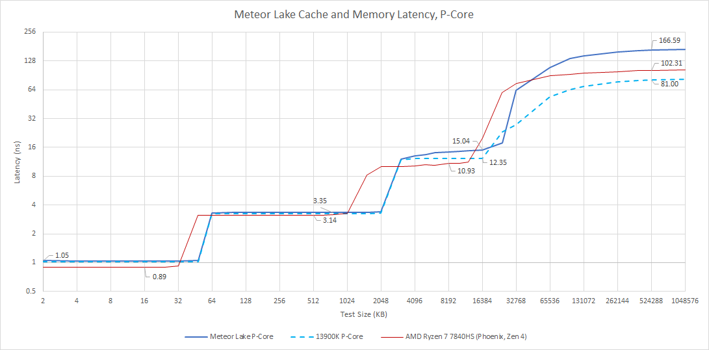

Intel L2 pipeline 更长，但较高频率补偿，实际 L2 优于被 HP 限到 4.5 GHz 的 Ryzen 7 7840HS；L1/L3 则 AMD 更低延迟，但容量更小。Meteor Lake 用 LPDDR5X-7467，pre-production memory latency 可变，不能与 desktop DDR 直接比较并下定论。

Redwood Cove 可 `3×256-bit AVX load/cycle`，高频下 L1 带宽明显高于 Zen 4；L2 interface 64 B/cycle，AMD 32。

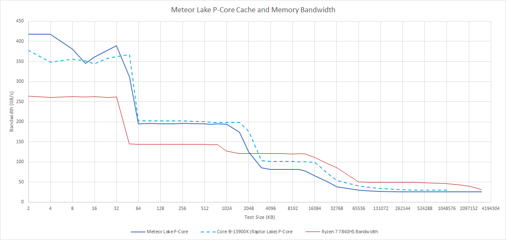

AMD 的 L2 miss 路径更强，Zen 4 单核从 L3 超 120 GB/s；Meteor Lake 从 Raptor 100 降到 81 GB/s。单核内存也从 30 降到 25.3 GB/s，可能因 latency 与有限 outstanding miss 数；这是一种解释而非端口确认。

## Compute Tile Crestmont E-Core

32 KB L1D/3 cycle，四核共享 2 MB L2/20 cycle。Raptor Lake E-Core L2 同为 20 cycle、容量却 4 MB；Meteor Lake 可能优先面积。

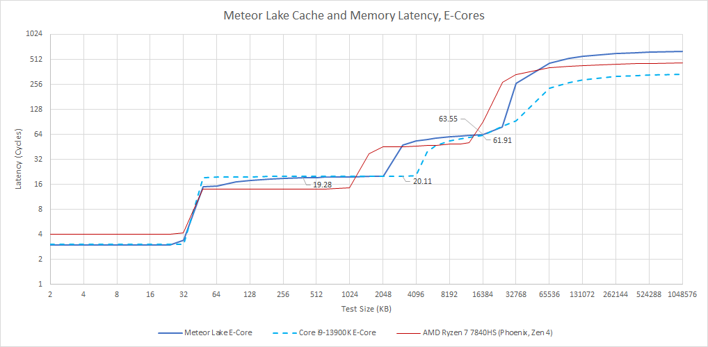

L3 多出几个 cycle，但不如 P-Core 回退严重。3-cycle L1D 加较低频，实际纳秒仍优于 P-Core，亦优于 4.5 GHz Zen 4；L2 约 5.21 ns。L2 区域曲线缓慢上升，可能说明 replacement policy 改变，不能据此确认算法。

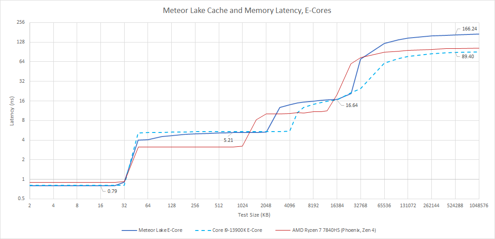

两代 E-Core L3 都约 16.6 ns。LPDDR5(x) 使内存延迟远高于 desktop DDR。

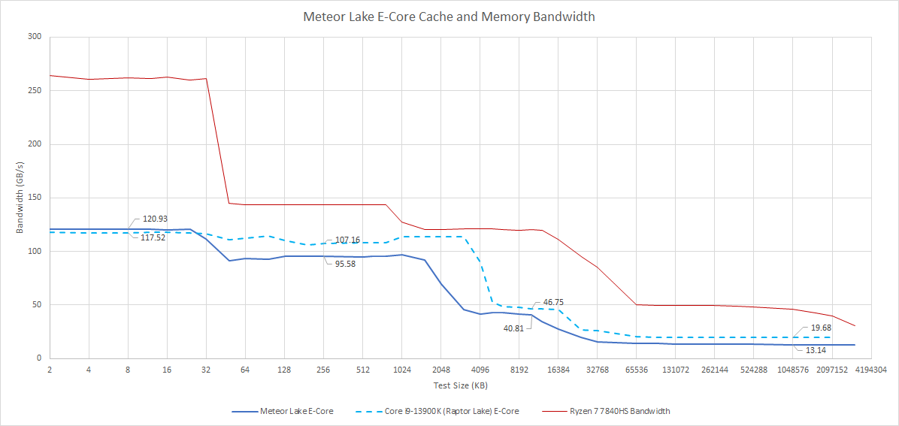

L1 带宽近似，说明频率相近；Meteor Lake L2/L3 略回退，小 L2 又让更多访问进入 L3；单核 DRAM 下降可能仍是 latency 限制。

## SoC Tile LPE-Core

LPE-Core 扮演 mobile SoC Cortex-A5x little core：不是提高长期重载性能，而是以很低功耗处理后台，避免唤醒 Compute Tile。逻辑上与 E-Core 相同，物理实现不同：SoC Tile 用 TSMC N6，Compute Tile 用 Intel 4。仍是 32 KB/3 cycle L1、共享 2 MB/20 cycle L2；但不接 CPU L3，L2 miss 直达内存。

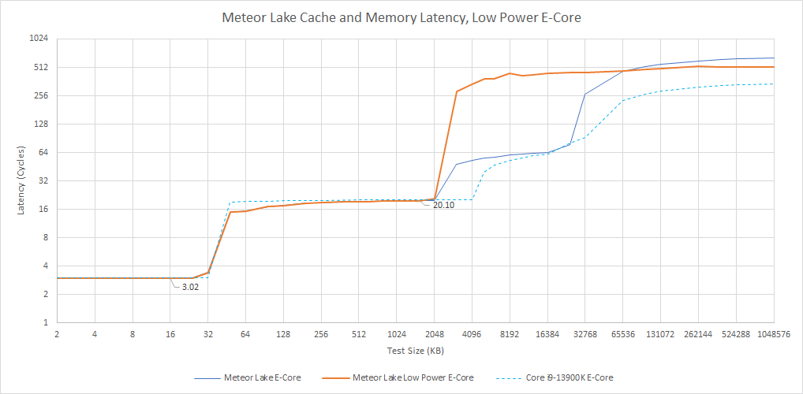

2.48 GHz 让 20 cycle L2 接近 8 ns；DRAM 超 200 ns。即便靠近 memory controller，路径可能为低功耗而非性能优化。

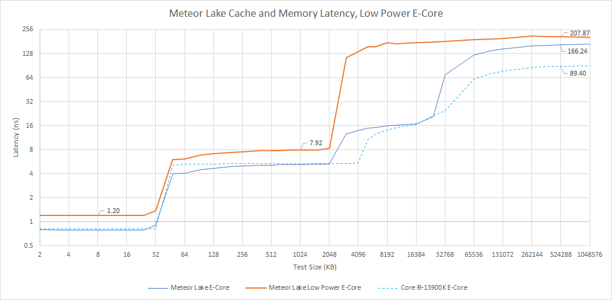

带宽受低频和窄通路限制：L1 略低于 80 GB/s，即约 32 B/cycle；L2 24—25 B/cycle、实际略超 62 GB/s；单核 memory 略低于 9 GB/s。

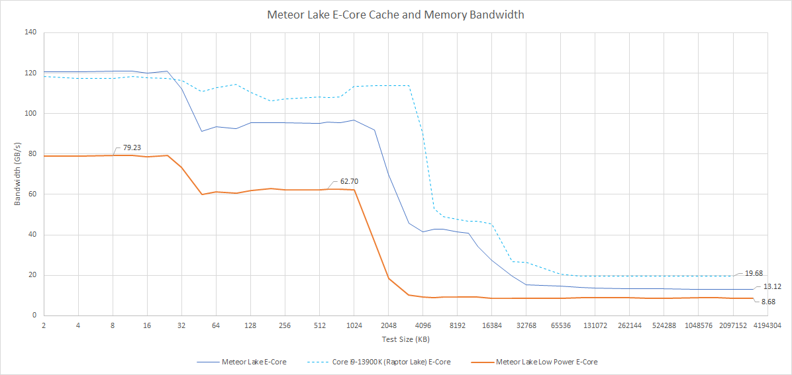

### 体系结构视角：逻辑核心相同，系统可见性能仍会完全不同

ISA 和核心 RTL 相同，不代表频率、cache hierarchy、memory path 与电源策略相同。LPE-Core 省下唤醒 Compute Tile 的静态/互连功耗，却把 L2 miss 暴露给 200 ns DRAM。评价其能效应测整包轻载 energy/task 与 Compute Tile residency，而不是只比较单核 IPC。

## Cacheline Bounce 与 Tile 边界

用 compare-and-swap 在两核心间来回转移 cacheline，测一致性路径。P-Core 最低；E-Core 较慢，但不像 Alder Lake 那样显示独立四核 cluster，可能对所有 E-Core 使用统一 coherency 路径。

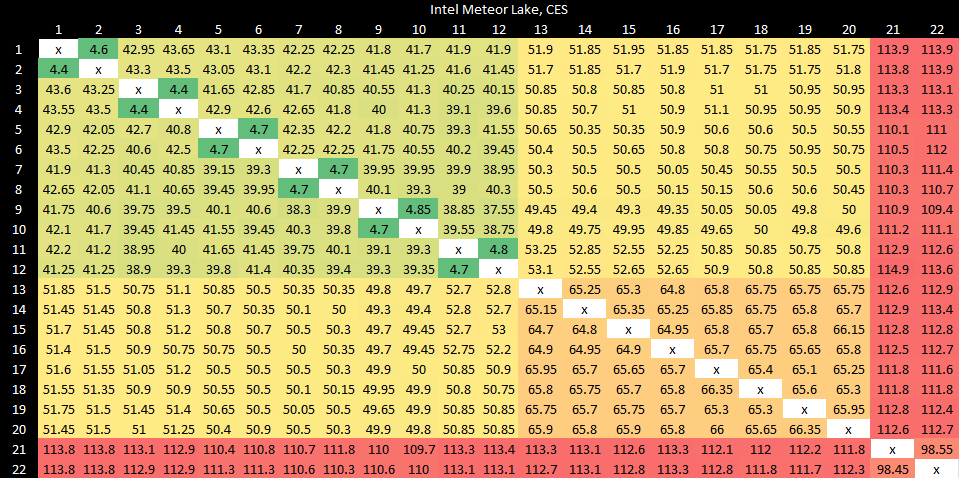

LPE-Core cluster 内接近 100 ns，跨到 Compute Tile 更高。

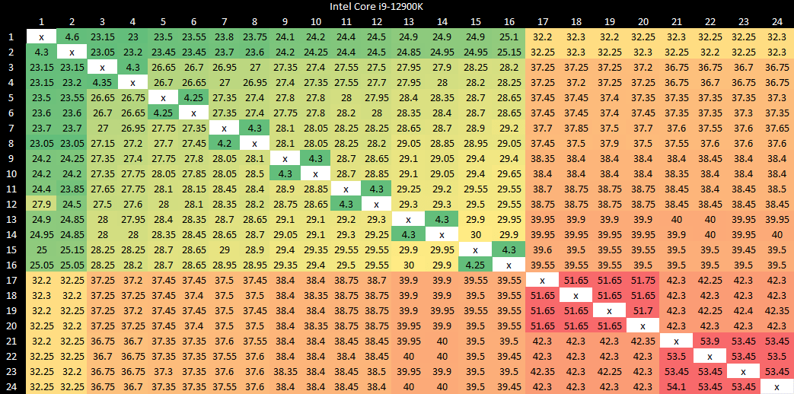

即使 cacheline home 在远离 E-Core 的 L3 slice，Alder Lake 也更快。可能 Meteor Lake ring 频率更低，但本文未测 ring clock，不能确认。

### 体系结构视角：跨 Tile 一致性延迟是分解式 SoC 的隐性税

Cacheline bounce 要经过私有 cache、directory/home agent、NoC/tile interface，再 invalidate/transfer。轻载 LPE-Core 若频繁与 Compute Tile 分享锁或队列，100 ns 级互连会抵消节能收益。可用不同 home、producer-consumer placement 和 uncore frequency 扫描验证，不能从矩阵唯一推断协议实现。

## 结语

Meteor Lake cache data path 相对 Raptor Lake 没有大进步，延迟与带宽多为相近或回退。Intel 可能在重做高层 tile 架构时保守处理核心/cache，避免一次承担过多风险。

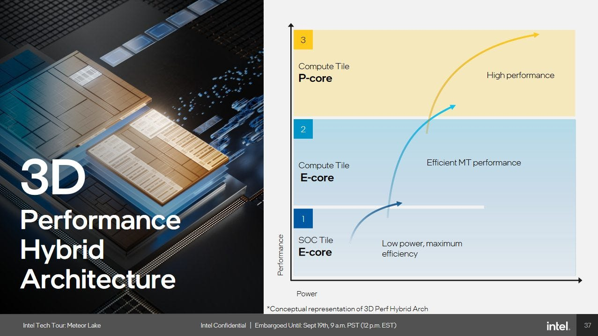

真正目标可能是视频会议、轻网页和消息等常见笔记本轻载：CPU 性能不关键，关闭 Compute Tile 的 cores/cache/ring 可省电。编码、渲染、编译和游戏不会从 LPE-Core 策略获益，适合桌面高性能产品。CES 样品、有限测试和未定型 memory state 都要求后续零售机复测。
