# Hot Chips 34 的 Meteor Lake：Intel 与 AMD 选择了两种不同的 Chiplet 路线

> 英文标题：Hot Chips 34 – Intel’s Meteor Lake Chiplets, Compared to AMD’s 
> 撰文：Chester Lam 
> 首发：Chips and Cheese，2022 年 9 月 10 日 
> 原始链接：https://chipsandcheese.com/p/hot-chips-34-intels-meteor-lake-chiplets-compared-to-amds

Hot Chips 34 上，Intel 公开 Meteor Lake 的 tile 方案。它和 AMD 都追求 die reuse、模块化与更低制造成本，却因目标市场不同，选择了不同封装、链路和功能切分。

## 高层策略：减少客户端独立 Die 数量

过去 Intel 为不同客户端市场做多种 monolithic die。单 die 不大时很合理；但核心数、混合架构、Thunderbolt 等 SoC 功能和 iGPU 同时扩张，组合数量暴增，用 tile 可减少独立 mask/die 种类。

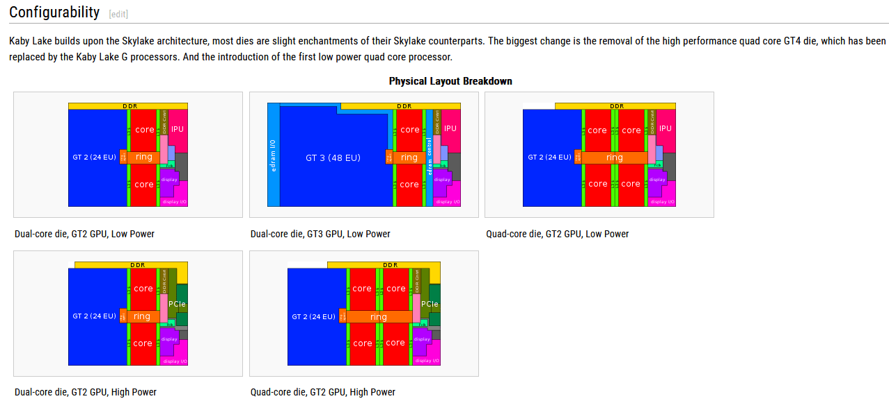

Meteor Lake 分四块：CPU Tile 含核心与 cache，类似 AMD CCD；GPU Tile 独立；SoC Tile 承接传统 System Agent 多数功能；IO Extender（IOE）连接 SoC。它们堆在 passive base die 上，由 base die 提供 tile 互连和供电。

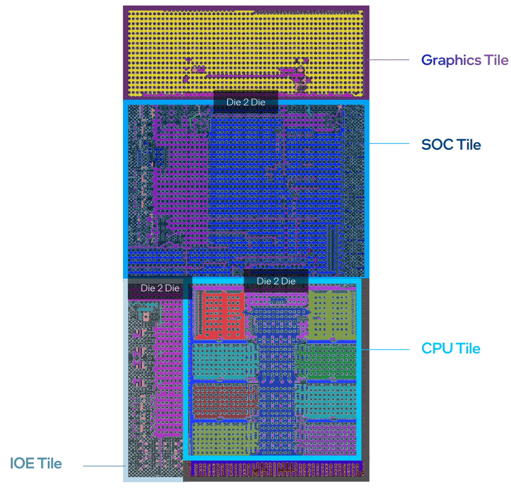

同一 6P+双 E-cluster CPU Tile 可配重 PCIe 的桌面 SoC Tile，也可配带 IPU、适合 webcam 能效的移动 SoC Tile，提高复用潜力。

### 与 AMD 对照

AMD 普通封装 PCB link 廉价、距离长，可让 CCD/IOD 跨桌面与服务器复用；功耗不适合当时更紧张的 mobile，所以移动仍多用 monolithic APU。

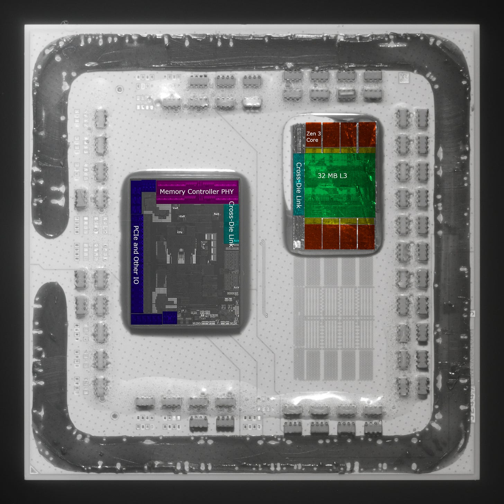

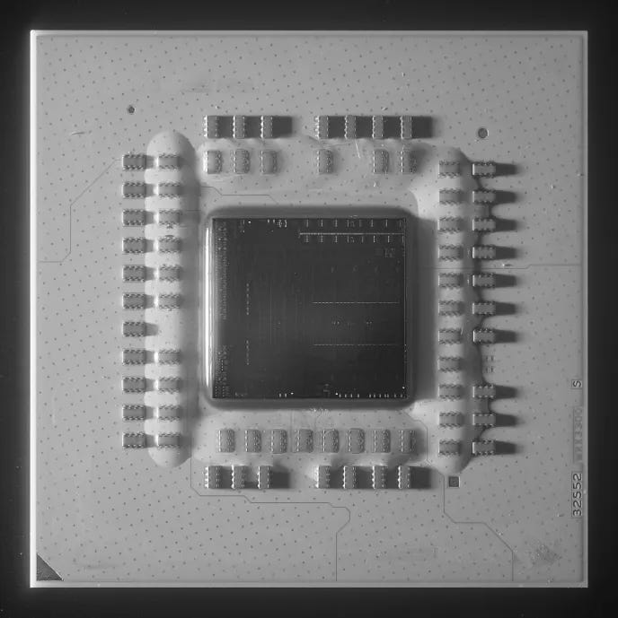

Foveros 需要额外 base die，成本更高；要扩大 CPU Tile 或增加 Tile，也要更大的 base die，扩展性较差。交换得到的是更高 I/O density、更小 package 和更低 die-to-die energy，适合 ultrabook。

### 体系结构视角：Chiplet 的价值取决于“复用边界”画在哪里

AMD 以 CCD 为复用单元，跨 desktop/server 获益；Intel 把 CPU、GPU、SoC、IOE 分得更细，目标是跨多种 client SKU 组合。切得越细，die reuse 越多，接口、验证、base die 与封装成本也越高。评估不能只数 tile，还要看年产量、良率、链路 pJ/bit 与 product-mix。

## Foveros Die Interconnect：更省电，延迟优势未必大

Intel 称链路 FDI。AMD 曾称 Zen 1 跨 die Infinity Fabric 约 2 pJ/bit，Zen 2 slide 又称每 bit 能耗降低 27%，但不能确定多少来自 PHY/link、多少来自其他逻辑。合理推测 AMD 普通封装链路成本不低于 Haswell OPIO，FDI 更适合移动。

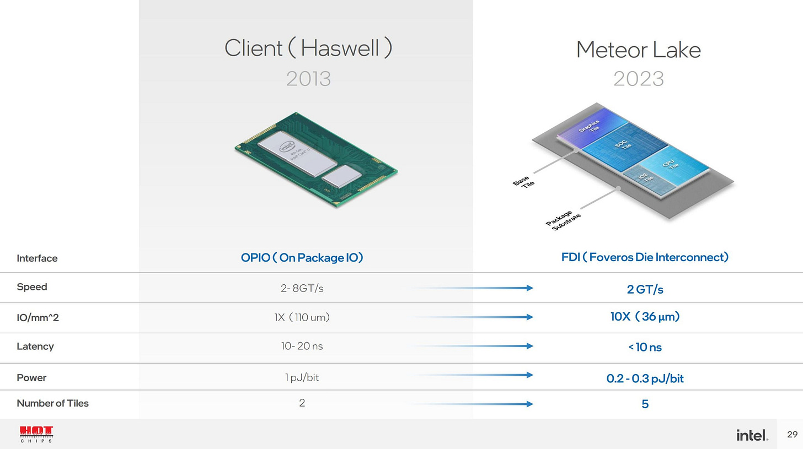

Intel 对 latency 只给 `<10 ns`。AMD ISSCC 2020 给 CCD→IOD→CCD round-trip 为 13 FCLK、低于 9 ns；按 DDR4-2933 coupled 的 1.46 GHz 是约 9 ns，1.6 GHz 为约 8 ns，1.8 GHz 为 7.22 ns。Intel 可能实际低至 2—3 ns，但若如此通常会重点宣传，因此原材料没有足够证据支持显著 latency 优势。

Bandwidth 同样模糊：`2 billion transfers/s` 未给 transfer width。只能结合使用位置推测与 OPIO/IFOP 同档，不能换算 GB/s。

## Tile 间协议透露了功能边界

FDI 没明显放在最热路径：CPU→SoC 主要是 L3 miss，几十 GB/s、数百 core cycle；SoC→IOE 多为 PCIe/DisplayPort，带宽更低、latency tolerance 更高。

iGPU 隔着 SoC Tile 位于 CPU L3 另一侧。若每个 GPU request 都绕到 CPU L3，路径不合理；因此 2022 年时推测 GPU Tile 像 CPU Tile 一样，只把 private-cache miss 发到 SoC/DRAM，不再共享 CPU L3。

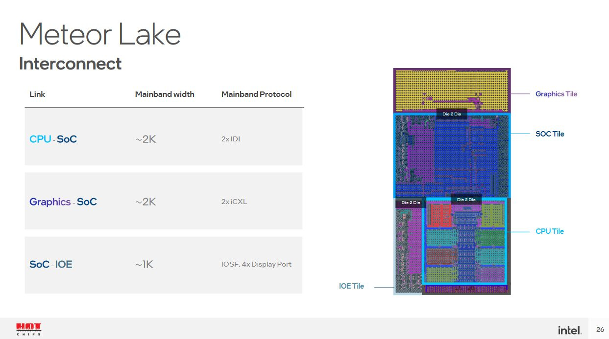

CPU↔SoC 用 IDI，GPU↔SoC 用 iCXL，SoC↔IOE 用 IOSF/DisplayPort。

IDI 自 Nehalem 起连接 core 与 Global Queue/L3，后来成为 ring/mesh 主协议，使用 MESIF；L3 slice 有 Ingress Request Queue、Ingress Probe Queue、Writeback Queue 等，packet opcode 对应精确 cache request。

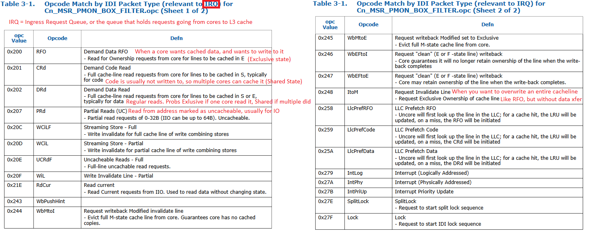

旧 iGPU 也用 IDI，天然作为 LLC agent；Haswell driver 甚至有 IDI hash mask 配 eDRAM cache。

iCXL 是不带外部 PHY 的内部 CXL。CXL 建于 PCIe，CXL.io/cache/mem 面向 I/O、coherent accelerator 与 memory expander；其 request 有些类似 IDI remote request，却缺少 core→L3 常见 DrD/Crd/RFO 等，且基本 coherency 是 MESI，没有 IDI MESIF 的 Forward state。

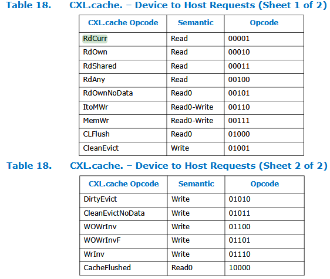

因此 protocol 与 layout 共同支持“不再共享 CPU L3”的推断。它在 2022 年仍是依据公开 slide 的分析，不是当时的官方明确声明。

### 体系结构视角：协议不是换一个名字那么简单

IDI opcode 与 L3 slice 内部 queue/状态机一一对应，适合低延迟 core-cache traffic；CXL.cache 面向通用 device coherency，语义与路由更抽象。跨协议 bridge 若要把每个 GPU request 转成 IDI，会增加 state、buffer 和 latency。设计若把 GPU private cache 做大、只让 miss 跨 tile，就能把复杂链路移出高频路径。

## iGPU 不共享 CPU L3，未必是回退

移出 CPU ring 可减少 ring stop、降低 CPU L3 latency/energy，并让 GPU 活动时整个 CPU Tile 休眠。GPU 侧 LLC hitrate 也可能不高。

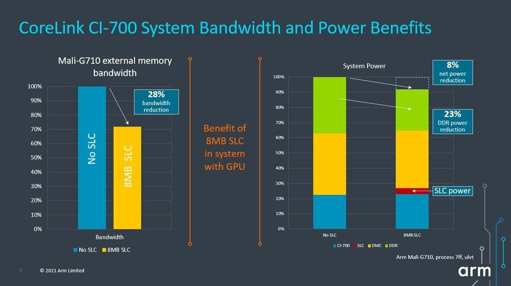

AMD 也曾显示 GPU Infinity Cache 小于 16 MB 时 hitrate 不佳。

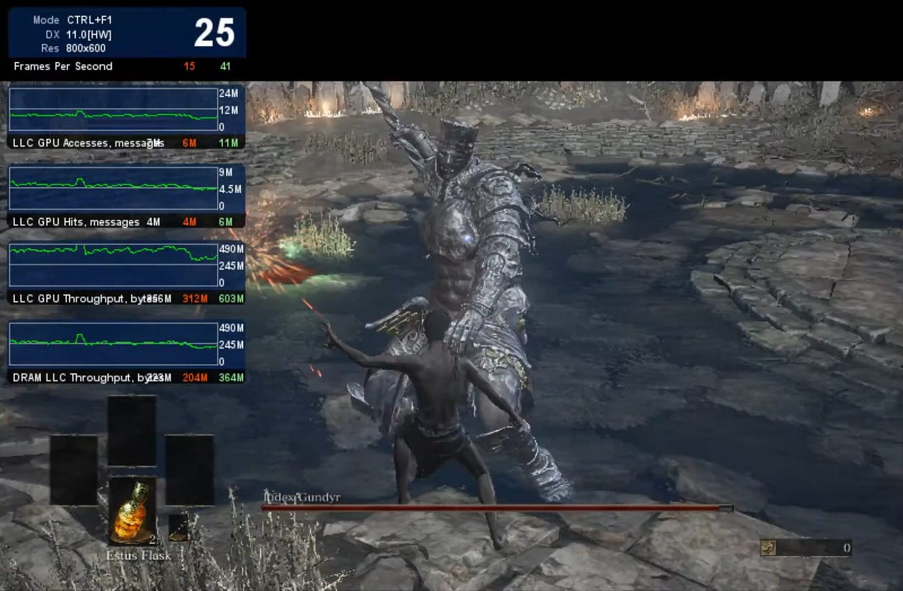

按 bytes 推算 hitrate 很低；message count 会给更高值，但 Intel 说明部分 metric 可能不准，因此只能做佐证。

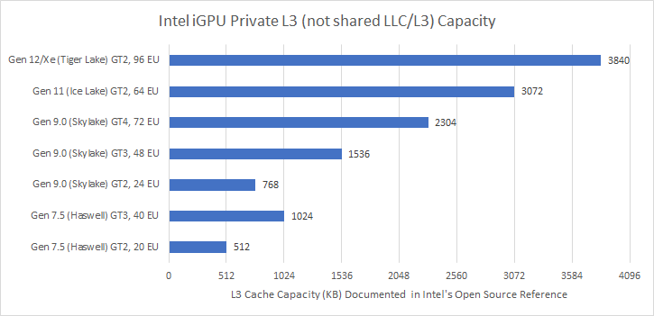

低 hitrate 时，每次先查 CPU L3、再去 DRAM，不仅增延迟，还会把返回 line 填进 L3，与 CPU 争容量和带宽。较新 Xe private cache 已大于 Vega/RDNA2 iGPU，接近部分中端独显；RTX 3060 L2 为 3 MB。Renoir/Cezanne 仅有 1 MB GPU L2，且不共享 CPU L3，也能给出竞争性能，说明独立 GPU cache hierarchy 可行。

## 更准确的类比：低功耗版 AMD Chiplet，而非跨 Die L3 Mesh

Meteor Lake 物理很紧密，却不是 Sapphire Rapids 那种把 L3 mesh 延伸跨 die 的高带宽、低延迟连接。

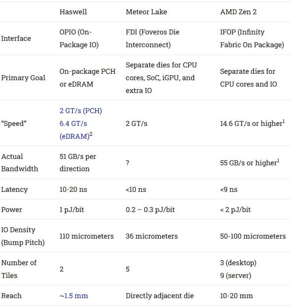

更像低功耗 IFOP：IOE 处理 PCIe/DP；GPU private cache 和 CPU L3 分别过滤大多数 traffic，只有 miss 跨 FDI。

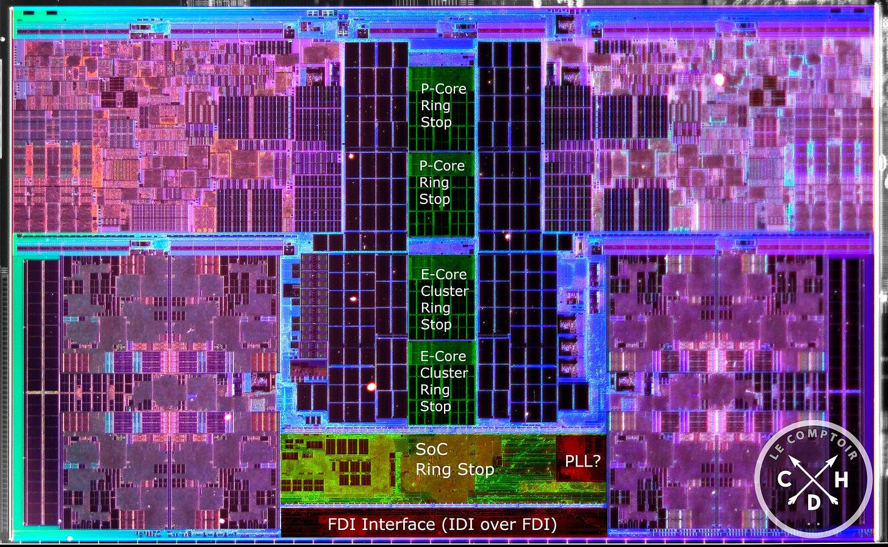

SoC 可能作为 CPU ring stop，只把目的地为 SoC 的 IDI packet 送跨 die，热 core↔L3 traffic 留在 CPU Tile。E-Core 靠近 SoC，die edge 前有大量逻辑，可能包含 queue/arbitration；均为 floorplan 推断。

2022 年时还进一步推测：ring 完全位于 CPU die、stop 只服务 core/L3，或许像 Zen 3 一样改善 L3。后续实测可能与此期望不同，但本篇应保留当时观点，而不是用后来结果倒改。

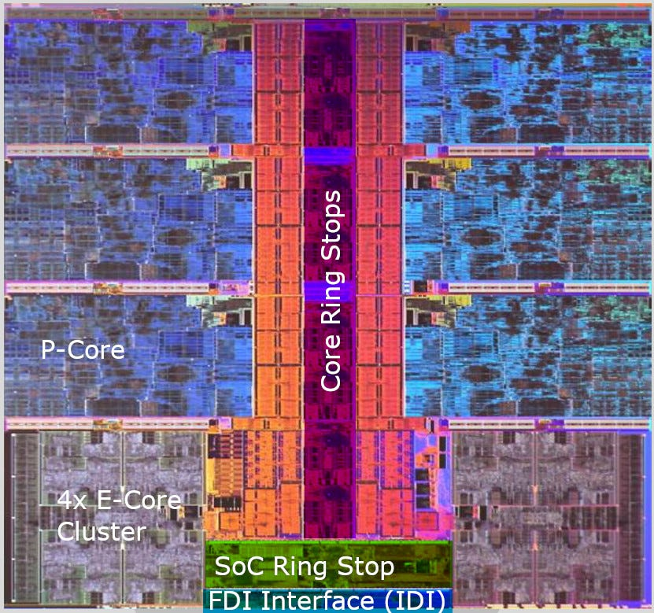

## 结语

Meteor Lake 可让 Intel 把 chiplet 带入严格 mobile power envelope。2022 年当时传闻 Dragon Range 会复用桌面 chiplet，AMD 又称 15—45 W Phoenix Point 使用“AMD chiplet architecture”；细节不足，只能说 AMD 也可能发展更接近 Foveros 的低功耗实现，不能当作确认布局。

Intel 分解程度更高，GPU/IOE 独立；AMD 把这些放 IOD。更细拆分增加 tile reuse 潜力，也增加封装成本与接口依赖。

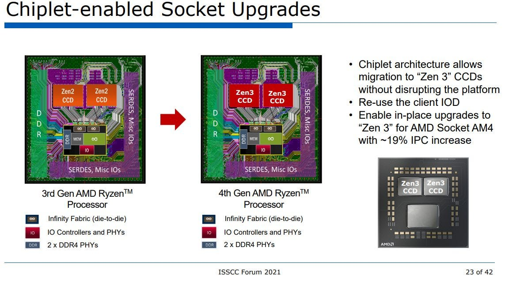

Hot Chips 资料当时真正能确认的是四 Tile、passive base die、FDI 与各接口 protocol；链路宽度、精确 latency、iGPU LLC 行为和 CPU Tile queue 组织仍有大量推断。文章参考 S. Naffziger 等 ISSCC 2020 AMD Chiplet 论文，以及 K. Nasser 等 2014 Haswell 论文。
