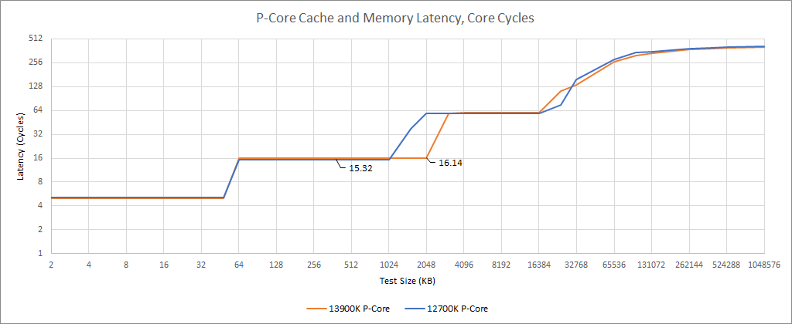
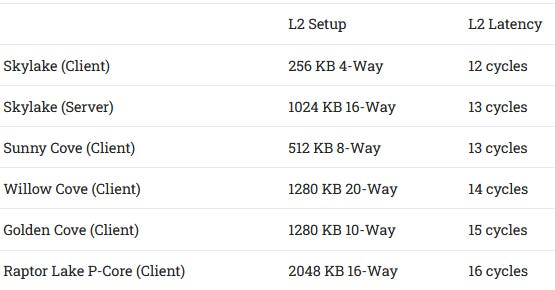
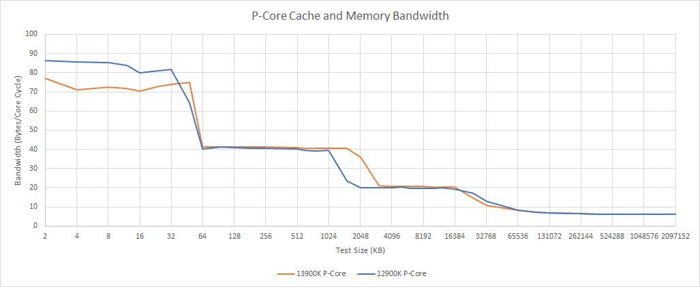
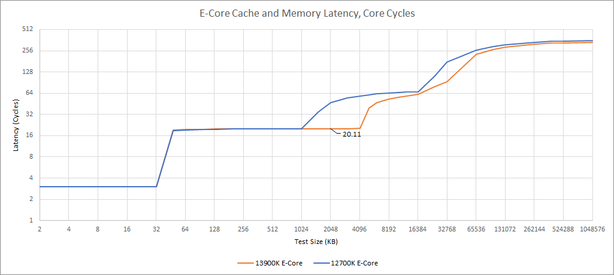
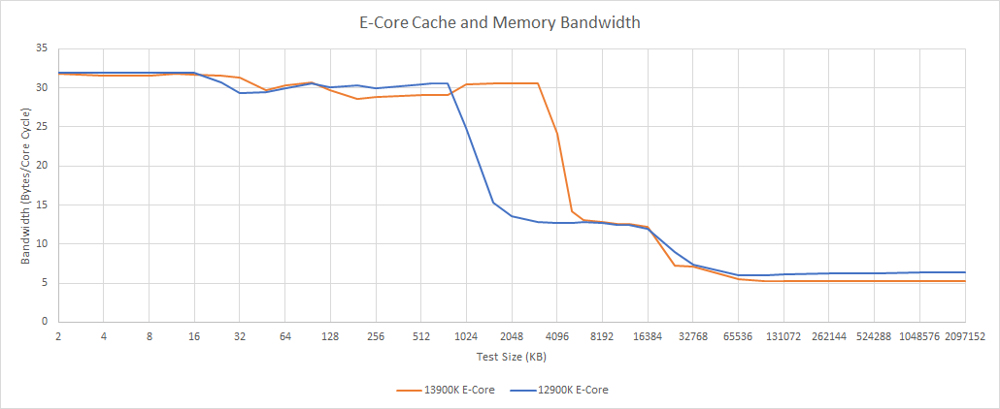
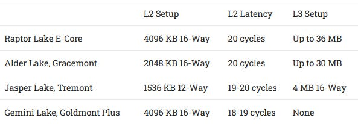

# Raptor Lake 的 L2 缓存预览：容量翻倍之外，更重要的是减少片上搬运

> 英文标题：A Preview of Raptor Lake’s Improved L2 Caches 
> 撰文：Chester Lam 
> 首发：Chips and Cheese，2022 年 8 月 23 日 
> 原始链接：https://chipsandcheese.com/p/a-preview-of-raptor-lakes-improved-l2-caches

缓存决定的不只是命中延迟。处理器把数据留在离核心更近的位置，也能减少环形总线流量和片上搬运功耗。这里使用一颗 Raptor Lake 工程样品的部分测试数据，观察 P-Core 与 E-Core 集群的 L2 变化。

这颗样品并非零售版本。由整数加法延迟反推，P-Core 约为 4.9 GHz，E-Core 约为 3.72 GHz；频率和其他实现状态都可能尚未定型。因此测试把结果按核心周期归一化，重点只看 L2。L1 没有变化；L3 受未定型的环形总线频率影响，内存结果又取决于内存配置，都不适合据此下确定结论。

## P-Core：2 MB L2，代价只有一个周期

图 1 的工作集跨过各级缓存容量时会形成延迟台阶。测试显示，Raptor Lake P-Core 的 L2 从 Alder Lake 的 1.25 MB 增至 2 MB，命中延迟只增加 1 个周期。Golden Cove 级别的大型乱序窗口通常能够吸收这种小幅延迟增加；更大的收益是更多访问停留在 L2，而不必进入延迟、带宽与能耗成本都更高的 L3。

图 2 表明 Intel 连续几代都在扩大 L2，同时接受小幅延迟上升。这个趋势不能简化为“容量越大越好”：设计必须同时满足频率、相联度、访问端口和功耗约束。本次工程样品上的 1 周期差异，至少说明 2 MB 容量没有换来剧烈的关键路径代价。

L3 延迟可能也变化了约 1 个周期，但 L3 位于 uncore 时钟域，核心频率和 ring/uncore 频率都未最终确定，因此这点差异不值得过度解读。

图 3 把带宽按核心周期归一化。L2 与 L3 的每周期带宽基本不变；L1D 略低，较合理的处理是把它视为工程样品噪声，而不是新核心退化的证据。换句话说，这次可确认的主要变化是容量，而不是每周期数据通路吞吐。

### 体系结构视角：为什么大 L2 能同时服务性能和功耗

L2 命中比 L3 命中少经过 ring stop、共享切片和一致性路径。对一次访问来说，它缩短的是单次延迟；对持续负载来说，它减少的是环上请求、返回数据和仲裁占用。乱序执行可以用更多独立访存掩盖若干周期的 L2 延迟，却很难免费掩盖一次更长的 L3 miss。因此，大型乱序窗口与更大的 L2 并不重复：前者吸收命中延迟，后者减少长延迟事件本身。

验证这类变化时，应同时看 L2 miss、L3 lookup、环上流量、stall cycles 和能耗，而不能只盯固定频率下的 IPC。容量增大可能只带来不到 1% 的平均 IPC，却显著降低共享结构流量，进而给高频运行留下功耗空间。

## E-Core：集群共享 L2 从 2 MB 翻倍到 4 MB

Raptor Lake 的四核 E-Core 集群获得 4 MB L2，是 Alder Lake 的两倍；实测延迟仍为 20 个周期。

图 4 显示容量增加没有伴随可见的 L2 延迟惩罚。对 E-Core 而言，这比 P-Core 的变化更重要：E-Core 的乱序缓冲区更小，对高延迟 L3 访问的遮蔽能力更弱。L2 容量翻倍而延迟不变，因而更可能形成直接、稳定的 IPC 收益。

从 E-Core 测得的 16 MB 工作集延迟，Core i7-12700K 为 17.68 ns，Raptor Lake 工程样品为 16.64 ns；后者按周期与时间看都更低。但 Alder Lake E-Core 侧 L3 延迟超过 60 周期，而两代样品的核心与 uncore 频率又不同，所以 1.04 ns 的差异只能看作积极信号，不能当作最终产品规格。

图 5 同样没有显示 L2/L3 每周期带宽发生实质变化，最显眼的是 4 MB 容量边界。新 L2 的价值主要来自更高命中率，而不是提高单个 E-Core 的端口宽度。

Atom 系列的 L2 演进并非单向扩容。Goldmont Plus 时，L2 本身就是末级缓存；Atom 成为混合处理器里的 E-Core 后接入 ring，并在其后获得 L3，L2 miss 不再必然付出数百周期的 DRAM 代价，因此 Alder Lake 可以使用较小的 2 MB 集群 L2。Raptor Lake 又把它扩到 4 MB，是因为共享 L3 容量虽增大，E-Core 侧延迟也已很高。

图 6 应结合缓存层级角色阅读：Goldmont Plus 的 4 MB L2 是末级缓存，Raptor Lake 的 4 MB L2 则位于共享 L3 之前；容量相同，并不代表设计目的和访问路径相同。

### 体系结构视角：E-Core 更需要避免长延迟 miss

较小的重排序缓冲区（ROB）、Load Queue 和调度窗口意味着 E-Core 更早耗尽可并行的独立工作。当 L2 miss 进入 60 周期以上的共享缓存路径，前端即使继续取指，后端也可能因寄存器、ROB 或 Load Queue 被占满而反压。扩大 L2，相当于减少这类让全流水线等待的长尾事件。

四核共享 L2 也有另一面：容量利用率和面积效率较好，但多核并发时要经过集群仲裁，吞吐、bank 冲突与公平性可能成为瓶颈。本次曲线只能支持容量和宏观带宽判断，不能从中确认 bank 数、端口数或内部互连位宽。

## 模拟结果：IPC 不大，miss 和片上流量降得更多

文章还用 ChampSim 对不同缓存容量做了模拟。固定频率下，P-Core 与 E-Core 配置的平均 IPC 提升都低于 1%，而 L2 miss 分别减少 14.55% 和 16.05%。模拟设置可能低估实际收益，且它不能替代最终芯片上的完整应用测试；不过两组指标的差异恰好说明，缓存扩容的价值不应只用 IPC 衡量。

更少的 L2 miss 意味着更少数据穿越 ring，也能降低共享 L3 的压力。高性能 CPU 往往受整包功耗限制，省下的数据搬运功耗可以转化为更高的可持续频率。核心频率升高时，ring 往往无法同比例提速；更高的 L2 命中率还能减少由核心/uncore 频率差扩大造成的 IPC 损失。

## 结语

Raptor Lake 的缓存更新是一种稳健演进：P-Core 的 L2 增至 2 MB，只多 1 周期；E-Core 集群的 L2 增至 4 MB，仍维持 20 周期。工程样品上的每周期带宽没有明显变化，L3 数据则受未定型频率限制，不能过度解读。

ChampSim 给出的平均 IPC 增益不足 1%，但 L2 miss 下降约 15%—16%。真正重要的图景是：更大的私有或集群缓存减少共享互连流量、降低搬运能耗，并让核心在高频下少受 ring 拖累。即使核心本身没有大改，这种层级调整仍可能同时改善最终性能和能效。

测试由 Seby 完成。工程样品、频率归一化和模拟 trace 都构成明确的可比性边界；正式零售芯片仍需在固定内存、固定 ring/core 频率和真实应用中复测。
