# Sandy Bridge：Intel 现代高性能核心的地基

> **文章来源**
>
> - 文章：*Sandy Bridge: Setting Intel’s Modern Foundation*
> - 撰文：Chester Lam
> - 首发：Chips and Cheese
> - 发布：2023 年 8 月 5 日
> - 链接：https://chipsandcheese.com/p/sandy-bridge-setting-intels-modern-foundation

处理器公司通常在成熟设计上迭代，因为一次改变太多模块会增加验证和调优风险。Pentium 4 与 Bulldozer 都曾彻底转向，却没有成功；Sandy Bridge 则是少数“重做地基”并获得长期回报的例子。它吸收 P6 和 NetBurst 的经验，却不属于任一旧路线。十多年后的 Intel 高性能 Core 仍能追溯到这套基础，AMD Zen 与 Arm 大核也采用了相似的 Op Cache 或 Distributed L3 思想。

## 结构总览：仍是四宽，关键在于更会“喂”

Sandy Bridge 是 4-wide Out-of-order Core，三个 ALU Port、两个 AGU Port。Core 2 与 Nehalem 也有相同名义宽度和端口数。真正差异不在“有多少执行单元”，而在 Branch Prediction、Instruction Delivery、乱序资源与 Cache 能否持续提供工作。

*图 1：四宽 Frontend、Micro-op Cache、PRF-based Backend、六个标号 Port 和两级私有 Cache 构成后来 Intel Core 的基本轮廓。图中容量是资料与测试汇总，不是 RTL。*

## Branch Prediction：更长历史，更大 BTB

Sandy Bridge 相比 Nehalem 能识别长得多的 Pattern。Microprocessor Report（MPR）称，其 History Table 不再为每项使用经典 2-bit Counter，而是 1-bit Counter，并让多项共享一个 Confidence Bit；相同存储预算因此能容纳更大表。

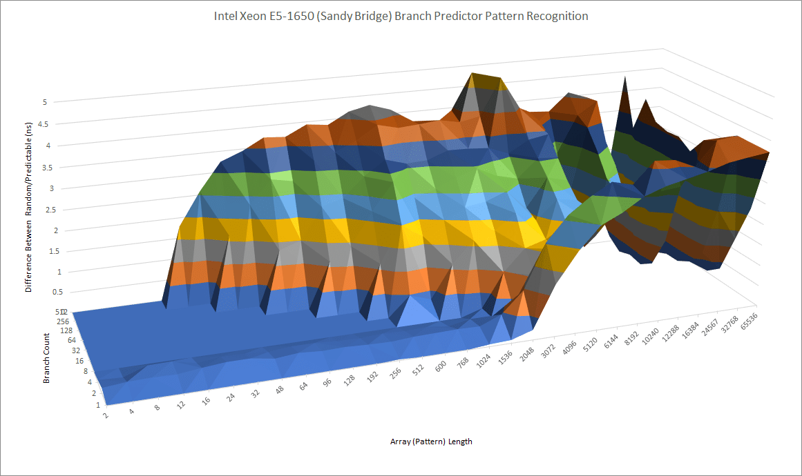

*图 2：在少量难 Branch 下，更大历史表可学习更长 Pattern。曲线显示能力提升，但不能仅凭测试反推出完整 Predictor Algorithm。*

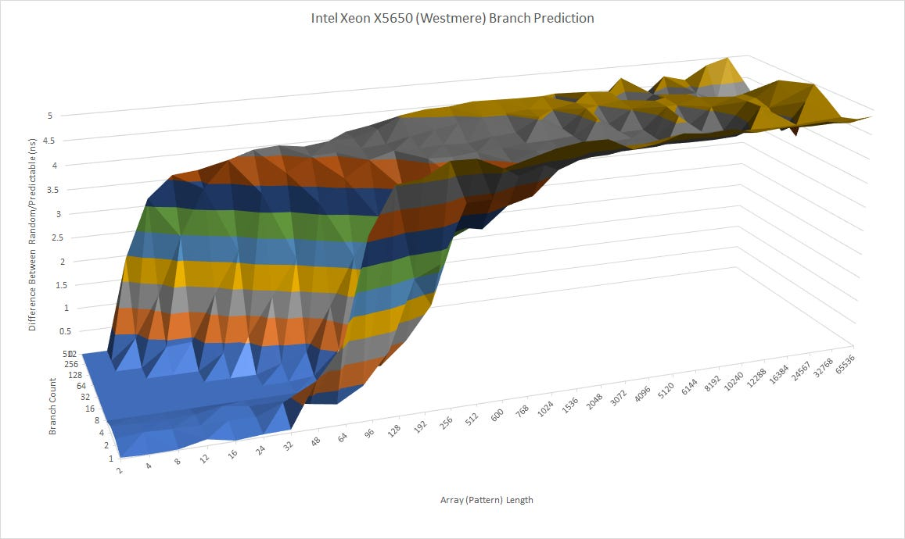

*图 3：Branch Footprint 增大后，大表也更不易发生 Destructive Aliasing。Sandy Bridge 的投机窗口更远，更需要这类准确率升级。*

BTB 不直接保存完整 Target，而是保存相对当前 Program Counter 的 Offset。多数 Branch 跳转距离短，Entry 可更紧凑。MPR 所称 Nehalem“64-bit BTB Entry”很可能指 Tag/State 在内的总 Entry，而非 64-bit Target；x86-64 当时只用 48-bit Virtual Address、Nehalem Physical Address 也仅 40 bit，上 16 bit 作为 Target 会恒为零。

Sandy Bridge 把主 BTB 从 Nehalem 的 2048 增至 4096 Entry，却没有增加可见访问代价。相比之下，Bulldozer 从 K10 的 2048 扩到 5120，需要另加更慢一级 BTB。

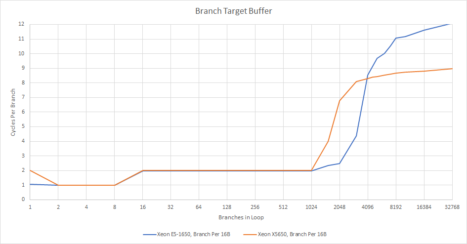

*图 4：主 BTB Latency 为 2 cycle，与 Bulldozer 512-entry L1 BTB 相同，远快于其 5-cycle L2 BTB。测试未能直接跑满 4096 项，但 Matt Godbolt 在 Ivy Bridge 测得 4096、Nehalem 2048，支持文献容量。*

2-cycle Target Latency 仍会让 Taken Branch 后损失一拍。Sandy Bridge 可让最多八个 Branch 以 1-cycle Latency 处理，可能依靠极快 L0 BTB；AMD 到 2017 年 Zen 才获得类似能力。

Return Stack 为 16 Entry，多数调用嵌套足够；Bulldozer 为 24，深层递归更有余量，但继续增大存在边际收益。Indirect Branch 更难：Sandy Bridge 可跟踪 64 个各有两 Target 的 Branch，共 128 Target；单个 Branch 最多在 24 个 Target 中选择。

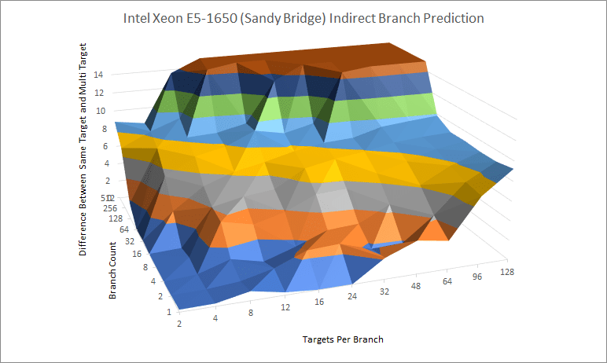

*图 5：Return 是可用 Stack 特判的间接跳转；Virtual Method Call 等多目标 Branch 则需 History/Target Association。数字为微基准可见能力，不等同于阵列的简单行列数。*

### 体系结构视角：方向、目标和 Return 是三类预测问题

Direction Predictor 决定 Taken/Not-taken；BTB 提供 Target；RAS 利用 Call/Return 的栈结构；Indirect Predictor 处理一个 PC 对应多个 Target。任一层晚到都可能触发 Override，即使方向最终正确。要解释 Frontend Bubble，应分别测 MPKI、Target Miss、Indirect Mispredict、Return Mispredict 和 Redirect Latency。

## Fetch/Decode：1536-entry Op Cache 与四条供给路径

Sandy Bridge 在 Nehalem 传统 Fetch/Decode 之外增加 1536-entry、8-way Micro-op Cache，保存已经 Decode 的指令。它像 NetBurst Trace Cache 一样降低功耗和延迟，却不缓存预测 Trace，而让 Cache Line 对应 32-byte Aligned Memory Region，避免同一指令因不同 Trace 被重复保存。

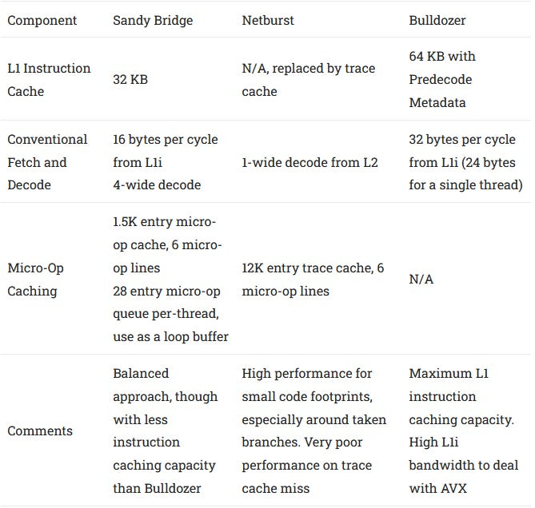

*图 6：英文正式图注为“不同前端方式汇总”。Sandy Bridge 可从 Loop Stream Detector、Op Cache、L1I 或 L2 等路径供给；每条路径覆盖范围、带宽与功耗不同。*

Op Cache 追求速度而非最高存储效率。它用 Virtual Address 查找，无需先等地址翻译；为维持 VA/PA 映射一致性，L1I 和 iTLB 对 Op Cache 保持 Inclusive 约束。iTLB Miss 会隐含 Op-cache Miss，iTLB Eviction 也可能 Flush Op Cache。某些指令模式无法 Fill。

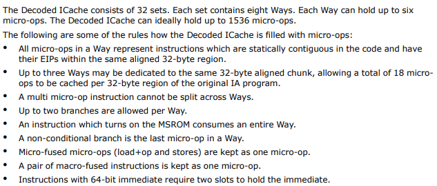

*图 7：英文正式图注说明来自 Intel Optimization Manual。Op Cache 是传统路径的增强，不是完全替代。*

Intel 只在 Branch 后切换到 Op Cache，避免在可能低 Hit Rate 时持续查 Tag 浪费功耗。小 Footprint、较长指令的 Dense AVX Kernel 最适合它。

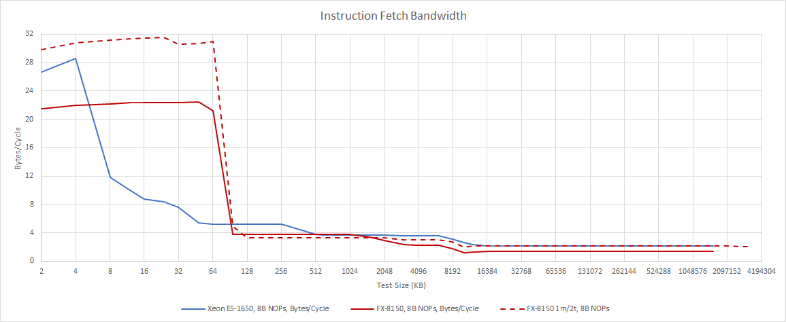

*图 8：正式图注说明使用 8-byte NOP。命中 Op Cache 时，长 x86 指令不再受 L1I Byte Supply/Decode 限制。*

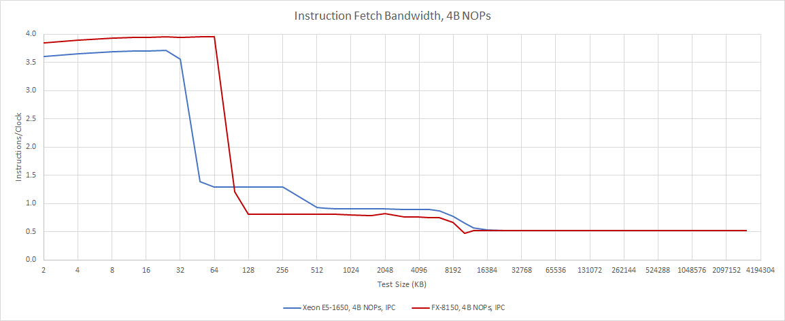

*图 9：进入传统 L1I/Decoder 路径后吞吐陡降；约 4-byte 指令时仍可较好供给，而典型 Integer Code 平均略短于 4 B。*

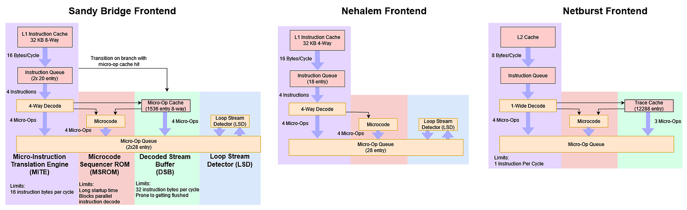

*图 10：溢出 L1I 后再次下降，但仍优于当时竞争者；Bulldozer 的大 L1I 降低发生频率，却在 L2 Fetch 时更吃力。正式图注还指出，Zen 4 加 Loop Buffer 后，供给组合与 Sandy Bridge 更相似。*

### 体系结构视角：多路径前端是在做延迟分层

Loop Path 覆盖极小热点，Op Cache 覆盖 Decode 后热点，L1I/L2 处理更大 Footprint。Hit 时绕开高功耗 Variable-length Decode，Miss 时逐级降速，而不是完全停住。今天 Arm 与 AMD 大核采用相似组合，说明复杂性换来的 Coverage/Power/Latency 分层具有长期价值。

## Rename 与 PRF：为 256-bit AVX 重做乱序数据流

Rename 消除 False Dependency。Sandy Bridge 能识别 Zeroing Idiom，让结果不依赖旧值；尚不能做 Register-to-register Move Elimination，这要到 Ivy Bridge。

Backend 则是全新 Physical Register File（PRF）方案。P6 把结果存 ROB、退休时复制进 Architectural RF，Scheduler 似乎还保存 Source Value；早期 80-bit 数据尚可，Nehalem 128-bit SSE 已有压力。Sandy Bridge 的 256-bit AVX 若继续搬运大 Value，面积和功耗都会迅速上升。PRF 只在阵列保存数据，ROB/Scheduler 传 Physical Register Pointer，使 Intel 能同时做 Full-width AVX 与更大乱序窗口。

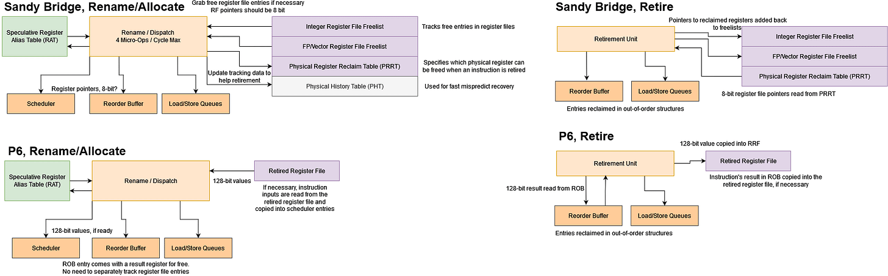

*图 11：英文正式图注强调是过度简化示意；Core 2 后 Value 可达 128 bit，早期 P6 最大约 80 bit。PRF 减少 Value Copy，不表示 ROB 消失——ROB 仍负责程序顺序、异常与 Retirement。*

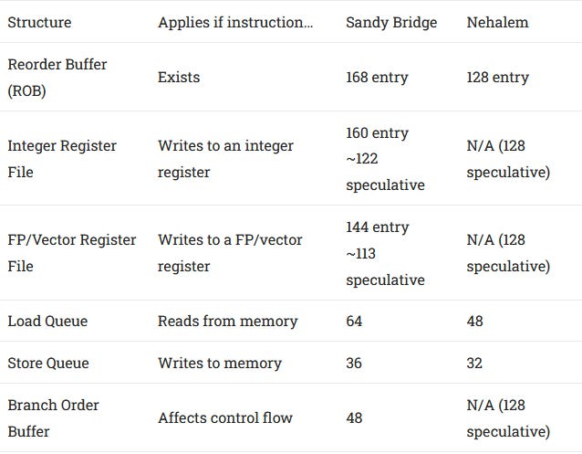

*图 12：更大的 ROB/PRF 让核心跨越更长 Latency 寻找独立工作，但真正 Window 由最先耗尽的 Resource 决定。*

Intel 还使用 Physical Register Reclaim Table（PRRT），在指令退休时告诉 Retirement 哪个旧 Register 可回收；它没有覆盖整个 ROB 的足够 Entry。

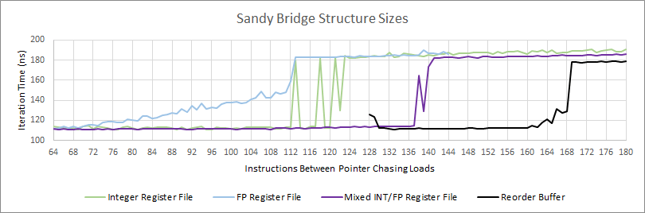

*图 13：采用 Henry Wong 方法测量。即使目标 RF 仍有空项，总分配 Register 数也可能先被 PRRT 限制。微基准拐点是资源组合的可见容量，不应等同为某个阵列的 RTL 深度。*

### 体系结构视角：PRF 把“值的位置”与“程序顺序”分开

Rename Map 指向新 Physical Destination，ROB 保留顺序与异常状态，Scheduler 只跟踪 Operand Ready/Tag。正常退休时释放旧映射；Mispredict/Exception 时恢复 Rename State 并丢弃年轻指令。PRRT 不足会在 Register-heavy Code 中提前 Stall，即使 ROB 尚空，说明任何一个辅助结构都可能截断理论 Window。

## Execution：六个标号 Port，实际可看成三算术加两地址

Ready Micro-op 送到六个 Execution Port。Port 0/1/5 主要 Math，Port 2/3 生成 Memory Address；另一 Port 只送 Store Data。Intel Store 同时占 AGU 与 Store-data Port，所以后者不会把每周期 Memory Instruction 数独立加一。

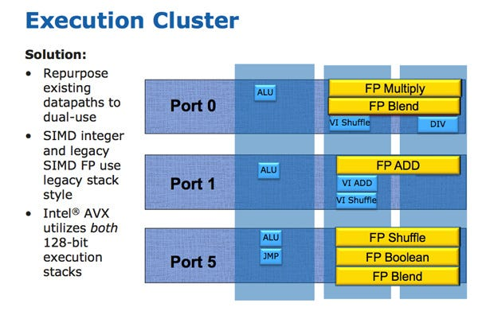

*图 14：多数 Unit 分布合理，Vector/FP 有明显热点。所有 Vector Shuffle 与 Branch 集中在 Port 5；FP Multiply/Add 分别容易压 Port 0/1。相较当时前代并不差，但后续核心会增加可达路径。*

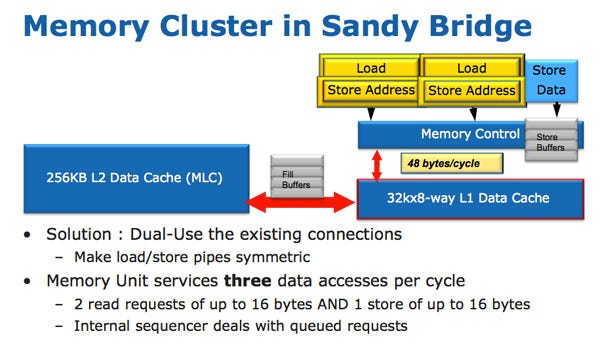

*图 15：正式图注注明来自 IDF 2010。两条 AGU 都能处理 Load 或 Store，避免旧设计的专用管线失衡。*

Memory 侧两条 AGU 都能 Load 或 Store，优于前代“一条 Load 专用、一条 Store 专用”。Load 通常多于 Store，通用 AGU 减少一边繁忙、另一边空闲。

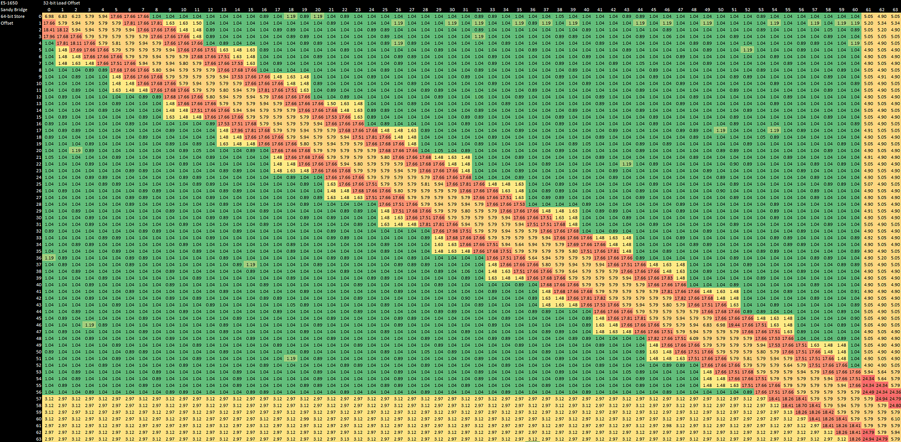

*图 16：成功 Forward 为 5～6 cycle；Partial Overlap 为 17～18 cycle，跨 Cache Line 时 24～25 cycle。Vector Forwarding 更弱，只能转发 128-bit Store 的低/高一半，延迟 7～8 cycle。*

## Memory Disambiguation：快转发与 Partial-overlap 慢路

Load/Store Unit 必须保证内存依赖正确。Load 与更早在途 Store 重叠时，应从 Store Buffer Forward。Nehalem 已能处理 Store 完全包含于后续 Load 的多种情况；Sandy Bridge 似乎分两步比较：先快速检查是否落在同一 4-byte Aligned Region，重叠后再做完整检查。

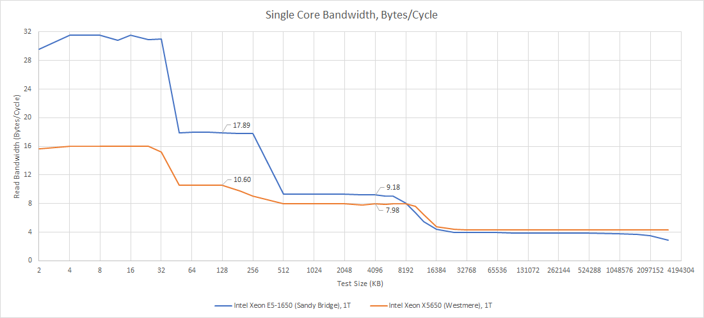

*图 17：灵活 AGU 让 L1 Load Bandwidth 达到 Nehalem 两倍；L2 也提高，但离理论 32 B/cycle 尚远。*

Virtual Memory 通过 64-entry L1 DTLB 提供零额外 Cycle Translation；Miss 后查 1024-entry L2 TLB，额外 7 cycle。跨 Page 更复杂：Split-page Load 36 cycle、Store 25 cycle；Store 跨页后不能 Forward，惩罚约 36 cycle；Load/Store 都跨页可到 53 cycle。现代核心进一步改善，但 Sandy Bridge 已远优于同期 AMD。

### 体系结构视角：Forwarding 失败为何特别贵

地址未完整确定时，核心可能先猜 Load 与旧 Store 无依赖。若比较发现重叠，完全覆盖可直接从 Store Queue Bypass；Partial Overlap 需要拼接或 Replay；跨 Cache Line/Page 还可能触及两组 Tag、TLB 与 Permission。失败会取消年轻 Load 及其依赖链，既增加单次延迟，也损失投机吞吐。可用 Offset×Size Matrix、Replay Counter 与 Page-boundary Case 验证。

## Cache 与 Ring Bus：真正奠定多核扩展方式

Nehalem 起采用三级 Cache。Sandy Bridge 的灵活 AGU 让 L1 Load Bandwidth 达到 Nehalem 两倍；L2 也提高，但离理论 32 B/cycle 尚远。

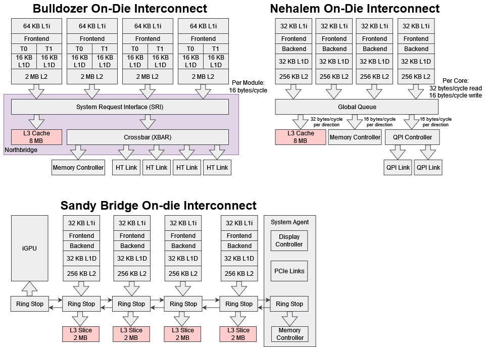

*图 18：Westmere 六 Slice/12 MB L3 由中央 GQ 管理；Sandy Bridge 把 Lookup/Tracking 分散到各 Slice，再用 Ring Bus 相连。每 Slice Scheduler 更小，可按 Core Clock 运行。*

Westmere/Nehalem 在 L3 前使用中央 Global Queue（GQ），统一跟踪 Request，较易实现和验证，却难扩展：Core 越多，Entry/扫描和低延迟 Arbitration 压力越大；所有请求还必须绕到 Die 中央，即便目标 Slice 就在附近。

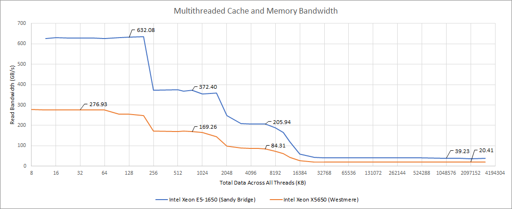

*图 19：E5-1650 每 Core 超过 9 B/cycle，X5650 仅 4.7 B/cycle。分布式 Slice 和 Ring Bus 带来接近两倍 Per-core Shared-cache Bandwidth。*

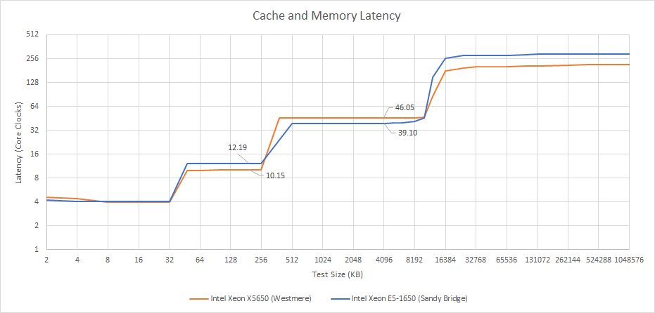

*图 20：Sandy Bridge 约少 7 cycle；Request 可直接到拥有 Line 的 Slice，较小 Arbiter 也可能帮助。L2 则比 Nehalem 多 2 cycle，为 12 cycle，但更高 Clock 下 Absolute Time 接近。*

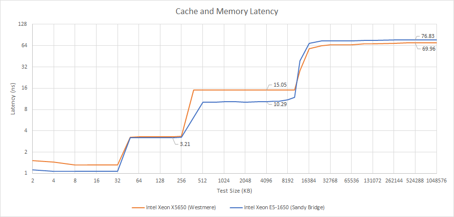

*图 21：英文正式图注称 Sandy Bridge 在 L3 Latency 上大胜 Westmere。12 MB Cache 约 10.3 ns，是非常突出的结果。*

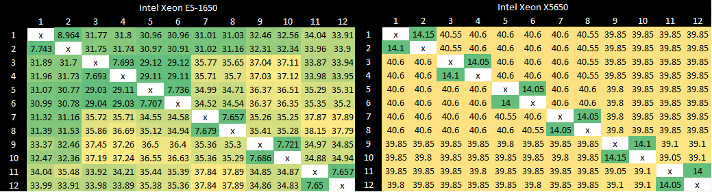

*图 22：英文正式图注说明 Sandy Bridge 与 Nehalem/Westmere 都让 L3 充当 Probe Filter，在 Cache Line 旁保存各 Core Valid Bit。*

L3 还充当 Probe Filter，为每条 Line 保存 Core-valid Bit。Sandy Bridge 核间延迟会随 Core 到 Home Slice 的距离变化；Nehalem/Westmere 所有请求经中央 Arbiter，较均匀却整体更高。E5-1650 最坏情况仍优于 X5650 最好情况。Ring Bus 后来长期留在 Intel Client，AMD Zen 3 也采用环形组织。

### 体系结构视角：分布式目录把一个大仲裁问题拆成多个小问题

中央 Queue 简单但随 Outstanding Request 与 Core Count 放大。把 Tag/Directory/Request Tracking 分散到 Slice 后，访问距离不再均匀，却能并行 Arbitration，并让每个节点只处理局部压力。环形拓扑适合中等 Core Count；继续增加节点后，Hop Latency、Stop Bandwidth 和最远距离会促使设计转向 Mesh。

## 最后的评价：为什么这套设计用了十多年

Sandy Bridge 今日基准性能自然落后，却仍能应付日常任务，因为关键环节都没有明显失衡：Predictor 好，OoO Buffer 配比合理，Penalty 少，Cache 延迟低且带宽够。现代核心在各项上更强，却往往是在追逐边际收益。

它的短板通常只在特定程序暴露：Execution Port 数比下一代以后显得少，核心也不够宽。但“喂饱资源”比简单增加资源更重要，少几个 Port 并未破坏整体平衡。

更难得的是，当时 Intel 只需小改 Nehalem 就足以胜过 Bulldozer，却仍大胆推出新设计。之后多年稳步迭代，让 Intel 在高端市场长期无对手。今天 Intel 处境不同，但公司曾从 Pentium FDIV、NetBurst 等挫折中恢复；Sandy Bridge 正是吸收 P6 与 NetBurst 两条路线经验后的成果。

### 体系结构视角：从 Sandy Bridge 可以看到的六点认识

第一，名义宽度不是核心竞争力。四宽、三 ALU、两 AGU 与前代相近，性能来自 Predictor、Op Cache、PRF 和 Cache 共同供给。

第二，多路径 Frontend 是现代大核的长期模板。Loop、Op Cache、L1I、L2 用不同容量和功耗覆盖不同 Instruction Footprint。

第三，PRF 是宽 Vector 与大 Window 的基础。它让 ROB 保留顺序、RF 保存 Value、Scheduler 传 Tag，减少 256-bit 数据搬运。

第四，快路径必须配慢路。1-cycle L0 Target、Op-cache Hit、Store Forwarding 与 DTLB Hit 都很快；容量 Miss、Partial Overlap、跨页则逐级付费。

第五，分布式 L3/Ring 让共享 Cache 随核心扩展。代价是 Non-uniform Latency，但总体 Bandwidth 与最坏延迟都优于中央 GQ。

第六，成功的 Architecture 常来自资源平衡而非某项极端参数。Sandy Bridge 很少让一个薄弱结构长期拖住其他模块，因此成为可持续迭代的地基。

## 参考资料

- Chips and Cheese：[*Sandy Bridge: Setting Intel’s Modern Foundation*](https://chipsandcheese.com/p/sandy-bridge-setting-intels-modern-foundation)
- Linley Gwennap：*Sandy Bridge Spans Generations*，Microprocessor Report
- Intel Technology Journal：*The Uncore: A Modular Approach to Feeding the High-Performance Cores*，Vol. 14, Issue 3
- Intel：Optimization Manual 与 IDF 2010 Slides（正文援引）

网页末尾还提供 Patreon、PayPal 与 Discord 支持入口。
